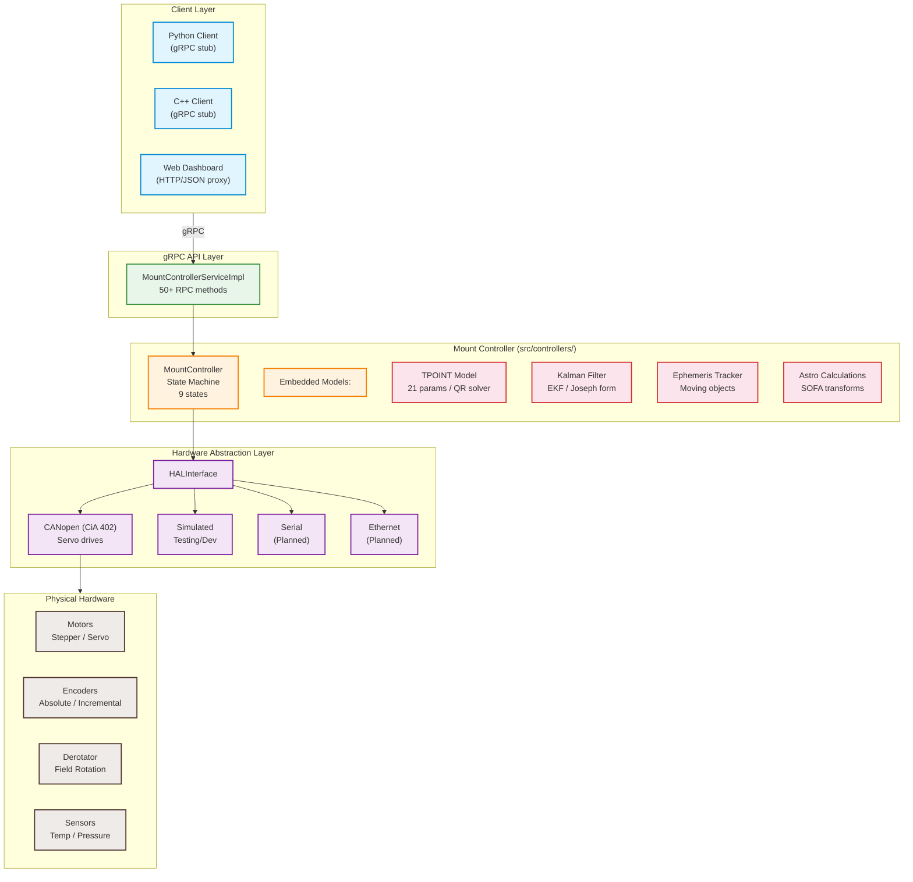

# Astronomical Mount Controller

[](.)
[](build_verify/)
[](https://isocpp.org/)
[](https://grpc.io/)
[](LICENSE)
[](docs/en/installation.md)

A high-precision astronomical mount controller with sub-arcsecond tracking accuracy, TPOINT model calibration, extended Kalman filter, CANopen/CiA 402 hardware interface, and complete gRPC API for remote operation.

---

## Features

### 🎯 Precision Tracking
- **Sub-arcsecond tracking** accuracy with real-time corrections
- **TPOINT model** (21+ parameters) for mount geometry error compensation
- **Extended Kalman filter** for continuous state estimation and calibration
- **Automatic meridian flip** with configurable hysteresis and delay
- **3-zone soft limit system** with warning, deceleration, and hard-stop zones

### 🔄 Coordinate Systems & Corrections
- **Full astronomical correction chain**: precession, nutation, aberration, light-time, gravitational deflection
- **Atmospheric refraction** (Saastamoinen model + Saemundsson formula)
- **Field rotation compensation** for Alt-Az mounts with configurable derotator
- **Equatorial ↔ Hour Angle ↔ Horizontal** transformations

### ⚙️ Hardware Abstraction
- **CANopen/CiA 402** interface for industrial servo/stepper drives
- **Simulated HAL** for testing and development (no hardware required)
- **Extensible HAL architecture** supporting Serial, Ethernet, and custom implementations
- **Absolute and incremental encoder** support
- **Derotator (field rotator)** control with homing and calibration

### 🌐 Remote Control & Integration
- **Complete gRPC API** for remote operation from any language
- **Python and C++ client libraries** with full examples
- **Object database** (SQLite + gRPC) for astronomical catalog management
- **Ephemeris tracking** for comets, asteroids, and satellites
- **Autoguider integration** (PHD2, Ekos, ASCOM-compatible)

### 🛡️ Safety & Reliability
- **11 NaN/Inf propagation guards** in tracking loop
- **State machine** with safe transitions and error recovery
- **Configurable logging** with rotation and multiple levels
- **Systemd service** integration for headless operation
- **SSL/TLS** support for secure gRPC connections

---

## Quick Start

### Prerequisites
- Linux (Ubuntu 22.04+, Debian 12+, RHEL 9+, or any distribution with C++17 support)
- C++17 compiler (GCC 11+, Clang 14+)
- CMake 3.15+
- gRPC and Protocol Buffers
- SOFA library (included as submodule)

### Build & Run

```bash
# Clone
git clone https://github.com/your-org/astro-mount-controller.git
cd astro-mount-controller

# Configure and build
mkdir build && cd build
cmake .. -DCMAKE_BUILD_TYPE=Release
make -j$(nproc)

# Run (with simulated hardware by default)
./bin/astro_mount_controller

# Run tests
ctest -V
```

### Basic Python Client

```python
import grpc
from proto import mount_controller_pb2
from proto import mount_controller_pb2_grpc

# Connect to running controller
channel = grpc.insecure_channel('localhost:50051')
stub = mount_controller_pb2_grpc.MountControllerServiceStub(channel)

# Slew to M31 (Andromeda Galaxy)
from google.protobuf import empty_pb2
coords = mount_controller_pb2.Coordinates(ra=0.7117, dec=41.2692)
stub.SlewToCoordinates(coords)

# Monitor state
state = stub.GetState(empty_pb2.Empty())
print(f"Status: {state.status}, Position: axis1={state.current_position.axis1:.4f}°")
```

---

## Documentation

| Document | Description |
|----------|-------------|
| [`docs/en/index.md`](docs/en/index.md) | Full system overview, architecture, and feature guide |
| [`docs/en/architecture.md`](docs/en/architecture.md) | Detailed architecture with component descriptions and data flow |
| [`docs/en/installation.md`](docs/en/installation.md) | Installation for Ubuntu, Debian, RHEL, OpenSUSE, ARM/Raspberry Pi |
| [`docs/en/api.md`](docs/en/api.md) | Complete gRPC API reference |
| [`docs/en/api_examples.md`](docs/en/api_examples.md) | API usage examples in C++ and Python |
| [`docs/en/examples.md`](docs/en/examples.md) | Practical usage scenarios and tutorial |
| [`docs/en/mathematical_model.md`](docs/en/mathematical_model.md) | Mathematical models: TPOINT, Kalman filter, coordinate transforms |
| [`docs/en/hal_layer.md`](docs/en/hal_layer.md) | Hardware Abstraction Layer documentation |
| [`docs/en/data_flow.md`](docs/en/data_flow.md) | Data flow diagrams for all subsystems |
| [`docs/en/developer_onboarding.md`](docs/en/developer_onboarding.md) | Developer onboarding guide |
| [`web/README.md`](web/README.md) | Web dashboard documentation (HTTP/JSON proxy + SPA) |
| [`docs/pl/`](docs/pl/) | Polish language documentation |

---

## Architecture Overview



**Key components:**
- [`src/controllers/mount_controller.cpp`](src/controllers/mount_controller.cpp) — Core controller with state machine, tracking loop, meridian flip, soft limits, and 11 NaN/Inf guards
- [`src/config/configuration.cpp`](src/config/configuration.cpp) — JSON-based configuration with 25+ field validations
- [`src/models/tpoint_model.cpp`](src/models/tpoint_model.cpp) — TPOINT pointing error model with QR decomposition solver
- [`src/models/kalman_filter.cpp`](src/models/kalman_filter.cpp) — Extended Kalman filter with Joseph form covariance update
- [`src/core/astronomical_calculations.cpp`](src/core/astronomical_calculations.cpp) — SOFA-based coordinate transforms and corrections
- [`proto/mount_controller.proto`](proto/mount_controller.proto) — gRPC service definition (50+ RPCs)

---

## Project Structure

```
├── config/           # JSON configuration files
│   └── default.json
├── docs/             # Documentation (en + pl)
│   ├── en/
│   └── pl/
├── include/          # C++ headers
│   ├── config/
│   ├── controllers/
│   ├── core/
│   ├── hal/
│   ├── logging/
│   └── models/
├── proto/            # gRPC protobuf definitions
│   ├── mount_controller.proto
│   └── canopen_service.proto
├── src/              # C++ implementation
│   ├── api/
│   ├── config/
│   ├── controllers/
│   ├── core/
│   ├── hal/
│   ├── logging/
│   └── models/
├── tests/            # Test suites (9 test binaries)
├── examples/         # Python and C++ examples
├── sofa/             # SOFA library
├── scripts/          # Build and utility scripts
├── web/              # Web dashboard (Express proxy + SPA)
└── db/               # Object database (SQLite)
```

---

## Test Status

| Test Suite | Status |
|------------|--------|
| `test_mount_controller` | ✅ 25 test groups |
| `test_tpoint_model` | ✅ 17 test cases |
| `test_astronomical_calculations` | ✅ Full coverage |
| `test_configuration` | ✅ Validation tests |
| `test_kalman_filter` | ✅ State estimation |
| `test_ephemeris_tracker` | ✅ Moving object tracking |
| `test_hal_integration` | ✅ HAL interface tests |
| `test_grpc_integration` | ✅ API server tests |
| `test_subarcsecond_accuracy` | ✅ Accuracy verification |

All **9/9 tests pass** in 18.34s with full NaN/Inf guard coverage.

---

## Contributing

1. Read the [Developer Onboarding Guide](docs/en/developer_onboarding.md)
2. Check existing [Issues](https://github.com/your-org/astro-mount-controller/issues)
3. Fork the repository and create a feature branch
4. Write tests for new functionality
5. Submit a pull request

---

## License

[MIT License](LICENSE) — see LICENSE file for details.

---

## Support

- 📖 [Full Documentation](docs/en/index.md)
- 🐛 [Issue Tracker](https://github.com/your-org/astro-mount-controller/issues)
- 💬 [Discussion Forum](https://forum.astro-mount-controller.org)
- 📧 [Email](mailto:support@astro-mount-controller.org)
