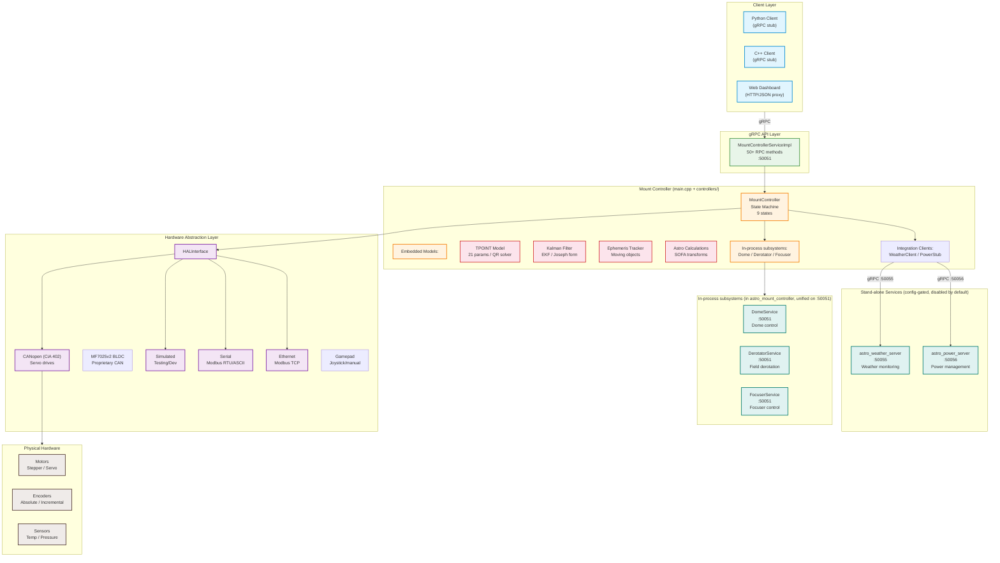

# Astronomical Mount Controller

[](.)
[](build_verify/)
[](https://isocpp.org/)
[](https://ascom-standards.org/)
[](https://indilib.org/)
[](https://grpc.io/)
[](LICENSE)
[](docs/en/installation.md)

A high-precision astronomical mount controller with sub-arcsecond tracking accuracy, TPOINT model calibration, extended Kalman filter, CANopen/CiA 402 hardware interface, and complete gRPC API for remote operation. Includes native **ASCOM** (C#) and **INDI** (C++) drivers for seamless integration with astronomy software ecosystems.

---

## Features

### 🎯 Precision Tracking
- **Sub-arcsecond tracking** accuracy with real-time corrections
- **TPOINT model** (21+ parameters) for mount geometry error compensation
- **Extended Kalman filter** for continuous state estimation and calibration
- **Automatic meridian flip** with configurable hysteresis and delay
- **3-zone soft limit system** with warning, deceleration, and hard-stop zones

### 🔄 Coordinate Systems & Corrections
- **Full astronomical correction chain**: precession, nutation, aberration, light-time, gravitational deflection
- **Atmospheric refraction** (Saastamoinen model + Saemundsson formula)
- **Field rotation compensation** for Alt-Az mounts with configurable derotator
- **Equatorial ↔ Hour Angle ↔ Horizontal** transformations

### ⚙️ Hardware Abstraction
- **CANopen/CiA 402** interface for industrial servo/stepper drives
- **MF7025v2 (LingKong BLDC)** — proprietary CAN protocol V2.36, fully stabilized (thread-safe, dead-node detection, error logging)
- **Serial HAL** — RS-232/485 Modbus RTU with CRC16 and connection monitoring
- **Ethernet HAL** — Modbus TCP with configurable retry
- **Gamepad HAL** — Linux evdev joystick with hotplug, speed presets, mock-testable
- **Simulated HAL** — for testing and development (no hardware required)
- **Extensible HAL architecture** supporting custom implementations
- **Absolute and incremental encoder** support

### 🌐 Remote Control & Integration
- **Complete gRPC API** for remote operation from any language
- **Python and C++ client libraries** with full examples
- **Object database** (SQLite + gRPC) for astronomical catalog management
- **Ephemeris tracking** for comets, asteroids, and satellites
- **Autoguider integration** (PHD2, Ekos, ASCOM-compatible)
- **ASCOM Telescope Driver** (C#, ITelescopeV3) — MoveAxis, PulseGuide, Park, TPOINT status, environmental queries
- **ASCOM Rotator Driver** (C#, IRotatorV3) — absolute/rate positioning, homing, halt
- **INDI Telescope Driver** (C++) — full Ekos/KStars integration with TPOINT_STATUS, environment, MoveNS/MoveWE
- **INDI Rotator Driver** (C++) — angle control, homing via gRPC rotator service

### 🧩 Hybrid Service Architecture (config-gated, disabled by default)
- **In-process subsystems** (hosted inside `astro_mount_controller`, all served on the unified gRPC port **50051**):
  - **Dome** ([`dome/`](dome/)) — dome control on the unified port **50051**, auto-sync with mount azimuth (fed in-process via `setMountAzimuth()`)
  - **Derotator** ([`derotator/`](derotator/)) — field derotation on the unified port **50051**, receives mount position updates in-process via `setMountPosition()`
  - **Focuser** ([`focuser/`](focuser/)) — focuser control and auto-focus on the unified port **50051**
- **Stand-alone services** (separate processes):
  - **Weather service** ([`weather/`](weather/)) — gRPC weather monitoring on port **50055**, rain/wind/cloud sensors, OpenWeatherMap/Weather.gov/IMGW API sources, auto-park on dangerous conditions, notification engine integration
  - **Power service** ([`power/`](power/)) — gRPC power management on port **50056**, battery voltage/current monitoring, low-battery auto-park
- **All integrations** are configured via `ExternalIntegrationConfig` in `config/default.json` — each has `"enabled": false` by default

### 🛡️ Safety & Reliability
- **11 NaN/Inf propagation guards** in tracking loop
- **Watchdog timer** — 5s iteration timeout → automatic ERROR state
- **CAN dead-node detection** — 5 consecutive failures → emergency stop (MF7025v2)
- **Thread-safe design** — shared_mutex + atomic flags + re-entrancy guard
- **~340 unit/integration tests** covering edge cases, concurrency, invalid inputs
- **State machine** with safe transitions and error recovery
- **Configurable logging** with rotation and multiple levels
- **Systemd service** integration for headless operation
- **SSL/TLS** support for secure gRPC connections

---

## Quick Start

### Prerequisites
- Linux (Ubuntu 22.04+, Debian 12+, RHEL 9+, or any distribution with C++17 support)
- C++17 compiler (GCC 11+, Clang 14+)
- CMake 3.15+
- gRPC and Protocol Buffers
- SOFA library (included as submodule)

### Build & Run

```bash
# Clone
git clone https://github.com/your-org/astro-mount-controller.git
cd astro-mount-controller

# Configure and build
mkdir build && cd build
cmake .. -DCMAKE_BUILD_TYPE=Release
make -j$(nproc)

# Run (with simulated hardware by default)
./bin/astro_mount_controller

# Run tests
ctest -V
```

### Basic Python Client

```python
import grpc
from proto import mount_controller_pb2
from proto import mount_controller_pb2_grpc

# Connect to running controller
channel = grpc.insecure_channel('localhost:50051')
stub = mount_controller_pb2_grpc.MountControllerServiceStub(channel)

# Slew to M31 (Andromeda Galaxy)
from google.protobuf import empty_pb2
coords = mount_controller_pb2.Coordinates(ra=0.7117, dec=41.2692)
stub.SlewToCoordinates(coords)

# Monitor state
state = stub.GetState(empty_pb2.Empty())
print(f"Status: {state.status}, Position: axis1={state.current_position.axis1:.4f}°")
```

---

## Documentation

| Document | Description |
|----------|-------------|
| [`docs/en/index.md`](docs/en/index.md) | Full system overview, architecture, and feature guide |
| [`docs/en/architecture.md`](docs/en/architecture.md) | Detailed architecture with component descriptions and data flow |
| [`docs/en/installation.md`](docs/en/installation.md) | Installation for Ubuntu, Debian, RHEL, OpenSUSE, ARM/Raspberry Pi |
| [`docs/en/api.md`](docs/en/api.md) | Complete gRPC API reference |
| [`docs/en/api_examples.md`](docs/en/api_examples.md) | API usage examples in C++ and Python |
| [`docs/en/examples.md`](docs/en/examples.md) | Practical usage scenarios and tutorial |
| [`docs/en/mathematical_model.md`](docs/en/mathematical_model.md) | Mathematical models: TPOINT, Kalman filter, coordinate transforms |
| [`docs/en/hal_layer.md`](docs/en/hal_layer.md) | Hardware Abstraction Layer documentation |
| [`docs/en/data_flow.md`](docs/en/data_flow.md) | Data flow diagrams for all subsystems |
| [`docs/en/developer_onboarding.md`](docs/en/developer_onboarding.md) | Developer onboarding guide |
| [`docs/en/drivers.md`](docs/en/drivers.md) | ASCOM and INDI driver documentation |
| [`web/README.md`](web/README.md) | Web dashboard documentation (HTTP/JSON proxy + SPA) |
| [`docs/pl/`](docs/pl/) | Polish language documentation |

---

## Architecture Overview

The system follows a **hybrid architecture**: the mount controller is the central process and hosts the dome, derotator and focuser subsystems **in-process**, while the weather, power, sequencer and object-database services run as independent processes communicating via gRPC.


```mermaid
flowchart TB
    %% Styles
    classDef client fill:#e1f5fe,stroke:#0288d1,stroke-width:2px
    classDef api fill:#e8f5e9,stroke:#388e3c,stroke-width:2px
    classDef core fill:#fff3e0,stroke:#f57c00,stroke-width:2px
    classDef model fill:#fce4ec,stroke:#d32f2f,stroke-width:2px
    classDef hal fill:#f3e5f5,stroke:#7b1fa2,stroke-width:2px
    classDef hw fill:#efebe9,stroke:#4e342e,stroke-width:2px
    classDef svc fill:#e0f2f1,stroke:#00796b,stroke-width:2px

    subgraph CLIENTS["Client Layer"]
        PY["Python Client<br/>(gRPC stub)"]
        CPP["C++ Client<br/>(gRPC stub)"]
        WEB["Web Dashboard<br/>(HTTP/JSON proxy)"]
    end

    subgraph INPROC["In-process subsystems (in astro_mount_controller, unified on :50051)"]
        DOME["DomeService<br/>:50051<br/>Dome control"]
        DEROT["DerotatorService<br/>:50051<br/>Field derotation"]
        FOCUSER["FocuserService<br/>:50051<br/>Focuser control"]
    end

    subgraph SVC["Stand-alone Services (config-gated, disabled by default)"]
        WEATHER["astro_weather_server<br/>:50055<br/>Weather monitoring"]
        POWER["astro_power_server<br/>:50056<br/>Power management"]
    end

    subgraph API["gRPC API Layer"]
        GRPC["MountControllerServiceImpl<br/>50+ RPC methods<br/>:50051"]
    end

    subgraph CORE["Mount Controller (main.cpp + controllers/)"]
        MC["MountController<br/>State Machine<br/>9 states"]
        MODELS["Embedded Models:"]
        TPOINT["TPOINT Model<br/>21 params / QR solver"]
        KF["Kalman Filter<br/>EKF / Joseph form"]
        EPHEM["Ephemeris Tracker<br/>Moving objects"]
        ASTRO["Astro Calculations<br/>SOFA transforms"]
        INPROCSVC["In-process subsystems:<br/>Dome / Derotator / Focuser"]
        CLIENTSVC["Integration Clients:<br/>WeatherClient / PowerStub"]
    end

    subgraph HAL["Hardware Abstraction Layer"]
        HAL_IF["HALInterface"]
        CAN_IMPL["CANopen (CiA 402)<br/>Servo drives"]
        MF_IMPL["MF7025v2 BLDC<br/>Proprietary CAN"]
        SIM_IMPL["Simulated<br/>Testing/Dev"]
        SERIAL_IMPL["Serial<br/>Modbus RTU/ASCII"]
        ETH_IMPL["Ethernet<br/>Modbus TCP"]
        GAMEPAD["Gamepad<br/>Joystick/manual"]
    end

    subgraph HW["Physical Hardware"]
        MOT["Motors<br/>Stepper / Servo"]
        ENC["Encoders<br/>Absolute / Incremental"]
        SENS["Sensors<br/>Temp / Pressure"]
    end

    CLIENTS -->|gRPC| GRPC
    GRPC --> MC
    MC --> HAL_IF
    MC --> CLIENTSVC
    MC --> INPROCSVC
    INPROCSVC --> INPROC
    CLIENTSVC -->|gRPC :50055| WEATHER
    CLIENTSVC -->|gRPC :50056| POWER
    HAL_IF --> CAN_IMPL
    HAL_IF --> SIM_IMPL
    HAL_IF --> SERIAL_IMPL
    HAL_IF --> ETH_IMPL
    CAN_IMPL --> HW

    class PY,CPP,WEB client
    class DOME,DEROT,FOCUSER,WEATHER,POWER svc
    class GRPC api
    class MC,MODELS,INPROCSVC core
    class TPOINT,KF,EPHEM,ASTRO model
    class HAL_IF,CAN_IMPL,SIM_IMPL,SERIAL_IMPL,ETH_IMPL hal
    class MOT,ENC,SENS hw
```

**Key components:**
- [`src/controllers/mount_controller.cpp`](src/controllers/mount_controller.cpp) — Core controller with state machine, tracking loop, meridian flip, soft limits, and 11 NaN/Inf guards
- [`src/main.cpp`](src/main.cpp) — Orchestrates the main process: creates mount controller, gRPC server, hosts dome/derotator/focuser in-process, and creates optional weather/power external clients based on config
- [`src/api/grpc_server.cpp`](src/api/grpc_server.cpp) — gRPC server that registers the mount controller service plus the in-process dome, derotator and focuser services (with additional listening ports)
- [`src/config/configuration.cpp`](src/config/configuration.cpp) — JSON-based configuration with 25+ field validations and external services section
- [`src/models/tpoint_model.cpp`](src/models/tpoint_model.cpp) — TPOINT pointing error model with QR decomposition solver
- [`src/models/kalman_filter.cpp`](src/models/kalman_filter.cpp) — Extended Kalman filter with Joseph form covariance update
- [`src/core/astronomical_calculations.cpp`](src/core/astronomical_calculations.cpp) — SOFA-based coordinate transforms and corrections
- [`proto/mount_controller.proto`](proto/mount_controller.proto) — gRPC service definition (50+ RPCs)
- [`dome/src/dome_service_impl.cpp`](dome/src/dome_service_impl.cpp) — In-process dome service (unified port 50051)
- [`derotator/src/derotator_service_impl.cpp`](derotator/src/derotator_service_impl.cpp) — In-process derotator service (unified port 50051)
- [`focuser/src/focuser_service_impl.cpp`](focuser/src/focuser_service_impl.cpp) — In-process focuser service (unified port 50051)
- [`include/controllers/weather_client.h`](include/controllers/weather_client.h) — Weather service gRPC client with auto-park on danger
- [`src/controllers/weather_client.cpp`](src/controllers/weather_client.cpp) — Weather polling loop, notification integration, auto-park callback

---

## Project Structure

```
├── ascom/             # ASCOM Telescope driver (C#, ITelescopeV3)
│   └── AstroMountTelescope.cs
├── ascom_rotator/     # ASCOM Rotator driver (C#, IRotatorV3)
├── config/            # JSON configuration files
│   ├── default.json
│   ├── weather_config.json     # Weather service config (disabled by default)
│   ├── power_config.json       # Power service config (disabled by default)
│   ├── dome_config.json        # Dome config (in-process subsystem)
│   ├── derotator_config.json   # Derotator config (in-process subsystem)
│   └── focuser_config.json     # Focuser config (in-process subsystem)
├── db/                # Object database (SQLite + gRPC)
│   ├── proto/
│   ├── src/
│   └── include/
├── derotator/         # Derotator subsystem - in-process in mount controller (unified port 50051)
│   ├── proto/
│   ├── include/
│   └── src/
├── docs/              # Documentation (en + pl)
├── dome/              # Dome subsystem - in-process in mount controller (unified port 50051)
│   ├── proto/
│   ├── include/
│   └── src/
├── examples/          # Python and C++ examples
├── focuser/           # Focuser subsystem - in-process in mount controller (unified port 50051)
│   ├── include/
│   └── src/
├── include/           # C++ headers
│   ├── config/
│   ├── controllers/   # incl. weather_client.h, power_manager.h
│   ├── core/
│   ├── hal/
│   ├── logging/
│   ├── models/
│   ├── notifications/
│   └── weather/
├── indi/              # INDI Telescope driver (C++, Ekos/KStars)
├── indi_rotator/      # INDI Rotator driver (C++)
├── power/             # Stand-alone power management gRPC service (port 50056)
│   ├── include/
│   └── src/
├── proto/             # Shared gRPC protobuf definitions
│   ├── mount_controller.proto
│   ├── weather.proto
│   ├── power.proto
│   ├── dome.proto
│   └── derotator.proto
├── scripts/           # Build scripts + systemd service files
│   ├── astro-mount-controller.service
│   ├── astro-weather-server.service
│   └── astro-power-server.service
├── sofa/              # SOFA library (IAU standards)
├── src/               # C++ implementation
│   ├── api/
│   ├── config/
│   ├── controllers/   # incl. weather_client.cpp
│   ├── core/
│   ├── hal/
│   ├── logging/
│   ├── models/
│   ├── notifications/
│   └── weather/
├── tests/             # Test suites (17+ test binaries)
├── weather/           # Stand-alone weather monitoring gRPC service (port 50055)
│   ├── include/
│   └── src/
└── web/               # Web dashboard (Express proxy + SPA)
    ├── proxy/
    └── public/
```

---

## Test Status

All **17/17 tests pass** with full NaN/Inf guard coverage.

| Test Suite | Status |
|------------|--------|
| `test_mount_controller` | ✅ 25 test groups |
| `test_tpoint_model` | ✅ 17 test cases |
| `test_astronomical_calculations` | ✅ Full coverage |
| `test_configuration` | ✅ Validation tests |
| `test_kalman_filter` | ✅ State estimation |
| `test_ephemeris_tracker` | ✅ Moving object tracking |
| `test_hal_integration` | ✅ HAL interface tests |
| `test_grpc_integration` | ✅ API server tests |
| `test_subarcsecond_accuracy` | ✅ Accuracy verification |
| `test_canopen_factory` | ✅ CANopen factory tests |
| `test_canopen_hal` | ✅ CANopen HAL tests |
| `test_config_monitor` | ✅ Config monitoring tests |
| `test_ethernet_hal` | ✅ Ethernet HAL tests |
| `test_gamepad_hal` | ✅ Gamepad HAL tests |
| `test_logger` | ✅ Logger tests |
| `test_serial_hal` | ✅ Serial HAL tests |
| `test_canopen_wrapper` | ✅ CANopen wrapper tests |

---

## Contributing

1. Read the [Developer Onboarding Guide](docs/en/developer_onboarding.md)
2. Check existing [Issues](https://github.com/your-org/astro-mount-controller/issues)
3. Fork the repository and create a feature branch
4. Write tests for new functionality
5. Submit a pull request

---

## License

[MIT License](LICENSE) — see LICENSE file for details.

---

## Support

- 📖 [Full Documentation](docs/en/index.md)
- 🐛 [Issue Tracker](https://github.com/your-org/astro-mount-controller/issues)
- 💬 [Discussion Forum](https://forum.astro-mount-controller.org)
- 📧 [Email](mailto:support@astro-mount-controller.org)
