# Astronomical Mount Controller Documentation

## Documentation Structure



```mermaid
flowchart TB
    classDef root fill:#37474f,stroke:#263238,stroke-width:3px,color:#ffffff
    classDef getting fill:#e3f2fd,stroke:#1565c0,stroke-width:2px,color:#0d47a1
    classDef coreDoc fill:#e8f5e9,stroke:#2e7d32,stroke-width:2px,color:#1b5e20
    classDef guide fill:#fff3e0,stroke:#e65100,stroke-width:2px,color:#bf360c
    classDef web fill:#fce4ec,stroke:#c62828,stroke-width:2px,color:#b71c1c

    README["📖 README.md<br/>Main entry point"]:::root
    
    subgraph START["🚀 Getting Started"]
        INTRO["📋 index.md<br/>Introduction & Features"]:::getting
        INSTALL["🔧 installation.md<br/>Build & Configuration"]:::getting
    end
    
    subgraph CORE["📚 Core Documentation"]
        ARCH["🏛️ architecture.md<br/>System Architecture"]:::coreDoc
        API["📡 api.md<br/>gRPC API Reference"]:::coreDoc
        MATH["🔢 mathematical_model.md<br/>Mathematical Models"]:::coreDoc
        HAL["🔌 hal_layer.md<br/>HAL Layer"]:::coreDoc
    end
    
    subgraph GUIDES["💡 Practical Guides"]
        EX["💻 examples.md<br/>Usage Examples"]:::guide
        APIEX["🧪 api_examples.md<br/>API Code Examples"]:::guide
        FLOW["📊 data_flow.md<br/>Data Flow Diagrams"]:::guide
    end
    
    subgraph WEB["🌐 Web Interface"]
        WDASH["🖥️ ../web/README.md<br/>Web Dashboard Docs"]:::web
    end

    README --> INTRO
    README --> INSTALL
    README --> ARCH
    README --> API
    README --> MATH
    README --> HAL
    README --> EX
    README --> APIEX
    README --> FLOW
    README --> WDASH
```

## Table of Contents

1. [Introduction](index.md) - System overview and key features
2. [System Architecture](architecture.md) - Detailed component descriptions and data flow
3. [API Documentation](api.md) - Complete gRPC API documentation with examples
4. [Installation and Configuration](installation.md) - System installation and configuration guide
5. [HAL Layer](hal_layer.md) - Hardware Abstraction Layer documentation
6. [Usage Examples](examples.md) - Practical examples in C++ and Python
7. [Object Database](api.md#object-database-api) - Astronomical object database (SQLite + gRPC)
8. [Web Dashboard](../web/README.md) - Browser-based mount control interface (HTTP/JSON proxy + SPA)


## Quick Start

### Building from Source

```bash
# Clone repository
git clone https://github.com/your-org/astro-mount-controller.git
cd astro-mount-controller

# Build
mkdir build && cd build
cmake .. -DCMAKE_BUILD_TYPE=Release
make -j$(nproc)

# Run
./src/astro-mount-controller
```

### Basic Usage (Python)

```python
import grpc
from proto import mount_controller_pb2
from proto import mount_controller_pb2_grpc

# Connection
channel = grpc.insecure_channel('localhost:50051')
stub = mount_controller_pb2_grpc.MountControllerServiceStub(channel)

# Slew to Vega
coords = mount_controller_pb2.Coordinates(ra=18.6156, dec=38.7836)
stub.SlewToCoordinates(coords)
```

## Key Features

### Precise Tracking
- Sub-arcsecond tracking accuracy
- Automatic TPOINT calibration
- Extended Kalman filter for continuous calibration

### Advanced Mathematical Models
- Full TPOINT model (21 parameters)
- Astronomical calculations with refraction correction
- Coordinate system transformations

### Hardware Integration
- CANopen interface (CiA 301, CiA 402)
- Absolute encoder support
- Autoguiding system integration

### API
- Complete gRPC API
- Support for multiple simultaneous clients
- Protobuf serialization

## Documentation Structure

### `index.md`
Main introductory document containing:
- System overview
- Key features
- Architecture diagram
- Component descriptions

### `architecture.md`
Detailed architecture description:
- System layers
- Components and their responsibilities
- Data flow
- Resource management
- Error handling

### `api.md`
Complete API documentation:
- Protobuf data structures
- gRPC methods with parameters and return values
- Usage examples in different languages
- Error handling

### `installation.md`
Installation guide:
- System requirements
- Dependency installation
- Building from source
- System configuration
- Troubleshooting

### `examples.md`
Practical examples:
- Initialization and configuration
- Mount control
- TPOINT calibration
- Autoguider integration
- Advanced scenarios

## Support and Contact

### Issue Reporting
- **GitHub Issues**: [https://github.com/your-org/astro-mount-controller/issues](https://github.com/your-org/astro-mount-controller/issues)
- **Email**: support@astro-mount-controller.org

### Community
- **Forum**: [https://forum.astro-mount-controller.org](https://forum.astro-mount-controller.org)
- **Discord**: [https://discord.gg/astro-mount](https://discord.gg/astro-mount)

## License

Astronomical Mount Controller is available under the MIT License. Details in the [LICENSE](../LICENSE) file.

## Version

This documentation applies to version **1.0.0** of Astronomical Mount Controller.

---

*Last updated: April 4, 2026*