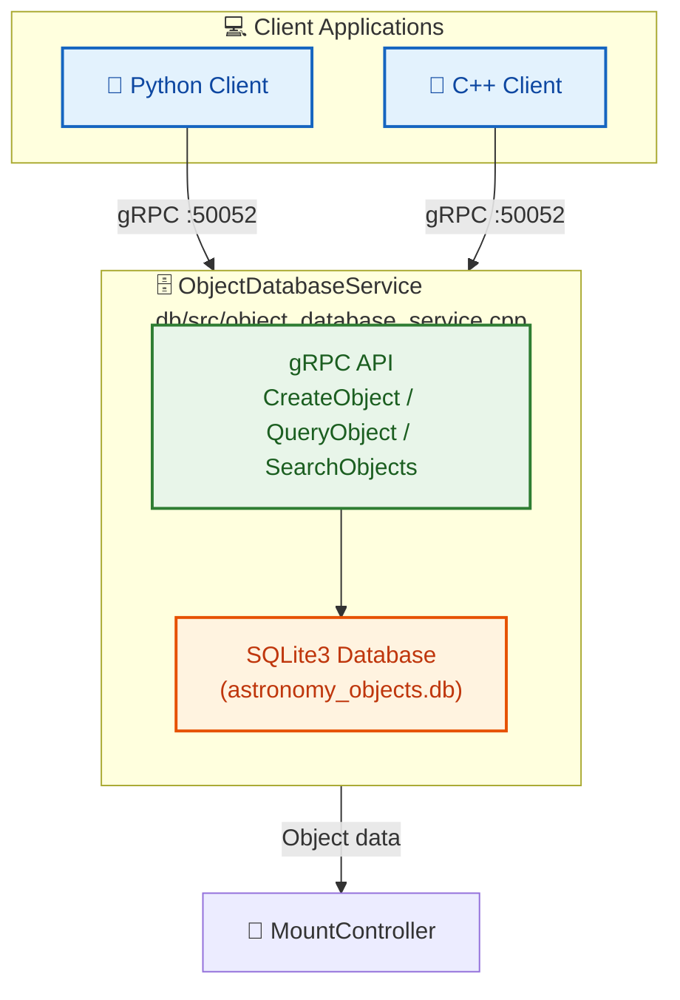

# gRPC API Documentation

## API Overview

Astronomical Mount Controller provides a comprehensive API through the gRPC protocol, enabling remote control of all system functions. The API is defined in the `proto/mount_controller.proto` file.

## Data Structures

### Coordinates

Complete astronomical coordinate structure with all astrometric parameters.

```protobuf
message Coordinates {
    // Basic position
    double ra = 1;          // Right ascension in hours (J2000)
    double dec = 2;         // Declination in degrees (J2000)
    
    // Proper motion
    double pm_ra = 3;       // Proper motion in RA (mas/yr)
    double pm_dec = 4;      // Proper motion in Dec (mas/yr)
    
    // Parallax
    double parallax = 5;    // Parallax in mas
    
    // Radial velocity
    double radial_velocity = 6;  // Radial velocity in km/s
    
    // Epoch
    double epoch = 7;       // Epoch of coordinates (e.g., 2000.0)
    
    // Catalog identifiers
    string catalog_id = 8;  // Catalog identifier (e.g., "HIP", "TYC")
    string object_id = 9;   // Object identifier in catalog
    
    // Magnitude and spectral type
    double magnitude = 10;  // Visual magnitude
    string spectral_type = 11;  // Spectral type
    
    // Additional astrometric parameters
    double epoch_ra = 12;   // Epoch of RA proper motion
    double epoch_dec = 13;  // Epoch of Dec proper motion
    double position_angle = 14;  // Position angle in degrees
    double separation = 15; // Separation in arcseconds (for binaries)
    
    // Atmospheric refraction correction
    bool apply_refraction = 16;
    double temperature = 17;  // Temperature in °C for refraction
    double pressure = 18;     // Pressure in hPa for refraction
    double humidity = 19;     // Humidity in % for refraction
    
    // Precession/nutation correction
    bool apply_precession = 20;
    bool apply_nutation = 21;
    
    // Aberration correction
    bool apply_aberration = 22;
    
    // Light-time correction
    bool apply_light_time = 23;
    
    // Gravitational deflection
    bool apply_grav_deflection = 24;
    
    // Altitude/azimuth (computed)
    double altitude = 25;    // Altitude in degrees
    double azimuth = 26;     // Azimuth in degrees
    
    // Apparent coordinates (after all corrections)
    double apparent_ra = 27;  // Apparent RA in hours
    double apparent_dec = 28; // Apparent Dec in degrees
    
    // Topocentric coordinates
    double topo_ra = 29;     // Topocentric RA in hours
    double topo_dec = 30;    // Topocentric Dec in degrees
}
```

### MountPosition

Mount position in degrees.

```protobuf
message MountPosition {
    double axis1 = 1;       // Primary axis position (degrees)
    double axis2 = 2;       // Secondary axis position (degrees)
    google.protobuf.Timestamp timestamp = 3;
}
```

### AxisPhysicalParameters

Axis motor physical parameters - key structure added in the latest update.

```protobuf
message AxisPhysicalParameters {
    // Motor parameters
    double motor_steps_per_rev = 1;      // Steps per revolution
    double motor_microstepping = 2;      // Microstepping factor (e.g., 16, 32, 64)
    double motor_step_angle = 3;         // Step angle [arcseconds]
    
    // Encoder parameters
    double encoder_resolution = 4;       // Encoder resolution [counts/rev]
    double encoder_counts_per_arcsec = 5; // Counts per arcsecond
    double encoder_quantization_error = 6; // Quantization error [arcseconds]
    
    // Gear parameters
    double gear_ratio = 7;               // Total gear ratio (motor:output)
    double worm_ratio = 8;               // Worm gear ratio (if applicable)
    int32 worm_teeth = 9;                // Number of worm teeth
    int32 worm_wheel_teeth = 10;         // Number of worm wheel teeth
    
    // Cyclic errors (periodic errors)
    double cyclic_error_amplitude = 11;  // Amplitude of cyclic error [arcseconds]
    double cyclic_error_period = 12;     // Period of cyclic error [degrees]
    repeated double cyclic_harmonics = 13; // Harmonic coefficients for cyclic error
    
    // Backlash parameters
    double backlash = 14;                // Backlash [arcseconds]
    double backlash_temp_coeff = 15;     // Backlash temperature coefficient [arcseconds/°C]
    
    // Stiffness and compliance
    double axis_stiffness = 16;          // Axis stiffness [arcseconds/Nm]
    double torsional_compliance = 17;    // Torsional compliance [rad/Nm]
    
    // Temperature coefficients
    double expansion_coeff = 18;         // Thermal expansion coefficient [1/°C]
    double temp_gear_error_coeff = 19;   // Gear error temperature coefficient [arcseconds/°C]
    
    // Calibration data
    repeated double calibration_table = 20; // Calibration table [counts → arcseconds]
    double calibration_temp = 21;        // Temperature during calibration [°C]
}
```

### MountOrientation

Mount orientation quaternion used for CASUAL mount type (`MountType::CASUAL = 3`). Represents the rotation from the local horizontal frame (ENU: East, North, Up) to the mount frame (axis1, axis2).

```protobuf
message MountOrientation {
    double qx = 1;  // Quaternion x component
    double qy = 2;  // Quaternion y component
    double qz = 3;  // Quaternion z component
    double qw = 4;  // Quaternion w component (scalar, should be 1.0 for identity)
}
```

### Configuration

Complete system configuration with 51 fields covering location, mount, telescope, Kalman, TPOINT, guider, meridian flip, soft limits, encoder settings, and CASUAL mount orientation.

```protobuf
message Configuration {
    // Location
    double latitude = 1;
    double longitude = 2;
    double altitude = 3;
    
    // Mount parameters
    double mount_height = 4;
    double pier_west = 5;
    double pier_east = 6;
    
    // Telescope parameters
    double focal_length = 7;
    double aperture = 8;
    
    // Environmental defaults
    double default_temperature = 9;
    double default_pressure = 10;
    double default_humidity = 11;
    
    // Kalman filter parameters
    double process_noise = 12;
    double measurement_noise = 13;
    
    // Logging
    string log_level = 14;
    string log_directory = 15;
    int32 log_rotation_days = 16;
    
    // Network
    string grpc_address = 17;
    int32 grpc_port = 18;
    
    // CanOpen
    string canopen_interface = 19;
    int32 canopen_node_id = 20;
    
    // Mount control parameters
    double park_position_axis1 = 21;    // Park target for axis 1 [degrees]
    double park_position_axis2 = 22;    // Park target for axis 2 [degrees]
    double max_slew_rate = 23;
    double max_tracking_rate = 24;
    double slew_acceleration = 25;
    double tracking_acceleration = 26;
    
    // Axis physical parameters
    AxisPhysicalParameters ha_axis_params = 27;
    AxisPhysicalParameters dec_axis_params = 28;
    
    // Encoder configuration
    bool use_encoders = 29;
    bool encoders_absolute = 30;
    double encoder_resolution_config = 31;
    
    // TPOINT configuration
    uint32 tpoint_enabled_terms = 32;
    
    // Guider configuration
    bool enable_guider = 33;
    double guider_max_correction = 34;
    double guider_aggression = 35;
    
    // Atmospheric refraction correction
    bool enable_refraction_correction = 36;

    // Mount type configuration
    MountType mount_type = 37;

    // Position/rate tolerances for slew operations
    double position_tolerance = 38;
    double rate_tolerance = 39;

    // Meridian flip configuration
    bool meridian_flip_enabled = 40;
    double meridian_flip_delay_minutes = 41;
    double meridian_flip_hysteresis_degrees = 42;

    // Soft limits configuration
    bool soft_limits_enabled = 43;
    double soft_limit_axis1_min = 44;
    double soft_limit_axis1_max = 45;
    double soft_limit_axis2_min = 46;
    double soft_limit_axis2_max = 47;
    double soft_limit_warning_degrees = 48;
    double soft_limit_deceleration_degrees = 49;
    double soft_limit_tracking_rate_factor = 50;

    // Mount orientation quaternion (used when mount_type = CASUAL)
    MountOrientation mount_orientation = 51;  // Mount orientation in local horizontal frame
}
```

## API Methods

### Basic Mount Control

#### SlewToCoordinates

Fast mount movement to specified coordinates.

```protobuf
rpc SlewToCoordinates(Coordinates) returns (google.protobuf.Empty);
```

**Parameters:**
- `Coordinates` - Target coordinates

**Returns:**
- `Empty` - Execution confirmation

**Errors:**
- `INVALID_ARGUMENT` - Invalid coordinates
- `FAILED_PRECONDITION` - Mount is not in a state to accept the command
- `INTERNAL` - Error during slew execution

#### SlewToHorizontal

Slew to horizontal (altitude/azimuth) coordinates. Used for alt-az mounts or manual positioning.

```protobuf
rpc SlewToHorizontal(HorizontalCoordinates) returns (google.protobuf.Empty);
```

**Parameters:**
```protobuf
message HorizontalCoordinates {
    double altitude = 1;  // Altitude in degrees (0-90)
    double azimuth = 2;   // Azimuth in degrees (0-360, North=0, East=90)
    google.protobuf.Timestamp timestamp = 3;
}
```

**Returns:**
- `Empty` - Execution confirmation

#### TrackObject

Start object tracking.

```protobuf
rpc TrackObject(Coordinates) returns (google.protobuf.Empty);
```

**Parameters:**
- `Coordinates` - Coordinates of the tracked object

**Returns:**
- `Empty` - Execution confirmation

#### Stop

Stop all mount movements.

```protobuf
rpc Stop(google.protobuf.Empty) returns (google.protobuf.Empty);
```

#### Park

Park the mount in a safe position.

```protobuf
rpc Park(google.protobuf.Empty) returns (google.protobuf.Empty);
```

#### Unpark

Unpark the mount and return to operational state.

```protobuf
rpc Unpark(google.protobuf.Empty) returns (google.protobuf.Empty);
```

### State Management

#### GetState

Get current mount state.

```protobuf
rpc GetState(google.protobuf.Empty) returns (ControllerState);
```

**Returns:**
- `ControllerState` - Current mount state

```protobuf
message ControllerState {
    enum MountStatus {
        UNKNOWN = 0;
        IDLE = 1;
        SLEWING = 2;
        TRACKING = 3;
        PARKED = 4;
        ERROR = 5;
    }

    MountStatus status = 1;
    TrackedObject tracked_object = 2;
    MountPosition current_position = 3;
    RotationMatrix rotation_matrix = 4;
    TPointParameters tpoint_params = 5;
    bool encoders_enabled = 6;
    bool guider_active = 7;
    google.protobuf.Timestamp state_time = 8;
    
    // Additional tracking parameters
    double tracking_rate_ra = 9;     // RA tracking rate [arcsec/s]
    double tracking_rate_dec = 10;   // Dec tracking rate [arcsec/s]
    double pier_side = 11;           // Pier side (1=East, -1=West)
    bool meridian_flipped = 12;      // Meridian flipped
    double time_to_meridian = 13;    // Time to meridian [hours]
    double time_to_set = 14;         // Time to set [hours]
    double time_to_rise = 15;        // Time to rise [hours]
    
    // Environmental conditions
    double temperature = 16;         // Temperature [°C]
    double pressure = 17;            // Pressure [hPa]
    double humidity = 18;            // Humidity [%]
    double wind_speed = 19;          // Wind speed [m/s]
    double wind_direction = 20;      // Wind direction [deg]
    
    // Mount performance
    double pointing_error = 21;      // Pointing error [arcsec]
    double tracking_performance = 22; // Tracking performance [%]
    double guiding_performance = 23;  // Guiding performance [%]
    double mount_vibration = 24;     // Mount vibration [arcsec RMS]
}
```

#### SaveState

Save system state to file.

```protobuf
rpc SaveState(StateSaveRequest) returns (StateSaveResponse);
```

**Parameters:**
```protobuf
message StateSaveRequest {
    string file_path = 1;  // Empty for default location
    bool include_measurements = 2;
}
```

**Returns:**
```protobuf
message StateSaveResponse {
    string file_path = 1;
    int64 file_size = 2;
}
```

#### LoadState

Load system state from file.

```protobuf
rpc LoadState(StateLoadRequest) returns (google.protobuf.Empty);
```

**Parameters:**
```protobuf
message StateLoadRequest {
    string file_path = 1;  // Empty for default location
}
```

### Measurement and Calibration

#### AddMeasurement

Add measurement for TPOINT calibration.

```protobuf
rpc AddMeasurement(Measurement) returns (google.protobuf.Empty);
```

**Parameters:**
```protobuf
message Measurement {
    Coordinates observed = 1;
    Coordinates expected = 2;
    MountPosition mount_position = 3;
    double temperature = 4;
    double pressure = 5;
    double humidity = 6;
    google.protobuf.Timestamp timestamp = 7;
}
```

#### GetTPointParameters

Get current TPOINT parameters.

```protobuf
rpc GetTPointParameters(google.protobuf.Empty) returns (TPointParameters);
```

**Returns:**
```protobuf
message TPointParameters {
    repeated double coefficients = 1;  // TPOINT model coefficients
    double chi_squared = 2;
    google.protobuf.Timestamp last_update = 3;
}
```

#### GetRotationMatrix

Get rotation matrix (quaternion representation).

```protobuf
rpc GetRotationMatrix(google.protobuf.Empty) returns (RotationMatrix);
```

**Returns:**
```protobuf
message RotationMatrix {
    double q0 = 1;
    double q1 = 2;
    double q2 = 3;
    double q3 = 4;
    google.protobuf.Timestamp valid_from = 5;
}
```

### Pole Position Determination

#### DeterminePolePosition

Determine pole position using drift method.

```protobuf
rpc DeterminePolePosition(PoleDeterminationRequest) returns (PolePosition);
```

**Parameters:**
```protobuf
message PoleDeterminationRequest {
    int32 measurement_count = 1;  // Number of measurements to use
    double duration_hours = 2;    // Duration of drift measurement
}
```

**Returns:**
```protobuf
message PolePosition {
    double latitude = 1;
    double longitude = 2;
    double altitude = 3;
    double accuracy = 4;  // Accuracy in arcseconds
    google.protobuf.Timestamp determined_at = 5;
}
```

### Encoder Control

#### EnableEncoders

Enable and configure encoders.

```protobuf
rpc EnableEncoders(EncoderConfig) returns (google.protobuf.Empty);
```

**Parameters:**
```protobuf
message EncoderConfig {
    enum EncoderType {
        ABSOLUTE = 0;
        INCREMENTAL = 1;
    }
    
    EncoderType type = 1;
    double resolution = 2;  // Steps per revolution
    bool use_feedback = 3;
}
```

#### DisableEncoders

Disable encoders.

```protobuf
rpc DisableEncoders(google.protobuf.Empty) returns (google.protobuf.Empty);
```

### Guider Control

#### ConnectGuider

Connect to autoguiding system.

```protobuf
rpc ConnectGuider(GuiderConfig) returns (google.protobuf.Empty);
```

**Parameters:**
```protobuf
message GuiderConfig {
    string connection_string = 1;  // e.g., "tcp://localhost:7624"
    double max_correction = 2;     // Maximum correction in arcseconds
    double aggression = 3;         // Correction aggression (0-1)
}
```

#### DisconnectGuider

Disconnect from autoguiding system.

```protobuf
rpc DisconnectGuider(google.protobuf.Empty) returns (google.protobuf.Empty);
```

#### SendGuiderCorrection

Send guider correction.

```protobuf
rpc SendGuiderCorrection(GuiderCorrection) returns (google.protobuf.Empty);
```

**Parameters:**
```protobuf
message GuiderCorrection {
    double ra_correction = 1;   // RA correction in arcseconds
    double dec_correction = 2;  // Dec correction in arcseconds
    google.protobuf.Timestamp timestamp = 3;
}
```

### Configuration

#### GetConfiguration

Get current system configuration.

```protobuf
rpc GetConfiguration(google.protobuf.Empty) returns (Configuration);
```

**Returns:**
- `Configuration` - Complete system configuration

#### UpdateConfiguration

Update system configuration.

```protobuf
rpc UpdateConfiguration(Configuration) returns (google.protobuf.Empty);
```

**Parameters:**
- `Configuration` - New system configuration

**Note:** Not all parameters can be changed in real-time. Some require system restart.

### Trajectory Generation and Execution

#### GenerateTrajectory

Generate motion trajectory.

```protobuf
rpc GenerateTrajectory(TrajectoryParams) returns (Trajectory);
```

**Parameters:**
```protobuf
message TrajectoryParams {
    TrajectoryType type = 1;
    double max_velocity = 2;          // deg/s
    double max_acceleration = 3;      // deg/s²
    double max_jerk = 4;              // deg/s³
    double start_position = 5;        // deg
    double target_position = 6;       // deg
    double update_rate = 7;           // Hz
}
```

**Returns:**
```protobuf
message Trajectory {
    TrajectoryParams params = 1;
    repeated TrajectoryPoint points = 2;
    google.protobuf.Timestamp generated_at = 3;
}
```

### Health Check

#### CheckHealth

Check system health and get performance metrics.

```protobuf
rpc CheckHealth(HealthCheckRequest) returns (HealthCheckResponse);
```

**Parameters:**
```protobuf
message HealthCheckRequest {
    string service = 1;
}
```

**Returns:**
```protobuf
message HealthCheckResponse {
    enum ServingStatus {
        UNKNOWN = 0;
        SERVING = 1;
        NOT_SERVING = 2;
        SERVICE_UNKNOWN = 3;
    }
    ServingStatus status = 1;
    string service = 2;
    SystemMetrics metrics = 3;
}
```

```protobuf
message SystemMetrics {
    double cpu_usage_percent = 1;
    double memory_usage_mb = 2;
    uint64 active_connections = 3;
    uint64 total_requests = 4;
    uint64 error_count = 5;
    double avg_response_time_ms = 6;
    MountControllerMetrics mount_metrics = 7;
    KalmanFilterMetrics kalman_metrics = 8;
    TPointMetrics tpoint_metrics = 9;
}
```

### Bootstrap Calibration

Bootstrap calibration provides initial alignment using a simplified linear model. It collects coarse measurements and computes the initial pointing offset before a full TPOINT calibration.

#### AddBootstrapMeasurement

Add a bootstrap measurement for initial alignment.

```protobuf
rpc AddBootstrapMeasurement(BootstrapMeasurement) returns (google.protobuf.Empty);
```

```protobuf
message BootstrapMeasurement {
    Coordinates observed = 1;
    Coordinates expected = 2;
    MountPosition mount_position = 3;
    google.protobuf.Timestamp timestamp = 4;
    double estimated_error_arcsec = 5;
    bool use_for_initial_alignment = 6;
    string star_catalog_id = 7;
    double star_magnitude = 8;
}
```

#### RunBootstrapCalibration

Run bootstrap calibration to compute initial alignment.

```protobuf
rpc RunBootstrapCalibration(google.protobuf.Empty) returns (BootstrapCalibrationResult);
```

```protobuf
message BootstrapCalibrationResult {
    bool success = 1;
    string error_message = 2;
    double initial_rotation_angle_deg = 3;
    double alignment_error_arcsec = 4;
    int32 measurement_count = 5;
    google.protobuf.Timestamp calibrated_at = 6;
    double residual_rms_arcsec = 7;
    double max_residual_arcsec = 8;
    bool ready_for_tpoint = 9;

    // For CASUAL mount: estimated orientation quaternion
    MountOrientation estimated_orientation = 10;  // Estimated mount orientation
    double estimated_quaternion_error = 11;       // Quaternion estimation error [arcsec]
}
```

#### GetBootstrapStatus / ClearBootstrapMeasurements

```protobuf
rpc GetBootstrapStatus(google.protobuf.Empty) returns (BootstrapStatus);
rpc ClearBootstrapMeasurements(google.protobuf.Empty) returns (google.protobuf.Empty);
```

```protobuf
message BootstrapStatus {
    bool calibrated = 1;
    google.protobuf.Timestamp last_calibration = 2;
    int32 measurement_count = 3;
    double current_alignment_error_arcsec = 4;
    bool ready_for_tpoint = 5;
    CalibrationState state = 6;
    string state_message = 7;
    double min_measurements_required = 8;       // Minimum measurements needed
    double min_measurements_for_tpoint = 9;     // Minimum for TPOINT
    
    enum CalibrationState {
        NOT_CALIBRATED = 0;
        MEASUREMENTS_COLLECTING = 1;
        CALIBRATING = 2;
        CALIBRATED = 3;
        NEEDS_MORE_MEASUREMENTS = 4;
        ERROR = 5;
    }
}
```

### Low-Level Axis Control

Direct axis control for uncalibrated mounts or manual operation.

#### ControlAxis

Control an axis with position or velocity mode.

```protobuf
rpc ControlAxis(AxisControlRequest) returns (google.protobuf.Empty);
```

```protobuf
message AxisControlRequest {
    int32 axis_id = 1;
    AxisControlMode mode = 2;
    double target_position = 3;
    double max_velocity = 4;
    double acceleration = 5;
    double target_velocity = 6;
    bool relative = 7;
}

enum AxisControlMode {
    POSITION_CONTROL = 0;
    VELOCITY_CONTROL = 1;
}
```

#### StopAxis

Stop a specific axis with optional deceleration.

```protobuf
rpc StopAxis(AxisStopRequest) returns (google.protobuf.Empty);
```

```protobuf
message AxisStopRequest {
    int32 axis_id = 1;
    bool decelerate = 2;
    double deceleration = 3;
}
```

#### EmergencyStop

Immediate halt of one or all axes.

```protobuf
rpc EmergencyStop(EmergencyStopRequest) returns (google.protobuf.Empty);
```

```protobuf
message EmergencyStopRequest {
    int32 axis_id = 1;  // -1 for all axes
    bool reset_after = 2;
}
```

#### GetAxisStatus

Get detailed axis status including position, velocity, and target.

```protobuf
rpc GetAxisStatus(google.protobuf.Empty) returns (AxisStatus);
```

```protobuf
message AxisStatus {
    int32 axis_id = 1;
    double current_position = 2;
    double current_velocity = 3;
    double target_position = 4;
    double target_velocity = 5;
    bool moving = 6;
    bool target_reached = 7;
    bool error = 8;
    string error_message = 9;
    google.protobuf.Timestamp timestamp = 10;
}
```

### Derotator / Field Rotation Control

Control the field derotator hardware and field rotation compensation for alt-az and CASUAL mounts.

#### ConfigureDerotator

Configure derotator hardware parameters.

```protobuf
rpc ConfigureDerotator(DerotatorConfig) returns (google.protobuf.Empty);
```

```protobuf
message DerotatorConfig {
    enum DerotatorType {
        CANOPEN = 0;
        STEPPER = 1;
        SERVO = 2;
        CUSTOM = 3;
    }
    DerotatorType type = 1;
    string connection_string = 2;
    double gear_ratio = 3;
    double max_speed = 4;
    double max_acceleration = 5;
    double backlash = 6;
    bool absolute_encoder = 7;
    double encoder_resolution = 8;
    double homing_offset = 9;
    repeated double calibration_table = 10;
}
```

#### EnableFieldRotation

Enable or disable field rotation compensation (for alt-az mounts).

```protobuf
rpc EnableFieldRotation(FieldRotationParams) returns (google.protobuf.Empty);
```

```protobuf
message FieldRotationParams {
    bool enabled = 1;
    double latitude = 2;
    double altitude = 3;
    double azimuth = 4;
    double computed_rate = 5;
    double applied_correction = 6;
    double temperature = 7;
    double flexure_correction = 8;
}
```

#### ControlFieldRotation

Direct control of field rotation angle or rate.

```protobuf
rpc ControlFieldRotation(FieldRotationControlRequest) returns (google.protobuf.Empty);
```

```protobuf
message FieldRotationControlRequest {
    enum RotationMode {
        DISABLED = 0;
        ALT_AZ = 1;
        EQUATORIAL = 2;
        CUSTOM = 3;
        FIXED_ANGLE = 4;
        TRACKING = 5;
        CASUAL = 6;            // Field rotation for randomly oriented mount
    }
    RotationMode mode = 1;
    double target_angle = 2;
    double rotation_rate = 3;
    bool relative = 4;
    bool wait_for_completion = 5;
}
```

#### GetDerotatorStatus

Get current derotator state.

```protobuf
rpc GetDerotatorStatus(google.protobuf.Empty) returns (DerotatorStatus);
```

```protobuf
message DerotatorStatus {
    bool enabled = 1;
    bool moving = 2;
    bool homed = 3;
    double current_angle = 4;
    double target_angle = 5;
    double rotation_rate = 6;
    double field_rotation_rate = 7;
    DerotatorConfig derotator_config = 8;
    string error_message = 9;
    google.protobuf.Timestamp timestamp = 10;
}
```

#### HomeDerotator

Home the derotator to find zero position.

```protobuf
rpc HomeDerotator(DerotatorHomingRequest) returns (google.protobuf.Empty);
```

```protobuf
message DerotatorHomingRequest {
    enum HomingMethod {
        AUTO = 0;
        LIMIT_SWITCH = 1;
        ENCODER_ZERO = 2;
        MANUAL = 3;
    }
    HomingMethod method = 1;
    double search_speed = 2;
    double offset = 3;
    bool calibrate_after = 4;
}
```

#### GetFieldRotationParams

Get computed field rotation parameters.

```protobuf
rpc GetFieldRotationParams(google.protobuf.Empty) returns (FieldRotationParams);
```

### HAL Configuration

Hardware Abstraction Layer (HAL) configuration and status.

#### GetHALConfig

Get current HAL configuration.

```protobuf
rpc GetHALConfig(google.protobuf.Empty) returns (HALConfig);
```

```protobuf
message HALConfig {
    HALType type = 1;
    string name = 2;
    SimulatedConfig simulated = 3;
    CanOpenConfig canopen = 4;
    SerialConfig serial = 5;
    EthernetConfig ethernet = 6;
    repeated AxisConfig axes = 7;
    PIDParams pid_params = 8;
    SafetyConfig safety = 9;
}

enum HALType {
    HAL_SIMULATED = 0;
    HAL_CANOPEN = 1;
    HAL_SERIAL = 2;
    HAL_ETHERNET = 3;
    HAL_CUSTOM = 4;
}
```

#### SetHALConfig

Update HAL configuration at runtime.

```protobuf
rpc SetHALConfig(HALConfigRequest) returns (google.protobuf.Empty);
```

```protobuf
message HALConfigRequest {
    HALConfig config = 1;
}
```

#### GetHALStatus

Get HAL status and capability information.

```protobuf
rpc GetHALStatus(google.protobuf.Empty) returns (HALStatus);
```

```protobuf
message HALStatus {
    bool initialized = 1;
    bool running = 2;
    HALType type = 3;
    string platform_name = 4;
    string hardware_version = 5;
    string status_message = 6;
    repeated string supported_features = 7;
    string error_message = 8;
    google.protobuf.Timestamp timestamp = 9;
}
```

#### ReinitializeHAL

Reinitialize the HAL with current or new configuration.

```protobuf
rpc ReinitializeHAL(HALReinitRequest) returns (google.protobuf.Empty);
```

```protobuf
message HALReinitRequest {
    bool force_restart = 1;
}
```

### CASUAL Mount Orientation

Set or get the mount orientation quaternion for CASUAL mount type (`MountType::CASUAL = 3`). This allows configuring the arbitrary orientation of a randomly oriented mount.

```protobuf
rpc SetMountOrientation(MountOrientation) returns (google.protobuf.Empty);
rpc GetMountOrientation(google.protobuf.Empty) returns (MountOrientation);
```

**SetMountOrientation** updates the orientation quaternion describing the rotation from the local horizontal frame (ENU) to the mount frame (axis1, axis2). Used for CASUAL mounts where the two perpendicular axes are not aligned to the standard equatorial or alt-az frame.

**GetMountOrientation** retrieves the current mount orientation quaternion.

---

## Object Database API

The Astronomical Mount Controller includes a comprehensive astronomical object database service (`ObjectDatabaseService`) that stores and manages celestial object data using SQLite with a gRPC interface.

### Architecture



### Service Definition

```protobuf
service ObjectDatabaseService {
    // Object management
    rpc CreateObject (AstronomicalObject) returns (ObjectId);
    rpc GetObject (ObjectId) returns (AstronomicalObject);
    rpc UpdateObject (AstronomicalObject) returns (google.protobuf.Empty);
    rpc DeleteObject (ObjectId) returns (google.protobuf.Empty);
    rpc ListObjects (ObjectListRequest) returns (ObjectList);
    rpc SearchObjects (ObjectSearchRequest) returns (ObjectList);
    
    // Catalog operations
    rpc ImportCatalog (ImportCatalogRequest) returns (ImportResult);
    rpc ExportCatalog (ExportCatalogRequest) returns (ExportResult);
    
    // Favorites and user collections
    rpc AddToFavorites (FavoriteRequest) returns (google.protobuf.Empty);
    rpc RemoveFromFavorites (FavoriteRequest) returns (google.protobuf.Empty);
    rpc GetFavorites (google.protobuf.Empty) returns (ObjectList);
    
    // Categories and tags
    rpc CreateCategory (Category) returns (CategoryId);
    rpc ListCategories (google.protobuf.Empty) returns (CategoryList);
    rpc AssignCategory (ObjectCategory) returns (google.protobuf.Empty);
    rpc RemoveCategory (ObjectCategory) returns (google.protobuf.Empty);
    
    // Observation planning
    rpc FindVisibleObjects (VisibilityRequest) returns (ObjectList);
    rpc GetTonightBestObjects (TonightRequest) returns (ObjectList);
    rpc GetObjectVisibility (ObjectVisibilityRequest) returns (VisibilityInfo);
    
    // Statistics and metadata
    rpc GetDatabaseStats (google.protobuf.Empty) returns (DatabaseStats);
    rpc BackupDatabase (BackupRequest) returns (BackupResult);
    rpc RestoreDatabase (RestoreRequest) returns (google.protobuf.Empty);
}
```

### Data Structures

#### AstronomicalObject

Complete celestial object with 64 fields covering identification, coordinates, physical parameters, and metadata:

```protobuf
message AstronomicalObject {
    // Basic identification
    string id = 1;             // UUID
    string name = 2;           // Common name
    string catalog_name = 3;   // Catalog designation
    string alternate_names = 4;
    
    // Coordinates (J2000)
    double ra_hours = 5;
    double dec_degrees = 6;
    
    // Proper motion (mas/year)
    double pm_ra = 7;
    double pm_dec = 8;
    
    // Parallax and distance
    double parallax_mas = 9;
    double distance_pc = 10;
    double distance_ly = 11;
    
    // Magnitudes (V, B, J, H, K)
    double v_magnitude = 12;
    double b_magnitude = 13;
    double j_magnitude = 14;
    double h_magnitude = 15;
    double k_magnitude = 16;
    
    // Spectral classification
    string spectral_type = 17;
    string luminosity_class = 18;
    ObjectType object_type = 19;
    
    // Physical parameters
    double mass_solar = 20;
    double radius_solar = 21;
    double temperature_k = 22;
    double luminosity_solar = 23;
    double age_gyr = 24;
    
    // Orbital elements (solar system objects)
    double semi_major_axis_au = 25;
    double eccentricity = 26;
    double inclination_deg = 27;
    double longitude_asc_node_deg = 28;
    double argument_perihelion_deg = 29;
    double mean_anomaly_deg = 30;
    double epoch_of_elements_jd = 31;
    double diameter_km = 32;
    double albedo = 33;
    double rotation_period_hours = 34;
    
    // Extended object parameters
    double angular_size_arcmin = 35;
    double redshift = 36;
    double radial_velocity_kms = 37;
    double apparent_dimensions_arcmin_x = 38;
    double apparent_dimensions_arcmin_y = 39;
    
    // Positional uncertainty
    double ra_error_mas = 40;
    double dec_error_mas = 41;
    double pm_ra_error = 42;
    double pm_dec_error = 43;
    double parallax_error = 44;
    
    // Metadata
    string catalog_id = 45;
    string catalog_version = 46;
    string data_source = 47;
    google.protobuf.Timestamp created_at = 48;
    google.protobuf.Timestamp updated_at = 49;
    string created_by = 50;
    string notes = 51;
    int32 observation_count = 52;
    double last_observed_jd = 53;
    
    // Status flags
    bool is_favorite = 54;
    bool is_visible = 55;
    bool ephemeris_available = 56;
    bool has_light_curve = 57;
    bool has_spectrum = 58;
    
    // User metadata
    double user_rating = 59;
    string user_notes = 60;
    repeated string tags = 61;
    repeated string categories = 62;
    
    // Extended data
    EphemerisData ephemeris = 63;
    map<string, string> custom_fields = 64;
}
```

#### Object Database Tables

The SQLite database maintains five tables:

| Table | Purpose |
|-------|---------|
| `astronomical_objects` | Main object data (all 64 fields) |
| `favorites` | User favorite objects |
| `categories` | Object categories with UI metadata |
| `object_categories` | Many-to-many object-category relationships |
| `ephemeris_data` | Ephemeris data for solar system objects |

### Running the Database Server

```bash
# Build
cd build
cmake .. -DCMAKE_BUILD_TYPE=Release
make astro_object_database_server -j$(nproc)

# Run with default database path
./bin/astro_object_database_server

# Specify custom database path
./bin/astro_object_database_server /path/to/custom_database.db
```

### Python Client Example

```python
import grpc
from db.proto import object_database_pb2
from db.proto import object_database_pb2_grpc

# Connect to database server
channel = grpc.insecure_channel('localhost:50052')
stub = object_database_pb2_grpc.ObjectDatabaseServiceStub(channel)

# Create a new object
obj = object_database_pb2.AstronomicalObject(
    name="Andromeda Galaxy",
    catalog_name="M 31",
    ra_hours=0.7108,
    dec_degrees=41.2692,
    v_magnitude=3.44,
    object_type=object_database_pb2.GALAXY_SPIRAL
)
result = stub.CreateObject(obj)
print(f"Created object with ID: {result.id}")

# Search for objects
search = object_database_pb2.ObjectSearchRequest(
    query="Andromeda",
    max_magnitude=5.0
)
results = stub.SearchObjects(search)
for obj in results.objects:
    print(f"Found: {obj.name} ({obj.catalog_name})")
```

