# gRPC API Usage Examples

This document contains a complete collection of gRPC API usage examples for Astronomical Mount Controller, covering all available scenarios.

## API Method Categories

```mermaid
flowchart TB
    classDef mount fill:#e3f2fd,stroke:#1565c0,stroke-width:2px,color:#0d47a1
    classDef state fill:#e8f5e9,stroke:#2e7d32,stroke-width:2px,color:#1b5e20
    classDef calib fill:#fff3e0,stroke:#e65100,stroke-width:2px,color:#bf360c
    classDef encoder fill:#fce4ec,stroke:#c62828,stroke-width:2px,color:#b71c1c
    classDef config fill:#f3e5f5,stroke:#7b1fa2,stroke-width:2px,color:#4a148c
    classDef traj fill:#e0f7fa,stroke:#00838f,stroke-width:2px,color:#006064
    classDef boot fill:#fff8e1,stroke:#f9a825,stroke-width:2px,color:#f57f17
    classDef axis fill:#ffebee,stroke:#d32f2f,stroke-width:2px,color:#b71c1c
    classDef derot fill:#e8f5e9,stroke:#388e3c,stroke-width:2px,color:#1b5e20
    classDef hal fill:#ede7f6,stroke:#4527a0,stroke-width:2px,color:#311b92
    classDef sys fill:#eceff1,stroke:#546e7a,stroke-width:2px,color:#37474f

    subgraph MOUNT["🎯 Mount Control"]
        S["SlewToCoordinates"]:::mount
        T["TrackObject"]:::mount
        ST["Stop"]:::mount
        PK["Park / Unpark"]:::mount
    end
    
    subgraph STATE["📊 State Management"]
        GS["GetState"]:::state
        SV["SaveState / LoadState"]:::state
    end
    
    subgraph CAL["🔧 Calibration"]
        AM["AddMeasurement"]:::calib
        TP["GetTPointParameters"]:::calib
        RT["RunTPointCalibration"]:::calib
        RM["GetRotationMatrix"]:::calib
        DP["DeterminePolePosition"]:::calib
    end
    
    subgraph ENC["🔌 Encoder & Guider"]
        EE["EnableEncoders / DisableEncoders"]:::encoder
        CG["ConnectGuider / DisconnectGuider"]:::encoder
        SG["SendGuiderCorrection"]:::encoder
    end
    
    subgraph CONF["⚙️ Configuration"]
        GC["GetConfiguration"]:::config
        UC["UpdateConfiguration"]:::config
    end
    
    subgraph TRAJ_EPH["🛰️ Trajectory & Ephemeris"]
        GT["GenerateTrajectory / ExecuteTrajectory"]:::traj
        UE["UploadEphemeris"]:::traj
        ET["StartEphemerisTracking / StopEphemerisTracking"]:::traj
    end
    
    subgraph BOOT["🌟 Bootstrap Calibration"]
        ABM["AddBootstrapMeasurement"]:::boot
        RBC["RunBootstrapCalibration"]:::boot
        GBS["GetBootstrapStatus"]:::boot
    end
    
    subgraph AXIS["🎛️ Axis Control"]
        CA["ControlAxis"]:::axis
        SA["StopAxis / EmergencyStop"]:::axis
        GAS["GetAxisStatus"]:::axis
    end
    
    subgraph DEROT["🔄 Derotator & Field Rotation"]
        CD["ConfigureDerotator"]:::derot
        EFR["EnableFieldRotation / ControlFieldRotation"]:::derot
        HD["HomeDerotator / GetDerotatorStatus"]:::derot
    end
    
    subgraph HAL_CFG["🔧 HAL Configuration"]
        GHC["GetHALConfig / SetHALConfig"]:::hal
        GHS["GetHALStatus / ReinitializeHAL"]:::hal
    end
    
    subgraph SYS["🖥️ System"]
        CH["CheckHealth"]:::sys
    end
```



## Environment Preparation

### Python

```python
import grpc
import mount_controller_pb2 as proto
import mount_controller_pb2_grpc as rpc
from google.protobuf import timestamp_pb2
import time

# Create gRPC client
channel = grpc.insecure_channel('localhost:50051')
stub = rpc.MountControllerServiceStub(channel)
```

### C++

```cpp
#include <grpcpp/grpcpp.h>
#include "mount_controller.grpc.pb.h"

using grpc::Channel;
using grpc::ClientContext;
using grpc::Status;

// Create client
auto channel = grpc::CreateChannel("localhost:50051", 
    grpc::InsecureChannelCredentials());
auto stub = MountControllerService::NewStub(channel);
```

## Examples for All Scenarios

### 1. Basic Mount Control

#### SlewToCoordinates - Move to Coordinates

```python
def slew_to_target(ra_hours, dec_degrees):
    """Move mount to specified coordinates."""
    coords = proto.Coordinates()
    coords.ra = ra_hours
    coords.dec = dec_degrees
    coords.epoch = 2000.0  # J2000
    
    try:
        stub.SlewToCoordinates(coords)
        print(f"Slew to RA={ra_hours}h, Dec={dec_degrees}° started")
    except grpc.RpcError as e:
        print(f"Error: {e.code()} - {e.details()}")
```

#### TrackObject - Track Object

```python
def track_object(ra_hours, dec_degrees, object_name="Target"):
    """Start tracking an object."""
    coords = proto.Coordinates()
    coords.ra = ra_hours
    coords.dec = dec_degrees
    coords.object_id = object_name
    
    try:
        stub.TrackObject(coords)
        print(f"Tracking {object_name} at RA={ra_hours}h, Dec={dec_degrees}°")
    except grpc.RpcError as e:
        print(f"Error: {e.code()} - {e.details()}")
```

#### Stop - Stop Movements

```python
def stop_mount():
    """Stop all mount movements."""
    empty = proto.google_dot_protobuf_dot_empty__pb2.Empty()
    stub.Stop(empty)
    print("Mount stopped")
```

#### Park/Unpark - Park Mount

```python
def park_mount():
    """Park mount in safe position."""
    empty = proto.google_dot_protobuf_dot_empty__pb2.Empty()
    stub.Park(empty)
    print("Mount parked")

def unpark_mount():
    """Unpark mount."""
    empty = proto.google_dot_protobuf_dot_empty__pb2.Empty()
    stub.Unpark(empty)
    print("Mount unparked")
```

### 2. State Management

#### GetState - Get Current State

```python
def get_mount_state():
    """Get comprehensive mount state."""
    empty = proto.google_dot_protobuf_dot_empty__pb2.Empty()
    state = stub.GetState(empty)
    
    print(f"Status: {proto.ControllerState.MountStatus.Name(state.status)}")
    print(f"Position: RA={state.current_position.axis1}°, Dec={state.current_position.axis2}°")
    print(f"Tracking: RA rate={state.tracking_rate_ra} arcsec/s, "
          f"Dec rate={state.tracking_rate_dec} arcsec/s")
    print(f"Temperature: {state.temperature}°C, Pressure: {state.pressure} hPa")
    print(f"Pointing error: {state.pointing_error} arcsec")
    
    return state
```

#### SaveState/LoadState - Save/Load State

```python
def save_system_state(filename="mount_state.bin"):
    """Save system state to file."""
    request = proto.StateSaveRequest()
    request.file_path = filename
    request.include_measurements = True
    
    response = stub.SaveState(request)
    print(f"State saved to {response.file_path} ({response.file_size} bytes)")

def load_system_state(filename="mount_state.bin"):
    """Load system state from file."""
    request = proto.StateLoadRequest()
    request.file_path = filename
    
    stub.LoadState(request)
    print(f"State loaded from {filename}")
```

### 3. Measurement and Calibration

#### AddMeasurement - Add Calibration Measurement

```python
def add_calibration_measurement(observed_ra, observed_dec, 
                                expected_ra, expected_dec):
    """Add measurement for TPOINT calibration."""
    measurement = proto.Measurement()
    
    # Observed coordinates
    measurement.observed.ra = observed_ra
    measurement.observed.dec = observed_dec
    
    # Expected coordinates
    measurement.expected.ra = expected_ra
    measurement.expected.dec = expected_dec
    
    # Environmental conditions
    measurement.temperature = 15.0
    measurement.pressure = 1013.25
    measurement.humidity = 0.5
    
    # Timestamp
    ts = timestamp_pb2.Timestamp()
    ts.GetCurrentTime()
    measurement.timestamp.CopyFrom(ts)
    
    stub.AddMeasurement(measurement)
    print(f"Added measurement: observed({observed_ra}h,{observed_dec}°) "
          f"vs expected({expected_ra}h,{expected_dec}°)")
```

#### GetTPointParameters - Get TPOINT Parameters

```python
def get_tpoint_parameters():
    """Get current TPOINT model parameters."""
    empty = proto.google_dot_protobuf_dot_empty__pb2.Empty()
    params = stub.GetTPointParameters(empty)
    
    print(f"TPOINT parameters:")
    print(f"  Chi-squared: {params.chi_squared}")
    print(f"  Last update: {params.last_update}")
    print(f"  Coefficients: {len(params.coefficients)} terms")
    
    for i, coeff in enumerate(params.coefficients[:10]):  # First 10
        print(f"    Term {i}: {coeff}")
    
    return params
```

#### RunTPointCalibration - Run Calibration

```python
def run_tpoint_calibration():
    """Run full TPOINT calibration."""
    empty = proto.google_dot_protobuf_dot_empty__pb2.Empty()
    stub.RunTPointCalibration(empty)
    print("TPOINT calibration started")
```

#### GetRotationMatrix - Get Rotation Matrix

```python
def get_rotation_matrix():
    """Get rotation matrix (quaternion)."""
    empty = proto.google_dot_protobuf_dot_empty__pb2.Empty()
    matrix = stub.GetRotationMatrix(empty)
    
    print(f"Rotation matrix (quaternion):")
    print(f"  q0={matrix.q0}, q1={matrix.q1}, q2={matrix.q2}, q3={matrix.q3}")
    print(f"  Valid from: {matrix.valid_from}")
    
    return matrix
```

### 4. Pole Position Determination

#### DeterminePolePosition - Determine Pole Position Using Drift Method

```python
def determine_pole_position(duration_hours=2.0):
    """Determine celestial pole position."""
    request = proto.PoleDeterminationRequest()
    request.duration_hours = duration_hours
    request.measurement_count = 50
    
    pole = stub.DeterminePolePosition(request)
    
    print(f"Pole position determined:")
    print(f"  Latitude: {pole.latitude}°")
    print(f"  Longitude: {pole.longitude}°")
    print(f"  Altitude: {pole.altitude} m")
    print(f"  Accuracy: {pole.accuracy} arcsec")
    print(f"  Determined at: {pole.determined_at}")
    
    return pole
```

### 5. Encoder Control

#### EnableEncoders - Enable and Configure Encoders

```python
def enable_encoders(encoder_type='ABSOLUTE', resolution=36000):
    """Enable and configure encoder system."""
    config = proto.EncoderConfig()
    
    if encoder_type.upper() == 'ABSOLUTE':
        config.type = proto.EncoderConfig.ABSOLUTE
    else:
        config.type = proto.EncoderConfig.INCREMENTAL
    
    config.resolution = resolution
    config.use_feedback = True
    
    stub.EnableEncoders(config)
    print(f"Encoders enabled: type={encoder_type}, resolution={resolution}")
```

#### DisableEncoders - Disable Encoders

```python
def disable_encoders():
    """Disable encoder system."""
    empty = proto.google_dot_protobuf_dot_empty__pb2.Empty()
    stub.DisableEncoders(empty)
    print("Encoders disabled")
```

### 6. Guider Control

#### ConnectGuider - Connect to Autoguiding System

```python
def connect_guider(host='localhost', port=7624, max_correction=10.0):
    """Connect to autoguiding system."""
    config = proto.GuiderConfig()
    config.connection_string = f"tcp://{host}:{port}"
    config.max_correction = max_correction
    config.aggression = 0.5
    
    stub.ConnectGuider(config)
    print(f"Guider connected to {config.connection_string}")
```

#### SendGuiderCorrection - Send Guider Correction

```python
def send_guider_correction(ra_correction, dec_correction):
    """Send guider correction."""
    correction = proto.GuiderCorrection()
    correction.ra_correction = ra_correction
    correction.dec_correction = dec_correction
    
    ts = timestamp_pb2.Timestamp()
    ts.GetCurrentTime()
    correction.timestamp.CopyFrom(ts)
    
    stub.SendGuiderCorrection(correction)
    print(f"Guider correction sent: RA={ra_correction}\", Dec={dec_correction}\"")
```

#### DisconnectGuider - Disconnect Guider

```python
def disconnect_guider():
    """Disconnect from autoguiding system."""
    empty = proto.google_dot_protobuf_dot_empty__pb2.Empty()
    stub.DisconnectGuider(empty)
    print("Guider disconnected")
```

### 7. System Configuration

#### GetConfiguration - Get Full Configuration

```python
def get_full_configuration():
    """Get complete system configuration."""
    empty = proto.google_dot_protobuf_dot_empty__pb2.Empty()
    config = stub.GetConfiguration(empty)
    
    print(f"System configuration:")
    print(f"  Location: Lat={config.latitude}°, Lon={config.longitude}°, Alt={config.altitude}m")
    print(f"  Mount: Type={config.mount_type}, Height={config.mount_height}m")
    print(f"  Gears: Axis1={config.axis1_gear_ratio}:1, Axis2={config.axis2_gear_ratio}:1")
    print(f"  Encoders: {'Enabled' if config.use_encoders else 'Disabled'}")
    
    # HA axis physical parameters
    if config.HasField('ha_axis_params'):
        ha = config.ha_axis_params
        print(f"  HA Axis Physical Parameters:")
        print(f"    Motor: {ha.motor_steps_per_rev} steps/rev, "
              f"{ha.motor_microstepping}x microstepping")
        print(f"    Gear: ratio={ha.gear_ratio}, worm={ha.worm_ratio}")
        print(f"    Encoder: {ha.encoder_resolution} counts/rev")
    
    return config
```

#### UpdateConfiguration - Update Configuration

```python
def update_mount_configuration(new_latitude, new_longitude):
    """Update system configuration."""
    empty = proto.google_dot_protobuf_dot_empty__pb2.Empty()
    current_config = stub.GetConfiguration(empty)
    
    # Modify selected parameters
    current_config.latitude = new_latitude
    current_config.longitude = new_longitude
    current_config.default_temperature = 20.0
    
    # Update axis physical parameters
    if current_config.HasField('ha_axis_params'):
        current_config.ha_axis_params.backlash = 5.0  # Reduce backlash
        current_config.ha_axis_params.cyclic_error_amplitude = 10.0
    
    if current_config.HasField('dec_axis_params'):
        current_config.dec_axis_params.backlash = 4.5
        current_config.dec_axis_params.cyclic_error_amplitude = 8.0
    
    stub.UpdateConfiguration(current_config)
    print(f"Configuration updated: new location ({new_latitude}°, {new_longitude}°)")
```

### 8. Trajectory Generation and Execution

#### GenerateTrajectory - Generate Motion Trajectory

```python
def generate_trajectory(start_pos, target_pos, max_velocity=2.0):
    """Generate smooth motion trajectory."""
    params = proto.TrajectoryParams()
    params.type = proto.TrajectoryParams.S_CURVE
    params.max_velocity = max_velocity  # deg/s
    params.max_acceleration = 1.0       # deg/s²
    params.max_jerk = 0.5               # deg/s³
    params.start_position = start_pos
    params.target_position = target_pos
    params.update_rate = 100.0          # Hz
    
    trajectory = stub.GenerateTrajectory(params)
    
    print(f"Trajectory generated:")
    print(f"  Points: {len(trajectory.points)}")
    print(f"  Duration: {trajectory.points[-1].time - trajectory.points[0].time:.2f}s")
    print(f"  Generated at: {trajectory.generated_at}")
    
    return trajectory
```

#### ExecuteTrajectory - Execute Trajectory

```python
def execute_trajectory(trajectory):
    """Execute generated trajectory."""
    stub.ExecuteTrajectory(trajectory)
    print("Trajectory execution started")
```

#### StopTrajectory - Stop Trajectory

```python
def stop_trajectory():
    """Stop executing trajectory."""
    empty = proto.google_dot_protobuf_dot_empty__pb2.Empty()
    stub.StopTrajectory(empty)
    print("Trajectory stopped")
```

### 9. Ephemeris-based Tracking

#### UploadEphemeris - Upload Ephemeris Data

```python
def upload_comet_ephemeris():
    """Upload comet ephemeris data."""
    ephemeris = proto.EphemerisData()
    ephemeris.object_id = "C/2023 A3"
    ephemeris.object_name = "Comet Tsuchinshan-ATLAS"
    ephemeris.object_type = "comet"
    ephemeris.interpolation_order = 3  # Cubic interpolation
    ephemeris.reference_frame = "J2000"
    ephemeris.source = "JPL Horizons"
    
    # Add ephemeris points (example data)
    for i in range(10):
        point = ephemeris.points.add()
        point.time.seconds = int(time.time()) + i * 3600
        point.ra = 10.0 + i * 0.1
        point.dec = 20.0 + i * 0.05
        point.ra_rate = 0.01  # hours/hour
        point.dec_rate = 0.005  # degrees/hour
    
    ephemeris.valid_from.seconds = int(time.time())
    ephemeris.valid_to.seconds = int(time.time()) + 24 * 3600
    
    stub.UploadEphemeris(ephemeris)
    print(f"Ephemeris uploaded for {ephemeris.object_name}")
```

#### StartEphemerisTracking - Start Ephemeris Tracking

```python
def start_ephemeris_tracking(object_id):
    """Start tracking object based on ephemeris."""
    request = proto.StartEphemerisTrackingRequest()
    request.object_id = object_id
    request.wait_at_start = True
    request.slew_margin_seconds = 300.0  # 5 minute margin
    
    status = stub.StartEphemerisTracking(request)
    
    print(f"Ephemeris tracking started:")
    print(f"  Object: {status.object_name} ({status.object_id})")
    print(f"  State: {proto.EphemerisTrackStatus.TrackingState.Name(status.state)}")
    print(f"  Start time: {status.track_start_time}")
    print(f"  End time: {status.track_end_time}")
    
    return status
```

#### GetEphemerisTrackStatus - Get Tracking Status

```python
def get_ephemeris_status():
    """Get current ephemeris tracking status."""
    empty = proto.google_dot_protobuf_dot_empty__pb2.Empty()
    status = stub.GetEphemerisTrackStatus(empty)
    
    print(f"Ephemeris tracking status:")
    print(f"  State: {proto.EphemerisTrackStatus.TrackingState.Name(status.state)}")
    print(f"  Object: {status.object_name}")
    print(f"  Position error: {status.position_error_arcsec:.2f} arcsec")
    print(f"  Time remaining: {status.time_remaining_seconds:.0f} seconds")
    
    return status
```

#### StopEphemerisTracking - Stop Ephemeris Tracking

```python
def stop_ephemeris_tracking():
    """Stop ephemeris tracking."""
    empty = proto.google_dot_protobuf_dot_empty__pb2.Empty()
    stub.StopEphemerisTracking(empty)
    print("Ephemeris tracking stopped")
```

### 10. System Health Control

#### CheckHealth - Check System Health

```python
def check_system_health():
    """Check health of all system components."""
    request = proto.HealthCheckRequest()
    request.service = "all"  # Check all services
    
    response = stub.CheckHealth(request)
    
    print(f"System health check:")
    print(f"  Status: {proto.HealthCheckResponse.ServingStatus.Name(response.status)}")
    print(f"  Service: {response.service}")
    
    if response.HasField('metrics'):
        metrics = response.metrics
        print(f"  CPU usage: {metrics.cpu_usage:.1f}%")
        print(f"  Memory usage: {metrics.memory_usage_mb:.0f} MB")
        print(f"  Uptime: {metrics.uptime_seconds:.0f} seconds")
    
    return response
```

### 11. Derotator / Field Rotation Control

#### ConfigureDerotator - Configure Derotator Hardware

```python
def configure_derotator():
    """Configure derotator hardware parameters."""
    config = proto.DerotatorConfig()
    config.type = proto.DerotatorConfig.CANOPEN
    config.connection_string = "can0:3"
    config.gear_ratio = 5.0
    config.max_speed = 5.0
    config.max_acceleration = 1.0
    config.backlash = 2.5
    config.absolute_encoder = True
    config.encoder_resolution = 131072
    config.homing_offset = 0.0
    
    stub.ConfigureDerotator(config)
    print("Derotator configured")
```

```cpp
// C++ example
astro_mount::DerotatorConfig config;
config.set_type(astro_mount::DerotatorConfig::CANOPEN);
config.set_connection_string("can0:3");
config.set_gear_ratio(5.0);
config.set_max_speed(5.0);
config.set_max_acceleration(1.0);
config.set_backlash(2.5);
config.set_absolute_encoder(true);
config.set_encoder_resolution(131072);

grpc::ClientContext context;
google::protobuf::Empty response;
stub->ConfigureDerotator(&context, config, &response);
```

#### EnableFieldRotation - Enable Field Rotation Compensation

```python
def enable_field_rotation(latitude, altitude, azimuth):
    """Enable field rotation compensation for alt-az mounts."""
    params = proto.FieldRotationParams()
    params.enabled = True
    params.latitude = latitude
    params.altitude = altitude
    params.azimuth = azimuth
    
    stub.EnableFieldRotation(params)
    print("Field rotation compensation enabled")
```

#### ControlFieldRotation - Direct Field Rotation Control

```python
def control_field_rotation(mode, target_angle=None, rate=None):
    """Control field rotation angle or rate."""
    request = proto.FieldRotationControlRequest()
    
    if mode == "alt_az":
        request.mode = proto.FieldRotationControlRequest.ALT_AZ
    elif mode == "fixed_angle":
        request.mode = proto.FieldRotationControlRequest.FIXED_ANGLE
        request.target_angle = target_angle
    elif mode == "custom":
        request.mode = proto.FieldRotationControlRequest.CUSTOM
        request.rotation_rate = rate
    
    stub.ControlFieldRotation(request)
    print(f"Field rotation control set to mode: {mode}")
```

#### HomeDerotator - Home Derotator

```python
def home_derotator():
    """Home the derotator to find zero position."""
    request = proto.DerotatorHomingRequest()
    request.method = proto.DerotatorHomingRequest.AUTO
    request.search_speed = 2.0
    request.calibrate_after = True
    
    stub.HomeDerotator(request)
    print("Derotator homing initiated")
    
    # Poll until homed
    while True:
        status = stub.GetDerotatorStatus(google_dot_protobuf_dot_empty__pb2.Empty())
        if status.homed:
            print(f"Derotator homed at angle: {status.current_angle:.2f} deg")
            break
        time.sleep(0.5)
```

### 12. HAL Configuration

#### GetHALConfig - Get Current HAL Configuration

```python
def get_hal_config():
    """Get current HAL configuration."""
    empty = proto.google_dot_protobuf_dot_empty__pb2.Empty()
    config = stub.GetHALConfig(empty)
    
    print(f"HAL Configuration:")
    print(f"  Type: {proto.HALType.Name(config.type)}")
    print(f"  Name: {config.name}")
    print(f"  Axes: {len(config.axes)}")
    for axis in config.axes:
        print(f"    Axis {axis.id}: {axis.name}")
    
    return config
```

#### SetHALConfig - Update HAL Configuration

```python
def set_hal_config():
    """Update HAL configuration."""
    request = proto.HALConfigRequest()
    request.config.type = proto.HAL_CANOPEN
    request.config.name = "Main Mount HAL"
    
    # Configure PID
    request.config.pid_params.kp = 0.5
    request.config.pid_params.ki = 0.01
    request.config.pid_params.kd = 0.001
    request.config.pid_params.integral_limit = 100.0
    request.config.pid_params.output_limit = 200.0
    
    # Configure safety
    request.config.safety.enable_limits = True
    request.config.safety.enable_emergency_stop = True
    request.config.safety.enable_temperature_monitoring = True
    
    stub.SetHALConfig(request)
    print("HAL configuration updated")
```

#### GetHALStatus - Get HAL Status

```python
def get_hal_status():
    """Get HAL status and capabilities."""
    empty = proto.google_dot_protobuf_dot_empty__pb2.Empty()
    status = stub.GetHALStatus(empty)
    
    print(f"HAL Status:")
    print(f"  Initialized: {status.initialized}")
    print(f"  Running: {status.running}")
    print(f"  Type: {proto.HALType.Name(status.type)}")
    print(f"  Platform: {status.platform_name}")
    print(f"  Supported features: {', '.join(status.supported_features)}")
    
    return status
```

### 13. Bootstrap Calibration

#### AddBootstrapMeasurement - Add Bootstrap Measurement

```python
def add_bootstrap_measurement(observed_ra, observed_dec, expected_ra, expected_dec):
    """Add a bootstrap measurement for initial alignment."""
    measurement = proto.BootstrapMeasurement()
    measurement.observed.ra = observed_ra
    measurement.observed.dec = observed_dec
    measurement.expected.ra = expected_ra
    measurement.expected.dec = expected_dec
    measurement.estimated_error_arcsec = 30.0
    measurement.use_for_initial_alignment = True
    
    now = time.time()
    measurement.timestamp.seconds = int(now)
    measurement.timestamp.nanos = int((now - int(now)) * 1e9)
    
    stub.AddBootstrapMeasurement(measurement)
    print(f"Bootstrap measurement added: ({observed_ra:.4f}, {observed_dec:.4f})")
```

#### RunBootstrapCalibration - Run Bootstrap Calibration

```python
def run_bootstrap_calibration():
    """Run bootstrap calibration to compute initial alignment."""
    empty = proto.google_dot_protobuf_dot_empty__pb2.Empty()
    result = stub.RunBootstrapCalibration(empty)
    
    if result.success:
        print(f"Bootstrap calibration successful!")
        print(f"  Alignment error: {result.alignment_error_arcsec:.2f} arcsec")
        print(f"  Measurements used: {result.measurement_count}")
        print(f"  Ready for TPOINT: {result.ready_for_tpoint}")
    else:
        print(f"Calibration failed: {result.error_message}")
    
    return result
```

#### GetBootstrapStatus - Get Bootstrap Status

```python
def get_bootstrap_status():
    """Get bootstrap calibration status."""
    empty = proto.google_dot_protobuf_dot_empty__pb2.Empty()
    status = stub.GetBootstrapStatus(empty)
    
    print(f"Bootstrap Status:")
    print(f"  Calibrated: {status.calibrated}")
    print(f"  Measurements: {status.measurement_count}")
    print(f"  Alignment error: {status.current_alignment_error_arcsec:.2f} arcsec")
    print(f"  Ready for TPOINT: {status.ready_for_tpoint}")
    
    return status
```

### 14. CASUAL Mount Orientation

#### SetMountOrientation - Set Mount Orientation Quaternion

```python
def set_mount_orientation(qx, qy, qz, qw):
    """Set the mount orientation quaternion for CASUAL mount type.
    
    The quaternion represents the rotation from the local horizontal frame
    (ENU: East, North, Up) to the mount frame (axis1, axis2).
    For an identity quaternion [0, 0, 0, 1], CASUAL behaves identically to ALT_AZ.
    """
    orientation = proto.MountOrientation()
    orientation.qx = qx
    orientation.qy = qy
    orientation.qz = qz
    orientation.qw = qw
    
    stub.SetMountOrientation(orientation)
    print(f"Mount orientation set to Q=[{qx}, {qy}, {qz}, {qw}]")
```

#### GetMountOrientation - Get Current Mount Orientation

```python
def get_mount_orientation():
    """Get the current mount orientation quaternion."""
    empty = proto.google_dot_protobuf_dot_empty__pb2.Empty()
    orientation = stub.GetMountOrientation(empty)
    
    print(f"Current mount orientation:")
    print(f"  Q = [{orientation.qx:.6f}, {orientation.qy:.6f}, "
          f"{orientation.qz:.6f}, {orientation.qw:.6f}]")
    
    # Check if it's approximately an identity quaternion
    import math
    norm = math.sqrt(orientation.qx**2 + orientation.qy**2 +
                     orientation.qz**2 + orientation.qw**2)
    print(f"  Norm: {norm:.6f} (should be ~1.0)")
    
    return orientation
```

### 15. Low-Level Axis Control

#### ControlAxis - Direct Axis Control

```python
def control_axis(axis_id, target_position, velocity):
    """Direct axis position control."""
    request = proto.AxisControlRequest()
    request.axis_id = axis_id
    request.mode = proto.POSITION_CONTROL
    request.target_position = target_position
    request.max_velocity = velocity
    request.acceleration = 1.0
    
    stub.ControlAxis(request)
    print(f"Axis {axis_id} moving to {target_position:.2f} deg")
```

#### StopAxis - Stop Axis

```python
def stop_axis(axis_id, decelerate=True):
    """Stop a specific axis."""
    request = proto.AxisStopRequest()
    request.axis_id = axis_id
    request.decelerate = decelerate
    request.deceleration = 2.0
    
    stub.StopAxis(request)
    print(f"Axis {axis_id} stopped")
```

#### GetAxisStatus - Get Axis Status

```python
def get_axis_status():
    """Get detailed axis status."""
    empty = proto.google_dot_protobuf_dot_empty__pb2.Empty()
    status = stub.GetAxisStatus(empty)
    
    print(f"Axis Status:")
    print(f"  Current position: {status.current_position:.4f} deg")
    print(f"  Current velocity: {status.current_velocity:.6f} deg/s")
    print(f"  Moving: {status.moving}")
    print(f"  Target reached: {status.target_reached}")
    print(f"  Error: {status.error}")
    
    return status
```

## Comprehensive Usage Scenarios

### Scenario 1: Full Observing Session

```python
def full_observing_session(target_ra, target_dec, object_name):
    """Complete observing session from initialization to parking."""
    
    # 1. Initialization
    print("=== Initializing observing session ===")
    config = get_full_configuration()
    
    # 2. Enable encoders
    enable_encoders('ABSOLUTE', 36000)
    
    # 3. Slew to target
    print(f"\n=== Slew to target: {object_name} ===")
    slew_to_target(target_ra, target_dec)
    time.sleep(5)  # Wait for slew completion
    
    # 4. Start tracking
    print(f"\n=== Start tracking ===")
    track_object(target_ra, target_dec, object_name)
    
    # 5. Enable guider
    print(f"\n=== Enable guider ===")
    connect_guider('localhost', 7624)
    
    # 6. Monitor for 10 minutes
    print(f"\n=== Monitoring for 10 minutes ===")
    for i in range(10):
        state = get_mount_state()
        print(f"Minute {i+1}: Pointing error = {state.pointing_error:.2f}\"")
        time.sleep(60)
    
    # 7. Parking
    print(f"\n=== Parking mount ===")
    disconnect_guider()
    stop_mount()
    park_mount()
    
    print("\n=== Observing session completed ===")
```

### Scenario 2: TPOINT Calibration

```python
def tpoint_calibration_session():
    """TPOINT model calibration session."""
    
    print("=== Starting TPOINT calibration session ===")
    
    # 1. Collect measurements
    print("\n=== Collecting measurements ===")
    stars = [
        (0.0, 90.0),   # Polaris
        (6.0, 45.0),   # Capella
        (12.0, 0.0),   # Spica
        (18.0, -30.0)  # Fomalhaut
    ]
    
    for ra, dec in stars:
        # Simulate measurement with error
        observed_ra = ra + (random.random() - 0.5) * 0.01
        observed_dec = dec + (random.random() - 0.5) * 0.01
        
        add_calibration_measurement(observed_ra, observed_dec, ra, dec)
        print(f"Added measurement for RA={ra}h, Dec={dec}°")
        time.sleep(1)
    
    # 2. Run calibration
    print("\n=== Running TPOINT calibration ===")
    run_tpoint_calibration()
    time.sleep(2)
    
    # 3. Get results
    print("\n=== Getting calibration results ===")
    params = get_tpoint_parameters()
    
    # 4. Verification
    print("\n=== Verification ===")
    initial_state = get_mount_state()
    print(f"Initial pointing error: {initial_state.pointing_error:.2f}\"")
    
    # After calibration, error should be reduced
    print("TPOINT calibration session completed")
```

### Scenario 3: Satellite Tracking

```python
def satellite_tracking_session(satellite_id):
    """Satellite tracking based on ephemeris."""
    
    print(f"=== Satellite tracking session: {satellite_id} ===")
    
    # 1. Upload ephemeris
    print("\n=== Uploading satellite ephemeris ===")
    upload_satellite_ephemeris(satellite_id)
    
    # 2. Start tracking
    print("\n=== Starting ephemeris tracking ===")
    status = start_ephemeris_tracking(satellite_id)
    
    # 3. Monitor tracking
    print("\n=== Monitoring tracking ===")
    for i in range(5):
        status = get_ephemeris_status()
        print(f"Update {i+1}: Error={status.position_error_arcsec:.2f}\", "
              f"Remaining={status.time_remaining_seconds:.0f}s")
        time.sleep(30)
    
    # 4. Stop tracking
    print("\n=== Stopping tracking ===")
    stop_ephemeris_tracking()
    
    # 5. Get metrics
    print("\n=== Getting tracking metrics ===")
    empty = proto.google_dot_protobuf_dot_empty__pb2.Empty()
    metrics = stub.GetEphemerisMetrics(empty)
    
    print(f"Tracking metrics:")
    print(f"  Total track time: {metrics.total_track_time_seconds}s")
    print(f"  Avg position error: {metrics.avg_position_error_arcsec:.2f}\"")
    print(f"  Max position error: {metrics.max_position_error_arcsec:.2f}\"")
    
    print("\n=== Satellite tracking session completed ===")
```

### Scenario 4: Initial Mount Calibration (Bootstrap)

```python
def initial_mount_calibration():
    """Initial mount calibration using bootstrap and pole alignment.
    
    This scenario demonstrates the complete initial setup workflow:
    1. Add bootstrap alignment measurements
    2. Run bootstrap calibration solver
    3. Determine precise pole position
    4. Verify calibration quality metrics
    """
    
    print("=== Initial Mount Calibration ===")
    
    # 1. Add bootstrap measurements
    #    Point at 2-3 known bright stars to establish initial orientation
    print("\n=== Step 1: Adding bootstrap measurements ===")
    
    bootstrap_stars = [
        {"ra": 2.32, "dec": 89.26, "name": "Polaris"},
        {"ra": 6.75, "dec": 45.0,  "name": "Capella"},
        {"ra": 10.68, "dec": 12.5, "name": "Regulus"},
    ]
    
    for star in bootstrap_stars:
        # Simulate small pointing errors for realistic measurements
        observed_ra = star["ra"] + (random.random() - 0.5) * 0.5
        observed_dec = star["dec"] + (random.random() - 0.5) * 0.5
        
        success = add_bootstrap_measurement(
            observed_ra, observed_dec,
            star["ra"], star["dec"]
        )
        print(f"  {'✓' if success else '✗'} {star['name']}: "
              f"observed=({observed_ra:.4f}h, {observed_dec:.2f}°)")
        time.sleep(1)
    
    # 2. Run bootstrap calibration
    print("\n=== Step 2: Running bootstrap calibration ===")
    success = run_bootstrap_calibration()
    if not success:
        print("✗ Bootstrap calibration failed — check measurements")
        return False
    
    # 3. Get calibration status and quality metrics
    print("\n=== Step 3: Calibration quality metrics ===")
    status = get_bootstrap_status()
    print(f"  Calibrated: {status.calibrated}")
    print(f"  Measurements: {status.measurement_count}")
    print(f"  Alignment error: {status.current_alignment_error_arcsec:.2f}\"")
    
    if status.current_alignment_error_arcsec > 30.0:
        print("⚠️  Alignment error > 30\" — consider adding more measurements")
    
    # 4. Determine pole position (drift method)
    print("\n=== Step 4: Pole position determination ===")
    print("Starting drift alignment (5 minutes)...")
    ra_correction, dec_correction, accuracy = determine_pole_position(5.0 / 60.0)
    
    print(f"  RA correction: {ra_correction:.2f}\"")
    print(f"  Dec correction: {dec_correction:.2f}\"")
    print(f"  Accuracy: {accuracy:.2f}\"")
    
    if accuracy > 60.0:
        print("⚠️  Pole alignment accuracy > 60\" — repeat for better precision")
    
    # 5. Verify final pointing accuracy
    print("\n=== Step 5: Pointing verification ===")
    state = get_mount_state()
    print(f"  Mount state: {state.state}")
    print(f"  Pointing error: {state.pointing_error:.2f}\"")
    
    if state.pointing_error < 10.0:
        print("\n✅ Mount calibration complete — ready for observation")
    else:
        print("\n⚠️  Pointing error > 10\" — consider TPOINT calibration")
    
    return True
```

## Troubleshooting

### Error Handling

```python
def safe_api_call(api_function, *args, **kwargs):
    """Safe API call with error handling."""
    try:
        return api_function(*args, **kwargs)
    except grpc.RpcError as e:
        if e.code() == grpc.StatusCode.UNAVAILABLE:
            print("Error: Service unavailable. Check if server is running.")
        elif e.code() == grpc.StatusCode.DEADLINE_EXCEEDED:
            print("Error: Request timeout. Operation took too long.")
        elif e.code() == grpc.StatusCode.INVALID_ARGUMENT:
            print(f"Error: Invalid arguments: {e.details()}")
        elif e.code() == grpc.StatusCode.FAILED_PRECONDITION:
            print(f"Error: Precondition failed: {e.details()}")
        else:
            print(f"Error {e.code()}: {e.details()}")
        return None
```

### Connection Diagnostics

```python
def diagnose_connection():
    """Server connection diagnostics."""
    print("=== Connection diagnostics ===")
    
    try:
        # Test basic connection
        health = check_system_health()
        print(f"✓ Health check passed: {health.status}")
        
        # Test state retrieval
        state = get_mount_state()
        print(f"✓ State retrieval passed: {state.status}")
        
        # Test configuration
        config = get_full_configuration()
        print(f"✓ Configuration retrieval passed")
        
        print("\n=== All connection tests passed ===")
        return True
        
    except grpc.RpcError as e:
        print(f"✗ Connection test failed: {e.code()} - {e.details()}")
        return False
```

## Best Practices

1. **Always check status before operations** - Use `GetState()` to ensure the mount is in appropriate state.
2. **Handle gRPC errors** - Always use try-except blocks for API calls.
3. **Use timestamps** - For time-sensitive operations, always use timestamps.
4. **Monitor resource usage** - Regularly check system health using `CheckHealth()`.
5. **Save critical states** - Use `SaveState()` before important operations.
6. **Calibrate regularly** - Perform TPOINT calibration after location or mount parameter changes.
7. **Verify configuration** - After configuration changes, retrieve and verify it.
8. **Use trajectories for smooth movements** - For precise movements, use `GenerateTrajectory()` and `ExecuteTrajectory()`.

---

*This document contains examples for all 32 API methods defined in `proto/mount_controller.proto`. Examples cover all usage scenarios of the Astronomical Mount Controller system.*