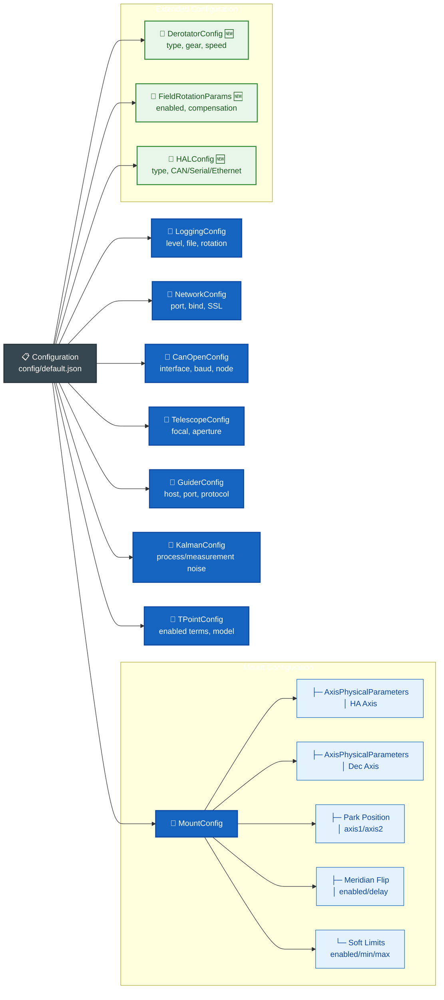
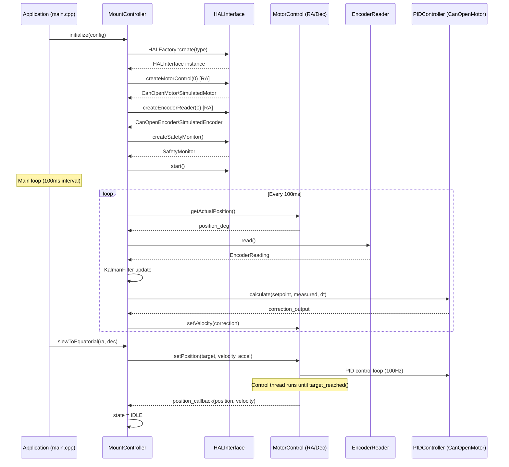
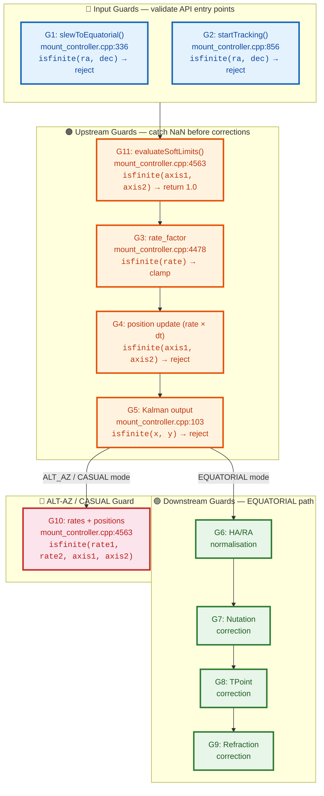

# System Architecture

## Architecture Overview

Astronomical Mount Controller is a modular architecture system designed to provide high-precision tracking of astronomical objects. The system consists of the following layers:

### System Layers

1. **Application Layer** - User interfaces and client applications
2. **API Layer** - gRPC interface for remote control
3. **Business Logic Layer** - Main controller and mathematical models
4. **Communication Layer** - Hardware interfaces (CANopen)
5. **Hardware Layer** - Servo drives, encoders, sensors

## Detailed Component Description

### 1. MountController

#### Responsibilities:
- Integration of all system components
- Mount state management (idle, slewing, tracking, parked, error)
- Coordination of RA and Dec axis movement
- Integration with autoguiding system
- TPOINT calibration management

#### Internal State:
```cpp
struct MountStatus {
    enum class State {
        UNINITIALIZED,
        INITIALIZING,
        IDLE,
        SLEWING,
        TRACKING,
        MERIDIAN_FLIP,   // Automatic meridian flip in progress
        PARKING,
        PARKED,
        ERROR
    };
    
    State state;
    double axis1_position;      // Degrees
    double axis2_position;      // Degrees
    double axis1_rate;          // Degrees/sec
    double axis2_rate;          // Degrees/sec
    double axis1_target;        // Degrees
    double axis2_target;        // Degrees
    
    bool encoders_active;
    bool guider_active;
    bool tpoint_calibrated;
    
    double tracking_error_ra;   // Arcseconds
    double tracking_error_dec;  // Arcseconds
    
    // Meridian flip status
    bool meridian_flipped;      // Has meridian flip been performed
    double time_to_meridian;    // Time to meridian [hours]
    int pier_side;              // 1=East, -1=West
    
    // Soft limit status
    bool soft_limit_warning;    // In warning zone
    bool soft_limit_active;     // In deceleration zone
};
```
```

### 2. AstronomicalCalculations

#### Libraries Used:
- **SOFA** (Standards of Fundamental Astronomy) - astronomical calculations
- **ERFA** (Essential Routines for Fundamental Astronomy) - C version of SOFA library

#### Functionalities:
- Coordinate system transformations:
  - Equatorial (J2000, JNow) ↔ Horizontal
  - Galactic ↔ Ecliptic
- Corrections:
  - Atmospheric refraction (Saastamoinen model)
  - Precession (IAU 2006 model)
  - Nutation (IAU 2000A model)
  - Annual and diurnal aberration
  - Star proper motion
- Time calculations:
  - Local and universal sidereal time
  - Julian Date, Modified Julian Date
  - Ephemerides

### 3. TPointModel

#### Mathematical Model:

Full TPOINT model described by equations:

```
Δα = IA + CA·cos(h) + AN·sin(h)·tan(δ) + AW·cos(h)·tan(δ)
     + TF·sin(h)·sec(δ) + PE·sin(2π·h/PP + φ)
     
Δδ = IE + CD + AN·cos(h) - AW·sin(h)
     + TD·cos(h) + DF·sin(h) + DA·sin(δ)
```

#### Calibration Algorithm:

1. **Measurement Collection**: Minimum 10 measurements distributed across the celestial sphere
2. **Nonlinear Fitting**: Levenberg-Marquardt method
3. **Validation**: χ² test, outlier rejection
4. **Update**: Continuous update through Kalman filter

### 4. KalmanFilter

#### State Model:

```
x = [q, θ, ω, e]ᵀ
```

where:
- `q ∈ ℝ⁴` - orientation quaternion
- `θ ∈ ℝ²¹` - TPOINT parameters
- `ω ∈ ℝ²` - axis angular velocities
- `e ∈ ℝ³` - environmental parameters (T, P, H)

#### Covariance Matrices:

```
P = E[(x - x̂)(x - x̂)ᵀ]  // State covariance matrix
Q = E[wwᵀ]             // Process noise covariance matrix
R = E[vvᵀ]             // Measurement noise covariance matrix
```

#### EKF Algorithm:

```
// Prediction
x̂ₖ₋ = f(x̂ₖ₋₁, uₖ)
Pₖ₋ = FₖPₖ₋₁Fₖᵀ + Qₖ

// Correction
Kₖ = Pₖ₋Hₖᵀ(HₖPₖ₋Hₖᵀ + Rₖ)⁻¹
x̂ₖ = x̂ₖ₋ + Kₖ(zₖ - h(x̂ₖ₋))
Pₖ = (I - KₖHₖ)Pₖ₋
```

### 5. CanOpenInterface

#### CANopen Protocol Implementation:

##### Object Dictionary (OD):
- **Indexes 0x6000-0x9FFF**: Manufacturer-specific objects
- **Indexes 0x2000-0x5FFF**: Standardized device profile objects
- **Indexes 0x1000-0x1FFF**: Communication profile objects

##### PDO (Process Data Objects):
- **TPDO1** (0x1800): Actual position, velocity, torque
- **TPDO2** (0x1801): Drive status, error codes
- **RPDO1** (0x1400): Target position, velocity
- **RPDO2** (0x1401): Control word, operation mode

##### SDO (Service Data Objects):
- Drive parameter configuration
- Object Dictionary read/write
- Block transfers for large data

#### Trajectory Generation:

```cpp
struct TrajectoryParams {
    enum Type { TRAPEZOIDAL, S_SHAPE, SINE, POLYNOMIAL };
    Type type;
    double max_velocity;          // deg/s
    double max_acceleration;      // deg/s²
    double max_jerk;              // deg/s³
    double start_position;        // deg
    double target_position;       // deg
    double update_rate;           // Hz
};
```

### 6. Configuration System

#### Configuration Hierarchy:



#### Configuration Validation:

```cpp
std::vector<std::string> Configuration::validate() const {
    std::vector<std::string> errors;
    
    // Validate location
    if (latitude < -90.0 || latitude > 90.0)
        errors.push_back("Invalid latitude");
    if (longitude < -180.0 || longitude > 180.0)
        errors.push_back("Invalid longitude");
    
    // Validate mount parameters
    if (max_slew_rate <= 0.0)
        errors.push_back("max_slew_rate must be positive");
    if (max_tracking_rate <= 0.0)
        errors.push_back("max_tracking_rate must be positive");
    if (slew_acceleration <= 0.0)
        errors.push_back("slew_acceleration must be positive");
    if (tracking_acceleration <= 0.0)
        errors.push_back("tracking_acceleration must be positive");
    
    // Validate park positions
    if (park_position_axis1 < -360.0 || park_position_axis1 > 360.0)
        errors.push_back("Invalid park_position_axis1");
    if (park_position_axis2 < -360.0 || park_position_axis2 > 360.0)
        errors.push_back("Invalid park_position_axis2");
    
    // Validate soft limits
    if (soft_limits_enabled) {
        if (soft_limit_axis1_min >= soft_limit_axis1_max)
            errors.push_back("Axis1 soft limits: min must be less than max");
        if (soft_limit_axis2_min >= soft_limit_axis2_max)
            errors.push_back("Axis2 soft limits: min must be less than max");
    }
    
    // Validate meridian flip
    if (meridian_flip_enabled && meridian_flip_delay_minutes < 0.0)
        errors.push_back("meridian_flip_delay_minutes must be non-negative");
    
    // Validate Kalman parameters
    if (process_noise <= 0.0)
        errors.push_back("process_noise must be positive");
    if (measurement_noise <= 0.0)
        errors.push_back("measurement_noise must be positive");
    
    // Validate axis physical parameters
    if (ha_axis_params.gear_ratio <= 0.0)
        errors.push_back("HA axis gear_ratio must be positive");
    if (dec_axis_params.gear_ratio <= 0.0)
        errors.push_back("Dec axis gear_ratio must be positive");
    
    return errors;
}
```

## Data Flow

### 1. Object Tracking

```
Client → gRPC(TrackObject) → MountController → AstronomicalCalculations
                                      ↓
                        CanOpenInterface/CiA 402 → Servo drives
                                      ↓
                          Encoders (PDO) → KalmanFilter
                                      ↓
                           TPointModel update
```

### 2. TPOINT Calibration

```
Measurement → AddMeasurement → TPointModel → Nonlinear fitting
                    ↓
             KalmanFilter → Parameter update
                    ↓
          MountController → Apply corrections
```

### 3. Autoguiding

```
Guider → SendGuiderCorrection → MountController → Trajectory generation
                            ↓
                   CanOpenInterface → Velocity correction (PDO)
```

### 4. HAL Integration Flow

The system uses HAL (Hardware Abstraction Layer) to decouple business logic from hardware:




## Resource Management

### System Threads:

1. **Main Thread**: gRPC server, state management
2. **CANopen Thread**: Drive communication, encoder reading
3. **Computational Thread**: Astronomical calculations, Kalman filter
4. **Guider Thread**: Autoguiding system communication

### Synchronization:

```cpp
class MountController::Impl {
    std::mutex state_mutex_;
    std::mutex config_mutex_;
    std::condition_variable cv_;
    std::atomic<bool> running_;
    
    // Thread-safe access to state
    MountStatus getStatus() const {
        std::lock_guard<std::mutex> lock(state_mutex_);
        return status_;
    }
};
```

## Error Handling

### Error Hierarchy:

1. **Communication Errors**: CANopen timeout, gRPC connection lost
2. **Hardware Errors**: Drive fault, encoder failure
3. **Computational Errors**: Numerical instability, convergence failure
4. **Configuration Errors**: Invalid parameters, missing calibration

### NaN/Inf Propagation Guards:

The tracking loop implements a multi-layer defense against NaN/Inf propagation, organized as an upstream/downstream guard pipeline:



- **Upstream guards** (3-5, 10-11): Catch NaN from rate calculations, guider injection, Kalman filter divergence, and soft limit evaluation before they reach astronomical corrections.
- **Downstream guards** (6-9): Catch NaN from nutation, TPoint, and refraction corrections.
- **All guards** use `state_ = ERROR; break;` — immediate tracking loop termination and state transition to ERROR, from which `clearErrors()` can recover to IDLE.

### Recovery Strategies:

1. **clearErrors()**: Transitions ERROR → IDLE, joins work thread, clears HAL errors, notifies callbacks
2. **Retry**: Automatic operation retry (for transient errors)
3. **Fallback**: Transition to safe mode (sidereal tracking)
4. **Reinitialization**: Component reinitialization
5. **Shutdown**: Safe system shutdown

## Performance

### Timing Requirements:

- **API Response Time**: < 10 ms
- **Position Update Frequency**: 100 Hz
- **CANopen Latency**: < 1 ms
- **Astronomical Calculation Time**: < 1 ms

### Resource Usage:

- **CPU**: < 5% per core (typical)
- **Memory**: ~50 MB (including measurement buffering)
- **Network**: ~1 Mbps (gRPC traffic)

## Extensibility

### Extension Points:

1. **New Mathematical Models**: Inherit from `TPointModel`
2. **Additional Hardware Interfaces**: Implement `HardwareInterface`
3. **New Tracking Algorithms**: Implement `TrackingAlgorithm`
4. **Additional Communication Protocols**: Extend `CommunicationInterface`

### Plugin Configuration:

```json
{
  "plugins": {
    "tracking_algorithms": [
      "SiderealTracking",
      "LunarTracking", 
      "SolarTracking",
      "CustomTracking"
    ],
    "hardware_interfaces": [
      "CanOpenInterface",
      "SerialInterface",
      "EtherCATInterface"
    ]
  }
}
```

## Safety

### Safety Mechanisms:

1. **Movement Limits**: Hardware limits, software limits
2. **Temperature Monitoring**: Thermal shutdown protection
3. **Watchdog Timer**: Automatic recovery from hangs
4. **Emergency Stop**: Immediate shutdown on critical fault

### Input Data Validation:

```cpp
bool MountController::slewToEquatorial(double ra, double dec) {
    // Validate coordinates
    if (ra < 0.0 || ra >= 24.0) return false;
    if (dec < -90.0 || dec > 90.0) return false;
    
    // Check mount limits
    if (wouldHitMeridian(ra, dec)) return false;
    if (wouldHitHorizon(ra, dec)) return false;
    
    // Proceed with slew
    return startSlew(ra, dec);
}