# System Architecture

## Architecture Overview

Astronomical Mount Controller is a modular, hybrid-architecture system designed for high-precision tracking of astronomical objects with sub-arcsecond accuracy. The mount controller is the central process and hosts the **dome, derotator and focuser subsystems in-process**; the weather, power, sequencer and object-database services still run as independent processes communicating over gRPC. A web proxy (HTTP/JSON → gRPC) exposes the system to browsers, while native ASCOM and INDI drivers integrate with astronomy ecosystems.

### System Layers

1. **Application Layer** — Web SPA, Qt GUI, ASCOM/INDI drivers, Python/C++ clients
2. **API Layer** — gRPC services (mount controller, dome, derotator, focuser in-process; object database, weather, power, sequencer, camera, PEC, ST4, notification, pulley)
3. **Business Logic Layer** — MountController, controllers, mathematical models (TPOINT, Kalman, ephemeris)
4. **Service Layer** — in-process subsystems (dome, derotator, focuser) + stand-alone gRPC services (weather, power, sequencer, object database)
5. **Communication Layer** — hardware abstraction (CANopen, serial, Ethernet, gamepad, MF7025v2, simulated)
6. **Hardware Layer** — servo/stepper drives, encoders, sensors, focusers, cameras, domes, power

### High-Level Architecture Diagram

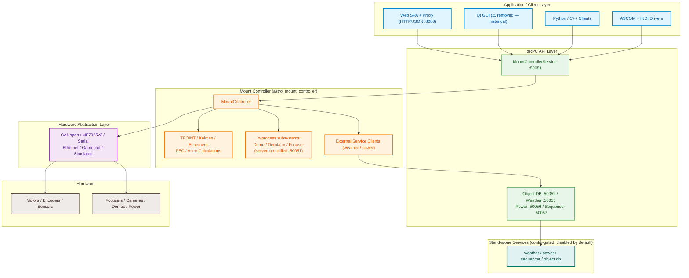
```mermaid
flowchart TB
    classDef client fill:#e1f5fe,stroke:#0288d1,stroke-width:2px,color:#01579b
    classDef api fill:#e8f5e9,stroke:#388e3c,stroke-width:2px,color:#1b5e20
    classDef core fill:#fff3e0,stroke:#f57c00,stroke-width:2px,color:#e65100
    classDef svc fill:#e0f2f1,stroke:#00796b,stroke-width:2px,color:#004d40
    classDef hal fill:#f3e5f5,stroke:#7b1fa2,stroke-width:2px,color:#4a148c
    classDef hw fill:#efebe9,stroke:#4e342e,stroke-width:2px,color:#3e2723

    subgraph CLIENTS["Application / Client Layer"]
        WEB["Web SPA + Proxy (HTTP/JSON :8080)"]
        QT["Qt GUI (⚠️ removed — historical)"]
        PY["Python / C++ Clients"]
        DRV["ASCOM + INDI Drivers"]
    end

    subgraph API["gRPC API Layer"]
        GRPC["MountControllerService :50051"]
        EXT["Object DB :50052 / Weather :50055<br/>Power :50056 / Sequencer :50057"]
    end

    subgraph CORE["Mount Controller (astro_mount_controller)"]
        MC["MountController"]
        MODELS["TPOINT / Kalman / Ephemeris<br/>PEC / Astro Calculations"]
        INPROC["In-process subsystems:<br/>Dome / Derotator / Focuser<br/>(served on unified :50051)"]
        CLIENTSVC["External Service Clients (weather / power)"]
    end

    subgraph SERVICES["Stand-alone Services (config-gated, disabled by default)"]
        SVCS["weather / power / sequencer / object db"]
    end

    subgraph HAL["Hardware Abstraction Layer"]
        HALIMPL["CANopen / MF7025v2 / Serial<br/>Ethernet / Gamepad / Simulated"]
    end

    subgraph HW["Hardware"]
        HW1["Motors / Encoders / Sensors"]
        HW2["Focusers / Cameras / Domes / Power"]
    end

    WEB --> GRPC
    QT --> GRPC
    PY --> GRPC
    DRV --> GRPC
    GRPC --> MC
    MC --> MODELS
    MC --> INPROC
    MC --> CLIENTSVC
    CLIENTSVC --> EXT
    EXT --> SVCS
    MC --> HALIMPL
    HALIMPL --> HW1
    HALIMPL --> HW2

    class WEB,QT,PY,DRV client
    class GRPC,EXT api
    class MC,MODELS,INPROC,CLIENTSVC core
    class SVCS svc
    class HALIMPL hal
    class HW1,HW2 hw
```


### Services and Ports

| Executable | Directory | Default gRPC Port | Purpose |
|-----------|-----------|-------------------|---------|
| `astro_mount_controller` | [`src/`](src/main.cpp) | **50051** (unified API) | Central mount controller (state machine, tracking, calibration) **plus in-process dome, derotator and focuser services** |
| `astro_object_database_server` | [`db/`](db/src/main.cpp) | 50052 | SQLite-backed astronomical object catalog |
| `astro_weather_server` | [`weather/`](weather/src/main.cpp) | 50055 | Weather monitoring, alerts, auto-park |
| `astro_power_server` | [`power/`](power/src/main.cpp) | 50056 | Battery/power monitoring, output switching |
| `astro_sequencer_server` | [`sequencer/`](sequencer/src/main.cpp) | 50057 | Observation sequence management |
| Web proxy | [`web/proxy/`](web/proxy/server.js) | 8080 (HTTP) | HTTP/JSON ↔ gRPC bridge + SPA hosting |

**Unified gRPC API on a single port (50051).** The dome, derotator and focuser services are registered on the **same gRPC server** as the mount controller service, so all four APIs are reachable **exclusively on port 50051** from a single channel (e.g. `DomeService/GetStatus` via 50051). No separate legacy ports are used — the in-process services are served only through the unified mount controller port.

The **dome, derotator and focuser subsystems are hosted in-process inside `astro_mount_controller`** — they are no longer separate executables and are served only through the unified port 50051. Weather, power, sequencer and object database remain stand-alone gRPC processes. All integrations are **disabled by default** and enabled via the `external_services` section of the configuration. For the stand-alone weather/power services the `address` field is the endpoint the mount controller connects to. The web proxy enables its extra routes/tabs via `EXT_SERVICE_*` environment variables.

---

## Shared Core Library (`astro_mount_core`)

All executables link against a single static library, `astro_mount_core` (see [`CMakeLists.txt`](CMakeLists.txt:318)), which contains:

- **Controllers** — [`src/controllers/`](src/controllers/)
- **Mathematical models** — [`src/models/`](src/models/)
- **Core astronomical calculations** — [`src/core/`](src/core/)
- **HAL implementations** — [`src/hal/`](src/hal/)
- **Configuration, logging, notifications, weather** — [`src/config/`](src/config/), [`src/logging/`](src/logging/), [`src/notifications/`](src/notifications/), [`src/weather/`](src/weather/)
- **Sequencer logic** — [`src/sequencer/`](src/sequencer/)

Shared headers live in [`include/`](include/). The SOFA library is compiled in as `sofa_static`.

---

## Detailed Component Description

### 1. MountController ([`include/controllers/mount_controller.h`](include/controllers/mount_controller.h) / [`src/controllers/mount_controller.cpp`](src/controllers/mount_controller.cpp))

The central component. Integrates all mount subsystems, manages the state machine, runs the tracking loop, and coordinates axis movement.

#### Responsibilities
- Mount state management (`UNINITIALIZED`, `INITIALIZING`, `IDLE`, `SLEWING`, `TRACKING`, `MERIDIAN_FLIP`, `PARKING`, `PARKED`, `ERROR`)
- Coordination of RA (axis1) and Dec (axis2) movement
- Automatic meridian flip with configurable delay, hysteresis, and timeout
- 3-zone soft limit system (warning, deceleration, hard-stop)
- Bootstrap calibration (initial alignment) and TPOINT precise calibration
- Ephemeris tracking of comets, asteroids, and satellites
- Guider integration, PEC application, gamepad manual control
- Integration with external services (dome sync, derotator updates, weather/power auto-park)
- 11 NaN/Inf propagation guards in the tracking loop

#### Internal State
```cpp
struct MountStatus {
    enum class State {
        UNINITIALIZED, INITIALIZING, IDLE, SLEWING, TRACKING,
        MERIDIAN_FLIP, PARKING, PARKED, ERROR
    };

    State state;
    double axis1_position;           // Degrees (servo/motor shaft)
    double axis2_position;           // Degrees (servo/motor shaft)
    double telescope_axis1_position; // Degrees (telescope axis, after gear ratio)
    double telescope_axis2_position; // Degrees (telescope axis, after gear ratio)
    double axis1_rate;               // Degrees/sec
    double axis2_rate;               // Degrees/sec
    double axis1_target;             // Degrees
    double axis2_target;             // Degrees

    bool encoders_active;
    bool guider_active;
    bool tpoint_calibrated;

    double tracking_error_ra;   // Arcseconds
    double tracking_error_dec;  // Arcseconds

    /// Meridian flip status
    bool meridian_flip_pending{false};      ///< Flip pending (waiting for delay)
    bool meridian_flip_in_progress{false};  ///< Flip slew being executed
    int pier_side{1};                       ///< 1=East pier, -1=West pier
    double time_to_meridian{0.0};           ///< Time until meridian crossing [hours]

    /// Soft safety limits status
    bool soft_limit_warning_active{false};
    bool soft_limit_deceleration_active{false};
    double soft_limit_distance_axis1{0.0};
    double soft_limit_distance_axis2{0.0};
    std::string soft_limit_warning_message;

    // Bootstrap / encoder status fields
    bool encoders_absolute{false};
    int bootstrap_mode{0};
    bool bootstrap_calibrated{false};
    int bootstrap_measurement_count{0};

    std::chrono::system_clock::time_point timestamp;
    std::string error_message;
};
```

### 2. AstronomicalCalculations ([`include/core/astronomical_calculations.h`](include/core/astronomical_calculations.h))

#### Libraries Used
- **SOFA** (Standards of Fundamental Astronomy) — compiled as `sofa_static` from the [`sofa/`](sofa/) directory

#### Functionalities
- Coordinate system transformations:
  - Equatorial (J2000, JNow) ↔ Horizontal
  - Hour Angle ↔ Equatorial
  - Galactic ↔ Ecliptic
- Corrections:
  - Atmospheric refraction (Saastamoinen model + Saemundsson formula)
  - Precession (IAU 2006 model)
  - Nutation (IAU 2000A model)
  - Annual and diurnal aberration, light-time, gravitational deflection
  - Star proper motion
- Time calculations: local/universal sidereal time, Julian Date, Modified Julian Date, ephemerides

### 3. TPointModel ([`include/models/tpoint_model.h`](include/models/tpoint_model.h))

#### Mathematical Model
Full TPOINT pointing-error model (21+ parameters):

```
Δα = IA + CA·cos(h) + AN·sin(h)·tan(δ) + AW·cos(h)·tan(δ)
     + TF·sin(h)·sec(δ) + PE·sin(2π·h/PP + φ)

Δδ = IE + CD + AN·cos(h) - AW·sin(h)
     + TD·cos(h) + DF·sin(h) + DA·sin(δ)
```

#### Calibration Algorithm
1. **Measurement collection** — minimum 10 measurements distributed across the celestial sphere
2. **Linear least-squares fit** with QR decomposition (solver)
3. **Validation** — χ² test, residual RMS/max, outlier rejection
4. **Continuous update** through the Kalman filter

### 4. KalmanFilter ([`include/models/kalman_filter.h`](include/models/kalman_filter.h))

#### State Model
```
x = [q, θ, ω, e]ᵀ
```
where:
- `q ∈ ℝ⁴` — orientation quaternion
- `θ ∈ ℝ²¹` — TPOINT parameters
- `ω ∈ ℝ²` — axis angular velocities
- `e ∈ ℝ³` — environmental parameters (T, P, H)

#### Algorithm
Extended Kalman filter with Joseph-form covariance update:

```
// Prediction
x̂ₖ₋ = f(x̂ₖ₋₁, uₖ)
Pₖ₋ = FₖPₖ₋₁Fₖᵀ + Qₖ

// Correction
Kₖ = Pₖ₋Hₖᵀ(HₖPₖ₋Hₖᵀ + Rₖ)⁻¹
x̂ₖ = x̂ₖ₋ + Kₖ(zₖ - h(x̂ₖ₋))
Pₖ = (I - KₖHₖ)Pₖ₋
```

### 5. EphemerisTracker ([`include/models/ephemeris_tracker.h`](include/models/ephemeris_tracker.h))

Tracks moving objects (comets, asteroids, satellites) by interpolating uploaded ephemeris data (linear/quadratic/cubic), with earth-rotation correction, prediction beyond the ephemeris range, and metrics collection.

### 6. PECModel ([`include/models/pec_model.h`](include/models/pec_model.h))

Periodic Error Correction: samples encoder error over worm cycles, extracts harmonics (default 8) via FFT, and applies phase-synchronized correction during tracking.

### 7. Configuration System ([`include/config/configuration.h`](include/config/configuration.h) / [`src/config/configuration.cpp`](src/config/configuration.cpp))

JSON-based configuration with 25+ field validations, a config monitor for hot-reload, and domain-specific sub-configs (mount, tracking, safety, calibration). The `external_services` section gates the in-process subsystems (dome, derotator, focuser) and the stand-alone service clients (weather, power). The in-process subsystems are served on the unified gRPC port 50051. For the stand-alone services (weather, power) `address` is the endpoint the mount controller connects to.

```json
{
  "external_services": {
    "dome":       { "enabled": false, "address": "127.0.0.1:50051", "update_interval_ms": 1000 },
    "derotator":  { "enabled": false, "address": "127.0.0.1:50051", "update_interval_ms": 1000 },
    "focuser":    { "enabled": false, "address": "127.0.0.1:50051", "poll_interval_ms": 5000 },
    "weather":    { "enabled": false, "address": "127.0.0.1:50055", "poll_interval_ms": 10000 },
    "power":      { "enabled": false, "address": "127.0.0.1:50056", "poll_interval_ms": 10000 }
  }
}
```

### 8. Hardware Abstraction Layer ([`include/hal/`](include/hal/))

The HAL decouples business logic from hardware. The [`HALInterface`](include/hal/hal_interface.h) is the abstract entry point; [`hal_factory`](include/hal/hal_factory.h) creates the concrete implementation based on configuration.

| HAL Implementation | Transport / Protocol | Source |
|--------------------|----------------------|--------|
| **CANopen** | CiA 301 / CiA 402 (SocketCAN + CANopenNode) | [`src/hal/canopen_hal/`](src/hal/canopen_hal/) |
| **MF7025v2** | Proprietary CAN protocol V2.36 (LingKong BLDC) | [`src/hal/mf7025v2_hal/`](src/hal/mf7025v2_hal/) |
| **Serial** | RS-232/485 Modbus RTU with CRC16 | [`src/hal/serial_hal/`](src/hal/serial_hal/) |
| **Ethernet** | Modbus TCP with retry | [`src/hal/ethernet_hal/`](src/hal/ethernet_hal/) |
| **Gamepad** | Linux evdev joystick with hotplug | [`src/hal/gamepad_hal/`](src/hal/gamepad_hal/) |
| **Simulated** | No hardware (testing/development) | [`src/hal/simulated_hal/`](src/hal/simulated_hal/) |

Additional device HALs used by the stand-alone services and the core:

- **Dome HAL** — [`src/hal/dome_hal/`](src/hal/dome_hal/) (serial, rolloff, simulated)
- **Derotator HAL** — [`src/hal/derotator_hal/`](src/hal/derotator_hal/) (TMC5160, simulated)
- **Camera HAL** — [`src/hal/camera_hal/`](src/hal/camera_hal/) (ZWO ASI, simulated)
- **Focuser HAL** — [`src/hal/focuser_hal/`](src/hal/focuser_hal/) (ZWO EAF, MoonLite, Pegasus, simulated)
- **Power HAL** — [`src/hal/power_hal/`](src/hal/power_hal/) (I²C, simulated)
- **ST4 HAL** — [`src/hal/st4_hal/`](src/hal/st4_hal/) (GPIO sysfs/libgpiod, FTDI, MCP2221, Arduino, simulated)

#### CANopen / CiA 402 Details
- **Object Dictionary (OD)**: 0x1000–0x1FFF communication profile, 0x2000–0x5FFF device profile, 0x6000–0x9FFF manufacturer-specific
- **PDO**: TPDO1 (position/velocity/torque), TPDO2 (drive status/errors), RPDO1 (targets), RPDO2 (control word/mode)
- **SDO**: parameter configuration, OD read/write, block transfers
- **Position rewind**: periodic reset of drive absolute position counter to avoid overflow beyond ±1,000,000 counts

### 9. Subsystem Services

Dome, derotator and focuser are **hosted in-process** inside `astro_mount_controller` (their service implementations are compiled into the mount controller executable and registered on its gRPC server). Weather, power, sequencer and object database remain **stand-alone processes** with their own `main.cpp`, server wrapper, and service implementation, all linked against `astro_mount_core`.

#### 9.1 Dome Service (in-process, [`dome/`](dome/))
- Served in-process on the unified gRPC port 50051
- `OpenShutter`, `CloseShutter`, `RotateTo`, `Halt`, `Park`, `Unpark`, `GoHome`, `GetStatus`, `WatchStatus`, `SetAutoSync`, `GetAutoSync`, `UpdateMountAzimuth`, `CheckHealth`
- Supports rotating domes and roll-off roofs
- Auto-sync with mount azimuth: the mount controller feeds `setMountAzimuth()` directly in-process (no gRPC round-trip)

#### 9.2 Derotator Service (in-process, [`derotator/`](derotator/))
- Served in-process on the unified gRPC port 50051
- `SetMode` (DISABLED/AUTO/FIXED_ANGLE/MANUAL_RATE), `SetAngle`, `SetRate`, `Home`, `GetStatus`, `WatchStatus`, `GetFieldRotation`, `UpdateMountPosition`, `CheckHealth`
- Receives mount position updates: the mount controller feeds `setMountPosition()` directly in-process for automatic field derotation

#### 9.3 Weather Service ([`weather/`](weather/), stand-alone)
- `GetWeatherStatus`, `GetWeatherHistory`, `SetWeatherRules`, `SubscribeWeatherAlerts`
- Local sensors (rain, wind, cloud, GPS) and API sources (OpenWeatherMap, Weather.gov, IMGW)
- Alert levels (CLEAR/CAUTION/WARNING/DANGER), `safe_to_observe`, auto-park on danger

#### 9.4 Power Service ([`power/`](power/), stand-alone)
- `GetPowerStatus`, `SetPowerOutput`, `GetPowerHistory`
- Battery voltage/current/power/capacity monitoring, output switching, low-battery auto-park

#### 9.5 Sequencer Service ([`sequencer/`](sequencer/), stand-alone)
- `LoadPlan`, `StartSequencer`, `StopSequencer`, `PauseSequencer`, `GetSequencerStatus`
- Observation plans with targets (exposure time, gain, binning, filter, exposure count)
- In simulated mode uses dummy callbacks; in real mode connects to mount/camera/focuser via gRPC

#### 9.6 Focuser Service (in-process, [`focuser/`](focuser/))
- Served in-process on the unified gRPC port 50051
- `MoveFocuser`, `HaltFocuser`, `GetFocuserPosition`, `RunAutoFocus` (streaming), `SetTemperatureCompensation`, `GetTempCompensationStatus`
- Auto-focus via HFD/FWHM V-curve analysis (parabolic/hyperbolic fit), focus curve model

#### 9.7 Object Database Service ([`db/`](db/), stand-alone)
- SQLite-backed astronomical object catalog (full CRUD with pagination and search)
- Multiple catalog support (Messier, NGC, IC, Caldwell, HYG, SAO, etc.)
- Favorite objects, categories, import/export

### 10. Notification Engine ([`src/notifications/`](src/notifications/))

Centralized event/alert delivery with channels:
- **Email** (SMTP with TLS), **Webhook** (HTTP POST/PUT with auth), **MQTT**, **Log**
- Event categories: mount, weather, sequencer, power, session, system, guider, focuser, camera, dome
- Severity filtering (DEBUG…CRITICAL), real-time event subscription via gRPC streaming

### 11. Web Proxy (HTTP/JSON → gRPC) ([`web/proxy/`](web/proxy/))

Node.js Express proxy bridging browsers to the gRPC backends:

```
Browser (SPA) → HTTP/JSON :8080 → Proxy Server → gRPC → Mount Controller / Services
```

- REST routes: mount, axis, calibration, tracking, config, HAL, state, database, health, logs
- Extended routes (config-gated): PEC, power, guider, derotator, sequencer, camera, focuser, dome, weather, pulley
- Static SPA hosting, CORS, SSL/TLS, configurable gRPC addresses (see [`web/proxy/config.js`](web/proxy/config.js))

### 12. Web SPA ([`web/public/`](web/public/))

Single-page application (vanilla JS) with components for status, mount control, calibration, tracking, database, settings, and (when enabled) dome, derotator, weather, power, sequencer, focuser, camera, PEC, guider, pulley, notifications.

### 13. Qt GUI ([`gui/`](gui/)) — ⚠️ **NOT AVAILABLE (2026-08-11)**

> ⚠️ The Qt GUI source code has been **removed from this repository** (the `gui/` directory now contains only stale build artifacts). This section is kept for historical reference — the application cannot be built from the current tree. Use the **Web SPA** instead.

Native Qt (Widgets/Network/Svg/Charts) desktop application, `astro_mount_gui`, using a gRPC client ([`gui/src/grpc_client.cpp`](gui/src/grpc_client.cpp)) with panels for mount, status, calibration wizard, sequencer, dome, focuser, camera, weather, derotator, PEC, power, notifications, and settings, plus widgets (sky map, star chart, focus graph, weather plot).

### 14. ASCOM Drivers (C#)

- **Telescope** ([`ascom/AstroMountTelescope.cs`](ascom/AstroMountTelescope.cs)) — `ITelescopeV3`: `SlewToCoordinates`, `PulseGuide`, `MoveAxis`, Park/Unpark, TPOINT status, environmental queries. Uses a `StateCache` polling `GetState()` every 2 s for low-latency property reads. Serves via Alpaca REST.
- **Rotator** ([`ascom_rotator/AstroMountRotator.cs`](ascom_rotator/AstroMountRotator.cs)) — `IRotatorV3`: `MoveAbsolute`, `Move(rate)`, `Halt`, `Home`.

### 15. INDI Drivers (C++)

- **Telescope** ([`indi/astro_mount_driver.cpp`](indi/astro_mount_driver.cpp)) — `INDI::Telescope` for Ekos/KStars: `MoveNS`/`MoveWE` (axis_id 0=RA/WE, 1=Dec/NS, ±1.0 deg/s), `TPOINT_STATUS` text property, `EnvironmentNP` number property, park/sync/abort. All gRPC via [`MountGrpcClient`](indi/MountGrpcClient.cpp).
- **Rotator** ([`indi_rotator/astro_mount_rotator_driver.cpp`](indi_rotator/astro_mount_rotator_driver.cpp)) — `INDI::Rotator`: `MoveRotator`, `HomeRotator`, `AbortRotator`; `CONNECTION_NONE` mode (gRPC only).

---

## Data Flow

### 1. Object Tracking

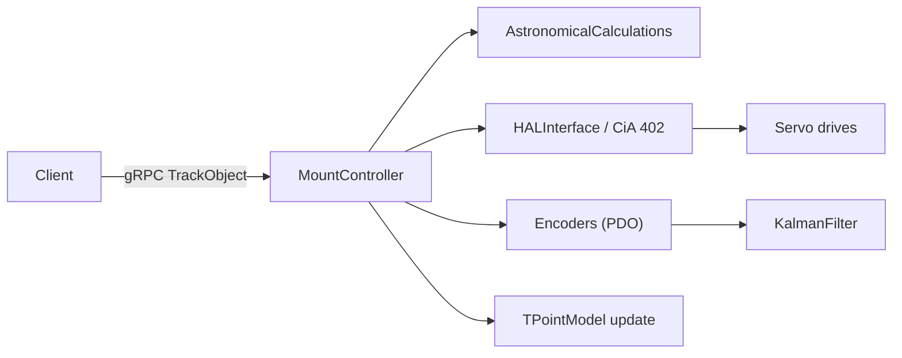
```mermaid
flowchart LR
    CLIENT["Client"] -->|gRPC TrackObject| MC["MountController"]
    MC --> ASTRO["AstronomicalCalculations"]
    MC --> HAL["HALInterface / CiA 402"]
    HAL --> DRIVES["Servo drives"]
    MC --> ENC["Encoders (PDO)"]
    ENC --> KF["KalmanFilter"]
    MC --> TP["TPointModel update"]
```

### 2. TPOINT Calibration

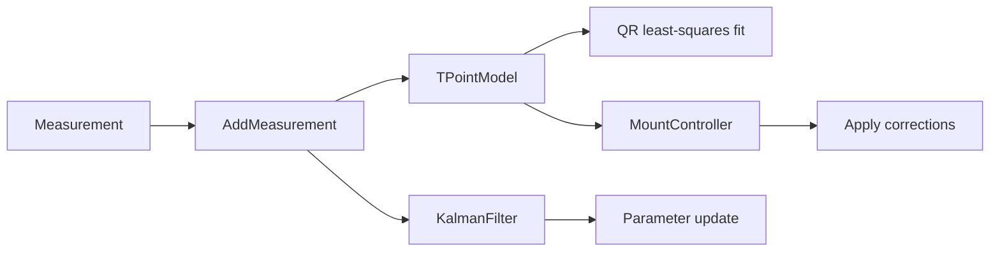
```mermaid
flowchart LR
    MEAS["Measurement"] --> ADD["AddMeasurement"]
    ADD --> TPM["TPointModel"]
    TPM --> FIT["QR least-squares fit"]
    ADD --> KF2["KalmanFilter"]
    KF2 --> PARAM["Parameter update"]
    TPM --> MC2["MountController"]
    MC2 --> CORR["Apply corrections"]
```

### 3. Autoguiding

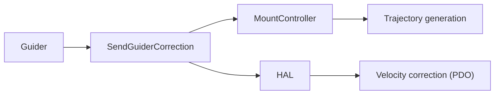
```mermaid
flowchart LR
    GUIDER["Guider"] --> CORR2["SendGuiderCorrection"]
    CORR2 --> MC3["MountController"]
    MC3 --> TRAJ["Trajectory generation"]
    CORR2 --> HAL2["HAL"]
    HAL2 --> VEL["Velocity correction (PDO)"]
```

### 4. Subsystem / External Service Integration Flow

Dome, derotator and focuser run **in-process** (the mount controller feeds them mount data directly). Weather and power remain external gRPC services polled by the mount controller:

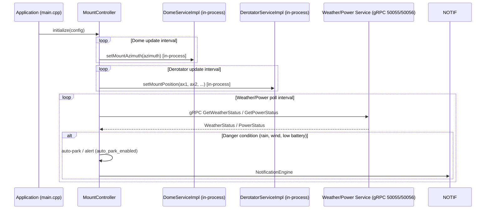
```mermaid
sequenceDiagram
    participant APP as Application (main.cpp)
    participant MC as MountController
    participant DOME as DomeServiceImpl (in-process)
    participant DEROT as DerotatorServiceImpl (in-process)
    participant EXT as Weather/Power Service (gRPC 50055/50056)

    APP->>MC: initialize(config)

    loop Dome update interval
        MC->>DOME: setMountAzimuth(azimuth) [in-process]
    end

    loop Derotator update interval
        MC->>DEROT: setMountPosition(ax1, ax2, ...) [in-process]
    end

    loop Weather/Power poll interval
        MC->>EXT: gRPC GetWeatherStatus / GetPowerStatus
        EXT-->>MC: WeatherStatus / PowerStatus
        alt Danger condition (rain, wind, low battery)
            MC->>MC: auto-park / alert (auto_park_enabled)
            MC->>NOTIF: NotificationEngine
        end
    end
```

### 5. HAL Integration Flow

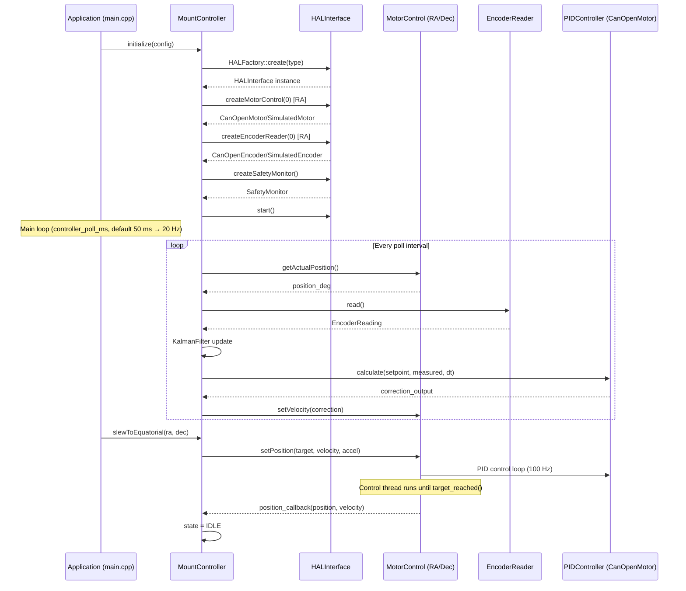
```mermaid
sequenceDiagram
    participant APP as Application (main.cpp)
    participant MC as MountController
    participant HAL as HALInterface
    participant MOT as MotorControl (RA/Dec)
    participant ENC as EncoderReader
    participant PID as PIDController (CanOpenMotor)

    APP->>MC: initialize(config)
    MC->>HAL: HALFactory::create(type)
    HAL-->>MC: HALInterface instance
    MC->>HAL: createMotorControl(0) [RA]
    HAL-->>MC: CanOpenMotor/SimulatedMotor
    MC->>HAL: createEncoderReader(0) [RA]
    HAL-->>MC: CanOpenEncoder/SimulatedEncoder
    MC->>HAL: createSafetyMonitor()
    HAL-->>MC: SafetyMonitor
    MC->>HAL: start()

    Note over APP: Main loop (controller_poll_ms, default 50 ms → 20 Hz)

    loop Every poll interval
        MC->>MOT: getActualPosition()
        MOT-->>MC: position_deg
        MC->>ENC: read()
        ENC-->>MC: EncoderReading
        MC->>MC: KalmanFilter update
        MC->>PID: calculate(setpoint, measured, dt)
        PID-->>MC: correction_output
        MC->>MOT: setVelocity(correction)
    end

    APP->>MC: slewToEquatorial(ra, dec)
    MC->>MOT: setPosition(target, velocity, accel)
    MOT->>PID: PID control loop (100 Hz)
    Note over MOT: Control thread runs until target_reached()
    MOT-->>MC: position_callback(position, velocity)
    MC->>MC: state = IDLE
```

---

## Resource Management

### System Threads (Mount Controller Process)

1. **Main Thread** — gRPC server, state management
2. **HAL Thread(s)** — drive communication, encoder reading (per HAL implementation)
3. **Tracking/Computational Thread** — astronomical calculations, Kalman filter, PEC
4. **Guider Thread** — autoguiding system communication
5. **Derotator Thread** — async derotator homing/calibration (managed by [`DerotatorController`](include/controllers/derotator_controller.h))
6. **Weather/Power Polling Threads** — external service status polling (when enabled)
7. **Gamepad Thread** — manual control loop (when started)

### Synchronization

```cpp
class MountController::Impl {
    std::shared_mutex state_mutex_;
    std::mutex config_mutex_;
    std::condition_variable cv_;
    std::atomic<bool> running_;
    std::atomic<bool> reentrancy_guard_;

    // Thread-safe access to state
    MountStatus getStatus() const {
        std::shared_lock<std::shared_mutex> lock(state_mutex_);
        return status_;
    }
};
```

---

## Error Handling

### Error Hierarchy

1. **Communication Errors** — CANopen timeout, gRPC connection lost
2. **Hardware Errors** — drive fault, encoder failure, dead CAN node
3. **Computational Errors** — numerical instability, convergence failure, Kalman divergence
4. **Configuration Errors** — invalid parameters, missing calibration

### NaN/Inf Propagation Guards

The tracking loop implements a multi-layer defense against NaN/Inf propagation, organized as an upstream/downstream guard pipeline:

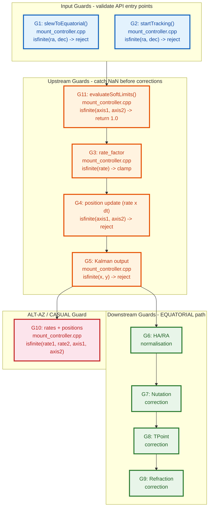
```mermaid
flowchart TB
    %% Styles
    classDef input fill:#e3f2fd,stroke:#1565c0,stroke-width:3px,color:#0d47a1
    classDef upstream fill:#fff3e0,stroke:#e65100,stroke-width:3px,color:#bf360c
    classDef downstream fill:#e8f5e9,stroke:#2e7d32,stroke-width:3px,color:#1b5e20
    classDef altaz fill:#fce4ec,stroke:#c62828,stroke-width:3px,color:#b71c1c

    subgraph INPUT["Input Guards - validate API entry points"]
        direction TB
        G1["G1: slewToEquatorial()<br/>mount_controller.cpp<br/>isfinite(ra, dec) -> reject"]
        G2["G2: startTracking()<br/>mount_controller.cpp<br/>isfinite(ra, dec) -> reject"]
    end

    subgraph UPSTREAM["Upstream Guards - catch NaN before corrections"]
        direction TB
        G11["G11: evaluateSoftLimits()<br/>mount_controller.cpp<br/>isfinite(axis1, axis2) -> return 1.0"]
        G3["G3: rate_factor<br/>mount_controller.cpp<br/>isfinite(rate) -> clamp"]
        G4["G4: position update (rate x dt)<br/>isfinite(axis1, axis2) -> reject"]
        G5["G5: Kalman output<br/>mount_controller.cpp<br/>isfinite(x, y) -> reject"]
    end

    subgraph DOWNSTREAM["Downstream Guards - EQUATORIAL path"]
        direction LR
        G6["G6: HA/RA<br/>normalisation"]
        G7["G7: Nutation<br/>correction"]
        G8["G8: TPoint<br/>correction"]
        G9["G9: Refraction<br/>correction"]
    end

    subgraph ALTAZ["ALT-AZ / CASUAL Guard"]
        G10["G10: rates + positions<br/>mount_controller.cpp<br/>isfinite(rate1, rate2, axis1, axis2)"]
    end

    INPUT --> G11
    G11 --> G3
    G3 --> G4
    G4 --> G5
    G5 --> G6
    G5 --> G10
    G6 --> G7
    G7 --> G8
    G8 --> G9

    class G1,G2 input
    class G11,G3,G4,G5 upstream
    class G6,G7,G8,G9 downstream
    class G10 altaz
```

- **Upstream guards** (3–5, 10–11): catch NaN from rate calculations, guider injection, Kalman filter divergence, and soft-limit evaluation before they reach astronomical corrections.
- **Downstream guards** (6–9): catch NaN from nutation, TPoint, and refraction corrections.
- **All guards** use `state_ = ERROR; break;` — immediate tracking-loop termination and transition to `ERROR`, from which `clearErrors()` recovers to `IDLE`.

### Recovery Strategies

1. **clearErrors()** — transitions `ERROR → IDLE`, joins the work thread, clears HAL errors, notifies callbacks
2. **Retry** — automatic retry for transient errors
3. **Fallback** — transition to safe mode (sidereal tracking)
4. **Reinitialization** — component reinitialization (`ReinitializeHAL`)
5. **Restart** — soft/hard controller restart (`RestartController` / `HardRestartController`)
6. **Shutdown** — safe system shutdown

---

## External Driver Architecture

The system includes four astronomy-standard drivers that connect to the gRPC API as external clients.

### 16. ASCOM Telescope Driver ([`ascom/AstroMountTelescope.cs`](ascom/AstroMountTelescope.cs))

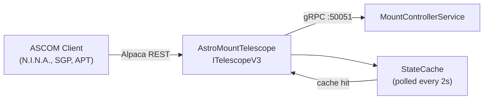
```mermaid
flowchart LR
    ASCOM["ASCOM Client<br/>(N.I.N.A., SGP, APT)"] -->|"Alpaca REST"| AST["AstroMountTelescope<br/>ITelescopeV3"]
    AST -->|"gRPC :50051"| GRPC["MountControllerService"]
    AST --> SC["StateCache<br/>(polled every 2s)"]
    SC -->|"cache hit"| AST
```

**Key integration points:**
- `SlewToCoordinates()` → gRPC `SlewToCoordinates`
- `PulseGuide()` → gRPC `SendGuiderCorrection`
- `MoveAxis(axis, rate)` → gRPC `ControlAxis(AxisControlRequest { VELOCITY_CONTROL })`
- `Action("tpoint_status")` → reads `ControllerState.tpoint_params` from `GetState`
- `SetPark()` → reads state, updates controller config park position
- `SupportedActions`: `tpoint_status`, `temperature`, `pressure`, `humidity`, `tracking_rate_ra`, `tracking_rate_dec`, `guider_status`, `derotator_status`

### 17. ASCOM Rotator Driver ([`ascom_rotator/AstroMountRotator.cs`](ascom_rotator/AstroMountRotator.cs))

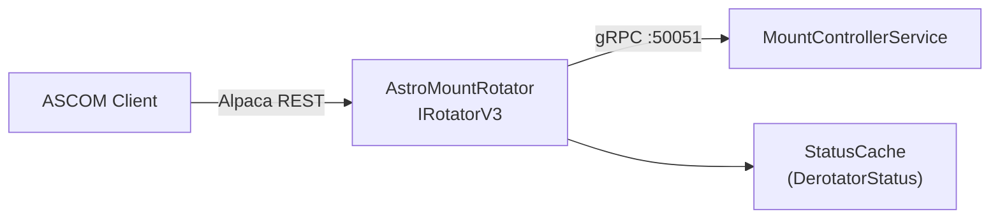
```mermaid
flowchart LR
    ASCOMR["ASCOM Client"] -->|"Alpaca REST"| AROT["AstroMountRotator<br/>IRotatorV3"]
    AROT -->|"gRPC :50051"| GRPCR["MountControllerService"]
    AROT --> RC["StatusCache<br/>(DerotatorStatus)"]
```

**Key integration points:**
- `MoveAbsolute(position)` → gRPC `ControlFieldRotation(FIXED_ANGLE, target_angle)`
- `Move(rate)` → gRPC `ControlFieldRotation(CUSTOM, rotation_rate)`
- `Halt()` → gRPC `ControlFieldRotation(DISABLED)`
- `Home()` → gRPC `HomeDerotator(SEQUENTIAL)`
- `Position` → cached from `GetDerotatorStatus`

### 18. INDI Telescope Driver ([`indi/astro_mount_driver.cpp`](indi/astro_mount_driver.cpp))

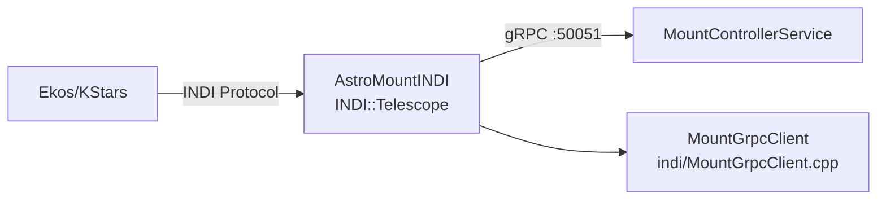
```mermaid
flowchart LR
    EKOS["Ekos/KStars"] -->|"INDI Protocol"| TEL["AstroMountINDI<br/>INDI::Telescope"]
    TEL -->|"gRPC :50051"| GRPC2["MountControllerService"]
    TEL --> GRPC_CLIENT["MountGrpcClient<br/>indi/MountGrpcClient.cpp"]
```

**Key integration points:**
- `MoveNS`/`MoveWE` → gRPC `ControlAxis(axis_id=1/0, VELOCITY_CONTROL, ±1.0 deg/s)`
- `SetCurrentPark()` → reads `ControllerState.current_position()` → `SetParkData()` → updates config
- `TPOINT_STATUS` → `ITextVectorProperty` (COEFFICIENTS, CHI2, CALIBRATED)
- `EnvironmentNP` → `INumberVectorProperty` (TEMPERATURE, PRESSURE, HUMIDITY)

### 19. INDI Rotator Driver ([`indi_rotator/astro_mount_rotator_driver.cpp`](indi_rotator/astro_mount_rotator_driver.cpp))

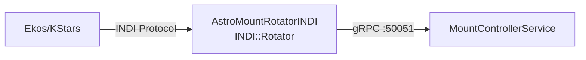
```mermaid
flowchart LR
    EKOS2["Ekos/KStars"] -->|"INDI Protocol"| ROT["AstroMountRotatorINDI<br/>INDI::Rotator"]
    ROT -->|"gRPC :50051"| GRPC3["MountControllerService"]
```

**Key integration points:**
- `MoveRotator(angle)` → gRPC `ControlFieldRotation(FIXED_ANGLE)`
- `AbortRotator()` → gRPC `ControlFieldRotation(DISABLED)`
- `HomeRotator()` → gRPC `HomeDerotator(AUTO)`
- `CONNECTION_NONE` mode — no serial/TCP connection, gRPC only
- Capabilities: `ROTATOR_CAN_ABORT | ROTATOR_CAN_HOME`

---

## Performance

### Timing Requirements

- **API Response Time**: < 10 ms
- **Position Update Frequency**: 100 Hz (PID loop), 20 Hz (main controller poll)
- **CANopen Latency**: < 1 ms
- **Astronomical Calculation Time**: < 1 ms

### Resource Usage

- **CPU**: < 5% per core (typical)
- **Memory**: ~50 MB (including measurement buffering)
- **Network**: ~1 Mbps (gRPC traffic)

---

## Extensibility

### Extension Points

1. **New Mathematical Models** — inherit from `TPointModel`, implement `KalmanFilter` extensions
2. **Additional Hardware Interfaces** — implement `HALInterface` and register in the factory
3. **New Tracking Algorithms** — extend the tracking loop / `EphemerisTracker`
4. **Additional Communication Protocols** — new HAL transports (EtherCAT, Profinet, etc.)
5. **New Services** — new `proto/*.proto` service + `*_server` executable linking `astro_mount_core`
6. **Notification Channels** — extend [`src/notifications/channels/`](src/notifications/channels/)

### HAL Configuration

```json
{
  "hal": {
    "type": "canopen",
    "name": "MainMountHAL",
    "canopen": { "interface_name": "can0", "bitrate": 500000, "node_id": 1 },
    "axes": [
      { "id": 0, "name": "RA",  "motor_config": { "type": "MOTOR_SERVO", "max_velocity": 10.0 } },
      { "id": 1, "name": "Dec", "motor_config": { "type": "MOTOR_SERVO", "max_velocity": 10.0 } }
    ]
  }
}
```

---

## Safety

### Safety Mechanisms

1. **Movement Limits** — hardware limits + 3-zone software limits (warning/deceleration/hard-stop)
2. **Temperature Monitoring** — thermal shutdown protection
3. **Watchdog Timer** — 5 s iteration timeout → automatic `ERROR` state (see [`include/safety/watchdog.h`](include/safety/watchdog.h))
4. **Emergency Stop** — immediate shutdown on critical fault
5. **CAN Dead-Node Detection** — 5 consecutive failures → emergency stop (MF7025v2)
6. **Weather/Power Auto-Park** — automatic parking on rain/wind/low-battery conditions
7. **NaN/Inf Guards** — 11 guards prevent propagation of invalid values in the tracking loop

### Input Data Validation

```cpp
bool MountController::slewToEquatorial(double ra, double dec) {
    // Validate coordinates
    if (!std::isfinite(ra) || !std::isfinite(dec)) return false;
    if (ra < 0.0 || ra >= 24.0) return false;
    if (dec < -90.0 || dec > 90.0) return false;

    // Check mount limits
    if (wouldHitMeridian(ra, dec)) return false;
    if (wouldHitHorizon(ra, dec)) return false;

    // Proceed with slew
    return startSlew(ra, dec);
}
```
