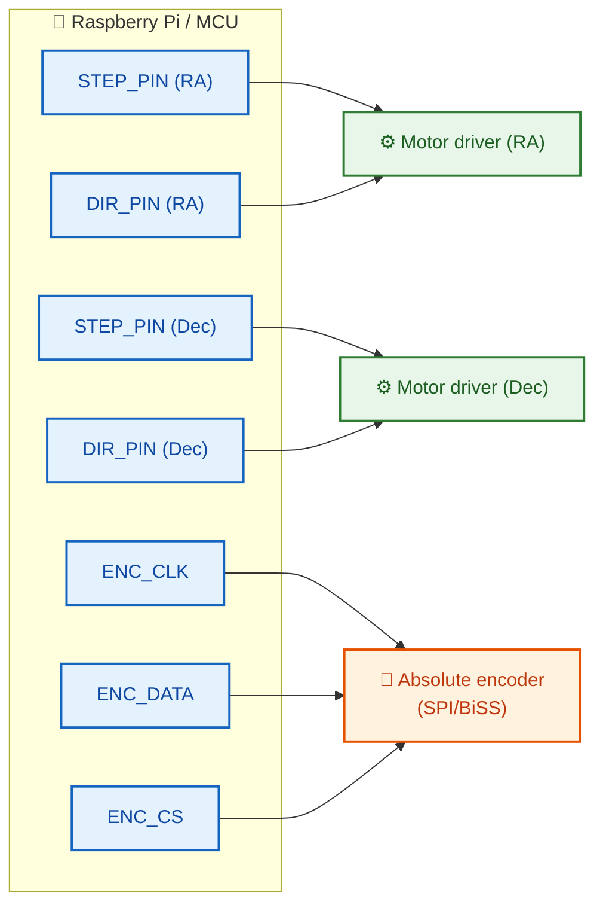

# CANopen Alternatives

## Introduction

The project currently uses **CANopen (CiA 402)** as the primary communication protocol for telescope mount drives. This document presents available alternatives, their advantages and disadvantages in the context of astronomical mount control.

---

## Protocol Comparison

| Protocol | CiA 402 | PDO-like | Determinism | Cost | Complexity | Maturity in Astronomy |
|----------|---------|----------|-------------|------|------------|----------------------|
| **CANopen** (current) | ✅ | ✅ | High | Medium | Medium | ⭐⭐ |
| **EtherCAT** | ✅ (CoE) | ✅ | Very high | Higher | High | ⭐ |
| **Modbus TCP** | ❌ | ❌ | Low | Low | Low | ⭐⭐⭐ |
| **Step/Dir** | ❌ | ❌ | High | **Low** | **Low** | ⭐⭐⭐⭐⭐ |
| **CAN FD** | ✅ (CANopen FD) | ✅ | High | Medium | Low (migration) | ⭐ |
| **RS-485/LX200** | ❌ | ❌ | Medium | **Very low** | Low | ⭐⭐⭐⭐⭐ |
| **USB** | ❌ | ❌ | Low | Low | Medium | ⭐⭐⭐ |

---

## 1. EtherCAT (Ethernet for Control Automation Technology)

| Feature | Description |
|---------|-------------|
| **Type** | Real-time industrial Ethernet |
| **Topology** | Line (daisy-chain), tree, star |
| **Speed** | 100 Mbit/s full-duplex |
| **Determinism** | Very high (< 1 µs jitter) |
| **Profiles** | **CoE (CANopen over EtherCAT)** – supports CiA 402! |

### Advantages
- Existing CiA 402 code can be used through CoE
- Significantly higher bandwidth than CANopen
- Free stacks: **SOEM**, **IgH EtherCAT Master** (Linux)
- Distributed Clocks – ideal multi-axis synchronization
- Hot connect support

### Disadvantages
- Requires Ethernet hardware (switches, network cards)
- Higher cost of controllers and drives
- Higher power consumption
- More complex initial setup

### Application in Astronomy
- Professional observatories with multiple axes (mount + derotator + dome)
- Systems requiring very precise synchronization (< 1 ms)
- Modern industrial servo drives

---

## 2. CAN FD (CAN with Flexible Data-Rate)

| Feature | Description |
|---------|-------------|
| **Type** | CAN 2.0 extension |
| **Topology** | Bus (same as CANopen) |
| **Speed** | Up to 8 Mbit/s (data phase) |
| **Determinism** | High (same as CAN) |
| **Profiles** | CANopen FD – CiA 402 extension for CAN FD |

### Advantages
- Backward compatible with existing CANopen
- 8× more data per frame (64 bytes vs 8)
- Significantly higher data transmission speed
- Same frame format, same physical layer hardware (with new transceivers)
- Easy migration – minimal changes to CiA 402 code

### Disadvantages
- Requires new CAN FD transceivers
- Limited availability of drives with native CAN FD
- Smaller ecosystem than classic CANopen

### Application in Astronomy
- Systems already based on CANopen needing bandwidth upgrade
- Mounts requiring transmission of larger data packets (e.g., extended encoder data)

---

## 3. Step/Direction + Encoder (e.g., TMC5160, DM860, Trinamic)

| Feature | Description |
|---------|-------------|
| **Type** | Pulse signals + serial encoder |
| **Topology** | Point-to-point (separate wires per axis) |
| **Speed** | Limited by pulse frequency (typically up to 500 kHz) |
| **Determinism** | High (hardware-based) |
| **Profiles** | No standard profile |

### Advantages
- Simplest hardware solution
- Very inexpensive drivers (TMC5160: ~$8, DM860: ~$15)
- Proven in astronomy: **OnStep**, **TeenAstro**, **INDI**, **AstroEQ**
- Large community and support
- Silent operation (stealthChop, spreadCycle in TMC)
- Absolute encoders can be used for feedback

### Disadvantages
- Many wires (separate pairs per axis)
- No standard CiA 402 profile (need custom control implementation)
- No advanced safety features (NMT heartbeat, emergency stop)
- Limited speed at very high microstepping resolutions

### Popular Implementations in Astronomy
- **OnStep** – open-source EQ mount controller, used by thousands
- **TeenAstro** – Teensy-based controller, compatible with OnStep
- **AstroEQ** – EQDIR converter for Sky-Watcher mounts

### Connection Example


---

## 4. Modbus TCP / RTU

| Feature | Description |
|---------|-------------|
| **Type** | Master-slave, serial (RTU/ASCII) or Ethernet (TCP) |
| **Topology** | Bus (RTU), star (TCP) |
| **Speed** | 115200 bps (RTU), 100 Mbit/s (TCP) |
| **Determinism** | Low (polling-based) |
| **Profiles** | No standard drive profile |

### Advantages
- Very simple and cheap to implement
- Common in industry (PLC controllers, VFDs)
- Easy to debug (raw frame monitoring)
- Support in almost every programming language
- Long cable runs (RS-485 up to 1200m)

### Disadvantages
- No CiA 402 standard (need custom drive profile)
- No PDO mechanism (continuous polling – higher latency)
- Low performance with multiple axes (each axis requires individual query)
- No heartbeat/node guarding mechanism

### Application in Astronomy
- Dome and rotation stage control (often use Modbus)
- Integration with existing industrial systems in observatories
- Simple single-motor mounts

---

## 5. RS-485 + LX200 / Custom Protocol

| Feature | Description |
|---------|-------------|
| **Type** | Differential half-duplex serial |
| **Topology** | Bus (multidrop) |
| **Speed** | Up to 10 Mbit/s (short distance), typically 115200-921600 bps |
| **Determinism** | Medium (implementation dependent) |
| **Profiles** | No standard (LX200, NexStar have their own protocols) |

### Advantages
- Very cheap (max232 + DB9, or FTDI)
- Common in astronomy (Meade LX200, Celestron NexStar)
- **LX200** standard – well documented, simple ASCII commands
- Long cable runs (RS-485 up to 1200m)
- Compatibility with existing mounts and software (ASCOM, Stellarium, INDI)

### Disadvantages
- Limited bandwidth
- No CiA 402 standard
- No advanced safety features
- Limited number of devices on bus (RS-485: 32, RS-232: 1)

### LX200 Commands (example)
```
:Sr 12:34:56#    – Set RA
:Sd +45:12:34#   – Set Dec
:MS#             – Slew to target
:Q#              – Stop slewing
:GR#             – Get RA
:GD#             – Get Dec
:GW#             – Get tracking frequency
```

---

## 6. USB + libusb / USB CDC

| Feature | Description |
|---------|-------------|
| **Type** | Universal Serial Bus |
| **Topology** | Star (host-device) |
| **Speed** | 480 Mbit/s (USB 2.0) |
| **Determinism** | Low (host-controlled) |
| **Profiles** | No standard drive profile |

### Advantages
- Universal, plug-and-play
- High bandwidth
- Easy to implement (USB CDC = virtual serial port)
- Support in every operating system

### Disadvantages
- Limited cable length (5m without repeater)
- No determinism (host-controlled, USB polling)
- EMI issues in observatory (noise, interference)
- Difficult to expand to multiple devices (hubs)

---

## Recommendations by Scenario

| Scenario | Best Alternative | Rationale |
|----------|-----------------|-----------|
| **Modern industrial servo drives** | **EtherCAT (CoE)** | Fully compatible with CiA 402, significantly higher performance, industry standard |
| **Budget amateur mount** | **Step/Dir + TMC5160** | Proven in OnStep/INDI, cheap, easy to implement, quiet |
| **Evolution of existing CANopen** | **CAN FD** | Minimal code changes, significant performance boost, same topology |
| **Integration with legacy mounts** | **RS-485 + LX200** | Works with existing mounts (Celestron, Meade) |
| **Simple bandwidth upgrade** | **CAN FD** | Same physical layer hardware (with new transceivers) |
| **Real-time control system** | **EtherCAT** | Best determinism, distributed clocks support, < 1 µs synchronization |
| **Dome/accessory control** | **Modbus TCP/RTU** | Common in observatory equipment, simple, cheap |

---

## HAL Architecture and Alternatives

The current HAL layer architecture is designed to allow easy replacement of the transport implementation. The `HALInterface` and `HALFactory` enable adding new HAL types without modifying existing mount controller code.

### Supported HAL Types (from documentation)

| Type | Enum | Status |
|------|------|--------|
| Simulated | `HALType::SIMULATED` | ✅ Implemented |
| CANopen | `HALType::CANOPEN` | ✅ Implemented |
| Serial | `HALType::SERIAL` | ⏳ Planned |
| Ethernet | `HALType::ETHERNET` | ⏳ Planned |
| Custom | `HALType::CUSTOM` | 🔧 Extensible |

### Alternative to HAL Type Mapping

| Alternative | HAL Type | Notes |
|-------------|----------|-------|
| EtherCAT (CoE) | `ETHERNET` | Via EtherCAT stack with CoE layer |
| CAN FD | `CANOPEN` | Natural extension – requires new CAN FD driver |
| Step/Direction | `SERIAL` or `CUSTOM` | Drivers via GPIO or USB |
| Modbus TCP | `ETHERNET` | Implementation via Modbus stack |
| Modbus RTU | `SERIAL` | Implementation via RS-485 |
| LX200/RS-485 | `SERIAL` | Implementation via serial port |

---

## References

- [README](README.md)
- [HAL Layer Documentation](hal_layer.md)
- [API Documentation](api.md)
- [Installation Guide](installation.md)

---

*Last updated: April 30, 2026*
