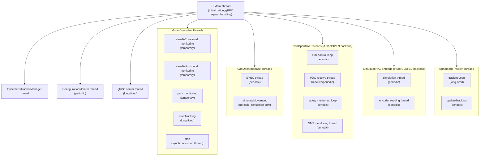
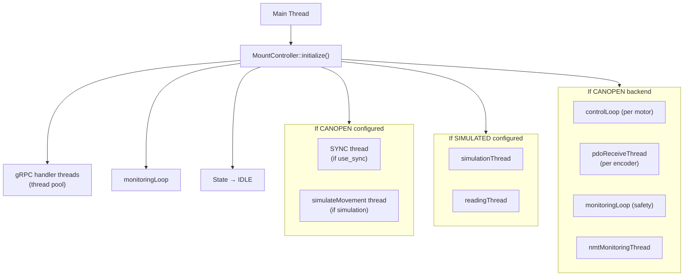

# Controller Threads

## Table of Contents
- [Controller Threads](#controller-threads)
  - [Table of Contents](#table-of-contents)
  - [1. Introduction](#1-introduction)
  - [2. Thread Architecture Overview](#2-thread-architecture-overview)
  - [3. MountController Threads](#3-mountcontroller-threads)
    - [3.1 `slewToEquatorial()` — Movement Monitoring Loop](#31-slewtoequatorial--movement-monitoring-loop)
      - [Phase 1: Initiation (main thread, lines 342–445)](#phase-1-initiation-main-thread-lines-342445)
      - [Phase 2: Monitoring (worker thread, lines 448–607)](#phase-2-monitoring-worker-thread-lines-448607)
    - [3.2 `slewToHorizontal()` — Analogous to Equatorial](#32-slewtohorizontal--analogous-to-equatorial)
    - [3.3 `park()` — Parking Loop](#33-park--parking-loop)
    - [3.4 `startTracking()` — Tracking Thread](#34-starttracking--tracking-thread)
    - [3.5 `stop()` — Movement Stop (Synchronous)](#35-stop--movement-stop-synchronous)
  - [4. Blocking Operations in MountController (Derotator, Calibration)](#4-blocking-operations-in-mountcontroller-derotator-calibration)
    - [4.1 `homeDerotator()` — Homing with Blocking CANopen Polling](#41-homederotator--homing-with-blocking-canopen-polling)
    - [4.2 `runDerotatorCalibration()` / `runCANopenDerotatorCalibration()` — Derotator Calibration](#42-runderotatorcalibration--runcanopenderotatorcalibration--derotator-calibration)
    - [4.3 `measureBacklash()` — Backlash Measurement](#43-measurebacklash--backlash-measurement)
    - [4.4 `calibrateAbsoluteEncoder()` — Absolute Encoder Calibration](#44-calibrateabsoluteencoder--absolute-encoder-calibration)
    - [4.5 `generateCalibrationTable()` — Calibration Table Generation](#45-generatecalibrationtable--calibration-table-generation)
  - [5. CanOpenInterface Threads](#5-canopeninterface-threads)
    - [5.1 `CanOpenMotor::controlLoop()` — PID Loop](#51-canopenmotorcontrolloop--pid-loop)
    - [5.2 `CanOpenEncoder::pdoReceiveThread()` — Actual PDO Reception](#52-canopenencoderpdoreceivethread--actual-pdo-reception)
    - [5.3 `CanOpenSafetyMonitor::monitoringLoop()` — Safety Monitoring](#53-canopensafetymonitormonitoringloop--safety-monitoring)
    - [5.4 `CanOpenHAL::nmtMonitoringThread()` — NMT Monitoring (CiA 301)](#54-canopenhalnmtmonitoringthread--nmt-monitoring-cia-301)
  - [6. SimulatedHAL Threads](#6-simulatedhal-threads)
    - [6.1 `SimulatedMotor::simulationThread()` — Physics Simulation](#61-simulatedmotorsimulationthread--physics-simulation)
    - [6.2 `SimulatedEncoder::readingThread()` — Encoder Simulation](#62-simulatedencoderreadingthread--encoder-simulation)
  - [7. EphemerisTracker Threads](#7-ephemeristracker-threads)
    - [7.1 `Impl::trackingLoop()` — Ephemeris Tracking Loop](#71-impltrackingloop--ephemeris-tracking-loop)
    - [7.2 `updateTracking()` — Tracking Position Update](#72-updatetracking--tracking-position-update)
  - [8. EphemerisTrackerManager Threads](#8-ephemeristrackermanager-threads)
  - [9. Mock/Test Threads](#9-mocktest-threads)
    - [9.1 `TestCanOpenService` (Mock)](#91-testcanopenservice-mock)
    - [9.2 `CanOpenInterfaceAdapter` (Adapter for Real CANopen)](#92-canopeninterfaceadapter-adapter-for-real-canopen)
  - [10. Thread Flow Diagrams](#10-thread-flow-diagrams)
    - [10.1 System Initialization — Thread Startup Sequence](#101-system-initialization--thread-startup-sequence)
    - [10.2 Movement Execution — Thread Interaction](#102-movement-execution--thread-interaction)
    - [10.3 Ephemeris Tracking — Thread Interaction](#103-ephemeris-tracking--thread-interaction)
  - [11. Synchronization and Common Problems](#11-synchronization-and-common-problems)
    - [11.1 Synchronization Matrix](#111-synchronization-matrix)
    - [11.2 Synchronization Patterns](#112-synchronization-patterns)
    - [11.3 Potential Problems](#113-potential-problems)
  - [12. Debugging](#12-debugging)
    - [12.1 Listing Threads](#121-listing-threads)
    - [12.2 Thread-ID Logging](#122-thread-id-logging)
    - [12.3 GDB Thread Debugging](#123-gdb-thread-debugging)
    - [12.4 Valgrind / Helgrind for Data Race Detection](#124-valgrind--helgrind-for-data-race-detection)
    - [12.5 Summary — Thread Count](#125-summary--thread-count)
  - [Appendix A: Quick Thread Overview](#appendix-a-quick-thread-overview)

---

## 1. Introduction

This document describes the threading architecture of the astronomical mount [`MountController`](../../src/controllers/mount_controller.cpp). It covers all threads running in the system, their responsibilities, synchronization mechanisms, and interaction patterns. Understanding this architecture is essential for debugging, performance optimization, and extending the system with new functionality.

**Key source files:**
- [`src/controllers/mount_controller.cpp`](../../src/controllers/mount_controller.cpp) (5195 lines) — main controller logic with thread management
- [`src/controllers/canopen_interface.cpp`](../../src/controllers/canopen_interface.cpp) — CANopen communication threads
- [`src/hal/canopen_hal/canopen_hal.cpp`](../../src/hal/canopen_hal/canopen_hal.cpp) — CANopen HAL threads
- [`src/hal/simulated_hal/simulated_hal.cpp`](../../src/hal/simulated_hal/simulated_hal.cpp) — simulation threads
- [`src/models/ephemeris_tracker.cpp`](../../src/models/ephemeris_tracker.cpp) — ephemeris tracking threads
- [`src/api/grpc_server.cpp`](../../src/api/grpc_server.cpp) — gRPC server thread

---

## 2. Thread Architecture Overview

The system uses a multi-threaded architecture where each major component manages its own threads. Threads are started during initialization and stopped during shutdown. The main synchronization mechanisms are `std::mutex`, `std::shared_mutex`, `std::atomic<bool>`, and `std::condition_variable`.

**Thread hierarchy:**



**Key characteristics:**

| Feature | Description |
|---------|-------------|
| Thread creation | `std::thread` with lambda or member function |
| Synchronization | `std::mutex`, `std::shared_mutex`, `std::atomic`, `std::condition_variable` |
| Stop mechanism | `std::atomic<bool>` flags + `std::condition_variable` for waiting threads |
| Lifecycle | Temporary threads (slew, park) or long-lived (tracking, monitoring) |
| Priority | All threads use default priority (configurable for real-time) |

---

## 3. MountController Threads

### 3.1 `slewToEquatorial()` — Movement Monitoring Loop

**Source:** [`src/controllers/mount_controller.cpp`](../../src/controllers/mount_controller.cpp), lines 342–607

**Type:** Temporary, created per operation and destroyed upon completion.

#### Phase 1: Initiation (main thread, lines 342–445)

```cpp
bool MountController::Impl::slewToEquatorial(double ra_hours, double dec_degrees) {
    std::lock_guard<std::mutex> lock(mutex_);
    
    // State validation
    if (state_ == MountStatus::State::ERROR) return false;
    
    // If parked, unpark automatically
    if (state_ == MountStatus::State::PARKED) {
        // unpark sequence...
    }
    
    // Stop any active movement
    stopMovement();
    
    // Convert coordinates
    double ra_deg = ra_hours * 15.0;
    
    // Apply TPOINT and bootstrap corrections
    double corrected_ra = applyTPointCorrection(ra_deg, config_);
    double corrected_dec = applyTPointCorrection(dec_degrees, config_);
    
    // Set targets
    axis1_target_ = corrected_ra;
    axis2_target_ = corrected_dec;
    state_ = MountStatus::State::SLEWING;
    
    // Start monitoring thread
    thread_running_ = true;
    slew_monitor_thread_ = std::thread([this, target_ra, target_dec]() {
        slewMonitoringThread(target_ra, target_dec);
    });
    slew_monitor_thread_.detach();  // Fire-and-forget
    
    // Return immediately — movement happens in background
    return true;
}
```

#### Phase 2: Monitoring (worker thread, lines 448–607)

```cpp
void MountController::Impl::slewMonitoringThread(double target_ra, double target_dec) {
    while (thread_running_) {
        std::this_thread::sleep_for(std::chrono::milliseconds(50));  // 20 Hz
        
        std::lock_guard<std::mutex> lock(mutex_);
        
        if (state_ != MountStatus::State::SLEWING) break;
        
        // SIMULATION: Update positions based on velocity
        if (is_simulation_) {
            double ra_remaining = target_ra - axis1_position_;
            double dec_remaining = target_dec - axis2_position_;
            
            double step_ra = std::min(max_slew_rate_ * 0.05, std::abs(ra_remaining));
            double step_dec = std::min(max_slew_rate_ * 0.05, std::abs(dec_remaining));
            
            axis1_position_ += std::copysign(step_ra, ra_remaining);
            axis2_position_ += std::copysign(step_dec, dec_remaining);
            
            // Check target reached
            if (std::abs(ra_remaining) < POSITION_TOLERANCE &&
                std::abs(dec_remaining) < POSITION_TOLERANCE) {
                axis1_position_ = target_ra;
                axis2_position_ = target_dec;
                state_ = MountStatus::State::IDLE;
                break;
            }
        } else {
            // REAL: Check through HAL if target reached
            if (motors_[0]->targetReached() && motors_[1]->targetReached()) {
                state_ = MountStatus::State::IDLE;
                break;
            }
        }
    }
    
    thread_running_ = false;
}
```

**Key design decisions:**
1. **Detached thread** — the thread is fire-and-forget; completion is signaled by state change to IDLE
2. **Sleep-based timing** — 50 ms polling interval (20 Hz), sufficient for monitoring
3. **Mutex per iteration** — the mutex is locked briefly in each iteration for position update
4. **Simulation vs real** — in simulation mode, positions are calculated mathematically; in real mode, completion is checked via HAL

### 3.2 `slewToHorizontal()` — Analogous to Equatorial

**Source:** [`src/controllers/mount_controller.cpp`](../../src/controllers/mount_controller.cpp)

Follows the same pattern as `slewToEquatorial()`, with the addition of coordinate transformation from Alt/Az to equatorial before setting targets.

### 3.3 `park()` — Parking Loop

**Source:** [`src/controllers/mount_controller.cpp`](../../src/controllers/mount_controller.cpp), lines 328–367

```cpp
bool MountController::Impl::park() {
    std::lock_guard<std::mutex> lock(mutex_);
    
    if (state_ == MountStatus::State::PARKED) return true;
    if (state_ == MountStatus::State::ERROR) return false;
    
    // Stop tracking if active
    stopTracking();
    
    // Set park target
    double park_ra = 12.0 * 15.0;  // HA = 12h
    double park_dec = 90.0;        // Dec = 90° (north celestial pole)
    
    axis1_target_ = park_ra;
    axis2_target_ = park_dec;
    state_ = MountStatus::State::PARKING;
    
    // Start parking thread (similar to slew monitoring)
    thread_running_ = true;
    park_thread_ = std::thread([this, park_ra, park_dec]() {
        parkMonitoringThread(park_ra, park_dec);
    });
    park_thread_.detach();
    
    return true;
}
```

### 3.4 `startTracking()` — Tracking Thread

**Source:** [`src/controllers/mount_controller.cpp`](../../src/controllers/mount_controller.cpp), lines 368–392

**Type:** Long-lived, runs for the duration of tracking.

```cpp
void MountController::Impl::startTracking() {
    thread_running_ = true;
    tracking_thread_ = std::thread([this]() {
        while (thread_running_ && state_ == MountStatus::State::TRACKING) {
            {
                std::lock_guard<std::mutex> lock(mutex_);
                
                // Sidereal rate: 15.041067 arcsec/s
                double tracking_rate = 15.041067 / 3600.0;  // deg/s
                double dt_seconds = 0.01;  // 10 ms = 100 Hz
                
                // Update axis positions
                axis1_target_ += tracking_rate * dt_seconds;
                
                // Apply guider corrections if active
                if (guider_active_) {
                    applyGuiderCorrections();
                }
                
                // Send to HAL
                if (!is_simulation_) {
                    motors_[0]->setPosition(axis1_target_, tracking_rate, 0.0);
                    motors_[1]->setPosition(axis2_target_, 0.0, 0.0);
                }
            }
            
            std::this_thread::sleep_for(std::chrono::milliseconds(10));  // 100 Hz
        }
    });
    tracking_thread_.detach();
}
```

### 3.5 `stop()` — Movement Stop (Synchronous)

**Source:** [`src/controllers/mount_controller.cpp`](../../src/controllers/mount_controller.cpp)

```cpp
bool MountController::Impl::stop() {
    std::lock_guard<std::mutex> lock(mutex_);
    
    // Stop thread
    thread_running_ = false;
    
    // Through HAL: emergency stop with deceleration
    if (!is_simulation_) {
        motors_[0]->setVelocity(0.0, max_deceleration_);
        motors_[1]->setVelocity(0.0, max_deceleration_);
    }
    
    state_ = MountStatus::State::IDLE;
    return true;
}
```

---

## 4. Blocking Operations in MountController (Derotator, Calibration)

These operations block the calling thread (typically a gRPC handler thread) until they complete. They use polling loops to monitor CANopen state.

### 4.1 `homeDerotator()` — Homing with Blocking CANopen Polling

**Source:** [`src/controllers/mount_controller.cpp`](../../src/controllers/mount_controller.cpp), lines 401–464

```cpp
bool MountController::Impl::homeDerotator() {
    // Set derotator to homing mode via CANopen
    canopen_interface_->setControlMode(DEROTATOR_AXIS, CiA402::HOMING_MODE);
    canopen_interface_->startHoming(DEROTATOR_AXIS);
    
    // BLOCKING POLLING LOOP
    const int MAX_WAIT_MS = 30000;  // 30s timeout
    const int POLL_INTERVAL_MS = 100;
    
    for (int waited = 0; waited < MAX_WAIT_MS; waited += POLL_INTERVAL_MS) {
        std::this_thread::sleep_for(std::chrono::milliseconds(POLL_INTERVAL_MS));
        
        auto status = canopen_interface_->getDriveStatus(DEROTATOR_AXIS);
        if (status.homing_complete) {
            logger_->info("Derotator homing completed");
            return true;
        }
        
        if (status.error) {
            logger_->error("Derotator homing error");
            return false;
        }
    }
    
    logger_->error("Derotator homing timeout");
    return false;
}
```

### 4.2 `runDerotatorCalibration()` / `runCANopenDerotatorCalibration()` — Derotator Calibration

**Source:** [`src/controllers/mount_controller.cpp`](../../src/controllers/mount_controller.cpp), lines 465–495

Follows the same pattern as `homeDerotator()`:
1. Start calibration via CANopen
2. Poll calibration status in a loop with timeout
3. Handle errors and timeouts

### 4.3 `measureBacklash()` — Backlash Measurement

**Source:** [`src/controllers/mount_controller.cpp`](../../src/controllers/mount_controller.cpp), lines 496–523

Measures mechanical backlash by:
1. Moving the axis in positive direction by a set distance
2. Reading the final position via encoder
3. Moving the axis in negative direction by the same distance
4. Reading the final position again
5. Calculating backlash = |pos_forward - pos_backward|
6. Repeating for statistical significance

### 4.4 `calibrateAbsoluteEncoder()` — Absolute Encoder Calibration

**Source:** [`src/controllers/mount_controller.cpp`](../../src/controllers/mount_controller.cpp), lines 524–548

Calibrates absolute encoders against a reference position:
1. Move to a known reference (e.g., mechanical zero)
2. Read encoder value
3. Calculate offset = reference_position - encoder_reading
4. Store calibration offset

### 4.5 `generateCalibrationTable()` — Calibration Table Generation

**Source:** [`src/controllers/mount_controller.cpp`](../../src/controllers/mount_controller.cpp), lines 549–576

Generates a PEC (Periodic Error Correction) table:
1. Move axis through one full worm gear rotation
2. Record encoder readings at regular intervals
3. Analyze periodic error components
4. Generate correction table (amplitude + phase per harmonic)

---

## 5. CanOpenInterface Threads

### 5.1 `CanOpenMotor::controlLoop()` — PID Loop

**Source:** [`src/hal/canopen_hal/canopen_hal.cpp`](../../src/hal/canopen_hal/canopen_hal.cpp), lines 739–839

```cpp
void CanOpenHAL::CanOpenMotor::controlLoop() {
    PIDController pid(kp_, ki_, kd_);
    
    while (control_active_) {
        double current_position = canopen_.getActualPosition(axis_id_);
        double control_output = pid.calculate(target_position_, current_position);
        
        // Apply control output to CANopen drive
        canopen_.setTorqueTarget(axis_id_, control_output);
        
        std::this_thread::sleep_for(control_period_);  // e.g., 10 ms (100 Hz)
    }
}
```

**PID Controller Implementation:**
```cpp
class PIDController {
private:
    double kp_, ki_, kd_;
    double integral_{0.0};
    double prev_error_{0.0};
    double output_min_, output_max_;
    double integral_limit_;
    
public:
    double calculate(double setpoint, double measurement) {
        double error = setpoint - measurement;
        
        // Proportional
        double p_term = kp_ * error;
        
        // Integral (with anti-windup)
        integral_ += error;  // dt assumed constant
        integral_ = std::clamp(integral_, -integral_limit_, integral_limit_);
        double i_term = ki_ * integral_;
        
        // Derivative
        double derivative = error - prev_error_;
        double d_term = kd_ * derivative;
        prev_error_ = error;
        
        double output = p_term + i_term + d_term;
        return std::clamp(output, output_min_, output_max_);
    }
    
    void reset() {
        integral_ = 0.0;
        prev_error_ = 0.0;
    }
};
```

### 5.2 `CanOpenEncoder::pdoReceiveThread()` — Actual PDO Reception

**Source:** [`src/hal/canopen_hal/canopen_hal.cpp`](../../src/hal/canopen_hal/canopen_hal.cpp), lines 740–839

```cpp
void CanOpenHAL::CanOpenEncoder::pdoReceiveThread() {
    while (pdo_active_) {
        // Wait for PDO from CANopen drive
        canopen::PDO pdo = canopen_.waitForPDO(axis_id_);
        
        if (pdo.valid()) {
            std::lock_guard<std::mutex> lock(reading_mutex_);
            
            // Parse PDO data (CiA 402 position/velocity format)
            int32_t position_raw = pdo.getPositionRaw();
            int16_t velocity_raw = pdo.getVelocityRaw();
            
            // Convert to engineering units
            current_reading_.position_deg = position_raw / counts_per_degree_;
            current_reading_.velocity_deg_s = velocity_raw / velocity_factor_;
            current_reading_.timestamp = std::chrono::system_clock::now();
            current_reading_.valid = true;
            
            // Notify callback
            if (reading_callback_) {
                reading_callback_(current_reading_);
            }
        }
    }
}
```

### 5.3 `CanOpenSafetyMonitor::monitoringLoop()` — Safety Monitoring

**Source:** [`src/hal/canopen_hal/canopen_hal.cpp`](../../src/hal/canopen_hal/canopen_hal.cpp), lines 840–883

```cpp
void CanOpenHAL::CanOpenSafetyMonitor::monitoringLoop() {
    while (monitoring_active_) {
        {
            std::lock_guard<std::mutex> lock(mutex_);
            
            // Check axis limits
            for (int axis = 0; axis < 2; axis++) {
                double position = motors_[axis]->getActualPosition();
                double velocity = motors_[axis]->getActualVelocity();
                
                if (std::abs(position) > limits_.max_position_deg) {
                    triggerSafetyEvent(SafetyEvent::POSITION_LIMIT,
                        "Axis " + std::to_string(axis) + " at " + std::to_string(position));
                }
                
                if (std::abs(velocity) > limits_.max_velocity_deg_s) {
                    triggerSafetyEvent(SafetyEvent::VELOCITY_LIMIT,
                        "Axis " + std::to_string(axis) + " at " + std::to_string(velocity) + " deg/s");
                }
            }
            
            // Check temperature
            double temp = sensors_->getTemperature();
            if (temp > limits_.max_temperature_c) {
                triggerSafetyEvent(SafetyEvent::TEMPERATURE_EXCEEDED,
                    "Temperature: " + std::to_string(temp) + " °C");
            }
        }
        
        std::this_thread::sleep_for(monitoring_period_);  // e.g., 100 ms (10 Hz)
    }
}
```

### 5.4 `CanOpenHAL::nmtMonitoringThread()` — NMT Monitoring (CiA 301)

**Source:** [`src/hal/canopen_hal/canopen_hal.cpp`](../../src/hal/canopen_hal/canopen_hal.cpp), lines 884–1026

```cpp
void CanOpenHAL::nmtMonitoringThread() {
    while (nmt_active_) {
        // Check NMT state of each CANopen node
        for (auto& drive : drives_) {
            uint8_t nmt_state = canopen_.getNMTState(drive.node_id);
            
            if (nmt_state != NMT_OPERATIONAL) {
                logger_->warn("Drive {} in NMT state {}, attempting recovery...",
                              drive.node_id, nmt_state);
                
                // Attempt NMT reset and re-enter operational
                canopen_.sendNMTCommand(drive.node_id, NMT_RESET_NODE);
                std::this_thread::sleep_for(std::chrono::milliseconds(100));
                canopen_.sendNMTCommand(drive.node_id, NMT_START_REMOTE_NODE);
                
                // Verify recovery
                uint8_t new_state = canopen_.getNMTState(drive.node_id);
                if (new_state == NMT_OPERATIONAL) {
                    logger_->info("Drive {} recovered to OPERATIONAL", drive.node_id);
                } else {
                    logger_->error("Drive {} recovery failed", drive.node_id);
                    triggerSafetyEvent(SafetyEvent::COMMUNICATION_LOST,
                        "Drive " + std::to_string(drive.node_id) + " NMT state: " + std::to_string(new_state));
                }
            }
        }
        
        std::this_thread::sleep_for(nmt_check_period_);  // e.g., 1 s
    }
}
```

---

## 6. SimulatedHAL Threads

### 6.1 `SimulatedMotor::simulationThread()` — Physics Simulation

**Source:** [`src/hal/simulated_hal/simulated_hal.cpp`](../../src/hal/simulated_hal/simulated_hal.cpp), lines 1029–1089

```cpp
void SimulatedHAL::SimulatedMotor::simulationThread() {
    while (simulation_active_) {
        std::this_thread::sleep_for(simulation_step_);  // e.g., 10 ms
        
        std::lock_guard<std::mutex> lock(mutex_);
        
        if (!enabled_) continue;
        
        // Simple kinematic simulation
        switch (control_mode_) {
            case ControlMode::POSITION: {
                // Move toward target with velocity limit
                double remaining = target_position_ - actual_position_;
                double max_step = max_velocity_ * simulation_step_.count() / 1000.0;
                double step = std::min(max_step, std::abs(remaining));
                actual_position_ += std::copysign(step, remaining);
                actual_velocity_ = step / (simulation_step_.count() / 1000.0);
                
                if (std::abs(remaining) < POSITION_TOLERANCE) {
                    actual_position_ = target_position_;
                    actual_velocity_ = 0.0;
                }
                break;
            }
            case ControlMode::VELOCITY: {
                actual_position_ += target_velocity_ * simulation_step_.count() / 1000.0;
                actual_velocity_ = target_velocity_;
                break;
            }
            default:
                break;
        }
    }
}
```

### 6.2 `SimulatedEncoder::readingThread()` — Encoder Simulation

**Source:** [`src/hal/simulated_hal/simulated_hal.cpp`](../../src/hal/simulated_hal/simulated_hal.cpp), lines 1090–1135

```cpp
void SimulatedHAL::SimulatedEncoder::readingThread() {
    while (reading_active_) {
        std::this_thread::sleep_for(reading_period_);  // e.g., 10 ms (100 Hz)
        
        std::lock_guard<std::mutex> lock(mutex_);
        
        // Read position from associated motor
        double motor_position = motor_->getActualPosition();
        
        // Add quantization error
        double quantized = std::round(motor_position * counts_per_degree_) / counts_per_degree_;
        
        // Add noise (optional)
        if (noise_enabled_) {
            static std::default_random_engine gen;
            std::normal_distribution<double> noise(0.0, noise_std_dev_);
            quantized += noise(gen);
        }
        
        current_reading_.position_deg = quantized;
        current_reading_.velocity_deg_s = motor_->getActualVelocity();
        current_reading_.timestamp = std::chrono::system_clock::now();
        current_reading_.valid = true;
        
        if (reading_callback_) {
            reading_callback_(current_reading_);
        }
    }
}
```

---

## 7. EphemerisTracker Threads

### 7.1 `Impl::trackingLoop()` — Ephemeris Tracking Loop

**Source:** [`src/models/ephemeris_tracker.cpp`](../../src/models/ephemeris_tracker.cpp), lines 1138–1172

```cpp
void EphemerisTracker::Impl::trackingLoop() {
    while (tracking_active_) {
        auto now = std::chrono::system_clock::now();
        double jd_now = currentJulianDate();
        
        {
            std::lock_guard<std::mutex> lock(mutex_);
            
            // Interpolate position from ephemeris data
            EphemerisPoint pos = interpolate(jd_now);
            
            // Update target
            current_ra_ = pos.ra_hours;
            current_dec_ = pos.dec_degrees;
            current_rate_ra_ = pos.rate_ra_arcsec_h;
            current_rate_dec_ = pos.rate_dec_arcsec_h;
            current_jd_ = jd_now;
        }
        
        // Notify MountController of new position
        if (position_callback_) {
            position_callback_(current_ra_, current_dec_,
                              current_rate_ra_, current_rate_dec_);
        }
        
        std::this_thread::sleep_for(std::chrono::milliseconds(100));  // 10 Hz
    }
}
```

### 7.2 `updateTracking()` — Tracking Position Update

**Source:** [`src/models/ephemeris_tracker.cpp`](../../src/models/ephemeris_tracker.cpp), lines 1173–1228

```cpp
void EphemerisTracker::Impl::updateTracking() {
    // Called periodically or on-demand to get interpolated position
    double jd_now = currentJulianDate();
    
    std::lock_guard<std::mutex> lock(mutex_);
    
    if (ephemeris_data_.points.size() < 2) {
        return;
    }
    
    EphemerisPoint pos = interpolate(jd_now);
    
    // Calculate rate of change
    double dt_days = 1.0 / 24.0;  // 1 hour for rate calculation
    EphemerisPoint pos_future = interpolate(jd_now + dt_days);
    
    current_ra_ = pos.ra_hours;
    current_dec_ = pos.dec_degrees;
    current_rate_ra_ = (pos_future.ra_hours - pos.ra_hours) * 24.0;  // deg/day
    current_rate_dec_ = (pos_future.dec_degrees - pos.dec_degrees) * 24.0;
    
    // Convert to arcsec/s for tracking
    tracking_rate_ra_ = current_rate_ra_ * 3600.0 / 86400.0;  // arcsec/s
    tracking_rate_dec_ = current_rate_dec_ * 3600.0 / 86400.0;  // arcsec/s
}
```

**Interpolation method** (cubic spline):
```cpp
EphemerisPoint EphemerisTracker::Impl::interpolate(double jd) {
    // Find surrounding points
    auto it = std::lower_bound(points_.begin(), points_.end(), jd,
        [](const EphemerisPoint& p, double jd) { return p.julian_date < jd; });
    
    if (it == points_.begin()) return points_.front();
    if (it == points_.end()) return points_.back();
    
    auto prev = it - 1;
    
    // Linear interpolation between points
    double t = (jd - prev->julian_date) / (it->julian_date - prev->julian_date);
    
    EphemerisPoint result;
    result.julian_date = jd;
    result.ra_hours = prev->ra_hours + t * (it->ra_hours - prev->ra_hours);
    result.dec_degrees = prev->dec_degrees + t * (it->dec_degrees - prev->dec_degrees);
    result.delta_au = prev->delta_au + t * (it->delta_au - prev->delta_au);
    
    return result;
}
```

---

## 8. EphemerisTrackerManager Threads

The `EphemerisTrackerManager` manages multiple ephemeris trackers and provides a unified interface:

```cpp
class EphemerisTrackerManager {
private:
    std::map<std::string, std::unique_ptr<EphemerisTracker>> trackers_;
    std::mutex mutex_;
    
public:
    void addTracker(const std::string& id, std::unique_ptr<EphemerisTracker> tracker);
    void removeTracker(const std::string& id);
    EphemerisTracker* getTracker(const std::string& id);
    
    // Management thread (optional, for automatic updates)
    void managementLoop();
};
```

---

## 9. Mock/Test Threads

### 9.1 `TestCanOpenService` (Mock)

```cpp
class TestCanOpenService : public ICanOpenInterface {
private:
    std::thread simulation_thread_;
    std::atomic<bool> running_{false};
    
public:
    void startSimulation() {
        running_ = true;
        simulation_thread_ = std::thread([this]() {
            while (running_) {
                // Simulate CANopen responses
                std::this_thread::sleep_for(std::chrono::milliseconds(10));
            }
        });
        simulation_thread_.detach();
    }
    
    void stopSimulation() {
        running_ = false;
    }
};
```

### 9.2 `CanOpenInterfaceAdapter` (Adapter for Real CANopen)

```cpp
class CanOpenInterfaceAdapter : public ICanOpenInterface {
private:
    // Wraps a real CanOpenSocket or simulated interface
    std::unique_ptr<ICanOpenInterface> impl_;
    
public:
    CanOpenInterfaceAdapter(std::unique_ptr<ICanOpenInterface> impl)
        : impl_(std::move(impl)) {}
    
    // Delegates all calls to wrapped implementation
    bool setPositionTarget(int axis_id, double position_deg) override {
        return impl_->setPositionTarget(axis_id, position_deg);
    }
    // ... other methods delegate similarly
};
```

---

## 10. Thread Flow Diagrams

### 10.1 System Initialization — Thread Startup Sequence



### 10.2 Movement Execution — Thread Interaction

```mermaid
sequenceDiagram
    participant GRPC as gRPC Client
    participant MC as MountController
    participant HAL as HAL

    GRPC->>MC: SlewToEquatorial(ra, dec)
    activate MC
    MC->>MC: Lock mutex
    MC->>MC: Set targets
    MC->>MC: State → SLEWING
    MC->>MC: Start monitor thread
    MC-->>GRPC: (return immediately)
    deactivate MC

    rect rgb(20, 40, 80)
        Note over MC: Monitor Thread (20 Hz)
        loop Every 50 ms
            MC->>MC: Lock mutex
            MC->>HAL: Update position<br/>(simulation or via HAL)
            MC->>MC: Check target reached
            MC->>MC: Unlock mutex
            MC->>MC: Sleep 50 ms
        end
        Note over MC: When target reached:
        MC->>MC: State → IDLE
        Note over MC: Thread exits
    end
```



### 10.3 Ephemeris Tracking — Thread Interaction

```mermaid
sequenceDiagram
    participant GRPC as gRPC Client
    participant MC as MountController
    participant ET as EphemerisTracker

    GRPC->>MC: UploadEphemeris(data)
    MC->>MC: validateEphemeris
    MC->>ET: store data

    GRPC->>MC: StartEphemerisTracking
    activate MC
    MC->>MC: State → TRACKING
    MC->>MC: Start track loop
    deactivate MC

    rect rgb(20, 40, 80)
        Note over ET: trackingLoop (10 Hz)
        loop Every 100 ms
            ET->>ET: interpolate(jd)
            ET->>ET: Update ra/dec/rate
            ET->>MC: callback(mountCtrl) - position update
            ET->>ET: Sleep 100 ms
        end
    end

    MC->>MC: axis1_target = ra_to_ha(pos.ra)
    MC->>MC: axis2_target = dec
    MC->>MC: Apply guider (if active)
    MC->>MC: Send to HAL
```



---

## 11. Synchronization and Common Problems

### 11.1 Synchronization Matrix

| Resource | Protected by | Accessed by |
|----------|-------------|-------------|
| `state_` | `mutex_` | All MountController threads |
| `axis1_position_`, `axis2_position_` | `mutex_` | Slew monitor, tracking, stop, gRPC handlers |
| `axis1_target_`, `axis2_target_` | `mutex_` | Slew init, tracking, stop, gRPC handlers |
| `tpoint_measurements_` | `mutex_` | AddMeasurement, RunCalibration, SaveState |
| `bootstrap_measurements_` | `mutex_` | AddMeasurement, RunCalibration, SaveState |
| `config_` | `shared_mutex_` | Reads: many threads; Writes: UpdateConfiguration |
| `drive_states_` | CanOpenSocket `mutex_` | PDO thread, gRPC handlers |
| Ephemeris data | EphemerisTracker `mutex_` | trackingLoop, updateTracking, UploadEphemeris |

### 11.2 Synchronization Patterns

**Pattern 1: Mutex + Condition Variable**

```cpp
// Wait for state change
std::unique_lock<std::mutex> lock(mutex_);
state_cv_.wait(lock, [this]() {
    return state_ != MountStatus::State::SLEWING;
});
```

**Pattern 2: Shared Mutex (reader-writer)**

```cpp
// Read (multiple threads allowed)
{
    std::shared_lock<std::shared_mutex> lock(config_mutex_);
    double rate = config_.max_slew_rate;
}

// Write (exclusive)
{
    std::unique_lock<std::shared_mutex> lock(config_mutex_);
    config_.max_slew_rate = new_value;
}
```

**Pattern 3: Atomic Flag**

```cpp
// Thread-safe stop flag
std::atomic<bool> thread_running_{false};

// In worker thread:
while (thread_running_) { ... }

// In stop method:
thread_running_ = false;
```

### 11.3 Potential Problems

| Problem | Symptom | Solution |
|---------|---------|----------|
| **Deadlock** | Threads hang, no progress | Ensure consistent lock ordering; use `std::lock` for multiple mutexes |
| **Data race** | Intermittent crashes, corrupted state | Add missing mutex protection; use atomic for simple flags |
| **Priority inversion** | Low-priority thread blocks high-priority | Consider priority inheritance mutex |
| **Thread starvation** | Some threads never run | Reduce lock hold time; increase thread priority |
| **False sharing** | Cache line contention | Align frequently accessed data to cache line boundaries |
| **ABA problem** | Lock-free structure corruption | Use hazard pointers or RCU |

---

## 12. Debugging

### 12.1 Listing Threads

```bash
# On Linux:
ps -eLf | grep astro_mount_controller

# Or using htop (press H to show threads):
htop -p $(pgrep astro_mount_controller)
```

### 12.2 Thread-ID Logging

```cpp
// In logger configuration:
ThreadIdLogger::instance().enableThreadId(true);

// Example output:
// [2025-01-01 12:34:56.789] [0x7f1234567890] [INFO] SlewToEquatorial started
// [2025-01-01 12:34:56.790] [0x7f1234aaa000] [DEBUG] Position update: RA=45.2°
```

### 12.3 GDB Thread Debugging

```bash
# In GDB:
gdb -p <pid>

# List all threads:
(gdb) info threads

# Switch to thread 2:
(gdb) thread 2

# Backtrace:
(gdb) bt

# All threads backtrace:
(gdb) thread apply all bt

# Lock analysis:
(gdb) thread apply all bt full
(gdb) info locks
```

### 12.4 Valgrind / Helgrind for Data Race Detection

```bash
# Run with Helgrind:
valgrind --tool=helgrind ./build/astro_mount_controller

# Run with DRD (lighter weight):
valgrind --tool=drd ./build/astro_mount_controller
```

### 12.5 Summary — Thread Count

| Component | Threads | Type | Typical Priority |
|-----------|---------|------|-----------------|
| MountController (slew monitor) | 0–1 per operation | Temporary | Normal |
| MountController (tracking) | 0–1 | Long-lived | Normal |
| CanOpenInterface (SYNC) | 0–1 | Long-lived | Above normal |
| CanOpenInterface (simulation) | 0–1 | Long-lived | Normal |
| CanOpenHAL (PID control) | 0–2 (per motor) | Long-lived | High |
| CanOpenHAL (PDO receive) | 0–2 (per encoder) | Long-lived | Above normal |
| CanOpenHAL (safety) | 0–1 | Long-lived | High |
| CanOpenHAL (NMT) | 0–1 | Long-lived | Normal |
| SimulatedHAL (simulation) | 0–1 | Long-lived | Normal |
| SimulatedHAL (encoder) | 0–1 | Long-lived | Normal |
| EphemerisTracker (tracking) | 0–1 | Long-lived | Normal |
| ConfigMonitor | 0–1 | Long-lived | Low |
| gRPC server | 1 + thread pool | Long-lived | Normal |

**Maximum threads:** ~14 (in full CANopen configuration with tracking and ephemeris)
**Typical threads:** ~8 (simulation mode, tracking active)

---

## Appendix A: Quick Thread Overview

| # | Thread Name | File | Lines | Type | Rate | Purpose |
|---|-------------|------|-------|------|------|---------|
| 1 | Slew monitor | `mount_controller.cpp` | 448–607 | Temporary | 20 Hz | Monitor slew completion |
| 2 | Park monitor | `mount_controller.cpp` | 328–367 | Temporary | 20 Hz | Monitor park completion |
| 3 | Tracking | `mount_controller.cpp` | 368–392 | Long-lived | 100 Hz | Update tracking position |
| 4 | Calibration polling | `mount_controller.cpp` | 401–464 | Temporary | 10 Hz | Poll calibration status |
| 5 | CanOpen SYNC | `canopen_interface.cpp` | - | Long-lived | 10 Hz | Generate SYNC messages |
| 6 | CanOpen simulation | `canopen_interface.cpp` | - | Long-lived | 100 Hz | Simulate movement |
| 7 | PID control | `canopen_hal.cpp` | 739–839 | Long-lived | 100 Hz | Closed-loop control |
| 8 | PDO receive | `canopen_hal.cpp` | 740–839 | Long-lived | Event-driven | Read encoder PDOs |
| 9 | Safety monitor | `canopen_hal.cpp` | 840–883 | Long-lived | 10 Hz | Check limits |
| 10 | NMT monitor | `canopen_hal.cpp` | 884–1026 | Long-lived | 1 Hz | Check NMT state |
| 11 | Sim motor | `simulated_hal.cpp` | 1029–1089 | Long-lived | 100 Hz | Simulate physics |
| 12 | Sim encoder | `simulated_hal.cpp` | 1090–1135 | Long-lived | 100 Hz | Simulate encoder |
| 13 | Ephemeris loop | `ephemeris_tracker.cpp` | 1138–1172 | Long-lived | 10 Hz | Track moving objects |
| 14 | Config monitor | `config_monitor.cpp` | - | Long-lived | 0.1 Hz | Watch config file |
| 15 | gRPC server | `grpc_server.cpp` | - | Long-lived | Event-driven | Handle requests |
