# System Data Flow Diagrams

This document describes the data flow between all major components of the Astronomical Mount Controller using Mermaid.js diagrams.

## 1. High-Level System Architecture

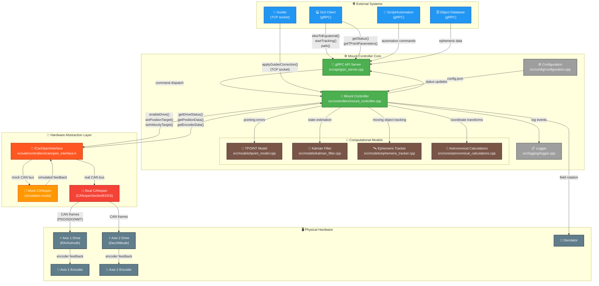

## 2. Control Loop Data Flow

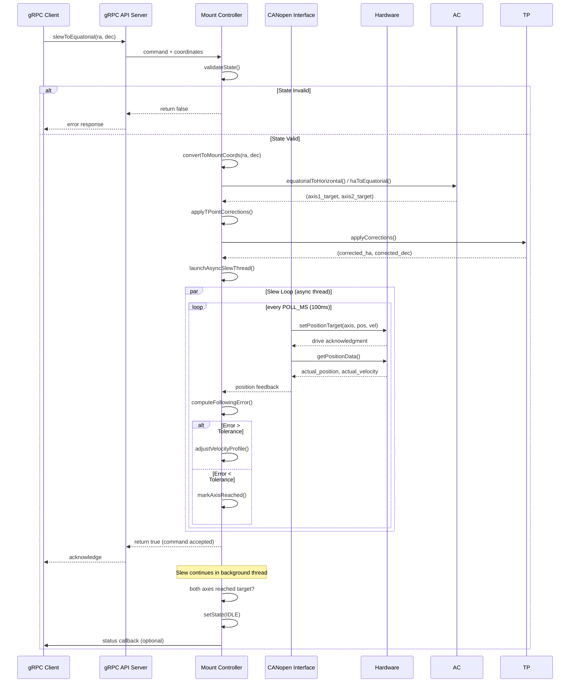

## 3. Tracking Control Loop

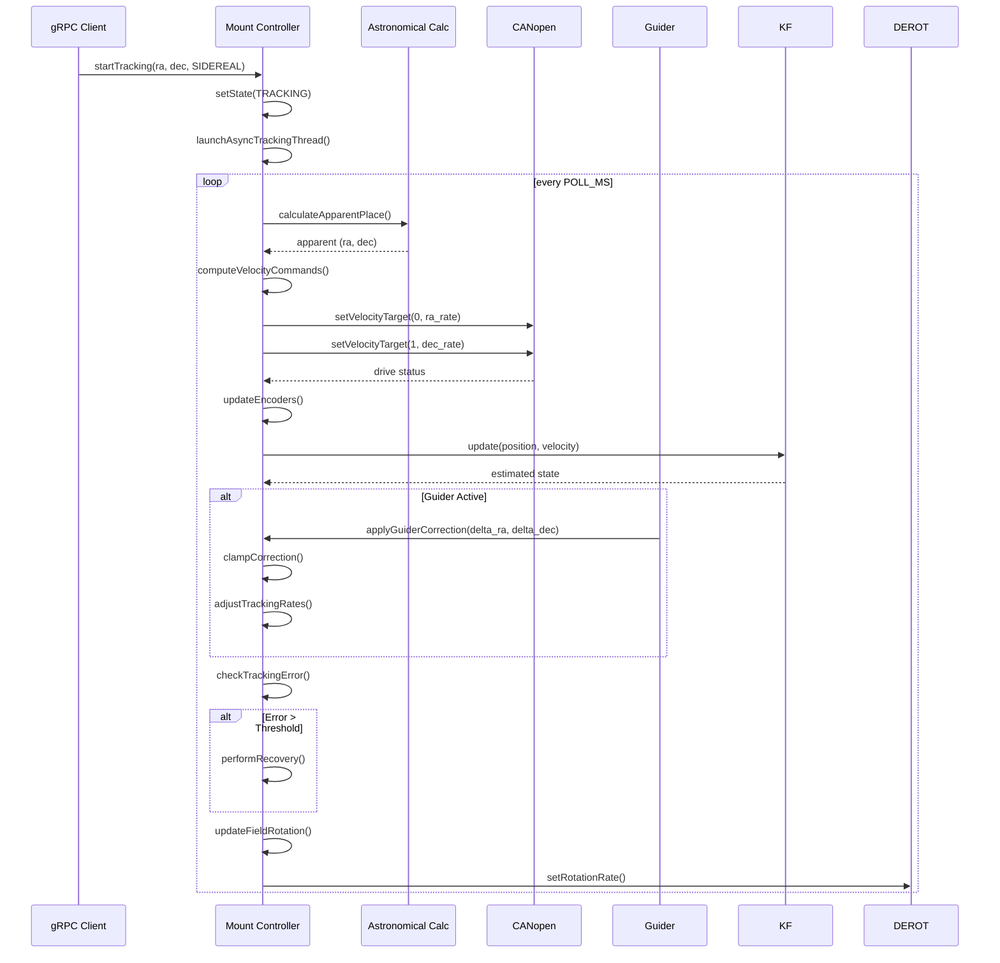

## 4. CANopen Communication Data Flow

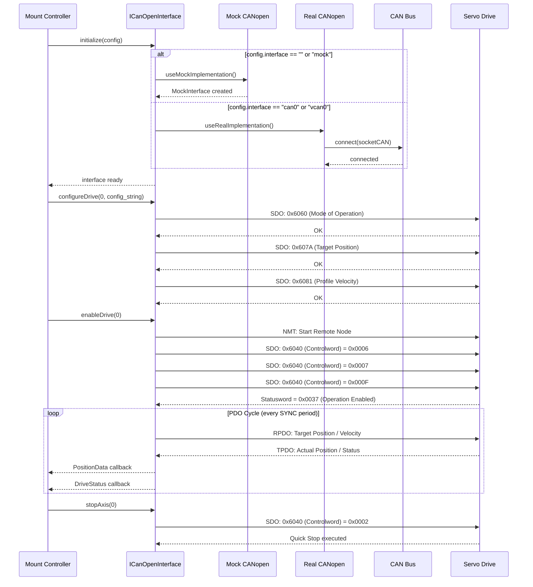

## 5. Ephemeris Track Data Flow

```mermaid
sequenceDiagram
    participant Client as gRPC Client
    participle ODB as Object Database
    participant API as gRPC API Server
    participant MC as Mount Controller  
    participle EPM as EphemerisModel
    participant EPT as EphemerisTracker
    participle EPI as EphemerisInterpolator
    
    Client->>ODB: queryEphemeris(object_id, time_range)
    ODB-->>Client: EphemerisData (points[])
    
    Client->>API: uploadEphemeris(data)
    API->>MC: uploadEphemeris(object_id, points)
    
    MC->>EPM: EphemerisModel(data, config)
    EPM->>EPI: EphemerisInterpolator(points, order)
    EPI-->>EPM: interpolator ready
    EPM-->>MC: model ready
    
    MC->>EPT: EphemerisTracker(model, lat, lon, alt)
    EPT-->>MC: tracker created
    
    Client->>API: startEphemerisTracking(object_id, time)
    API->>MC: startEphemerisTracking()
    
    MC->>EPT: startTracking(start_time, config)
    
    loop Tracking Loop (10 Hz)
        EPT->>EPM: getApparentPosition(time)
        EPM->>EPI: getPositionAtTime(time)
        
        alt time within ephemeris range
            EPI-->>EPM: (ra, dec, ra_rate, dec_rate)
            EPM->>EPM: applyEarthRotation()
            EPM->>EPM: applyAtmosphericRefraction()
            EPM->>EPM: applyTPointCorrections()
            EPM-->>EPT: apparent_position
        else time beyond range + extrapolation
            EPI->>EPI: predictPosition(time, max_extrap)
            EPI-->>EPM: predicted_position
            EPM-->>EPT: predicted + corrections
        end
        
        EPT->>MC: updateTargetPosition(ra, dec, rates)
        MC->>CAN: setVelocityTarget(axes, rates)
    end
    
    Client->>API: stopEphemerisTracking(tracker_id)
    API->>MC: stopEphemerisTracking()
    MC->>EPT: stopTracking()
    EPT-->>MC: tracking stopped, stats returned
    MC-->>API: success
    API-->>Client: confirmation
```

## 6. Guider Correction Data Flow

```mermaid
flowchart LR
    subgraph External
        G[Guider Software<br/>PHD2 / Ekos / ASCOM]
    end
    
    subgraph MountController
        direction TB
        GC[Guider Connection<br/>TCP socket]
        GR[Guider Rate Adjuster]
        TR[Tracking Loop<br/>RA/Dec Rate Calculator]
        CL[Clamp + Aggression]
        MC[Main Controller]
    end
    
    subgraph HAL
        CAN2[CANopen Interface]
    end
    
    subgraph Hardware
        D1[Axis 1 Drive]
        D2[Axis 2 Drive]
    end
    
    G -->|"TCP connection<br/>socket://ip:port"| GC
    GC -->|"correction<br/>(ra_arcsec, dec_arcsec)"| GR
    
    GR -->|"raw correction"| CL
    CL -->|"clamp to ±max_correction<br/>apply aggression factor"| TR
    
    MC -->|"sidereal/solar/lunar rate"| TR
    TR -->|"final rate = base + Δ"| MC
    
    MC -->|"setVelocityTarget(axis, rate)"| CAN2
    CAN2 -->|"velocity mode"| D1
    CAN2 -->|"velocity mode"| D2
    
    D1 -->|"actual position"| CAN2
    D2 -->|"actual position"| CAN2
    CAN2 -->|"getPositionData()"| MC
    MC -->|"status update<br/>(guider_active, tracking_error)"| GC
    
    style G fill:#FF9800,color:#fff
    style GC fill:#4CAF50,color:#fff
    style GR fill:#4CAF50,color:#fff
    style CL fill:#FF5722,color:#fff
    style TR fill:#4CAF50,color:#fff
    style MC fill:#4CAF50,color:#fff
    style CAN2 fill:#FF5722,color:#fff
    style D1 fill:#607D8B,color:#fff
    style D2 fill:#607D8B,color:#fff
```

## 7. TPOINT Calibration Data Flow

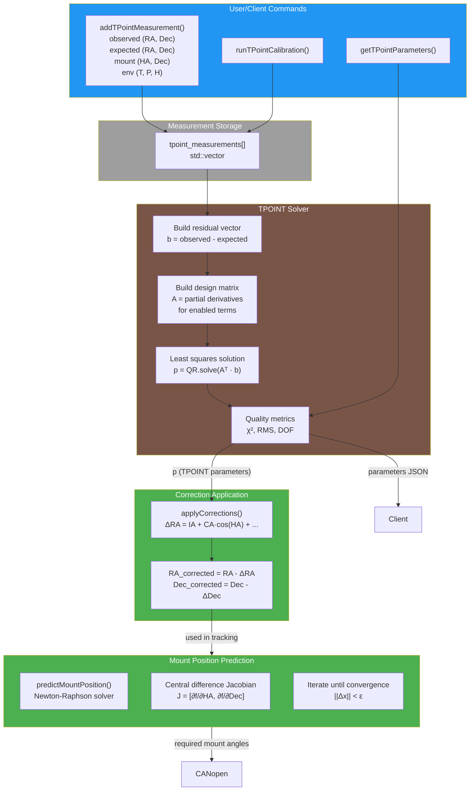

## 8. Configuration Loading Flow

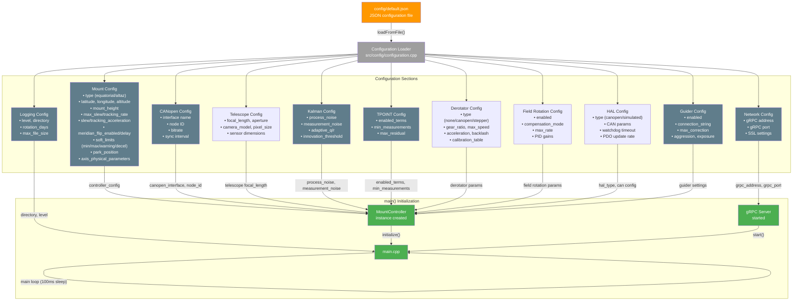

## 9. Park/Unpark State Machine Flow

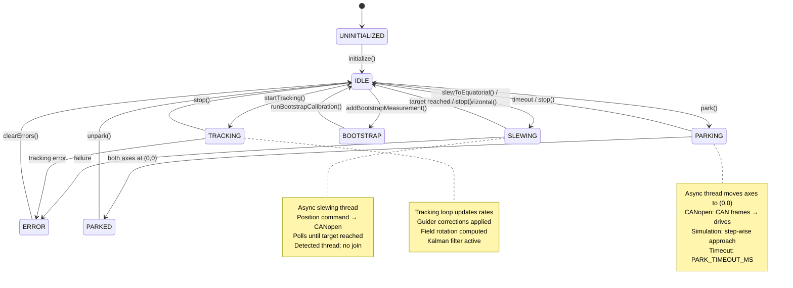

## 10. Object Database Data Flow

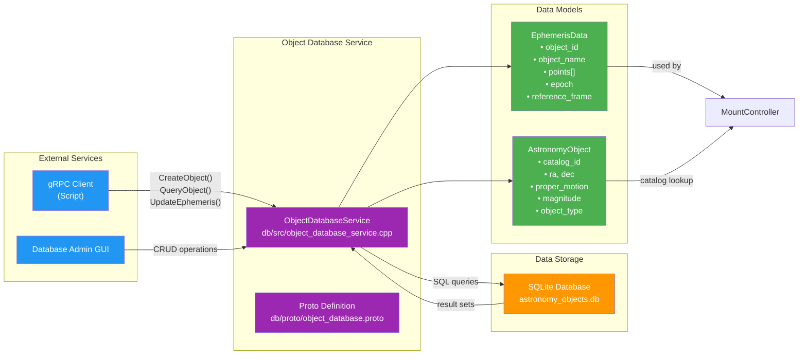

## 11. Test Mock Architecture

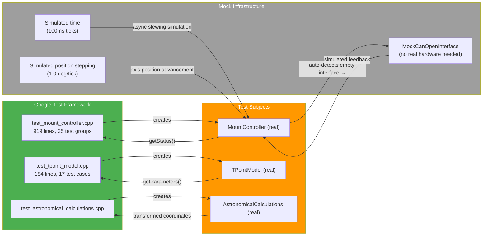

## 12. Derotator Data Flow

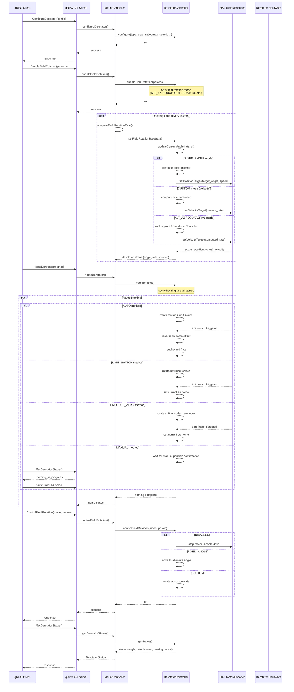

## 13. ASCOM Driver Data Flow

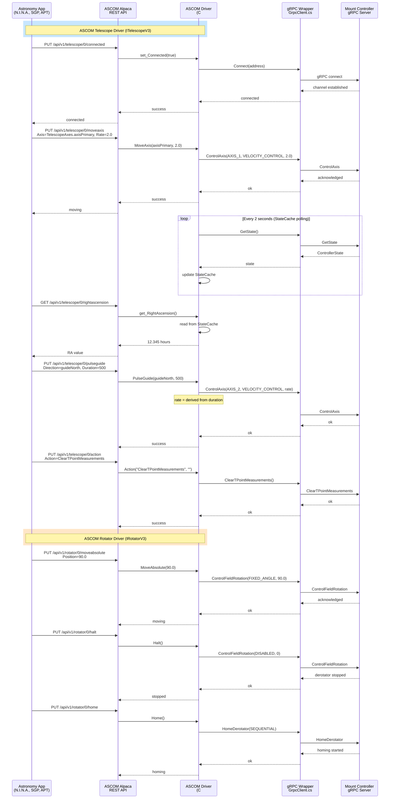

## 14. INDI Driver Data Flow

```mermaid
sequenceDiagram
    participant Ekos as Ekos/KStars
    participant INDI as INDI Protocol
    participant Driver as INDI Driver<br/>(C++)
    participant gRPC as gRPC Client<br/>MountGrpcClient.h
    participant Server as Mount Controller<br/>gRPC Server

    rect rgb(200, 255, 230)
        Note over Ekos,Driver: INDI Telescope Driver
    end

    Ekos->>INDI: defineProperty CONNECTION
    INDI->>Driver: ISNewSwitch(CONNECTION)
    Driver->>gRPC: connect(server, port)
    gRPC->>Server: gRPC connect
    Server-->>gRPC: channel ready
    gRPC-->>Driver: connected
    Driver-->>INDI: set CONNECTION_ON
    INDI-->>Ekos: Telescope connected

    Ekos->>INDI: newSwitch EQUATORIAL_EOD_COORD<br/>RA=12.345, DEC=15.0
    INDI->>Driver: ISNewNumber(EQUATORIAL_EOD_COORD)
    Driver->>gRPC: SlewToCoordinates(coords)
    gRPC->>Server: SlewToCoordinates
    Server-->>gRPC: accepted
    gRPC-->>Driver: ok

    loop ReadScopeStatus() — every 1 second
        Driver->>gRPC: GetState()
        gRPC->>Server: GetState
        Server-->>gRPC: ControllerState
        gRPC-->>Driver: state
        Driver->>Driver: update INDI properties<br/>(RA, DEC, tracking state)
        Driver->>INDI: setNumber EQUATORIAL_EOD_COORD
        INDI-->>Ekos: updated coordinates
    end

    Ekos->>INDI: newSwitch TELESCOPE_ABORT_MOTION
    INDI->>Driver: ISNewSwitch(ABORT)
    Driver->>gRPC: Stop()
    gRPC->>Server: Stop
    Server-->>gRPC: stopped
    gRPC-->>Driver: ok
    Driver-->>INDI: set ABORT_ON

    Ekos->>INDI: newSwitch PARK
    INDI->>Driver: ISNewSwitch(PARK)
    Driver->>gRPC: Park()
    gRPC->>Server: Park
    Server-->>gRPC: parking
    Loop: ReadScopeStatus
        Driver-->>INDI: set PARKING state
    Server-->>gRPC: parked
    gRPC-->>Driver: ok
    Driver-->>INDI: set PARKED

    rect rgb(255, 240, 200)
        Note over Ekos,Driver: INDI Rotator Driver
    end

    Ekos->>INDI: newNumber ROTATOR_ANGLE<br/>Angle=180.0
    INDI->>Driver: ISNewNumber(ROTATOR_ANGLE)
    Driver->>gRPC: ControlFieldRotation(FIXED_ANGLE, 180.0)
    gRPC->>Server: ControlFieldRotation
    Server-->>gRPC: moving
    gRPC-->>Driver: ok
    Driver-->>INDI: set ROTATOR_ANGLE = 180.0

    Ekos->>INDI: newSwitch ROTATOR_HOME
    INDI->>Driver: ISNewSwitch(ROTATOR_HOME)
    Driver->>gRPC: HomeDerotator(AUTO)
    gRPC->>Server: HomeDerotator
    Server-->>gRPC: homing started
    gRPC-->>Driver: ok
    Driver-->>INDI: set ROTATOR_HOME state
    INDI-->>Ekos: Rotator homing
```

## Legend

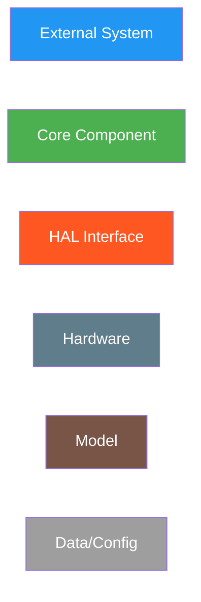
