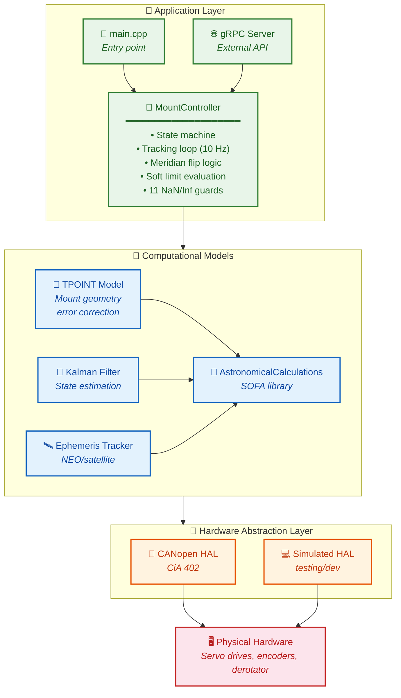
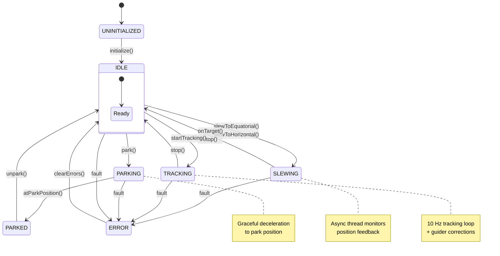
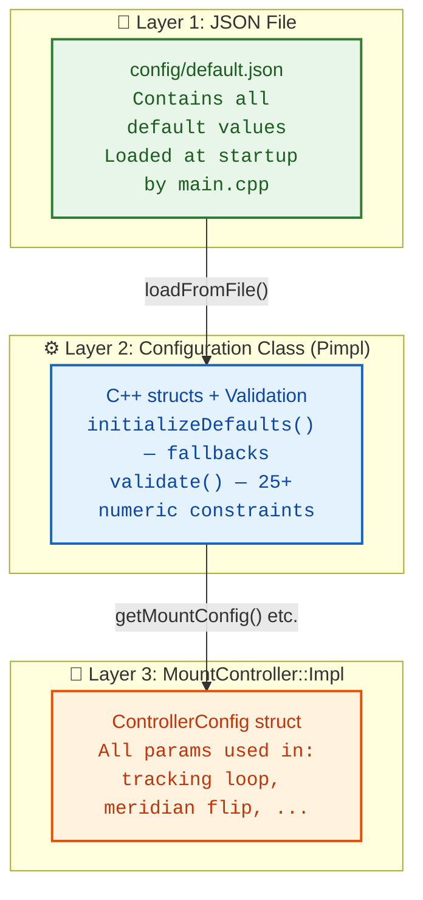
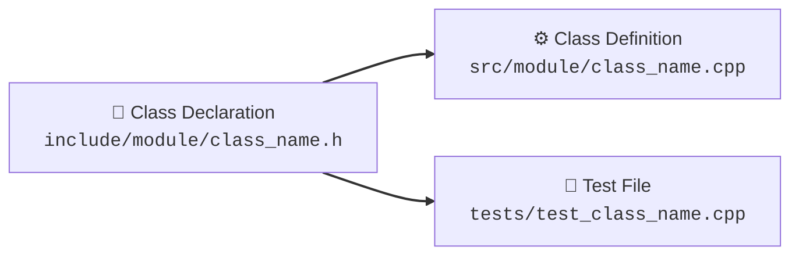

# Developer Onboarding Guide

Welcome to the Astronomical Mount Controller project. This guide provides everything you need to understand the codebase, set up your development environment, and start contributing effectively.

---

## Table of Contents

1. [Project Overview](#1-project-overview)
2. [Development Environment Setup](#2-development-environment-setup)
3. [Codebase Tour](#3-codebase-tour)
4. [Architecture at a Glance](#4-architecture-at-a-glance)
5. [Configuration System](#5-configuration-system)
6. [Build System](#6-build-system)
7. [Testing](#7-testing)
8. [Coding Standards](#8-coding-standards)
9. [Contribution Workflow](#9-contribution-workflow)
10. [Common Tasks](#10-common-tasks)
11. [Troubleshooting](#11-troubleshooting)

---

## 1. Project Overview

The Astronomical Mount Controller is a C++17 application that provides sub-arcsecond precision control of telescope mounts. It combines:

- **Astronomical calculations** using the SOFA (Standards of Fundamental Astronomy) library
- **TPOINT model** for correcting mount geometry errors (21+ parameters)
- **Extended Kalman filter** for continuous state estimation
- **CANopen/CiA 402** interface for industrial motor drives
- **gRPC API** for remote control from any programming language
- **Hardware Abstraction Layer (HAL)** for supporting multiple hardware backends

### Key Metrics

| Metric | Value |
|--------|-------|
| Lines of C++ | ~15,000+ |
| Test binaries | 9 |
| gRPC RPCs | 50+ |
| Config validation checks | 25+ |
| NaN/Inf protection points | 11 |
| Supported hardware types | 2 (CANopen, Simulated) + 3 planned |
| Build time | ~2-3 minutes (Release, 4 cores) |

---

## 2. Development Environment Setup

### Minimum Requirements

| Requirement | Version |
|-------------|---------|
| Compiler | GCC 11+ or Clang 14+ |
| CMake | 3.15+ |
| gRPC | 1.60+ |
| Protobuf | 3.21+ |
| OS | Linux (any distribution) |

### Ubuntu 22.04 / Debian 12

```bash
# Install dependencies
sudo apt update
sudo apt install -y build-essential cmake git pkg-config \
    libgrpc++-dev protobuf-compiler-grpc \
    libprotobuf-dev libprotoc-dev \
    nlohmann-json3-dev \
    libgtest-dev libgmock-dev \
    libsqlite3-dev

# Install additional CAN development tools (optional, for hardware testing)
sudo apt install -y can-utils libsocketcan-dev
```

### Clone and Build

```bash
git clone https://github.com/your-org/astro-mount-controller.git
cd astro-mount-controller

# Configure debug build with tests
mkdir build && cd build
cmake .. -DCMAKE_BUILD_TYPE=Debug \
         -DBUILD_TESTS=ON \
         -DBUILD_EXAMPLES=ON

# Build
make -j$(nproc)

# Run all tests
ctest -V
```

### Recommended Tools

- **IDE**: VS Code with C++ extensions, CLion, or QtCreator
- **Debugger**: GDB with VS Code launch configuration
- **Profiler**: perf or valgrind (for performance analysis)
- **gRPC debugging**: grpcurl, grpc_cli
- **JSON inspection**: jq (for config validation)

### VS Code Configuration

Create `.vscode/launch.json`:

```json
{
    "version": "0.2.0",
    "configurations": [
        {
            "name": "Debug Mount Controller",
            "type": "cppdbg",
            "request": "launch",
            "program": "${workspaceFolder}/build/bin/astro_mount_controller",
            "args": [],
            "stopAtEntry": false,
            "cwd": "${workspaceFolder}",
            "environment": [],
            "externalConsole": false,
            "MIMode": "gdb",
            "setupCommands": [
                {
                    "description": "Enable pretty-printing for gdb",
                    "text": "-enable-pretty-printing",
                    "ignoreFailures": true
                }
            ],
            "preLaunchTask": "build"
        }
    ]
}
```

---

## 3. Codebase Tour

### Directory Structure

```mermaid
flowchart TD
    Root["📁 astro-mount-controller"] --> Config["📁 config"]
    Root --> Include["📁 include"]
    Root --> Proto["📁 proto"]
    Root --> Src["📁 src"]
    Root --> Tests["📁 tests"]
    Root --> Sofa["📁 sofa"]
    Root --> Examples["📁 examples"]
    Root --> Db["📁 db"]
    Root --> Web["📁 web"]
    Root --> Scripts["📁 scripts"]

    Config --> DefJson["📄 default.json<br/><i>177 lines — defaults</i>"]

    Include --> IncConfig["📁 config"]
    Include --> IncControllers["📁 controllers"]
    Include --> IncCore["📁 core"]
    Include --> IncHal["📁 hal"]
    Include --> IncLogging["📁 logging"]
    Include --> IncModels["📁 models"]

    IncConfig --> ConfigH["📄 configuration.h<br/><i>428 lines — structs</i>"]
    IncControllers --> MCH["📄 mount_controller.h<br/><i>841 lines — API</i>"]
    IncControllers --> ICAN["📄 icanopen_interface.h<br/><i>CANopen abstraction</i>"]
    IncCore --> AstroH["📄 astronomical_calculations.h"]
    IncHal --> HALI["📄 hal_interface.h<br/><i>Abstract base</i>"]
    IncHal --> HALConfig["📄 hal_config.h<br/><i>Config struct</i>"]
    IncHal --> HALFactoryH["📄 hal_factory.h<br/><i>Factory</i>"]
    IncHal --> MotorCtrl["📄 motor_control.h"]
    IncHal --> EncoderReader["📄 encoder_reader.h"]
    IncHal --> SafetyMon["📄 safety_monitor.h"]
    IncHal --> SensorI["📄 sensor_interface.h"]
    IncLogging --> LoggerH["📄 logger.h"]
    IncModels --> TPointH["📄 tpoint_model.h"]
    IncModels --> KFH["📄 kalman_filter.h"]
    IncModels --> EphH["📄 ephemeris_tracker.h"]

    Proto --> MCPI["📄 mount_controller.proto<br/><i>1115 lines — gRPC API</i>"]
    Proto --> CANProto["📄 canopen_service.proto"]

    Src --> SrcAPI["📁 api"]
    Src --> SrcConfig["📁 config"]
    Src --> SrcControllers["📁 controllers"]
    Src --> SrcCore["📁 core"]
    Src --> SrcHal["📁 hal"]
    Src --> SrcLogging["📁 logging"]
    Src --> SrcModels["📁 models"]
    Src --> MainCPP["📄 main.cpp<br/><i>304 lines — entry</i>"]

    SrcAPI --> GRPCCPP["📄 grpc_server.cpp"]
    SrcConfig --> ConfigCPP["📄 configuration.cpp<br/><i>1185 lines — validator</i>"]
    SrcControllers --> MCCPP["📄 mount_controller.cpp<br/><i>5195 lines — core logic</i>"]
    SrcCore --> AstroCPP["📄 astronomical_calculations.cpp"]
    SrcHal --> HALFactoryCPP["📄 hal_factory.cpp"]
    SrcHal --> CANopenHAL["📁 canopen_hal"]
    SrcHal --> SimHAL["📁 simulated_hal"]
    CANopenHAL --> CANCPP["📄 canopen_hal.cpp<br/><i>1845 lines — CiA 402</i>"]
    SimHAL --> SimCPP["📄 simulated_hal.cpp"]
    SrcLogging --> LoggerCPP["📄 logger.cpp"]
    SrcModels --> TPointCPP["📄 tpoint_model.cpp"]
    SrcModels --> KFCPP["📄 kalman_filter.cpp"]
    SrcModels --> EphCPP["📄 ephemeris_tracker.cpp"]

    Tests --> TMC["📄 test_mount_controller.cpp<br/><i>919 lines, 25 groups</i>"]
    Tests --> TTP["📄 test_tpoint_model.cpp<br/><i>184 lines, 17 cases</i>"]
    Tests --> TAC["📄 test_astronomical_calculations.cpp"]
    Tests --> TConfig["📄 test_configuration.cpp"]
    Tests --> TKF["📄 test_kalman_filter.cpp"]
    Tests --> TET["📄 test_ephemeris_tracker.cpp"]
    Tests --> THAL["📄 test_hal_integration.cpp"]
    Tests --> TGRPC["📄 test_grpc_integration.cpp"]
    Tests --> TSAC["📄 test_subarcsecond_accuracy.cpp"]

    classDef root fill:#1a1a2e,stroke:#16213e,color:#e0e0e0,stroke-width:2px
    classDef dir fill:#2d3436,stroke:#636e72,color:#dfe6e9,stroke-width:1px
    classDef json fill:#e8f5e9,stroke:#2e7d32,stroke-width:1px,color:#1b5e20
    classDef header fill:#e3f2fd,stroke:#1565c0,stroke-width:1px,color:#0d47a1
    classDef proto fill:#f3e5f5,stroke:#7b1fa2,stroke-width:1px,color:#4a148c
    classDef source fill:#fff3e0,stroke:#e65100,stroke-width:1px,color:#bf360c
    classDef test fill:#fce4ec,stroke:#c62828,stroke-width:1px,color:#b71c1c
    classDef misc fill:#f5f5f5,stroke:#9e9e9e,stroke-width:1px,color:#616161

    class Root root
    class Config,Include,Proto,Src,Tests,Sofa,Examples,Db,Web,Scripts,IncConfig,IncControllers,IncCore,IncHal,IncLogging,IncModels,SrcAPI,SrcConfig,SrcControllers,SrcCore,SrcHal,SrcLogging,SrcModels,CANopenHAL,SimHAL dir
    class DefJson json
    class ConfigH,MCH,ICAN,AstroH,HALI,HALConfig,HALFactoryH,MotorCtrl,EncoderReader,SafetyMon,SensorI,LoggerH,TPointH,KFH,EphH header
    class MCPI,CANProto proto
    class GRPCCPP,ConfigCPP,MCCPP,AstroCPP,HALFactoryCPP,CANCPP,SimCPP,LoggerCPP,TPointCPP,KFCPP,EphCPP,MainCPP source
    class TMC,TTP,TAC,TConfig,TKF,TET,THAL,TGRPC,TSAC test
```



### Key Files to Know

| File | Lines | Purpose | Why It Matters |
|------|-------|---------|----------------|
| [`mount_controller.cpp`](src/controllers/mount_controller.cpp) | 5195 | Core controller | Contains ALL mount logic: state machine, tracking, meridian flip, soft limits, NaN guards |
| [`mount_controller.h`](include/controllers/mount_controller.h) | 841 | Public API | Interface for all public methods and RPC implementations |
| [`configuration.cpp`](src/config/configuration.cpp) | 1185 | Config system | JSON loading, validation (25+ checks), default initialization |
| [`configuration.h`](include/config/configuration.h) | 428 | Config structs | All configuration data structures |
| [`mount_controller.proto`](proto/mount_controller.proto) | 1115 | gRPC API | Service definition for all RPCs |
| [`main.cpp`](src/main.cpp) | 304 | Entry point | Application bootstrap, signal handling, main loop |
| [`canopen_hal.cpp`](src/hal/canopen_hal/canopen_hal.cpp) | 1845 | Hardware driver | CiA 402 state machine, PDO communication, PID control |

---

## 4. Architecture at a Glance

### Three-Layer Architecture



### Component Responsibilities

| Component | File(s) | Responsibility |
|-----------|---------|----------------|
| `MountController` | [`mount_controller.cpp`](src/controllers/mount_controller.cpp) | Main controller — state machine, tracking, meridian flip, soft limits |
| `PositionKalmanFilter` | [`mount_controller.cpp`](src/controllers/mount_controller.cpp:38) | Inline KF in MountController (position estimation) |
| `AstronomicalCalculations` | [`astronomical_calculations.cpp`](src/core/astronomical_calculations.cpp) | Coordinate transforms, refraction, field rotation |
| `TPointModel` | [`tpoint_model.cpp`](src/models/tpoint_model.cpp) | Mount geometry error correction, QR solver |
| `KalmanFilter` | [`kalman_filter.cpp`](src/models/kalman_filter.cpp) | Extended KF with Joseph form, adaptive noise |
| `EphemerisTracker` | [`ephemeris_tracker.cpp`](src/models/ephemeris_tracker.cpp) | NEO/satellite tracking with interpolation |
| `Configuration` | [`configuration.cpp`](src/config/configuration.cpp) | JSON config loader, validator, defaults |
| `Configuration::Impl` | [`configuration.cpp:12`](src/config/configuration.cpp:12) | Pimpl pattern — implementation details |
| `HALInterface` | [`hal_interface.h`](include/hal/hal_interface.h) | Abstract HAL contract |
| `HALFactory` | [`hal_factory.cpp`](src/hal/hal_factory.cpp) | Creates HAL implementations |

### State Machine



### Key Data Flow (Slew to Track)

1. gRPC `SlewToCoordinates()` → `MountController::slewToEquatorial()`
2. Coordinate transform through `AstronomicalCalculations`
3. TPOINT correction application
4. Async slewing thread — position commands via HAL
5. On target → `startTracking()` activates 10 Hz tracking loop
6. Guider corrections applied (if connected)
7. Field rotation computed and sent to derotator
8. Kalman filter updates continuously

---

## 5. Configuration System

### Three-Layer Configuration



### Adding a New Configuration Parameter

1. Add field to the appropriate struct in [`configuration.h`](include/config/configuration.h)
2. Add JSON key to [`default.json`](config/default.json)
3. Add getter/setter in [`configuration.cpp`](src/config/configuration.cpp)
4. Add validation check in `validate()` method (same file, line 60)
5. Add default value in `initializeDefaults()` method (same file, line 853)
6. Map to protobuf in [`main.cpp`](src/main.cpp) (config struct → proto message)
7. Add field to `Configuration` proto message in [`mount_controller.proto`](proto/mount_controller.proto:530)
8. Wire up in `MountController::Impl` if the controller needs to use it

### Validation Example

```cpp
// From configuration.cpp validate() — checks like:
if (config.mount.max_slew_rate <= 0.0)
    errors.push_back("mount.max_slew_rate must be > 0");
if (config.network.grpc_port < 1 || config.network.grpc_port > 65535)
    errors.push_back("network.grpc_port must be 1-65535");
```

---

## 6. Build System

The project uses **CMake** with the following key options:

| Option | Default | Description |
|--------|---------|-------------|
| `BUILD_TESTS` | ON | Build test binaries |
| `BUILD_EXAMPLES` | ON | Build example programs |
| `CMAKE_BUILD_TYPE` | Release | Debug, Release, RelWithDebInfo |
| `ENABLE_CANOPEN` | ON | Enable CANopen HAL implementation |
| `ENABLE_SIMULATED_HAL` | ON | Enable simulated HAL |

### Build Targets

| Target | Description |
|--------|-------------|
| `astro_mount_controller` | Main application binary |
| `astro_object_database_server` | Astronomical database server |
| `test_mount_controller` | Controller tests (25 groups) |
| `test_tpoint_model` | TPOINT model tests (17 cases) |
| `test_configuration` | Configuration validation tests |
| `test_kalman_filter` | Kalman filter tests |
| `test_ephemeris_tracker` | Ephemeris tracker tests |
| `test_hal_integration` | HAL integration tests |
| `test_grpc_integration` | gRPC server tests |
| `test_subarcsecond_accuracy` | Accuracy verification tests |
| `test_astronomical_calculations` | Astronomical calculation tests |

### Common Build Commands

```bash
# Full debug build with tests
cmake -B build -DCMAKE_BUILD_TYPE=Debug -DBUILD_TESTS=ON
cmake --build build -j$(nproc)

# Build only the controller
cmake --build build --target astro_mount_controller -j$(nproc)

# Build and run a specific test
cmake --build build --target test_configuration -j$(nproc)
./build/bin/test_configuration

# Release build for performance testing
cmake -B build_rel -DCMAKE_BUILD_TYPE=Release
cmake --build build_rel -j$(nproc)
```

---

## 7. Testing

### Test Architecture

Tests use **Google Test** framework with mock CANopen interfaces:

- Real `MountController` is instantiated with mock CANopen (empty interface string auto-detected)
- Simulated time ticks (100ms) drive state transitions
- Position stepping (1.0 deg/tick) simulates motor movement
- No real hardware required for any test

### Running Tests

```bash
# Run all tests
cd build && ctest -V

# Run a specific test suite
./bin/test_mount_controller

# Run a specific test case
./bin/test_mount_controller --gtest_filter="*SlewToCoordinates*"

# Run with verbose output
./bin/test_configuration --gtest_print_time=1
```

### Test Categories

| Category | What It Tests |
|----------|---------------|
| **Slew/Stop/Park** | Basic mount operations |
| **Tracking** | Sidereal/solar/lunar tracking, guider integration |
| **TPOINT** | Measurement collection, calibration, parameter fitting |
| **Meridian Flip** | Flip logic, delay, hysteresis |
| **Soft Limits** | 3-zone safety system |
| **NaN/Inf Guards** | All 11 protection points |
| **Configuration** | Validation, default values, loading |
| **Kalman Filter** | State estimation, covariance |
| **Ephemeris** | Upload, interpolation, tracking |
| **HAL** | CANopen enable sequence, PID control |
| **gRPC** | Server lifecycle, RPC handling |
| **Sub-arcsecond** | Accuracy verification |

### Writing Tests

```cpp
#include <gtest/gtest.h>
#include "controllers/mount_controller.h"

using namespace astro_mount::controllers;

TEST(MyNewFeature, BasicOperation) {
    auto controller = std::make_unique<MountController>();
    
    // Configure
    MountController::ControllerConfig config;
    config.mount_type = MountController::MountType::EQUATORIAL;
    // ... set other fields
    
    ASSERT_TRUE(controller->initialize(config));
    
    // Test operation
    EXPECT_TRUE(controller->slewToEquatorial(5.0, 30.0));
    
    // Check state
    auto status = controller->getStatus();
    EXPECT_EQ(status.state, MountStatus::State::SLEWING);
}
```

---

## 8. Coding Standards

### C++ Style

- **C++17** standard (use `std::optional`, `std::variant`, structured bindings)
- **Pimpl idiom** for implementation hiding (see `Configuration::Impl`)
- **RAII** for resource management
- **Snake case** for functions and variables: `slewToEquatorial()`, `tracking_rate_`
- **Pascal case** for classes and structs: `MountController`, `TPointModel`
- **Namespaces**: `astro_mount::controllers`, `astro_mount::config`, `astro_mount::hal`
- **Header guards** with `#ifndef`/`#define`/`#endif` convention

### File Organization



### Error Handling

- Return `bool` for simple success/failure operations
- Use `std::optional` or `std::expected` (C++23) for return values
- Log errors via the `Logger` instance
- Set controller state to `ERROR` for unrecoverable issues
- Never throw exceptions across component boundaries

### NaN/Inf Guard Pattern

Every mathematical computation that could produce non-finite values must be guarded:

```cpp
if (!std::isfinite(rate_factor)) {
    LOG_ERROR("Non-finite rate factor detected");
    setState(MountStatus::State::ERROR);
    return false;
}
```

See 11 guards in [`mount_controller.cpp`](src/controllers/mount_controller.cpp).

### Thread Safety

- `std::mutex` with clear hierarchy to prevent deadlocks
- Lock order: `state_mutex_` → `tracking_mutex_` → `hal_mutex_`
- Work threads for async operations (slew, park) with proper join
- `std::atomic` for simple flags

---

## 9. Contribution Workflow

### Step 1: Understand the Code

Start by reading these key files in order:

1. [`config/default.json`](config/default.json) — Understand the configuration structure
2. [`include/config/configuration.h`](include/config/configuration.h) — Configuration data types
3. [`src/config/configuration.cpp`](src/config/configuration.cpp) — How config is loaded and validated
4. [`include/controllers/mount_controller.h`](include/controllers/mount_controller.h) — Public API
5. [`proto/mount_controller.proto`](proto/mount_controller.proto) — gRPC service definition
6. [`src/main.cpp`](src/main.cpp) — How it all comes together
7. [`src/controllers/mount_controller.cpp`](src/controllers/mount_controller.cpp) — Core logic

### Step 2: Set Up Your Environment

```bash
# Fork and clone
git clone https://github.com/YOUR-USERNAME/astro-mount-controller.git
cd astro-mount-controller

# Create a branch
git checkout -b feature/my-feature

# Build
mkdir build && cd build
cmake .. -DCMAKE_BUILD_TYPE=Debug -DBUILD_TESTS=ON
make -j$(nproc)

# Verify tests pass
ctest -V
```

### Step 3: Make Changes

- Follow the [coding standards](#8-coding-standards)
- Add tests for new functionality
- Update documentation for API changes
- Run all tests before submitting

### Step 4: Submit

```bash
# Commit with descriptive message
git add -A
git commit -m "feat: add support for X feature

- Implemented X in mount_controller.cpp
- Added Y test cases
- Updated configuration validation for Z

Closes #123"

# Push and create PR
git push origin feature/my-feature
```

### Commit Message Convention

```
<type>: <subject>

<body>

<footer>
```

Types: `feat`, `fix`, `docs`, `test`, `refactor`, `perf`, `chore`

---

## 10. Common Tasks

### Adding a New gRPC RPC

1. Add RPC definition in [`mount_controller.proto`](proto/mount_controller.proto) (service block, line 311)
2. Create any new message types needed
3. Regenerate proto stubs: `make proto`
4. Implement handler in [`grpc_server.cpp`](src/api/grpc_server.cpp)
5. Implement business logic in [`mount_controller.cpp`](src/controllers/mount_controller.cpp)
6. Add method declaration in [`mount_controller.h`](include/controllers/mount_controller.h)
7. Add tests in [`test_grpc_integration.cpp`](tests/test_grpc_integration.cpp)
8. Update [`docs/en/api.md`](docs/en/api.md) and [`docs/en/api_examples.md`](docs/en/api_examples.md)

### Adding a New HAL Implementation

1. Create `include/hal/my_hal/my_hal.h` and `src/hal/my_hal/my_hal.cpp`
2. Implement all methods of `HALInterface`
3. Add `HALType` enum value (if new type)
4. Register in `HALFactory::create()`
5. Add configuration fields to `HALConfig`
6. Add integration tests

### Modifying Configuration

1. Add field to struct in [`configuration.h`](include/config/configuration.h)
2. Add JSON key in [`default.json`](config/default.json)
3. Add getter/setter + validation in [`configuration.cpp`](src/config/configuration.cpp)
4. Add default in `initializeDefaults()`
5. Wire up in [`main.cpp`](src/main.cpp) and/or [`mount_controller.cpp`](src/controllers/mount_controller.cpp)
6. Add to `Configuration` proto message in [`mount_controller.proto`](proto/mount_controller.proto:530)
7. Update [`docs/en/index.md`](docs/en/index.md) configuration example

### Adding NaN/Inf Guards

1. Identify a code path that could produce non-finite values
2. Add guard before use: `if (!std::isfinite(value)) { /* handle */ }`
3. Log with context: `LOG_ERROR("Non-finite rate_factor at tracking loop iteration")`
4. Transition to ERROR state and return early
5. Document in the 11-guard coverage table

---

## 11. Troubleshooting

### Build Issues

| Problem | Solution |
|---------|----------|
| `gRPC not found` | Install `libgrpc++-dev protobuf-compiler-grpc` |
| `nlohmann/json.hpp not found` | Install `nlohmann-json3-dev` |
| `SOFA library not found` | Run `git submodule update --init` in sofa/ directory |
| `Protobuf version mismatch` | Check `protoc --version`, must match grpc version |
| `Linking errors` | Run `cmake .. --fresh` to regenerate cache |

### Runtime Issues

| Problem | Solution |
|---------|----------|
| Controller fails to initialize | Check `config/default.json` for valid values |
| gRPC connection refused | Check port 50051 is open, service is running |
| CAN bus errors | `sudo ip link set can0 up type can bitrate 125000` |
| Tests hanging | Check for deadlock in mutex acquisition order |
| High tracking error | Run TPOINT calibration, check encoder readings |

### Debugging Tips

```bash
# Run with verbose logging
./bin/astro_mount_controller --log-level=debug

# Check gRPC connectivity
grpcurl -plaintext localhost:50051 list

# Monitor CAN bus
candump can0

# Check systemd service status
sudo systemctl status astro-mount-controller

# View logs
journalctl -u astro-mount-controller -f
```

---

## Quick Reference

### Key Header Files

| Header | What It Contains |
|--------|-----------------|
| [`mount_controller.h`](include/controllers/mount_controller.h) | `MountController` class, `ControllerConfig`, `MountStatus` |
| [`configuration.h`](include/config/configuration.h) | All config structs: `MountConfig`, `GuiderConfig`, `KalmanConfig`, `TPointConfig`, `DerotatorConfig`, `FieldRotationParams` |
| [`hal_interface.h`](include/hal/hal_interface.h) | `HALInterface` abstract class |
| [`hal_config.h`](include/hal/hal_config.h) | `HALConfig` struct with all hardware parameters |
| [`hal_factory.h`](include/hal/hal_factory.h) | `HALFactory` for creating HAL instances |
| [`tpoint_model.h`](include/models/tpoint_model.h) | `TPointModel` class |
| [`kalman_filter.h`](include/models/kalman_filter.h) | `KalmanFilter` class |

### Key Source Files

| File | Lines | Purpose |
|------|-------|---------|
| [`mount_controller.cpp`](src/controllers/mount_controller.cpp) | 5195 | All controller logic |
| [`configuration.cpp`](src/config/configuration.cpp) | 1185 | Config loading, validation, defaults |
| [`canopen_hal.cpp`](src/hal/canopen_hal/canopen_hal.cpp) | 1845 | CANopen hardware driver |
| [`main.cpp`](src/main.cpp) | 304 | Entry point, config wiring |
| [`tpoint_model.cpp`](src/models/tpoint_model.cpp) | ~400 | TPOINT model |
| [`kalman_filter.cpp`](src/models/kalman_filter.cpp) | ~300 | Kalman filter |
| [`mount_controller.proto`](proto/mount_controller.proto) | 1115 | gRPC service definition |

### Key Protobuf Messages

| Message | Line | Purpose |
|---------|------|---------|
| `Coordinates` | [proto:9](proto/mount_controller.proto:9) | Astronomical coordinates with proper motion, parallax, catalog IDs |
| `Configuration` | [proto:530](proto/mount_controller.proto:530) | Full system configuration (49 fields) |
| `ControllerState` | [proto:198](proto/mount_controller.proto:198) | Current mount state with tracking parameters |
| `DerotatorConfig` | [proto:825](proto/mount_controller.proto:825) | Derotator hardware configuration |
| `HALConfig` | [proto:1063](proto/mount_controller.proto:1063) | Complete HAL configuration |
| `TrajectoryParams` | [proto:116](proto/mount_controller.proto:116) | Trajectory generation parameters |
| `EphemerisData` | [proto:689](proto/mount_controller.proto:689) | Ephemeris data for moving objects |

---

*Last updated: May 2026*
