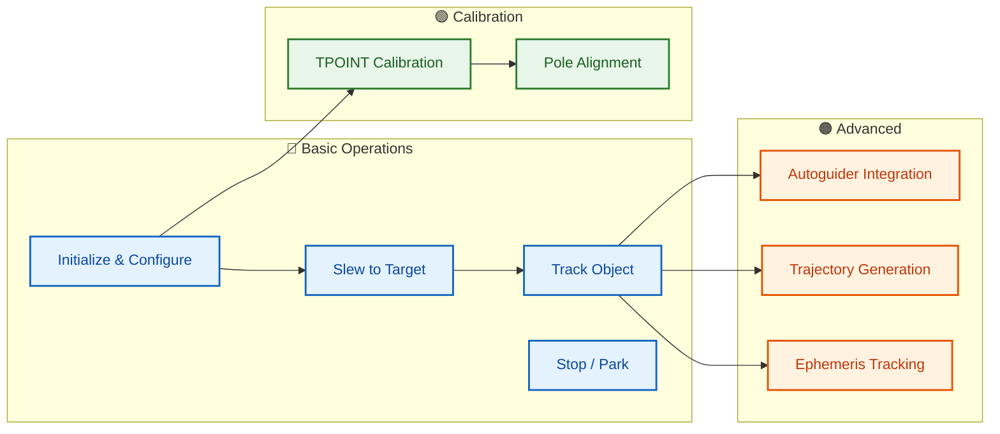

# Usage Examples

## Use Case Overview



## Overview

This document contains practical usage examples of Astronomical Mount Controller in various scenarios. Examples are available in C++ and Python.

## Basic Usage

### Initialization and Configuration

#### C++

```cpp
#include <iostream>
#include <memory>
#include "controllers/mount_controller.h"

using namespace astro_mount::controllers;

int main() {
    // Create controller
    auto controller = std::make_unique<MountController>();
    
    // Basic configuration
    MountController::ControllerConfig config;
    
    // Observatory location
    config.latitude = 52.0;      // Warsaw (approx)
    config.longitude = 21.0;
    config.altitude = 100.0;
    
    // Mount parameters
    config.mount_type = MountController::MountType::EQUATORIAL;
    config.max_slew_rate = 5.0;
    config.max_tracking_rate = 0.004178;  // Sidereal rate
    config.slew_acceleration = 1.0;
    config.tracking_acceleration = 0.5;
    
    // HA axis physical parameters (gear ratio, motor, encoder)
    config.ha_axis_params.motor_steps_per_rev = 200.0;
    config.ha_axis_params.motor_microstepping = 64.0;
    config.ha_axis_params.encoder_resolution = 16384.0;
    config.ha_axis_params.gear_ratio = 360.0;
    config.ha_axis_params.backlash = 8.5;
    
    // Dec axis physical parameters
    config.dec_axis_params.motor_steps_per_rev = 200.0;
    config.dec_axis_params.motor_microstepping = 64.0;
    config.dec_axis_params.encoder_resolution = 16384.0;
    config.dec_axis_params.gear_ratio = 360.0;
    config.dec_axis_params.backlash = 6.3;
    
    // Kalman filter
    config.process_noise = 0.001;
    config.measurement_noise = 0.001;
    
    // TPOINT configuration
    config.tpoint_enabled_terms = 65535;  // All terms enabled
    
    // Meridian flip
    config.meridian_flip_enabled = true;
    config.meridian_flip_delay_minutes = 5.0;
    
    // Soft limits
    config.soft_limits_enabled = true;
    config.soft_limit_axis1_min = -270.0;
    config.soft_limit_axis1_max = 270.0;
    
    // Initialization
    if (!controller->initialize(config)) {
        std::cerr << "Controller initialization error" << std::endl;
        return 1;
    }
    
    std::cout << "Controller initialized successfully" << std::endl;
    
    // ... further operations
    
    return 0;
}
```

#### Python

```python
import grpc
from proto import mount_controller_pb2
from proto import mount_controller_pb2_grpc
import time

# Connect to server
channel = grpc.insecure_channel('localhost:50051')
stub = mount_controller_pb2_grpc.MountControllerServiceStub(channel)

# Get configuration
from google.protobuf import empty_pb2
config = stub.GetConfiguration(empty_pb2.Empty())

print(f"Location: {config.latitude}° N, {config.longitude}° E")
print(f"HA axis gear ratio: {config.axis1_gear_ratio}")
print(f"Dec axis gear ratio: {config.axis2_gear_ratio}")
print(f"HA motor steps: {config.ha_axis_params.motor_steps_per_rev}")
print(f"HA microstepping: {config.ha_axis_params.motor_microstepping}")
```

### CASUAL Mount Configuration

CASUAL mount type (`MountType::CASUAL = 3`) is used for arbitrarily oriented mounts (e.g., portable mounts on uneven ground, fixed mounts at non-optimal latitude, or any mount whose axes are not aligned to the local horizontal frame). The mount orientation is described by a unit quaternion `[qx, qy, qz, qw]` representing the rotation from the ENU horizontal frame to the mount frame.

**Key differences from EQUATORIAL and ALT_AZ:**
- No meridian flip — CASUAL mounts have no mechanical meridian
- No TPOINT correction in the tracking loop — uses rate-based tracking like ALT_AZ
- Tracking rates computed dynamically from orientation quaternion
- Soft limits configured in mount-frame coordinates (axis1/axis2 degrees)
- Bootstrap calibration estimates the orientation quaternion from ≥3 star measurements

#### C++

```cpp
// CASUAL mount configuration example
// -- e.g., a mount on a tripod at 30° tilt, oriented 15° East of North
MountController::ControllerConfig config;

// Observatory location
config.latitude = 52.0;
config.longitude = 21.0;
config.altitude = 100.0;

// Mount parameters
config.mount_type = MountController::MountType::CASUAL;
config.max_slew_rate = 5.0;
config.max_tracking_rate = 0.004178;  // Sidereal rate (default)

// Mount orientation quaternion [qx, qy, qz, qw]
// This example: identity quaternion = mount frame aligned with horizontal
// For a real CASUAL mount, measure the orientation and compute Q
auto ori = MountController::MountOrientation();
ori.setFromAxisAngles(0.0, 0.0, 0.0);  // Identity orientation
// or explicitly:
// ori.quaternion = {0.0, 0.0, 0.0, 1.0};  // qx, qy, qz, qw
controller->setMountOrientation(ori);

// Axis physical parameters (CASUAL uses axis1/axis2, not HA/Dec)
config.ha_axis_params.motor_steps_per_rev = 200.0;   // axis1 motor
config.ha_axis_params.motor_microstepping = 64.0;
config.ha_axis_params.encoder_resolution = 16384.0;
config.ha_axis_params.gear_ratio = 360.0;
config.ha_axis_params.backlash = 8.5;

config.dec_axis_params.motor_steps_per_rev = 200.0;   // axis2 motor
config.dec_axis_params.motor_microstepping = 64.0;
config.dec_axis_params.encoder_resolution = 16384.0;
config.dec_axis_params.gear_ratio = 360.0;
config.dec_axis_params.backlash = 6.3;

// Kalman filter
config.process_noise = 0.001;
config.measurement_noise = 0.001;

// TPOINT — used for CASUAL only in initial pointing model
config.tpoint_enabled_terms = 65535;

// No meridian flip for CASUAL mounts
config.meridian_flip_enabled = false;

// Soft limits in mount-frame coordinates (axis1 = altitude-like, axis2 = azimuth-like)
config.soft_limits_enabled = true;
config.soft_limit_axis1_min = -10.0;    // Allow below horizon
config.soft_limit_axis1_max = 100.0;    // Past zenith
config.soft_limit_axis2_min = -180.0;
config.soft_limit_axis2_max = 180.0;

// Initialization
if (!controller->initialize(config)) {
    std::cerr << "Controller initialization error" << std::endl;
    return 1;
}

std::cout << "CASUAL controller initialized successfully" << std::endl;
```

#### Python

```python
# CASUAL mount configuration via gRPC
from google.protobuf import empty_pb2

# Get current configuration
config = stub.GetConfiguration(empty_pb2.Empty())

# Set mount type to CASUAL
config.mount_type = mount_controller_pb2.MOUNT_TYPE_CASUAL  # = 3

# Set orientation quaternion [qx, qy, qz, qw]
# Identity quaternion = no rotation from horizontal frame
config.mount_orientation_quaternion.extend([0.0, 0.0, 0.0, 1.0])

# Disable meridian flip (not applicable to CASUAL)
config.meridian_flip_enabled = False

# Update configuration
stub.UpdateConfiguration(config)

# Verify orientation
updated = stub.GetConfiguration(empty_pb2.Empty())
print(f"Mount type: CASUAL")
print(f"Orientation Q: {list(updated.mount_orientation_quaternion)}")
```

## Mount Control

### Slew to Coordinates

#### C++

```cpp
// Slew to M31 (Andromeda Galaxy)
double ra_m31 = 0.7117;    // 00h 42m 44s
double dec_m31 = 41.2692;  // +41° 16' 09"

if (controller->slewToEquatorial(ra_m31, dec_m31)) {
    std::cout << "Started slew to M31" << std::endl;
    
    // Wait for slew completion
    while (controller->getStatus().state == MountStatus::State::SLEWING) {
        auto status = controller->getStatus();
        std::cout << "Position: RA=" << status.axis1_position 
                  << "°, Dec=" << status.axis2_position << "°" << std::endl;
        std::this_thread::sleep_for(std::chrono::seconds(1));
    }
    
    std::cout << "Slew completed" << std::endl;
} else {
    std::cerr << "Cannot start slew" << std::endl;
}
```

#### Python

```python
# Slew to Vega
vega = mount_controller_pb2.Coordinates(
    ra=18.6156,    # 18h 36m 56s
    dec=38.7836    # +38° 47' 01"
)

# Send command
from google.protobuf import empty_pb2
stub.SlewToCoordinates(vega)

# Monitor progress
import time
while True:
    state = stub.GetState(empty_pb2.Empty())
    if state.status != mount_controller_pb2.ControllerState.SLEWING:
        break
    print(f"Position: {state.current_position.axis1:.2f}°, {state.current_position.axis2:.2f}°")
    time.sleep(1)

print("Slew completed")
```

### Track Object

#### C++

```cpp
// Start tracking Saturn
double ra_saturn = 20.6467;   // 20h 38m 48s
double dec_saturn = -19.3417; // -19° 20' 30"

if (controller->trackObject(ra_saturn, dec_saturn)) {
    std::cout << "Started tracking Saturn" << std::endl;
    
    // Track for 5 minutes
    std::this_thread::sleep_for(std::chrono::minutes(5));
    
    // Stop tracking
    controller->stop();
    std::cout << "Tracking stopped" << std::endl;
}
```

#### Python

```python
# Track Jupiter
jupiter = mount_controller_pb2.Coordinates(
    ra=2.0972,     # 02h 05m 50s
    dec=12.3389    # +12° 20' 20"
)

# Start tracking
stub.TrackObject(jupiter)

# Track for specified duration
import time
tracking_duration = 300  # 5 minutes
start_time = time.time()

while time.time() - start_time < tracking_duration:
    state = stub.GetState(empty_pb2.Empty())
    tracking_error = state.pointing_error
    print(f"Pointing error: {tracking_error:.2f} arcsec")
    time.sleep(10)

# Stop
stub.Stop(empty_pb2.Empty())
```

## TPOINT Calibration

### Collecting Measurements

#### C++

```cpp
// Function to collect measurements for TPOINT calibration
void collectTPointMeasurements(MountController& controller, int num_measurements) {
    std::vector<TPointModel::Measurement> measurements;
    
    for (int i = 0; i < num_measurements; ++i) {
        // Select calibration star
        auto star = selectCalibrationStar(i);
        
        // Slew to star
        controller.slewToEquatorial(star.ra, star.dec);
        
        // Wait for stabilization
        std::this_thread::sleep_for(std::chrono::seconds(10));
        
        // Take measurement (simulation - in reality from camera)
        TPointModel::Measurement meas;
        meas.observed_ra = star.ra + randomError(0.001);  // Add measurement error
        meas.observed_dec = star.dec + randomError(0.001);
        meas.expected_ra = star.ra;
        meas.expected_dec = star.dec;
        meas.mount_ha = controller.getHourAngle();
        meas.mount_dec = controller.getDeclination();
        meas.temperature = readTemperature();
        meas.pressure = readPressure();
        meas.timestamp = std::chrono::system_clock::now();
        
        measurements.push_back(meas);
        
        // Add measurement to model
        controller.addMeasurement(meas);
        
        std::cout << "Measurement " << (i+1) << "/" << num_measurements 
                  << " added" << std::endl;
    }
    
    // Fit TPOINT model
    auto params = controller.getTPointParameters();
    std::cout << "TPOINT calibration completed. χ² = " 
              << params.chi_squared << std::endl;
}
```

#### Python

```python
def calibrate_tpoint(stub, stars):
    """TPOINT calibration based on star list"""
    
    measurements = []
    
    for i, star in enumerate(stars):
        print(f"Calibrating star {i+1}/{len(stars)}: {star['name']}")
        
        # Slew to star
        coords = mount_controller_pb2.Coordinates(
            ra=star['ra'],
            dec=star['dec']
        )
        stub.SlewToCoordinates(coords)
        
        # Wait for settling
        time.sleep(10)
        
        # Get current mount position
        state = stub.GetState(empty_pb2.Empty())
        
        # Create measurement (in real system, this would come from camera)
        measurement = mount_controller_pb2.Measurement(
            observed=mount_controller_pb2.Coordinates(
                ra=star['ra'] + random.uniform(-0.001, 0.001),
                dec=star['dec'] + random.uniform(-0.001, 0.001)
            ),
            expected=mount_controller_pb2.Coordinates(
                ra=star['ra'],
                dec=star['dec']
            ),
            mount_position=state.current_position,
            temperature=20.0,
            pressure=1013.25,
            timestamp=timestamp_pb2.Timestamp(seconds=int(time.time()))
        )
        
        # Add measurement
        stub.AddMeasurement(measurement)
        measurements.append(measurement)
    
    # Get TPOINT parameters
    tpoint_params = stub.GetTPointParameters(empty_pb2.Empty())
    print(f"Calibration completed. χ² = {tpoint_params.chi_squared:.3f}")
    
    return tpoint_params

# List of calibration stars
calibration_stars = [
    {'name': 'Vega', 'ra': 18.6156, 'dec': 38.7836},
    {'name': 'Altair', 'ra': 19.8464, 'dec': 8.8683},
    {'name': 'Deneb', 'ra': 20.6905, 'dec': 45.2803},
    {'name': 'Arcturus', 'ra': 14.2610, 'dec': 19.1824},
    {'name': 'Spica', 'ra': 13.4199, 'dec': -11.1613},
    # ... more stars
]

# Perform calibration
tpoint_params = calibrate_tpoint(stub, calibration_stars)
```

### Pole Position Determination

#### C++

```cpp
// Automatic pole position determination using drift method
void determinePolePosition(MountController& controller) {
    std::cout << "Starting pole position determination..." << std::endl;
    
    // Select star near meridian
    double ra = controller.getLocalSiderealTime();
    double dec = 0.0;  // Near celestial equator
    
    // Slew to start position
    controller.slewToEquatorial(ra, dec);
    
    // Start drift measurement
    controller.startDriftMeasurement();
    
    // Monitor for 30 minutes
    std::this_thread::sleep_for(std::chrono::minutes(30));
    
    // Stop measurement and calculate pole position
    auto pole_position = controller.stopDriftMeasurement();
    
    std::cout << "Pole position determined:" << std::endl;
    std::cout << "  Latitude: " << pole_position.latitude << "°" << std::endl;
    std::cout << "  Longitude: " << pole_position.longitude << "°" << std::endl;
    std::cout << "  Accuracy: " << pole_position.accuracy << " arcsec" << std::endl;
    
    // Update configuration
    auto config = controller.getConfiguration();
    config.latitude = pole_position.latitude;
    config.longitude = pole_position.longitude;
    controller.updateConfiguration(config);
}
```

#### Python

```python
def auto_polar_alignment(stub):
    """Automatic polar alignment"""
    
    print("Starting automatic polar alignment...")
    
    # Start pole position determination
    request = mount_controller_pb2.PoleDeterminationRequest(
        measurement_count=20,
        duration_hours=0.5
    )
    
    pole_position = stub.DeterminePolePosition(request)
    
    print(f"Pole position determined:")
    print(f"  Latitude: {pole_position.latitude:.6f}°")
    print(f"  Longitude: {pole_position.longitude:.6f}°")
    print(f"  Altitude: {pole_position.altitude:.1f} m")
    print(f"  Accuracy: {pole_position.accuracy:.1f} arcsec")
    
    # Update configuration
    config = stub.GetConfiguration(empty_pb2.Empty())
    config.latitude = pole_position.latitude
    config.longitude = pole_position.longitude
    config.altitude = pole_position.altitude
    
    stub.UpdateConfiguration(config)
    
    return pole_position

# Perform automatic alignment
pole_pos = auto_polar_alignment(stub)
```

## Autoguiding System Integration

### Guider Connection

#### C++

```cpp
// Configure and connect to guider
void setupGuider(MountController& controller) {
    MountController::GuiderConfig guider_config;
    guider_config.connection_string = "tcp://localhost:7624";  // INDI
    guider_config.max_correction = 10.0;  // Maximum correction [arcsec]
    guider_config.aggression = 0.5;       // Correction aggression (0-1)
    guider_config.exposure_time_ms = 2000; // Exposure time
    guider_config.binning = 2;            // Binning
    
    if (controller.connectGuider(guider_config)) {
        std::cout << "Connected to guider" << std::endl;
        
        // Enable autoguiding
        controller.enableGuiding(true);
        
        // Set callback for corrections
        controller.setGuiderCallback([](double ra_corr, double dec_corr) {
            std::cout << "Guider correction: RA=" << ra_corr 
                      << " arcsec, Dec=" << dec_corr << " arcsec" << std::endl;
        });
    } else {
        std::cerr << "Failed to connect to guider" << std::endl;
    }
}
```

#### Python

```python
def setup_guider(stub):
    """Configure autoguider"""
    
    guider_config = mount_controller_pb2.GuiderConfig(
        connection_string="tcp://localhost:7624",  # INDI server
        max_correction=10.0,
        aggression=0.5,
        exposure_time_ms=2000,
        binning=2
    )
    
    # Connect to guider
    stub.ConnectGuider(guider_config)
    
    print("Connected to autoguider")
    
    # Enable guiding in configuration
    config = stub.GetConfiguration(empty_pb2.Empty())
    config.enable_guider = True
    stub.UpdateConfiguration(config)
    
    return True

# Monitor guider corrections
def monitor_guiding(stub, duration_minutes):
    """Monitor autoguiding performance"""
    
    import time
    start_time = time.time()
    corrections = []
    
    while time.time() - start_time < duration_minutes * 60:
        state = stub.GetState(empty_pb2.Empty())
        
        if state.guider_active:
            guiding_perf = state.guiding_performance
            mount_vib = state.mount_vibration
            
            print(f"Guiding performance: {guiding_perf:.1f}%")
            print(f"Mount vibration: {mount_vib:.2f} arcsec RMS")
            
        time.sleep(5)
    
    return corrections

# Example usage
setup_guider(stub)
monitor_guiding(stub, 30)  # Monitor for 30 minutes