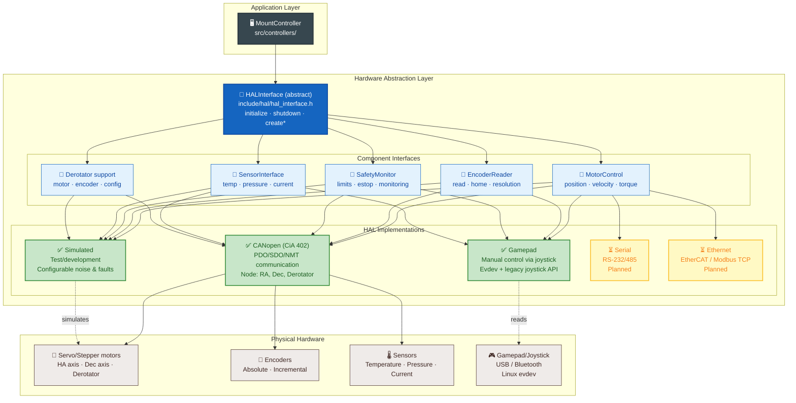
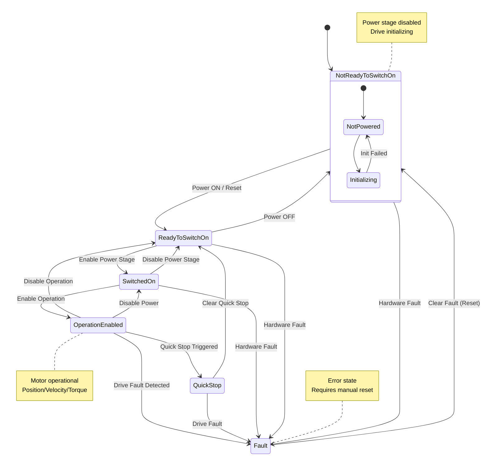

# HAL Layer Documentation

## Overview

The Hardware Abstraction Layer (HAL) provides a unified interface for controlling various telescope mount hardware configurations. It abstracts away hardware-specific details, allowing the mount controller to work with different motor types, encoder systems, and communication protocols through a common API.

### Architecture



### Key Components

| Component | Interface | Description |
|-----------|-----------|-------------|
| `HALInterface` | Abstract class | Main HAL interface - entry point for hardware control |
| `HALFactory` | Factory | Creates appropriate HAL implementation based on configuration |
| `MotorControl` | Abstract class | Motor control per axis (position, velocity, torque) |
| `EncoderReader` | Abstract class | Encoder reading and calibration |
| `SafetyMonitor` | Abstract class | Safety limit monitoring and emergency stop |
| `SensorInterface` | Abstract class | Sensor reading (temperature, pressure, current, etc.) |
| `HALConfig` | Config struct | Complete hardware configuration |

### Supported HAL Types

| Type | Enum | Description | Status |
|------|------|-------------|--------|
| Simulated | `HALType::SIMULATED` | Simulated hardware for testing/development | ✅ Implemented |
| CANopen | `HALType::CANOPEN` | CANopen/CiA 402 motor drives | ✅ Implemented |
| Gamepad | `HALType::GAMEPAD` | Manual control via gamepad/joystick | ✅ Implemented |
| Serial | `HALType::SERIAL` | RS-232/485 serial communication | ⏳ Planned |
| Ethernet | `HALType::ETHERNET` | EtherCAT, Modbus TCP, Profinet | ⏳ Planned |
| Custom | `HALType::CUSTOM` | User-defined hardware interface | 🔧 Extensible |

---

## HALInterface

The main abstract class (`include/hal/hal_interface.h`) defines the hardware abstraction contract:

```cpp
class HALInterface {
public:
    // Lifecycle management
    virtual bool initialize(const HALConfig& config) = 0;
    virtual void shutdown() = 0;
    virtual bool isInitialized() const = 0;
    
    // Component factories
    virtual std::unique_ptr<MotorControl> createMotorControl(int axis_id) = 0;
    virtual std::unique_ptr<EncoderReader> createEncoderReader(int axis_id) = 0;
    virtual std::unique_ptr<SafetyMonitor> createSafetyMonitor() = 0;
    virtual std::unique_ptr<SensorInterface> createSensorInterface() = 0;
    
    // Derotator (field rotator) support
    virtual std::unique_ptr<MotorControl> createDerotatorMotor();
    virtual std::unique_ptr<EncoderReader> createDerotatorEncoder();
    virtual bool configureDerotator(const DerotatorConfig& config);
    
    // Platform information
    virtual std::string getPlatformName() const = 0;
    virtual std::string getHardwareVersion() const = 0;
    virtual std::vector<HALFeature> getSupportedFeatures() const = 0;
    virtual bool supportsFeature(HALFeature feature) const = 0;
    
    // Resource management
    virtual bool start() = 0;
    virtual bool stop() = 0;
    virtual bool isRunning() const = 0;
    
    // Diagnostics
    virtual std::string getStatus() const = 0;
    virtual std::string getErrorMessages() const = 0;
    virtual void clearErrors() = 0;
};
```

### HALFeature Flags

| Feature | Description |
|---------|-------------|
| `CANOPEN_SUPPORT` | CANopen/CiA 402 drive support |
| `SERIAL_SUPPORT` | Serial port communication |
| `ETHERNET_SUPPORT` | Ethernet (EtherCAT, Modbus TCP) |
| `PID_CONTROL` | PID controller support |
| `TRAJECTORY_CONTROL` | Trajectory generation/control |
| `ENCODER_FEEDBACK` | Encoder feedback |
| `SAFETY_MONITORING` | Safety monitoring |
| `SENSOR_MONITORING` | Sensor monitoring |
| `REAL_TIME_CONTROL` | Real-time control |
| `DEROTATOR_SUPPORT` | Field derotator support |
| `MANUAL_CONTROL` | Manual control (gamepad/joystick) |

---

## MotorControl Interface

The `MotorControl` class (`include/hal/motor_control.h`) defines per-axis motor control:

### Motor Types

```cpp
enum class MotorType {
    STEPPER,        // Stepper motor
    SERVO,          // Servo drive
    BRUSHED_DC,     // Brushed DC motor
    BRUSHLESS_DC,   // Brushless DC motor
    CANOPEN_SERVO,  // CANopen servo (CiA 402)
    VIRTUAL         // Virtual (testing)
};
```

### Control Modes

```cpp
enum class ControlMode {
    POSITION,       // Position control
    VELOCITY,       // Velocity control
    TORQUE,         // Torque control
    TRAJECTORY,     // Trajectory control
    OPEN_LOOP       // Open loop control
};
```

### Key Methods

| Method | Description |
|--------|-------------|
| `enable() / disable()` | Enable/disable the motor drive |
| `setPosition(deg, vel, accel)` | Set target position with motion profile |
| `setVelocity(deg/s, accel)` | Set target velocity |
| `setTorque(%)` | Set torque (0-100%) |
| `stop() / emergencyStop()` | Normal stop / quick stop |
| `getActualPosition()` | Current position in degrees |
| `getActualVelocity()` | Current velocity in deg/s |
| `getActualTorque()` | Current torque |
| `targetReached()` | Check if target position reached |
| `getTemperature()` | Motor temperature |
| `getCurrent()` | Motor current draw |

### Callbacks

```cpp
using PositionCallback = std::function<void(double position, double velocity, double torque)>;
using ErrorCallback = std::function<void(const std::string& error, int error_code)>;
using StateChangeCallback = std::function<void(bool enabled, bool moving)>;
```

---

## EncoderReader Interface

The `EncoderReader` class (`include/hal/encoder_reader.h`) provides encoder reading and calibration:

### Encoder Types

```cpp
enum class EncoderType {
    INCREMENTAL,    // Incremental encoder
    ABSOLUTE,       // Absolute encoder
    RESOLVER,       // Resolver
    HALL_SENSOR,    // Hall effect sensors
    VIRTUAL         // Virtual (testing)
};
```

### Encoder Interfaces

```cpp
enum class EncoderInterface {
    QUADRATURE,     // Quadrature (A, B, Z)
    SSI,            // Synchronous Serial Interface
    BISS,           // BiSS (bidirectional serial)
    ENDAT,          // EnDat 2.2
    CANOPEN,        // CANopen
    ANALOG          // Analog (0-10V, 4-20mA)
};
```

### Key Methods

| Method | Description |
|--------|-------------|
| `initialize(config)` | Initialize encoder with configuration |
| `read()` | Read current encoder position/velocity |
| `calibrate(ref_pos)` | Calibrate with reference position |
| `autoCalibrate()` | Automatic calibration |
| `saveCalibration() / loadCalibration()` | Persistent calibration storage |
| `synchronize()` | Synchronize with motor position |

---

## SafetyMonitor Interface

The `SafetyMonitor` class (`include/hal/safety_monitor.h`) monitors hardware safety limits:

### Safety States

```cpp
enum class State {
    NORMAL,             // All systems normal
    WARNING,            // Approaching limits
    LIMIT_EXCEEDED,     // Limit exceeded
    EMERGENCY_STOP,     // Emergency stop active
    ERROR               // Error state
};
```

### Monitored Parameters per Axis

| Parameter | Description |
|-----------|-------------|
| Position | Min/max position limits |
| Velocity | Maximum velocity limit |
| Acceleration | Maximum acceleration limit |
| Current | Maximum current draw |
| Temperature | Maximum temperature |
| Voltage | Min/max voltage range |
| Communication | Communication status |

---

## SensorInterface

The `SensorInterface` class (`include/hal/sensor_interface.h`) provides environmental sensor reading:

### Sensor Types

```cpp
enum class SensorType {
    TEMPERATURE,    // Temperature sensor
    HUMIDITY,       // Humidity sensor
    PRESSURE,       // Pressure sensor
    CURRENT,        // Current sensor
    VOLTAGE,        // Voltage sensor
    VIBRATION,      // Vibration sensor
    PROXIMITY,      // Proximity sensor
    LIMIT_SWITCH,   // Limit switch
    CUSTOM          // Custom sensor
};
```

---

## HALConfig

The `HALConfig` struct (`include/hal/hal_config.h`) provides complete hardware configuration with JSON serialization support:

### Configuration Structure

```cpp
struct HALConfig {
    HALType type{HALType::SIMULATED};   // HAL implementation type
    std::string name{"Default_HAL"};    // Instance name
    
    // Gamepad configuration
    struct {
        std::string device_path;               // Empty = auto-detect
        double deadzone{0.15};                 // Joystick deadzone [0..1]
        double sensitivity{1.0};               // Sensitivity curve (1.0 = linear)
        double max_velocity_deg_s{5.0};        // Max velocity at full deflection
        bool invert_axis1{false};              // Invert left stick X
        bool invert_axis2{false};              // Invert left stick Y
        std::vector<double> speed_presets;     // Predefined speed levels
        double update_rate_hz{50.0};           // Polling frequency

        // Button mapping: physical_index → action name
        // Actions: "home", "stop", "emergency_stop", "park",
        //          "speed_up", "speed_down", "manual_toggle", "none"
        std::map<int, std::string> button_mapping;

        // Axis mapping: physical_index → axis name
        // Axes: "lx", "ly", "rx", "ry",
        //       "trigger_l", "trigger_r", "pov_x", "pov_y", "none"
        std::map<int, std::string> axis_mapping;
    } gamepad;

    // CANopen configuration
    struct {
        std::string library{"mock"};
        std::string interface_name{"can0"};
        uint32_t bitrate{125000};
        uint8_t node_id{1};
        bool use_sync{true};
        uint32_t sync_period_ms{100};
        uint32_t sdo_timeout_ms{1000};
        uint32_t pdo_update_rate{100}; // Hz
        
        // NMT (Network Management)
        struct {
            bool enable_nmt{true};
            uint32_t heartbeat_period_ms{100};
            uint32_t heartbeat_timeout_ms{500};
            bool enable_auto_recovery{true};
        } nmt;
    } canopen;
    
    // Serial port configuration
    struct {
        std::string port{"/dev/ttyUSB0"};
        uint32_t baud_rate{115200};
        std::string protocol{"modbus"};
    } serial;
    
    // Ethernet configuration
    struct {
        std::string ip_address{"192.168.1.100"};
        uint16_t port{502};
        std::string protocol{"modbus_tcp"};
    } ethernet;
    
    // Simulation configuration
    struct {
        bool enable_simulation{true};
        double simulation_update_rate{100.0};
        double position_noise_stddev{0.001};
        double velocity_noise_stddev{0.0001};
        bool simulate_errors{false};
        double error_probability{0.01};
    } simulated;
    
    DerotatorConfig derotator;          // Field derotator configuration
    std::vector<AxisConfig> axes;       // Axis configurations
    PIDParams pid_params;               // PID controller parameters
    
    // Safety configuration
    struct {
        bool enable_limits{true};
        bool enable_emergency_stop{true};
        bool enable_temperature_monitoring{true};
        bool enable_current_monitoring{true};
        bool enable_voltage_monitoring{true};
        double min_voltage{20.0};
        double max_voltage{30.0};
        uint32_t monitoring_rate{10}; // Hz
    } safety;
};
```

### JSON Configuration Example

```json
{
  "type": "canopen",
  "name": "Mount_HAL",
  "canopen": {
    "library": "canopensocket",
    "interface_name": "can0",
    "bitrate": 125000,
    "node_id": 1,
    "use_sync": true,
    "sync_period_ms": 100,
    "sdo_timeout_ms": 1000,
    "pdo_update_rate": 100,
    "nmt": {
      "enable_nmt": true,
      "heartbeat_period_ms": 100,
      "heartbeat_timeout_ms": 500,
      "max_missed_heartbeats": 3
    }
  },
  "axes": [
    {
      "id": 0,
      "name": "RA_Axis",
      "motor_config": {
        "type": "CANOPEN_SERVO",
        "default_mode": "POSITION",
        "max_velocity": 5.0,
        "max_acceleration": 1.0,
        "encoder_counts_per_degree": 10000.0,
        "gear_ratio": 360.0
      },
      "encoder_config": {
        "type": "ABSOLUTE",
        "interface": "CANOPEN",
        "resolution": 16384,
        "counts_per_degree": 10000.0
      },
      "safety_limits": {
        "min_position": -270.0,
        "max_position": 270.0,
        "max_velocity": 5.0,
        "max_acceleration": 2.0
      }
    }
  ],
  "pid_params": {
    "kp": 1.5,
    "ki": 0.2,
    "kd": 0.05,
    "integral_limit": 1000.0,
    "output_limit": 100.0
  }
}
```

### Gamepad JSON Configuration Example

```json
{
  "type": "gamepad",
  "name": "Gamepad_HAL",
  "gamepad": {
    "device_path": "",
    "deadzone": 0.15,
    "sensitivity": 1.0,
    "max_velocity_deg_s": 5.0,
    "invert_axis1": false,
    "invert_axis2": false,
    "update_rate_hz": 50.0,
    "speed_presets": [0.5, 1.0, 2.0, 3.0, 5.0],
    "button_mapping": {
      "0": "home",
      "1": "stop",
      "2": "park",
      "3": "emergency_stop",
      "4": "speed_down",
      "5": "speed_up",
      "6": "manual_toggle"
    },
    "axis_mapping": {
      "0": "lx",
      "1": "ly",
      "3": "rx",
      "4": "ry",
      "2": "trigger_l",
      "5": "trigger_r",
      "16": "pov_x",
      "17": "pov_y"
    }
  },
  "axes": [
    {
      "id": 0,
      "name": "RA_Axis",
      "motor_config": {
        "type": "VIRTUAL",
        "default_mode": "VELOCITY",
        "max_velocity": 5.0,
        "max_acceleration": 2.0
      },
      "encoder_config": {
        "type": "VIRTUAL",
        "counts_per_degree": 10000.0
      },
      "safety_limits": {
        "min_position": -270.0,
        "max_position": 270.0,
        "max_velocity": 5.0,
        "max_acceleration": 2.0
      }
    }
  ]
}
```

---

## HALFactory

The `HALFactory` (`include/hal/hal_factory.h`) creates HAL instances based on configuration:

```cpp
class HALFactory {
public:
    // Create HAL from configuration
    static std::unique_ptr<HALInterface> create(const HALConfig& config);
    static std::unique_ptr<HALInterface> create(HALType type);
    static std::unique_ptr<HALInterface> create(const std::string& type_name);
    
    // Query available implementations
    static std::vector<HALType> getAvailableTypes();
    static bool isTypeAvailable(HALType type);
    static HALType getDefaultType();
    
    // Configuration management
    static HALConfig getDefaultConfig(HALType type);
    static HALConfig loadConfigFromFile(const std::string& filename);
    static bool saveConfigToFile(const HALConfig& config, const std::string& filename);
};
```

---

## CANopen HAL Implementation

The CANopen HAL (`src/hal/canopen_hal/`) provides CiA 402-compliant drive control:

### CiA 402 State Machine



### PID Controller

Built-in PID controller for closed-loop position/velocity control, implemented in `CanOpenMotor`:

```cpp
class PIDController {
    PIDController(double kp = 1.5, double ki = 0.2, double kd = 0.05,
                  double integral_limit = 1000.0, double output_limit = 100.0);
    
    double calculate(double setpoint, double measured, double dt);
    void setParameters(double kp, double ki, double kd);
    std::tuple<double, double, double> getParameters() const;
    void reset();
};
```

Each `CanOpenMotor` owns a `PIDController` instance and runs a dedicated `control_thread_` at 100 Hz for closed-loop regulation:

```cpp
void CanOpenMotor::controlLoop() {
    auto update_interval = std::chrono::milliseconds(10); // 100 Hz
    
    while (control_running_) {
        if (enabled_ && moving_) {
            double dt = calculateDt();
            double correction = pid_controller_.calculate(
                target_position_, actual_position_, dt);
            
            // Apply correction to CANopen drive
            canopen_.setVelocityTarget(axis_id_, correction, 0.5);
            
            // Invoke position callback
            if (position_callback_) {
                position_callback_(actual_position_, actual_velocity_, actual_torque_);
            }
        }
        std::this_thread::sleep_for(update_interval);
    }
}
```

**CiA 402 Enable Sequence** - standard 4-step transition through drive state machine:
```
Step 1: sendControlWord(0x0006)  → Switch on disabled → Ready to switch on
Step 2: sendControlWord(0x0007)  → Ready to switch on → Switched on
Step 3: sendControlWord(0x000F)  → Switched on → Operation enabled
Step 4: enabled_ = true
```


### PDO Communication

The CANopen HAL uses Process Data Objects (PDO) for real-time communication:

- **TPDO1** (Transmit): Status Word + Actual Position
- **RPDO2** (Receive): Control Word + Target Position

### Implementation Classes

| Class | Description |
|-------|-------------|
| `CanOpenHAL` | Main HAL implementation using CANopen |
| `CanOpenMotor` | CiA 402 motor control with control word/status word |
| `CanOpenEncoder` | Encoder reading via PDO/SDO |
| `CanOpenSafetyMonitor` | Safety monitoring with NMT heartbeat |
| `CanOpenSensorInterface` | Sensor reading via CANopen |
| `PIDController` | Closed-loop PID controller |

---

## Gamepad HAL Implementation

The Gamepad HAL (`src/hal/gamepad_hal/`) provides manual mount control via a physical gamepad or joystick connected over USB or Bluetooth. It translates joystick axes and button presses into motor velocity commands for the mount axes.

### Architecture

```
Gamepad (USB/Bluetooth)
    ↓
EvdevGamepadInput (background polling thread)
    ↓  applyButtonMapping() / applyAxisMapping() (from JSON config)
GamepadState (7 axes, 7 semantic buttons)
    ↓
GamepadHAL::updateLoop() (50 Hz)
    ↓
GamepadMotorControl (axis 0 = left stick X, axis 1 = left stick Y)
    ↓  velocity → integrate position
GamepadEncoderReader ← GamepadMotorControl (position from integration)
```

### Input Backend — EvdevGamepadInput

The `EvdevGamepadInput` class supports both Linux input subsystems:

| Backend | Device Path | Description |
|---------|-------------|-------------|
| Legacy joystick API | `/dev/input/js0` … `js3` | Older devices, simple event format |
| evdev API | `/dev/input/event*` | Modern devices, ABS/EV_KEY events |

Auto-detection scans `/dev/input/js0…js3` and then `/dev/input/event*` devices with `EV_ABS` capability. A dedicated background thread polls the device and updates the shared gamepad state.

### Button Mapping

Physical buttons (indices 0–10 for a typical Xbox controller) are mapped to semantic mount-control actions:

| Action | Effect |
|--------|--------|
| `home` | Return mount to home position |
| `stop` | Stop all motion |
| `emergency_stop` | Immediate hardware stop |
| `park` | Park mount to safe position |
| `speed_up` | Cycle to next higher speed preset |
| `speed_down` | Cycle to next lower speed preset |
| `manual_toggle` | Enable/disable manual control mode |
| `none` | No action (unmapped) |

### Axis Mapping

Physical axes are mapped to semantic control axes:

| Axis | Source | Effect |
|------|--------|--------|
| `lx`, `ly` | Left stick | Axis 0 (RA/HA) and Axis 1 (Dec/Alt) velocity |
| `rx`, `ry` | Right stick | (reserved for future use) |
| `trigger_l`, `trigger_r` | Analog triggers | Fine speed control |
| `pov_x`, `pov_y` | D-Pad | Directional nudging |

### GamepadMotorControl

Each mount axis gets a `GamepadMotorControl` instance that derives its velocity command from the corresponding joystick axis. The motor integrates position internally so encoder feedback works naturally with the rest of the system.

Key behaviour:
- Left stick X deflection → RA/Azimuth axis velocity
- Left stick Y deflection → Dec/Altitude axis velocity
- Full deflection → current speed preset value (configurable: 0.5–5.0 °/s)
- Deadzone filter (default 15%) prevents drift when stick is centered
- Sensitivity curve (1.0 = linear) can shape response

### Speed Presets

The current speed can be cycled through presets using the speed_up/speed_down buttons:

```cpp
std::vector<double> speed_presets_deg_s{0.5, 1.0, 2.0, 3.0, 5.0};
```

### Implementation Classes

| Class | Description |
|-------|-------------|
| `GamepadHAL` | Main HAL implementation for gamepad control |
| `GamepadMotorControl` | Motor control driven by joystick axes |
| `GamepadEncoderReader` | Virtual encoder returning integrated position |
| `GamepadSafetyMonitor` | Minimal safety monitoring with limit checks |
| `GamepadSensorInterface` | Returns ambient temperature (no real sensors) |
| `EvdevGamepadInput` | Linux evdev/joystick API backend |

### Usage Example

```cpp
#include "hal/hal_factory.h"
using namespace astro_mount::hal;

// Create gamepad HAL
auto hal = HALFactory::create(HALType::GAMEPAD);

// Initialize with config (empty path = auto-detect)
HALConfig config = HALFactory::getDefaultConfig(HALType::GAMEPAD);
config.gamepad.deadzone = 0.15;
config.gamepad.sensitivity = 1.0;
hal->initialize(config);

// Create motor controls
auto ra_motor = hal->createMotorControl(0);   // RA axis
auto dec_motor = hal->createMotorControl(1);  // Dec axis

// Enable motors
ra_motor->enable();
dec_motor->enable();

// Start the HAL (begins polling gamepad)
hal->start();

// The mount is now controllable via the gamepad joystick.
// Speed presets can be cycled with speed_up/speed_down buttons.
```

### Configurable Mappings via JSON

Button and axis mappings can be overridden per-device through the JSON config file without recompiling. Only indices present in the mapping are overridden; all other indices retain their built-in default mappings.

See [Gamepad JSON Configuration Example](#gamepad-json-configuration-example) for the complete config structure.

---

## Simulated HAL Implementation

The Simulated HAL (`src/hal/simulated_hal/`) provides a hardware simulation for testing:

### Features

- Position tracking with configurable noise
- Velocity and acceleration simulation
- Temperature simulation based on operation time
- Current draw simulation based on torque
- Error simulation (configurable probability)
- Continuous encoder reading thread

### Example Usage (Testing)

```cpp
#include "hal/hal_factory.h"
using namespace astro_mount::hal;

// Create simulated HAL
auto hal = HALFactory::create(HALType::SIMULATED);

// Initialize with default config
HALConfig config = HALFactory::getDefaultConfig(HALType::SIMULATED);
config.simulated.position_noise_stddev = 0.0005; // 0.0005° noise
hal->initialize(config);

// Create motor control for axis 0 (RA)
auto motor = hal->createMotorControl(0);

// Enable and move to position
motor->enable();
motor->setPosition(45.0, 2.0, 0.5); // 45°, 2 deg/s, 0.5 deg/s²

// Read encoder
auto encoder = hal->createEncoderReader(0);
auto reading = encoder->read();
std::cout << "Position: " << reading.position_deg << "°\n";

// Start the HAL
hal->start();

// Cleanup
hal->stop();
hal->shutdown();
```

---

## Derotator (Field Rotator) Support

The HAL layer includes support for field derotation:

```cpp
struct DerotatorConfig {
    DerotatorType type{DerotatorType::STEPPER};
    bool enabled{false};
    double gear_ratio{180.0};
    double max_speed{5.0};
    double max_acceleration{2.0};
    double backlash{0.0};
    bool absolute_encoder{false};
    double encoder_resolution{36000.0};
    std::vector<double> calibration_table;
    std::string connection_string;
};
```

---

## Usage Examples

### Basic CANopen Setup

```cpp
#include "hal/hal_factory.h"
using namespace astro_mount::hal;

// Load configuration from file
HALConfig config = HALFactory::loadConfigFromFile("config/hal_config.json");

// Create HAL instance
auto hal = HALFactory::create(config);

// Initialize hardware
if (hal->initialize(config)) {
    // Create motor control for RA axis
    auto ra_motor = hal->createMotorControl(0);  // RA = axis 0
    auto dec_motor = hal->createMotorControl(1); // Dec = axis 1
    
    // Create safety monitor
    auto safety = hal->createSafetyMonitor();
    
    // Start operation
    hal->start();
    
    // Slew to position
    ra_motor->enable();
    dec_motor->enable();
    ra_motor->setPosition(180.0, 3.0, 1.0);
    dec_motor->setPosition(45.0, 2.0, 0.5);
    
    // Monitor status
    std::cout << "Status: " << hal->getStatus() << std::endl;
    auto safety_status = safety->getStatus();
    std::cout << "Safety: " << safety_status.getStateString() << std::endl;
}
```

### Feature Detection

```cpp
auto hal = HALFactory::create(HALType::CANOPEN);
auto features = hal->getSupportedFeatures();

if (hal->supportsFeature(HALFeature::PID_CONTROL)) {
    std::cout << "PID control available" << std::endl;
}
if (hal->supportsFeature(HALFeature::ENCODER_FEEDBACK)) {
    std::cout << "Encoder feedback available" << std::endl;
}
if (hal->supportsFeature(HALFeature::DEROTATOR_SUPPORT)) {
    auto derotator = hal->createDerotatorMotor();
}
```

---

## Extending the HAL

To add a new hardware implementation:

1. Create a new directory `src/hal/my_hal/`
2. Implement all methods of `HALInterface`
3. Register the implementation in `HALFactory`
4. Add configuration support to `HALConfig`
5. Add feature flag to `HALFeature` enum

---

## Architecture Diagram

```mermaid
flowchart TB
    classDef controller fill:#37474f,stroke:#263238,stroke-width:3px,color:#ffffff
    classDef canopen fill:#e8f5e9,stroke:#2e7d32,stroke-width:2px,color:#1b5e20
    classDef sim fill:#fff3e0,stroke:#e65100,stroke-width:2px,color:#bf360c
    classDef gamepad fill:#e1bee7,stroke:#6a1b9a,stroke-width:2px,color:#4a148c
    classDef ser fill:#fce4ec,stroke:#c62828,stroke-width:2px,color:#b71c1c

    MC["🎛️ Mount Controller"]:::controller
    
    subgraph CAN["🟢 CANopen (CiA 402) — Production ✅"]
        direction TB
        M1["⚙️ Motor CiA 402"]:::canopen
        E1["📏 Encoder via PDO"]:::canopen
        SM1["🛡️ Safety Monitor"]:::canopen
        SR1["🌡️ Sensor Reader"]:::canopen
    end
    
    subgraph SIM["🟠 Simulated — Testing ✅"]
        direction TB
        M2["SimulatedMotor<br/>+ noise model"]:::sim
        E2["SimulatedEncoder<br/>+ drift model"]:::sim
        SM2["(not implemented)"]:::sim
    end

    subgraph GAM["🟣 Gamepad — Manual Control ✅"]
        direction TB
        M3["GamepadMotorControl<br/>joystick → velocity"]:::gamepad
        E3["GamepadEncoderReader<br/>integrated position"]:::gamepad
        SM3["GamepadSafetyMonitor<br/>limit checks"]:::gamepad
    end
    
    subgraph SER["🔴 Serial/Ethernet — Planned ⏳"]
        direction TB
        M4["SerialMotor<br/>(future)"]:::ser
        E4["SerialEncoder<br/>(future)"]:::ser
        SM4["(future)"]:::ser
    end
    
    MC --> CAN
    MC --> SIM
    MC --> GAM
    MC --> SER
```



---

## File Structure

```
include/hal/
├── hal_interface.h      # HALInterface abstract class
├── hal_config.h         # HALConfig struct (JSON serialization)
├── hal_factory.h        # HALFactory class
├── motor_control.h      # MotorControl interface
├── encoder_reader.h     # EncoderReader interface
├── safety_monitor.h     # SafetyMonitor interface
├── sensor_interface.h   # SensorInterface
├── gamepad_input.h      # GamepadInput abstract interface
└── canopen_hal/
    └── canopen_hal.h    # CanOpenHAL header

src/hal/
├── hal_factory.cpp      # Factory implementation
├── canopen_hal/
│   ├── canopen_hal.h    # CanOpenHAL (PID, CiA 402, PDO)
│   └── canopen_hal.cpp  # Implementation (1845 lines)
├── simulated_hal/
│   ├── simulated_hal.h  # SimulatedHAL for testing
│   └── simulated_hal.cpp # Implementation
├── gamepad_hal/
│   ├── gamepad_hal.h    # GamepadHAL header
│   ├── gamepad_hal.cpp  # GamepadHAL implementation
│   ├── gamepad_input_evdev.h  # EvdevGamepadInput header
│   └── gamepad_input_evdev.cpp # EvdevGamepadInput implementation
└── serial_hal/          # (not yet implemented)
```

---

*Last updated: May 17, 2026*
