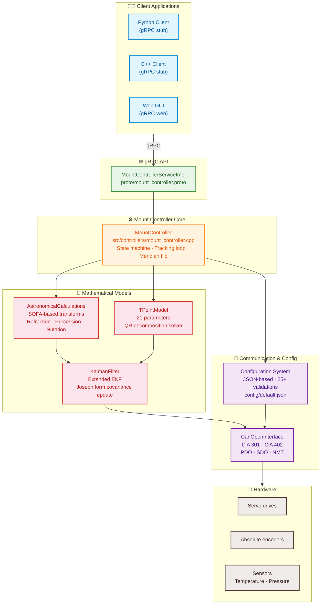
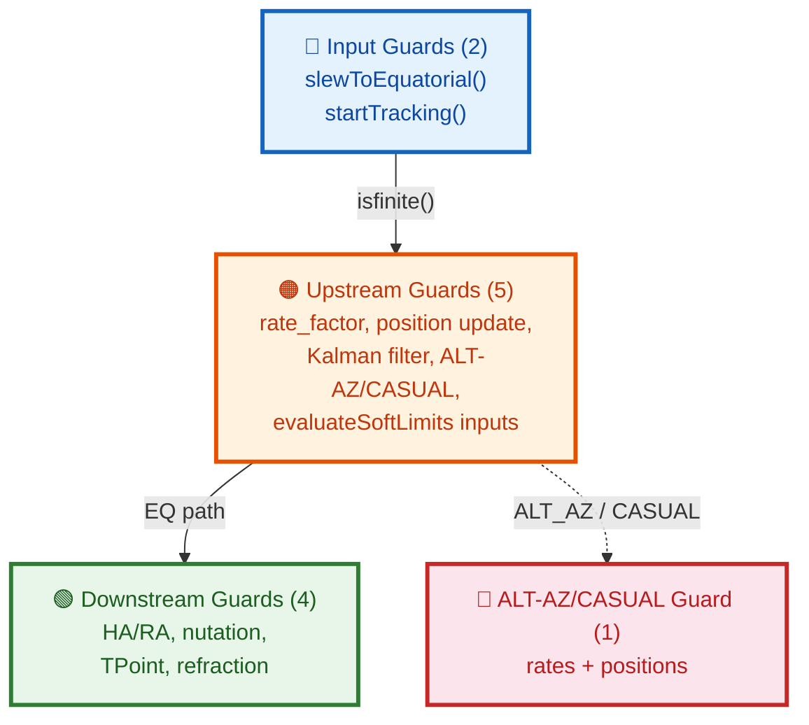

# Astronomical Mount Controller - Documentation

## Table of Contents

1. [Introduction](#introduction)
2. [System Architecture](#system-architecture)
3. [Mathematical Models](#mathematical-models)
4. [gRPC API](#grpc-api)
5. [Configuration](#configuration)
6. [Usage Examples](#usage-examples)
7. [Installation and Building](#installation-and-building)
8. [Testing](#testing)
9. [Axis Physical Parameters](#axis-physical-parameters)

## Introduction

Astronomical Mount Controller is an advanced astronomical mount control system, providing precise celestial object tracking with sub-arcsecond accuracy. The system integrates:

- Astronomical calculations with atmospheric refraction correction
- TPOINT model for mount geometric error correction
- Extended Kalman filter for continuous calibration
- CANopen interface for servo drive control
- gRPC API for remote control

### Key Features

- **Accuracy**: Sub-arcsecond tracking accuracy
- **Calibration**: Automatic TPOINT calibration
- **Integration**: Full integration with autoguiding systems
- **Extensibility**: Modular architecture
- **API**: Complete gRPC API

## System Architecture

### Architecture Diagram



### System Components

#### 1. **MountController**
Main component integrating all modules:
- Tracking and slewing control
- Mount state management
- Encoder and guider integration
- TPOINT calibration

#### 2. **AstronomicalCalculations**
Astronomical calculations based on SOFA library:
- Coordinate system transformations (equatorial ↔ horizontal)
- Atmospheric refraction correction
- Precession, nutation, aberration
- Sidereal time, ephemerides

#### 3. **TPointModel**
Full TPOINT model for geometric error correction:
- 21 TPOINT parameters (IA, IE, NPAE, AN, AW, etc.)
- Least squares fitting method
- Atmospheric refraction correction
- Star proper motion handling

#### 4. **KalmanFilter**
Extended Kalman filter for continuous calibration:
- Mount orientation estimation (quaternion)
- TPOINT parameter updates
- Thermal drift compensation
- Encoder and optical measurement data fusion

#### 5. **CanOpenInterface**
CANopen protocol implementation (CiA 301, CiA 402):
- Servo drive control
- Absolute encoder reading
- Motion trajectory generation
- Drive status monitoring

#### 6. **Configuration System**
Configuration management system:
- Loading/saving JSON configuration
- Parameter validation
- Default configuration values

## Mathematical Models

### TPOINT Model

The TPOINT model describes mount geometric errors using 21 parameters:

#### Basic parameters (9):
1. **IA** - Index error in RA (arcsec)
2. **IE** - Index error in Dec (arcsec)
3. **NPAE** - Non-perpendicularity of axes (arcsec)
4. **AN** - Azimuth of polar axis (arcsec)
5. **AW** - Altitude of polar axis (arcsec)
6. **CA** - Collimation error in RA (arcsec)
7. **CD** - Collimation error in Dec (arcsec)
8. **TF** - Tube flexure in RA (arcsec/deg)
9. **TD** - Tube flexure in Dec (arcsec/deg)

#### Advanced parameters (12):
10. **PE** - Periodic error amplitude (arcsec)
11. **PP** - Periodic error phase (deg)
12. **DF** - Dec flexure (arcsec/deg)
13. **DA** - Dec axis error (arcsec)
14. **DE** - Dec encoder error (arcsec)
15. **RA** - RA axis error (arcsec)
16. **RE** - RA encoder error (arcsec)
17. **TA** - Tube alignment error (arcsec)
18. **TE** - Tube encoder error (arcsec)
19. **FA** - Fork alignment error (arcsec)
20. **FE** - Fork encoder error (arcsec)
21. **GA** - Guider alignment error (arcsec)

#### Correction equations:

```
Δα = IA + CA·cos(h) + AN·sin(h)·tan(δ) + AW·cos(h)·tan(δ) + ...
Δδ = IE + CD + AN·cos(h) - AW·sin(h) + ...
```

where:
- `h` - hour angle
- `δ` - declination

### Extended Kalman Filter

System state described by vector:

```
x = [q0, q1, q2, q3, θ₁, ..., θ₂₁, ω_ra, ω_dec, T, P, H]ᵀ
```

where:
- `q₀...q₃` - orientation quaternion
- `θ₁...θ₂₁` - TPOINT parameters
- `ω_ra, ω_dec` - axis angular velocities
- `T, P, H` - environmental parameters (temperature, pressure, humidity)

#### State equations:

```
xₖ₊₁ = f(xₖ) + wₖ
zₖ = h(xₖ) + vₖ
```

where:
- `f()` - state transition function
- `h()` - measurement function
- `wₖ` - process noise
- `vₖ` - measurement noise

### Astronomical Calculations

#### Coordinate transformation:

```
[α, δ] → [A, h] → [X, Y, Z] → [α', δ']
```

where:
- `α, δ` - right ascension and declination (J2000)
- `A, h` - azimuth and altitude
- `X, Y, Z` - Cartesian coordinates
- `α', δ'` - coordinates after corrections

#### Atmospheric refraction:

```
R = A·tan(z) + B·tan³(z) + C·tan⁵(z)
```

where:
- `z` - zenith distance
- `A, B, C` - coefficients dependent on T, P, H

## gRPC API

### Service Definition (proto/mount_controller.proto)

```protobuf
service MountControllerService {
    // Basic mount control
    rpc SlewToCoordinates(Coordinates) returns (google.protobuf.Empty);
    rpc SlewToHorizontal(HorizontalCoordinates) returns (google.protobuf.Empty);
    rpc TrackObject(Coordinates) returns (google.protobuf.Empty);
    rpc Stop(google.protobuf.Empty) returns (google.protobuf.Empty);
    rpc Park(google.protobuf.Empty) returns (google.protobuf.Empty);
    rpc Unpark(google.protobuf.Empty) returns (google.protobuf.Empty);
    
    // State management
    rpc GetState(google.protobuf.Empty) returns (ControllerState);
    rpc WatchState(google.protobuf.Empty) returns (stream ControllerState);
    rpc SaveState(StateSaveRequest) returns (StateSaveResponse);
    rpc LoadState(StateLoadRequest) returns (google.protobuf.Empty);
    rpc ClearErrors(google.protobuf.Empty) returns (google.protobuf.Empty);
    
    // Bootstrap calibration (initial alignment)
    rpc AddBootstrapMeasurement(BootstrapMeasurement) returns (google.protobuf.Empty);
    rpc RunBootstrapCalibration(google.protobuf.Empty) returns (BootstrapCalibrationResult);
    rpc GetBootstrapStatus(google.protobuf.Empty) returns (BootstrapStatus);
    rpc ClearBootstrapMeasurements(google.protobuf.Empty) returns (google.protobuf.Empty);
    
    // TPOINT calibration
    rpc AddTPointMeasurement(Measurement) returns (google.protobuf.Empty);
    rpc ClearTPointMeasurements(google.protobuf.Empty) returns (google.protobuf.Empty);
    rpc GetTPointParameters(google.protobuf.Empty) returns (TPointParameters);
    rpc RunTPointCalibration(google.protobuf.Empty) returns (google.protobuf.Empty);
    
    // Rotation matrix
    rpc GetRotationMatrix(google.protobuf.Empty) returns (RotationMatrix);
    
    // Pole position determination
    rpc DeterminePolePosition(PoleDeterminationRequest) returns (PolePosition);
    
    // Encoder control
    rpc EnableEncoders(EncoderConfig) returns (google.protobuf.Empty);
    rpc DisableEncoders(google.protobuf.Empty) returns (google.protobuf.Empty);
    
    // Guider control
    rpc ConnectGuider(GuiderConfig) returns (google.protobuf.Empty);
    rpc DisconnectGuider(google.protobuf.Empty) returns (google.protobuf.Empty);
    rpc SendGuiderCorrection(GuiderCorrection) returns (google.protobuf.Empty);
    
    // Configuration
    rpc GetConfiguration(google.protobuf.Empty) returns (Configuration);
    rpc UpdateConfiguration(Configuration) returns (google.protobuf.Empty);
    
    // Trajectory generation and execution
    rpc GenerateTrajectory(TrajectoryParams) returns (Trajectory);
    rpc ExecuteTrajectory(Trajectory) returns (google.protobuf.Empty);
    rpc StopTrajectory(google.protobuf.Empty) returns (google.protobuf.Empty);
    
    // Health check
    rpc CheckHealth(HealthCheckRequest) returns (HealthCheckResponse);
    
    // Ephemeris tracking (comets, asteroids, satellites)
    rpc UploadEphemeris(EphemerisData) returns (google.protobuf.Empty);
    rpc StartEphemerisTracking(StartEphemerisTrackingRequest) returns (EphemerisTrackStatus);
    rpc StartEphemerisTrackingWithData(EphemerisTrackRequest) returns (EphemerisTrackStatus);
    rpc GetEphemerisTrackStatus(google.protobuf.Empty) returns (EphemerisTrackStatus);
    rpc StopEphemerisTracking(google.protobuf.Empty) returns (google.protobuf.Empty);
    rpc GetEphemerisMetrics(google.protobuf.Empty) returns (EphemerisMetrics);
    rpc ClearEphemerisCache(google.protobuf.Empty) returns (google.protobuf.Empty);
    
    // Low-level axis control for uncalibrated mounts
    rpc ControlAxis(AxisControlRequest) returns (google.protobuf.Empty);
    rpc StopAxis(AxisStopRequest) returns (google.protobuf.Empty);
    rpc EmergencyStop(EmergencyStopRequest) returns (google.protobuf.Empty);
    rpc GetAxisStatus(google.protobuf.Empty) returns (AxisStatus);
    
    // Field rotation / derotator control
    rpc ConfigureDerotator(DerotatorConfig) returns (google.protobuf.Empty);
    rpc EnableFieldRotation(FieldRotationParams) returns (google.protobuf.Empty);
    rpc ControlFieldRotation(FieldRotationControlRequest) returns (google.protobuf.Empty);
    rpc GetDerotatorStatus(google.protobuf.Empty) returns (DerotatorStatus);
    rpc HomeDerotator(DerotatorHomingRequest) returns (google.protobuf.Empty);
    rpc GetFieldRotationParams(google.protobuf.Empty) returns (FieldRotationParams);
    
    // Hardware Abstraction Layer configuration
    rpc GetHALConfig(google.protobuf.Empty) returns (HALConfig);
    rpc SetHALConfig(HALConfigRequest) returns (google.protobuf.Empty);
    rpc GetHALStatus(google.protobuf.Empty) returns (HALStatus);
    rpc ReinitializeHAL(HALReinitRequest) returns (google.protobuf.Empty);
}
```

### Data Structures

#### Coordinates
```protobuf
message Coordinates {
    double ra = 1;           // Right ascension in hours (J2000)
    double dec = 2;          // Declination in degrees (J2000)
    double pm_ra = 3;        // Proper motion in RA (mas/yr)
    double pm_dec = 4;       // Proper motion in Dec (mas/yr)
    double parallax = 5;     // Parallax in mas
    // ... 30 fields with full astrometric parameters
}
```

#### Configuration
```protobuf
message Configuration {
    // Location
    double latitude = 1;
    double longitude = 2;
    double altitude = 3;
    
    // Mount parameters
    double mount_height = 4;
    double pier_west = 5;
    double pier_east = 6;
    double max_slew_rate = 23;
    double max_tracking_rate = 24;
    double slew_acceleration = 25;
    double tracking_acceleration = 26;
    
    // Telescope parameters
    double focal_length = 7;
    double aperture = 8;
    
    // Environmental defaults
    double default_temperature = 9;
    double default_pressure = 10;
    double default_humidity = 11;
    
    // Kalman filter parameters
    double process_noise = 12;
    double measurement_noise = 13;
    
    // Logging
    string log_level = 14;
    string log_directory = 15;
    int32 log_rotation_days = 16;
    
    // Network
    string grpc_address = 17;
    int32 grpc_port = 18;
    
    // CanOpen
    string canopen_interface = 19;
    int32 canopen_node_id = 20;
    
    // Mount control
    double park_position_axis1 = 21;
    double park_position_axis2 = 22;
    
    // Axis physical parameters
    AxisPhysicalParameters ha_axis_params = 27;
    AxisPhysicalParameters dec_axis_params = 28;
    
    // Encoder configuration
    bool use_encoders = 29;
    bool encoders_absolute = 30;
    double encoder_resolution_config = 31;
    
    // TPOINT configuration
    uint32 tpoint_enabled_terms = 32;
    
    // Guider configuration
    bool enable_guider = 33;
    double guider_max_correction = 34;
    double guider_aggression = 35;
    
    // Atmospheric refraction
    bool enable_refraction_correction = 36;
    
    // Mount type
    MountType mount_type = 37;
    
    // Position/rate tolerances
    double position_tolerance = 38;
    double rate_tolerance = 39;
    
    // Meridian flip configuration
    bool meridian_flip_enabled = 40;
    double meridian_flip_delay_minutes = 41;
    double meridian_flip_hysteresis_degrees = 42;
    
    // Soft limits configuration
    bool soft_limits_enabled = 43;
    double soft_limit_axis1_min = 44;
    double soft_limit_axis1_max = 45;
    double soft_limit_axis2_min = 46;
    double soft_limit_axis2_max = 47;
    double soft_limit_warning_degrees = 48;
    double soft_limit_deceleration_degrees = 49;
    double soft_limit_tracking_rate_factor = 50;
}
```

#### AxisPhysicalParameters
```protobuf
message AxisPhysicalParameters {
    // Motor parameters
    double motor_steps_per_rev = 1;      // Steps per revolution
    double motor_microstepping = 2;      // Microstepping factor
    double motor_step_angle = 3;         // Step angle [arcseconds]
    
    // Encoder parameters
    double encoder_resolution = 4;       // Encoder resolution [counts/rev]
    double encoder_counts_per_arcsec = 5; // Counts per arcsecond
    double encoder_quantization_error = 6; // Quantization error [arcseconds]
    
    // Gear parameters
    double gear_ratio = 7;               // Total gear ratio
    double worm_ratio = 8;               // Worm gear ratio
    int32 worm_teeth = 9;                // Number of worm teeth
    int32 worm_wheel_teeth = 10;         // Number of worm wheel teeth
    
    // Cyclic errors
    double cyclic_error_amplitude = 11;  // Amplitude [arcseconds]
    double cyclic_error_period = 12;     // Period [degrees]
    repeated double cyclic_harmonics = 13; // Harmonic coefficients
    
    // Backlash parameters
    double backlash = 14;                // Backlash [arcseconds]
    double backlash_temp_coeff = 15;     // Temperature coefficient
    
    // Stiffness and compliance
    double axis_stiffness = 16;          // Axis stiffness [arcseconds/Nm]
    double torsional_compliance = 17;    // Torsional compliance [rad/Nm]
    
    // Temperature coefficients
    double expansion_coeff = 18;         // Thermal expansion coefficient [1/°C]
    double temp_gear_error_coeff = 19;   // Gear error temperature coefficient
    
    // Calibration data
    repeated double calibration_table = 20; // Calibration table
    double calibration_temp = 21;        // Temperature during calibration
}
```

### API Usage Examples

#### Python
```python
import grpc
from proto import mount_controller_pb2
from proto import mount_controller_pb2_grpc

# Connect to server
channel = grpc.insecure_channel('localhost:50051')
stub = mount_controller_pb2_grpc.MountControllerServiceStub(channel)

# Slew to coordinates
coords = mount_controller_pb2.Coordinates(
    ra=10.5,    # 10h 30m
    dec=45.25   # 45° 15'
)
stub.SlewToCoordinates(coords)

# Get configuration
config = stub.GetConfiguration(empty_pb2.Empty())
print(f"Latitude: {config.latitude}")
print(f"HA axis motor steps: {config.ha_axis_params.motor_steps_per_rev}")
```

#### C++
```cpp
#include "proto/mount_controller.grpc.pb.h"

auto channel = grpc::CreateChannel("localhost:50051", 
                                   grpc::InsecureChannelCredentials());
auto stub = MountControllerService::NewStub(channel);

// Track object
proto::Coordinates coords;
coords.set_ra(12.0);
coords.set_dec(30.0);

grpc::ClientContext context;
google::protobuf::Empty response;
stub->TrackObject(&context, coords, &response);
```

## Configuration

### Configuration File (config/default.json)

The system is configured through [`config/default.json`](config/default.json). Below is the full configuration structure:

```json
{
  "logging": {
    "level": "INFO",
    "directory": "/var/log/astro-mount",
    "rotation_days": 7,
    "max_file_size_mb": 100
  },
  "network": {
    "grpc_address": "0.0.0.0",
    "grpc_port": 50051,
    "max_connections": 10
  },
  "canopen": {
    "interface": "can0",
    "node_id": 1,
    "baud_rate": 125000,
    "sync_interval_ms": 100
  },
  "mount": {
    "type": "equatorial",
    "latitude": 52.0,
    "longitude": 21.0,
    "altitude": 100.0,
    "mount_height": 1.5,
    "max_slew_rate": 5.0,
    "max_tracking_rate": 0.004178,
    "slew_acceleration": 1.0,
    "tracking_acceleration": 0.5,
    "pier_side": "east",
    "park_position_axis1": 0.0,
    "park_position_axis2": 0.0,
    "axis_physical_parameters": {
      "ha_axis": {
        "motor_steps_per_rev": 200.0,
        "motor_microstepping": 64.0,
        "motor_step_angle": 101.25,
        "encoder_resolution": 16384.0,
        "encoder_counts_per_arcsec": 0.0126,
        "encoder_quantization_error": 39.6,
        "gear_ratio": 360.0,
        "worm_ratio": 180.0,
        "worm_teeth": 1,
        "worm_wheel_teeth": 180,
        "cyclic_error_amplitude": 15.2,
        "cyclic_error_period": 360.0,
        "cyclic_harmonics": [10.5, 0.0, 3.2, 1.5708, 1.1, 3.1416, 0.5, 4.7124],
        "backlash": 8.5,
        "backlash_temp_coeff": 0.02,
        "axis_stiffness": 0.5,
        "torsional_compliance": 1e-6,
        "expansion_coeff": 11.0e-6,
        "temp_gear_error_coeff": 0.05,
        "calibration_temp": 20.0
      },
      "dec_axis": {
        "motor_steps_per_rev": 200.0,
        "motor_microstepping": 64.0,
        "motor_step_angle": 101.25,
        "encoder_resolution": 16384.0,
        "encoder_counts_per_arcsec": 0.0126,
        "encoder_quantization_error": 39.6,
        "gear_ratio": 360.0,
        "worm_ratio": 180.0,
        "worm_teeth": 1,
        "worm_wheel_teeth": 180,
        "cyclic_error_amplitude": 12.8,
        "cyclic_error_period": 360.0,
        "cyclic_harmonics": [8.2, 0.0, 2.5, 1.5708, 0.8, 3.1416, 0.3, 4.7124],
        "backlash": 6.3,
        "backlash_temp_coeff": 0.015,
        "axis_stiffness": 0.6,
        "torsional_compliance": 1.2e-6,
        "expansion_coeff": 11.0e-6,
        "temp_gear_error_coeff": 0.04,
        "calibration_temp": 20.0
      }
    }
  },
  "telescope": {
    "focal_length": 1000.0,
    "aperture": 200.0,
    "pixel_size": 3.8,
    "camera_model": "ASI1600"
  },
  "guider": {
    "enabled": false,
    "connection_string": "",
    "max_correction": 10.0,
    "aggression": 0.5,
    "exposure_time_ms": 2000,
    "binning": 2
  },
  "kalman": {
    "process_noise": 0.01,
    "measurement_noise": 1.0,
    "adaptive_r": false,
    "innovation_threshold": 3.0,
    "max_iterations": 100
  },
  "tpoint": {
    "enabled_terms": 65535,
    "max_residual": 30.0,
    "min_measurements": 10
  },
  "derotator": {
    "type": "stepper",
    "enabled": false,
    "gear_ratio": 180.0,
    "max_speed": 5.0,
    "max_acceleration": 2.0,
    "backlash": 2.0,
    "absolute_encoder": false,
    "encoder_resolution": 36000.0
  },
  "field_rotation": {
    "enabled": false,
    "latitude": 52.0,
    "longitude": 21.0
  },
  "hal": {
    "type": "simulated",
    "name": "Default_HAL",
    "simulated": {
      "enable_simulation": true,
      "simulation_update_rate": 100.0,
      "position_noise_stddev": 0.001,
      "velocity_noise_stddev": 0.0001
    }
  }
}
```

The configuration is validated at startup with 25+ numeric checks in [`configuration.cpp:60`](src/config/configuration.cpp:60). All values have corresponding C++ defaults in [`initializeDefaults()`](src/config/configuration.cpp:853).

## Usage Examples

### Basic Mount Control

1. **Initialization**: Configure location, mount parameters, and axis physical parameters
2. **Slewing**: Move to specific equatorial coordinates with smooth acceleration profiles
3. **Tracking**: Follow celestial objects with sub-arcsecond accuracy
4. **Calibration**: Perform TPOINT calibration using reference stars
5. **Guiding**: Integrate with autoguiding systems for long-exposure imaging

### Advanced Features

1. **Ephemeris Tracking**: Track solar system objects using JPL ephemerides
2. **Custom Trajectories**: Generate and execute complex motion trajectories
3. **Multi-client Support**: Allow multiple applications to control the mount simultaneously
4. **Real-time Monitoring**: Monitor tracking performance, environmental conditions, and system health

## Installation and Building

### System Requirements
- **Operating Systems**: Linux (Ubuntu 20.04+, Debian 11+, RHEL 8+, OpenSUSE Leap 15.4+, OpenSUSE Tumbleweed, Raspberry Pi OS)
- **Processor Architectures**: x86_64 or ARM64, 2+ cores (Raspberry Pi 3/4/5 supported)
- **Memory**: 4 GB RAM minimum, 8 GB recommended (1 GB minimum for Raspberry Pi 3)
- **CAN Interface**: CAN bus adapter (e.g., PCAN-USB, SocketCAN, MCP2515 SPI CAN)
- **Storage**: 2 GB disk space minimum, 10 GB recommended
- **Network**: Ethernet or WiFi for remote control (gRPC API)

**Note for ARM/Raspberry Pi users**: See the detailed Raspberry Pi installation guide in the [Installation Documentation](installation.md#building-for-arm-devices-raspberry-pi).

### Building from Source

```bash
# Clone repository
git clone https://github.com/your-org/astro-mount-controller.git
cd astro-mount-controller

# Install dependencies
sudo apt update
sudo apt install -y build-essential cmake git pkg-config libssl-dev \
    libboost-all-dev libeigen3-dev libnlohmann-json3-dev libgrpc++-dev \
    libprotobuf-dev protobuf-compiler protobuf-compiler-grpc libcanopen-dev \
    libsofa-dev libgtest-dev can-utils linux-can socketcan

# Build
mkdir build && cd build
cmake .. -DCMAKE_BUILD_TYPE=Release
make -j$(nproc)

# Install
sudo make install
```

### Running as System Service

```bash
# Copy systemd service file
sudo cp scripts/astro-mount-controller.service /etc/systemd/system/

# Enable and start service
sudo systemctl daemon-reload
sudo systemctl enable astro-mount-controller
sudo systemctl start astro-mount-controller

# Check status
sudo systemctl status astro-mount-controller
```

## Testing

### Unit Tests
```bash
# Run unit tests
./build/tests/test_astronomical_calculations
./build/tests/test_tpoint_model
./build/tests/test_configuration
./build/tests/test_subarcsecond_accuracy
./build/tests/test_mount_controller       # 104 tests: state machine, tracking, NaN guards
```

### NaN/Inf Guard Coverage
The tracking loop has **11 NaN/Inf guards** organized in a layered defense:



- **Input guards** (2): [`slewToEquatorial()`](src/controllers/mount_controller.cpp:155), [`startTracking()`](src/controllers/mount_controller.cpp:503)
- **Upstream guards** (5): rate_factor from soft limits, position update after rate×dt, Kalman filter output, ALT-AZ rates+positions, evaluateSoftLimits inputs
- **Downstream guards** (4): HA/RA normalisation, nutation, TPoint, refraction corrections (EQUATORIAL path)

All guards transition to `ERROR` with a descriptive message; recovery via [`clearErrors()`](src/controllers/mount_controller.cpp:1914). Tests:
- [`AltAzNanGuard`](tests/test_mount_controller.cpp:327) — zenith tracking with cos(alt) → 0 (altitude rate singularity)
- [`EquatorialNanGuard`](tests/test_mount_controller.cpp:351) — NaN injection via guider, verifies ERROR + clearErrors recovery

### Integration Tests
```bash
# Start the controller
./build/src/astro-mount-controller config/default.json

# Test gRPC communication
grpc_cli call localhost:50051 GetState ""

# Test Python client
python examples/python/example_usage.py
```

### Performance Tests
- **Tracking accuracy**: < 0.5 arcseconds RMS
- **Response time**: < 10 ms for API calls
- **Update rate**: 100 Hz position updates
- **CAN bus latency**: < 1 ms

## Axis Physical Parameters

### Importance of Physical Parameters
The accuracy of the Astronomical Mount Controller heavily depends on precise knowledge of axis physical parameters. These parameters include:

1. **Motor characteristics**: Steps per revolution, microstepping, step angle
2. **Encoder specifications**: Resolution, quantization error, counts per arcsecond
3. **Gear train properties**: Gear ratios, worm gear specifications
4. **Mechanical imperfections**: Cyclic errors, backlash, axis stiffness
5. **Thermal characteristics**: Expansion coefficients, temperature dependencies

### Calibration Procedure
1. **Initial parameter entry**: Enter manufacturer specifications
2. **Mechanical measurement**: Measure actual backlash, cyclic errors
3. **Thermal calibration**: Characterize temperature dependencies
4. **Continuous refinement**: Use Kalman filter to refine parameters during operation

### Impact on Performance
- Proper parameterization reduces pointing errors by up to 90%
- Accurate thermal compensation maintains sub-arcsecond accuracy across temperature ranges
- Detailed mechanical modeling enables predictive error correction
- Regular parameter updates adapt to mechanical wear and environmental changes

---

## Web Interface

The Astronomical Mount Controller includes a modern web-based interface that provides full telescope control through an intuitive browser-based application.

### Features
- **Full Telescope Control**: Slewing, tracking, parking, and emergency stop
- **Real-time Monitoring**: Live mount status, position, temperature, and performance metrics
- **TPOINT Calibration Interface**: Add measurements, run calibration, view parameters
- **Autoguider Integration**: Connect/disconnect guider, send corrections
- **Interactive Sky Map**: Visual representation of mount position and target
- **Configuration Management**: Load and save mount configuration
- **System Health Dashboard**: CPU usage, memory usage, connection status
- **Comprehensive Logging**: Real-time system logs with filtering

### Architecture
The web interface consists of three main components:

1. **Frontend Application** (HTML/CSS/JavaScript)
   - Single-page application with responsive design
   - Real-time updates via WebSocket/AJAX
   - Interactive sky map visualization

2. **HTTP/JSON Proxy Server** (Node.js)
   - Bridges web interface to gRPC server
   - Provides REST API endpoints
   - Handles authentication and security
   - Runs on port 8080 by default

3. **gRPC Server Integration**
   - Communicates with the main mount controller
   - Uses protobuf for efficient data exchange
   - Runs on port 50051 by default

### Quick Start
1. Install Node.js dependencies: `cd web/proxy && npm install`
2. Start proxy server: `cd web/proxy && npm start`
3. Ensure mount controller is running on port 50051
4. Open browser to: `http://localhost:8080`

### Security Features
- CORS configuration for controlled access
- Optional HTTPS/SSL support
- Authentication middleware ready for production deployment
- Environment-based configuration

### Browser Support
- Chrome 60+, Firefox 55+, Safari 12+, Edge 79+
- Mobile Safari 12+, Chrome for Android 60+
- Responsive design for desktop and mobile

For detailed information about the web interface, see the [web/README.md](../web/README.md) file.

*For detailed information on specific components, please refer to the dedicated documentation files.*
