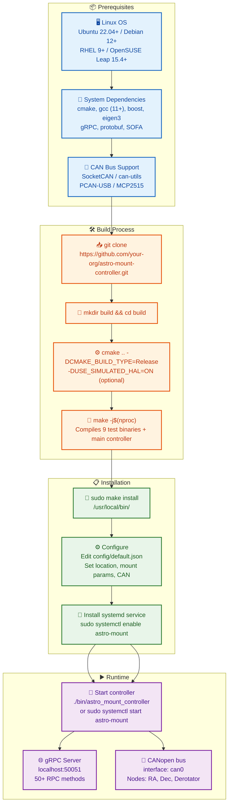

# Installation and Configuration

## Build and Deployment Flow



## System Requirements

### Minimum Requirements

- **Operating System**: Linux (Ubuntu 20.04+, Debian 11+, RHEL 8+, OpenSUSE Leap 15.4+, OpenSUSE Tumbleweed)
- **Processor**: x86_64 or ARM64, 2+ cores
- **Memory**: 4 GB RAM
- **Disk Space**: 2 GB
- **CAN Interface**: CAN bus adapter (e.g., PCAN-USB, SocketCAN)

### Recommended Requirements

- **Processor**: 4+ cores, 2.5+ GHz
- **Memory**: 8 GB RAM
- **Disk Space**: 10 GB (for logs and calibration data)
- **CAN Interface**: Isolated CAN adapter with high throughput

## Dependency Installation

### Ubuntu/Debian

```bash
# System update
sudo apt update
sudo apt upgrade -y

# System dependencies
sudo apt install -y \
    build-essential \
    cmake \
    git \
    pkg-config \
    libssl-dev \
    libboost-all-dev \
    libeigen3-dev \
    libnlohmann-json3-dev \
    libgrpc++-dev \
    libprotobuf-dev \
    protobuf-compiler \
    protobuf-compiler-grpc \
    libcanopen-dev \
    libsofa-dev \
    libgtest-dev \
    libindi-dev

# CAN tools
sudo apt install -y \
    can-utils \
    linux-can \
    socketcan
```

### RHEL/CentOS

```bash
# EPEL repository
sudo yum install -y epel-release

# System dependencies
sudo yum install -y \
    gcc-c++ \
    cmake \
    git \
    pkgconfig \
    openssl-devel \
    boost-devel \
    eigen3-devel \
    json-devel \
    grpc-devel \
    protobuf-devel \
    protobuf-compiler \
    sofa-devel \
    gtest-devel \
    libindi-devel

# CAN tools
sudo yum install -y \
    can-utils \
    kernel-modules-extra
```

### OpenSUSE

OpenSUSE Leap and Tumbleweed are supported. The following commands install all required dependencies:

```bash
# Update system
sudo zypper refresh

# Install system dependencies
sudo zypper install -y \
    gcc-c++ \
    cmake \
    git \
    pkg-config \
    libopenssl-devel \
    boost-devel \
    eigen3-devel \
    nlohmann-json-devel \
    grpc-devel \
    grpc-cli \
    protobuf-devel \
    protobuf-compiler \
    libsofa-devel \
    gtest-devel \
    patterns-devel-base-devel_basis \
    libindi-devel

# Install CAN tools (for OpenSUSE Leap 15.4+ and Tumbleweed)
sudo zypper install -y \
    can-utils \
    kernel-source \
    kernel-devel

# For older OpenSUSE versions, you may need to install from source:
# git clone https://github.com/linux-can/can-utils
# cd can-utils
# make && sudo make install
```

#### OpenSUSE-Specific Configuration

1. **CAN Interface Configuration**:
   ```bash
   # Load CAN modules
   sudo modprobe can
   sudo modprobe can_raw
   sudo modprobe can_dev
   
   # For persistent module loading, add to /etc/modules-load.d/can.conf:
   # can
   # can_raw
   # can_dev
   ```

2. **Service Configuration**:
   OpenSUSE uses systemd like other distributions, but the service file may need adjustment:
   ```ini
   [Unit]
   Description=Astronomical Mount Controller
   After=network.target
   Requires=network.target
   Wants=canbus.target
   
   [Service]
   Type=simple
   User=astro
   Group=astro
   WorkingDirectory=/opt/astro-mount
   ExecStart=/usr/local/bin/astro-mount-controller /etc/astro-mount/config.json
   Restart=always
   RestartSec=10
   StandardOutput=journal
   StandardError=journal
   Environment="LD_LIBRARY_PATH=/usr/local/lib"
   
   [Install]
   WantedBy=multi-user.target
   ```

3. **Firewall Configuration**:
   ```bash
   # Open gRPC port (50051)
   sudo firewall-cmd --zone=public --add-port=50051/tcp --permanent
   sudo firewall-cmd --reload
   ```

4. **User and Group Setup**:
   ```bash
   # Create astro user and group
   sudo groupadd astro
   sudo useradd -r -g astro -s /bin/false astro
   
   # Add user to dialout group for serial device access
   sudo usermod -a -G dialout astro
   
   # Add user to can group for CAN bus access
   sudo groupadd can
   sudo usermod -a -G can astro
   ```

5. **CAN Bus Permissions**:
   ```bash
   # Create udev rule for CAN devices
   echo 'KERNEL=="can*", GROUP="can", MODE="0660"' | sudo tee /etc/udev/rules.d/85-can.rules
   
   # Reload udev rules
   sudo udevadm control --reload-rules
   sudo udevadm trigger
   ```

#### Known Issues and Workarounds

1. **Boost Library Version**: OpenSUSE may have different Boost library versions. Ensure compatibility by checking:
   ```bash
   rpm -q libboost_system1_81_0  # or similar version
   ```

2. **gRPC Compilation**: If you encounter gRPC compilation issues, try building from source:
   ```bash
   git clone --recurse-submodules -b v1.59.0 https://github.com/grpc/grpc
   cd grpc
   mkdir -p cmake/build
   cd cmake/build
   cmake -DgRPC_INSTALL=ON \
         -DgRPC_BUILD_TESTS=OFF \
         -DCMAKE_INSTALL_PREFIX=/usr/local \
         ../..
   make -j$(nproc)
   sudo make install
   ```

3. **CAN Bus Support**: Some OpenSUSE kernels may not include CAN support by default. Check with:
   ```bash
   lsmod | grep can
   ```
   If modules are missing, you may need to install kernel sources and compile modules:
   ```bash
   sudo zypper install -y kernel-source kernel-devel
   ```

#### Performance Optimization for OpenSUSE

```bash
# Set CPU governor to performance
sudo zypper install -y cpupower
sudo cpupower frequency-set -g performance

# Increase socket buffer sizes for CAN
echo "net.core.rmem_max = 134217728" | sudo tee -a /etc/sysctl.conf
echo "net.core.wmem_max = 134217728" | sudo tee -a /etc/sysctl.conf
echo "net.core.rmem_default = 1048576" | sudo tee -a /etc/sysctl.conf
echo "net.core.wmem_default = 1048576" | sudo tee -a /etc/sysctl.conf
sudo sysctl -p
```

### Building for ARM Devices (Raspberry Pi)

Astronomical Mount Controller is fully compatible with ARM64 architectures including Raspberry Pi 3/4/5, Rockchip-based boards, and other ARM single-board computers.

#### Raspberry Pi Setup

```bash
# Update system
sudo apt update
sudo apt upgrade -y

# Install ARM-specific dependencies
sudo apt install -y \
    build-essential \
    cmake \
    git \
    pkg-config \
    libssl-dev \
    libboost-all-dev \
    libeigen3-dev \
    libnlohmann-json3-dev \
    libgrpc++-dev \
    libprotobuf-dev \
    protobuf-compiler \
    protobuf-compiler-grpc \
    libcanopen-dev \
    libsofa-dev \
    libgtest-dev \
    libindi-dev

# Install CAN tools for Raspberry Pi
sudo apt install -y \
    can-utils \
    linux-can \
    socketcan

# For SPI-based CAN interfaces (common on Raspberry Pi)
sudo apt install -y \
    python3-spidev \
    python3-smbus
```

#### Cross-Compilation for ARM (Optional)

For faster compilation, you can cross-compile from an x86_64 system:

```bash
# Install cross-compilation tools (on Ubuntu/Debian host)
sudo apt install -y \
    gcc-aarch64-linux-gnu \
    g++-aarch64-linux-gnu \
    binutils-aarch64-linux-gnu

# Configure CMake for cross-compilation
mkdir -p build-arm
cd build-arm
cmake .. \
    -DCMAKE_SYSTEM_NAME=Linux \
    -DCMAKE_SYSTEM_PROCESSOR=aarch64 \
    -DCMAKE_C_COMPILER=aarch64-linux-gnu-gcc \
    -DCMAKE_CXX_COMPILER=aarch64-linux-gnu-g++ \
    -DCMAKE_BUILD_TYPE=Release \
    -DBUILD_TESTS=ON \
    -DBUILD_EXAMPLES=ON

# Build
make -j$(nproc)
```

#### Raspberry Pi-Specific Configuration

1. **GPIO Configuration for CAN** (using MCP2515/MCP25625):

```bash
# Enable SPI interface
sudo raspi-config nonint do_spi 0

# Add device tree overlay for CAN
echo "dtoverlay=mcp2515-can0,oscillator=16000000,interrupt=25" | sudo tee -a /boot/config.txt
echo "dtoverlay=spi0-2cs" | sudo tee -a /boot/config.txt

# Reboot
sudo reboot
```

2. **CAN Interface Setup**:

```bash
# After reboot, configure CAN interface
sudo ip link set can0 type can bitrate 1000000
sudo ip link set up can0

# Check status
ip -details link show can0
```

3. **Performance Optimization for Raspberry Pi**:

```bash
# Install performance tools
sudo apt install -y cpufrequtils

# Set CPU governor to performance
sudo cpufreq-set -g performance

# Increase swap size for compilation (if needed)
sudo dphys-swapfile swapoff
sudo sed -i 's/CONF_SWAPSIZE=100/CONF_SWAPSIZE=2048/' /etc/dphys-swapfile
sudo dphys-swapfile setup
sudo dphys-swapfile swapon

# Enable ZRAM for better memory management
sudo apt install -y zram-tools
sudo systemctl enable zram-config
sudo systemctl start zram-config

# Optimize kernel parameters
echo "vm.swappiness=10" | sudo tee -a /etc/sysctl.conf
echo "vm.vfs_cache_pressure=50" | sudo tee -a /etc/sysctl.conf
sudo sysctl -p
```

#### Known Issues and Solutions for ARM

1. **Boost Library Issues**:
   - Some Boost libraries may need to be built from source on older ARM distributions
   - Solution: Use system package manager or compile with reduced features:
   ```bash
   sudo apt install -y libboost1.74-all-dev
   ```

2. **gRPC Compilation Problems**:
   - ARM may have issues with certain gRPC optimizations
   - Solution: Build gRPC with reduced optimizations:
   ```bash
   git clone --recurse-submodules -b v1.59.0 https://github.com/grpc/grpc
   cd grpc
   mkdir -p cmake/build
   cd cmake/build
   cmake -DgRPC_INSTALL=ON \
         -DgRPC_BUILD_TESTS=OFF \
         -DCMAKE_CXX_FLAGS="-O2 -mcpu=cortex-a72 -mtune=cortex-a72" \
         -DCMAKE_INSTALL_PREFIX=/usr/local \
         ../..
   make -j$(nproc)
   sudo make install
   ```

3. **Memory Limitations**:
   - Raspberry Pi may have limited RAM for compilation
   - Solution: Use swap or reduce parallel compilation jobs:
   ```bash
   # Use 2 cores instead of all to avoid OOM
   make -j2
   ```

4. **Thermal Throttling**:
   - Ensure proper cooling for sustained performance
   - Monitor temperature:
   ```bash
   vcgencmd measure_temp
   vcgencmd measure_clock arm
   vcgencmd get_throttled
   ```

#### Recommended Raspberry Pi Models

1. **Raspberry Pi 5** (Recommended):
   - 4-8 GB RAM
   - 2.4 GHz quad-core ARM Cortex-A76
   - PCIe 2.0 interface for fast CAN adapters
   - Active cooling recommended

2. **Raspberry Pi 4**:
   - 4-8 GB RAM
   - 1.5-1.8 GHz quad-core ARM Cortex-A72
   - USB 3.0 for external CAN adapters
   - Active cooling recommended

3. **Raspberry Pi 3B+** (Minimum):
   - 1 GB RAM
   - 1.4 GHz quad-core ARM Cortex-A53
   - May require performance optimization
   - Limited to simpler setups

#### Benchmark Results

Typical performance on Raspberry Pi 4 (4GB):

- **Compilation time**: 15-20 minutes (native), 5-8 minutes (cross-compiled)
- **Memory usage**: 150-250 MB during normal operation
- **CPU usage**: 10-30% during tracking
- **Response time**: < 15 ms for API calls
- **Update rate**: 50-100 Hz position updates

## Building from Source

### Source Code Download

```bash
git clone https://github.com/your-org/astro-mount-controller.git
cd astro-mount-controller
```

### CMake Configuration

```bash
# Create build directory
mkdir -p build
cd build

# Configuration with default options
cmake .. -DCMAKE_BUILD_TYPE=Release

# Or with additional options
cmake .. \
    -DCMAKE_BUILD_TYPE=Release \
    -DBUILD_TESTS=ON \
    -DBUILD_EXAMPLES=ON \
    -DUSE_SYSTEM_CANOPEN=ON \
    -DUSE_SYSTEM_SOFA=ON
```

### Compilation

```bash
# Compile all components
make -j$(nproc)

# Or only the main program
make astro-mount-controller

# Compile tests
make tests

# Compile examples
make examples
```

### System Installation

```bash
# Install to /usr/local
sudo make install

# Or to user directory
make install DESTDIR=$HOME/astro-mount
```

## Building External Libraries from Source

When system packages are unavailable (e.g., older openSUSE, minimal distributions, or custom environments), all external dependencies can be built from source. This section covers each dependency in dependency order.

> **Tip**: After building each library, set `CMAKE_PREFIX_PATH` so the project's CMake can find them (see §7 below).

---

### 1. gRPC + Protobuf (Core Communication Layer)

gRPC and protobuf are the most complex dependencies. Build them first since all other libraries are independent.

```bash
# ── Install system build tools (openSUSE) ──
sudo zypper install -y gcc-c++ gcc make cmake git pkg-config \
    libopenssl-devel zlib-devel libcurl-devel

# ── Install system build tools (Ubuntu/Debian) ──
# sudo apt install -y build-essential cmake git pkg-config libssl-dev zlib1g-dev

# ── Build protobuf (required by gRPC) ──
git clone --recurse-submodules -b v21.12 https://github.com/protocolbuffers/protobuf.git
cd protobuf
mkdir -p build && cd build
cmake .. \
    -DCMAKE_BUILD_TYPE=Release \
    -DCMAKE_INSTALL_PREFIX=/usr/local \
    -Dprotobuf_BUILD_TESTS=OFF \
    -Dprotobuf_BUILD_SHARED_LIBS=ON \
    -Dprotobuf_MSVC_STATIC_RUNTIME=OFF
make -j$(nproc)
sudo make install
sudo ldconfig
cd ../..

# ── Build gRPC ──
git clone --recurse-submodules -b v1.59.0 https://github.com/grpc/grpc.git
cd grpc
mkdir -p cmake/build && cd cmake/build
cmake ../.. \
    -DCMAKE_BUILD_TYPE=Release \
    -DCMAKE_INSTALL_PREFIX=/usr/local \
    -DgRPC_INSTALL=ON \
    -DgRPC_BUILD_TESTS=OFF \
    -DgRPC_BUILD_CSHARP_EXT=OFF \
    -DgRPC_BUILD_GRPC_PYTHON_EXT=OFF \
    -DgRPC_USE_PROTO_LIBRARY=ON \
    -DgRPC_PROTOBUF_PROVIDER=package \
    -DgRPC_SSL_PROVIDER=package \
    -DgRPC_ZLIB_PROVIDER=package \
    -DgRPC_CARES_PROVIDER=package \
    -DgRPC_ABSL_PROVIDER=package \
    -DgRPC_RE2_PROVIDER=package
make -j$(nproc)
sudo make install
sudo ldconfig
cd ../../..
```

**openSUSE note**: If `absl` or `re2` are not available as packages, use `module` provider instead:
```bash
cmake ../.. \
    -DCMAKE_BUILD_TYPE=Release \
    -DCMAKE_INSTALL_PREFIX=/usr/local \
    -DgRPC_INSTALL=ON \
    -DgRPC_BUILD_TESTS=OFF \
    -DgRPC_ABSL_PROVIDER=module \
    -DgRPC_RE2_PROVIDER=module \
    -DgRPC_SSL_PROVIDER=package \
    -DgRPC_ZLIB_PROVIDER=package \
    -DgRPC_CARES_PROVIDER=module \
    -DgRPC_PROTOBUF_PROVIDER=package
```

**Expected result** (after `sudo ldconfig`):
```bash
ldconfig -p | grep grpc
# libgrpc++.so.1.59 (libc6)  =>  /usr/local/lib/libgrpc++.so.1.59
# libgrpc.so.35.0.0 (libc6)  =>  /usr/local/lib/libgrpc.so.35.0.0
ldconfig -p | grep protobuf
# libprotobuf.so.3.21.12 (libc6)  =>  /usr/local/lib/libprotobuf.so.3.21.12
```

---

### 2. nlohmann/json (Header-Only JSON Library)

Header-only — no compilation needed, just copy headers:

```bash
# Option A — Install via package manager (openSUSE)
sudo zypper install -y nlohmann-json-devel

# Option B — Install via package manager (Ubuntu/Debian)
# sudo apt install -y libnlohmann-json3-dev

# Option C — Manual install (any distro)
git clone -b v3.11.3 https://github.com/nlohmann/json.git
cd json
mkdir -p build && cd build
cmake .. -DCMAKE_INSTALL_PREFIX=/usr/local -DJSON_BuildTests=OFF
sudo make install
cd ../..
```

**Verification**:
```bash
ls /usr/local/include/nlohmann/json.hpp
```

---

### 3. Eigen3 (Header-Only Linear Algebra Library)

```bash
# Option A — Package manager (openSUSE)
sudo zypper install -y eigen3-devel

# Option B — Package manager (Ubuntu/Debian)
# sudo apt install -y libeigen3-dev

# Option C — Manual install
git clone -b 3.4.0 https://gitlab.com/libeigen/eigen.git
cd eigen
mkdir -p build && cd build
cmake .. -DCMAKE_INSTALL_PREFIX=/usr/local
sudo make install
cd ../..
```

---

### 4. spdlog + fmt (Logging Framework)

```bash
# ── Build fmt (required by spdlog) ──
git clone -b 10.2.1 https://github.com/fmtlib/fmt.git
cd fmt
mkdir -p build && cd build
cmake .. \
    -DCMAKE_BUILD_TYPE=Release \
    -DCMAKE_INSTALL_PREFIX=/usr/local \
    -DFMT_TEST=OFF \
    -DFMT_DOC=OFF
make -j$(nproc)
sudo make install
cd ../..

# ── Build spdlog ──
git clone -b v1.13.0 https://github.com/gabime/spdlog.git
cd spdlog
mkdir -p build && cd build
cmake .. \
    -DCMAKE_BUILD_TYPE=Release \
    -DCMAKE_INSTALL_PREFIX=/usr/local \
    -DSPDLOG_BUILD_TESTS=OFF \
    -DSPDLOG_BUILD_EXAMPLE=OFF \
    -DSPDLOG_FMT_EXTERNAL=ON
make -j$(nproc)
sudo make install
cd ../..
```

**openSUSE note**: If `fmt` is available in the system repo, install it first and omit building fmt:
```bash
sudo zypper install -y fmt-devel
```

---

### 5. Google Test (Testing Framework)

```bash
# Option A — Package manager (openSUSE)
sudo zypper install -y gtest-devel

# Option B — Package manager (Ubuntu/Debian)
# sudo apt install -y libgtest-dev

# Option C — Build from source
git clone -b v1.14.0 https://github.com/google/googletest.git
cd googletest
mkdir -p build && cd build
cmake .. \
    -DCMAKE_BUILD_TYPE=Release \
    -DCMAKE_INSTALL_PREFIX=/usr/local \
    -DBUILD_GMOCK=ON \
    -DBUILD_GTEST=ON \
    -DINSTALL_GTEST=ON
make -j$(nproc)
sudo make install
cd ../..
```

---

### 6. SQLite3 (Object Database)

```bash
# Option A — Package manager (openSUSE)
sudo zypper install -y sqlite3-devel

# Option B — Package manager (Ubuntu/Debian)
# sudo apt install -y libsqlite3-dev

# Option C — Build from source
wget https://www.sqlite.org/2024/sqlite-autoconf-3450200.tar.gz
tar xzf sqlite-autoconf-3450200.tar.gz
cd sqlite-autoconf-3450200
./configure --prefix=/usr/local
make -j$(nproc)
sudo make install
cd ..
```

---

### 7. Configuring CMake to Find Custom-Built Libraries

After building any library from source (installed to `/usr/local` by default), set `CMAKE_PREFIX_PATH` so the project's `find_package()` can locate them:

```bash
# ── Single prefix path (all libs in /usr/local) ──
cmake .. \
    -DCMAKE_BUILD_TYPE=Release \
    -DCMAKE_PREFIX_PATH="/usr/local"

# ── Multiple prefix paths (different install dirs) ──
cmake .. \
    -DCMAKE_BUILD_TYPE=Release \
    -DCMAKE_PREFIX_PATH="/opt/grpc;/opt/protobuf;/usr/local"

# ── Per-library hints (alternative to CMAKE_PREFIX_PATH) ──
cmake .. \
    -DCMAKE_BUILD_TYPE=Release \
    -DgRPC_DIR="/opt/grpc/lib/cmake/grpc" \
    -Dnlohmann_json_DIR="/usr/local/lib/cmake/nlohmann_json" \
    -DEigen3_DIR="/opt/eigen/share/eigen3/cmake" \
    -Dspdlog_DIR="/usr/local/lib/cmake/spdlog" \
    -Dfmt_DIR="/usr/local/lib/cmake/fmt"
```

**Verify** that CMake finds the correct libraries:
```bash
cmake .. -DCMAKE_PREFIX_PATH="/usr/local" 2>&1 | grep -E "(Found|Found package)"
# Example output:
# -- Found gRPC: /usr/local/lib/cmake/grpc (found version "1.59.0")
# -- Found Protobuf: /usr/local/lib/cmake/protobuf (found version "3.21.12")
# -- Found Eigen3: /usr/local/share/eigen3/cmake (found version "3.4.0")
```

**Environment variable** (persistent across builds):
```bash
export CMAKE_PREFIX_PATH="/usr/local;/opt/libs"
echo 'export CMAKE_PREFIX_PATH="/usr/local;/opt/libs"' >> ~/.bashrc
```

---

### 8. Complete Build Script for Offline/Isolated Environments

For a fully offline or air-gapped system, use this script to build all dependencies from source:

```bash
#!/bin/bash
# build_external_deps.sh — Build all external libraries from source
set -euo pipefail

PREFIX="${1:-/usr/local}"
JOBS=$(nproc)

echo "=== Building all external dependencies for AstroMountController ==="
echo "Install prefix: ${PREFIX}"
echo "Parallel jobs:  ${JOBS}"

# ── 1. Protobuf ──
git clone --recurse-submodules -b v21.12 https://github.com/protocolbuffers/protobuf.git /tmp/protobuf
cd /tmp/protobuf && mkdir -p build && cd build
cmake .. -DCMAKE_BUILD_TYPE=Release -DCMAKE_INSTALL_PREFIX=${PREFIX} \
    -Dprotobuf_BUILD_TESTS=OFF -Dprotobuf_BUILD_SHARED_LIBS=ON
make -j${JOBS} && sudo make install && sudo ldconfig

# ── 2. gRPC ──
git clone --recurse-submodules -b v1.59.0 https://github.com/grpc/grpc.git /tmp/grpc
cd /tmp/grpc && mkdir -p cmake/build && cd cmake/build
cmake ../.. -DCMAKE_BUILD_TYPE=Release -DCMAKE_INSTALL_PREFIX=${PREFIX} \
    -DgRPC_INSTALL=ON -DgRPC_BUILD_TESTS=OFF -DgRPC_ABSL_PROVIDER=module \
    -DgRPC_RE2_PROVIDER=module -DgRPC_CARES_PROVIDER=module \
    -DgRPC_SSL_PROVIDER=package -DgRPC_ZLIB_PROVIDER=package \
    -DgRPC_PROTOBUF_PROVIDER=package
make -j${JOBS} && sudo make install && sudo ldconfig

# ── 3. nlohmann/json ──
git clone -b v3.11.3 https://github.com/nlohmann/json.git /tmp/json
cd /tmp/json && mkdir -p build && cd build
cmake .. -DCMAKE_INSTALL_PREFIX=${PREFIX} -DJSON_BuildTests=OFF
sudo make install

# ── 4. Eigen3 ──
git clone -b 3.4.0 https://gitlab.com/libeigen/eigen.git /tmp/eigen
cd /tmp/eigen && mkdir -p build && cd build
cmake .. -DCMAKE_INSTALL_PREFIX=${PREFIX}
sudo make install

# ── 5. fmt ──
git clone -b 10.2.1 https://github.com/fmtlib/fmt.git /tmp/fmt
cd /tmp/fmt && mkdir -p build && cd build
cmake .. -DCMAKE_BUILD_TYPE=Release -DCMAKE_INSTALL_PREFIX=${PREFIX} \
    -DFMT_TEST=OFF -DFMT_DOC=OFF
make -j${JOBS} && sudo make install

# ── 6. spdlog ──
git clone -b v1.13.0 https://github.com/gabime/spdlog.git /tmp/spdlog
cd /tmp/spdlog && mkdir -p build && cd build
cmake .. -DCMAKE_BUILD_TYPE=Release -DCMAKE_INSTALL_PREFIX=${PREFIX} \
    -DSPDLOG_BUILD_TESTS=OFF -DSPDLOG_BUILD_EXAMPLE=OFF -DSPDLOG_FMT_EXTERNAL=ON
make -j${JOBS} && sudo make install

# ── 7. Google Test ──
git clone -b v1.14.0 https://github.com/google/googletest.git /tmp/googletest
cd /tmp/googletest && mkdir -p build && cd build
cmake .. -DCMAKE_BUILD_TYPE=Release -DCMAKE_INSTALL_PREFIX=${PREFIX} \
    -DBUILD_GMOCK=ON -DBUILD_GTEST=ON -DINSTALL_GTEST=ON
make -j${JOBS} && sudo make install

# ── Cleanup ──
rm -rf /tmp/protobuf /tmp/grpc /tmp/json /tmp/eigen /tmp/fmt /tmp/spdlog /tmp/googletest

echo "=== All dependencies built and installed to ${PREFIX} ==="
echo "Now configure the project with:"
echo "  cmake .. -DCMAKE_PREFIX_PATH=${PREFIX}"
```

Save as [`scripts/build_external_deps.sh`](../../scripts/build_external_deps.sh) and run:
```bash
chmod +x scripts/build_external_deps.sh
sudo ./scripts/build_external_deps.sh /usr/local
```

---

### 9. openSUSE — Quick Reference (Package vs Source)

| Dependency | openSUSE Package (`zypper install`) | Build from Source |
|-----------|--------------------------------------|-------------------|
| protobuf | `protobuf-devel protobuf-compiler` | §1 above |
| gRPC | `grpc-devel grpc-cli` | §1 above |
| nlohmann/json | `nlohmann-json-devel` | §2 (header-only) |
| Eigen3 | `eigen3-devel` | §3 (header-only) |
| fmt | `fmt-devel` | §4 |
| spdlog | `spdlog-devel` | §4 |
| GTest | `gtest-devel` | §5 |
| SQLite3 | `sqlite3-devel` | §6 |
| OpenSSL | `libopenssl-devel` | system |
| Boost (opt.) | `boost-devel` | system |
| cmake | `cmake` | system |
| pkg-config | `pkg-config` | system |

```bash
# One-liner: install all available openSUSE packages
sudo zypper install -y \
    gcc-c++ gcc make cmake git pkg-config \
    libopenssl-devel zlib-devel libcurl-devel \
    protobuf-devel protobuf-compiler \
    grpc-devel grpc-cli \
    nlohmann-json-devel \
    eigen3-devel \
    fmt-devel \
    spdlog-devel \
    gtest-devel \
    sqlite3-devel
```

Then build only the missing ones (e.g., only gRPC if `grpc-devel` is unavailable for your openSUSE version).

## System Configuration

### Configuration File

The main configuration file is located at `config/default.json`. You can copy and modify it:

```bash
# Copy default configuration
cp config/default.json config/my-config.json

# Edit configuration
nano config/my-config.json
```

### Example Configuration

```json
{
  "logging": {
    "level": "INFO",
    "directory": "/var/log/astro-mount",
    "rotation_days": 7,
    "max_file_size_mb": 100,
    "console_output": true
  },
  "network": {
    "grpc_address": "0.0.0.0",
    "grpc_port": 50051,
    "max_connections": 10,
    "enable_ssl": false,
    "ssl_cert_path": "",
    "ssl_key_path": ""
  },
  "canopen": {
    "interface": "can0",
    "node_id": 1,
    "baud_rate": 1000000,
    "enable_sync": true,
    "sync_interval_ms": 100
  },
  "mount": {
    "type": "equatorial",
    "latitude": 52.0,
    "longitude": 21.0,
    "altitude": 100.0,
    "mount_height": 1.5,
    "max_slew_rate": 5.0,
    "max_tracking_rate": 0.004178,
    "slew_acceleration": 1.0,
    "tracking_acceleration": 0.001,
    "meridian_flip_enabled": true,
    "meridian_flip_delay_minutes": 5.0,
    "soft_limits_enabled": true,
    "soft_limit_axis1_min": -180.0,
    "soft_limit_axis1_max": 180.0,
    "soft_limit_axis2_min": -10.0,
    "soft_limit_axis2_max": 90.0,
    "enable_refraction_correction": true,
    "park_position_axis1": 0.0,
    "park_position_axis2": 90.0,
    "axis_physical_parameters": {
      "ha_axis": {
        "motor_steps_per_rev": 200.0,
        "motor_microstepping": 64.0,
        "motor_step_angle": 101.25,
        "encoder_resolution": 16384.0,
        "encoder_counts_per_arcsec": 0.0126,
        "encoder_quantization_error": 39.6,
        "gear_ratio": 360.0,
        "worm_ratio": 180.0,
        "worm_teeth": 1,
        "worm_wheel_teeth": 180,
        "cyclic_error_amplitude": 15.2,
        "cyclic_error_period": 360.0,
        "cyclic_harmonics": [10.5, 0.0, 3.2, 1.5708, 1.1, 3.1416, 0.5, 4.7124],
        "backlash": 8.5,
        "backlash_temp_coeff": 0.02,
        "axis_stiffness": 0.5,
        "torsional_compliance": 1e-6,
        "expansion_coeff": 11.0e-6,
        "temp_gear_error_coeff": 0.05,
        "calibration_temp": 20.0
      },
      "dec_axis": {
        "motor_steps_per_rev": 200.0,
        "motor_microstepping": 64.0,
        "motor_step_angle": 101.25,
        "encoder_resolution": 16384.0,
        "encoder_counts_per_arcsec": 0.0126,
        "encoder_quantization_error": 39.6,
        "gear_ratio": 360.0,
        "worm_ratio": 180.0,
        "worm_teeth": 1,
        "worm_wheel_teeth": 180,
        "cyclic_error_amplitude": 12.8,
        "cyclic_error_period": 360.0,
        "cyclic_harmonics": [8.2, 0.0, 2.5, 1.5708, 0.8, 3.1416, 0.3, 4.7124],
        "backlash": 6.3,
        "backlash_temp_coeff": 0.015,
        "axis_stiffness": 0.6,
        "torsional_compliance": 1.2e-6,
        "expansion_coeff": 11.0e-6,
        "temp_gear_error_coeff": 0.04,
        "calibration_temp": 20.0
      }
    }
  },
  "telescope": {
    "focal_length": 2000.0,
    "aperture": 200.0,
    "tube_length": 1800.0,
    "camera_model": "ASI1600",
    "pixel_size": 3.8,
    "sensor_width": 4656,
    "sensor_height": 3520
  },
  "guider": {
    "enabled": false,
    "connection_string": "tcp://localhost:7624",
    "max_correction": 10.0,
    "aggression": 0.5,
    "exposure_time_ms": 2000,
    "binning": 2
  },
  "kalman": {
    "process_noise": 0.01,
    "measurement_noise": 1.0,
    "adaptive_q": true,
    "adaptive_r": false,
    "innovation_threshold": 3.0,
    "max_iterations": 10
  },
  "tpoint": {
    "enabled_terms": 65535,
    "min_measurements": 10,
    "max_residual": 30.0,
    "auto_calibrate": true
  },
  "derotator": {
    "type": "none",
    "gear_ratio": 5.0,
    "max_speed": 5.0,
    "acceleration": 1.0,
    "home_position": 0.0,
    "invert_direction": false,
    "calibration_table": [],
    "canopen_node_id": 3
  },
  "field_rotation": {
    "enabled": false,
    "compensation_mode": "rate",
    "max_rate": 1.0,
    "update_interval_ms": 100,
    "feedforward_enabled": true,
    "pid_p": 0.5,
    "pid_i": 0.01,
    "pid_d": 0.001
  },
  "hal": {
    "type": "canopen",
    "can_interface": "can0",
    "can_node_id": 1,
    "can_baud_rate": 1000000,
    "can_sync_interval_ms": 100,
    "pdo_update_rate_ms": 50,
    "enable_watchdog": true,
    "watchdog_timeout_ms": 1000,
    "simulated_hal_update_rate_ms": 50,
    "simulated_motor_noise_std": 0.001
  }
}
```

## CAN Bus Configuration

### Enabling CAN Interface

```bash
# Load CAN modules
sudo modprobe can
sudo modprobe can_raw
sudo modprobe can_dev

# Configure CAN interface (example for can0)
sudo ip link set can0 type can bitrate 1000000
sudo ip link set up can0

# Check status
ip -details link show can0
```

### Automatic CAN Startup

Add to `/etc/network/interfaces`:

```
auto can0
iface can0 inet manual
    pre-up /sbin/ip link set $IFACE type can bitrate 1000000
    up /sbin/ip link set $IFACE up
    down /sbin/ip link set $IFACE down
```

## System Startup

### Manual Mode

```bash
# Start with default configuration
./build/src/astro-mount-controller

# Start with custom configuration
./build/src/astro-mount-controller config/my-config.json

# Start in background
nohup ./build/src/astro-mount-controller > mount.log 2>&1 &
```

### As Systemd Service

Copy service file:

```bash
sudo cp scripts/astro-mount-controller.service /etc/systemd/system/
```

Edit service file:

```ini
[Unit]
Description=Astronomical Mount Controller
After=network.target canbus.target
Requires=canbus.target

[Service]
Type=simple
User=astro
Group=astro
WorkingDirectory=/opt/astro-mount
ExecStart=/usr/local/bin/astro-mount-controller /etc/astro-mount/config.json
Restart=always
RestartSec=10
StandardOutput=journal
StandardError=journal

[Install]
WantedBy=multi-user.target
```

Enable and start service:

```bash
# Reload systemd
sudo systemctl daemon-reload

# Enable service
sudo systemctl enable astro-mount-controller

# Start service
sudo systemctl start astro-mount-controller

# Check status
sudo systemctl status astro-mount-controller

# View logs
sudo journalctl -u astro-mount-controller -f
```

## Client Configuration

### Python

```bash
# Install Python dependencies
pip install grpcio grpcio-tools protobuf

# Generate Python stubs
python -m grpc_tools.protoc \
    -Iproto \
    --python_out=python_client \
    --grpc_python_out=python_client \
    proto/mount_controller.proto
```

### C++

```bash
# Generate C++ stubs
protoc -I proto \
    --cpp_out=build/generated \
    --grpc_out=build/generated \
    --plugin=protoc-gen-grpc=`which grpc_cpp_plugin` \
    proto/mount_controller.proto
```

## Build Targets

The project produces the following executables:

### Main Application

| Target | Description | Binary Path |
|--------|-------------|-------------|
| `astro_mount_controller` | Main mount controller with gRPC server | `build/bin/astro_mount_controller` |
| `astro_object_database_server` | Astronomical object database server (SQLite + gRPC) | `build/bin/astro_object_database_server` |

### INDI Drivers

| Target | Description | Binary Path |
|--------|-------------|-------------|
| `astro_mount_driver` | INDI telescope driver (Telescope interface) | `build/bin/astro_mount_driver` |
| `astro_mount_rotator_driver` | INDI rotator driver (Rotator interface) | `build/bin/astro_mount_rotator_driver` |

The INDI drivers require `libindi-dev` (or `libindi-devel`) and `ENABLE_INDI=ON` CMake option.

### Test Binaries

| Target | Description | Binary Path |
|--------|-------------|-------------|
| `test_astronomical_calculations` | Astronomical calculations unit tests | `build/bin/test_astronomical_calculations` |
| `test_tpoint_model` | TPOINT model unit tests | `build/bin/test_tpoint_model` |
| `test_mount_controller` | Mount controller unit tests (25+ test groups) | `build/bin/test_mount_controller` |
| `test_configuration` | Configuration validation tests | `build/bin/test_configuration` |
| `test_kalman_filter` | Kalman filter unit tests | `build/bin/test_kalman_filter` |
| `test_ephemeris_tracker` | Ephemeris tracker unit tests | `build/bin/test_ephemeris_tracker` |
| `test_hal_integration` | HAL integration tests | `build/bin/test_hal_integration` |
| `test_grpc_integration` | gRPC server integration tests | `build/bin/test_grpc_integration` |
| `test_subarcsecond_accuracy` | Sub-arcsecond accuracy verification | `build/bin/test_subarcsecond_accuracy` |
| `test_canopen_factory` | CANopen HAL factory unit tests | `build/bin/test_canopen_factory` |
| `test_canopen_hal` | CANopen HAL communication tests | `build/bin/test_canopen_hal` |
| `test_config_monitor` | Configuration monitoring tests | `build/bin/test_config_monitor` |
| `test_ethernet_hal` | Ethernet HAL unit tests | `build/bin/test_ethernet_hal` |
| `test_gamepad_hal` | Gamepad HAL unit tests | `build/bin/test_gamepad_hal` |
| `test_logger` | Logger unit tests | `build/bin/test_logger` |
| `test_serial_hal` | Serial HAL unit tests | `build/bin/test_serial_hal` |
| `test_canopen_wrapper` | CANopen wrapper unit tests | `build/bin/test_canopen_wrapper` |

## Object Database Server

The object database server stores and manages astronomical object data in SQLite with a gRPC interface on port **50052** by default.

```bash
# Build
cd build
cmake .. -DCMAKE_BUILD_TYPE=Release
make astro_object_database_server -j$(nproc)

# Run with default database path (./astronomy_objects.db)
./bin/astro_object_database_server

# Specify custom database path
./bin/astro_object_database_server /path/to/custom_database.db
```

## Installation Testing

### Building INDI Drivers

The INDI telescope and rotator drivers can be built from the standalone `indi/` and `indi_rotator/` directories:

```bash
# Build INDI telescope driver
cd indi
mkdir -p build && cd build
cmake .. -DCMAKE_BUILD_TYPE=Release
make -j$(nproc)
sudo make install
cd ../..

# Build INDI rotator driver
cd indi_rotator
mkdir -p build && cd build
cmake .. -DCMAKE_BUILD_TYPE=Release
make -j$(nproc)
sudo make install
cd ../..
```

Alternatively, build all INDI drivers as part of the main project:

```bash
cmake -B build -DCMAKE_BUILD_TYPE=Release \
    -DBUILD_TESTS=ON \
    -DENABLE_INDI=ON
cmake --build build -j$(nproc)
```

### Building ASCOM Drivers (Windows/Cross-Platform)

The ASCOM drivers are C# projects requiring .NET SDK or Mono:

```bash
# Using .NET SDK
cd ascom
dotnet build -c Release
cd ..

# ASCOM Rotator driver
cd ascom_rotator
dotnet build -c Release
cd ..
```

After building, register the drivers with ASCOM:

```bash
# Register with ASCOM (requires administrator privileges)
# Each driver must be registered via COM:
regasm /codebase ascom/bin/Release/AstroMountTelescope.dll
regasm /codebase ascom_rotator/bin/Release/AstroMountRotator.dll
```

> **Note**: ASCOM drivers require Windows or Mono on Linux (COM registration is Windows-only).

### Installation Testing

### Basic Test

```bash
# Run unit tests
./build/bin/test_astronomical_calculations
./build/bin/test_tpoint_model
./build/bin/test_mount_controller

# Performance test
./build/bin/test_subarcsecond_accuracy
```

### Communication Test

```bash
# Check if gRPC server is running
grpc_cli call localhost:50051 GetState ""

# Test CAN bus
candump can0
cansend can0 123#1122334455667788
```

### Usage Examples

```bash
# Run C++ example
./build/examples/cpp/example_usage

# Run Python example
python examples/python/example_usage.py
```


## Troubleshooting

### Common Problems

#### CAN Bus Not Working
```bash
# Check modules
lsmod | grep can

# Check interface
ip link show can0

# Test communication
candump can0
```

#### gRPC Not Working
```bash
# Check port
netstat -tlnp | grep 50051

# Test connection
telnet localhost 50051
```

#### Permission Issues
```bash
# Add user to can group
sudo usermod -a -G can $USER

# Change CAN device permissions
sudo chmod 666 /dev/can0
```

### System Logs

```bash
# View application logs
tail -f /var/log/astro-mount/astro-mount.log

# Systemd logs
sudo journalctl -u astro-mount-controller -n 100

# Kernel logs (CAN)
dmesg | grep can
```

## Updates

### Source Code Update

```bash
# Get latest code
git pull origin main

# Recompile
cd build
cmake ..
make -j$(nproc)
sudo make install

# Restart service
sudo systemctl restart astro-mount-controller
```

### Configuration Update

```bash
# Backup old configuration
cp /etc/astro-mount/config.json /etc/astro-mount/config.json.backup

# Update configuration
# (manual editing or using migration tool)
```

## Security

### SSL/TLS Configuration

```json
{
  "network": {
    "enable_ssl": true,
    "ssl_cert_path": "/etc/ssl/certs/astro-mount.crt",
    "ssl_key_path": "/etc/ssl/private/astro-mount.key"
  }
}
```

Certificate generation:

```bash
# Generate private key
openssl genrsa -out astro-mount.key 2048

# Generate CSR
openssl req -new -key astro-mount.key -out astro-mount.csr

# Generate certificate (self-signed)
openssl x509 -req -days 365 -in astro-mount.csr -signkey astro-mount.key -out astro-mount.crt

# Copy certificates
sudo cp astro-mount.crt /etc/ssl/certs/
sudo cp astro-mount.key /etc/ssl/private/
sudo chmod 600 /etc/ssl/private/astro-mount.key
```

### Firewall

```bash
# Open gRPC port
sudo ufw allow 50051/tcp

# Open CAN port (if used over network)
sudo ufw allow can
```

## Performance

### System Optimization

```bash
# Set CPU priority
sudo nice -n -10 ./astro-mount-controller

# Set I/O priority
sudo ionice -c 1 -n 0 ./astro-mount-controller

# Kernel configuration for CAN
echo 1000000 > /sys/class/net/can0/can_bittiming/bitrate
echo 1 > /sys/class/net/can0/can_bittiming/sample_point
```

### Monitoring

```bash
# Monitor CPU and memory
top -p $(pgrep astro-mount)

# Monitor network
iftop -i can0

# Monitor CAN
candump -l can0