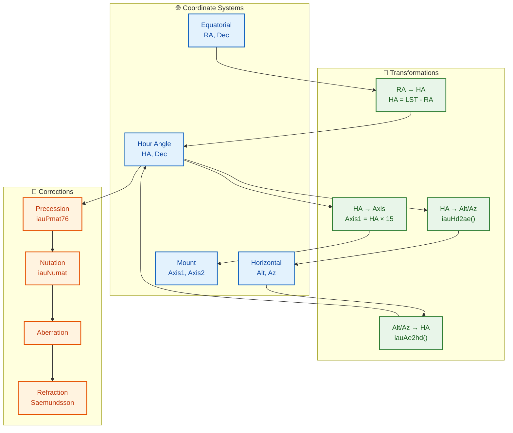

# Mathematical Model of the Astronomical Mount Controller

## System Overview



> **Source code references**: All mathematical models are implemented in [`src/controllers/mount_controller.cpp`](src/controllers/mount_controller.cpp) (5195 lines) and [`include/controllers/mount_controller.h`](include/controllers/mount_controller.h). Configuration structures are defined in [`include/config/configuration.h`](include/config/configuration.h) and validated in [`src/config/configuration.cpp`](src/config/configuration.cpp). SOFA library routines (precession, nutation, coordinate transforms) are used from [`sofa/`](sofa/).

## 1. Coordinate Systems and Transformations

### 1.1 Reference Frames

The mount controller operates in four primary coordinate systems:

| System | Description | Units |
|--------|-------------|-------|
| **Equatorial (RA, Dec)** | Celestial coordinates, J2000.0 epoch | RA: hours [0, 24), Dec: degrees [-90, +90] |
| **Hour Angle (HA, Dec)** | Mount-oriented equatorial coordinates | HA: hours [-12, +12), Dec: degrees [-90, +90] |
| **Horizontal (Alt, Az)** | Observer-local coordinates | Alt: degrees [-90, +90], Az: degrees [0, 360) |
| **Mount (Axis1, Axis2)** | Motor/encoder-space coordinates | degrees |

### 1.2 Fundamental Transformations

#### Equatorial to Hour Angle

```
HA = LST - RA
```

where LST (Local Sidereal Time) is:

```
LST = GMST + longitude/15°   (in hours)
```

and GMST is computed using the SOFA library:

```
GMST = iauGst94(JD, 0.0) × 180/π / 15    [hours]
```

#### Hour Angle to Horizontal

Using the SOFA library's `iauHd2ae` function:

```
az, alt = iauHd2ae(ha, dec, φ)

where:
  ha  = hour angle in radians
  dec = declination in radians
  φ   = observer latitude in radians
  
  az  = azimuth in radians (measured east of north)
  alt = altitude in radians
```

#### Horizontal to Equatorial

Using the SOFA library's `iauAe2hd` function:

```
ha, dec = iauAe2hd(az, alt, φ)
ra = LST - ha
```

### 1.3 The Mount Rotation Model

For an **equatorial mount**, the relationship between celestial coordinates and mount axes is:

```
Axis1 = HA × 15  (converting hours to degrees)
Axis2 = Dec
```

For an **alt-az mount**:

```
Axis1 = Az
Axis2 = Alt
```

For a **CASUAL mount** (arbitrarily oriented, `MountType::CASUAL`):

The CASUAL mount has two perpendicular axes, but their orientation relative to the local horizon is arbitrary and described by a unit quaternion `Q = [qx, qy, qz, qw]`. This quaternion represents the rotation from the local horizontal frame (ENU: East, North, Up) to the mount frame (axis1, axis2).

**Sky → mount transformation** for CASUAL:

```
1. RA/Dec → Alt/Az via existing equatorialToHorizontal()
2. Alt/Az → vector in horizontal frame (ENU)
3. Apply Q⁻¹ (quaternion inverse) → vector in mount frame
4. Extract angles (axis1, axis2) from mount-frame vector
```

**Mount → sky transformation** for CASUAL:

```
1. (axis1, axis2) → vector in mount frame
2. Apply Q → vector in horizontal frame (Alt/Az)
3. Alt/Az → RA/Dec via existing horizontalToEquatorial()
```

For an identity quaternion `Q = [0, 0, 0, 1]`, CASUAL behaves identically to ALT_AZ.

> **Implementation**: CASUAL transform functions are in [`src/core/astronomical_calculations.cpp`](src/core/astronomical_calculations.cpp): [`equatorialToMountOrientation()`](src/core/astronomical_calculations.cpp:434) and [`mountOrientationToEquatorial()`](src/core/astronomical_calculations.cpp:469). [`MountOrientation`](include/controllers/mount_controller.h:50) is defined in [`include/controllers/mount_controller.h`](include/controllers/mount_controller.h).

## 2. Precession and Nutation

### 2.1 Precession

Precession is applied using the IAU 1976 Precession Model (`iauPmat76`). The transformation from epoch `t₁` to epoch `t₂` is:

```
P(t₁→t₂) = R_J2000→t₂ × R_J2000→t₁ᵀ

[rₜ₂] = P(t₁→t₂) · [rₜ₁]
```

where `r` is the position vector in Cartesian coordinates derived from spherical coordinates (RA, Dec).

### 2.2 Nutation

Nutation is applied using the IAU 1980 Nutation Model (`iauNut80`, `iauObl80`, `iauNumat`):

```
N = iauNumat(ε₀, Δψ, Δε)

[r_apparent] = N · [r_mean]
```

where:
- `ε₀` = mean obliquity of the ecliptic
- `Δψ` = nutation in longitude
- `Δε` = nutation in obliquity

### 2.3 Apparent Place Calculation

The full apparent place correction combines multiple effects:

```
r_apparent = N · A · P · r_catalog

where:
  P = precession matrix
  A = annual aberration matrix
  N = nutation matrix
```

The annual aberration correction follows the simplified model:

```
Δα = -v/c · cos(δ) · sin(α)
Δδ = -v/c · cos(α)

where v/c ≈ 10⁻⁴ (Earth's orbital velocity / speed of light)
```

## 3. TPOINT Model for Mount Error Correction

> **Implementation**: [`src/controllers/mount_controller.cpp`](src/controllers/mount_controller.cpp) lines 2182–2541 — [`addTPointMeasurement()`](src/controllers/mount_controller.cpp:2182), [`runTPointCalibration()`](src/controllers/mount_controller.cpp:2261), [`getTPointParameters()`](src/controllers/mount_controller.cpp:2543). TPOINT configuration is defined in [`include/config/configuration.h`](include/config/configuration.h:166) section `TPointConfig`.

### 3.1 Overview

The TPOINT model implements a comprehensive geometric correction for the astronomical mount. It models the mount as a physical system with measurable error terms, each corresponding to a specific mechanical misalignment or flexure.

### 3.2 Error Term Definitions

Each error term is defined by its design matrix column (partial derivative with respect to the parameter):

| Term | Symbol | Formula | Description |
|------|--------|---------|-------------|
| Index Error (HA) | IA | `1` | Constant offset in RA |
| Collimation Error | CA | `cos(HA)` | Optical axis misalignment |
| Axis Non-perpendicularity | NP | RA: `sin(HA)·tan(Dec)` | Non-perpendicular mount axes |
| | | Dec: `cos(HA)` | |
| Polar Altitude Error | PA | RA: `-cos(HA)` | Polar misalignment in altitude |
| | | Dec: `1` | |
| Polar Azimuth Error | PAz | RA: `sin(HA)` | Polar misalignment in azimuth |
| | | Dec: `sin(HA)·tan(Dec)` | |
| Tube Flexure (HA) | TF_h | `sin(HA)` | Gravitational flexure in RA |
| Tube Flexure (Dec) | TF_d | `sin(Dec)` | Gravitational flexure in Dec |
| Tube Rotation | TR | RA: `cos(Dec)` | Field rotation from tube sag |
| | | Dec: `-sin(Dec)·sin(HA)` | |
| Worm Error | WE | `sin(2·HA)` | Periodic worm gear error |
| | | Harmonics: `sin(n·HA)`, `cos(n·HA)` for n=2..6 | |
| Encoder Error (HA) | EE_h | `HA` + harmonics | Linear and periodic encoder errors |
| Encoder Error (Dec) | EE_d | `Dec` + harmonics | Linear and periodic encoder errors |

### 3.3 Full Model Equations

The complete TPOINT model for RA correction (in arcseconds):

```
ΔRA = IA
    + CA · cos(HA)
    + NP · sin(HA) · tan(Dec)
    - PA · cos(HA) + PAz · sin(HA)
    + TF_h · sin(HA)
    + TR · cos(Dec)
    + WE · sin(2·HA) + Σᵢ₌₁⁵ Aᵢ · sin((i+1)·HA + φᵢ)
    + EE_h · HA + Σⱼ₌₁⁴ Bⱼ · sin((j+1)·HA + ψⱼ)
    + ΔRA_physical
```

The complete TPOINT model for Dec correction (in arcseconds):

```
ΔDec = PA
      + NP · cos(HA)
      + PAz · sin(HA) · tan(Dec)
      + TF_d · sin(Dec)
      - TR · sin(Dec) · sin(HA)
      + EE_d · Dec + Σⱼ₌₁⁴ Cⱼ · sin((j+1)·Dec + χⱼ)
      + A·tan(z) + B·tan³(z) + C·tan⁵(z)
      + ΔDec_physical
```

where `z = 90° - Dec` is the zenith distance.

### 3.4 Physical Axis Corrections

Each axis includes additional physical corrections:

```
ΔRA_physical = Δ_cyclic + Δ_worm + Δ_encoder_quant + Δ_backlash + Δ_stiffness + Δ_thermal + Δ_calibration
```

- **Cyclic gear errors**: `Σᵢ Aᵢ · sin(i·θ + φᵢ)` where θ is the axis rotation angle
- **Worm gear errors**: `A_worm · sin(2π · θ/360 · r_worm)` where r_worm is the worm ratio
- **Encoder quantization**: `±½ · Q` where Q is the quantization step in arcseconds
- **Backlash**: `B + (T - T_cal) · B_temp` when direction changes
- **Stiffness**: `τ · k_axis` where τ is load torque and k_axis is stiffness coefficient
- **Thermal expansion**: `α · (T - T_cal) · θ`
- **Calibration table**: interpolated from a position → error lookup table

### 3.5 TPOINT Parameter Fitting

The model is fitted using weighted linear least squares on the residuals:

```
r = A · p - b
```

where:
- `r` = residual vector (arcseconds)
- `A` = design matrix (partial derivatives of model)
- `p` = parameter vector
- `b` = measurement vector (observed - expected, in arcseconds)

The RA and Dec equations are solved separately:

```
A_RA · p_RA = b_RA
A_Dec · p_Dec = b_Dec
```

The solution uses QR decomposition via `Eigen::ColPivHouseholderQR` to solve the normal equations:

```
(AᵀA) · p = Aᵀb
p = QR.solve(Aᵀb)
```

### 3.6 Correction Application

Corrections are subtracted from observed coordinates to obtain corrected coordinates:

```
RA_corrected = RA_observed - ΔRA / (15 × 3600)    [hours]
Dec_corrected = Dec_observed - ΔDec / 3600         [degrees]
```

### 3.7 Mount Position Prediction (Newton-Raphson)

To find the required mount position (HA, Dec) for given target celestial coordinates (RA, Dec), the inverse TPOINT model is solved iteratively:

```
f(HA, Dec) = applyCorrections(RA, Dec, HA, Dec) - (RA_target, Dec_target) = 0
```

Using Newton-Raphson with analytical Jacobian:

```
J = [∂f_RA/∂HA  ∂f_RA/∂Dec]
    [∂f_Dec/∂HA ∂f_Dec/∂Dec]

Δx = -J⁻¹ · f
```

Partial derivatives are computed via central differences with `ε = 10⁻⁶`.

## 4. Atmospheric Refraction

### 4.1 Saemundsson Formula

For quick computation:

```
R = 1.02° / tan(alt + 10.3°/(alt + 5.11°))
    × P/1010 × 283.15/T
```

where:
- `alt` = apparent altitude in degrees
- `P` = atmospheric pressure in mbar
- `T` = temperature in Kelvin

### 4.2 Full Saastamoinen Model

For higher precision, the full Saastamoinen model is implemented in the TPOINT framework:

```
R(z) = A · tan(z) + B · tan³(z) + C · tan⁵(z)

where z = 90° - Dec (zenith distance)
      A, B, C = fitted refraction coefficients
```

## 5. State Estimation with Extended Kalman Filter

> **Implementation**: [`src/controllers/mount_controller.cpp`](src/controllers/mount_controller.cpp) lines 38–134 — inline `PositionKalmanFilter` struct. Key methods: `init()` (line 53), `predict()` (line 84), `update()` (line 103). The Joseph form covariance update is at line 120. Adaptive noise estimation is at lines 364–371.

### 5.1 State Vector

The Kalman filter state vector has dimension `N = 7 + N_tpoint`:

```
x = [q₀, q₁, q₂, q₃, ω_HA, ω_Dec, T, p_₁, p_₂, ..., p_N]ᵀ
```

where:
- `q₀, q₁, q₂, q₃` = orientation quaternion (4 parameters)
- `ω_HA, ω_Dec` = mount angular rates (2 parameters)
- `T` = environmental temperature (1 parameter)
- `p_i` = TPOINT model parameters

### 5.2 Process Model

The state transition uses a constant-velocity model for the orientation and rates:

```
F = [I₄  Δt·I₂  0 ]
    [0   I₂     0 ]
    [0   0   I_(1+N_tpoint)]
```

Process noise covariance `Q` is configured with different noise levels for orientation, TPOINT parameters, rates, and environmental parameters.

### 5.3 Measurement Update

The Kalman gain is computed as:

```
K = P · Hᵀ · (H · P · Hᵀ + R)⁻¹
```

State update (Joseph form for numerical stability):

```
x_new = x + K · (z - H · x)
P_new = (I - K·H) · P · (I - K·H)ᵀ + K · R · Kᵀ
```

### 5.4 Adaptive Noise Estimation

The filter adapts its noise parameters online using innovation statistics:

```
R_estimated = (Σ εᵢεᵢᵀ)/N - H·P·Hᵀ
Q_adapt = (1-α)·Q + α·(K · R_estimated · Kᵀ)
```

where `εᵢ = zᵢ - H·xᵢ` is the innovation sequence.

### 5.5 UKF Sigma Points

The implementation can generate Unscented Kalman Filter (UKF) sigma points for non-linear transformations:

```
x⁽⁰⁾ = x̄
x⁽ⁱ⁾ = x̄ + √(n+λ) · L_ᵢ   for i = 1, ..., n
x⁽ⁿ⁺ⁱ⁾ = x̄ - √(n+λ) · L_ᵢ   for i = 1, ..., n

where:
  λ = α²(n + κ) - n
  L = Cholesky(P)  (lower triangular)
  α = 10⁻³, β = 2, κ = 0 (standard UKF parameters)
```

## 6. Ephemeris Interpolation for Moving Objects

> **Implementation**: [`src/controllers/mount_controller.cpp`](src/controllers/mount_controller.cpp) lines 3134–3258 — [`uploadEphemeris()`](src/controllers/mount_controller.cpp:3134), [`startEphemerisTracking()`](src/controllers/mount_controller.cpp:3168), [`getEphemerisTrackStatus()`](src/controllers/mount_controller.cpp:3223). Ephemeris data structures are defined in [`proto/mount_controller.proto`](proto/mount_controller.proto:676) messages `EphemerisData`, `EphemerisPoint`, `EphemerisTrackStatus`.

### 6.1 Interpolation Methods

The ephemeris interpolator supports three orders of interpolation using Lagrange polynomials:

**Linear** (order 1):
```
f(t) = f₀ · (t₁ - t)/(t₁ - t₀) + f₁ · (t - t₀)/(t₁ - t₀)
```

**Quadratic** (order 2):
```
f(t) = f₀ · L₀(t) + f₁ · L₁(t) + f₂ · L₂(t)

L₀(t) = (t - t₁)(t - t₂) / ((t₀ - t₁)(t₀ - t₂))
L₁(t) = (t - t₀)(t - t₂) / ((t₁ - t₀)(t₁ - t₂))
L₂(t) = (t - t₀)(t - t₁) / ((t₂ - t₀)(t₂ - t₁))
```

**Cubic** (order 3, default):
```
f(t) = Σᵢ₌₀³ fᵢ · Lᵢ(t)

Lᵢ(t) = Πⱼ₌₀,ⱼ≠ᵢ³ (t - tⱼ) / (tᵢ - tⱼ)
```

### 6.2 Extrapolation Beyond Ephemeris Range

For times beyond the ephemeris range, linear extrapolation using the last known state vector:

```
r(t) = r_N + ṙ_N · (t - t_N) / 3600   [RA in hours, Dec in degrees]
ṙ(t) = ṙ_N                            [constant rate assumption]
```

### 6.3 Earth Rotation Correction

For apparent positions, the Earth's rotation is applied:

```
RA_apparent = RA_ephemeris - ω_⊕ · (t - t_epoch)

where ω_⊕ = 15.041 arcseconds/second = 0.004178 hours/second
```

### 6.4 Full Correction Chain

When computing apparent positions for tracking, corrections are applied in order:

1. Interpolate base position from ephemeris data
2. Apply proper motion correction (if applicable)
3. Apply precession (from ephemeris epoch to current date)
4. Apply nutation
5. Apply Earth rotation correction (diurnal motion)
6. Apply atmospheric refraction
7. Apply TPOINT mount corrections (if model is available)

## 7. Tracking Control

> **Implementation**: [`src/controllers/mount_controller.cpp`](src/controllers/mount_controller.cpp) lines 856–1707 — [`startTracking()`](src/controllers/mount_controller.cpp:856) implements the full tracking loop with NaN/Inf propagation guards at lines 3–5 (upstream) and 6–9 (downstream). [`TrackingMode`](include/controllers/mount_controller.h) supports SIDEREAL, SOLAR, LUNAR, and CUSTOM rates. Guider correction integration is at line 2710.

### 7.1 Tracking Rates

| Mode | RA Rate (deg/s) | Description |
|------|-----------------|-------------|
| Sidereal | 0.004178 | 15.041 arcsec/s |
| Solar | 0.004167 | 15.000 arcsec/s |
| Lunar | 0.004079 | 14.685 arcsec/s |
| Custom | configurable | User-defined rate |

### 7.2 Guider Correction Integration

Guide corrections are applied in arcseconds with clamping and aggression:

```
ΔRA_rate = clamp(correction_RA × aggression, -max_correction, +max_correction)
ΔDec_rate = clamp(correction_Dec × aggression, -max_correction, +max_correction)

rate_RA += ΔRA_rate / 3600 / 15   [convert arcsec to deg/s]
rate_Dec += ΔDec_rate / 3600      [convert arcsec to deg/s]
```

### 7.3 Field Rotation for Alt-Az and CASUAL Mounts

For alt-azimuth mounts, field rotation is computed as:

```
Φ˙ = -ω_⊕ · cos(φ) / sin(alt)

where:
  Φ˙ = field rotation rate (rad/s)
  ω_⊕ = Earth rotation rate = 7.2921150 × 10⁻⁵ rad/s
  φ = observer latitude
  alt = telescope altitude
```

For **CASUAL mounts**, the altitude (`alt`) used in the formula above is the altitude-like axis in the mount frame (axis1), which is the projection of the true altitude through the orientation quaternion.

The total field rotation is integrated over time:

```
Φ(t) = ∫ Φ˙(τ) dτ
```

For equatorial mounts, field rotation is zero (except for atmospheric effects).

### 7.4 Tracking for CASUAL Mounts

For CASUAL mounts, tracking rates are computed dynamically in the tracking loop:

```
1. Compute tracking rates in the true horizontal frame (Alt/Az)
   - Alt rate:  d(alt)/dt = ω_⊕ · cos(φ) · cos(az)
   - Az rate:   d(az)/dt  = -ω_⊕ · (cos(φ) · sin(az) · sin(alt) + sin(φ) · cos(alt)) / cos(alt)
2. Transform the rate vector through the orientation quaternion Q⁻¹ to mount frame
3. Obtain (axis1_rate, axis2_rate) in mount frame
```

For an identity quaternion, CASUAL tracking rates are identical to ALT_AZ.

## 8. Bootstrap Calibration

> **Implementation**: [`src/controllers/mount_controller.cpp`](src/controllers/mount_controller.cpp) lines 2045–2146 — [`addBootstrapMeasurement()`](src/controllers/mount_controller.cpp:2045), [`runBootstrapCalibration()`](src/controllers/mount_controller.cpp:2069), [`clearBootstrapMeasurements()`](src/controllers/mount_controller.cpp:2139). Bootstrap messages defined in [`proto/mount_controller.proto`](proto/mount_controller.proto:765) — `BootstrapMeasurement`, `BootstrapCalibrationResult`, `BootstrapStatus`.

### 8.1 Initial Alignment Algorithm

The bootstrap calibration uses a simple linear model to determine initial pointing corrections:

```
ΔRA = mean(expected_RA - observed_RA) across all measurements
ΔDec = mean(expected_Dec - observed_Dec) across all measurements
```

RA offsets are normalized to [-12, +12] hours range before averaging.

The correction is applied to the current mount position:

```
Axis1_target += ΔRA × 15°  (convert hours to degrees)
Axis2_target += ΔDec
```
### 8.2 Bootstrap Calibration for CASUAL Mounts

For CASUAL mounts, the bootstrap calibration estimates the mount orientation quaternion from at least 3 measurements. For each measurement (observed RA/Dec, expected RA/Dec):

```
1. For each measurement:
   a. Compute direction vector in horizontal frame from (observed RA, Dec)
   b. Compute direction vector in horizontal frame from (expected RA, Dec)
   c. The difference between these vectors gives the error direction in horizontal frame
2. Fit quaternion Q that minimizes pointing errors for all measurements
3. Apply least-squares method with orthogonal Procrustes regression
```

The result is an estimated orientation quaternion `Q`, which is set as `mount_orientation` in the mount configuration.

> **Implementation**: CASUAL bootstrap in [`src/controllers/mount_controller.cpp`](src/controllers/mount_controller.cpp) lines 2377–2541 — the `runBootstrapCalibration()` method detects `MountType::CASUAL` and estimates the quaternion using at least 3 [`BootstrapMeasurement`](proto/mount_controller.proto:765) entries.

### 8.3 Quality Metrics


```
RMS_RA = sqrt(mean((ΔRA_i - ΔRA)²))
RMS_Dec = sqrt(mean((ΔDec_i - ΔDec)²))
```

## 9. Numerical Stability Considerations

> **Implementation**: NaN/Inf propagation guards are embedded throughout the tracking loop in [`src/controllers/mount_controller.cpp`](src/controllers/mount_controller.cpp) — upstream guards at lines 3–5 (rate calculation, position update, Kalman output), downstream guards at lines 6–9 (HA/RA normalization, nutation, TPOINT, refraction). The Joseph form covariance update at line 120 ensures positive semidefiniteness. [`evaluateSoftLimits()`](src/controllers/mount_controller.cpp:4563) implements the 3-zone safety system (warning → deceleration → hard stop).

### 9.1 Singularity Handling

| Singularity | Location | Mitigation |
|-------------|----------|------------|
| tan(Dec) near poles | |Dec| > 85° | Taylor expansion: `tan(90°-ε) ≈ 1/ε - ε/3` |
| cos(Dec) ≈ 0 at poles | Dec = ±90° | Clamp to ε = 10⁻⁶ |
| sin(alt) ≈ 0 at horizon | alt = 0° | Clamp to min 1° for field rotation |
| tan(z) near horizon | z → 90° | Polynomial expansion for tan |

### 9.2 Covariance Conditioning

- **Joseph form** for covariance update: `P = (I-KH)P(I-KH)ᵀ + KRKᵀ` ensures positive semidefiniteness
- For ill-conditioned matrices, QR decomposition is used instead of direct inversion
- Covariance is bounded below by `1.0` and above by `1000.0`

### 9.3 Coordinate Wrapping

```
RA normalization: while RA < 0: RA += 24; while RA >= 24: RA -= 24
HA normalization: while HA < -12: HA += 24; while HA >= 12: HA -= 24
Dec clamping: if Dec < -90: Dec = -90; if Dec > 90: Dec = 90
Azimuth normalization: while Az < 0: Az += 360; while Az >= 360: Az -= 360
```

## 10. Error Budget and Expected Accuracy

| Error Source | Typical Magnitude (arcsec) | Mitigation |
|-------------|---------------------------|------------|
| Polar misalignment | 30–300 | Drift alignment + TPOINT PA term |
| Non-perpendicularity | 10–60 | TPOINT NP term |
| Tube flexure | 5–30 | TPOINT flexure terms |
| Worm gear error | 1–20 | Harmonic correction model |
| Encoder quantization | 0.1–5 | High-resolution encoders + calibration |
| Atmospheric refraction | 0–60 at 45° alt | Saastamoinen model |
| Atmospheric seeing | 0.5–5 (site-dependent) | Guide correction |
| Thermal expansion | 0.1–2/°C | Temperature compensation |
| Backlash | 1–30 | Compensation on direction change |

Target tracking accuracy after full calibration: **< 1 arcsecond RMS**
