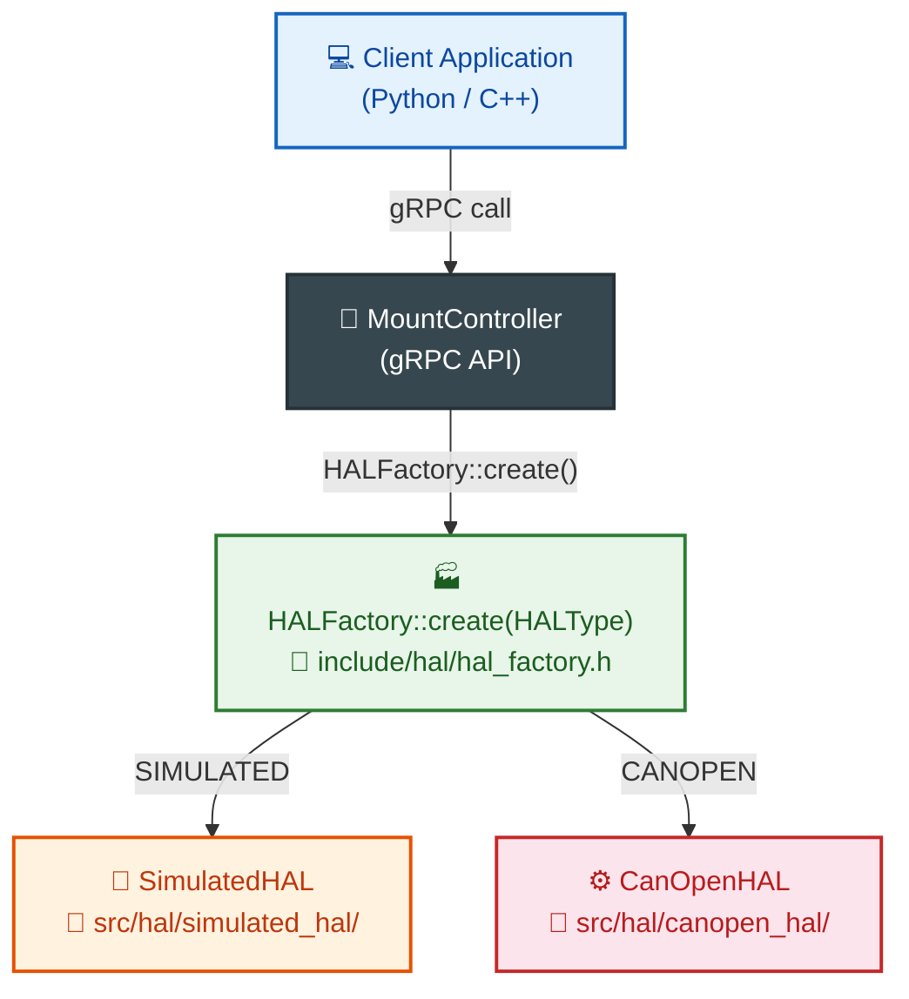

# Testing and Running the Mount Controller

> This document describes how to test and run the mount controller in both fully simulated environments and with real CANopen hardware.

---

## Table of Contents

1. [Introduction](#1-introduction)
2. [Running Modes](#2-running-modes)
3. [Building the Project](#3-building-the-project)
4. [Running with Simulation (No Hardware)](#4-running-with-simulation-no-hardware)
5. [Running with Real CANopen Hardware](#5-running-with-real-canopen-hardware)
6. [Configuration for Each Mode](#6-configuration-for-each-mode)
7. [Unit and Integration Tests](#7-unit-and-integration-tests)
8. [Acceptance Tests with Simulation](#8-acceptance-tests-with-simulation)
9. [Tests with Real Hardware](#9-tests-with-real-hardware)
10. [Verification Checklist](#10-verification-checklist)
11. [Common Issues and Solutions](#11-common-issues-and-solutions)

---

## 1. Introduction

The [`MountController`](../../src/controllers/mount_controller.cpp:1) can operate in two main modes depending on hardware availability:

| Mode | Description | Hardware Required |
|------|-------------|:-----------------:|
| **SIMULATED** | Fully emulated — motors, encoders, sensors | ❌ None |
| **CANopen** | Real hardware control via CAN bus | ✅ CAN card + drives |

Both modes use the same HAL layer ([`HALInterface`](../../include/hal/hal_interface.h:1)), so the client application requires no changes — only a configuration swap.

---

## 2. Running Modes

### 2.1 HAL Selection Architecture



### 2.2 Switching Modes

1. **Via configuration file** ([`default.json`](../../config/default.json:169)):
   ```json
   "hal": {
       "interface_type": "SIMULATED",   // or "CANopen"
       ...
   }
   ```

2. **Programmatically via gRPC** ([`SetHALConfig`](../../include/api/mount_controller.grpc.pb.h:1)):
   ```python
   stub.SetHALConfig(HALConfigRequest(interface_type="SIMULATED"))
   ```

3. **Via environment variable**:
   ```bash
   HAL_TYPE=SIMULATED ./astro-mount-controller config.json
   ```

---

## 3. Building the Project

### 3.1 Prerequisites

| Dependency | Minimum Version | Notes |
|-----------|-----------------|-------|
| CMake | 3.15 | — |
| C++ Compiler | C++17 | GCC 9+, Clang 10+, MSVC 2019+ |
| gRPC | 1.60+ | With protobuf |
| SOFA | — | Bundled in [`ext_libs/`](../../ext_libs/) |
| SQLite3 | — | For object database |
| OpenSSL | — | For TLS (optional) |
| **SocketCAN (CANopen only)** | — | linux-can kernel stack |

### 3.2 Build Steps

```bash
# 1. Clone repository
git clone https://github.com/your-org/astro-mount-controller.git
cd astro-mount-controller

# 2. Create build directory
mkdir -p build && cd build

# 3. CMake configuration
cmake .. -DCMAKE_BUILD_TYPE=Release

# 4. Compile
make -j$(nproc)

# 5. (Optional) System install
sudo make install
```

### 3.3 CMake Options

| Option | Default | Description |
|--------|---------|-------------|
| `-DBUILD_TESTS=ON` | ON | Build tests |
| `-DBUILD_EXAMPLES=ON` | ON | Build examples |
| `-DENABLE_CANOPEN=ON` | ON | Enable CANopen support |
| `-DENABLE_SSL=OFF` | OFF | Enable TLS for gRPC |
| `-DCMAKE_BUILD_TYPE=Debug` | Release | Debug = extra assertions and logging |

### 3.4 Debug Build (Recommended for First Run)

```bash
mkdir -p build_debug && cd build_debug
cmake .. -DCMAKE_BUILD_TYPE=Debug
make -j$(nproc)
```

Debug mode enables:
- Detailed logging (`LOG_DEBUG`)
- NaN/Inf assertions in critical loops
- Additional internal state validation
- Operation timing measurements

---

## 4. Running with Simulation (No Hardware)

Simulated mode allows full controller testing without any hardware. Ideal for:
- Learning the API
- Testing higher-level system integration (N.I.N.A., Ekos, ASCOM)
- Client application development and debugging
- Error scenario verification

### 4.1 Configuration for Simulated Mode

Create [`config_simulated.json`](../../config/default.json):

```json
{
  "logging": {
    "level": "DEBUG",
    "console_output": true
  },
  "network": {
    "grpc_address": "0.0.0.0",
    "grpc_port": 50051
  },
  "mount": {
    "type": "equatorial",
    "latitude": 52.0,
    "longitude": 21.0,
    "altitude": 100.0,
    "max_slew_rate": 5.0,
    "max_tracking_rate": 0.004178,
    "slew_acceleration": 1.0,
    "tracking_acceleration": 0.001,
    "position_tolerance": 0.1,
    "use_encoders": true,
    "encoders_absolute": true,
    "encoder_resolution": 36000,
    "meridian_flip_enabled": true,
    "meridian_flip_delay_minutes": 5.0,
    "soft_limits_enabled": true
  },
  "hal": {
    "interface_type": "SIMULATED",
    "simulated": {
      "position_noise_stddev": 0.0005,
      "velocity_noise_stddev": 0.0001,
      "temperature_simulation": true,
      "current_simulation": true,
      "error_probability": 0.001,
      "simulation_speed": 1.0
    }
  }
}
```

### 4.2 Starting the Server

```bash
# With configuration file
./build/bin/astro-mount-controller ./config_simulated.json

# Or without file (uses defaults with simulation)
./build/bin/astro-mount-controller
```

Expected output:
```
[INFO] Astronomical Mount Controller v1.0.0
[INFO] HAL: SIMULATED initialized
[INFO] gRPC server listening on 0.0.0.0:50051
[INFO] Mount state: UNINITIALIZED → READY
```

### 4.3 Quick Python Test

```python
import grpc
import mount_controller_pb2 as pb
import mount_controller_pb2_grpc as rpc

# Connect
channel = grpc.insecure_channel('localhost:50051')
stub = rpc.MountControllerStub(channel)

# 1. Check state
state = stub.GetState(pb.google_dot_protobuf_dot_empty__pb2.Empty())
print(f"State: {state.state}, error: {state.pointing_error:.2f}\"")

# 2. Slew to Vega
stub.SlewToCoordinates(pb.CoordinatesRequest(
    ra_hours=18.615, dec_degrees=38.78, target_name="Vega"
))

# 3. Monitor
import time
for _ in range(5):
    state = stub.GetState(pb.google_dot_protobuf_dot_empty__pb2.Empty())
    print(f"Slewing... position: RA={state.current_ra:.4f}h, Dec={state.current_dec:.2f}°")
    time.sleep(1)

# 4. Start tracking
stub.TrackObject(pb.TrackRequest(
    ra_hours=18.615, dec_degrees=38.78, target_name="Vega"
))
print("Tracking active")
```

### 4.4 Simulation Parameters

| Parameter | Default | Range | Description |
|-----------|---------|-------|-------------|
| `position_noise_stddev` | 0.0005° | 0 – 0.1° | Encoder position noise (0 = ideal) |
| `velocity_noise_stddev` | 0.0001 °/s | 0 – 0.01 °/s | Velocity noise |
| `temperature_simulation` | true | — | Motor temperature simulation |
| `current_simulation` | true | — | Current draw simulation |
| `error_probability` | 0.001 | 0 – 1.0 | Random error probability |
| `simulation_speed` | 1.0 | 0.1 – 100× | Simulation speed multiplier |

**Tip**: Set `error_probability=0.05` to test controller behavior under communication errors.

---

## 5. Running with Real CANopen Hardware

### 5.1 Hardware Requirements

| Component | Example | Notes |
|-----------|---------|-------|
| CAN interface | PCIeCAN, USBtin, Waveshare USB-CAN, Kvaser | SocketCAN compatible |
| RA axis drive | Servo/stepper with CiA 402 | e.g., Leadshine, AMC, Copley |
| Dec axis drive | Servo/stepper with CiA 402 | e.g., Leadshine, AMC, Copley |
| Derotator (opt.) | Motor with absolute encoder | — |
| Power supply | 24-48V DC | Depends on drives |

### 5.2 SocketCAN Configuration (Linux)

```bash
# 1. Load kernel modules
sudo modprobe can
sudo modprobe can_raw
sudo modprobe can_dev

# 2. For USB-CAN interface (e.g., Waveshare, PCAN-USB)
sudo modprobe gs_usb    # Generic CAN USB driver

# 3. Configure CAN interface
sudo ip link set can0 type can bitrate 1000000
sudo ip link set can0 up

# 4. Verify
ip -details link show can0
# Expected: CAN <...> state UP

# 5. Test (listen)
candump can0
```

### 5.3 CANopen Controller Configuration

Create [`config_canopen.json`](../../config/default.json):

```json
{
  "logging": {
    "level": "DEBUG",
    "console_output": true,
    "directory": "/var/log/astro-mount"
  },
  "network": {
    "grpc_address": "0.0.0.0",
    "grpc_port": 50051
  },
  "mount": {
    "type": "equatorial",
    "latitude": 52.0,
    "longitude": 21.0,
    "altitude": 100.0,
    "max_slew_rate": 3.0,
    "max_tracking_rate": 0.004178,
    "slew_acceleration": 0.5,
    "tracking_acceleration": 0.0005,
    "position_tolerance": 0.5,
    "use_encoders": true,
    "encoders_absolute": true,
    "encoder_resolution": 16384,
    "meridian_flip_enabled": true,
    "meridian_flip_delay_minutes": 5.0,
    "soft_limits_enabled": true,
    "soft_limit_axis1_min": -270.0,
    "soft_limit_axis1_max": 270.0,
    "soft_limit_axis2_min": -5.0,
    "soft_limit_axis2_max": 185.0,
    "axis_physical_parameters": {
      "ha_axis": {
        "motor_steps_per_rev": 200,
        "motor_microstepping": 64,
        "gear_ratio": 360.0,
        "worm_ratio": 180.0,
        "encoder_resolution": 16384,
        "backlash": 8.5
      },
      "dec_axis": {
        "motor_steps_per_rev": 200,
        "motor_microstepping": 64,
        "gear_ratio": 360.0,
        "worm_ratio": 180.0,
        "encoder_resolution": 16384,
        "backlash": 6.3
      }
    }
  },
  "hal": {
    "interface_type": "CANopen",
    "can_interface": "can0",
    "can_node_id": 1,
    "can_baud_rate": 1000000,
    "heartbeat_interval_ms": 1000,
    "pdo_mapping_mode": "default"
  }
}
```

### 5.4 Starting with CANopen

```bash
# 1. Verify CAN bus
candump can0 &

# 2. Start controller
sudo ./build/bin/astro-mount-controller ./config_canopen.json

# 3. Expected initialization sequence:
# [INFO] Astronomical Mount Controller v1.0.0
# [INFO] CAN interface can0: 1 Mbit/s, state UP
# [DEBUG] Sending NMT Start to node 1
# [DEBUG] CiA 402: NotReadyToSwitchOn → ReadyToSwitchOn
# [DEBUG] CiA 402: ReadyToSwitchOn → SwitchedOn
# [DEBUG] CiA 402: SwitchedOn → OperationEnabled
# [INFO] HAL: CANopen initialized
# [INFO] gRPC server listening on 0.0.0.0:50051
# [INFO] Mount state: UNINITIALIZED → READY
```

### 5.5 CANopen Traffic Verification

```bash
# Monitor PDOs
candump can0,0x180~0x1FF,0x200~0x27F,0x580~0x5FF

# Send NMT Start (manual example)
cansend can0 000#01      # NMT Start all nodes

# Read SDO (e.g., status word of drive 1)
cansend can0 601#40 41 60 00 00 00 00 00

# Monitor heartbeat
candump can0,0x700~0x7FF
```

---

## 6. Configuration for Each Mode

### 6.1 Key Configuration Differences

| Parameter | Simulated | CANopen | Notes |
|-----------|-----------|---------|-------|
| `hal.interface_type` | `"SIMULATED"` | `"CANopen"` | Mode switch |
| `hal.can_interface` | — | `"can0"` | CAN interface name |
| `hal.can_baud_rate` | — | 1000000 | 125k, 250k, 500k, 1M |
| `mount.max_slew_rate` | 5.0 °/s | 3.0 °/s | Lower for real hardware |
| `mount.slew_acceleration` | 1.0 °/s² | 0.5 °/s² | Lower for hardware safety |
| `mount.position_tolerance` | 0.1° | 0.5° | Wider tolerance for real hardware |
| `simulated.position_noise_stddev` | 0.0005° | — | Simulated mode only |

### 6.2 Safety Parameters

```json
{
  "mount": {
    "soft_limits_enabled": true,
    "soft_limit_axis1_min": -270.0,
    "soft_limit_axis1_max": 270.0,
    "soft_limit_axis2_min": -5.0,
    "soft_limit_axis2_max": 185.0,
    "soft_limit_warning_degrees": 10.0,
    "soft_limit_deceleration_degrees": 5.0,
    "meridian_flip_enabled": true,
    "meridian_flip_delay_minutes": 5.0,
    "meridian_flip_hysteresis_degrees": 0.5
  }
}
```

**⚠️ Critical for real hardware:**
- `soft_limits_enabled` — ALWAYS enabled with real hardware
- `soft_limit_axis2_min` — For German mounts: min -5° (prevents pier collision)
- `max_slew_rate` — Start at 1.0 °/s, increase gradually
- `meridian_flip_enabled` — Disable on first run to avoid unexpected flips

### 6.3 Physical Axis Parameters — Calibration

Parameters in [`axis_physical_parameters`](../../config/default.json:66) must match your specific mount:

```json
"ha_axis": {
  "motor_steps_per_rev": 200,        // Motor steps per revolution
  "motor_microstepping": 64,          // Driver microstepping
  "gear_ratio": 360.0,                // Total gear ratio (360:1 typical)
  "worm_ratio": 180.0,                // Worm gear ratio
  "encoder_resolution": 16384,        // Encoder resolution (CPR)
  "backlash": 8.5,                    // Backlash in arcseconds (measured)
  "backlash_temp_coeff": 0.02,        // Backlash temperature coefficient
  "cyclic_error_amplitude": 15.2,     // Cyclic error amplitude (")        
  "cyclic_error_period": 360.0,       // Cyclic error period (° output axis)
  "calibration_table": []             // Calibration table (filled after calibration)
}
```

---

## 7. Unit and Integration Tests

### 7.1 Running All Tests

```bash
cd build
cmake .. -DBUILD_TESTS=ON
make -j$(nproc)
ctest --output-on-failure -V
```

### 7.2 Test Descriptions

| Test | File | What It Verifies | Duration |
|------|------|-----------------|----------|
| `MountControllerTest` | [`test_mount_controller.cpp`](../../tests/test_mount_controller.cpp) | Main API: slew, track, park, bootstrap/TPOINT calibration, meridian flip, soft limits, error handling | ~18s |
| `HALIntegrationTest` | [`test_hal_integration.cpp`](../../tests/test_hal_integration.cpp) | Simulated HAL integration: initialization, movement, encoders, safety monitor | ~3.4s |
| `GrpcIntegrationTest` | [`test_grpc_integration.cpp`](../../tests/test_grpc_integration.cpp) | gRPC API: sending commands, receiving status, calibration, HAL RPC | ~5.7s |
| `KalmanFilterTest` | [`test_kalman_filter.cpp`](../../tests/test_kalman_filter.cpp) | Kalman filter: prediction, update, adaptive noise, UKF sigma points | ~0.03s |
| `TPOINTModelTest` | [`test_tpoint_model.cpp`](../../tests/test_tpoint_model.cpp) | TPOINT model: 21 parameters, fitting, IH/ID/CH/... terms | ~0.01s |
| `EphemerisTrackerTest` | [`test_ephemeris_tracker.cpp`](../../tests/test_ephemeris_tracker.cpp) | Ephemeris tracking: interpolation, extrapolation, update | ~2.4s |
| `AstronomicalCalculationsTest` | [`test_astronomical_calculations.cpp`](../../tests/test_astronomical_calculations.cpp) | Astronomical calculations: precession, nutation, refraction, field rotation | ~0.01s |
| `ConfigurationTest` | [`test_configuration.cpp`](../../tests/test_configuration.cpp) | Configuration system: validation, merge, load/save | ~0.01s |
| `SubArcsecondAccuracyTest` | [`test_subarcsecond_accuracy.cpp`](../../tests/test_subarcsecond_accuracy.cpp) | Sub-arcsecond accuracy: long tracking, systematic errors | ~0.02s |

### 7.3 Running Individual Tests

```bash
# Single test with timing
./build/bin/test_mount_controller --gtest_print_time=1

# Specific test case
./build/bin/test_mount_controller \
    --gtest_filter="MountControllerTest.SlewToCoordinates_ReachesTarget"

# With debug logging
./build/bin/test_mount_controller --gtest_print_time=1 --log_level=DEBUG
```

---

## 8. Acceptance Tests with Simulation

Run these scenarios in simulated mode before moving to real hardware.

### 8.1 Basic Slew and Track

```python
def test_basic_slew_and_track():
    """Test basic slew and tracking."""
    # 1. Initialization
    state = stub.GetState(empty)
    assert state.state == "READY"
    
    # 2. Slew to Vega
    stub.SlewToCoordinates(ra=18.615, dec=38.78)
    time.sleep(5)
    state = stub.GetState(empty)
    assert state.state == "TRACKING"
    assert state.pointing_error < 1.0  # < 1 arcsecond
    
    # 3. Change target — slew to Capella
    stub.SlewToCoordinates(ra=5.25, dec=46.0)
    time.sleep(5)
    state = stub.GetState(empty)
    assert abs(state.current_ra - 5.25) < 0.1
```

**Acceptance criteria:**
- ✅ Controller transitions `READY` → `SLEWING` → `TRACKING`
- ✅ Pointing error after slew < 1.0"
- ✅ Smooth target change

### 8.2 Bootstrap Calibration

```python
def test_bootstrap_calibration():
    """Test bootstrap calibration with 3 stars."""
    # 1. Add measurements
    for ra, dec, name in [(2.32, 89.26, "Polaris"),
                           (6.75, 45.0, "Capella"),
                           (10.68, 12.5, "Regulus")]:
        success = stub.AddBootstrapMeasurement(
            observed_ra=ra + random_noise(),
            observed_dec=dec + random_noise(),
            expected_ra=ra, expected_dec=dec
        )
        assert success
    
    # 2. Run calibration
    success = stub.RunBootstrapCalibration(empty)
    assert success
    
    # 3. Verify
    status = stub.GetBootstrapStatus(empty)
    assert status.calibrated
    assert status.rms_error_arcsec < 60.0
```

**Acceptance criteria:**
- ✅ Calibration succeeds (≥2 measurements)
- ✅ RMS < 60" after calibration
- ✅ `calibrated = true`

### 8.3 Communication Loss

```python
def test_communication_loss():
    """Test behavior under HAL communication loss."""
    # Simulate communication loss
    stub.SimulateFault(HALFaultRequest(fault_type="COMM_LOSS"))
    
    time.sleep(2)
    state = stub.GetState(empty)
    
    # Controller should enter error state
    assert state.state in ["ERROR", "FAULT"]
    
    # Attempt recovery
    stub.ClearErrors(empty)
    state = stub.GetState(empty)
    assert state.state == "READY"
```

**Acceptance criteria:**
- ✅ Controller detects communication loss
- ✅ Enters `ERROR`/`FAULT` state
- ✅ Recoverable via `ClearErrors`

### 8.4 Meridian Flip

```python
def test_meridian_flip():
    """Test automatic meridian flip."""
    # Position mount near meridian
    stub.SlewToCoordinates(ra=local_sidereal_time() - 0.1, dec=45.0)
    
    time.sleep(30)  # Wait for flip
    state = stub.GetState(empty)
    
    assert state.pier_side_changed
    assert state.pointing_error < 30.0  # Acceptable post-flip error
```

**Acceptance criteria:**
- ✅ Automatic flip after meridian crossing
- ✅ Pier side changes
- ✅ Pointing error after flip < 30"

### 8.5 Soft Limits

```python
def test_soft_limits():
    """Test soft limit enforcement."""
    # Attempt slew beyond allowed range
    stub.SlewToCoordinates(ra=10.0, dec=200.0)  # Dec > 185°
    
    time.sleep(2)
    state = stub.GetState(empty)
    
    # Controller must not leave safe zone
    assert state.current_dec < 185.0
    assert state.state != "SLEWING"  # Should stop or warn
```

**Acceptance criteria:**
- ✅ Controller prevents movement beyond soft limits
- ✅ Appropriate warning in logs

---

## 9. Tests with Real Hardware

### 9.1 Pre-Flight Checks

```bash
# 1. Verify drive power supply voltage
echo "Check with multimeter: 24-48V DC on power rail"

# 2. Test CAN bus
sudo apt install can-utils
candump can0 &
cansend can0 123#DEADBEEF  # Send test frame
# Verify frame appears on candump

# 3. Scan CANopen nodes
canopencomm 1 scan
# Expected: found nodes 1 (RA) and 2 (Dec)

# 4. Test drives standalone
cansend can0 000#01  # NMT Start all nodes

# Read statusword via SDO
cansend can0 601#40 41 60 00 00 00 00 00
# Response: 581#... (16-bit CiA 402 statusword)
```

### 9.2 Safety Tests Before Full Operation

| Test | Description | Criterion |
|------|-------------|-----------|
| **Emergency stop** | Cut drive power — controller should enter FAULT | ✅ `FAULT` state in < 1s |
| **Soft limits** | Manually push axis past limit — controller should stop | ✅ `SOFT_LIMIT` message |
| **Heartbeat loss** | Disconnect CAN cable — controller should detect missing heartbeat | ✅ `ERROR` state within heartbeat_timeout |
| **Overcurrent** | Mechanically block axis during slew — drive should fault | ✅ Drive `FAULT` state |

### 9.3 First Run Sequence

```bash
# Step 1: Start with minimal configuration (slow moves)
# File: config_first_run.json
#   max_slew_rate: 0.5
#   slew_acceleration: 0.1
#   meridian_flip_enabled: false
#   soft_limits_enabled: true

sudo ./build/bin/astro-mount-controller ./config_first_run.json

# Step 2: In separate terminal, perform test slew
python3 << 'EOF'
import grpc, time
channel = grpc.insecure_channel('localhost:50051')
stub = rpc.MountControllerStub(channel)

# Slow 10° slew
stub.SlewToCoordinates(ra=10.0, dec=45.0)
time.sleep(10)
state = stub.GetState(empty)
print(f"Position: RA={state.current_ra:.4f}, Dec={state.current_dec:.4f}")
print(f"Pointing error: {state.pointing_error:.2f}\"")
EOF

# Step 3: If OK, increase speed
#   max_slew_rate: 2.0
#   slew_acceleration: 0.3

# Step 4: Enable meridian flip
#   meridian_flip_enabled: true
#   meridian_flip_delay_minutes: 10.0  # Longer delay initially
```

---

## 10. Verification Checklist

### 10.1 Post-Startup Checklist

| # | Check | Simulated | CANopen |
|---|-------|:---------:|:-------:|
| 1 | gRPC server responds to `GetState` | ✅ | ✅ |
| 2 | Initial state = `READY` or `UNINITIALIZED` → `READY` | ✅ | ✅ |
| 3 | HAL reports correct type (`SIMULATED`/`CANopen`) | ✅ | ✅ |
| 4 | Slew to coordinates completes in `TRACKING` | ✅ | ✅ |
| 5 | Pointing error < 1" (simulated) / < 30" (real) | ✅ | ✅ |
| 6 | `GetBootstrapStatus()` returns `calibrated = true` after calibration | ✅ | ✅ |
| 7 | `DeterminePolePosition()` returns finite values | ✅ | ✅ |
| 8 | Soft limits stop movement before boundary | ✅ | ✅ |
| 9 | Meridian flip executes automatically | ✅ | ✅ |
| 10 | `Park()`/`Unpark()` work correctly | ✅ | ✅ |
| 11 | `CheckHealth()` returns `healthy = true` | ✅ | ✅ |
| 12 | After `ClearErrors()` controller returns to `READY` | ✅ | ✅ |

### 10.2 Log Verification

```bash
# Simulated — expected logs
grep -E "(HAL.*initialized|gRPC.*listening|Mount state)" /var/log/astro-mount/controller.log

# CANopen — additional logs
grep -E "(CiA 402|NMT|SDO|PDO|CAN.*error)" /var/log/astro-mount/controller.log
```

### 10.3 gRPC Introspection

```bash
# Using grpcurl
grpcurl -plaintext localhost:50051 list
# Expected: mount_controller.MountController

# Get full status
grpcurl -plaintext localhost:50051 mount_controller.MountController/GetState
```

### 10.4 Safety Verification (CANopen)

```bash
# Monitor heartbeat timeout
candump can0,0x700~0x7FF | grep --line-buffered "70[1-9]"

# Monitor Emergency Objects (EMCY)
candump can0,0x080~0x08F

# Verify controller reacts to errors
# Simulate drive fault (e.g., disconnect encoder)
# Expected in logs: [ERROR] CiA 402: Fault detected on node X
```

---

## 11. Common Issues and Solutions

### 11.1 Build Issues

| Problem | Cause | Solution |
|---------|-------|----------|
| `CMake Error: gRPC not found` | gRPC not installed | `sudo apt install libgrpc-dev protobuf-compiler` |
| `fatal error: sofa.h: No such file or directory` | Missing SOFA | `git submodule update --init ext_libs/sofa` |
| `undefined reference to grpc::...` | gRPC version mismatch | Check `pkg-config --modversion grpc` ≥ 1.60 |
| `Could not find CAN device` | CAN kernel module missing | `sudo modprobe can && sudo modprobe can_raw` |

### 11.2 Simulation Issues

| Problem | Cause | Solution |
|---------|-------|----------|
| `HAL: SIMULATED failed to initialize` | Wrong config | Check `hal.interface_type = "SIMULATED"` |
| `GetState() returns UNINITIALIZED` | initialize not called | Check logs — config file may be missing |
| `Slew never reaches target` | Too much noise | Reduce `position_noise_stddev` or increase `position_tolerance` |
| `Tracking error growing` | Too little acceleration | Increase `tracking_acceleration` |

### 11.3 CANopen Issues

| Problem | Cause | Solution |
|---------|-------|----------|
| `CAN interface can0 not found` | SocketCAN not configured | `sudo ip link set can0 type can bitrate 1000000 && sudo ip link set can0 up` |
| `NMT Start failed` | Wrong node_id or baud rate | Check `hal.can_node_id` and `hal.can_baud_rate` |
| `CiA 402: timeout waiting for status` | Drive not responding | Check power and CAN connection |
| `SDO read error` | Wrong object index | Check drive documentation (0x6041 = statusword) |
| `Heartbeat consumer timeout` | No heartbeat from drive | Check drive heartbeat config (0x1016, 0x1017) |
| `Emergency Object received` | Drive fault | Read EMCY error code (`candump can0,0x080~0x08F`) |
| `Permission denied: can0` | Insufficient privileges | `sudo adduser $USER dialout` or run as root |

### 11.4 Configuration Issues

| Problem | Cause | Solution |
|---------|-------|----------|
| `Invalid JSON in config file` | JSON syntax error | `python3 -m json.tool config.json` — validates |
| `Mount position out of range` | Wrong soft limits | Adjust `soft_limit_axis*_min/max` to mount range |
| `TPOINT calibration failed` | Too few measurements | Minimum 10 measurements for basic model |
| `Encoder not responding` | Wrong encoder type | Check `encoders_absolute` and `encoder_resolution` |

### 11.5 Step-by-Step Diagnostics

```bash
# Step 1: Check if gRPC port is listening
ss -tlnp | grep 50051

# Step 2: Monitor logs in real time
tail -f /var/log/astro-mount/controller.log | grep --line-buffered -E "(ERROR|WARN|FATAL)"

# Step 3: Test gRPC connection (Python)
python3 -c "
import grpc
channel = grpc.insecure_channel('localhost:50051')
try:
    grpc.channel_ready_future(channel).result(timeout=5)
    print('gRPC connection OK')
except:
    print('gRPC connection FAILED')
"

# Step 4: Dump full status
python3 << 'EOF'
import grpc, json
channel = grpc.insecure_channel('localhost:50051')
stub = rpc.MountControllerStub(channel)
state = stub.GetState(empty)
print(json.dumps({
    'state': state.state,
    'ra': state.current_ra,
    'dec': state.current_dec,
    'error': state.pointing_error,
    'tracking': state.tracking,
    'pier': state.pier_side
}, indent=2))
EOF
```

---

## 12. openSUSE Controller Configuration

This section provides openSUSE-specific instructions for configuring the controller after installation. All steps are tested on openSUSE Leap 15.4+ and Tumbleweed.

### 12.1 Quick Install (All Dependencies)

If building from source, install all available packages first, then build only the missing ones:

```bash
# ── Step 1: Install all available system packages ──
sudo zypper install -y \
    gcc-c++ gcc make cmake git pkg-config \
    libopenssl-devel zlib-devel libcurl-devel \
    protobuf-devel protobuf-compiler \
    grpc-devel grpc-cli \
    nlohmann-json-devel \
    eigen3-devel \
    fmt-devel \
    spdlog-devel \
    gtest-devel \
    sqlite3-devel \
    can-utils

# ── Step 2: Build project ──
mkdir -p build && cd build
cmake .. -DCMAKE_BUILD_TYPE=Release -DCMAKE_PREFIX_PATH=/usr/local
make -j$(nproc)
sudo make install
```

If `grpc-devel` or `protobuf-devel` are unavailable for your openSUSE version, build them from source using [`scripts/build_external_deps.sh`](../scripts/build_external_deps.sh):
```bash
sudo ./scripts/build_external_deps.sh /usr/local
```

### 12.2 Persistent CAN Bus Configuration

openSUSE uses **wicked** by default (not netplan or NetworkManager). Configure CAN to auto-start on boot:

#### Option A: wicked (openSUSE default)

```bash
# ── Create CAN interface config ──
sudo tee /etc/wicked/scripts/can-setup.sh << 'EOF'
#!/bin/bash
# CAN bus setup for astro-mount-controller
# Called by wicked during ifup
if [ "$INTERFACE" = "can0" ]; then
    ip link set can0 type can bitrate 1000000
    ip link set can0 up
fi
EOF
sudo chmod +x /etc/wicked/scripts/can-setup.sh

# ── Create wicked ifcfg for can0 ──
sudo tee /etc/sysconfig/network/ifcfg-can0 << 'EOF'
STARTMODE='auto'
BOOTPROTO='static'
USERCONTROL='no'
EOF

# ── Load CAN kernel modules at boot ──
sudo tee /etc/modules-load.d/can.conf << 'EOF'
can
can_raw
can_dev
gs_usb
EOF

# ── Enable and restart wicked ──
sudo systemctl enable wicked
sudo systemctl restart wicked
```

#### Option B: systemd-networkd (alternative)

```bash
# ── Disable wicked, enable systemd-networkd ──
sudo systemctl disable wicked
sudo systemctl enable systemd-networkd

# ── Create CAN netdev ──
sudo tee /etc/systemd/network/10-can0.netdev << 'EOF'
[NetDev]
Name=can0
Kind=can

[CAN]
BitRate=1M
EOF

# ── Create CAN network ──
sudo tee /etc/systemd/network/10-can0.network << 'EOF'
[Match]
Name=can0

[CAN]
BitRate=1000000
EOF

# ── Restart network ──
sudo systemctl restart systemd-networkd
```

#### Option C: rccan (openSUSE CAN bus service)

```bash
# ── Install CAN bus service ──
sudo zypper install -y can-utils

# ── Create SYSV init script for CAN ──
sudo tee /etc/init.d/canbus << 'EOF'
#!/bin/sh
# rccan — CAN bus startup
. /etc/rc.status
case "$1" in
    start)
        echo -n "Starting CAN bus... "
        modprobe can
        modprobe can_raw
        modprobe can_dev
        modprobe gs_usb
        ip link set can0 type can bitrate 1000000
        ip link set can0 up
        rc_status -v
        ;;
    stop)
        echo -n "Stopping CAN bus... "
        ip link set can0 down
        rc_status -v
        ;;
    restart)
        $0 stop
        $0 start
        ;;
    status)
        ip -details link show can0
        ;;
esac
EOF
sudo chmod +x /etc/init.d/canbus
sudo insserv canbus
```

**Verify CAN is working**:
```bash
# After reboot or manual start
ip -details link show can0
# Expected: can0: <NO-CARRIER,BROADCAST,UP> ... state UP
candump can0 &
cansend can0 000#00000000  # Test frame
```

### 12.3 Systemd Service for openSUSE

openSUSE-specific systemd service with correct paths and environment:

```bash
# ── Create service file ──
sudo tee /etc/systemd/system/astro-mount-controller.service << 'EOF'
[Unit]
Description=Astronomical Mount Controller
Documentation=https://github.com/your-org/astro-mount-controller
After=network.target sound.target
Wants=network.target
Before=display-manager.service

[Service]
Type=simple
User=astro
Group=astro
WorkingDirectory=/opt/astro-mount
ExecStart=/usr/local/bin/astro-mount-controller /etc/astro-mount/config.json
ExecReload=/bin/kill -HUP $MAINPID
Restart=always
RestartSec=10
TimeoutStopSec=30
LimitNOFILE=65536
LimitRTPRIO=10
LimitRTTIME=infinity
TasksMax=infinity

# Environment
Environment="LD_LIBRARY_PATH=/usr/local/lib:/opt/grpc/lib"
Environment="HAL_TYPE=CANopen"
Environment="TZ=UTC"

# Security (openSUSE AppArmor-aware)
ProtectSystem=full
ProtectHome=true
NoNewPrivileges=true
PrivateTmp=true

# Logging
StandardOutput=journal
StandardError=journal

[Install]
WantedBy=multi-user.target
EOF

# ── Create directories ──
sudo mkdir -p /opt/astro-mount /etc/astro-mount /var/log/astro-mount

# ── Copy default config ──
sudo cp config/default.json /etc/astro-mount/config.json

# ── Create astro user ──
sudo groupadd -f astro
sudo useradd -r -g astro -s /bin/false -d /opt/astro-mount astro 2>/dev/null || true

# ── Set permissions ──
sudo chown -R astro:astro /opt/astro-mount /var/log/astro-mount
sudo chmod 750 /opt/astro-mount /var/log/astro-mount

# ── Enable and start ──
sudo systemctl daemon-reload
sudo systemctl enable astro-mount-controller
sudo systemctl start astro-mount-controller

# ── Check status ──
sudo systemctl status astro-mount-controller
```

### 12.4 AppArmor Profile

openSUSE uses AppArmor by default (not SELinux). Create a profile to confine the controller:

```bash
# ── Create AppArmor profile ──
sudo tee /etc/apparmor.d/usr.local.bin.astro-mount-controller << 'EOF'
#include <tunables/global>

/usr/local/bin/astro-mount-controller {
    #include <abstractions/base>
    #include <abstractions/openssl>
    #include <abstractions/nameservice>

    # Network access (gRPC server)
    network inet tcp,
    network inet6 tcp,

    # CAN bus access (SocketCAN)
    network can raw,
    network can raw,

    # Configuration files
    /etc/astro-mount/** r,
    /opt/astro-mount/** rw,

    # Log files
    /var/log/astro-mount/** rw,

    # Shared libraries
    /usr/local/lib/*.so* mr,
    /usr/local/lib/grpc/** mr,

    # PID file
    /run/astro-mount-controller.pid rw,

    # Capabilities
    capability net_raw,
    capability sys_nice,
    capability sys_resource,
}
EOF

# ── Reload AppArmor ──
sudo systemctl reload apparmor
sudo aa-enforce /usr/local/bin/astro-mount-controller

# ── Verify profile is loaded ──
sudo aa-status | grep astro-mount
# Expected: /usr/local/bin/astro-mount-controller (enforce)
```

**Note**: If the controller crashes after enabling AppArmor, check `/var/log/audit/audit.log` for denials and adjust the profile:
```bash
sudo journalctl -u apparmor | grep DENIED
# Then switch to complain mode temporarily:
sudo aa-complain /usr/local/bin/astro-mount-controller
```

### 12.5 Firewall Configuration (firewalld)

openSUSE uses firewalld by default. Configure it for gRPC access:

```bash
# ── Open gRPC port ──
sudo firewall-cmd --zone=public --add-port=50051/tcp --permanent
sudo firewall-cmd --reload

# ── Verify ──
sudo firewall-cmd --list-ports
# Expected: 50051/tcp

# ── (Optional) Restrict to specific subnet ──
sudo firewall-cmd --zone=public --remove-port=50051/tcp --permanent
sudo firewall-cmd --zone=public --add-rich-rule='rule family="ipv4" source address="192.168.1.0/24" port protocol="tcp" port="50051" accept' --permanent
sudo firewall-cmd --reload
```

### 12.6 Log Rotation (openSUSE logrotate)

```bash
# ── Create logrotate config ──
sudo tee /etc/logrotate.d/astro-mount-controller << 'EOF'
/var/log/astro-mount/*.log {
    daily
    rotate 14
    compress
    delaycompress
    missingok
    notifempty
    maxsize 100M
    postrotate
        systemctl kill -s HUP astro-mount-controller 2>/dev/null || true
    endscript
}
EOF

# ── Test logrotate ──
sudo logrotate -d /etc/logrotate.d/astro-mount-controller
```

### 12.7 Performance Tuning for openSUSE

```bash
# ── CPU governor (performance mode) ──
sudo zypper install -y cpupower
sudo cpupower frequency-set -g performance

# ── Persist CPU governor across reboots ──
sudo tee /etc/tmpfiles.d/cpupower.conf << 'EOF'
# Set CPU governor to performance at boot
w /sys/devices/system/cpu/cpu*/cpufreq/scaling_governor - - - - performance
EOF

# ── Kernel parameters for real-time astronomy ──
sudo tee /etc/sysctl.d/90-astro-mount.conf << 'EOF'
# ── Network: large CAN socket buffers ──
net.core.rmem_max = 134217728
net.core.wmem_max = 134217728
net.core.rmem_default = 1048576
net.core.wmem_default = 1048576

# ── Network: low-latency CAN ──
net.core.busy_poll = 50
net.core.busy_read = 50

# ── Scheduling: prioritize controller threads ──
kernel.sched_rt_runtime_us = 950000
kernel.sched_rr_timeslice_ms = 10

# ── Memory: reduce swapping ──
vm.swappiness = 10
vm.vfs_cache_pressure = 50

# ── Audit: reduce overhead (optional) ──
kernel.auditd = 0
EOF
sudo sysctl --system

# ── IRQ affinity for CAN interface ──
# Find CAN IRQ:
IRQ=$(grep can0 /proc/interrupts | awk '{print $1}' | tr -d :)
if [ -n "$IRQ" ]; then
    # Pin CAN IRQ to CPU core 2 (isolated core)
    echo 4 | sudo tee /proc/irq/$IRQ/smp_affinity
    echo "Pinned CAN IRQ $IRQ to CPU 2"
fi

# ── Real-time priority for root-only operation ──
sudo tee /etc/security/limits.d/90-astro-mount.conf << 'EOF'
@astro   hard   rtprio   10
@astro   soft   rtprio   10
@astro   hard   memlock  unlimited
@astro   soft   memlock  unlimited
EOF
```

### 12.8 Troubleshooting openSUSE Issues

| Problem | Cause | Solution |
|---------|-------|----------|
| `can0: -22` or `can0: Invalid argument` | Bitrate setting failed | Verify adapter supports 1M: `sudo ip link set can0 type can bitrate 500000` |
| `wicked: can0 not found` | Kernel CAN modules not loaded | `sudo modprobe can && sudo modprobe can_raw && sudo modprobe gs_usb` |
| `firewalld: not running` | firewalld disabled | `sudo systemctl enable --now firewalld` or use `iptables` directly |
| `gRPC: failed to connect to all addresses` | Firewall blocking port 50051 | Check `sudo firewall-cmd --list-ports` and `ss -tlnp \| grep 50051` |
| `Permission denied for /dev/can*` | udev rule missing | Apply udev rule and reload: `sudo udevadm control --reload-rules && sudo udevadm trigger` |
| `grpc::CreateChannel: env var not set` | LD_LIBRARY_PATH missing | Add to service: `Environment="LD_LIBRARY_PATH=/usr/local/lib"` |
| `YaST2 modules not loading` | Modules installed but not available | `sudo zypper install -y kernel-default-devel` and reboot |
| `systemd-networkd: can0 not found` | Running wicked instead | `sudo systemctl disable wicked && sudo systemctl enable --now systemd-networkd` |
| High CPU usage during idle | Missing kernel idle optimizations | Install `kernel-default` instead of `kernel-azure`/`kernel-vanilla` |

---

## Appendix A: Quick-Start Verification Scripts

### A.1 Simulated Mode Verification

```python
#!/usr/bin/env python3
"""Quick verification script for simulated mode."""
import grpc, time, sys

def verify_simulated():
    channel = grpc.insecure_channel('localhost:50051')
    stub = rpc.MountControllerStub(channel)
    empty = proto.google_dot_protobuf_dot_empty__pb2.Empty()
    
    print("1. GetState...")
    state = stub.GetState(empty)
    print(f"   State: {state.state}")
    assert state.state in ["READY", "UNINITIALIZED"]
    
    print("2. SlewToCoordinates...")
    stub.SlewToCoordinates(ra=18.615, dec=38.78)
    time.sleep(3)
    state = stub.GetState(empty)
    print(f"   State: {state.state}, error: {state.pointing_error:.2f}\"")
    
    print("3. TrackObject...")
    stub.TrackObject(ra=18.615, dec=38.78, target_name="Vega")
    time.sleep(2)
    state = stub.GetState(empty)
    print(f"   Tracking: {state.tracking}, error: {state.pointing_error:.2f}\"")
    assert state.tracking
    
    print("4. CheckHealth...")
    health = stub.CheckHealth(empty)
    print(f"   Healthy: {health.healthy}")
    
    print("\n✅ All basic checks passed!")
    return True

if __name__ == "__main__":
    verify_simulated()
```

### A.2 CANopen Mode Verification

```python
#!/usr/bin/env python3
"""Quick verification script for CANopen mode."""
import grpc, time

def verify_canopen():
    channel = grpc.insecure_channel('localhost:50051')
    stub = rpc.MountControllerStub(channel)
    empty = proto.google_dot_protobuf_dot_empty__pb2.Empty()
    
    print("1. Check HAL status...")
    hal_status = stub.GetHALStatus(empty)
    print(f"   HAL type: {hal_status.interface_type}")
    print(f"   CAN interface: {hal_status.can_interface}")
    print(f"   Connected: {hal_status.connected}")
    assert hal_status.interface_type == "CANopen"
    assert hal_status.connected
    
    print("2. GetState...")
    state = stub.GetState(empty)
    print(f"   State: {state.state}")
    
    print("3. Slow slew (0.5 °/s)...")
    stub.SlewToCoordinates(ra=10.0, dec=45.0)
    time.sleep(5)
    state = stub.GetState(empty)
    print(f"   Position: RA={state.current_ra:.4f}h, Dec={state.current_dec:.2f}°")
    print(f"   Error: {state.pointing_error:.2f}\"")
    
    print("4. Check for errors...")
    hal_status = stub.GetHALStatus(empty)
    print(f"   Errors: {hal_status.error_count}")
    assert hal_status.error_count == 0
    
    print("5. Verify CAN traffic...")
    print("   Check candump for PDO traffic: Sending position commands")
    
    print("\n✅ All CANopen checks passed!")

if __name__ == "__main__":
    verify_canopen()
```

---

## Appendix B: Source Code References

| Component | File | Description |
|-----------|------|-------------|
| Mount controller | [`src/controllers/mount_controller.cpp`](../../src/controllers/mount_controller.cpp) | Main control logic |
| HAL interface | [`include/hal/hal_interface.h`](../../include/hal/hal_interface.h) | HAL interface definition |
| HAL factory | [`src/hal/hal_factory.cpp`](../../src/hal/hal_factory.cpp) | HAL implementation factory |
| Simulated HAL | [`src/hal/simulated_hal/`](../../src/hal/simulated_hal/) | Simulated implementation |
| CANopen HAL | [`src/hal/canopen_hal/`](../../src/hal/canopen_hal/) | CANopen implementation |
| Tests | [`tests/`](../../tests/) | 9 test files |
| Configuration | [`config/default.json`](../../config/default.json) | Default configuration |
| Systemd service | [`scripts/astro-mount-controller.service`](../../scripts/astro-mount-controller.service) | Systemd unit |

---

*Last updated: 2026-05-17*
