# Dokumentacja Astronomical Mount Controller

## Struktura dokumentacji



```mermaid
flowchart TB
    classDef root fill:#37474f,stroke:#263238,stroke-width:3px,color:#ffffff
    classDef getting fill:#e3f2fd,stroke:#1565c0,stroke-width:2px,color:#0d47a1
    classDef coreDoc fill:#e8f5e9,stroke:#2e7d32,stroke-width:2px,color:#1b5e20
    classDef guide fill:#fff3e0,stroke:#e65100,stroke-width:2px,color:#bf360c
    classDef web fill:#fce4ec,stroke:#c62828,stroke-width:2px,color:#b71c1c
    classDef can fill:#e0f7fa,stroke:#00838f,stroke-width:2px,color:#004d40

    README["📖 README.md<br/>Strona główna"]:::root
    
    subgraph START["🚀 Pierwsze kroki"]
        INTRO["📋 index.md<br/>Wprowadzenie"]:::getting
        INSTALL["🔧 installation.md<br/>Budowa i konfiguracja"]:::getting
    end
    
    subgraph CORE["📚 Dokumentacja główna"]
        ARCH["🏛️ architecture.md<br/>Architektura systemu"]:::coreDoc
        API["📡 api.md<br/>Dokumentacja API"]:::coreDoc
        MATH["🔢 mathematical_model.md<br/>Modele matematyczne"]:::coreDoc
        HAL["🔌 hal_layer.md<br/>Warstwa HAL"]:::coreDoc
    end
    
    subgraph GUIDES["💡 Przewodniki praktyczne"]
        EX["💻 examples.md<br/>Przykłady użycia"]:::guide
        APIEX["🧪 api_examples.md<br/>Przykłady API"]:::guide
        FLOW["📊 przeplyw_danych.md<br/>Diagramy przepływu"]:::guide
    end
    
    subgraph WEB["🌐 Interfejs Web"]
        WDASH["🖥️ ../../web/README.md<br/>Dokumentacja Web UI"]:::web
    end

    subgraph CAN_DOCS["🔌 Konfiguracja CAN"]
        CAN_OPENSUSE["📄 konfiguracja_can/konfiguracja_can_u2c_opensuse.md<br/>openSUSE"]:::can
        CAN_UBUNTU["📄 konfiguracja_can/konfiguracja_can_u2c_ubuntu_debian.md<br/>Ubuntu/Debian"]:::can
        CAN_FEDORA["📄 konfiguracja_can/konfiguracja_can_u2c_fedora.md<br/>Fedora/RHEL"]:::can
        CAN_ARCH["📄 konfiguracja_can/konfiguracja_can_u2c_arch.md<br/>Arch Linux"]:::can
    end
    
    README --> INTRO
    README --> INSTALL
    README --> ARCH
    README --> API
    README --> MATH
    README --> HAL
    README --> EX
    README --> APIEX
    README --> FLOW
    README --> WDASH
    README --> CAN_OPENSUSE
    README --> CAN_UBUNTU
    README --> CAN_FEDORA
    README --> CAN_ARCH
```

## Spis treści

1. [Wprowadzenie](index.md) - Przegląd systemu i kluczowe cechy
2. [Architektura systemu](architecture.md) - Szczegółowy opis komponentów i przepływu danych
3. [Dokumentacja API](api.md) - Pełna dokumentacja gRPC API z przykładami
4. [Instalacja i konfiguracja](installation.md) - Przewodnik instalacji i konfiguracji systemu
5. [Warstwa HAL](hal_layer.md) - Dokumentacja warstwy abstrakcji sprzętowej
6. [Przykłady użycia](examples.md) - Praktyczne przykłady w C++ i Python
7. [Baza obiektów astronomicznych](api.md#object-database-api) - Astronomiczna baza obiektów (SQLite + gRPC)
8. [Interfejs Web](../../web/README.md) - Przeglądarkowy interfejs sterowania (HTTP/JSON proxy + SPA)
9. [Konfiguracja CAN U2C - openSUSE](konfiguracja_can/konfiguracja_can_u2c_opensuse.md)
10. [Konfiguracja CAN U2C - Ubuntu/Debian](konfiguracja_can/konfiguracja_can_u2c_ubuntu_debian.md)
11. [Konfiguracja CAN U2C - Fedora/RHEL](konfiguracja_can/konfiguracja_can_u2c_fedora.md)
12. [Konfiguracja CAN U2C - Arch Linux](konfiguracja_can/konfiguracja_can_u2c_arch.md)

## Szybki start

### Budowanie z kodu źródłowego

```bash
# Klonowanie repozytorium
git clone https://github.com/your-org/astro-mount-controller.git
cd astro-mount-controller

# Budowanie
mkdir build && cd build
cmake .. -DCMAKE_BUILD_TYPE=Release
make -j$(nproc)

# Uruchomienie
./src/astro-mount-controller
```

### Użycie podstawowe (Python)

```python
import grpc
from proto import mount_controller_pb2
from proto import mount_controller_pb2_grpc

# Połączenie
channel = grpc.insecure_channel('localhost:50051')
stub = mount_controller_pb2_grpc.MountControllerServiceStub(channel)

# Slew to Vega
coords = mount_controller_pb2.Coordinates(ra=18.6156, dec=38.7836)
stub.SlewToCoordinates(coords)
```

## Kluczowe funkcjonalności

### Precyzyjne śledzenie
- Dokładność śledzenia sub-arcsecond
- Automatyczna kalibracja TPOINT
- Rozszerzony filtr Kalmana do ciągłej kalibracji

### Interfejs Web
- SPA w przeglądarce z serwerem proxy HTTP/JSON (Node.js/Express)
- 6 zakładek: Status, Sterowanie, Ustawienia, Kalibracja, Baza Danych, Śledzenie
- Status montażu w czasie rzeczywistym (odświeżanie co 1s)
- Pełne zarządzanie konfiguracją z importem/eksportem
- Baza obiektów astronomicznych z katalogami preset (Messier, NGC, IC, HYG, Caldwell)
- Dwuetapowa kalibracja (Bootstrap + TPOINT) z wyszukiwaniem gwiazd referencyjnych
- Śledzenie efemeryd obiektów ruchomych (satelity, komety, asteroidy)
- Motyw noktowizyjny (czerwony) i tryb mobilny

### Zaawansowane modele matematyczne
- Pełny model TPOINT (21 parametrów)
- Obliczenia astronomiczne z korekcją refrakcji
- Transformacje układów współrzędnych

### Integracja sprzętowa
- Interfejs CANopen (CiA 301, CiA 402)
- Obsługa enkoderów absolutnych
- Integracja z systemami autoguiding

### API
- Kompletne gRPC API (50+ metod RPC)
- REST API HTTP/JSON przez proxy (~40 endpointów)
- Obsługa wielu klientów jednocześnie
- Serializacja protobuf

## Struktura dokumentacji

### `index.md`
Główny dokument wprowadzający, zawierający:
- Przegląd systemu
- Kluczowe cechy
- Diagram architektury
- Opis komponentów

### `architecture.md`
Szczegółowy opis architektury:
- Warstwy systemu
- Komponenty i ich odpowiedzialności
- Przepływ danych
- Zarządzanie zasobami
- Obsługa błędów

### `api.md`
Kompletna dokumentacja API:
- Struktury danych protobuf
- Metody gRPC z parametrami i zwracanymi wartościami
- Przykłady użycia w różnych językach
- Obsługa błędów

### `installation.md`
Przewodnik instalacji:
- Wymagania systemowe
- Instalacja zależności
- Budowanie z kodu źródłowego
- Konfiguracja systemu
- Rozwiązywanie problemów

### `examples.md`
Praktyczne przykłady:
- Inicjalizacja i konfiguracja
- Sterowanie montażem
- Kalibracja TPOINT
- Integracja z autoguiderem
- Zaawansowane scenariusze

## Wsparcie i kontakt

### Zgłaszanie problemów
- **GitHub Issues**: [https://github.com/your-org/astro-mount-controller/issues](https://github.com/your-org/astro-mount-controller/issues)
- **Email**: support@astro-mount-controller.org

### Społeczność
- **Forum**: [https://forum.astro-mount-controller.org](https://forum.astro-mount-controller.org)
- **Discord**: [https://discord.gg/astro-mount](https://discord.gg/astro-mount)

## Licencja

Astronomical Mount Controller jest dostępny na licencji MIT. Szczegóły w pliku [LICENSE](../LICENSE).

## Wersja

Dokumentacja dotyczy wersji **1.0.0** Astronomical Mount Controller.

---

*Ostatnia aktualizacja: 4 kwietnia 2026*