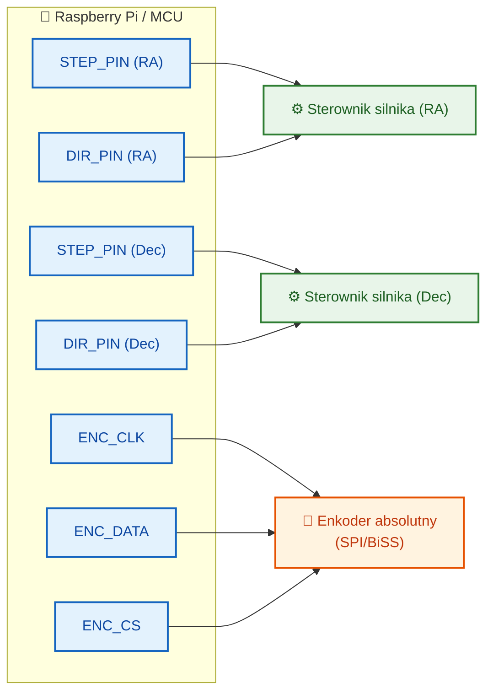

# Alternatywy dla CANopen

## Wprowadzenie

Projekt wykorzystuje obecnie **CANopen (CiA 402)** jako główny protokół komunikacji z napędami montażu teleskopu. Poniższy dokument przedstawia dostępne alternatywy, ich zalety i wady w kontekście sterowania montażem astronomicznym.

---

## Porównanie protokołów

| Protokół | CiA 402 | PDO-like | Determinizm | Koszt | Złożoność | Dojrzałość w astronomii |
|----------|---------|----------|-------------|-------|-----------|------------------------|
| **CANopen** (obecny) | ✅ | ✅ | Wysoki | Średni | Średnia | ⭐⭐ |
| **EtherCAT** | ✅ (CoE) | ✅ | Bardzo wysoki | Wyższy | Wysoka | ⭐ |
| **Modbus TCP** | ❌ | ❌ | Niski | Niski | Niska | ⭐⭐⭐ |
| **Step/Dir** | ❌ | ❌ | Wysoki | **Niski** | **Niska** | ⭐⭐⭐⭐⭐ |
| **CAN FD** | ✅ (CANopen FD) | ✅ | Wysoki | Średni | Niska (migracja) | ⭐ |
| **RS-485/LX200** | ❌ | ❌ | Średni | **Bardzo niski** | Niska | ⭐⭐⭐⭐⭐ |
| **USB** | ❌ | ❌ | Niski | Niski | Średnia | ⭐⭐⭐ |

---

## 1. EtherCAT (Ethernet for Control Automation Technology)

| Cecha | Opis |
|-------|------|
| **Typ** | Przemysłowy Ethernet czasu rzeczywistego |
| **Topologia** | Liniowa (daisy-chain), drzewiasta, gwiazda |
| **Prędkość** | 100 Mbit/s full-duplex |
| **Determinizm** | Bardzo wysoki (< 1 µs jitter) |
| **Profile** | **CoE (CANopen over EtherCAT)** – wspiera CiA 402! |

### Zalety
- Można użyć istniejącego profilu CiA 402 przez CoE
- Znacznie wyższa przepustowość niż CANopen
- Darmowe stacki: **SOEM**, **IgH EtherCAT Master** (Linux)
- Distributed Clocks – idealna synchronizacja wielu osi
- Wsparcie dla "hot connect" – dodawanie/usuwanie urządzeń w locie

### Wady
- Wymaga sprzętu Ethernet (przełączniki, karty sieciowe)
- Wyższy koszt kontrolerów i napędów
- Większe zużycie energii
- Bardziej złożona konfiguracja początkowa

### Zastosowanie w astronomii
- Profesjonalne obserwatoria z wieloma osiami (montaż + derotator + kopuła)
- Systemy wymagające bardzo precyzyjnej synchronizacji (< 1 ms)
- Nowoczesne serwonapędy przemysłowe

---

## 2. CAN FD (CAN with Flexible Data-Rate)

| Cecha | Opis |
|-------|------|
| **Typ** | Rozszerzenie CAN 2.0 |
| **Topologia** | Szyna (taka sama jak CANopen) |
| **Prędkość** | Do 8 Mbit/s (data phase) |
| **Determinizm** | Wysoki (taki sam jak CAN) |
| **Profile** | CANopen FD – rozszerzenie CiA 402 na CAN FD |

### Zalety
- Zachowanie kompatybilności z istniejącym CANopen
- 8× więcej danych na ramkę (64 bajty vs 8)
- Znacznie wyższa prędkość transmisji danych
- Ten sam format ramki, ten sam hardware warstwy fizycznej (z nowymi transceiverami)
- Łatwa migracja – minimalne zmiany w kodzie CiA 402

### Wady
- Wymaga nowych transceiverów CAN FD
- Ograniczona dostępność napędów z natywnym CAN FD
- Mniejszy ekosystem niż klasyczny CANopen

### Zastosowanie w astronomii
- Systemy już oparte na CANopen, które potrzebują zwiększenia przepustowości
- Montaże wymagające transmisji większych pakietów danych (np. rozszerzone dane enkoderów)

---

## 3. Step/Direction + enkoder (np. TMC5160, DM860, Trinamic)

| Cecha | Opis |
|-------|------|
| **Typ** | Sygnały impulsowe + enkoder szeregowy |
| **Topologia** | Punkt-punkt (osobne przewody na oś) |
| **Prędkość** | Ograniczona częstotliwością impulsów (typ. do 500 kHz) |
| **Determinizm** | Wysoki (sprzętowy) |
| **Profile** | Brak standardowego profilu |

### Zalety
- Najprostsze rozwiązanie sprzętowe
- Bardzo tanie sterowniki (TMC5160: ~30 zł, DM860: ~50 zł)
- Sprawdzone w astronomii: **OnStep**, **TeenAstro**, **INDI**, **AstroEQ**
- Duża społeczność i wsparcie
- Cicha praca (stealthChop, spreadCycle w TMC)
- Możliwość użycia enkoderów absolutnych jako sprzężenia zwrotnego

### Wady
- Dużo przewodów (osobne pary na oś)
- Brak standardowego profilu CiA 402 (trzeba implementować własne sterowanie)
- Brak zaawansowanych funkcji bezpieczeństwa (NMT heartbeat, emergency stop)
- Ograniczona prędkość przy bardzo wysokich rozdzielczościach mikrokroku

### Popularne implementacje w astronomii
- **OnStep** – otwarty kontroler montażu EQ, używany przez tysiące astronomów
- **TeenAstro** – kontroler oparty na Teensy, kompatybilny z OnStep
- **AstroEQ** – konwerter EQDIR do sterowania montażami Sky-Watcher

### Przykład podłączenia


---

## 4. Modbus TCP / RTU

| Cecha | Opis |
|-------|------|
| **Typ** | Master-slave, szeregowy (RTU/ASCII) lub Ethernet (TCP) |
| **Topologia** | Szyna (RTU), gwiazda (TCP) |
| **Prędkość** | 115200 bps (RTU), 100 Mbit/s (TCP) |
| **Determinizm** | Niski (polling-based) |
| **Profile** | Brak standardowego profilu napędów |

### Zalety
- Bardzo prosty i tani w implementacji
- Powszechny w przemyśle (sterowniki PLC, falowniki)
- Łatwy w debugowaniu (można monitorować surowe ramki)
- Wsparcie w niemal każdym języku programowania
- Długie kable (RS-485 do 1200m)

### Wady
- Brak standardu CiA 402 (trzeba implementować własny profil napędu)
- Brak mechanizmu PDO (ciągłe pollowanie – większe opóźnienia)
- Niska wydajność przy wielu osiach (każda oś wymaga osobnego zapytania)
- Brak mechanizmu heartbeat/node guarding

### Zastosowanie w astronomii
- Sterowanie kopułami i obrotnicami (często używają Modbus)
- Integracja z istniejącymi systemami przemysłowymi w obserwatorium
- Proste montaże z jednym silnikiem

---

## 5. RS-485 + LX200 / własny protokół

| Cecha | Opis |
|-------|------|
| **Typ** | Szeregowy różnicowy half-duplex |
| **Topologia** | Szyna (multidrop) |
| **Prędkość** | Do 10 Mbit/s (krótkie dystanse), typ. 115200-921600 bps |
| **Determinizm** | Średni (zależy od implementacji) |
| **Profile** | Brak standardu (LX200, NexStar mają własne protokoły) |

### Zalety
- Bardzo tani (max232 + DB9, lub FTDI)
- Powszechny w astronomii (Meade LX200, Celestron NexStar)
- Standard **LX200** – dobrze udokumentowany, prosty
- Długie kable (RS-485 do 1200m)
- Kompatybilność z istniejącymi montażami i softem (ASCOM, Stellarium, INDI)

### Wady
- Ograniczona przepustowość
- Brak standardu CiA 402
- Brak zaawansowanych funkcji bezpieczeństwa
- Ograniczona liczba urządzeń na szynie (RS-485: 32, RS-232: 1)

### Komendy LX200 (przykład)
```
:Sr 12:34:56#    – Set RA
:Sd +45:12:34#   – Set Dec
:MS#             – Slew to target
:Q#              – Stop slewing
:GR#             – Get RA
:GD#             – Get Dec
:GW#             – Get tracking frequency
```

---

## 6. USB + libusb / USB CDC

| Cecha | Opis |
|-------|------|
| **Typ** | Universal Serial Bus |
| **Topologia** | Gwiazda (host-device) |
| **Prędkość** | 480 Mbit/s (USB 2.0) |
| **Determinizm** | Niski (host-controlled) |
| **Profile** | Brak standardu napędów |

### Zalety
- Powszechny, plug-and-play
- Wysoka przepustowość
- Łatwy w implementacji (USB CDC = wirtualny port szeregowy)
- Wsparcie w każdym systemie operacyjnym

### Wady
- Ograniczona długość kabla (5m bez repeatera)
- Brak determinizmu (host-controlled, USB polling)
- Problemy z EMI w obserwatorium (szumy, zakłócenia)
- Trudności z rozszerzaniem na wiele urządzeń (huby)

---

## Rekomendacje w zależności od scenariusza

| Scenariusz | Najlepsza alternatywa | Uzasadnienie |
|------------|----------------------|--------------|
| **Nowoczesne serwonapędy przemysłowe** | **EtherCAT (CoE)** | W pełni kompatybilny z CiA 402, znacznie wyższa wydajność, standard w przemyśle |
| **Budżetowy montaż amatorski** | **Step/Dir + TMC5160** | Sprawdzone w OnStep/INDI, tanie, łatwe w implementacji, ciche |
| **Ewolucja istniejącego CANopen** | **CAN FD** | Minimalna zmiana w kodzie, znaczący wzrost wydajności, zachowanie topologii |
| **Integracja z legacy mounts** | **RS-485 + LX200** | Współpraca z istniejącymi montażami (Celestron, Meade) |
| **Prosty upgrade przepustowości** | **CAN FD** | Ten sam hardware warstwy fizycznej (z nowymi transceiverami) |
| **System czasu rzeczywistego** | **EtherCAT** | Najlepszy determinizm, wsparcie distributed clocks, synchronizacja < 1 µs |
| **Sterowanie kopułą/osprzętem** | **Modbus TCP/RTU** | Powszechny w osprzęcie obserwatoryjnym, prosty, tani |

---

## Architektura HAL a alternatywy

Obecna architektura warstwy HAL jest zaprojektowana w sposób umożliwiający łatwą wymianę implementacji transportowej. Interfejs `HALInterface` oraz fabryka `HALFactory` pozwalają na dodanie nowego typu HAL bez modyfikacji istniejącego kodu sterownika montażu.

### Obsługiwane typy HAL (z dokumentacji)

| Typ | Enum | Status |
|-----|------|--------|
| Symulowany | `HALType::SIMULATED` | ✅ Zaimplementowany |
| CANopen | `HALType::CANOPEN` | ✅ Zaimplementowany |
| Szeregowy | `HALType::SERIAL` | ⏳ Planowany |
| Ethernet | `HALType::ETHERNET` | ⏳ Planowany |
| Niestandardowy | `HALType::CUSTOM` | 🔧 Rozszerzalny |

### Mapa alternatyw do typów HAL

| Alternatywa | Typ HAL | Uwagi |
|-------------|---------|-------|
| EtherCAT (CoE) | `ETHERNET` | Przez stos EtherCAT z warstwą CoE |
| CAN FD | `CANOPEN` | Naturalne rozszerzenie – wymaga nowego sterownika CAN FD |
| Step/Direction | `SERIAL` lub `CUSTOM` | Sterowniki przez GPIO lub USB |
| Modbus TCP | `ETHERNET` | Implementacja przez stos Modbus |
| Modbus RTU | `SERIAL` | Implementacja przez RS-485 |
| LX200/RS-485 | `SERIAL` | Implementacja przez port szeregowy |

---

## Odnośniki

- [README (PL)](README.md)
- [Dokumentacja warstwy HAL](hal_layer.md)
- [Dokumentacja API](api.md)
- [Instalacja i konfiguracja](installation.md)

---

*Ostatnia aktualizacja: 30 kwietnia 2026*
