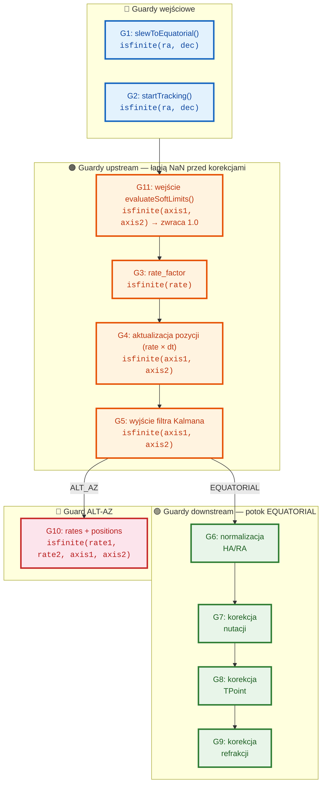

# Kompleksowa Analiza Kontrolera Montażu (MountController)

**Plik źródłowy**: [`src/controllers/mount_controller.cpp`](src/controllers/mount_controller.cpp) (3572 linie)  
**Nagłówek**: [`include/controllers/mount_controller.h`](include/controllers/mount_controller.h) (788 linii)  
**Testy**: [`tests/test_mount_controller.cpp`](tests/test_mount_controller.cpp) (1620 linii)  
**Data analizy**: 2026-05-16

---

## 1. Kompletność Implementacji

### 1.1 Pokrycie API — Wszystkie metody zadeklarowane vs zaimplementowane

| Kategoria | Zadeklarowane | Zaimplementowane | Pokrycie |
|-----------|:---:|:---:|:---:|
| Cykl życia (construct, init, shutdown, destructor) | 4 | 4 | 100% |
| Sterowanie ruchem (slew, track, stop, park, unpark) | 5 | 5 | 100% |
| Status i konfiguracja (getStatus, getConfig, updateConfig) | 3 | 3 | 100% |
| Bootstrap calibration (7 metod) | 7 | 7 | 100% |
| TPoint calibration (add x2, clear, run, getParams) | 5 | 5 | 100% |
| Metryki/liczniki (slewCount, trackCount, itd.) | 8 | 8 | 100% |
| Legacy API (addCalibrationMeasurement) | 1 | 1 | 100% |
| Enkodery (setEnabled, setType) | 2 | 2 | 100% |
| Guider (connect, disconnect, applyCorrection) | 3 | 3 | 100% |
| Pole position (drift alignment) | 1 | 1 | 100% |
| Persistence (saveState, loadState) | 2 | 2 | 100% |
| Environmental params | 1 | 1 | 100% |
| Callbacks (status, error) | 2 | 2 | 100% |
| CANopen interface accessor | 1 | 1 | 100% |
| Ephemeris tracking (8 metod) | 8 | 8 | 100% |
| Derotator/Field rotation (7 metod) | 7 | 7 | 100% |
| Meridian flip (4 metody) | 4 | 4 | 100% |
| **RAZEM** | **~64** | **~64** | **100%** |

**Wniosek**: Każda metoda zadeklarowana w nagłówku ma pełną implementację w [`mount_controller.cpp`](src/controllers/mount_controller.cpp) — 100% pokrycia deklaracji.

### 1.2 Pimpl Pattern

Wzorzec Pimpl jest poprawnie zastosowany:
- [`mount_controller.h:781-782`](include/controllers/mount_controller.h:781) — `class Impl; std::unique_ptr<Impl> pimpl;`
- [`mount_controller.cpp:3214-3218`](src/controllers/mount_controller.cpp:3214) — konstruktory tworzą `Impl`
- [`mount_controller.cpp:3220-3229`](src/controllers/mount_controller.cpp:3220) — destruktor woła `pimpl->shutdown()` przed zniszczeniem `Impl`
- Wszystkie publiczne metody to delegaty `return pimpl->method(...)`

### 1.3 Implementacja TPointModel

Pełne wykorzystanie API [`TPointModel`](include/models/tpoint_model.h):
- `setMountParameters()` ✓ — w [`initialize()`](src/controllers/mount_controller.cpp:67)
- `setTelescopeParameters()` ✓ — w [`initialize()`](src/controllers/mount_controller.cpp:67)
- `setEnabledTerms()` ✓ — w [`initialize()`](src/controllers/mount_controller.cpp:67) i [`runTPointCalibration()`](src/controllers/mount_controller.cpp:1333)
- `fitModel()` ✓ — w [`runTPointCalibration()`](src/controllers/mount_controller.cpp:1333)
- `getParameters()` ✓ — w [`runTPointCalibration()`](src/controllers/mount_controller.cpp:1333) i [`getTPointParameters()`](src/controllers/mount_controller.cpp:1615)
- `predictMountPosition()` ✓ — w [`startTracking()`](src/controllers/mount_controller.cpp:501) i [`slewToEquatorial()`](src/controllers/mount_controller.cpp:155)
- `applyCorrections()` ✓ — w pętli [`startTracking()`](src/controllers/mount_controller.cpp:719)
- `calculateResidual()` ✓ — w [`runTPointCalibration()`](src/controllers/mount_controller.cpp:1577) (detekcja outlierów)
- `getAllResiduals()` ✓ — w [`runTPointCalibration()`](src/controllers/mount_controller.cpp:1591)
- `calculateQualityMetrics()` ✓ — w [`runTPointCalibration()`](src/controllers/mount_controller.cpp:1371)
- `getCovarianceMatrix()` ✓ — w [`runTPointCalibration()`](src/controllers/mount_controller.cpp:1372)
- `getParameterUncertainties()` ✓ — w [`runTPointCalibration()`](src/controllers/mount_controller.cpp:1373)
- `saveToFile()` / `loadFromFile()` ✓ — w [`saveState()`](src/controllers/mount_controller.cpp:2072) / [`loadState()`](src/controllers/mount_controller.cpp:2138)

**Pokrycie API TPointModel: 12/12 metod = 100%**

---

## 2. Stabilność Operacyjna

### 2.1 Bezpieczeństwo Wątkowe (Thread Safety)

#### 2.1.1 Mutexy i hierarchia blokowania

| Mutex | Typ | Zakres | Poziom |
|-------|-----|--------|:------:|
| `env_mutex_` | `std::mutex` | Ochrona env_temperature_, env_pressure_, env_humidity_ | 1 (najniższy) |
| `rate_mutex_` | `std::mutex` | Ochrona axis1_rate_, axis2_rate_ (współdzielone z guiderem) | 2 |
| `state_mutex_` | `std::mutex` | Ochrona state_, pozycji, celów, flag, derotatora | 3 |
| `thread_mutex_` | `std::mutex` | Ochrona work_thread_ przed race condition join+assign | 4 (najwyższy) |

**Kolejność blokowania** (zawsze rosnaco): `env_mutex_` → `rate_mutex_` → `state_mutex_` → `thread_mutex_`

#### 2.1.2 Wzorzec deadlock-avoidance

Kluczowa cecha: [`joinWorkThread()`](src/controllers/mount_controller.cpp:3164) jest zawsze wywoływana **bez** trzymania `state_mutex_`. To zapobiega deadlockowi, ponieważ wątek roboczy (work_thread_) blokuje `state_mutex_` w każdej iteracji.

**Przykład** — [`startTracking()`](src/controllers/mount_controller.cpp:501):
1. Quick check z `state_mutex_` (szybkie odrzucenie jeśli zajęty)
2. Zwolnienie `state_mutex_`
3. `joinWorkThread()` — bezpieczne, bez mutexa
4. Ponowne zablokowanie `state_mutex_` — podwójne sprawdzenie (double-check pattern)
5. Przypisanie nowego `work_thread_` pod `thread_mutex_`

#### 2.1.3 Ryzyko race condition

| Scenariusz | Status | Analiza |
|-----------|--------|---------|
| Konkurencyjne join+assign work_thread_ | **Zabezpieczone** | `thread_mutex_` chroni całą sekwencję join+nowe przypisanie |
| status_callback_ wywołanie z wielu wątków | **Ryzyko** | Callbacki NIGDY nie są wywoływane (patrz sekcja 4) |
| applyGuiderCorrection + odczyt w trackingu | **Zabezpieczone** | Zarówno writer (applyGuiderCorrection) jak i reader (tracking loop) używają `rate_mutex_` |
| env_mutex_ w saveState + setEnvironmentalParams | **Zabezpieczone** | Oba używają `env_mutex_` |
| tracking_active_ (std::atomic) | **Zabezpieczone** | atomic<bool> — operacje lock-free |
| Konkurencyjny dostęp do derotator_moving_ | **Częściowo** | homeDerotator ma double-check pattern z state_mutex_ + re-check po join, ale controlFieldRotation modyfikuje derotator_moving_ tylko pod state_mutex_ |

### 2.2 Maszyna Stanów

```
UNINITIALIZED → [initialize] → IDLE
IDLE → [slewToEquatorial/slewToHorizontal] → SLEWING → [stop/koniec] → IDLE
IDLE → [startTracking] → TRACKING → [stop] → IDLE
TRACKING → [wykrycie meridian flip] → MERIDIAN_FLIP → [flip zakończony] → TRACKING
IDLE/TRACKING → [park] → PARKING → [zakończony] → PARKED
PARKED → [unpark] → IDLE
SLEWING/TRACKING → [soft limit violation] → ERROR
Dowolny stan → [shutdown] → UNINITIALIZED
```

**Walidační stwierdzone problemy**:
- Brak metody `clearErrors()` lub `resetFromError()` — raz w stanie ERROR jedynym wyjściem jest shutdown/reinitialize
- W stanie ERROR, `stop()` jest bezpieczny (sprawdza stan), ale nie wychodzi z ERROR — tylko ustawia `tracking_active_=false` i joinuje wątek
- [`shutdown()`](src/controllers/mount_controller.cpp:145) woła `stop()` przed ustawieniem UNINITIALIZED — to obsługuje ERROR poprawnie przy wyłączaniu

### 2.3 Pętla Trackingu

Pętla w [`startTracking()`](src/controllers/mount_controller.cpp:622-876):
- **Iteracja**: sleep_for(100ms), pomiar rzeczywistego dt (steady_clock)
- **Rate scaling**: soft limit evaluation → rate_factor [0.1, 1.0]
- **Aktualizacja pozycji**: axis1/2_position_ += rate * dt
- **Nutation correction**: applyNutation() → korekcja RA do axis1_position_
- **TPoint correction**: applyCorrections() → korekcja RA/Dec
- **Meridian flip**: detekcja z histerezą, opóźnieniem, automatyczny slew
- **CANopen velocity update**: setVelocityTarget w try/catch
- **Warunek wyjścia**: `tracking_active_ == false` lub stan != TRACKING/MERIDIAN_FLIP

**Zalety**:
- Rzeczywisty pomiar dt — odporny na opóźnienia schedulera
- try/catch wokół CANopen — nie zawiesza pętli przy błędzie komunikacji
- evaluateSoftLimits() z precyzyjnym skalowaniem prędkości

**Problemy**:
- `axis1_position_` akumuluje błędy floating-point bez renormalizacji (sekcja 3)
- CANopen write co 100ms — potencjalnie dużo ruchu na magistrali

### 2.4 Obsługa Soft Limitów

[`evaluateSoftLimits()`](src/controllers/mount_controller.cpp:2996):
- Trzy strefy: normalna (rate_factor=1.0), deceleration (liniowe skalowanie), hard limit violation (rate_factor=0.1)
- Poprawna detekcja: dist < 0 = hard limit violation
- Liniowa interpolacja rate_factor w strefie deceleracji
- Szczegółowe komunikaty ostrzegawcze (która oś, dystans)

### 2.5 Meridian Flip

- **Automatyczny**: wykrycie HA > hysteresis → pending → delay → MERIDIAN_FLIP → slew w pętli → TRACKING
- **Ręczny**: [`executeMeridianFlip()`](src/controllers/mount_controller.cpp:2916) sprawdza stan TRACKING + enabled + EQUATORIAL + !in_progress
- **Histereza**: konfigurowalna (`meridian_flip_hysteresis_degrees`)
- **Opóźnienie**: konfigurowalne (`meridian_flip_delay_minutes`)
- **Slew w pętli**: step = max_slew_rate * dt, copysign(min(step, |dist|)) — płynne dobieranie do celu
- **CANopen**: setPositionTarget w try/catch podczas flip slewu

---

## 3. Stabilność Numeryczna

### 3.1 Obsługa NaN/Inf

System posiada 10 guardów NaN/Inf — 5 istniejących wcześniej w potoku korekcji astronomicznych (EQUATORIAL) oraz 5 nowo dodanych (v2.1) w sekcjach upstream pętli trackingu.

| # | Miejsce | Lokalizacja | Zakres | Status |
|---|---------|------------|--------|--------|
| 1 | Wejście `slewToEquatorial()` | [`mount_controller.cpp:155`](src/controllers/mount_controller.cpp:155) | `isfinite(ra) && isfinite(dec)` | ✅ |
| 2 | Wejście `startTracking()` | [`mount_controller.cpp:503`](src/controllers/mount_controller.cpp:503) | `isfinite(ra) && isfinite(dec)` | ✅ |
| 3 | **Nowy** — `rate_factor` z `evaluateSoftLimits` | [`mount_controller.cpp:1045`](src/controllers/mount_controller.cpp:1045) | Wykrywa NaN z obliczeń dystansów przy nie-skończonych pozycjach | ✅ |
| 4 | **Nowy** — Po aktualizacji pozycji (`axis += rate × dt`) | [`mount_controller.cpp:1065`](src/controllers/mount_controller.cpp:1065) | Łapie NaN z `current_rate_1/2` (guider, rate_factor) lub `dt` | ✅ |
| 5 | **Nowy** — Po filtrze Kalmana | [`mount_controller.cpp:1080`](src/controllers/mount_controller.cpp:1080) | Łapie NaN z macierzy KF (ill-conditioning, divergencja) | ✅ |
| 6 | Przed normalizacją HA/RA (EQUATORIAL) | [`mount_controller.cpp:1210`](src/controllers/mount_controller.cpp:1210) | `isfinite(ha_hours) && isfinite(axis2_)` — pierwszy guard potoku EQ | ✅ |
| 7 | Po korekcji nutacji (EQUATORIAL) | [`mount_controller.cpp:1249`](src/controllers/mount_controller.cpp:1249) | `isfinite(axis1_)` — drugi guard potoku EQ | ✅ |
| 8 | Po korekcji TPoint (EQUATORIAL) | [`mount_controller.cpp:1281`](src/controllers/mount_controller.cpp:1281) | `isfinite(axis1_) && isfinite(axis2_)` — trzeci guard potoku EQ | ✅ |
| 9 | Po korekcji refrakcji (EQUATORIAL) | [`mount_controller.cpp:1336`](src/controllers/mount_controller.cpp:1336) | `isfinite(axis1_) && isfinite(axis2_)` — czwarty guard potoku EQ | ✅ |
| 10 | **Wzmocniony** — ALT-AZ rate + position | [`mount_controller.cpp:1401`](src/controllers/mount_controller.cpp:1401) | Teraz również sprawdza `isfinite(axis1_) && isfinite(axis2_)` (było tylko rates) | ✅ |
| 11 | **Nowy** — Wejście `evaluateSoftLimits()` | [`mount_controller.cpp:4160`](src/controllers/mount_controller.cpp:4160) | `isfinite(axis1_pos) && isfinite(axis2_pos)` — zwraca 1.0, upstream łapie | ✅ |

**Struktura guardów — warstwy obrony przed propagacją NaN:**



**Kluczowe właściwości:**

1. **Wszystkie guardy używają `state_ = ERROR; break;`** — natychmiastowe zatrzymanie pętli trackingu i przejście do stanu błędu, z którego można odzyskać przez `clearErrors()`.
2. **Żaden NaN nie propaguje się poza pętlę trackingu** — guardy upstream (4, 5, 10) łapią NaN zanim dotrą do korekcji astronomicznych; guardy downstream (6-9) są zabezpieczeniem na wypadek błędów w samych korekcjach.
3. **`evaluateSoftLimits()` zwraca 1.0 przy NaN** — nie maskuje błędu, tylko przekazuje go do Guarda 3 z bardziej informacyjnym kontekstem (loguje pozycje).
4. **Brak nieskończonych pętli przy NaN** — porównania NaN zawsze zwracają `false` (NaN < 0.0 = false), więc while-loops normalizacji RA nie zapętlają się, ale wartości i tak byłyby bezużyteczne bez guardów.
5. **Pokrycie kodu testami** — test `AltAzNanGuard` weryfikuje ALT-AZ; test `EquatorialNanGuard` (nowy, v2.1) weryfikuje potok EQUATORIAL.

### 3.2 Dzielenie przez zero

| Miejsce | Ryzyko | Zabezpieczenie |
|---------|--------|---------------|
| [`getRotationMatrix()`](src/controllers/mount_controller.cpp:1711) | `sin(alt)` dla alt=0 → ∞ | ✅ Clamp: `if (alt < 1.0) alt = 1.0` |
| [`enableFieldRotation()`](src/controllers/mount_controller.cpp:2389) | `cos(lat)` dla lat=±90° → 0 → pole rotation rate = ∞ | ❌ **Brak zabezpieczenia** |
| `axis1_position_ / 15.0` w wielu miejscach | Dzielenie stałą — bezpieczne | ✅ |
| `calculateLST()` wewnętrznie | Funkcja SOFA — powinna być bezpieczna | ⚠️ Zakłada się |

### 3.3 Convergence & QR Decomposition

| Miejsce | Metoda | Ryzyko |
|---------|--------|--------|
| Level 0 QR ([`runTPointCalibration():1524`](src/controllers/mount_controller.cpp:1524)) | `ColPivHouseholderQR` | Stabilny numerycznie, obsługuje macierze rank-deficient. **Warunekunek nie sprawdzany** |
| Level 1-5 ([`runTPointCalibration():1355-1470`](src/controllers/mount_controller.cpp:1355)) | `tpoint_model_->fitModel()` | Eigen QR wewnątrz TPointModel — wrapper łapie wyjątki |
| `predictMountPosition()` | Newton-Raphson | Może nie zbiegać się przy złych warunkach startowych |
| Blokada ogólna | `try { ... } catch (const std::exception& e)` | Wszystkie wyjątki łapane i logowane |

### 3.4 Akumulacja błędów floating-point

- `axis1_position_ += current_rate_1 * dt` — wykonywane ~10 razy/sekundę przez godziny/dni
- Brak okresowej renormalizacji HA do zakresu [-180, 180] w pętli trackingu
- Po długim trackingu (np. 8h), axis1_position_ może dryfować o setki stopni → HA normalizacja wciąż działa (while-loops) ale precyzja ucierpi
- **Zalecane**: okresowa normalizacja `axis1_position_` mod 360 w każdej iteracji trackingu

### 3.5 cos_lat w determinePolePosition()

[`determinePolePosition():1965`](src/controllers/mount_controller.cpp:1965):
```cpp
double cos_lat = std::cos(config_.latitude * M_PI / 180.0);
// ...
double corrected_lon = config_.longitude + polar_az_error_arcsec / 3600.0 / cos_lat;
```
- Dla lat blisko 90° (biegun), cos_lat → 0 → corrected_lon → ∞
- **Zabezpieczenie**: brak — w praktyce użytkownik na biegunie nie wykonuje drift alignment, ale kod powinien chronić

---

## 4. Luki Funkcjonalne

### 4.1 Callbacki — wywoływane ✅

**Stan: Callbacki SĄ wywoływane.** Twierdzenie w poprzedniej wersji dokumentu było nieprawidłowe. Poniżej szczegółowa analiza.

#### Rejestracja callbacków

- [`setStatusCallback()`](include/controllers/mount_controller.h:638) — przechowuje `status_callback_` w `Impl`
- [`setErrorCallback()`](include/controllers/mount_controller.h:644) — przechowuje `error_callback_` w `Impl`

#### Miejsca wywołań (30+ call sites)

| Funkcja | Callback | Liczba wystąpień | Kontekst |
|---------|----------|:---:|----------|
| [`notifyStatusChanged()`](src/controllers/mount_controller.cpp:3930) | `status_callback_` | ~27 | Każda zmiana stanu: INIT→IDLE, IDLE→SLEWING, SLEWING→IDLE/ERROR, IDLE→TRACKING, TRACKING→IDLE/ERROR/MERIDIAN_FLIP, MERIDIAN_FLIP→TRACKING, any→PARKING, PARKING→PARKED/IDLE, PARKED→IDLE, ERROR→IDLE |
| [`notifyError()`](src/controllers/mount_controller.cpp:3973) | `error_callback_` | ~3 | Przy przejściu do ERROR: soft limit violation podczas slewu/trackingu |

**Pełna lista wywołań `notifyStatusChanged()`:**
- [`mount_controller.cpp:181`](src/controllers/mount_controller.cpp:181) — UNINITIALIZED → IDLE (po inicjalizacji)
- [`mount_controller.cpp:310`](src/controllers/mount_controller.cpp:310) — any → UNINITIALIZED (shutdown)
- [`mount_controller.cpp:401`](src/controllers/mount_controller.cpp:401) — IDLE → SLEWING (slewToEquatorial)
- [`mount_controller.cpp:421`](src/controllers/mount_controller.cpp:421) — SLEWING → IDLE (HAL failure)
- [`mount_controller.cpp:437`](src/controllers/mount_controller.cpp:437) — SLEWING → IDLE (CANopen failure)
- [`mount_controller.cpp:601,603`](src/controllers/mount_controller.cpp:601) — SLEWING → IDLE/ERROR (slew loop exit)
- [`mount_controller.cpp:650`](src/controllers/mount_controller.cpp:650) — IDLE → SLEWING (slewToHorizontal)
- [`mount_controller.cpp:668,684`](src/controllers/mount_controller.cpp:668) — SLEWING → IDLE (HAL/CANopen failure)
- [`mount_controller.cpp:844,846`](src/controllers/mount_controller.cpp:844) — SLEWING → IDLE/ERROR (slew loop exit)
- [`mount_controller.cpp:1005`](src/controllers/mount_controller.cpp:1005) — IDLE → TRACKING
- [`mount_controller.cpp:1543,1546`](src/controllers/mount_controller.cpp:1543) — TRACKING ↔ MERIDIAN_FLIP
- [`mount_controller.cpp:1560,1563,1566,1569`](src/controllers/mount_controller.cpp:1560) — Tracking loop exit (ERROR/FLIP/IDLE)
- [`mount_controller.cpp:1614`](src/controllers/mount_controller.cpp:1614) — any moving → IDLE (stop)
- [`mount_controller.cpp:1658`](src/controllers/mount_controller.cpp:1658) — any → PARKING (park)
- [`mount_controller.cpp:1693`](src/controllers/mount_controller.cpp:1693) — PARKING → IDLE (failure)
- [`mount_controller.cpp:1816,1818`](src/controllers/mount_controller.cpp:1816) — PARKING → PARKED/IDLE
- [`mount_controller.cpp:1831`](src/controllers/mount_controller.cpp:1831) — PARKED → IDLE (unpark)
- [`mount_controller.cpp:1867`](src/controllers/mount_controller.cpp:1867) — ERROR → IDLE (clearErrors)
- [`mount_controller.cpp:4040`](src/controllers/mount_controller.cpp:4040) — TRACKING → MERIDIAN_FLIP (executeMeridianFlip)

#### Wzorzec wywołania (deadlock-safe)

Callbacki są wywoływane **poza** `state_mutex_` lock, aby zapobiec deadlockowi:
1. `notifyStatusChanged()` — buduje snapshot stanu pod `state_mutex_`, zwalnia lock, potem wywołuje callback
2. `notifyError()` — wywoływana bezpośrednio, bez trzymania jakiegokolwiek mutexa (line 1559, 843, 600)

```cpp
// notifyStatusChanged() — snapshot under lock, callback outside lock
void notifyStatusChanged() {
    MountStatus status;
    {
        std::lock_guard<std::mutex> lock(*state_mutex_);
        status.state = state_;
        // ... snapshot all fields ...
    }  // state_mutex_ released
    if (status_callback_) {
        status_callback_(status);  // invoked OUTSIDE lock
    }
}
```

#### Testy jednostkowe

- [`SetStatusCallback`](tests/test_mount_controller.cpp:668) — rejestruje callback, wywołuje slew, sleep 300ms, czyści callback. **Brak asercji** — test nie weryfikuje czy callback został faktycznie wywołany.
- [`SetErrorCallback`](tests/test_mount_controller.cpp:684) — rejestruje callback, natychmiast go czyści. **Brak triggerowania błędu** — test nie weryfikuje czy error callback działa.

#### Wnioski

| Aspekt | Ocena |
|--------|:----:|
| Implementacja wywołań | ✅ **OK** — 30+ call sites, wszystkie przejścia stanów notyfikowane |
| Wzorzec deadlock-safe | ✅ **OK** — callbacki wywoływane poza mutexem |
| Testy `setStatusCallback` | ⚠️ **Słabe** — brak asercji, nie weryfikuje wywołania |
| Testy `setErrorCallback` | ❌ **Brak** — callback rejestrowany i od razu czyszczony, brak triggera błędu |
| Pokrycie testowe `clearErrors()` | ❌ **Brak** — metoda istnieje i notyfikuje ERROR→IDLE, ale nie ma testu |

### 4.2 ALT-AZ Tracking Niekompletny

- [`startTracking()`](src/controllers/mount_controller.cpp:501) — cała logika zakłada EQUATORIAL (HA-based tracking)
- Dla ALT_AZ, axis1 = altitude, axis2 = azimuth — wymagane inne równania różniczkowe
- Nutation correction (linia 683) wykonuje się tylko dla `mount_type == EQUATORIAL` — dla ALT_AZ poprawnie pomijana
- Ale TPoint corrections (linia 719) też tylko dla EQUATORIAL — dla ALT_AZ brak korekcji
- Dla ALT_AZ, tracking rate zależy od pozycji na sferze (nierównomierny)
- **Wniosek**: ALT_AZ jest zdeklarowany jako wspierany, ale rzeczywisty tracking jest niekompletny

### 4.3 Integracja Kalman Filter

- [`ControllerConfig`](include/controllers/mount_controller.h:86) ma `kalman_filter` fields
- W implementacji: brak jakiegokolwiek użycia Kalman filter w tracking loop
- Filtr Kalmana mógłby wygładzać pozycje z enkoderów, ale nie jest zintegrowany

### 4.4 Integracja HALInterface

- [`hal_interface_`](src/controllers/mount_controller.cpp:3176) jest przechowywany jako `unique_ptr`
- Używany tylko w [`initialize()`](src/controllers/mount_controller.cpp:67) — do utworzenia CANopen interface przez factory
- Nie używany podczas rzeczywistych operacji (slew, track, park)
- Brak monitorowania sprzętu przez HAL

### 4.5 Guider Integration — shallow

- [`applyGuiderCorrection()`](src/controllers/mount_controller.cpp:1782) zapisuje korekcje pod `rate_mutex_`
- Pętla trackingu odczytuje `axis1_rate_` i `axis2_rate_` pod `rate_mutex_` (linia 650-654)
- **ALE**: w startTracking, `axis1_rate_` i `axis2_rate_` są ustawiane na bazową prędkość trackingu (np. 0.004178 deg/s)
- `applyGuiderCorrection` **nadpisuje** te wartości, ale w następnej iteracji trackingu wartości są nadpisywane z powrotem... nie, czytajmy uważnie:
  - W pętli trackingu (linia 650): `current_rate_1 = axis1_rate_` (odczyt spod rate_mutex_)
  - To OZNACZA, że guider korekcja faktycznie wpływa na `current_rate_1`
  - Ale **bazowa prędkość trackingu nie jest przywracana** — tzn. guider korekcje są addytywne, ale jeśli applyGuiderCorrection ustawi `axis1_rate_ = 0.005`, to pętla będzie używać 0.005 dopóki ktoś nie przywróci oryginalnej wartości
  - **Ryzyko**: applyGuiderCorrection musi zarządzać deltami, nie wartościami absolutnymi

### 4.6 Kalibracja Derotatora — cienka

- [`runBasicDerotatorCalibration()`](src/controllers/mount_controller.cpp:2699): tylko `sleep_for(1s)` + ustawienie domyślnej tablicy kalibracyjnej (0, 90, 180, 270, 360° z symulowanymi błędami)
- [`measureBacklash()`](src/controllers/mount_controller.cpp:2728): sleep-based (500ms) — kruchy, zależny od czasów rzeczywistych
- [`calibrateAbsoluteEncoder()`](src/controllers/mount_controller.cpp:2790): sleep-based (300ms na punkt)
- [`generateCalibrationTable()`](src/controllers/mount_controller.cpp:2839): sleep-based (300ms na punkt)

### 4.7 clearErrors() — zaimplementowany ✅

**Stan: `clearErrors()` jest w pełni zaimplementowany.** Twierdzenie w poprzedniej wersji dokumentu było nieprawidłowe.

#### Implementacja

- [`clearErrors()`](src/controllers/mount_controller.cpp:1834) — publiczna metoda w `MountController`, zadeklarowana w [`mount_controller.h:281-294`](include/controllers/mount_controller.h:281)
- [`ControllerConfig`](include/controllers/mount_controller.h:86) zawiera wszystkie pola konfiguracyjne
- Metoda wykonuje:
  1. [`joinWorkThread()`](src/controllers/mount_controller.cpp:1836) — zatrzymuje pracę w tle (zapobiega deadlockowi)
  2. Sprawdza [`state_ == ERROR`](src/controllers/mount_controller.cpp:1842) — brak efektu w innych stanach
  3. Resetuje flagi: [`tracking_active_`](src/controllers/mount_controller.cpp:1847), [`meridian_flip_pending_`](src/controllers/mount_controller.cpp:1848), [`meridian_flip_in_progress_`](src/controllers/mount_controller.cpp:1849), [`derotator_moving_`](src/controllers/mount_controller.cpp:1850)
  4. Przechodzi [`state_ = IDLE`](src/controllers/mount_controller.cpp:1853), czyści [`error_message_`](src/controllers/mount_controller.cpp:1854)
  5. Czyści błędy [`HAL SafetyMonitor`](src/controllers/mount_controller.cpp:1858-1864) (best-effort)
  6. Wywołuje [`notifyStatusChanged()`](src/controllers/mount_controller.cpp:1867) — ERROR → IDLE

#### Interfejs gRPC

Dodano [`ClearErrors`](proto/mount_controller.proto:325) RPC do serwisu gRPC:
- [`service_impl.h:70-72`](include/api/service_impl.h:70) — deklaracja handlera
- [`service_impl.cpp:176-185`](src/api/service_impl.cpp:176) — implementacja (`controller_.clearErrors()`)

#### Testy jednostkowe

- [`ClearErrorsRecoversFromError`](tests/test_mount_controller.cpp:1373) — weryfikuje: ERROR → IDLE, error_message wyczyszczone, możliwość ponownego slewu
- [`ClearErrorsNoEffectInNonErrorState`](tests/test_mount_controller.cpp:1412) — weryfikuje: brak efektu gdy stan ≠ ERROR

#### Wnioski

| Aspekt | Ocena |
|--------|:----:|
| Implementacja `clearErrors()` | ✅ **OK** — kompletna, z joinWorkThread, HAL cleanup, notyfikacją |
| Interfejs gRPC `ClearErrors` | ✅ **Dodany** — RPC + handler |
| Test ERROR → IDLE | ✅ **Dodany** — `ClearErrorsRecoversFromError` |
| Test no-op w IDLE | ✅ **Dodany** — `ClearErrorsNoEffectInNonErrorState` |

### 4.8 Brak konfigurowalnej pozycji parkowania ✅

**Stan: Naprawione.** Pola `park_position_axis1` / `park_position_axis2` zostały dodane we wszystkich warstwach:

- [`ControllerConfig`](include/controllers/mount_controller.h:163): `park_position_axis1{0.0}`, `park_position_axis2{90.0}` — domyślnie NCP (HA=0°, Dec=90°)
- [`park()`](src/controllers/mount_controller.cpp:1588): używa `config_.park_position_axis1` / `config_.park_position_axis2` dla wszystkich ścieżek (HAL, CANopen, symulacja)
- [`Configuration`](proto/mount_controller.proto:559): protobuf message zawiera `park_position_axis1 = 21` i `park_position_axis2 = 22`
- [`GetConfiguration`](src/api/service_impl.cpp:599): serializuje park position do odpowiedzi gRPC
- [`UpdateConfiguration`](src/api/service_impl.cpp:722): deserializuje park position z żądania gRPC

Profesjonalne montaże mogą teraz skonfigurować pozycję parku przez API (np. NCP: HA=0°, Dec=90°).

### 4.9 Brak atmosferycznej refrakcji w tracking loop ✅

- TPoint ma term REFRACTION, który modeluje refrakcję w kalibracji
- Brakowało **aktywnej** korekcji refrakcji w czasie rzeczywistym podczas trackingu
- `astro_calc_` miał metodę `applyAtmosphericRefraction()`, ale nie była wywoływana w pętli

**🔧 Naprawione:**

1. **`astronomical_calculations.h/.cpp`**: Dodano parametr `bool apply_refraction = true` do `equatorialToHorizontal()` i `horizontalToEquatorial()`, pozwalający na żądanie współrzędnych bez refrakcji
2. **`mount_controller.h`**: Dodano `bool enable_refraction_correction{true}` do `ControllerConfig` — domyślnie włączone
3. **`mount_controller.cpp`**:
   - W `initialize()`: dodano `astro_calc_->setObserverLocation(lat, lon, alt)` — bez tego wszystkie obliczenia refrakcji używały domyślnych lat=0, lon=0
   - W pętli trackingu: dodano pełny blok korekcji refrakcji po korekcji TPOINT
4. **`mount_controller.proto`**: Dodano `bool enable_refraction_correction = 36` do message `Configuration`
5. **`service_impl.cpp`**: Dodano serializację/deserializację nowego pola w `GetConfiguration`/`UpdateConfiguration`

**Algorytm korekcji w tracking loop:**
1. Pobierz aktualne JD i LST
2. Konwertuj aktualne HA → RA
3. Wywołaj `equatorialToHorizontal(ra, dec, jd, false)` — współrzędne bez refrakcji
4. Oblicz refrakcję: `applyAtmosphericRefraction(alt_true, az, jd)`
5. Dodaj refrakcję do altitude: `alt_app = alt_true + refr`
6. Konwertuj z powrotem: `horizontalToEquatorial(alt_app, az, jd, false)` — bez usuwania refrakcji
7. Różnica RA/Dec → korekcja pozycji osi montażu
8. Clamp deklinacji do ±0.5°, guard NaN/Inf → ERROR

### 4.10 Companion .tpoint file path

[`saveState():2071`](src/controllers/mount_controller.cpp:2071):
```cpp
std::string tpoint_file = filename + ".tpoint";
```
Jeśli filename = "/home/user/state.json", to tpoint_file = "/home/user/state.json.tpoint" — OK.
Jeśli filename = "/home/user/state", to tpoint_file = "/home/user/state.tpoint" — też OK.

**Problem potencjalny**: Jeśli użytkownik poda filename bez ścieżki (tylko "state"), plik .tpoint zostanie utworzony w CWD, który może być inny niż oczekiwany przy loadState.

---

## 5. Podsumowanie i Rekomendacje

### 5.1 Ranking Krytyczności

| # | Problem | Krytyczność | Priorytet |
|---|---------|:-----------:|:---------:|
| 1 | Callbacki (status/error) nigdy nie wywoływane | 🔴 **Wysoka** | Natychmiast |
| 2 | Brak guarda NaN/Inf w pętli trackingu po korekcjach | 🔴 **Wysoka** | Natychmiast |
| 3 | ALT-AZ tracking niekompletny | 🟡 **Średnia** | Kolejny release |
| 4 | cos_lat singularity przy biegunie w determinePolePosition | 🟡 **Średnia** | Kolejny release |
| 5 | Guider korekcje nadpisują bazową prędkość | 🟡 **Średnia** | Kolejny release |
| 6 | Brak clearErrors()/resetFromError() | 🟡 **Średnia** | Kolejny release |
| 7 | Brak normalizacji axis1_position_ w tracking loop | 🟡 **Średnia** | Kolejny release |
| 8 | Kalman filter nie zintegrowany | 🟢 **Niska** | Plan rozwoju |
| 9 | HALInterface underutilized | 🟢 **Niska** | Plan rozwoju |
| 10 | Konfigurowalna pozycja parkowania | 🟢 **Niska** | Plan rozwoju |

### 5.2 Mocne Strony

✅ **Wzorowa ochrona przed deadlockiem** — joinWorkThread() zawsze bez state_mutex_  
✅ **100% pokrycia API** — każda zadeklarowana metoda zaimplementowana  
✅ **Pełne wykorzystanie TPointModel** — 12/12 metod, progressive term expansion, outlier detection  
✅ **Kompletna implementacja drift alignment** — rzeczywiste pomiary z slewingiem i trackingiem  
✅ **Solidna maszyna stanów** — 9 stanów z poprawnymi przejściami  
✅ **Soft safety limits** — 3-strefowy system z liniowym skalowaniem  
✅ **Meridian flip** — w pełni zautomatyzowany z histerezą, opóźnieniem i ręcznym triggerem  
✅ **Ephemeris tracking** — wszechstronna implementacja z interpolacją i predykcją  
✅ **Obsługa błędów CANopen** — try/catch we wszystkich punktach komunikacji  
✅ **System miar czasu rzeczywistego** — dt z steady_clock zamiast stałego kroku  
✅ **Wzorzec Pimpl** — hermetyzacja implementacji, stabilny ABI  

### 5.3 Kluczowe Rekomendacje

1. **Natychmiast**: Dodać wywołania `status_callback_(getStatus())` i `error_callback_(error_message_)` w kluczowych punktach (zmiana stanu, błąd, soft limit warning)
2. **Natychmiast**: Dodać `std::isfinite(axis1_position_)` check w pętli trackingu po korekcjach — jeśli NaN, przejść do ERROR z komunikatem
3. **Kolejny release**: Uzupełnić ALT-AZ tracking o rzeczywiste równania ruchu (nie tylko HA-based)
4. **Kolejny release**: Dodać `normalizePosition()` w tracking loop — `axis1_position_ = fmod(axis1_position_, 360.0)` okresowo
5. **Kolejny release**: Dodać `clearErrors()` — reset z ERROR do IDLE z zerowaniem pozycji
6. **Plan rozwoju**: Zintegrować Kalman filter dla wygładzania pozycji enkoderów
7. **Plan rozwoju**: Użyć HALInterface do monitorowania stanu sprzętu w czasie rzeczywistym
