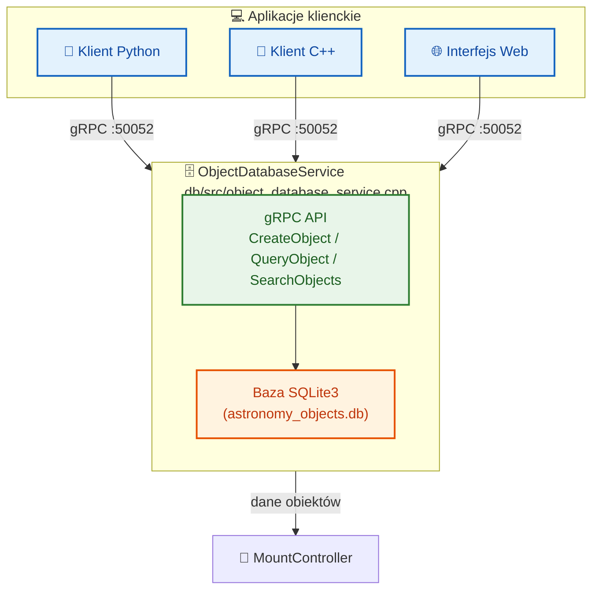

# Dokumentacja API gRPC

## Przegląd API

Astronomical Mount Controller udostępnia kompleksowe API przez protokół gRPC, umożliwiające zdalne sterowanie wszystkimi funkcjami systemu. API jest zdefiniowane w pliku `proto/mount_controller.proto`.

## Struktury danych

### Coordinates

Pełna struktura współrzędnych astronomicznych z wszystkimi parametrami astrometrycznymi.

```protobuf
message Coordinates {
    // Basic position
    double ra = 1;          // Right ascension in hours (J2000)
    double dec = 2;         // Declination in degrees (J2000)
    
    // Proper motion
    double pm_ra = 3;       // Proper motion in RA (mas/yr)
    double pm_dec = 4;      // Proper motion in Dec (mas/yr)
    
    // Parallax
    double parallax = 5;    // Parallax in mas
    
    // Radial velocity
    double radial_velocity = 6;  // Radial velocity in km/s
    
    // Epoch
    double epoch = 7;       // Epoch of coordinates (e.g., 2000.0)
    
    // Catalog identifiers
    string catalog_id = 8;  // Catalog identifier (e.g., "HIP", "TYC")
    string object_id = 9;   // Object identifier in catalog
    
    // Magnitude and spectral type
    double magnitude = 10;  // Visual magnitude
    string spectral_type = 11;  // Spectral type
    
    // Additional astrometric parameters
    double epoch_ra = 12;   // Epoch of RA proper motion
    double epoch_dec = 13;  // Epoch of Dec proper motion
    double position_angle = 14;  // Position angle in degrees
    double separation = 15; // Separation in arcseconds (for binaries)
    
    // Atmospheric refraction correction
    bool apply_refraction = 16;
    double temperature = 17;  // Temperature in °C for refraction
    double pressure = 18;     // Pressure in hPa for refraction
    double humidity = 19;     // Humidity in % for refraction
    
    // Precession/nutation correction
    bool apply_precession = 20;
    bool apply_nutation = 21;
    
    // Aberration correction
    bool apply_aberration = 22;
    
    // Light-time correction
    bool apply_light_time = 23;
    
    // Gravitational deflection
    bool apply_grav_deflection = 24;
    
    // Altitude/azimuth (computed)
    double altitude = 25;    // Altitude in degrees
    double azimuth = 26;     // Azimuth in degrees
    
    // Apparent coordinates (after all corrections)
    double apparent_ra = 27;  // Apparent RA in hours
    double apparent_dec = 28; // Apparent Dec in degrees
    
    // Topocentric coordinates
    double topo_ra = 29;     // Topocentric RA in hours
    double topo_dec = 30;    // Topocentric Dec in degrees
}
```

### MountPosition

Pozycja montażu w stopniach.

```protobuf
message MountPosition {
    double axis1 = 1;       // Primary axis position (degrees)
    double axis2 = 2;       // Secondary axis position (degrees)
    google.protobuf.Timestamp timestamp = 3;
}
```

### AxisPhysicalParameters

Parametry fizyczne osi silników - kluczowa struktura dodana w ostatniej aktualizacji.

```protobuf
message AxisPhysicalParameters {
    // Motor parameters
    double motor_steps_per_rev = 1;      // Steps per revolution
    double motor_microstepping = 2;      // Microstepping factor (e.g., 16, 32, 64)
    double motor_step_angle = 3;         // Step angle [arcseconds]
    
    // Encoder parameters
    double encoder_resolution = 4;       // Encoder resolution [counts/rev]
    double encoder_counts_per_arcsec = 5; // Counts per arcsecond
    double encoder_quantization_error = 6; // Quantization error [arcseconds]
    
    // Gear parameters
    double gear_ratio = 7;               // Total gear ratio (motor:output)
    double worm_ratio = 8;               // Worm gear ratio (if applicable)
    int32 worm_teeth = 9;                // Number of worm teeth
    int32 worm_wheel_teeth = 10;         // Number of worm wheel teeth
    
    // Cyclic errors (periodic errors)
    double cyclic_error_amplitude = 11;  // Amplitude of cyclic error [arcseconds]
    double cyclic_error_period = 12;     // Period of cyclic error [degrees]
    repeated double cyclic_harmonics = 13; // Harmonic coefficients for cyclic error
    
    // Backlash parameters
    double backlash = 14;                // Backlash [arcseconds]
    double backlash_temp_coeff = 15;     // Backlash temperature coefficient [arcseconds/°C]
    
    // Stiffness and compliance
    double axis_stiffness = 16;          // Axis stiffness [arcseconds/Nm]
    double torsional_compliance = 17;    // Torsional compliance [rad/Nm]
    
    // Temperature coefficients
    double expansion_coeff = 18;         // Thermal expansion coefficient [1/°C]
    double temp_gear_error_coeff = 19;   // Gear error temperature coefficient [arcseconds/°C]
    
    // Calibration data
    repeated double calibration_table = 20; // Calibration table [counts → arcseconds]
    double calibration_temp = 21;        // Temperature during calibration [°C]
}
```

### Configuration

Pełna konfiguracja systemu (50 pól).

```protobuf
message Configuration {
    // Location
    double latitude = 1;
    double longitude = 2;
    double altitude = 3;
    
    // Mount parameters
    double mount_height = 4;
    double pier_west = 5;
    double pier_east = 6;
    
    // Telescope parameters
    double focal_length = 7;
    double aperture = 8;
    
    // Environmental defaults
    double default_temperature = 9;
    double default_pressure = 10;
    double default_humidity = 11;
    
    // Kalman filter parameters
    double process_noise = 12;
    double measurement_noise = 13;
    
    // Logging
    string log_level = 14;
    string log_directory = 15;
    int32 log_rotation_days = 16;
    
    // Network
    string grpc_address = 17;
    int32 grpc_port = 18;
    
    // CanOpen
    string canopen_interface = 19;
    int32 canopen_node_id = 20;
    
    // Mount control parameters
    double park_position_axis1 = 21;
    double park_position_axis2 = 22;
    double max_slew_rate = 23;
    double max_tracking_rate = 24;
    double slew_acceleration = 25;
    double tracking_acceleration = 26;
    
    // Axis physical parameters
    AxisPhysicalParameters ha_axis_params = 27;
    AxisPhysicalParameters dec_axis_params = 28;
    
    // Encoder configuration
    bool use_encoders = 29;
    bool encoders_absolute = 30;
    double encoder_resolution_config = 31;
    
    // TPOINT configuration
    uint32 tpoint_enabled_terms = 32;
    
    // Guider configuration
    bool enable_guider = 33;
    double guider_max_correction = 34;
    double guider_aggression = 35;
    
    // Additional mount parameters
    bool enable_refraction_correction = 36;
    MountType mount_type = 37;
    double position_tolerance = 38;
    double rate_tolerance = 39;
    
    // Meridian flip settings
    bool meridian_flip_enabled = 40;
    double meridian_flip_delay_minutes = 41;
    double meridian_flip_hysteresis_degrees = 42;
    
    // Soft limits
    bool soft_limits_enabled = 43;
    double soft_limit_axis1_min = 44;
    double soft_limit_axis1_max = 45;
    double soft_limit_axis2_min = 46;
    double soft_limit_axis2_max = 47;
    double soft_limit_warning_degrees = 48;
    double soft_limit_deceleration_degrees = 49;
    double soft_limit_tracking_rate_factor = 50;
}
```

## Metody API

### Podstawowe sterowanie montażem

#### SlewToCoordinates

Szybkie przesunięcie montażu do określonych współrzędnych.

```protobuf
rpc SlewToCoordinates(Coordinates) returns (google.protobuf.Empty);
```

**Parametry:**
- `Coordinates` - Współrzędne docelowe

**Zwraca:**
- `Empty` - Potwierdzenie wykonania

**Błędy:**
- `INVALID_ARGUMENT` - Nieprawidłowe współrzędne
- `FAILED_PRECONDITION` - Montaż nie jest w stanie przyjąć komendy
- `INTERNAL` - Błąd podczas wykonywania przesunięcia

#### TrackObject

Rozpoczęcie śledzenia obiektu.

```protobuf
rpc TrackObject(Coordinates) returns (google.protobuf.Empty);
```

**Parametry:**
- `Coordinates` - Współrzędne śledzonego obiektu

**Zwraca:**
- `Empty` - Potwierdzenie wykonania

#### Stop

Zatrzymanie wszystkich ruchów montażu.

```protobuf
rpc Stop(google.protobuf.Empty) returns (google.protobuf.Empty);
```

#### Park

Parkowanie montażu w pozycji bezpiecznej.

```protobuf
rpc Park(google.protobuf.Empty) returns (google.protobuf.Empty);
```

**Parametry:**
- `Empty`

**Zwraca:**
- `Empty` - Potwierdzenie wykonania

**Błędy:**
- `FAILED_PRECONDITION` - Montaż nie jest w stanie przyjąć komendy
- `INTERNAL` - Błąd podczas wykonywania parkowania

#### Unpark

Odparkowanie montażu — powrót do stanu IDLE.

```protobuf
rpc Unpark(google.protobuf.Empty) returns (google.protobuf.Empty);
```

**Parametry:**
- `Empty`

**Zwraca:**
- `Empty` - Potwierdzenie wykonania

**Błędy:**
- `FAILED_PRECONDITION` - Montaż nie jest zaparkowany
- `INTERNAL` - Błąd podczas odparkowania

#### SlewToHorizontal

Szybkie przesunięcie montażu do określonych współrzędnych horyzontalnych (altitude/azimuth).

```protobuf
rpc SlewToHorizontal(HorizontalCoordinates) returns (google.protobuf.Empty);
```

**Parametry:**
```protobuf
message HorizontalCoordinates {
    double altitude = 1;    // Altitude in degrees
    double azimuth = 2;     // Azimuth in degrees
    google.protobuf.Timestamp timestamp = 3;
}
```

**Zwraca:**
- `Empty` - Potwierdzenie wykonania

**Błędy:**
- `INVALID_ARGUMENT` - Nieprawidłowe współrzędne
- `FAILED_PRECONDITION` - Montaż nie jest w stanie przyjąć komendy

### Zarządzanie stanem

#### GetState

Pobranie aktualnego stanu montażu.

```protobuf
rpc GetState(google.protobuf.Empty) returns (ControllerState);
```

**Zwraca:**
- `ControllerState` - Aktualny stan montażu

```protobuf
message ControllerState {
    enum MountStatus {
        UNINITIALIZED = 0;
        INITIALIZING = 1;
        IDLE = 2;
        SLEWING = 3;
        TRACKING = 4;
        MERIDIAN_FLIP = 5;
        PARKING = 6;
        PARKED = 7;
        ERROR = 8;
    }

    MountStatus status = 1;
    TrackedObject tracked_object = 2;
    MountPosition current_position = 3;
    RotationMatrix rotation_matrix = 4;
    TPointParameters tpoint_params = 5;
    bool encoders_enabled = 6;
    bool guider_active = 7;
    google.protobuf.Timestamp state_time = 8;
    
    // Additional tracking parameters
    double tracking_rate_ra = 9;     // RA tracking rate [arcsec/s]
    double tracking_rate_dec = 10;   // Dec tracking rate [arcsec/s]
    double pier_side = 11;           // Pier side (1=East, -1=West)
    bool meridian_flipped = 12;      // Meridian flipped
    double time_to_meridian = 13;    // Time to meridian [hours]
    double time_to_set = 14;         // Time to set [hours]
    double time_to_rise = 15;        // Time to rise [hours]
    
    // Environmental conditions
    double temperature = 16;         // Temperature [°C]
    double pressure = 17;            // Pressure [hPa]
    double humidity = 18;            // Humidity [%]
    double wind_speed = 19;          // Wind speed [m/s]
    double wind_direction = 20;      // Wind direction [deg]
    
    // Mount performance
    double pointing_error = 21;      // Pointing error [arcsec]
    double tracking_performance = 22; // Tracking performance [%]
    double guiding_performance = 23;  // Guiding performance [%]
    double mount_vibration = 24;     // Mount vibration [arcsec RMS]
}
```

#### SaveState

Zapisanie stanu systemu do pliku.

```protobuf
rpc SaveState(StateSaveRequest) returns (StateSaveResponse);
```

**Parametry:**
```protobuf
message StateSaveRequest {
    string file_path = 1;  // Empty for default location
    bool include_measurements = 2;
}
```

**Zwraca:**
```protobuf
message StateSaveResponse {
    string file_path = 1;
    int64 file_size = 2;
}
```

#### LoadState

Wczytanie stanu systemu z pliku.

```protobuf
rpc LoadState(StateLoadRequest) returns (google.protobuf.Empty);
```

**Parametry:**
```protobuf
message StateLoadRequest {
    string file_path = 1;  // Empty for default location
}
```

### Pomiar i kalibracja

#### AddMeasurement

Dodanie pomiaru do kalibracji TPOINT.

```protobuf
rpc AddMeasurement(Measurement) returns (google.protobuf.Empty);
```

**Parametry:**
```protobuf
message Measurement {
    Coordinates observed = 1;
    Coordinates expected = 2;
    MountPosition mount_position = 3;
    double temperature = 4;
    double pressure = 5;
    double humidity = 6;
    google.protobuf.Timestamp timestamp = 7;
}
```

#### GetTPointParameters

Pobranie aktualnych parametrów TPOINT.

```protobuf
rpc GetTPointParameters(google.protobuf.Empty) returns (TPointParameters);
```

**Zwraca:**
```protobuf
message TPointParameters {
    repeated double coefficients = 1;  // TPOINT model coefficients
    double chi_squared = 2;
    google.protobuf.Timestamp last_update = 3;
}
```

#### GetRotationMatrix

Pobranie macierzy rotacji (reprezentacja kwaternionowa).

```protobuf
rpc GetRotationMatrix(google.protobuf.Empty) returns (RotationMatrix);
```

**Zwraca:**
```protobuf
message RotationMatrix {
    double q0 = 1;
    double q1 = 2;
    double q2 = 3;
    double q3 = 4;
    google.protobuf.Timestamp valid_from = 5;
}
```

### Określanie pozycji bieguna

#### DeterminePolePosition

Określenie pozycji bieguna metodą dryfu.

```protobuf
rpc DeterminePolePosition(PoleDeterminationRequest) returns (PolePosition);
```

**Parametry:**
```protobuf
message PoleDeterminationRequest {
    int32 measurement_count = 1;  // Number of measurements to use
    double duration_hours = 2;    // Duration of drift measurement
}
```

**Zwraca:**
```protobuf
message PolePosition {
    double latitude = 1;
    double longitude = 2;
    double altitude = 3;
    double accuracy = 4;  // Accuracy in arcseconds
    google.protobuf.Timestamp determined_at = 5;
}
```

### Sterowanie enkoderami

#### EnableEncoders

Włączenie i konfiguracja enkoderów.

```protobuf
rpc EnableEncoders(EncoderConfig) returns (google.protobuf.Empty);
```

**Parametry:**
```protobuf
message EncoderConfig {
    enum EncoderType {
        ABSOLUTE = 0;
        INCREMENTAL = 1;
    }
    
    EncoderType type = 1;
    double resolution = 2;  // Steps per revolution
    bool use_feedback = 3;
}
```

#### DisableEncoders

Wyłączenie enkoderów.

```protobuf
rpc DisableEncoders(google.protobuf.Empty) returns (google.protobuf.Empty);
```

### Sterowanie guiderem

#### ConnectGuider

Połączenie z systemem autoguiding.

```protobuf
rpc ConnectGuider(GuiderConfig) returns (google.protobuf.Empty);
```

**Parametry:**
```protobuf
message GuiderConfig {
    string connection_string = 1;  // e.g., "tcp://localhost:7624"
    double max_correction = 2;     // Maximum correction in arcseconds
    double aggression = 3;         // Correction aggression (0-1)
}
```

#### DisconnectGuider

Rozłączenie z systemem autoguiding.

```protobuf
rpc DisconnectGuider(google.protobuf.Empty) returns (google.protobuf.Empty);
```

#### SendGuiderCorrection

Wysłanie korekcji od guidera.

```protobuf
rpc SendGuiderCorrection(GuiderCorrection) returns (google.protobuf.Empty);
```

**Parametry:**
```protobuf
message GuiderCorrection {
    double ra_correction = 1;   // RA correction in arcseconds
    double dec_correction = 2;  // Dec correction in arcseconds
    google.protobuf.Timestamp timestamp = 3;
}
```

### Konfiguracja

#### GetConfiguration

Pobranie aktualnej konfiguracji systemu.

```protobuf
rpc GetConfiguration(google.protobuf.Empty) returns (Configuration);
```

**Zwraca:**
- `Configuration` - Pełna konfiguracja systemu

#### UpdateConfiguration

Aktualizacja konfiguracji systemu.

```protobuf
rpc UpdateConfiguration(Configuration) returns (google.protobuf.Empty);
```

**Parametry:**
- `Configuration` - Nowa konfiguracja systemu

**Uwaga:** Nie wszystkie parametry mogą być zmieniane w czasie rzeczywistym. Niektóre wymagają restartu systemu.

### Generacja i wykonanie trajektorii

#### GenerateTrajectory

Generacja trajektorii ruchu.

```protobuf
rpc GenerateTrajectory(TrajectoryParams) returns (Trajectory);
```

**Parametry:**
```protobuf
message TrajectoryParams {
    TrajectoryType type = 1;
    double max_velocity = 2;          // deg/s
    double max_acceleration = 3;      // deg/s²
    double max_jerk = 4;              // deg/s³
    double start_position = 5;        // deg
    double target_position = 6;       // deg
    double update_rate = 7;           // Hz
}
```

**Zwraca:**
```protobuf
message Trajectory {
    TrajectoryParams params = 1;
    repeated TrajectoryPoint points = 2;
    google.protobuf.Timestamp generated_at = 3;
}
```

### Ephemeris Tracking

#### UploadEphemeris

Przesłanie danych efemeryd dla obiektów ruchomych (komety, asteroidy, satelity).

```protobuf
rpc UploadEphemeris(EphemerisData) returns (google.protobuf.Empty);
```

**Parametry:**
```protobuf
message EphemerisData {
    string object_id = 1;
    string object_name = 2;
    string object_type = 3;       // "comet", "asteroid", "satellite"
    int32 interpolation_order = 4;
    string reference_frame = 5;
    string source = 6;
    repeated EphemerisPoint points = 7;
    google.protobuf.Timestamp valid_from = 8;
    google.protobuf.Timestamp valid_to = 9;
    
    message EphemerisPoint {
        google.protobuf.Timestamp time = 1;
        double ra = 2;             // J2000 [hours]
        double dec = 3;            // J2000 [degrees]
        double ra_rate = 4;        // [hours/hour]
        double dec_rate = 5;       // [degrees/hour]
        double magnitude = 6;
    }
}
```

#### StartEphemerisTracking

Rozpoczęcie śledzenia obiektu na podstawie efemeryd.

```protobuf
rpc StartEphemerisTracking(StartEphemerisTrackingRequest) returns (EphemerisTrackStatus);
```

**Parametry:**
```protobuf
message StartEphemerisTrackingRequest {
    string object_id = 1;
    bool wait_at_start = 2;
    double slew_margin_seconds = 3;
}
```

**Zwraca:** `EphemerisTrackStatus` z informacją o tracker_id i stanie.

#### GetEphemerisTrackStatus

Pobranie aktualnego statusu śledzenia efemeryd.

```protobuf
rpc GetEphemerisTrackStatus(google.protobuf.Empty) returns (EphemerisTrackStatus);
```

Rozpowszechnia listę aktywnych trackerów i ich szczegółowe statusy.

#### StopEphemerisTracking

Zatrzymanie śledzenia obiektu ruchomego.

```protobuf
rpc StopEphemerisTracking(StopEphemerisTrackingRequest) returns (google.protobuf.Empty);
```

#### GetEphemerisMetrics

Pobranie metryk śledzenia efemeryd (całkowity czas śledzenia, średni/maksymalny błąd pozycji).

```protobuf
rpc GetEphemerisMetrics(google.protobuf.Empty) returns (EphemerisMetrics);
```

### CheckHealth — Kontrola zdrowia systemu

Sprawdzenie stanu zdrowia wszystkich komponentów systemu.

```protobuf
rpc CheckHealth(HealthCheckRequest) returns (HealthCheckResponse);
```

```protobuf
message HealthCheckRequest {
    string service = 1;
}

message HealthCheckResponse {
    enum ServingStatus {
        UNKNOWN = 0;
        SERVING = 1;
        NOT_SERVING = 2;
        SERVICE_UNKNOWN = 3;
    }
    ServingStatus status = 1;
    string service = 2;
    SystemMetrics metrics = 3;
}

message SystemMetrics {
    double cpu_usage = 1;            // CPU usage percentage
    double memory_usage_mb = 2;      // Memory usage in MB
    double uptime_seconds = 3;       // System uptime
    int32 active_trackers = 4;       // Active trackers
    int32 connected_clients = 5;     // Connected gRPC clients
    double can_bus_errors = 6;       // CAN bus error count
    double last_error_timestamp = 7; // Timestamp of last error
}
```

### Bootstrap Calibration — Kalibracja Bootstrap

Kalibracja początkowa do wstępnego ustawienia montażu, gdy model TPOINT nie jest jeszcze dostępny.

```protobuf
rpc AddBootstrapMeasurement(BootstrapMeasurement) returns (google.protobuf.Empty);
rpc RunBootstrapCalibration(google.protobuf.Empty) returns (BootstrapCalibrationResult);
rpc GetBootstrapStatus(google.protobuf.Empty) returns (BootstrapStatus);
rpc ClearBootstrapMeasurements(google.protobuf.Empty) returns (google.protobuf.Empty);
```

```protobuf
message BootstrapMeasurement {
    double observed_ra = 1;     // Observed RA in hours
    double observed_dec = 2;    // Observed Dec in degrees
    double expected_ra = 3;     // Catalog RA in hours
    double expected_dec = 4;    // Catalog Dec in degrees
    google.protobuf.Timestamp timestamp = 5;
}

message BootstrapCalibrationResult {
    bool success = 1;
    double alignment_error_arcsec = 2;
    int32 measurements_used = 3;
    string error_message = 4;
}

message BootstrapStatus {
    enum CalibrationState {
        IDLE = 0;
        COLLECTING = 1;
        RUNNING = 2;
        COMPLETED = 3;
        FAILED = 4;
    }
    CalibrationState state = 1;
    int32 measurement_count = 2;
    double current_error_arcsec = 3;
    int32 min_measurements_required = 4;
}
```

### Low-Level Axis Control — Sterowanie Osi

Bezpośrednie sterowanie osiami montażu z pominięciem wysokopoziomowych komend (slew/track).

```protobuf
rpc ControlAxis(AxisControlRequest) returns (google.protobuf.Empty);
rpc StopAxis(AxisStopRequest) returns (google.protobuf.Empty);
rpc EmergencyStop(EmergencyStopRequest) returns (google.protobuf.Empty);
rpc GetAxisStatus(GetAxisStatusRequest) returns (AxisStatus);
```

```protobuf
message AxisControlRequest {
    enum AxisControlMode {
        POSITION = 0;        // Move to absolute position
        VELOCITY = 1;        // Move at specified velocity
        CONSTANT_RATE = 2;   // Track at sidereal/rate
        STEP = 3;            // Move by relative step
    }
    int32 axis_id = 1;               // 0=HA/RA, 1=Dec
    AxisControlMode mode = 2;
    double target_value = 3;         // Position [deg] or velocity [deg/s]
    double max_velocity = 4;         // deg/s
    double acceleration = 5;         // deg/s²
}

message AxisStopRequest {
    int32 axis_id = 1;               // 0=HA/RA, 1=Dec, -1=both
    bool emergency = 2;              // Emergency stop (immediate)
}

message EmergencyStopRequest {
    string reason = 1;
}

message AxisStatus {
    double position_deg = 1;
    double velocity_deg_s = 2;
    double current_a = 3;            // Motor current [A]
    double temperature_c = 4;        // Drive temperature
    bool enabled = 5;
    bool fault = 6;
    bool reached_target = 7;
}
```

### Derotator / Field Rotation — Pole Rotacyjne

Sterowanie derotatorem i kompensacją pola rotacyjnego dla montaży alt-az.

```protobuf
rpc ConfigureDerotator(DerotatorConfig) returns (google.protobuf.Empty);
rpc EnableFieldRotation(FieldRotationParams) returns (google.protobuf.Empty);
rpc ControlFieldRotation(FieldRotationControlRequest) returns (google.protobuf.Empty);
rpc GetDerotatorStatus(google.protobuf.Empty) returns (DerotatorStatus);
rpc HomeDerotator(DerotatorHomingRequest) returns (google.protobuf.Empty);
rpc GetFieldRotationParams(google.protobuf.Empty) returns (FieldRotationParams);
```

```protobuf
message DerotatorConfig {
    enum DerotatorType {
        NONE = 0;
        CANOPEN = 1;
        STEPPER = 2;
        SERVO = 3;
    }
    DerotatorType type = 1;
    double gear_ratio = 2;
    double max_speed = 3;
    double acceleration = 4;
    double home_position = 5;
    bool invert_direction = 6;
    repeated double calibration_table = 7;
    int32 canopen_node_id = 8;
}

message FieldRotationParams {
    bool enabled = 1;
    CompensationMode compensation_mode = 2;
    double max_rate = 3;
    double update_interval_ms = 4;
    bool feedforward_enabled = 5;
    // PID gains
    double pid_p = 6;
    double pid_i = 7;
    double pid_d = 8;
}

message FieldRotationControlRequest {
    enum RotationMode {
        OFF = 0;
        TRACKING = 1;
        MANUAL = 2;
        CALIBRATION = 3;
    }
    RotationMode mode = 1;
    double manual_rate = 2;     // deg/s for manual mode
}

message DerotatorStatus {
    double current_position_deg = 1;
    double current_rate_deg_s = 2;
    bool is_homed = 3;
    bool is_enabled = 4;
    bool is_moving = 5;
    double motor_current_a = 6;
    double temperature_c = 7;
    string error_message = 8;
}

message DerotatorHomingRequest {
    enum HomingMethod {
        TARGET_POSITION = 0;
        LIMIT_SWITCH = 1;
        INDEX_PULSE = 2;
        ABSOLUTE_ENCODER = 3;
    }
    HomingMethod method = 1;
    double target_position = 2;
    double search_speed = 3;
    double home_speed = 4;
    double acceleration = 5;
    double timeout_seconds = 6;
}
```

### HAL Configuration — Konfiguracja HAL

Odczyt i zapis konfiguracji warstwy abstrakcji sprzętowej (HAL).

```protobuf
rpc GetHALConfig(HALConfigRequest) returns (HALConfig);
rpc SetHALConfig(HALConfigRequest) returns (google.protobuf.Empty);
rpc GetHALStatus(HALConfigRequest) returns (HALStatus);
rpc ReinitializeHAL(HALReinitRequest) returns (google.protobuf.Empty);
```

```protobuf
message HALConfig {
    enum HALType {
        CANOPEN = 0;
        SIMULATED = 1;
        SERIAL = 2;
        ETHERNET = 3;
    }
    HALType type = 1;
    
    message SimulatedConfig {
        double update_rate_ms = 1;
        double motor_noise_std = 2;
        double encoder_noise_std = 3;
        bool simulate_faults = 4;
    }
    
    message CanOpenConfig {
        string interface = 1;
        int32 node_id_ra = 2;
        int32 node_id_dec = 3;
        int32 node_id_derotator = 4;
        int32 baud_rate = 5;
        int32 sync_interval_ms = 6;
        bool enable_watchdog = 7;
        int32 watchdog_timeout_ms = 8;
    }
    
    message SerialConfig {
        string port = 1;
        int32 baud_rate = 2;
        int32 data_bits = 3;
        string parity = 4;
        int32 stop_bits = 5;
        int32 timeout_ms = 6;
    }
    
    message EthernetConfig {
        string address = 1;
        int32 port = 2;
        string protocol = 3;
        int32 timeout_ms = 4;
    }
    
    message AxisConfig {
        int32 microstepping = 1;
        double max_current_a = 2;
        double holding_current_a = 3;
        double max_velocity = 4;
        double max_acceleration = 5;
        bool invert_direction = 6;
        bool enable_soft_limits = 7;
        double soft_limit_min = 8;
        double soft_limit_max = 9;
    }
    
    message PIDParams {
        double p = 1;
        double i = 2;
        double d = 3;
        double ff = 4;
        double deadband = 5;
        double integral_limit = 6;
        double output_limit = 7;
    }
    
    message SafetyConfig {
        double max_temperature_c = 1;
        double max_current_a = 2;
        bool enable_hardware_limit_switch = 3;
        bool enable_emergency_stop = 4;
        double position_error_threshold_deg = 5;
        bool enable_stall_detection = 6;
    }
    
    oneof config {
        SimulatedConfig simulated = 2;
        CanOpenConfig canopen = 3;
        SerialConfig serial = 4;
        EthernetConfig ethernet = 5;
    }
    
    AxisConfig axis1_config = 6;
    AxisConfig axis2_config = 7;
    AxisConfig derotator_config = 8;
    PIDParams pid_params = 9;
    SafetyConfig safety = 10;
}

message HALConfigRequest {
    HALConfig config = 1;
    bool persistent = 2;
}

message HALStatus {
    bool initialized = 1;
    string hal_type = 2;
    bool motors_enabled = 3;
    bool encoders_active = 4;
    bool safety_monitor_active = 5;
    repeated string active_features = 6;
    HALStatusDetail detail = 7;
}

message HALReinitRequest {
    HALConfig config = 1;
}

enum CompensationMode {
    FULL = 0;
    PARTIAL = 1;
    OFF = 2;
}
```

---

## Baza Danych Obiektów Astronomicznych (API)

System zawiera kompleksową bazę danych obiektów astronomicznych (`ObjectDatabaseService`) przechowującą dane w SQLite z interfejsem gRPC. Serwer bazy danych działa domyślnie na porcie **50052**.

### Architektura



### Definicja usługi

```protobuf
service ObjectDatabaseService {
    // Zarządzanie obiektami
    rpc CreateObject (AstronomicalObject) returns (ObjectId);
    rpc GetObject (ObjectId) returns (AstronomicalObject);
    rpc UpdateObject (AstronomicalObject) returns (google.protobuf.Empty);
    rpc DeleteObject (ObjectId) returns (google.protobuf.Empty);
    rpc ListObjects (ObjectListRequest) returns (ObjectList);
    rpc SearchObjects (ObjectSearchRequest) returns (ObjectList);
    
    // Operacje na katalogach
    rpc ImportCatalog (ImportCatalogRequest) returns (ImportResult);
    rpc ExportCatalog (ExportCatalogRequest) returns (ExportResult);
    
    // Ulubione i kolekcje użytkowników
    rpc AddToFavorites (FavoriteRequest) returns (google.protobuf.Empty);
    rpc RemoveFromFavorites (FavoriteRequest) returns (google.protobuf.Empty);
    rpc GetFavorites (google.protobuf.Empty) returns (ObjectList);
    
    // Kategorie i tagi
    rpc CreateCategory (Category) returns (CategoryId);
    rpc ListCategories (google.protobuf.Empty) returns (CategoryList);
    rpc AssignCategory (ObjectCategory) returns (google.protobuf.Empty);
    rpc RemoveCategory (ObjectCategory) returns (google.protobuf.Empty);
    
    // Planowanie obserwacji
    rpc FindVisibleObjects (VisibilityRequest) returns (ObjectList);
    rpc GetTonightBestObjects (TonightRequest) returns (ObjectList);
    rpc GetObjectVisibility (ObjectVisibilityRequest) returns (VisibilityInfo);
    
    // Statystyki i metadane
    rpc GetDatabaseStats (google.protobuf.Empty) returns (DatabaseStats);
    rpc BackupDatabase (BackupRequest) returns (BackupResult);
    rpc RestoreDatabase (RestoreRequest) returns (google.protobuf.Empty);
}
```

### Główne struktury danych

#### AstronomicalObject

Obiekt niebieski z 64 polami obejmującymi identyfikację, współrzędne, parametry fizyczne i metadane:

```protobuf
message AstronomicalObject {
    string id = 1;             // UUID
    string name = 2;           // Nazwa zwyczajowa
    string catalog_name = 3;   // Oznaczenie katalogowe
    double ra_hours = 5;       // Rektascensja (J2000)
    double dec_degrees = 6;    // Deklinacja (J2000)
    double v_magnitude = 12;   // Jasność wizualna
    ObjectType object_type = 19; // Typ obiektu
    // ... 64 pola
}
```

#### Tabele bazy danych

| Tabela | Opis |
|--------|------|
| `astronomical_objects` | Główne dane obiektów |
| `favorites` | Ulubione obiekty użytkowników |
| `categories` | Kategorie obiektów z metadanymi UI |
| `object_categories` | Relacje wiele-do-wielu obiekt-kategoria |
| `ephemeris_data` | Dane efemeryd dla obiektów Układu Słonecznego |

### Uruchamianie serwera bazy danych

```bash
# Budowanie
cd build
cmake .. -DCMAKE_BUILD_TYPE=Release
make astro_object_database_server -j$(nproc)

# Uruchomienie (domyślna baza: astronomy_objects.db)
./bin/astro_object_database_server

# Niestandardowa ścieżka bazy
./bin/astro_object_database_server /ścieżka/do/moja_baza.db
```

### Przykład Python

```python
import grpc
from db.proto import object_database_pb2
from db.proto import object_database_pb2_grpc

channel = grpc.insecure_channel('localhost:50052')
stub = object_database_pb2_grpc.ObjectDatabaseServiceStub(channel)

# Utwórz nowy obiekt
obj = object_database_pb2.AstronomicalObject(
    name="Mgławica Andromedy",
    catalog_name="M 31",
    ra_hours=0.7108,
    dec_degrees=41.2692,
    v_magnitude=3.44,
    object_type=object_database_pb2.GALAXY_SPIRAL
)
result = stub.CreateObject(obj)
print(f"Utworzono obiekt o ID: {result.id}")
```


