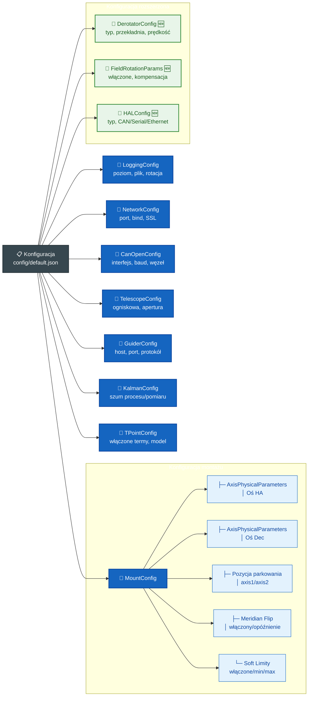
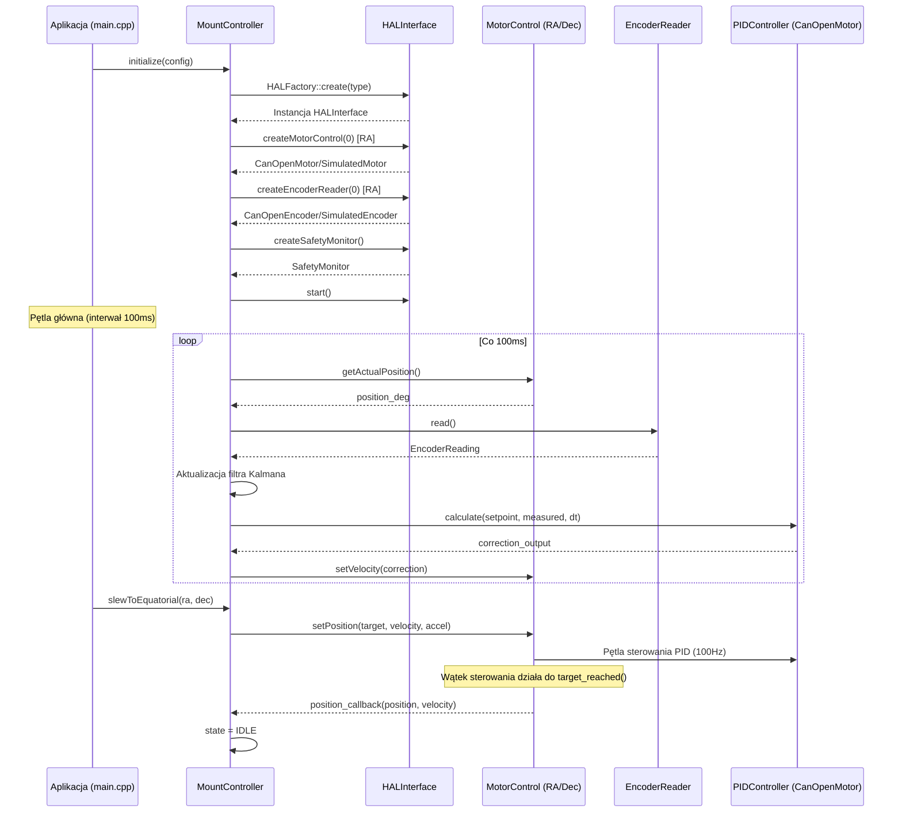
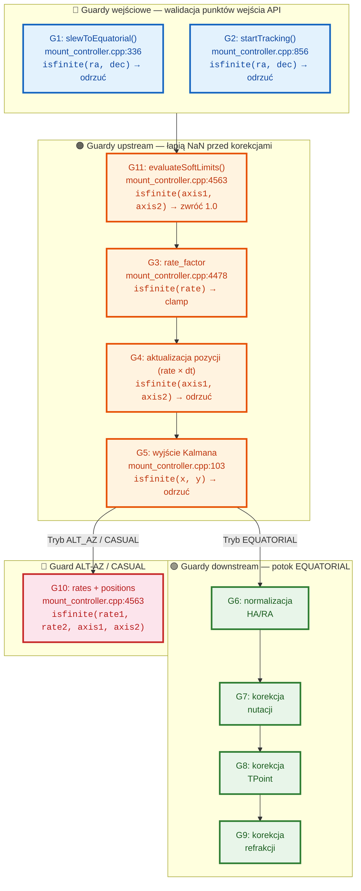
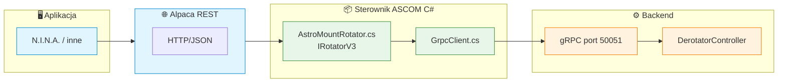
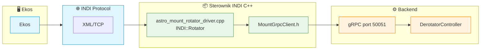

# Architektura systemu

## Przegląd architektury

Astronomical Mount Controller to system o architekturze modularnej, zaprojektowany do zapewnienia wysokiej precyzji śledzenia obiektów astronomicznych. System składa się z następujących warstw:

### Warstwy systemu

1. **Warstwa aplikacji** - Interfejsy użytkownika i aplikacje klienckie
2. **Warstwa API** - gRPC interface do zdalnego sterowania
3. **Warstwa logiki biznesowej** - Główny kontroler i modele matematyczne
4. **Warstwa komunikacji** - Interfejsy sprzętowe (CANopen)
5. **Warstwa sprzętowa** - Napędy serwo, enkodery, czujniki

## Szczegółowy opis komponentów

### 1. MountController

#### Odpowiedzialności:
- Integracja wszystkich komponentów systemu
- Zarządzanie stanem montażu (idle, slewing, tracking, parked, error)
- Koordynacja ruchu osi RA i Dec
- Integracja z systemem autoguiding
- Zarządzanie kalibracją TPOINT

#### Integracja z DerotatorController:
`MountController` deleguje całe sterowanie derotatorem do `DerotatorController`:
- Wstrzykuje prędkość rotacji pola przez `setFieldRotationRate()` w pętli śledzenia
- `computeFieldRotationRate()` oblicza wymaganą prędkość na podstawie pozycji montażu i trybu śledzenia
- `DerotatorController` działa w niezależnym wątku z własnym `shared_mutex`
- Koordynacja stanu: MountController przekazuje aktualną pozycję montażu przez callback `state_provider`

#### Stan wewnętrzny:
```cpp
struct MountStatus {
    enum class State {
        UNINITIALIZED,
        INITIALIZING,
        IDLE,
        SLEWING,
        TRACKING,
        MERIDIAN_FLIP,
        PARKING,
        PARKED,
        ERROR
    };
    
    State state;
    double axis1_position;           // Degrees (servo/motor shaft)
    double axis2_position;           // Degrees (servo/motor shaft)
    double telescope_axis1_position; // Degrees (telescope axis, after gear ratio)
    double telescope_axis2_position; // Degrees (telescope axis, after gear ratio)
    double axis1_rate;               // Degrees/sec
    double axis2_rate;               // Degrees/sec
    double axis1_target;             // Degrees
    double axis2_target;             // Degrees
    
    bool encoders_active;
    bool guider_active;
    bool tpoint_calibrated;
    
    double tracking_error_ra;   // Arcseconds
    double tracking_error_dec;  // Arcseconds
    
    /// Meridian flip status
    bool meridian_flip_pending{false};      ///< True if a flip is pending (waiting for delay)
    bool meridian_flip_in_progress{false};  ///< True if the flip slew is being executed
    int pier_side{1};                       ///< 1=East pier, -1=West pier
    double time_to_meridian{0.0};           ///< Time until meridian crossing [hours]
    
    /// Soft safety limits status
    bool soft_limit_warning_active{false};     ///< True when within the warning zone
    bool soft_limit_deceleration_active{false}; ///< True when within the deceleration zone
    double soft_limit_distance_axis1{0.0};    ///< Distance to nearest soft limit on axis1 [degrees]
    double soft_limit_distance_axis2{0.0};    ///< Distance to nearest soft limit on axis2 [degrees]
    std::string soft_limit_warning_message;    ///< Human-readable warning description
    
    // Bootstrap / encoder status fields
    bool encoders_absolute{false};
    int bootstrap_mode{0};                    ///< Current bootstrap mode (BootstrapMode enum)
    bool bootstrap_calibrated{false};         ///< Whether bootstrap calibration completed
    int bootstrap_measurement_count{0};       ///< Number of bootstrap measurements stored
    
    std::chrono::system_clock::time_point timestamp;
    std::string error_message;
};
```

### 2. DerotatorController

Samodzielny kontroler derotatora, wydzielony z `MountController::Impl` podczas refaktoryzacji.

#### Odpowiedzialności:
- Sterowanie silnikiem derotatora przez HAL (wskaźniki `MotorControl` i `EncoderReader`)
- Obliczanie i utrzymywanie docelowego kąta derotatora
- Wykonywanie sekwencji homingu (AUTO, LIMIT_SWITCH, ENCODER_ZERO, MANUAL)
- Kompensacja rotacji pola w czasie rzeczywistym

#### Architektura:

```cpp
class DerotatorController {
public:
    enum class RotationMode {
        DISABLED,      // Rotacja wyłączona
        ALT_AZ,        // Kompensacja ALT-AZ
        EQUATORIAL,    // Kompensacja EQ (szybkość pola)
        CUSTOM,        // Ręczna prędkość kątowa
        FIXED_ANGLE,   // Utrzymanie stałego kąta
        TRACKING       // Śledzenie prędkością gwiazdową
    };

    enum class HomingMethod {
        AUTO,           // Automatyczna sekwencja
        LIMIT_SWITCH,   // Wyłącznik krańcowy
        ENCODER_ZERO,   // Pozycja zerowa enkodera
        MANUAL          // Ręczne ustawienie pozycji
    };

    // Publiczne metody
    bool configure(const DerotatorConfig& config);
    bool enableFieldRotation(const FieldRotationParams& params);
    bool home(HomingMethod method);
    bool controlFieldRotation(RotationMode mode, double param);
    DerotatorStatus getStatus() const;
    void setFieldRotationRate(double rate_deg_per_sec);
};
```

#### Kluczowe pliki:
- [`include/controllers/derotator_controller.h`](../../include/controllers/derotator_controller.h) (~224 linie)
- [`src/controllers/derotator_controller.cpp`](../../src/controllers/derotator_controller.cpp) (~858 linii)

#### Tryby rotacji pola:
- `DISABLED` — rotacja wyłączona, derotator w trybie bezczynności
- `ALT_AZ` — pełna kompensacja obrotu pola dla montażu ALT-AZ
- `EQUATORIAL` — kompensacja szybkości pola dla montażu EQ
- `CUSTOM` — ręczne ustawienie prędkości kątowej (stopnie/sekundę)
- `FIXED_ANGLE` — utrzymanie określonego kąta derotatora
- `TRACKING` — śledzenie z prędkością gwiazdową (sidereal)

### 3. AstronomicalCalculations

#### Biblioteki wykorzystywane:
- **SOFA** (Standards of Fundamental Astronomy) - obliczenia astronomiczne
- **ERFA** (Essential Routines for Fundamental Astronomy) - wersja C biblioteki SOFA

#### Funkcjonalności:
- Transformacje układów współrzędnych:
  - Równikowe (J2000, JNow) ↔ Horyzontalne
  - Galaktyczne ↔ Ekliptyczne
- Korekcje:
  - Refrakcja atmosferyczna (model Saastamoinen)
  - Precesja (model IAU 2006)
  - Nutacja (model IAU 2000A)
  - Aberracja roczna i dzienna
  - Ruch własny gwiazd
- Obliczenia czasu:
  - Czas gwiazdowy lokalny i uniwersalny
  - Julian Date, Modified Julian Date
  - Efemerydy

### 4. TPointModel

#### Model matematyczny:

Pełny model TPOINT opisany równaniami:

```
Δα = IA + CA·cos(h) + AN·sin(h)·tan(δ) + AW·cos(h)·tan(δ)
     + TF·sin(h)·sec(δ) + PE·sin(2π·h/PP + φ)
     
Δδ = IE + CD + AN·cos(h) - AW·sin(h)
     + TD·cos(h) + DF·sin(h) + DA·sin(δ)
```

#### Algorytm kalibracji:

1. **Zbieranie pomiarów**: Minimum 10 pomiarów rozłożonych na całej sferze niebieskiej
2. **Dopasowanie nieliniowe**: Metoda Levenberga-Marquardt
3. **Walidacja**: Test χ², odrzucanie outlierów
4. **Aktualizacja**: Ciągła aktualizacja przez filtr Kalmana

### 5. KalmanFilter

#### Model stanu:

```
x = [q, θ, ω, e]ᵀ
```

gdzie:
- `q ∈ ℝ⁴` - kwaternion orientacji
- `θ ∈ ℝ²¹` - parametry TPOINT
- `ω ∈ ℝ²` - prędkości kątowe osi
- `e ∈ ℝ³` - parametry środowiskowe (T, P, H)

#### Macierze kowariancji:

```
P = E[(x - x̂)(x - x̂)ᵀ]  // Macierz kowariancji stanu
Q = E[wwᵀ]             // Macierz kowariancji szumu procesu
R = E[vvᵀ]             // Macierz kowariancji szumu pomiaru
```

#### Algorytm EKF:

```
// Predykcja
x̂ₖ₋ = f(x̂ₖ₋₁, uₖ)
Pₖ₋ = FₖPₖ₋₁Fₖᵀ + Qₖ

// Korekcja
Kₖ = Pₖ₋Hₖᵀ(HₖPₖ₋Hₖᵀ + Rₖ)⁻¹
x̂ₖ = x̂ₖ₋ + Kₖ(zₖ - h(x̂ₖ₋))
Pₖ = (I - KₖHₖ)Pₖ₋
```

### 6. CanOpenInterface

#### Implementacja protokołu CANopen:

##### Object Dictionary (OD):
- **Indeksy 0x6000-0x9FFF**: Manufacturer-specific objects
- **Indeksy 0x2000-0x5FFF**: Standardized device profile objects
- **Indeksy 0x1000-0x1FFF**: Communication profile objects

##### PDO (Process Data Objects):
- **TPDO1** (0x1800): Actual position, velocity, torque
- **TPDO2** (0x1801): Drive status, error codes
- **RPDO1** (0x1400): Target position, velocity
- **RPDO2** (0x1401): Control word, operation mode

##### SDO (Service Data Objects):
- Konfiguracja parametrów napędu
- Odczyt/zapis Object Dictionary
- Transfery blokowe dla dużych danych

#### Generacja trajektorii:

```cpp
struct TrajectoryParams {
    enum Type { TRAPEZOIDAL, S_SHAPE, SINE, POLYNOMIAL };
    Type type;
    double max_velocity;          // deg/s
    double max_acceleration;      // deg/s²
    double max_jerk;              // deg/s³
    double start_position;        // deg
    double target_position;       // deg
    double update_rate;           // Hz
};
```

### 7. Configuration System

#### Hierarchia konfiguracji:



#### Walidacja konfiguracji:

```cpp
std::vector<std::string> Configuration::validate() const {
    std::vector<std::string> errors;
    
    // Validate location
    if (latitude < -90.0 || latitude > 90.0)
        errors.push_back("Invalid latitude");
    if (longitude < -180.0 || longitude > 180.0)
        errors.push_back("Invalid longitude");
    
    // Validate mount parameters
    if (max_slew_rate <= 0.0)
        errors.push_back("max_slew_rate must be positive");
    if (max_tracking_rate <= 0.0)
        errors.push_back("max_tracking_rate must be positive");
    if (slew_acceleration <= 0.0)
        errors.push_back("slew_acceleration must be positive");
    if (tracking_acceleration <= 0.0)
        errors.push_back("tracking_acceleration must be positive");
    
    // Validate park positions
    if (park_position_axis1 < -360.0 || park_position_axis1 > 360.0)
        errors.push_back("Invalid park_position_axis1");
    if (park_position_axis2 < -360.0 || park_position_axis2 > 360.0)
        errors.push_back("Invalid park_position_axis2");
    
    // Validate soft limits
    if (soft_limits_enabled) {
        if (soft_limit_axis1_min >= soft_limit_axis1_max)
            errors.push_back("Axis1 soft limits: min must be less than max");
        if (soft_limit_axis2_min >= soft_limit_axis2_max)
            errors.push_back("Axis2 soft limits: min must be less than max");
    }
    
    // Validate meridian flip
    if (meridian_flip_enabled && meridian_flip_delay_minutes < 0.0)
        errors.push_back("meridian_flip_delay_minutes must be non-negative");
    
    // Validate Kalman parameters
    if (process_noise <= 0.0)
        errors.push_back("process_noise must be positive");
    if (measurement_noise <= 0.0)
        errors.push_back("measurement_noise must be positive");
    
    // Validate axis physical parameters
    if (ha_axis_params.gear_ratio <= 0.0)
        errors.push_back("HA axis gear_ratio must be positive");
    if (dec_axis_params.gear_ratio <= 0.0)
        errors.push_back("Dec axis gear_ratio must be positive");
    
    return errors;
}
```

## Przepływ danych

### 1. Śledzenie obiektu

```
Klient → gRPC(TrackObject) → MountController → AstronomicalCalculations
                                      ↓
                        CanOpenInterface/CiA 402 → Napędy serwo
                                      ↓
                          Enkodery (PDO) → KalmanFilter
                                      ↓
                           Aktualizacja TPointModel
```

### 2. Kalibracja TPOINT

```
Pomiar → AddMeasurement → TPointModel → Dopasowanie nieliniowe
                    ↓
             KalmanFilter → Aktualizacja parametrów
                    ↓
          MountController → Zastosowanie korekcji
```

### 3. Autoguiding

```
Guider → SendGuiderCorrection → MountController → Generacja trajektorii
                            ↓
                   CanOpenInterface → Korekcja prędkości (PDO)
```

### 4. Przepływ integracji HAL

System używa warstwy abstrakcji sprzętowej (HAL) do oddzielenia logiki biznesowej od sprzętu:




## Zarządzanie zasobami

### Wątki systemu:

1. **Wątek główny**: gRPC server, zarządzanie stanem
2. **Wątek CANopen**: Komunikacja z napędami, odczyt enkoderów
3. **Wątek obliczeniowy**: Obliczenia astronomiczne, filtr Kalmana
4. **Wątek guidera**: Komunikacja z systemem autoguiding
5. **Wątek derotatora**: Asynchroniczny homing i kalibracja derotatora (zarządzany przez DerotatorController)

### Synchronizacja:

```cpp
class MountController::Impl {
    std::mutex state_mutex_;
    std::mutex config_mutex_;
    std::condition_variable cv_;
    std::atomic<bool> running_;
    
    // Thread-safe access to state
    MountStatus getStatus() const {
        std::lock_guard<std::mutex> lock(state_mutex_);
        return status_;
    }
};
```

## Obsługa błędów

### Hierarchia błędów:

1. **Błędy komunikacji**: CANopen timeout, gRPC connection lost
2. **Błędy sprzętowe**: Drive fault, encoder failure
3. **Błędy obliczeniowe**: Numerical instability, convergence failure
4. **Błędy konfiguracji**: Invalid parameters, missing calibration

### Guardy propagacji NaN/Inf:

Pętla trackingu implementuje wielowarstwową obronę przed propagacją NaN/Inf, zorganizowaną jako potok guardów upstream/downstream:



- **Guardy upstream** (3-5, 10-11): Łapią NaN z obliczeń prędkości, injekcji guidera, divergencji filtru Kalmana i ewaluacji soft limitów, zanim dotrą do korekcji astronomicznych.
- **Guardy downstream** (6-9): Łapią NaN z korekcji nutacji, TPoint i refrakcji.
- **Wszystkie guardy** używają `state_ = ERROR; break;` — natychmiastowe zatrzymanie pętli trackingu i przejście do stanu ERROR, z którego `clearErrors()` może odzyskać do IDLE.

### Strategie odzyskiwania:

1. **clearErrors()**: Przejście ERROR → IDLE, join wątku, czyszczenie HAL, notyfikacja callbacków
2. **Retry**: Automatyczne ponowienie operacji (dla błędów przejściowych)
3. **Fallback**: Przejście do trybu bezpiecznego (sidereal tracking)
4. **Reinitialization**: Ponowna inicjalizacja komponentu
5. **Shutdown**: Bezpieczne wyłączenie systemu

## Wydajność

### Wymagania czasowe:

- **Czas odpowiedzi API**: < 10 ms
- **Częstotliwość aktualizacji pozycji**: 100 Hz
- **Opóźnienie CANopen**: < 1 ms
- **Czas obliczeń astronomicznych**: < 1 ms

### Zużycie zasobów:

- **CPU**: < 5% na core (typowe)
- **Pamięć**: ~50 MB (w tym buforowanie pomiarów)
- **Sieć**: ~1 Mbps (gRPC traffic)

## Rozszerzalność

### Punkty rozszerzeń:

1. **Nowe modele matematyczne**: Dziedziczenie po `TPointModel`
2. **Dodatkowe interfejsy sprzętowe**: Implementacja `HardwareInterface`
3. **Nowe algorytmy śledzenia**: Implementacja `TrackingAlgorithm`
4. **Dodatkowe protokoły komunikacji**: Rozszerzenie `CommunicationInterface`

### Konfiguracja pluginów:

```json
{
  "plugins": {
    "tracking_algorithms": [
      "SiderealTracking",
      "LunarTracking", 
      "SolarTracking",
      "CustomTracking"
    ],
    "hardware_interfaces": [
      "CanOpenInterface",
      "SerialInterface",
      "EtherCATInterface"
    ]
  }
}
```

## Bezpieczeństwo

### Mechanizmy bezpieczeństwa:

1. **Limity ruchu**: Hardware limits, software limits
2. **Monitorowanie temperatury**: Thermal shutdown protection
3. **Watchdog timer**: Automatic recovery from hangs
4. **Emergency stop**: Immediate shutdown on critical fault

### Walidacja danych wejściowych:

```cpp
bool MountController::slewToEquatorial(double ra, double dec) {
    // Validate coordinates
    if (ra < 0.0 || ra >= 24.0) return false;
    if (dec < -90.0 || dec > 90.0) return false;
    
    // Check mount limits
    if (wouldHitMeridian(ra, dec)) return false;
    if (wouldHitHorizon(ra, dec)) return false;
    
    // Proceed with slew
    return startSlew(ra, dec);
}

## Architektura sterowników zewnętrznych

### 8. ASCOM Telescope Driver ([`ascom/AstroMountTelescope.cs`](../../ascom/AstroMountTelescope.cs))

Sterownik ASCOM napisany w C#, implementujący interfejs `ITelescopeV3`:

```mermaid
flowchart LR
    subgraph Client["🖥️ Aplikacja astronomiczna"]
        APP["N.I.N.A. / Cartes du Ciel / ASCOM Dome Control"]
    end

    subgraph Alpaca["🌐 Alpaca REST API"]
        REST["HTTP/JSON<br/>localhost:11111"]
    end

    subgraph Driver["📦 Sterownik ASCOM C#"]
        TEL["AstroMountTelescope.cs<br/>ITelescopeV3"]
        GC["GrpcClient.cs<br/>Wrapper gRPC"]
    end

    subgraph Backend["⚙️ Aplikacja główna"]
        GRPC_SRV["MountControllerService<br/>gRPC port 50051"]
        MC["MountController"]
    end

    APP -->|"ASCOM Client → Alpaca"| Alpaca
    Alpaca -->|"HTTP/JSON → Set_Connected"| TEL
    TEL -->|"gRPC → SlewToCoordinates"| GC
    GC -->|"gRPC protobuf"| GRPC_SRV
    GRPC_SRV --> MC

    classDef client fill:#e1f5fe,stroke:#0288d1
    classDef driver fill:#e8f5e9,stroke:#388e3c
    classDef backend fill:#fff3e0,stroke:#f57c00

    class APP,Alpaca client
    class TEL,GC driver
    class GRPC_SRV,MC backend
```



Kluczowe metody:
- `MoveAxis(TelescopeAxes axis, double rate)` → `ControlAxis(axis_id, VELOCITY_CONTROL, rate)`
- `SlewToCoordinatesAsync(ra, dec)` → `SlewToCoordinates(ra, dec)`
- `PulseGuide(direction, duration)` → `ControlAxis(axis, VELOCITY_CONTROL, rate_from_duration)`
- `Action("ClearTPointMeasurements", "")` → dyspozytor string → czyszczenie pomiarów TPOINT
- `Connected` setter → `grpcClient.Connect()` / `Disconnect()`
- `StateCache` — buforowanie stanu z odświeżaniem co 2 sekundy

### 9. ASCOM Rotator Driver ([`ascom_rotator/AstroMountRotator.cs`](../../ascom_rotator/AstroMountRotator.cs))

Sterownik rotatora ASCOM, implementujący interfejs `IRotatorV3`:



Kluczowe mapowanie:
- `MoveAbsolute(angle)` → `ControlFieldRotation(FIXED_ANGLE, angle)`
- `Move(rate)` → `ControlFieldRotation(CUSTOM, rate)`
- `Halt()` → `ControlFieldRotation(DISABLED, 0)`
- `Home()` → `HomeDerotator(SEQUENTIAL)`
- `Position` → `GetDerotatorStatus().current_angle`
- `IsMoving` → `GetDerotatorStatus().state != IDLE`

### 10. INDI Telescope Driver ([`indi/astro_mount_driver.cpp`](../../indi/astro_mount_driver.cpp))

Sterownik INDI napisany w C++, dziedziczący po `INDI::Telescope`:

```mermaid
flowchart LR
    subgraph Client["🖥️ Ekos / KStars"]
        EKOS["Ekos<br/>INDI Client"]
    end

    subgraph INDI_PROTO["🌐 INDI Protocol"]
        XML["XML/TCP<br/>localhost:7624"]
    end

    subgraph Driver["📦 Sterownik INDI C++"]
        INDIDRV["astro_mount_driver.cpp<br/>INDI::Telescope"]
        MAPPER["IndiPropertyMapper<br/>Property → gRPC"]
        GRPC_CLI["MountGrpcClient.h<br/>Wrapper gRPC"]
    end

    subgraph Backend["⚙️ Backend"]
        GRPC_SRV["gRPC port 50051"]
        MC["MountController"]
    end

    EKOS -->|"INDI Protocol"| INDI_PROTO
    INDI_PROTO -->|"ISNewNumber/Switch/Text"| INDIDRV
    INDIDRV --> MAPPER
    MAPPER --> GRPC_CLI
    GRPC_CLI -->|"gRPC protobuf"| GRPC_SRV
    GRPC_SRV --> MC

    classDef client fill:#e1f5fe,stroke:#0288d1
    classDef driver fill:#e8f5e9,stroke:#388e3c
    classDef backend fill:#fff3e0,stroke:#f57c00

    class EKOS,INDI_PROTO client
    class INDIDRV,MAPPER,GRPC_CLI driver
    class GRPC_SRV,MC backend
```



Kluczowe elementy:
- `ISNewSwitch(CONNECTION, "CONNECT")` → `MountGrpcClient.connect()`
- `ISNewNumber(EQUATORIAL_EOD_COORD, ...)` → `GrpcClient.SlewToCoordinates()`
- `ReadScopeStatus()` — pętla co 1 sekundę: `GetState()` → aktualizacja `RA`/`DEC`/`SNR` properties
- `MoveNS()`/`MoveWE()` — mapowanie axis_id (0=RA/WE, 1=Dec/NS), prędkość ±1.0 deg/s
- `ISNewSwitch(ABORT, ...)` → `Stop()`
- `ISNewSwitch(PARK, ...)` → `Park()` / `Unpark()`
- `TPOINT_STATUS` — tekstowa właściwość INDI do odczytu parametrów TPOINT
- `EnvironmentNP` — właściwość numeryczna dla temperatury, ciśnienia, wilgotności

### 11. INDI Rotator Driver ([`indi_rotator/astro_mount_rotator_driver.cpp`](../../indi_rotator/astro_mount_rotator_driver.cpp))

Sterownik rotatora INDI, dziedziczący po `INDI::Rotator`:



Kluczowe cechy:
- `CONNECTION_NONE` — tryb bez fizycznego połączenia INDI (komunikacja tylko przez gRPC)
- `MoveRotator(angle)` → `ControlFieldRotation(FIXED_ANGLE, angle)`
- `HomeRotator()` → `HomeDerotator(AUTO)`
- `AbortRotator()` → `ControlFieldRotation(DISABLED, 0)`
- Możliwości: `ROTATOR_CAN_ABORT | ROTATOR_CAN_HOME`
- Status odświeżany przez `GetDerotatorStatus()` z `MountGrpcClient`