# Architektura systemu

## Przegląd architektury

Astronomical Mount Controller to modularny system o architekturze hybrydowej, zaprojektowany do precyzyjnego śledzenia obiektów astronomicznych z dokładnością sub-arcsecond. Kontroler montażu jest procesem centralnym i hostuje **podsystemy kopuły, derotatora i focusera w swoim procesie**; usługi pogody, zasilania, sekwencera i bazy obiektów nadal działają jako niezależne procesy komunikujące się przez gRPC. Proxy webowe (HTTP/JSON → gRPC) udostępnia system w przeglądarce, a natywne sterowniki ASCOM i INDI integrują go z ekosystemami astronomicznymi.

### Warstwy systemu

1. **Warstwa aplikacji** — SPA webowe, GUI Qt, sterowniki ASCOM/INDI, klienci Python/C++
2. **Warstwa API** — usługi gRPC (kontroler montażu, kopuła, derotator, focuser w procesie; baza obiektów, pogoda, zasilanie, sekwencer, kamera, PEC, ST4, powiadomienia, pulley)
3. **Warstwa logiki biznesowej** — MountController, kontrolery, modele matematyczne (TPOINT, Kalman, efemerydy)
4. **Warstwa usług** — podsystemy w procesie (kopuła, derotator, focuser) + samodzielne usługi gRPC (pogoda, zasilanie, sekwencer, baza obiektów)
5. **Warstwa komunikacji** — abstrakcja sprzętu (CANopen, szeregowa, Ethernet, gamepad, MF7025v2, symulowana)
6. **Warstwa sprzętowa** — napędy serwo/kroki, enkodery, czujniki, focusery, kamery, kopuły, zasilanie

### Diagram architektury wysokiego poziomu

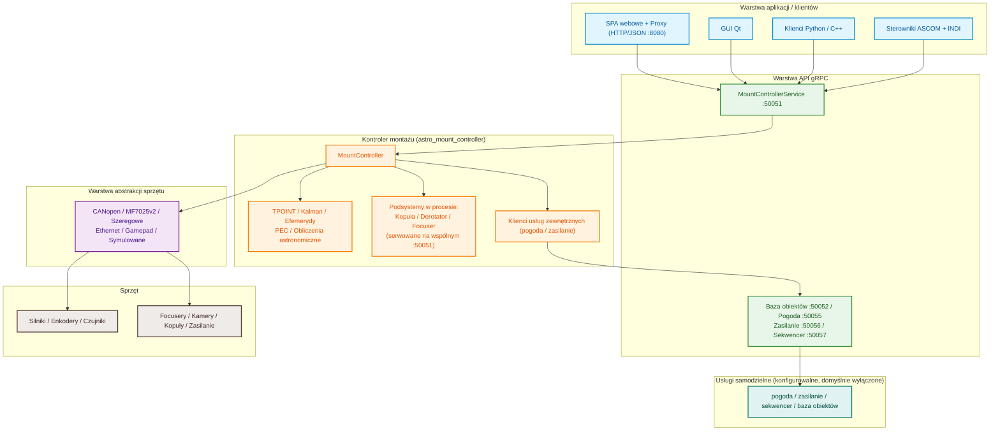
```mermaid
flowchart TB
    classDef client fill:#e1f5fe,stroke:#0288d1,stroke-width:2px,color:#01579b
    classDef api fill:#e8f5e9,stroke:#388e3c,stroke-width:2px,color:#1b5e20
    classDef core fill:#fff3e0,stroke:#f57c00,stroke-width:2px,color:#e65100
    classDef svc fill:#e0f2f1,stroke:#00796b,stroke-width:2px,color:#004d40
    classDef hal fill:#f3e5f5,stroke:#7b1fa2,stroke-width:2px,color:#4a148c
    classDef hw fill:#efebe9,stroke:#4e342e,stroke-width:2px,color:#3e2723

    subgraph CLIENTS["Warstwa aplikacji / klientów"]
        WEB["SPA webowe + Proxy (HTTP/JSON :8080)"]
        QT["GUI Qt"]
        PY["Klienci Python / C++"]
        DRV["Sterowniki ASCOM + INDI"]
    end

    subgraph API["Warstwa API gRPC"]
        GRPC["MountControllerService :50051"]
        EXT["Baza obiektów :50052 / Pogoda :50055<br/>Zasilanie :50056 / Sekwencer :50057"]
    end

    subgraph CORE["Kontroler montażu (astro_mount_controller)"]
        MC["MountController"]
        MODELS["TPOINT / Kalman / Efemerydy<br/>PEC / Obliczenia astronomiczne"]
        INPROC["Podsystemy w procesie:<br/>Kopuła / Derotator / Focuser<br/>(serwowane na wspólnym :50051)"]
        CLIENTSVC["Klienci usług zewnętrznych (pogoda / zasilanie)"]
    end

    subgraph SERVICES["Usługi samodzielne (konfigurowalne, domyślnie wyłączone)"]
        SVCS["pogoda / zasilanie / sekwencer / baza obiektów"]
    end

    subgraph HAL["Warstwa abstrakcji sprzętu"]
        HALIMPL["CANopen / MF7025v2 / Szeregowe<br/>Ethernet / Gamepad / Symulowane"]
    end

    subgraph HW["Sprzęt"]
        HW1["Silniki / Enkodery / Czujniki"]
        HW2["Focusery / Kamery / Kopuły / Zasilanie"]
    end

    WEB --> GRPC
    QT --> GRPC
    PY --> GRPC
    DRV --> GRPC
    GRPC --> MC
    MC --> MODELS
    MC --> INPROC
    MC --> CLIENTSVC
    CLIENTSVC --> EXT
    EXT --> SVCS
    MC --> HALIMPL
    HALIMPL --> HW1
    HALIMPL --> HW2

    class WEB,QT,PY,DRV client
    class GRPC,EXT api
    class MC,MODELS,INPROC,CLIENTSVC core
    class SVCS svc
    class HALIMPL hal
    class HW1,HW2 hw
```


### Usługi i porty

| Plik wykonywalny | Katalog | Domyślny port gRPC | Przeznaczenie |
|-----------|-----------|-------------------|---------|
| `astro_mount_controller` | [`src/`](src/main.cpp) | **50051** (zunifikowane API) | Centralny kontroler montażu (maszyna stanów, śledzenie, kalibracja) **plus podsystemy kopuły, derotatora i focusera w procesie** |
| `astro_object_database_server` | [`db/`](db/src/main.cpp) | 50052 | Katalog obiektów astronomicznych oparty na SQLite |
| `astro_weather_server` | [`weather/`](weather/src/main.cpp) | 50055 | Monitorowanie pogody, alerty, auto-park |
| `astro_power_server` | [`power/`](power/src/main.cpp) | 50056 | Monitorowanie baterii/zasilania, przełączanie wyjść |
| `astro_sequencer_server` | [`sequencer/`](sequencer/src/main.cpp) | 50057 | Zarządzanie sekwencjami obserwacji |
| Proxy webowe | [`web/proxy/`](web/proxy/server.js) | 8080 (HTTP) | Most HTTP/JSON ↔ gRPC + hosting SPA |

**Zunifikowane API gRPC na jednym porcie (50051).** Usługi kopuły, derotatora i focusera są zarejestrowane na **tym samym serwerze gRPC** co usługa kontrolera montażu, więc wszystkie cztery API są dostępne **wyłącznie na porcie 50051** przez pojedynczy kanał (np. `DomeService/GetStatus` przez 50051). Nie są używane żadne osobne porty — usługi w procesie są serwowane tylko przez wspólny port kontrolera montażu.

**Podsystemy kopuły, derotatora i focusera są hostowane w procesie wewnątrz `astro_mount_controller`** — nie są już osobnymi plikami wykonywalnymi i są serwowane tylko przez wspólny port 50051. Pogoda, zasilanie, sekwencer i baza obiektów pozostają samodzielnymi procesami gRPC. Wszystkie integracje są **domyślnie wyłączone** i włączane przez sekcję `external_services` w konfiguracji. Dla usług samodzielnych (pogoda, zasilanie) pole `address` to adres, z którym łączy się kontroler montażu. Proxy webowe włącza dodatkowe trasy/zakładki przez zmienne środowiskowe `EXT_SERVICE_*`.

---

## Współdzielona biblioteka rdzenia (`astro_mount_core`)

Wszystkie pliki wykonywalne linkują się z pojedynczą biblioteką statyczną, `astro_mount_core` (patrz [`CMakeLists.txt`](CMakeLists.txt:318)), która zawiera:

- **Kontrolery** — [`src/controllers/`](src/controllers/)
- **Modele matematyczne** — [`src/models/`](src/models/)
- **Rdzeń obliczeń astronomicznych** — [`src/core/`](src/core/)
- **Implementacje HAL** — [`src/hal/`](src/hal/)
- **Konfigurację, logowanie, powiadomienia, pogodę** — [`src/config/`](src/config/), [`src/logging/`](src/logging/), [`src/notifications/`](src/notifications/), [`src/weather/`](src/weather/)
- **Logikę sekwencera** — [`src/sequencer/`](src/sequencer/)

Współdzielone nagłówki znajdują się w [`include/`](include/). Biblioteka SOFA jest kompilowana jako `sofa_static`.

---

## Szczegółowy opis komponentów

### 1. MountController ([`include/controllers/mount_controller.h`](include/controllers/mount_controller.h) / [`src/controllers/mount_controller.cpp`](src/controllers/mount_controller.cpp))

Komponent centralny. Integruje wszystkie podsystemy montażu, zarządza maszyną stanów, uruchamia pętlę śledzenia i koordynuje ruch osi.

#### Odpowiedzialności
- Zarządzanie stanem montażu (`UNINITIALIZED`, `INITIALIZING`, `IDLE`, `SLEWING`, `TRACKING`, `MERIDIAN_FLIP`, `PARKING`, `PARKED`, `ERROR`)
- Koordynacja ruchu osi RA (axis1) i Dec (axis2)
- Automatyczny meridian flip z konfigurowalnym opóźnieniem, histerezą i timeoutem
- System soft limitów w 3 strefach (ostrzeżenie, hamowanie, twarde zatrzymanie)
- Kalibracja bootstrapowa (wstępne wyrównanie) i precyzyjna kalibracja TPOINT
- Śledzenie efemeryd komet, asteroid i satelitów
- Integracja z guiderem, aplikacja PEC, sterowanie ręczne gamepadem
- Integracja z usługami zewnętrznymi (synchronizacja kopuły, aktualizacje derotatora, auto-park pogoda/zasilanie)
- 11 guardów propagacji NaN/Inf w pętli śledzenia

#### Stan wewnętrzny
```cpp
struct MountStatus {
    enum class State {
        UNINITIALIZED, INITIALIZING, IDLE, SLEWING, TRACKING,
        MERIDIAN_FLIP, PARKING, PARKED, ERROR
    };

    State state;
    double axis1_position;           // Stopnie (wał serwa/silnika)
    double axis2_position;           // Stopnie (wał serwa/silnika)
    double telescope_axis1_position; // Stopnie (oś teleskopu, po przekładni)
    double telescope_axis2_position; // Stopnie (oś teleskopu, po przekładni)
    double axis1_rate;               // Stopnie/s
    double axis2_rate;               // Stopnie/s
    double axis1_target;             // Stopnie
    double axis2_target;             // Stopnie

    bool encoders_active;
    bool guider_active;
    bool tpoint_calibrated;

    double tracking_error_ra;   // Sekundy łuku
    double tracking_error_dec;  // Sekundy łuku

    /// Status meridian flip
    bool meridian_flip_pending{false};      ///< Flip oczekujący (na opóźnienie)
    bool meridian_flip_in_progress{false};  ///< Wykonywany slew flip
    int pier_side{1};                       ///< 1=filar wschodni, -1=filar zachodni
    double time_to_meridian{0.0};           ///< Czas do przejścia przez południk [godz]

    /// Status soft limitów
    bool soft_limit_warning_active{false};
    bool soft_limit_deceleration_active{false};
    double soft_limit_distance_axis1{0.0};
    double soft_limit_distance_axis2{0.0};
    std::string soft_limit_warning_message;

    // Pola statusu bootstrap / enkoderów
    bool encoders_absolute{false};
    int bootstrap_mode{0};
    bool bootstrap_calibrated{false};
    int bootstrap_measurement_count{0};

    std::chrono::system_clock::time_point timestamp;
    std::string error_message;
};
```

### 2. AstronomicalCalculations ([`include/core/astronomical_calculations.h`](include/core/astronomical_calculations.h))

#### Wykorzystywane biblioteki
- **SOFA** (Standards of Fundamental Astronomy) — kompilowana jako `sofa_static` z katalogu [`sofa/`](sofa/)

#### Funkcjonalności
- Transformacje układów współrzędnych:
  - Równikowe (J2000, JNow) ↔ Horyzontalne
  - Kąt godzinny ↔ Równikowe
  - Galaktyczne ↔ Ekliptyczne
- Korekcje:
  - Refrakcja atmosferyczna (model Saastamoinen + wzór Saemundssona)
  - Precesja (model IAU 2006)
  - Nutacja (model IAU 2000A)
  - Aberracja roczna i dzienna, czas świetlny, ugięcie grawitacyjne
  - Ruch własny gwiazd
- Obliczenia czasu: lokalny/uniwersalny czas gwiazdowy, Julian Date, Modified Julian Date, efemerydy

### 3. TPointModel ([`include/models/tpoint_model.h`](include/models/tpoint_model.h))

#### Model matematyczny
Pełny model błędów wskazań TPOINT (21+ parametrów):

```
Δα = IA + CA·cos(h) + AN·sin(h)·tan(δ) + AW·cos(h)·tan(δ)
     + TF·sin(h)·sec(δ) + PE·sin(2π·h/PP + φ)

Δδ = IE + CD + AN·cos(h) - AW·sin(h)
     + TD·cos(h) + DF·sin(h) + DA·sin(δ)
```

#### Algorytm kalibracji
1. **Zbieranie pomiarów** — minimum 10 pomiarów rozłożonych na całej sferze niebieskiej
2. **Liniowe dopasowanie najmniejszych kwadratów** z dekompozycją QR (solver)
3. **Walidacja** — test χ², RMS/maksymalne reszty, odrzucanie outlierów
4. **Ciągła aktualizacja** przez filtr Kalmana

### 4. KalmanFilter ([`include/models/kalman_filter.h`](include/models/kalman_filter.h))

#### Model stanu
```
x = [q, θ, ω, e]ᵀ
```
gdzie:
- `q ∈ ℝ⁴` — kwaternion orientacji
- `θ ∈ ℝ²¹` — parametry TPOINT
- `ω ∈ ℝ²` — prędkości kątowe osi
- `e ∈ ℝ³` — parametry środowiskowe (T, P, H)

#### Algorytm
Rozszerzony filtr Kalmana z aktualizacją kowariancji w formie Joseph:

```
// Predykcja
x̂ₖ₋ = f(x̂ₖ₋₁, uₖ)
Pₖ₋ = FₖPₖ₋₁Fₖᵀ + Qₖ

// Korekcja
Kₖ = Pₖ₋Hₖᵀ(HₖPₖ₋Hₖᵀ + Rₖ)⁻¹
x̂ₖ = x̂ₖ₋ + Kₖ(zₖ - h(x̂ₖ₋))
Pₖ = (I - KₖHₖ)Pₖ₋
```

### 5. EphemerisTracker ([`include/models/ephemeris_tracker.h`](include/models/ephemeris_tracker.h))

Śledzi obiekty ruchome (komety, asteroidy, satelity) przez interpolację wczytanych danych efemeryd (liniową/kwadratową/sześcienną), z korekcją rotacji Ziemi, predykcją poza zakres efemeryd i zbieraniem metryk.

### 6. PECModel ([`include/models/pec_model.h`](include/models/pec_model.h))

Korekcja błędu okresowego: próbkowanie błędu enkodera przez cykle ślimacznicy, ekstrakcja harmonicznych (domyślnie 8) przez FFT i zsynchronizowana fazowo korekcja podczas śledzenia.

### 7. System konfiguracji ([`include/config/configuration.h`](include/config/configuration.h) / [`src/config/configuration.cpp`](src/config/configuration.cpp))

Konfiguracja oparta na JSON z ponad 25 walidacjami pól, monitor konfiguracji do przeładowania na gorąco oraz domenowe podkonfiguracje (montaż, śledzenie, bezpieczeństwo, kalibracja). Sekcja `external_services` steruje podsystemami w procesie (kopuła, derotator, focuser) oraz klientami usług samodzielnych (pogoda, zasilanie). Podsystemy w procesie są serwowane na wspólnym porcie gRPC 50051. Dla usług samodzielnych (pogoda, zasilanie) `address` to adres, z którym łączy się kontroler montażu.

```json
{
  "external_services": {
    "dome":       { "enabled": false, "address": "127.0.0.1:50051", "update_interval_ms": 1000 },
    "derotator":  { "enabled": false, "address": "127.0.0.1:50051", "update_interval_ms": 1000 },
    "focuser":    { "enabled": false, "address": "127.0.0.1:50051", "poll_interval_ms": 5000 },
    "weather":    { "enabled": false, "address": "127.0.0.1:50055", "poll_interval_ms": 10000 },
    "power":      { "enabled": false, "address": "127.0.0.1:50056", "poll_interval_ms": 10000 }
  }
}
```

### 8. Warstwa abstrakcji sprzętu ([`include/hal/`](include/hal/))

HAL oddziela logikę biznesową od sprzętu. [`HALInterface`](include/hal/hal_interface.h) jest abstrakcyjnym punktem wejścia; [`hal_factory`](include/hal/hal_factory.h) tworzy konkretną implementację na podstawie konfiguracji.

| Implementacja HAL | Transport / protokół | Źródło |
|--------------------|----------------------|--------|
| **CANopen** | CiA 301 / CiA 402 (SocketCAN + CANopenNode) | ⚠️ **Niezaimplementowany** — brak katalogu [`src/hal/canopen_hal/`](src/hal/canopen_hal/); fabryka rzuca wyjątek. Do CAN używaj MF7025v2 |
| **MF7025v2** | Własny protokół CAN V2.36 (LingKong BLDC) | [`src/hal/mf7025v2_hal/`](src/hal/mf7025v2_hal/) |
| **Szeregowe** | RS-232/485 Modbus RTU z CRC16 | [`src/hal/serial_hal/`](src/hal/serial_hal/) |
| **Ethernet** | Modbus TCP z ponawianiem | [`src/hal/ethernet_hal/`](src/hal/ethernet_hal/) |
| **Gamepad** | Joystick Linux evdev z hotplug | [`src/hal/gamepad_hal/`](src/hal/gamepad_hal/) |
| **Symulowane** | Bez sprzętu (testy/rozwój) | [`src/hal/simulated_hal/`](src/hal/simulated_hal/) |

Dodatkowe HAL-e urządzeń używane przez usługi samodzielne i rdzeń:

- **HAL kopuły** — [`src/hal/dome_hal/`](src/hal/dome_hal/) (szeregowe, rolloff, symulowane)
- **HAL derotatora** — [`src/hal/derotator_hal/`](src/hal/derotator_hal/) (TMC5160, symulowane)
- **HAL kamery** — [`src/hal/camera_hal/`](src/hal/camera_hal/) (ZWO ASI, symulowane)
- **HAL focusera** — [`src/hal/focuser_hal/`](src/hal/focuser_hal/) (ZWO EAF, MoonLite, Pegasus, symulowane)
- **HAL zasilania** — [`src/hal/power_hal/`](src/hal/power_hal/) (I²C, symulowane)
- **HAL ST4** — [`src/hal/st4_hal/`](src/hal/st4_hal/) (GPIO sysfs/libgpiod, FTDI, MCP2221, Arduino, symulowane)

#### Szczegóły CANopen / CiA 402
- **Object Dictionary (OD)**: 0x1000–0x1FFF profil komunikacyjny, 0x2000–0x5FFF profil urządzenia, 0x6000–0x9FFF specyficzne dla producenta
- **PDO**: TPDO1 (pozycja/prędkość/moment), TPDO2 (status napędu/błędy), RPDO1 (wartości zadane), RPDO2 (słowo sterujące/tryb)
- **SDO**: konfiguracja parametrów, odczyt/zapis OD, transfery blokowe
- **Przewijanie pozycji**: okresowy reset licznika pozycji absolutnej napędu w celu uniknięcia przepełnienia powyżej ±1 000 000 zliczeń

### 9. Usługi podsystemów

Kopuła, derotator i focuser są **hostowane w procesie** wewnątrz `astro_mount_controller` (ich implementacje usług są kompilowane do pliku wykonywalnego kontrolera montażu i rejestrowane na jego serwerze gRPC). Pogoda, zasilanie, sekwencer i baza obiektów pozostają **samodzielnymi procesami** z własnym `main.cpp`, wrapperem serwera i implementacją usługi, linkowanym z `astro_mount_core`.

#### 9.1 Usługa kopuły (w procesie, [`dome/`](dome/))
- Serwowana w procesie na wspólnym porcie gRPC 50051
- `OpenShutter`, `CloseShutter`, `RotateTo`, `Halt`, `Park`, `Unpark`, `GoHome`, `GetStatus`, `WatchStatus`, `SetAutoSync`, `GetAutoSync`, `UpdateMountAzimuth`, `CheckHealth`
- Obsługa kopuł obrotowych i dachów przesuwnych (roll-off)
- Automatyczna synchronizacja z azymutem montażu: kontroler montażu przekazuje `setMountAzimuth()` bezpośrednio w procesie (bez round-trip gRPC)

#### 9.2 Usługa derotatora (w procesie, [`derotator/`](derotator/))
- Serwowana w procesie na wspólnym porcie gRPC 50051
- `SetMode` (DISABLED/AUTO/FIXED_ANGLE/MANUAL_RATE), `SetAngle`, `SetRate`, `Home`, `GetStatus`, `WatchStatus`, `GetFieldRotation`, `UpdateMountPosition`, `CheckHealth`
- Odbiór pozycji montażu: kontroler montażu przekazuje `setMountPosition()` bezpośrednio w procesie do automatycznej derotacji pola

#### 9.3 Usługa pogody ([`weather/`](weather/), samodzielna)
- `GetWeatherStatus`, `GetWeatherHistory`, `SetWeatherRules`, `SubscribeWeatherAlerts`
- Lokalne czujniki (deszcz, wiatr, chmury, GPS) i źródła API (OpenWeatherMap, Weather.gov, IMGW)
- Poziomy alertów (CLEAR/CAUTION/WARNING/DANGER), `safe_to_observe`, auto-park przy zagrożeniu

#### 9.4 Usługa zasilania ([`power/`](power/), samodzielna)
- `GetPowerStatus`, `SetPowerOutput`, `GetPowerHistory`
- Monitorowanie napięcia/prądu/mocy/pojemności baterii, przełączanie wyjść, auto-park przy niskim napięciu

#### 9.5 Usługa sekwencera ([`sequencer/`](sequencer/), samodzielna)
- `LoadPlan`, `StartSequencer`, `StopSequencer`, `PauseSequencer`, `GetSequencerStatus`
- Plany obserwacji z celami (czas ekspozycji, wzmocnienie, binning, filtr, liczba ekspozycji)
- W trybie symulowanym używa dummy callbacków; w trybie rzeczywistym łączy się z montażem/kamerą/focuserem przez gRPC

#### 9.6 Usługa focusera (w procesie, [`focuser/`](focuser/))
- Serwowana w procesie na wspólnym porcie gRPC 50051
- `MoveFocuser`, `HaltFocuser`, `GetFocuserPosition`, `RunAutoFocus` (strumieniowy), `SetTemperatureCompensation`, `GetTempCompensationStatus`
- Autofokus przez analizę krzywej HFD/FWHM V (dopasowanie paraboliczne/hiperboliczne), model krzywej ostrości

#### 9.7 Usługa bazy obiektów ([`db/`](db/), samodzielna)
- Katalog obiektów astronomicznych oparty na SQLite (pełny CRUD z paginacją i wyszukiwaniem)
- Obsługa wielu katalogów (Messier, NGC, IC, Caldwell, HYG, SAO itd.)
- Obiekty ulubione, kategorie, import/eksport

### 10. Silnik powiadomień ([`src/notifications/`](src/notifications/))

Scentralizowane dostarczanie zdarzeń/alertów przez kanały:
- **Email** (SMTP z TLS), **Webhook** (HTTP POST/PUT z autoryzacją), **MQTT**, **Log**
- Kategorie zdarzeń: montaż, pogoda, sekwencer, zasilanie, sesja, system, guider, focuser, kamera, kopuła
- Filtrowanie według ważności (DEBUG…CRITICAL), subskrypcja zdarzeń w czasie rzeczywistym przez strumieniowanie gRPC

### 11. Proxy webowe (HTTP/JSON → gRPC) ([`web/proxy/`](web/proxy/))

Proxy Node.js Express łączące przeglądarki z backendami gRPC:

```
Przeglądarka (SPA) → HTTP/JSON :8080 → Proxy → gRPC → Kontroler montażu / Usługi
```

- Trasy REST: mount, axis, calibration, tracking, config, HAL, state, database, health, logs
- Trasy rozszerzone (konfigurowalne): PEC, power, guider, derotator, sequencer, camera, focuser, dome, weather, pulley
- Hosting statycznego SPA, CORS, SSL/TLS, konfigurowalne adresy gRPC (patrz [`web/proxy/config.js`](web/proxy/config.js))

### 12. SPA webowe ([`web/public/`](web/public/))

Aplikacja jednostronicowa (vanilla JS) z komponentami do statusu, sterowania montażem, kalibracji, śledzenia, bazy danych, ustawień oraz (gdy włączone) kopuły, derotatora, pogody, zasilania, sekwencera, focusera, kamery, PEC, guidera, pulley, powiadomień.

### 13. GUI Qt ([`gui/`](gui/))

Natywna aplikacja desktopowa Qt (Widgets/Network/Svg/Charts), `astro_mount_gui`, używająca klienta gRPC ([`gui/src/grpc_client.cpp`](gui/src/grpc_client.cpp)) z panelami montażu, statusu, kreatora kalibracji, sekwencera, kopuły, focusera, kamery, pogody, derotatora, PEC, zasilania, powiadomień i ustawień oraz widżetami (mapa nieba, wykres gwiazd, wykres ostrości, wykres pogody).

### 14. Sterowniki ASCOM (C#)

- **Teleskop** ([`ascom/AstroMountTelescope.cs`](ascom/AstroMountTelescope.cs)) — `ITelescopeV3`: `SlewToCoordinates`, `PulseGuide`, `MoveAxis`, Park/Unpark, status TPOINT, zapytania środowiskowe. Używa `StateCache` odpytywanego co 2 s (`GetState()`) do odczytu właściwości z niskim opóźnieniem. Serwowany przez Alpaca REST.
- **Rotator** ([`ascom_rotator/AstroMountRotator.cs`](ascom_rotator/AstroMountRotator.cs)) — `IRotatorV3`: `MoveAbsolute`, `Move(rate)`, `Halt`, `Home`.

### 15. Sterowniki INDI (C++)

- **Teleskop** ([`indi/astro_mount_driver.cpp`](indi/astro_mount_driver.cpp)) — `INDI::Telescope` dla Ekos/KStars: `MoveNS`/`MoveWE` (axis_id 0=RA/WE, 1=Dec/NS, ±1.0 deg/s), właściwość tekstowa `TPOINT_STATUS`, numeryczna `EnvironmentNP`, park/sync/abort. Cała komunikacja gRPC przez [`MountGrpcClient`](indi/MountGrpcClient.cpp).
- **Rotator** ([`indi_rotator/astro_mount_rotator_driver.cpp`](indi_rotator/astro_mount_rotator_driver.cpp)) — `INDI::Rotator`: `MoveRotator`, `HomeRotator`, `AbortRotator`; tryb `CONNECTION_NONE` (tylko gRPC).

---

## Przepływ danych

### 1. Śledzenie obiektu

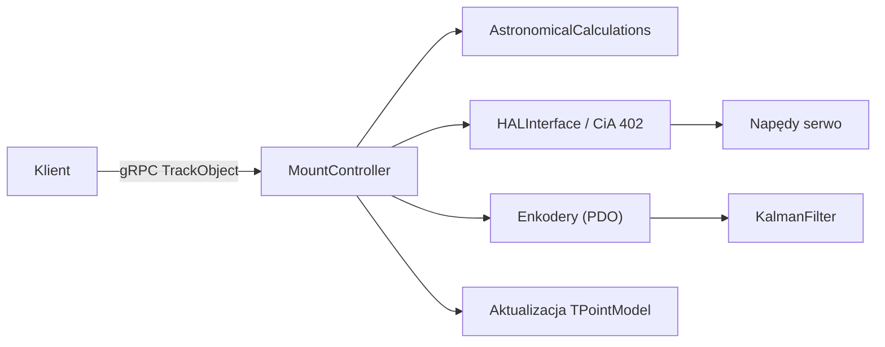
```mermaid
flowchart LR
    CLIENT["Klient"] -->|gRPC TrackObject| MC["MountController"]
    MC --> ASTRO["AstronomicalCalculations"]
    MC --> HAL["HALInterface / CiA 402"]
    HAL --> DRIVES["Napędy serwo"]
    MC --> ENC["Enkodery (PDO)"]
    ENC --> KF["KalmanFilter"]
    MC --> TP["Aktualizacja TPointModel"]
```

### 2. Kalibracja TPOINT

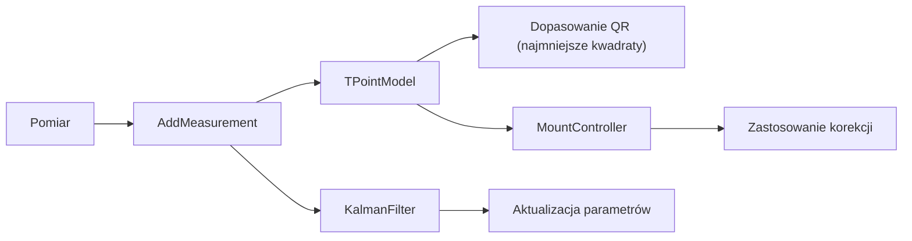
```mermaid
flowchart LR
    MEAS["Pomiar"] --> ADD["AddMeasurement"]
    ADD --> TPM["TPointModel"]
    TPM --> FIT["Dopasowanie QR (najmniejsze kwadraty)"]
    ADD --> KF2["KalmanFilter"]
    KF2 --> PARAM["Aktualizacja parametrów"]
    TPM --> MC2["MountController"]
    MC2 --> CORR["Zastosowanie korekcji"]
```

### 3. Autoguiding

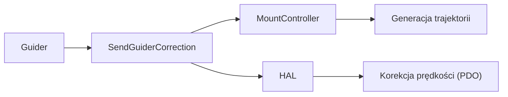
```mermaid
flowchart LR
    GUIDER["Guider"] --> CORR2["SendGuiderCorrection"]
    CORR2 --> MC3["MountController"]
    MC3 --> TRAJ["Generacja trajektorii"]
    CORR2 --> HAL2["HAL"]
    HAL2 --> VEL["Korekcja prędkości (PDO)"]
```

### 4. Przepływ integracji podsystemów / usług zewnętrznych

Kopuła, derotator i focuser działają **w procesie** (kontroler montażu przekazuje im dane montażu bezpośrednio). Pogoda i zasilanie pozostają zewnętrznymi usługami gRPC odpytywanymi przez kontroler:

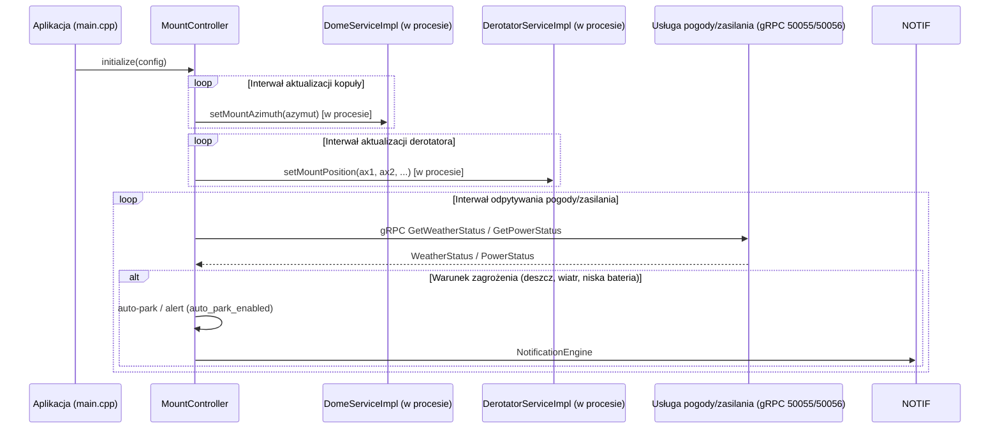
```mermaid
sequenceDiagram
    participant APP as Aplikacja (main.cpp)
    participant MC as MountController
    participant DOME as DomeServiceImpl (w procesie)
    participant DEROT as DerotatorServiceImpl (w procesie)
    participant EXT as Usługa pogody/zasilania (gRPC 50055/50056)

    APP->>MC: initialize(config)

    loop Interwał aktualizacji kopuły
        MC->>DOME: setMountAzimuth(azymut) [w procesie]
    end

    loop Interwał aktualizacji derotatora
        MC->>DEROT: setMountPosition(ax1, ax2, ...) [w procesie]
    end

    loop Interwał odpytywania pogody/zasilania
        MC->>EXT: gRPC GetWeatherStatus / GetPowerStatus
        EXT-->>MC: WeatherStatus / PowerStatus
        alt Warunek zagrożenia (deszcz, wiatr, niska bateria)
            MC->>MC: auto-park / alert (auto_park_enabled)
            MC->>NOTIF: NotificationEngine
        end
    end
```

### 5. Przepływ integracji HAL

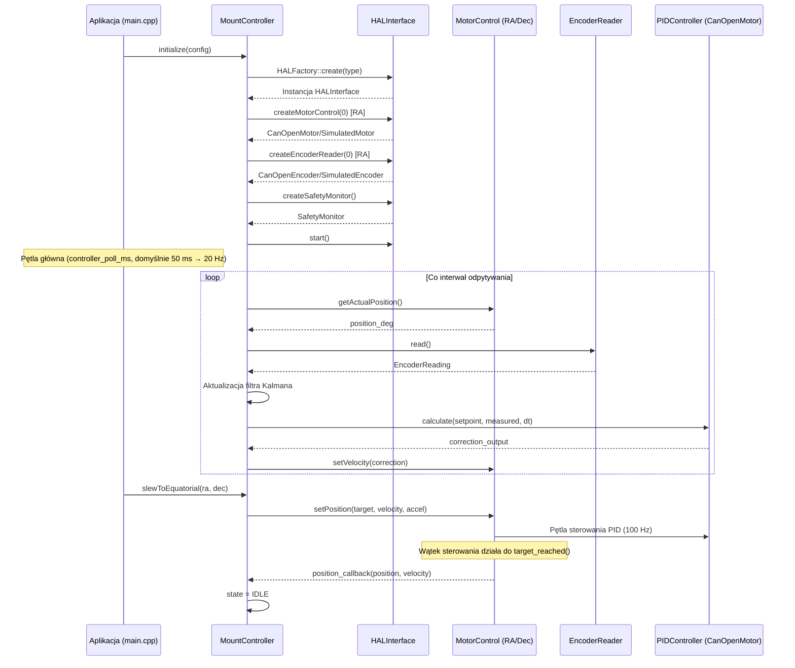
```mermaid
sequenceDiagram
    participant APP as Aplikacja (main.cpp)
    participant MC as MountController
    participant HAL as HALInterface
    participant MOT as MotorControl (RA/Dec)
    participant ENC as EncoderReader
    participant PID as PIDController (CanOpenMotor)

    APP->>MC: initialize(config)
    MC->>HAL: HALFactory::create(type)
    HAL-->>MC: Instancja HALInterface
    MC->>HAL: createMotorControl(0) [RA]
    HAL-->>MC: CanOpenMotor/SimulatedMotor
    MC->>HAL: createEncoderReader(0) [RA]
    HAL-->>MC: CanOpenEncoder/SimulatedEncoder
    MC->>HAL: createSafetyMonitor()
    HAL-->>MC: SafetyMonitor
    MC->>HAL: start()

    Note over APP: Pętla główna (controller_poll_ms, domyślnie 50 ms → 20 Hz)

    loop Co interwał odpytywania
        MC->>MOT: getActualPosition()
        MOT-->>MC: position_deg
        MC->>ENC: read()
        ENC-->>MC: EncoderReading
        MC->>MC: Aktualizacja filtra Kalmana
        MC->>PID: calculate(setpoint, measured, dt)
        PID-->>MC: correction_output
        MC->>MOT: setVelocity(correction)
    end

    APP->>MC: slewToEquatorial(ra, dec)
    MC->>MOT: setPosition(target, velocity, accel)
    MOT->>PID: Pętla sterowania PID (100 Hz)
    Note over MOT: Wątek sterowania działa do target_reached()
    MOT-->>MC: position_callback(position, velocity)
    MC->>MC: state = IDLE
```

---

## Zarządzanie zasobami

### Wątki systemu (proces kontrolera montażu)

1. **Wątek główny** — serwer gRPC, zarządzanie stanem
2. **Wątek/Wątki HAL** — komunikacja z napędami, odczyt enkoderów (wg implementacji HAL)
3. **Wątek śledzenia/obliczeniowy** — obliczenia astronomiczne, filtr Kalmana, PEC
4. **Wątek guidera** — komunikacja z systemem autoguiding
5. **Wątek derotatora** — asynchroniczny homing/kalibracja derotatora (zarządzany przez [`DerotatorController`](include/controllers/derotator_controller.h))
6. **Wątki odpytywania pogody/zasilania** — status usług zewnętrznych (gdy włączone)
7. **Wątek gamepada** — pętla sterowania ręcznego (gdy uruchomiona)

### Synchronizacja

```cpp
class MountController::Impl {
    std::shared_mutex state_mutex_;
    std::mutex config_mutex_;
    std::condition_variable cv_;
    std::atomic<bool> running_;
    std::atomic<bool> reentrancy_guard_;

    // Bezpieczny dostęp do stanu
    MountStatus getStatus() const {
        std::shared_lock<std::shared_mutex> lock(state_mutex_);
        return status_;
    }
};
```

---

## Obsługa błędów

### Hierarchia błędów

1. **Błędy komunikacji** — timeout CANopen, utrata połączenia gRPC
2. **Błędy sprzętowe** — błąd napędu, awaria enkodera, martwy węzeł CAN
3. **Błędy obliczeniowe** — niestabilność numeryczna, brak zbieżności, rozbieżność Kalmana
4. **Błędy konfiguracji** — nieprawidłowe parametry, brak kalibracji

### Guardy propagacji NaN/Inf

Pętla śledzenia implementuje wielowarstwową obronę przed propagacją NaN/Inf, zorganizowaną jako potok guardów upstream/downstream:

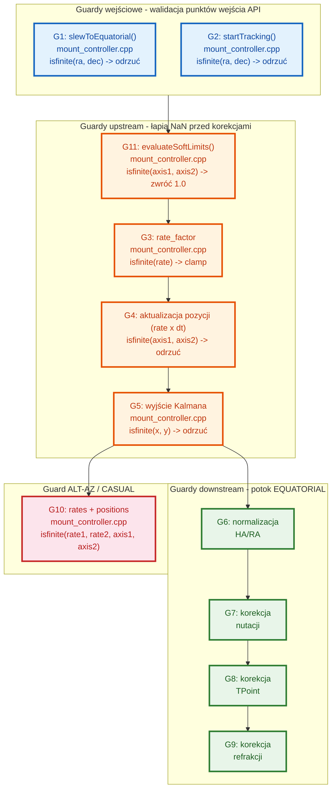
```mermaid
flowchart TB
    %% Style
    classDef input fill:#e3f2fd,stroke:#1565c0,stroke-width:3px,color:#0d47a1
    classDef upstream fill:#fff3e0,stroke:#e65100,stroke-width:3px,color:#bf360c
    classDef downstream fill:#e8f5e9,stroke:#2e7d32,stroke-width:3px,color:#1b5e20
    classDef altaz fill:#fce4ec,stroke:#c62828,stroke-width:3px,color:#b71c1c

    subgraph INPUT["Guardy wejściowe - walidacja punktów wejścia API"]
        direction TB
        G1["G1: slewToEquatorial()<br/>mount_controller.cpp<br/>isfinite(ra, dec) -> odrzuć"]
        G2["G2: startTracking()<br/>mount_controller.cpp<br/>isfinite(ra, dec) -> odrzuć"]
    end

    subgraph UPSTREAM["Guardy upstream - łapią NaN przed korekcjami"]
        direction TB
        G11["G11: evaluateSoftLimits()<br/>mount_controller.cpp<br/>isfinite(axis1, axis2) -> zwróć 1.0"]
        G3["G3: rate_factor<br/>mount_controller.cpp<br/>isfinite(rate) -> clamp"]
        G4["G4: aktualizacja pozycji (rate x dt)<br/>isfinite(axis1, axis2) -> odrzuć"]
        G5["G5: wyjście Kalmana<br/>mount_controller.cpp<br/>isfinite(x, y) -> odrzuć"]
    end

    subgraph DOWNSTREAM["Guardy downstream - potok EQUATORIAL"]
        direction LR
        G6["G6: normalizacja<br/>HA/RA"]
        G7["G7: korekcja<br/>nutacji"]
        G8["G8: korekcja<br/>TPoint"]
        G9["G9: korekcja<br/>refrakcji"]
    end

    subgraph ALTAZ["Guard ALT-AZ / CASUAL"]
        G10["G10: rates + positions<br/>mount_controller.cpp<br/>isfinite(rate1, rate2, axis1, axis2)"]
    end

    INPUT --> G11
    G11 --> G3
    G3 --> G4
    G4 --> G5
    G5 --> G6
    G5 --> G10
    G6 --> G7
    G7 --> G8
    G8 --> G9

    class G1,G2 input
    class G11,G3,G4,G5 upstream
    class G6,G7,G8,G9 downstream
    class G10 altaz
```

- **Guardy upstream** (3–5, 10–11): łapią NaN z obliczeń prędkości, injekcji guidera, rozbieżności filtru Kalmana i ewaluacji soft limitów, zanim dotrą do korekcji astronomicznych.
- **Guardy downstream** (6–9): łapią NaN z korekcji nutacji, TPoint i refrakcji.
- **Wszystkie guardy** używają `state_ = ERROR; break;` — natychmiastowe zakończenie pętli śledzenia i przejście do stanu `ERROR`, z którego `clearErrors()` odzyskuje do `IDLE`.

### Strategie odzyskiwania

1. **clearErrors()** — przejście `ERROR → IDLE`, join wątku roboczego, czyszczenie HAL, notyfikacja callbacków
2. **Retry** — automatyczne ponowienie dla błędów przejściowych
3. **Fallback** — przejście do trybu bezpiecznego (śledzenie gwiazdowe)
4. **Reinitialization** — ponowna inicjalizacja komponentu (`ReinitializeHAL`)
5. **Restart** — miękki/twardy restart kontrolera (`RestartController` / `HardRestartController`)
6. **Shutdown** — bezpieczne wyłączenie systemu

---

## Architektura sterowników zewnętrznych

System zawiera cztery standardowe sterowniki astronomiczne łączące się z API gRPC jako zewnętrzni klienci.

### 16. Sterownik ASCOM teleskopu ([`ascom/AstroMountTelescope.cs`](ascom/AstroMountTelescope.cs))

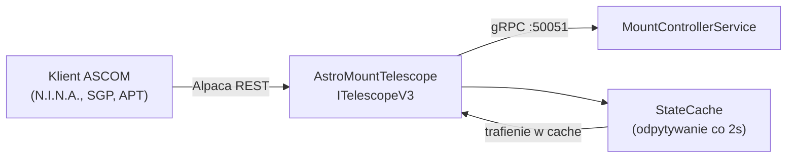
```mermaid
flowchart LR
    ASCOM["Klient ASCOM<br/>(N.I.N.A., SGP, APT)"] -->|"Alpaca REST"| AST["AstroMountTelescope<br/>ITelescopeV3"]
    AST -->|"gRPC :50051"| GRPC["MountControllerService"]
    AST --> SC["StateCache<br/>(odpytywanie co 2s)"]
    SC -->|"trafienie w cache"| AST
```

**Kluczowe punkty integracji:**
- `SlewToCoordinates()` → gRPC `SlewToCoordinates`
- `PulseGuide()` → gRPC `SendGuiderCorrection`
- `MoveAxis(axis, rate)` → gRPC `ControlAxis(AxisControlRequest { VELOCITY_CONTROL })`
- `Action("tpoint_status")` → odczyt `ControllerState.tpoint_params` z `GetState`
- `SetPark()` → odczyt stanu, aktualizacja pozycji parkowania w konfiguracji kontrolera
- `SupportedActions`: `tpoint_status`, `temperature`, `pressure`, `humidity`, `tracking_rate_ra`, `tracking_rate_dec`, `guider_status`, `derotator_status`

### 17. Sterownik ASCOM rotatora ([`ascom_rotator/AstroMountRotator.cs`](ascom_rotator/AstroMountRotator.cs))

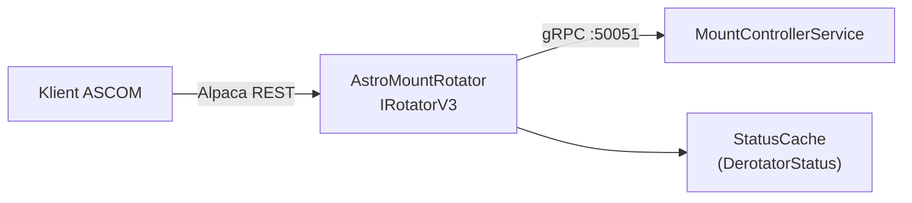
```mermaid
flowchart LR
    ASCOMR["Klient ASCOM"] -->|"Alpaca REST"| AROT["AstroMountRotator<br/>IRotatorV3"]
    AROT -->|"gRPC :50051"| GRPCR["MountControllerService"]
    AROT --> RC["StatusCache<br/>(DerotatorStatus)"]
```

**Kluczowe punkty integracji:**
- `MoveAbsolute(position)` → gRPC `ControlFieldRotation(FIXED_ANGLE, target_angle)`
- `Move(rate)` → gRPC `ControlFieldRotation(CUSTOM, rotation_rate)`
- `Halt()` → gRPC `ControlFieldRotation(DISABLED)`
- `Home()` → gRPC `HomeDerotator(SEQUENTIAL)`
- `Position` → buforowane z `GetDerotatorStatus`

### 18. Sterownik INDI teleskopu ([`indi/astro_mount_driver.cpp`](indi/astro_mount_driver.cpp))

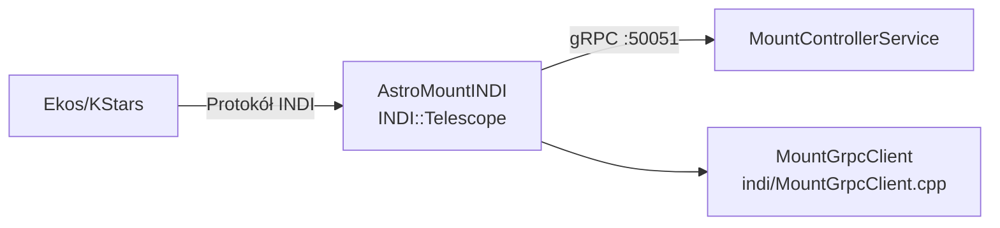
```mermaid
flowchart LR
    EKOS["Ekos/KStars"] -->|"Protokół INDI"| TEL["AstroMountINDI<br/>INDI::Telescope"]
    TEL -->|"gRPC :50051"| GRPC2["MountControllerService"]
    TEL --> GRPC_CLIENT["MountGrpcClient<br/>indi/MountGrpcClient.cpp"]
```

**Kluczowe punkty integracji:**
- `MoveNS`/`MoveWE` → gRPC `ControlAxis(axis_id=1/0, VELOCITY_CONTROL, ±1.0 deg/s)`
- `SetCurrentPark()` → odczyt `ControllerState.current_position()` → `SetParkData()` → aktualizacja konfiguracji
- `TPOINT_STATUS` → `ITextVectorProperty` (COEFFICIENTS, CHI2, CALIBRATED)
- `EnvironmentNP` → `INumberVectorProperty` (TEMPERATURE, PRESSURE, HUMIDITY)

### 19. Sterownik INDI rotatora ([`indi_rotator/astro_mount_rotator_driver.cpp`](indi_rotator/astro_mount_rotator_driver.cpp))

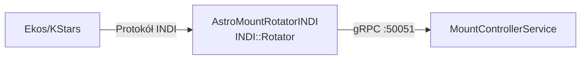
```mermaid
flowchart LR
    EKOS2["Ekos/KStars"] -->|"Protokół INDI"| ROT["AstroMountRotatorINDI<br/>INDI::Rotator"]
    ROT -->|"gRPC :50051"| GRPC3["MountControllerService"]
```

**Kluczowe punkty integracji:**
- `MoveRotator(angle)` → gRPC `ControlFieldRotation(FIXED_ANGLE)`
- `AbortRotator()` → gRPC `ControlFieldRotation(DISABLED)`
- `HomeRotator()` → gRPC `HomeDerotator(AUTO)`
- Tryb `CONNECTION_NONE` — bez połączenia szeregowego/TCP, tylko gRPC
- Możliwości: `ROTATOR_CAN_ABORT | ROTATOR_CAN_HOME`

---

## Wydajność

### Wymagania czasowe

- **Czas odpowiedzi API**: < 10 ms
- **Częstotliwość aktualizacji pozycji**: 100 Hz (pętla PID), 20 Hz (główny poll kontrolera)
- **Opóźnienie CANopen**: < 1 ms
- **Czas obliczeń astronomicznych**: < 1 ms

### Zużycie zasobów

- **CPU**: < 5% na rdzeń (typowe)
- **Pamięć**: ~50 MB (w tym buforowanie pomiarów)
- **Sieć**: ~1 Mbps (ruch gRPC)

---

## Rozszerzalność

### Punkty rozszerzeń

1. **Nowe modele matematyczne** — dziedziczenie po `TPointModel`, rozszerzenia `KalmanFilter`
2. **Dodatkowe interfejsy sprzętowe** — implementacja `HALInterface` i rejestracja w fabryce
3. **Nowe algorytmy śledzenia** — rozszerzenie pętli śledzenia / `EphemerisTracker`
4. **Dodatkowe protokoły komunikacji** — nowe transporty HAL (EtherCAT, Profinet itd.)
5. **Nowe usługi** — nowy `proto/*.proto` service + plik wykonywalny `*_server` linkowany z `astro_mount_core`
6. **Kanały powiadomień** — rozszerzenie [`src/notifications/channels/`](src/notifications/channels/)

### Konfiguracja HAL

```json
{
  "hal": {
    "type": "canopen",
    "name": "MainMountHAL",
    "canopen": { "interface_name": "can0", "bitrate": 500000, "node_id": 1 },
    "axes": [
      { "id": 0, "name": "RA",  "motor_config": { "type": "MOTOR_SERVO", "max_velocity": 10.0 } },
      { "id": 1, "name": "Dec", "motor_config": { "type": "MOTOR_SERVO", "max_velocity": 10.0 } }
    ]
  }
}
```

---

## Bezpieczeństwo

### Mechanizmy bezpieczeństwa

1. **Limity ruchu** — limity sprzętowe + soft limity w 3 strefach (ostrzeżenie/hamowanie/twarde zatrzymanie)
2. **Monitorowanie temperatury** — ochrona przed przegrzaniem (wyłączenie)
3. **Watchdog** — timeout iteracji 5 s → automatyczny stan `ERROR` (patrz [`include/safety/watchdog.h`](include/safety/watchdog.h))
4. **Emergency stop** — natychmiastowe zatrzymanie przy krytycznej awarii
5. **Wykrywanie martwych węzłów CAN** — 5 kolejnych awarii → emergency stop (MF7025v2)
6. **Auto-park pogoda/zasilanie** — automatyczne parkowanie przy deszczu/wietrze/niskiej baterii
7. **Guardy NaN/Inf** — 11 guardów zapobiega propagacji nieprawidłowych wartości w pętli śledzenia

### Walidacja danych wejściowych

```cpp
bool MountController::slewToEquatorial(double ra, double dec) {
    // Walidacja współrzędnych
    if (!std::isfinite(ra) || !std::isfinite(dec)) return false;
    if (ra < 0.0 || ra >= 24.0) return false;
    if (dec < -90.0 || dec > 90.0) return false;

    // Sprawdzenie limitów montażu
    if (wouldHitMeridian(ra, dec)) return false;
    if (wouldHitHorizon(ra, dec)) return false;

    // Kontynuuj slew
    return startSlew(ra, dec);
}
```
