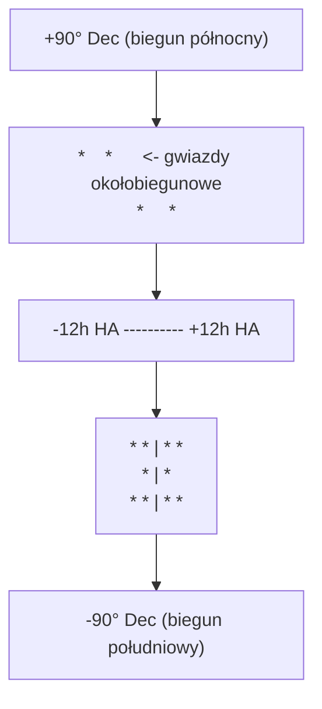

# Przygotowanie danych treningowych i wejściowych

> **Dokumentacja powiązana**: [`Przykłady użycia`](examples.md) · [`Przykłady API`](api_examples.md) · [`Model matematyczny TPOINT`](model_matematyczny.md#3-model-tpoint-do-korekcji-błędów-montażu) · [`Przepływ przetwarzania`](przetwarzanie_kontrolera.md)

---

## Spis treści

1. [Wprowadzenie](#1-wprowadzenie)
2. [Dane treningowe TPOINT](#2-dane-treningowe-tpoint)
   - 2.1 [Struktura pomiaru](#21-struktura-pomiaru)
   - 2.2 [Wymagane pola](#22-wymagane-pola)
   - 2.3 [Pola opcjonalne](#23-pola-opcjonalne)
   - 2.4 [Metody zbierania pomiarów](#24-metody-zbierania-pomiarów)
   - 2.5 [Pokrycie nieba](#25-pokrycie-nieba)
   - 2.6 [Minimalna liczba pomiarów](#26-minimalna-liczba-pomiarów)
   - 2.7 [Jakość pomiaru i odrzucanie outlierów](#27-jakość-pomiaru-i-odrzucanie-outlierów)
3. [Dane do kalibracji bootstrap](#3-dane-do-kalibracji-bootstrap)
   - 3.1 [Różnica między bootstrap a TPOINT](#31-różnica-między-bootstrap-a-tpoint)
   - 3.2 [Przygotowanie pomiarów bootstrap](#32-przygotowanie-pomiarów-bootstrap)
4. [Dane wejściowe systemu](#4-dane-wejściowe-systemu)
   - 4.1 [Konfiguracja kontrolera](#41-konfiguracja-kontrolera)
   - 4.2 [Dane efemeryd](#42-dane-efemeryd)
   - 4.3 [Dane z autoguidera](#43-dane-z-autoguidera)
   - 4.4 [Dane enkoderów](#44-dane-enkoderów)
   - 4.5 [Parametry fizyczne osi](#45-parametry-fizyczne-osi)
5. [Źródła błędów pomiarowych](#5-źródła-błędów-pomiarowych)
6. [Narzędzia pomocnicze](#6-narzędzia-pomocnicze)
7. [Scenariusze przygotowania danych](#7-scenariusze-przygotowania-danych)

---

## 1. Wprowadzenie

System Astronomical Mount Controller wykorzystuje dane treningowe do kalibracji modeli matematycznych korygujących błędy wskazywania montażu. Dane te dzielą się na dwie główne kategorie:

- **Dane treningowe** — pomiary zbierane w celu dopasowania parametrów modelu (głównie TPOINT i bootstrap)
- **Dane wejściowe** — dane konfiguracyjne i sterujące podawane do systemu (konfiguracja montażu, efemerydy, korekcje guidera)

Poprawne przygotowanie tych danych ma kluczowe znaczenie dla osiągnięcia dokładności sub-arcsecond.

### Gdzie są wykorzystywane?

| Typ danych | Model/Komponent | Lokalizacja kodu |
|-----------|----------------|-----------------|
| Pomiary TPOINT | [`TPointModel`](../include/models/tpoint_model.h) | [`src/models/tpoint_model.cpp`](../src/models/tpoint_model.cpp) |
| Pomiary bootstrap | [`MountController::Impl`](../src/controllers/mount_controller.cpp) | [`src/controllers/mount_controller.cpp`](../src/controllers/mount_controller.cpp:185) |
| Konfiguracja | [`ControllerConfig`](../include/controllers/mount_controller.h) | [`src/controllers/mount_controller.cpp`](../src/controllers/mount_controller.cpp:35) |
| Efemerydy | [`EphemerisTrackerManager`](../include/models/ephemeris_tracker.h) | [`src/models/ephemeris_tracker.cpp`](../src/models/ephemeris_tracker.cpp) |
| Korekcje guidera | [`MountController::Impl`](../src/controllers/mount_controller.cpp) | [`src/controllers/mount_controller.cpp:4979`](../src/controllers/mount_controller.cpp:4979) |

---

## 2. Dane treningowe TPOINT

### 2.1 Struktura pomiaru

Każdy pomiar TPOINT jest reprezentowany przez strukturę [`TPointModel::Measurement`](../include/models/tpoint_model.h:22):

```cpp
struct Measurement {
    // === POLA WYMAGANE ===
    double observed_ra;      // Obserwowana RA (godziny)
    double observed_dec;     // Obserwowana Dec (stopnie)
    double expected_ra;      // Oczekiwana RA z katalogu (godziny)
    double expected_dec;     // Oczekiwana Dec z katalogu (stopnie)
    double mount_ha;         // Kąt godzinny montażu (godziny)
    double mount_dec;        // Deklinacja montażu (stopnie)

    // === POLA OPCJONALNE (zalecane dla precyzji) ===
    double temperature;      // Temperatura otoczenia (°C)
    double pressure;         // Ciśnienie atmosferyczne (hPa)
    double humidity;         // Wilgotność względna (0-1)
    double snr;              // Stosunek sygnału do szumu
    double seeing;           // Seeing (sekundy łuku)

    // === POLA CZASOWE ===
    std::chrono::system_clock::time_point timestamp;
    double julian_date;      // Data juliańska obserwacji

    // === POLA RUCHU WŁASNEGO (dla gwiazd o dużym ruchu własnym) ===
    double proper_motion_ra; // Ruch własny w RA (mas/yr)
    double proper_motion_dec;// Ruch własny w Dec (mas/yr)
};
```

### 2.2 Wymagane pola

Aby pomiar został przyjęty przez model, **wszystkie pola wymagane muszą być wypełnione**:

| Pole | Jednostka | Zakres | Opis | Źródło |
|------|-----------|--------|------|--------|
| `observed_ra` | godziny | 0–24 | Współrzędna RA zmierzona (z plate solving) | Kamera + plate solver (ASTAP, astrometry.net) |
| `observed_dec` | stopnie | -90 do +90 | Współrzędna Dec zmierzona | Kamera + plate solver |
| `expected_ra` | godziny | 0–24 | RA z katalogu gwiazd | Katalog (Hipparcos, Tycho-2, Gaia) |
| `expected_dec` | stopnie | -90 do +90 | Dec z katalogu gwiazd | Katalog (Hipparcos, Tycho-2, Gaia) |
| `mount_ha` | godziny | -12 do +12 | Kąt godzinny montażu w momencie pomiaru | Enkodery montażu |
| `mount_dec` | stopnie | -90 do +90 | Deklinacja montażu w momencie pomiaru | Enkodery montażu |

#### Jak uzyskać `observed_ra` / `observed_dec`?

Obserwowane współrzędne pochodzą z **plate solving** — procesu identyfikacji gwiazd na zdjęciu i wyznaczenia współrzędnych astronomicznych środka kadru:

```
1. Wykonaj zdjęcie (ekspozycja 1-10s)
2. Przekaż zdjęcie do plate solvera:
   - ASTAP (zalecany, szybki dla małych pól widzenia)
   - astrometry.net (dokładny, ale wolniejszy)
   - lokalny serwer ASPS (PlateSolve 2/3)
3. Otrzymaj współrzędne (RA, Dec) środka kadru
4. To są Twoje observed_ra i observed_dec
```

> **Ważne**: Plate solving powinien być wykonany na tym samym zdjęciu, które jest używane do określenia pozycji gwiazdy. Nie używaj współrzędnych z poprzednich ekspozycji.

#### Jak uzyskać `expected_ra` / `expected_dec`?

Oczekiwane współrzędne pochodzą z **katalogu astronomicznego**:

```python
# Przykład: pobranie współrzędnych z katalogu Hipparcos
# poprzez bazę SIMBAD lub VizieR
import requests

def get_star_coordinates(star_name):
    """Pobiera współrzędne J2000 gwiazdy z SIMBAD."""
    url = f"https://simbad.u-strasbg.fr/simbad/sim-id"
    params = {
        "Ident": star_name,
        "output.format": "JSON",
        "Coord.ra": True,
        "Coord.dec": True
    }
    response = requests.get(url, params=params)
    data = response.json()
    return {
        "ra": data["ra"],       # godziny (J2000)
        "dec": data["dec"]      # stopnie (J2000)
    }
```

Do celów kalibracji TPOINT należy używać katalogów o wysokiej precyzji:

| Katalog | Dokładność pozycyjna | Liczba gwiazd | Uwagi |
|---------|---------------------|---------------|-------|
| **Gaia DR3** | ~0.1 mas | ~1.8 miliarda | Najdokładniejszy, ale wymaga korekcji epoki |
| **Hipparcos** | ~1 mas | ~118 tysięcy | Dobry balans dokładności/dostępności |
| **Tycho-2** | ~7 mas | ~2.5 miliona | Wystarczający dla większości zastosowań |
| **UCAC4** | ~15 mas | ~113 milionów | Dobry dla słabszych gwiazd |

#### Jak uzyskać `mount_ha` / `mount_dec`?

Pozycja montażu jest odczytywana z enkoderów lub silników krokowych:

```cpp
// Przykład: odczyt pozycji montażu po slewingu
MountController::MountStatus status = controller.getStatus();
double mount_ha  = status.current_position.ha;   // godziny
double mount_dec = status.current_position.dec;  // stopnie
```

```python
# Python przez gRPC
state = stub.GetState(empty_pb2.Empty())
mount_ha  = state.current_position.ha    # godziny
mount_dec = state.current_position.dec   # stopnie
```

> **Uwaga**: `mount_ha` to kąt godzinny **montażu**, nie gwiazdy. To wartość odczytywana z enkoderów, reprezentująca faktyczną pozycję mechaniczną montażu.

### 2.3 Pola opcjonalne

Mimo że nie są wymagane, **pola opcjonalne znacząco poprawiają dokładność modelu**:

#### Warunki środowiskowe (`temperature`, `pressure`, `humidity`)

Wpływ na refrakcję atmosferyczną. Błąd 5°C w temperaturze lub 10 hPa w ciśnieniu powoduje błąd refrakcji rzędu 0.1–0.5" na wysokości 45°.

```python
def read_environmental_sensors():
    """Odczyt czujników otoczenia."""
    # Zakładając czujnik BME280 podłączony przez I2C
    import board
    import adafruit_bme280
    
    i2c = board.I2C()
    bme280 = adafruit_bme280.Adafruit_BME280_I2C(i2c)
    
    return {
        "temperature": bme280.temperature,          # °C
        "pressure": bme280.pressure,                # hPa
        "humidity": bme280.humidity / 100.0         # 0-1
    }
```

#### Jakość pomiaru (`snr`, `seeing`)

Używane do ważenia pomiarów w dopasowaniu — pomiary o wyższym SNR i lepszym seeingu mają większą wagę:

```python
def estimate_measurement_quality(image, star_position):
    """Szacowanie jakości pomiaru na podstawie obrazu."""
    # SNR: stosunek sygnału gwiazdy do szumu tła
    star_flux = measure_star_flux(image, star_position)
    background_noise = measure_background_noise(image)
    snr = star_flux / background_noise
    
    # Seeing: FWHM gwiazdy w sekundach łuku
    fwhm_pixels = measure_fwhm(image, star_position)
    pixel_scale = get_pixel_scale()  # arcsec/pixel
    seeing = fwhm_pixels * pixel_scale
    
    return snr, seeing
```

**Zalecane progi jakości**:

| Parametr | Minimalna wartość | Zalecana wartość | Uwagi |
|----------|------------------|-----------------|-------|
| SNR | > 10 | > 50 | Poniżej 10 pomiar jest zbyt szumny |
| Seeing | < 5" | < 2" | Gorszy seeing = większy rozrzut |
| Wysokość nad horyzontem | > 20° | > 30° | Poniżej 20° refrakcja jest bardzo zmienna |

#### Znacznik czasu (`timestamp`, `julian_date`)

Używany do:
- Korekcji ruchu własnego gwiazd
- Korekcji precesji/nutacji
- Synchronizacji z warunkami środowiskowymi

```cpp
// Automatyczne wypełnienie znacznika czasu
#include <chrono>

TPointModel::Measurement meas;
meas.timestamp = std::chrono::system_clock::now();

// Data juliańska (obliczona np. przez SOFA)
meas.julian_date = calculateJulianDate(meas.timestamp);
```

### 2.4 Metody zbierania pomiarów

#### Metoda ręczna (przez gRPC API)

Najprostsza metoda — użytkownik ręcznie wybiera gwiazdy i dodaje pomiary:

```python
def collect_tpoint_measurement(stub, target_ra, target_dec):
    """Zbieranie pojedynczego pomiaru TPOINT."""
    
    # 1. Slew do gwiazdy
    coords = proto.Coordinates(ra=target_ra, dec=target_dec)
    stub.SlewToCoordinates(coords)
    
    # 2. Odczekaj na stabilizację (czas zależny od montażu)
    time.sleep(5)  # Dostosuj do swojego montażu
    
    # 3. Wykonaj zdjęcie i plate solving
    # (funkcja zależna od sprzętu)
    observed_ra, observed_dec = capture_and_solve()
    
    # 4. Pobierz pozycję montażu
    state = stub.GetState(empty_pb2.Empty())
    
    # 5. Odczytaj warunki środowiskowe
    env = read_environmental_sensors()
    
    # 6. Utwórz pomiar
    measurement = proto.Measurement()
    measurement.observed.ra = observed_ra
    measurement.observed.dec = observed_dec
    measurement.expected.ra = target_ra
    measurement.expected.dec = target_dec
    measurement.mount_position.ha = state.current_position.ha
    measurement.mount_position.dec = state.current_position.dec
    measurement.temperature = env["temperature"]
    measurement.pressure = env["pressure"]
    measurement.humidity = env["humidity"]
    
    ts = timestamp_pb2.Timestamp()
    ts.GetCurrentTime()
    measurement.timestamp.CopyFrom(ts)
    
    # 7. Dodaj pomiar
    stub.AddMeasurement(measurement)
    print(f"Pomiar dodany: ({observed_ra:.4f}h, {observed_dec:.4f}°)")
```

#### Metoda automatyczna (skrypt z listą gwiazd)

Skrypt iteruje przez predefiniowaną listę gwiazd:

```python
def auto_collect_measurements(stub, star_list):
    """Automatyczne zbieranie pomiarów dla listy gwiazd."""
    
    results = []
    for i, star in enumerate(star_list):
        print(f"\n[{i+1}/{len(star_list)}] {star['name']}...")
        
        try:
            # Slew
            coords = proto.Coordinates(
                ra=star['ra'], dec=star['dec']
            )
            stub.SlewToCoordinates(coords)
            time.sleep(star.get('settle_time', 5))
            
            # Plate solving
            obs_ra, obs_dec = capture_and_solve(
                exposure=star.get('exposure', 3)
            )
            
            # Pobierz stan
            state = stub.GetState(empty_pb2.Empty())
            
            # Dodaj pomiar
            stub.AddMeasurement(create_measurement(
                obs_ra, obs_dec,
                star['ra'], star['dec'],
                state.current_position
            ))
            
            results.append({
                'star': star['name'],
                'residual': calculate_residual(
                    obs_ra, obs_dec, star['ra'], star['dec']
                )
            })
            
        except Exception as e:
            print(f"  Błąd dla {star['name']}: {e}")
            continue
    
    return results
```

#### Metoda z integracją plate solving

W pełni zautomatyzowany proces z użyciem ASTAP:

```python
import subprocess
import json

def solve_with_astap(image_path):
    """Plate solving przy użyciu ASTAP."""
    
    result = subprocess.run([
        "astap",
        "-f", image_path,
        "-r", 50,           # Promień wyszukiwania (stopnie)
        "-s", 10,           # Skala wyszukiwania (stopnie/piksel)
        "-o", "solved.fits"
    ], capture_output=True, text=True)
    
    # Odczytaj wyniki z pliku
    with open("solved.wcs", "r") as f:
        wcs_data = json.load(f)
    
    return {
        "ra": wcs_data["RA"] / 15.0,      # godziny
        "dec": wcs_data["DEC"],            # stopnie
        "snr": wcs_data["SNR"],
        "stars_used": wcs_data["Nstars"]
    }


def capture_and_solve(exposure=3):
    """Wykonanie zdjęcia i plate solving."""
    
    # 1. Wykonaj zdjęcie przez ZWO/INDI
    subprocess.run([
        "indi_setprop", "CCD1.CCD_EXPOSURE.CCD_EXPOSURE_VALUE",
        str(exposure)
    ])
    time.sleep(exposure + 2)  # Czas ekspozycji + odczyt
    
    # 2. Pobierz zdjęcie
    subprocess.run([
        "indi_getprop", "CCD1.CCD_CCD_FILE.CCD_FILE_PATH"
    ])
    
    # 3. Plate solving
    result = solve_with_astap("/tmp/latest.fit")
    
    return result["ra"], result["dec"]
```

### 2.5 Pokrycie nieba

Dla uzyskania dobrze uwarunkowanego modelu TPOINT, pomiary powinny **równomiernie pokrywać sferę niebieską**.

#### Zalecany rozkład pomiarów



**Zalecenia**:

| Liczba pomiarów | Pokrycie | Minimalny zestaw termów TPOINT |
|----------------|----------|-------------------------------|
| 10-20 | Podstawowe | IA, CA, NP, PA (4 termy) |
| 20-40 | Standardowe | IA, CA, NP, PA, PAz, TF_h, TF_d (7 termów) |
| 40-80 | Rozszerzone | 7 podstawowych + TR, WE, EE (10-12 termów) |
| 80-150 | Pełne | Wszystkie 21 termów |

**Wskazówki dotyczące rozmieszczenia**:

1. **Równomiernie w HA**: Pomiary powinny obejmować cały zakres kąta godzinnego (-12h do +12h). Unikaj grupowania pomiarów wokół jednej wartości HA.

2. **Różne deklinacje**: Zbieraj pomiary zarówno blisko równika (Dec ≈ 0°), jak i przy biegunach (Dec ≈ ±60-80°). Pomiary tylko przy równiku nie pozwolą na estymację członów zależnych od `tan(Dec)`.

3. **Obie strony południka**: Minimum 30% pomiarów po wschodniej i 30% po zachodniej stronie południka dla wykrycia błędów związanych z meridian flip.

4. **Unikaj niskich wysokości**: Pomiary poniżej 20° nad horyzontem są obarczone dużą refrakcją i turbulencją.

#### Przykładowa lista kalibracyjna

```python
def generate_calibration_grid(num_points=40):
    """Generuje siatkę gwiazd do kalibracji TPOINT."""
    import numpy as np
    
    # Równomierny rozkład w HA i Dec
    ha_values = np.linspace(-11, 11, int(np.sqrt(num_points * 2)))
    dec_values = np.linspace(-70, 70, int(np.sqrt(num_points / 2)))
    
    stars = []
    for ha in ha_values:
        for dec in dec_values:
            # Znajdź jasną gwiazdę w pobliżu tych współrzędnych
            star = find_bright_star_near(ha, dec, magnitude_limit=8.0)
            if star:
                stars.append(star)
    
    return stars[:num_points]


def find_bright_star_near(ha, dec, magnitude_limit=8.0):
    """Znajduje jasną gwiazdę w pobliżu zadanych współrzędnych."""
    # W rzeczywistym użyciu: zapytanie do bazy katalogu gwiazd
    # Przykład z użyciem Astroquery:
    from astroquery.vizier import Vizier
    
    ra = (calculate_lst() - ha) % 24  # Konwersja HA -> RA
    
    vizier = Vizier(
        catalog="I/239/hip_main",  # Hipparcos
        columns=["RAhms", "DEdms", "Vmag", "Plx"],
        row_limit=10
    )
    
    result = vizier.query_region(
        f"{ra}h {dec}d",
        radius="5d",
        catalog="I/239/hip_main"
    )
    
    if result and len(result[0]) > 0:
        # Wybierz najjaśniejszą gwiazdę
        brightest = result[0][result[0]["Vmag"].argmin()]
        if brightest["Vmag"] <= magnitude_limit:
            return {
                "name": str(brightest["HIP"]),
                "ra": float(brightest["RAhms"]) * 15,  # godziny
                "dec": float(brightest["DEdms"]),
                "mag": float(brightest["Vmag"])
            }
    
    return None
```

### 2.6 Minimalna liczba pomiarów

Liczba wymaganych pomiarów zależy od liczby aktywnych termów TPOINT:

```
N_min = 2 × N_terms + 5
```

| Liczba termów | Konfiguracja `enabled_terms` | N_min | Zalecane N |
|--------------|------------------------------|-------|------------|
| 4 (podstawowe) | `IA, CA, NP, PA` | 13 | 20 |
| 7 (standardowe) | + `PAz, TF_h, TF_d` | 19 | 30 |
| 10 (rozszerzone) | + `TR, WE, EE_HA` | 25 | 50 |
| 15 | + `EE_Dec, REFR` | 35 | 70 |
| 21 (pełne) | `0xFFFF` (wszystkie) | 47 | 100 |

> **Ważne**: Model automatycznie odrzuci pomiary o zbyt dużym residuum (outliery). W praktyce należy zebrać o 20-30% więcej pomiarów niż teoretyczne minimum.

#### Sprawdzanie gotowości do kalibracji

```python
def check_calibration_readiness(stub):
    """Sprawdza, czy zebrano wystarczającą liczbę pomiarów."""
    
    status = stub.GetBootstrapStatus(empty_pb2.Empty())
    
    print(f"Zebrane pomiary: {status.measurement_count}")
    print(f"Wymagane minimum: {status.min_measurements_required}")
    print(f"Gotowy do TPOINT: {status.ready_for_tpoint}")
    print(f"Max residuum: {status.max_residual_arcsec:.2f}\"")
    
    if status.ready_for_tpoint:
        print("✓ Można uruchomić kalibrację TPOINT")
    else:
        print(f"✗ Potrzebne jeszcze "
              f"{status.min_measurements_for_tpoint - status.measurement_count} "
              f"pomiarów")
    
    return status.ready_for_tpoint
```

### 2.7 Jakość pomiaru i odrzucanie outlierów

Model TPOINT automatycznie wykrywa i odrzuca outliery podczas dopasowania:

```cpp
// src/models/tpoint_model.cpp
void TPointModel::Impl::detectAndRemoveOutliers(double threshold_arcsec) {
    auto it = measurements_.begin();
    while (it != measurements_.end()) {
        double residual = calculateResidual(*it);
        if (std::abs(residual) > threshold_arcsec) {
            LOG_WARN("Usunięto outlier: residual = " + 
                     std::to_string(residual) + "\"");
            it = measurements_.erase(it);
        } else {
            ++it;
        }
    }
}
```

**Zalecane progi odrzucania**:

| Etap kalibracji | Próg odrzucenia | Uwagi |
|----------------|----------------|-------|
| Wstępna (pierwsze 10 pomiarów) | 60" | Luźny próg dla wstępnego modelu |
| Po wstępnym dopasowaniu | 30" | Standardowy próg |
| Po dopracowaniu (iteracja 3+) | 10" | Wąski próg dla precyzyjnego modelu |
| Ostateczna kalibracja | 5" | Dla dokładności sub-arcsecond |

**Najczęstsze przyczyny outlierów**:

| Przyczyna | Typowy residuum | Rozwiązanie |
|-----------|----------------|------------|
| Błąd plate solving | > 60" | Zwiększ ekspozycję, popraw ostrość |
| Błąd identyfikacji gwiazdy | > 180" | Zweryfikuj katalog, sprawdź jasność |
| Podmuch wiatru | 5-30" | Odrzuć pomiar, poczekaj na uspokojenie |
| Błąd enkodera | 1-10" | Sprawdź kalibrację enkoderów |
| Silna refrakcja (niski alt) | 10-60" | Odrzuć pomiary poniżej 20° wysokości |
| Błąd synchronizacji czasu | 1-15" | Sprawdź NTP, synchronizuj zegar systemowy |

---

## 3. Dane do kalibracji bootstrap

### 3.1 Różnica między bootstrap a TPOINT

| Cecha | Bootstrap | TPOINT |
|-------|-----------|--------|
| Cel | Wstępne określenie orientacji montażu | Precyzyjna korekcja błędów geometrycznych |
| Liczba pomiarów | 2-10 | 10-150 |
| Dokładność | ~30-300" | < 5" (docelowo < 1") |
| Typ montażu | EQUATORIAL i CASUAL | EQUATORIAL (CASUAL ograniczony) |
| Model matematyczny | Macierz rotacji (SVD/Wahba) | 21 parametrów geometrycznych |
| Gdy jest używany | Przed TPOINT, po zmianie konfiguracji | Po bootstrap, do precyzyjnego wskazywania |

### 3.2 Przygotowanie pomiarów bootstrap

Pomiary bootstrap mają prostszą strukturę niż TPOINT:

```cpp
struct BootstrapMeasurement {
    double observed_ra;      // Obserwowana RA (godziny)
    double observed_dec;     // Obserwowana Dec (stopnie)
    double expected_ra;      // Oczekiwana RA (godziny)
    double expected_dec;     // Oczekiwana Dec (stopnie)
    double mount_ha;         // Kąt godzinny montażu (opcjonalny dla CASUAL)
    double mount_dec;        // Deklinacja montażu (opcjonalny dla CASUAL)
};
```

#### Dla montażu EQUATORIAL

Wystarczą **2 pomiary** do wyznaczenia początkowej orientacji:

```python
def collect_bootstrap_equatorial(stub):
    """Zbieranie 2 pomiarów bootstrap dla montażu EQUATORIAL."""
    
    measurements = []
    
    # Pomiar 1: gwiazda blisko południka
    star1 = get_bright_star(ha=0, dec=45)
    add_bootstrap_measurement(stub, star1)
    
    # Pomiar 2: gwiazda po wschodniej stronie
    star2 = get_bright_star(ha=-4, dec=30)
    add_bootstrap_measurement(stub, star2)
    
    # Uruchom kalibrację bootstrap
    stub.RunBootstrapCalibration(empty_pb2.Empty())
    
    status = stub.GetBootstrapStatus(empty_pb2.Empty())
    print(f"Kalibracja bootstrap: {status.measurement_count} pomiarów")
```

#### Dla montażu CASUAL (dowolnie zorientowany)

Wymagane **minimum 3 pomiary** (najlepiej 5+) dla estymacji kwaternionu orientacji metodą Wahba:

```python
def collect_bootstrap_casual(stub):
    """Zbieranie pomiarów bootstrap dla montażu CASUAL."""
    
    # Dla CASUAL potrzebujemy pomiarów w różnych kierunkach
    stars = [
        {"name": "Gwiazda W", "ra": 15.0, "dec": 45.0},
        {"name": "Gwiazda E", "ra": 3.0,  "dec": 30.0},
        {"name": "Gwiazda N", "ra": 10.0, "dec": 75.0},
        {"name": "Gwiazda S", "ra": 8.0,  "dec": -20.0},
        {"name": "Gwiazda zenitalna", "ra": 12.0, "dec": 52.0},
    ]
    
    for star in stars:
        print(f"Pomiar bootstrap: {star['name']}")
        
        # Slew
        coords = proto.Coordinates(ra=star['ra'], dec=star['dec'])
        stub.SlewToCoordinates(coords)
        time.sleep(5)
        
        # Plate solving
        obs_ra, obs_dec = capture_and_solve(exposure=5)
        
        # Dodaj pomiar bootstrap
        measurement = proto.BootstrapMeasurement()
        measurement.observed.ra = obs_ra
        measurement.observed.dec = obs_dec
        measurement.expected.ra = star['ra']
        measurement.expected.dec = star['dec']
        # Dla CASUAL mount_ha/mount_dec są opcjonalne
        
        stub.AddBootstrapMeasurement(measurement)
    
    # Uruchom kalibrację
    result = stub.RunBootstrapCalibration(empty_pb2.Empty())
    print(f"Kalibracja CASUAL: orientacja określona = {result.success}")
    print(f"Residuum: {result.mean_residual_arcsec:.2f}\"")
```

> **Dla CASUAL**: Pomiary powinny być jak najbardziej rozproszone na sferze niebieskiej. Trzy pomiary w jednym małym obszarze nie pozwolą na jednoznaczne określenie orientacji kwaternionu.

---

## 4. Dane wejściowe systemu

### 4.1 Konfiguracja kontrolera

Dane konfiguracyjne są przesyłane przez strukturę [`ControllerConfig`](../include/controllers/mount_controller.h):

#### Pola konfiguracyjne

```cpp
struct ControllerConfig {
    // === LOKALIZACJA ===
    double latitude;           // Szerokość geograficzna (stopnie, N+)
    double longitude;          // Długość geograficzna (stopnie, E+)
    double altitude;           // Wysokość n.p.m. (metry)
    
    // === TYP MONTAŻU ===
    enum MountType {
        EQUATORIAL = 0,       // Równikowy (niemiecki/fork)
        ALT_AZ = 1,           // Azymutalny
        CASUAL = 3,           // Dowolnie zorientowany
    };
    MountType mount_type;
    
    // === PARAMETRY RUCHU ===
    double max_slew_rate;         // Maks. prędkość slewu (deg/s)
    double max_tracking_rate;     // Maks. prędkość śledzenia (deg/s)
    double slew_acceleration;     // Przyspieszenie slewu (deg/s²)
    double tracking_acceleration; // Przyspieszenie śledzenia (deg/s²)
    
    // === FILTR KALMANA ===
    double process_noise;         // Szum procesu
    double measurement_noise;     // Szum pomiaru
    bool adaptive_q;              // Adaptacyjny szum procesu
    double innovation_threshold;  // Próg innowacji
    
    // === TPOINT ===
    uint32_t tpoint_enabled_terms; // Aktywne termy (bitmask)
    int tpoint_min_measurements;   // Min. liczba pomiarów
    double tpoint_max_residual;    // Maks. residuum (arcsec)
    
    // === PARKOWANIE ===
    double park_position_axis1;    // Pozycja parkowania oś 1 (deg)
    double park_position_axis2;    // Pozycja parkowania oś 2 (deg)
    bool meridian_flip_enabled;    // Automatyczny meridian flip
    double meridian_flip_delay_minutes; // Opóźnienie MF (minuty)
    
    // === SOFT LIMITY ===
    bool soft_limits_enabled;
    double soft_limit_axis1_min, soft_limit_axis1_max;
    double soft_limit_axis2_min, soft_limit_axis2_max;
};
```

#### Przygotowanie konfiguracji

```python
def prepare_mount_config(latitude, longitude, altitude, mount_type="EQUATORIAL"):
    """Przygotowanie konfiguracji montażu."""
    
    config = proto.ControllerConfig()
    
    # Lokalizacja (PRECYZYJNIE!)
    config.latitude = latitude     # Np. 52.229675 dla Warszawy
    config.longitude = longitude   # Np. 21.012229
    config.altitude = altitude     # Np. 112.0
    
    # Typ montażu
    config.mount_type = mount_type  # EQUATORIAL, ALT_AZ, CASUAL
    
    # Parametry ruchu
    config.max_slew_rate = 5.0         # deg/s (dla bezpieczeństwa)
    config.max_tracking_rate = 0.004178  # Szybkość gwiazdowa [deg/s]
    config.slew_acceleration = 0.5
    config.tracking_acceleration = 0.001
    
    # Filtr Kalmana
    config.process_noise = 0.001
    config.measurement_noise = 0.5
    config.adaptive_q = True
    config.innovation_threshold = 3.0  # 3 sigma
    
    # TPOINT - wszystkie termy aktywne
    config.tpoint_enabled_terms = 65535
    config.tpoint_min_measurements = 10  # Minimum bootstrap
    config.tpoint_max_residual = 30.0    # arcsec
    
    # Soft limity (dostosuj do montażu!)
    config.soft_limits_enabled = True
    
    # Dla montażu równikowego (niemiecki):
    config.soft_limit_axis1_min = -5.0    # HA minimum (godziny)
    config.soft_limit_axis1_max = 365.0   # HA maximum (stopnie)
    config.soft_limit_axis2_min = -5.0    # Dec minimum
    config.soft_limit_axis2_max = 185.0   # Dec maximum
    
    # Parkowanie
    config.park_position_axis1 = 0.0   # HA = 0 (południk)
    config.park_position_axis2 = 90.0  # Dec = 90 (biegun)
    config.meridian_flip_enabled = True
    config.meridian_flip_delay_minutes = 5.0
    
    return config


# Zastosowanie konfiguracji
config = prepare_mount_config(52.229675, 21.012229, 112.0, "EQUATORIAL")
stub.UpdateConfiguration(config)
print("Konfiguracja zastosowana")
```

#### Dokładność parametrów lokalizacji

| Parametr | Wymagana dokładność | Źródło | Konsekwencje błędu |
|----------|--------------------|--------|-------------------|
| Szerokość geograficzna | < 0.001° (~100m) | GPS, Google Maps | Błąd ~1" na każde 0.001° |
| Długość geograficzna | < 0.001° (~100m) | GPS, Google Maps | Błąd synchronizacji czasu |
| Wysokość n.p.m. | < 10 m | GPS, mapa topograficzna | Błąd refrakcji < 0.1" |
| Czas systemowy | < 0.1 s | NTP | Błąd ~1.5" na każde 0.1s |

> **Zalecenie**: Użyj odbiornika GPS do precyzyjnego określenia pozycji obserwatorium. Synchronizuj czas przez NTP z lokalnym serwerem czasu.

### 4.2 Dane efemeryd

Dane efemeryd są używane do śledzenia obiektów ruchomych (komety, asteroidy, satelity).

#### Struktura danych efemeryd

```protobuf
message EphemerisData {
    string object_id = 1;          // Identyfikator obiektu
    string object_name = 2;        // Nazwa obiektu
    repeated EphemerisPoint points = 3;  // Punkty efemeryd
}

message EphemerisPoint {
    Timestamp timestamp = 1;       // Czas obserwacji
    double ra = 2;                 // RA w godzinach (J2000)
    double dec = 3;                // Dec w stopniach (J2000)
    double magnitude = 4;          // Jasność (opcjonalnie)
    double rate_ra = 5;           // Prędkość RA (arcsec/h)
    double rate_dec = 6;          // Prędkość Dec (arcsec/h)
}
```

#### Przygotowanie danych efemeryd

```python
def prepare_ephemeris_from_mpc(asteroid_name):
    """Pobranie i przygotowanie efemeryd z Minor Planet Center."""
    
    # Pobranie efemeryd z MPC (przykład)
    # W rzeczywistości: pobierz plik MPC, sparsuj go
    ephemeris_data = fetch_mpc_ephemeris(asteroid_name)
    
    # Przygotowanie w formacie systemu
    ephemeris = proto.EphemerisData()
    ephemeris.object_id = asteroid_name
    ephemeris.object_name = asteroid_name
    
    for raw_point in ephemeris_data:
        point = proto.EphemerisPoint()
        
        # Konwersja czasu na Timestamp protobuf
        ts = timestamp_pb2.Timestamp()
        ts.FromDatetime(raw_point['datetime'])
        point.timestamp.CopyFrom(ts)
        
        # Współrzędne w J2000
        point.ra = raw_point['ra_hours']        # godziny
        point.dec = raw_point['dec_degrees']     # stopnie
        point.magnitude = raw_point['mag']
        
        # Prędkości (opcjonalne, obliczane automatycznie jeśli brak)
        point.rate_ra = raw_point.get('rate_ra', 0.0)
        point.rate_dec = raw_point.get('rate_dec', 0.0)
        
        ephemeris.points.append(point)
    
    return ephemeris
```

**Zalecenia dla danych efemeryd**:

| Parametr | Zalecenie | Uzasadnienie |
|----------|-----------|-------------|
| Interwał punktów | 1-10 minut dla komet/asteroid | Liniowa interpolacja między punktami |
| Interwał dla satelitów LEO | 10-30 sekund | Wysoka prędkość kątowa |
| Liczba punktów | 50-500 | Więcej = dokładniejsza interpolacja |
| Horyzont czasowy | 2-24 godziny | Uwzględnij całą sesję obserwacyjną |
| Układ współrzędnych | J2000 (ICRS) | System używa J2000 wewnętrznie |

#### Walidacja danych efemeryd

```python
def validate_ephemeris(ephemeris):
    """Walidacja danych efemeryd przed przesłaniem."""
    
    errors = []
    
    if len(ephemeris.points) < 3:
        errors.append("Minimum 3 punkty efemeryd wymagane")
    
    # Sprawdź kolejność czasową
    times = [p.timestamp.ToDatetime() for p in ephemeris.points]
    if not all(times[i] < times[i+1] for i in range(len(times)-1)):
        errors.append("Punkty efemeryd nie są posortowane chronologicznie")
    
    # Sprawdź zakresy
    for p in ephemeris.points:
        if not (0 <= p.ra < 24):
            errors.append(f"RA poza zakresem: {p.ra}")
        if not (-90 <= p.dec <= 90):
            errors.append(f"Dec poza zakresem: {p.dec}")
    
    # Sprawdź odstępy czasowe
    for i in range(len(times)-1):
        dt = (times[i+1] - times[i]).total_seconds()
        if dt > 3600:  # > 1 godzina
            errors.append(f"Zbyt duży odstęp między punktami: {dt}s")
    
    if errors:
        for e in errors:
            print(f"Błąd walidacji: {e}")
        return False
    
    print("✓ Dane efemeryd poprawne")
    return True
```

### 4.3 Dane z autoguidera

Dane korekcyjne z autoguidera są przesyłane przez API [`SendGuiderCorrection`](api.md#sendguidercorrection-guider):

```python
def prepare_guider_correction(dx_pixels, dy_pixels, pixel_scale, exposure_time):
    """Przygotowanie korekcji z guidera."""
    
    # Konwersja pikseli na sekundy łuku
    dx_arcsec = dx_pixels * pixel_scale
    dy_arcsec = dy_pixels * pixel_scale
    
    # Przygotowanie wiadomości
    correction = proto.GuiderCorrection()
    correction.delta_ra = dx_arcsec        # arcsec
    correction.delta_dec = dy_arcsec       # arcsec
    correction.exposure_time_ms = exposure_time
    correction.quality = min(1.0, max(0.1, 
        1.0 - (abs(dx_arcsec) + abs(dy_arcsec)) / 100.0))
    
    return correction
```

**Konfiguracja guidera**:

| Parametr | Wartość domyślna | Zalecany zakres | Opis |
|----------|-----------------|----------------|------|
| `aggression` | 0.5 | 0.1-0.8 | Agresywność korekcji (0=none, 1=full) |
| `max_correction` | 10.0" | 3-30" | Maksymalna pojedyncza korekcja |
| `exposure_time_ms` | 2000 | 500-5000 | Czas ekspozycji kamery guidera |
| `binning` | 2 | 1-4 | Binning kamery |

### 4.4 Dane enkoderów

Konfiguracja enkoderów wpływa na dokładność odczytu pozycji montażu.

```python
def configure_encoders(stub, encoder_type="ABSOLUTE", resolution=36000):
    """Konfiguracja enkoderów."""
    
    config = stub.GetConfiguration(empty_pb2.Empty())
    
    # Typ enkodera
    config.encoders_absolute = (encoder_type == "ABSOLUTE")
    
    # Rozdzielczość enkodera (counts/rev)
    config.ha_axis_params.encoder_resolution = resolution
    config.dec_axis_params.encoder_resolution = resolution
    
    # Oblicz rozdzielczość w sekundach łuku
    # Dla enkodera absolutnego 36000 cnt/rev:
    # rozdzielczość = 360° × 3600" / 36000 = 36"/count
    encoder_arcsec = 360.0 * 3600.0 / resolution
    print(f"Rozdzielczość enkodera: {encoder_arcsec:.2f}\"/count")
    
    stub.UpdateConfiguration(config)
```

**Porównanie typów enkoderów**:

| Typ | Rozdzielczość | Dokładność | Cena | Zastosowanie |
|-----|--------------|------------|------|-------------|
| Enkoder inkrementalny | 0.1-1" | ±1-5" | Niska | Podstawowe montaże |
| Enkoder absolutny magnetyczny | 0.1-0.5" | ±1-3" | Średnia | Średniej klasy montaże |
| Enkoder absolutny optyczny | 0.01-0.1" | ±0.1-0.5" | Wysoka | Wysokiej klasy montaże |
| Enkoder interferometryczny | < 0.001" | ±0.01" | Bardzo wysoka | Badania naukowe |

### 4.5 Parametry fizyczne osi

Parametry fizyczne osi są kluczowe dla modelowania błędów mechanicznych.

```python
def prepare_axis_parameters(ha_params, dec_params):
    """Przygotowanie parametrów fizycznych osi."""
    
    config = proto.ControllerConfig()
    
    # Oś HA (Hour Angle / RA)
    config.ha_axis_params.motor_steps_per_rev = ha_params['motor_steps']
    config.ha_axis_params.motor_microstepping = ha_params['microstepping']
    config.ha_axis_params.gear_ratio = ha_params['gear_ratio']
    config.ha_axis_params.backlash = ha_params['backlash']  # arcsec
    
    # Oś Dec
    config.dec_axis_params.motor_steps_per_rev = dec_params['motor_steps']
    config.dec_axis_params.motor_microstepping = dec_params['microstepping']
    config.dec_axis_params.gear_ratio = dec_params['gear_ratio']
    config.dec_axis_params.backlash = dec_params['backlash']  # arcsec
    
    return config
```

**Przykładowe wartości dla typowych montaży**:

| Parametr | Montaż amatorski | Montaż średniej klasy | Montaż profesjonalny |
|----------|-----------------|----------------------|---------------------|
| Ilość kroków silnika/obrót | 200 | 200 | 400 |
| Mikrokrokowanie | 16 | 64 | 256 |
| Przełożenie | 180:1 | 360:1 | 720:1 |
| Backlash (arcsec) | 15-30" | 5-15" | < 3" |
| Rozdzielczość enkodera | 16384 | 36000 | 180000+ |
| Rozdzielczość efektywna | ~0.4" | ~0.1" | ~0.01" |

#### Obliczanie rozdzielczości efektywnej

```python
def calculate_effective_resolution(motor_steps, microstepping, gear_ratio):
    """Oblicza efektywną rozdzielczość osi w sekundach łuku na krok."""
    
    steps_per_output_rev = motor_steps * microstepping * gear_ratio
    arcsec_per_step = 360.0 * 3600.0 / steps_per_output_rev
    
    return arcsec_per_step


# Przykład: 200 kroków × 64 mikrokroki × 360:1 = 4,608,000 kroków/obrót
# Rozdzielczość: 1,296,000" / 4,608,000 = 0.28"/krok
res = calculate_effective_resolution(200, 64, 360)
print(f"Rozdzielczłość efektywna: {res:.3f}\"/krok")
```

---

## 5. Źródła błędów pomiarowych

Zrozumienie źródeł błędów pomaga w przygotowaniu lepszych danych treningowych.

| Źródło błędu | Wielkość | Wpływ na TPOINT | Minimalizacja |
|-------------|---------|----------------|--------------|
| Seeing atmosferyczny | 1-5" | Zwiększa residuum | Wybierz noce z dobrym seeingiem |
| Błąd plate solving | 0.1-2" | Błąd systematyczny | Użyj referencyjnych katalogów (Gaia) |
| Błąd enkodera | 0.1-10" | Modelowany przez EE | Wysokiej rozdzielczości enkodery |
| Backlash | 1-30" | Modelowany przez backlash | Zawsze zbliżaj się do celu z tego samego kierunku |
| Refrakcja atmosferyczna | 0-60" (przy 45°) | Modelowany przez REFR | Mierz ciśnienie i temperaturę |
| Ugięcie termiczne | 1-10" | Modelowany przez temp. coeff | Stabilizacja termiczna |
| Błąd synchronizacji czasu | 1-15" | Błąd systematyczny w HA | NTP + GPS |
| Flexure kabli | 1-5" | Trudny do modelowania | Prowadzenie kabli z minimalnym oporem |

### Praktyczne wskazówki

1. **Zawsze zbieraj dane środowiskowe** — temperatura i ciśnienie są używane przez model refrakcji. Pomiar bez tych danych jest znacznie mniej wartościowy.

2. **Unikaj pomiarów blisko horyzontu** — poniżej 20° wysokości refrakcja jest silnie nieliniowa i zmienna.

3. **Rób serie pomiarów** — dla każdej gwiazdy wykonaj 3-5 krótkich ekspozycji i uśrednij wynik. To redukuje wpływ seeing i szumu odczytu.

4. **Używaj wag pomiarów** — pomiary z wyższym SNR i lepszym seeingiem powinny mieć większą wagę. Model TPOINT obsługuje ważenie przez pole `snr`.

5. **Dokumentuj każdą sesję kalibracyjną** — zapisz datę, warunki, liczbę pomiarów i osiągniętą dokładność. To pomoże w identyfikacji trendów i problemów.

6. **Regularnie powtarzaj kalibrację** — zmiany temperatury, starzenie się mechaniki, przesunięcia optyki wymagają ponownej kalibracji co 1-3 miesiące.

---

## 6. Narzędzia pomocnicze

### Skrypt do zbierania pomiarów (Python)

Kompletny skrypt do automatycznej kalibracji TPOINT:

```python
#!/usr/bin/env python3
"""
Skrypt do automatycznego zbierania pomiarów TPOINT.
Użycie: python collect_tpoint_data.py --stars star_list.json --output measurements.json
"""

import grpc
import json
import time
import argparse
from datetime import datetime
import mount_controller_pb2 as proto
import mount_controller_pb2_grpc as rpc
from google.protobuf import timestamp_pb2


class TPointDataCollector:
    """Kolektor danych treningowych TPOINT."""
    
    def __init__(self, server_address="localhost:50051"):
        self.channel = grpc.insecure_channel(server_address)
        self.stub = rpc.MountControllerServiceStub(self.channel)
        self.measurements = []
    
    def add_measurement(self, star, observed_ra, observed_dec, 
                        mount_position, env_conditions):
        """Dodaje pojedynczy pomiar TPOINT."""
        
        measurement = proto.Measurement()
        
        # Obserwowane (z plate solving)
        measurement.observed.ra = observed_ra
        measurement.observed.dec = observed_dec
        
        # Oczekiwane (z katalogu)
        measurement.expected.ra = star['ra']
        measurement.expected.dec = star['dec']
        
        # Pozycja montażu
        measurement.mount_position.ha = mount_position.ha
        measurement.mount_position.dec = mount_position.dec
        
        # Warunki środowiskowe
        measurement.temperature = env_conditions.get('temperature', 20.0)
        measurement.pressure = env_conditions.get('pressure', 1013.25)
        measurement.humidity = env_conditions.get('humidity', 0.5)
        
        # Znacznik czasu
        ts = timestamp_pb2.Timestamp()
        ts.GetCurrentTime()
        measurement.timestamp.CopyFrom(ts)
        
        # Dodaj przez gRPC
        self.stub.AddMeasurement(measurement)
        self.measurements.append({
            'star': star['name'],
            'observed_ra': observed_ra,
            'observed_dec': observed_dec,
            'expected_ra': star['ra'],
            'expected_dec': star['dec'],
            'timestamp': datetime.now().isoformat()
        })
        
        return measurement
    
    def save_measurements(self, filepath):
        """Zapisuje zebrane pomiary do pliku JSON."""
        with open(filepath, 'w') as f:
            json.dump(self.measurements, f, indent=2)
        print(f"Zapisano {len(self.measurements)} pomiarów do {filepath}")
    
    def run_calibration_session(self, star_list):
        """Przeprowadza pełną sesję kalibracyjną."""
        
        print(f"Rozpoczynanie sesji kalibracyjnej z {len(star_list)} gwiazdami")
        print(f"Czas: {datetime.now().isoformat()}")
        
        results = []
        for i, star in enumerate(star_list):
            print(f"\n[{i+1}/{len(star_list)}] {star['name']} "
                  f"(RA={star['ra']:.4f}h, Dec={star['dec']:.2f}°)")
            
            try:
                # Slew do gwiazdy
                coords = proto.Coordinates(ra=star['ra'], dec=star['dec'])
                self.stub.SlewToCoordinates(coords)
                
                # Odczekaj na stabilizację
                settle_time = star.get('settle_time', 5)
                time.sleep(settle_time)
                
                # Pobierz pozycję montażu
                state = self.stub.GetState(proto.google_dot_protobuf_dot_empty__pb2.Empty())
                
                # SYMULACJA: w rzeczywistości wykonaj plate solving
                # observed_ra, observed_dec = capture_and_solve()
                import random
                noise_ra = random.gauss(0, 0.0001)  # ~0.5" szumu
                noise_dec = random.gauss(0, 0.0001)
                observed_ra = star['ra'] + noise_ra
                observed_dec = star['dec'] + noise_dec
                
                # Warunki środowiskowe
                env = {
                    'temperature': 15.0 + random.gauss(0, 2),
                    'pressure': 1013.0 + random.gauss(0, 5),
                    'humidity': 0.4 + random.gauss(0, 0.1)
                }
                
                # Dodaj pomiar
                self.add_measurement(
                    star, observed_ra, observed_dec,
                    state.current_position, env
                )
                
                # Oblicz residuum
                ra_residual = (observed_ra - star['ra']) * 15 * 3600  # arcsec
                dec_residual = (observed_dec - star['dec']) * 3600    # arcsec
                
                print(f"  ✓ Residuum: RA={ra_residual:.2f}\", "
                      f"Dec={dec_residual:.2f}\"")
                
                results.append({
                    'star': star['name'],
                    'ra_residual': ra_residual,
                    'dec_residual': dec_residual,
                    'success': True
                })
                
            except Exception as e:
                print(f"  ✗ Błąd: {e}")
                results.append({
                    'star': star['name'],
                    'error': str(e),
                    'success': False
                })
        
        # Podsumowanie
        successful = [r for r in results if r['success']]
        print(f"\n=== Podsumowanie ===")
        print(f"Pomyślne pomiary: {len(successful)}/{len(star_list)}")
        if successful:
            avg_ra = sum(r['ra_residual'] for r in successful) / len(successful)
            avg_dec = sum(r['dec_residual'] for r in successful) / len(successful)
            print(f"Średnie residuum: RA={avg_ra:.2f}\", Dec={avg_dec:.2f}\"")
        
        return results


def main():
    parser = argparse.ArgumentParser(description="Kolektor danych TPOINT")
    parser.add_argument("--stars", help="Plik JSON z listą gwiazd", required=True)
    parser.add_argument("--output", help="Plik wyjściowy JSON", default="measurements.json")
    parser.add_argument("--server", help="Adres serwera gRPC", default="localhost:50051")
    args = parser.parse_args()
    
    # Wczytaj listę gwiazd
    with open(args.stars) as f:
        star_list = json.load(f)
    
    # Uruchom kolektor
    collector = TPointDataCollector(args.server)
    results = collector.run_calibration_session(star_list)
    
    # Zapisz wyniki
    collector.save_measurements(args.output)
    
    # Opcjonalnie: uruchom kalibrację
    response = input("\nUruchomić kalibrację TPOINT? (t/N): ")
    if response.lower() == 't':
        collector.stub.RunTPointCalibration(
            proto.google_dot_protobuf_dot_empty__pb2.Empty()
        )
        params = collector.stub.GetTPointParameters(
            proto.google_dot_protobuf_dot_empty__pb2.Empty()
        )
        print(f"Kalibracja zakończona. χ² = {params.chi_squared:.3f}")
        print(f"Liczba ważnych pomiarów: {params.measurement_count}")


if __name__ == "__main__":
    main()
```

### Generator listy gwiazd kalibracyjnych

```python
#!/usr/bin/env python3
"""
Generator listy gwiazd kalibracyjnych do TPOINT.
Generuje równomiernie rozmieszczone gwiazdy na sferze niebieskiej.
"""

import json
import math
import argparse


def generate_calibration_stars(ha_range=(-11, 11), dec_range=(-70, 70),
                               count=40, min_magnitude=6.0):
    """
    Generuje siatkę współrzędnych do kalibracji.
    
    Args:
        ha_range: Zakres kąta godzinnego (godziny)
        dec_range: Zakres deklinacji (stopnie)
        count: Liczba punktów
        min_magnitude: Maksymalna jasność (jaśniejsze = mniejsza wartość)
    
    Returns:
        Lista słowników ze współrzędnymi
    """
    # Oblicz wymiary siatki
    aspect = (ha_range[1] - ha_range[0]) / (dec_range[1] - dec_range[0])
    n_ha = int(math.sqrt(count * aspect))
    n_dec = int(math.sqrt(count / aspect))
    
    stars = []
    name_index = 1
    
    for i in range(n_ha):
        for j in range(n_dec):
            ha = ha_range[0] + (i + 0.5) * (ha_range[1] - ha_range[0]) / n_ha
            dec = dec_range[0] + (j + 0.5) * (dec_range[1] - dec_range[0]) / n_dec
            
            # Konwersja HA na RA (zakładając LST = 0 dla prostoty)
            ra = (24 - ha) % 24
            
            stars.append({
                'name': f"CalStar_{name_index:03d}",
                'ra': round(ra, 4),
                'dec': round(dec, 2),
                'ha': round(ha, 2),
                'magnitude': min_magnitude,
                'settle_time': 5,
                'exposure': 5
            })
            name_index += 1
    
    return stars


def save_star_list(stars, filepath):
    """Zapisuje listę gwiazd do pliku JSON."""
    with open(filepath, 'w') as f:
        json.dump(stars, f, indent=2)
    print(f"Zapisano {len(stars)} gwiazd do {filepath}")
    
    # Podsumowanie statystyk
    has = [s['ha'] for s in stars]
    decs = [s['dec'] for s in stars]
    print(f"Zakres HA: {min(has):.1f}h do {max(has):.1f}h")
    print(f"Zakres Dec: {min(decs):.0f}° do {max(decs):.0f}°")


if __name__ == "__main__":
    parser = argparse.ArgumentParser(description="Generator gwiazd kalibracyjnych")
    parser.add_argument("--count", type=int, default=40, help="Liczba gwiazd")
    parser.add_argument("--output", default="calibration_stars.json", help="Plik wyjściowy")
    parser.add_argument("--ha-min", type=float, default=-11, help="Min HA (godziny)")
    parser.add_argument("--ha-max", type=float, default=11, help="Max HA (godziny)")
    parser.add_argument("--dec-min", type=float, default=-70, help="Min Dec (stopnie)")
    parser.add_argument("--dec-max", type=float, default=70, help="Max Dec (stopnie)")
    
    args = parser.parse_args()
    
    stars = generate_calibration_stars(
        ha_range=(args.ha_min, args.ha_max),
        dec_range=(args.dec_min, args.dec_max),
        count=args.count
    )
    
    save_star_list(stars, args.output)
```

---

## 7. Scenariusze przygotowania danych

### Scenariusz 1: Pierwsza kalibracja nowego montażu

```
Krok 1: Przygotuj konfigurację podstawową
  → Określ pozycję GPS obserwatorium
  → Skonfiguruj typ montażu i parametry fizyczne osi
  → Ustaw soft limity

Krok 2: Zbierz 5-10 pomiarów bootstrap
  → Wybierz jasne gwiazdy (mag < 3)
  → Rozłóż równomiernie na sferze
  → Uruchom kalibrację bootstrap

Krok 3: Zbierz 20-40 pomiarów TPOINT (podstawowe)
  → Użyj generatora siatki gwiazd
  → Zapewnij pokrycie całego dostępnego nieba
  → Dodaj warunki środowiskowe (temp, ciśnienie)

Krok 4: Uruchom kalibrację TPOINT
  → Sprawdź χ² (powinno być < 5 dla dobrej kalibracji)
  → Sprawdź residuum RMS (< 3" dla dobrej kalibracji)
  → Zapisz stan (SaveState)

Krok 5: Zweryfikuj dokładność
  → Slew do kilku znanych gwiazd
  → Wykonaj plate solving
  → Sprawdź residuum
```

### Scenariusz 2: Doskonalenie istniejącego modelu

```
Krok 1: Pobierz aktualne parametry TPOINT
  → Sprawdź residuum RMS
  → Sprawdź liczbę ważnych pomiarów

Krok 2: Zidentyfikuj słabe obszary pokrycia
  → Analizuj rozkład residuów po HA i Dec
  → Znajdź obszary z dużymi błędami systematycznymi

Krok 3: Dodaj 10-20 celowanych pomiarów
  → Skup się na obszarach z dużymi błędami
  → Użyj dłuższych ekspozycji dla lepszego SNR

Krok 4: Ponownie dopasuj model
  → Uruchom RunTPointCalibration
  → Porównaj χ² i residuum z poprzednią kalibracją

Krok 5: Zapisz zaktualizowany stan
```

### Scenariusz 3: Kalibracja po zmianie konfiguracji

```
Po zmianie lokalizacji obserwatorium:
  → Aktualizuj latitude/longitude/altitude
  → Wykonaj pełną kalibrację bootstrap (krok 2)
  → Zbierz minimum 30 nowych pomiarów TPOINT
  → Rozpocznij od nowa (poprzednie pomiary mogą być nieaktualne)

Po wymianie enkoderów:
  → Zaktualizuj parametry fizyczne osi
  → Poprzednie pomiary TPOINT mogą być częściowo aktualne
  → Dodaj 15-20 nowych pomiarów dla estymacji nowych błędów enkoderów

Po zmianie teleskopu/optyki:
  → Wykonaj pełną kalibrację od nowa
  → Zmiana tuby zmienia ugięcia i kolimację
  → Minimum 40 pomiarów dla pełnego modelu
```

---

> **Zobacz także**: [`Przykłady użycia`](examples.md#kalibracja-tpoint) · [`Przykłady API`](api_examples.md#3-pomiar-i-kalibracja) · [`Model matematyczny TPOINT`](model_matematyczny.md#3-model-tpoint-do-korekcji-błędów-montażu) · [`Przepływ przetwarzania`](przetwarzanie_kontrolera.md#3-kalibracja-tpoint-pełna)
