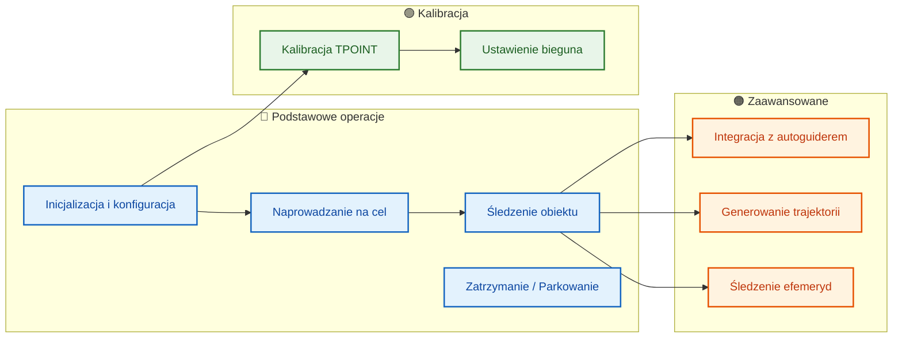

# Przykłady użycia

## Przegląd przypadków użycia



## Przegląd

Ten dokument zawiera praktyczne przykłady użycia Astronomical Mount Controller w różnych scenariuszach. Przykłady są dostępne w językach C++ i Python.

## Podstawowe użycie

### Inicjalizacja i konfiguracja

#### C++

```cpp
#include <iostream>
#include <memory>
#include "controllers/mount_controller.h"

using namespace astro_mount::controllers;

int main() {
    // Tworzenie kontrolera
    auto controller = std::make_unique<MountController>();
    
    // Konfiguracja podstawowa
    MountController::ControllerConfig config;
    
    // Lokalizacja obserwatorium
    config.latitude = 52.2297;   // Warszawa
    config.longitude = 21.0122;
    config.altitude = 100.0;
    
    // Parametry montażu
    config.mount_type = MountController::MountType::EQUATORIAL;
    config.max_slew_rate = 5.0;
    config.max_tracking_rate = 0.004178;  // Szybkość gwiazdowa
    config.slew_acceleration = 1.0;
    config.tracking_acceleration = 0.001;
    
    // Ustawienia parkowania i meridian flip
    config.park_position_axis1 = 0.0;
    config.park_position_axis2 = 0.0;
    config.meridian_flip_enabled = true;
    config.meridian_flip_delay_minutes = 5.0;
    
    // Soft limity
    config.soft_limits_enabled = true;
    config.soft_limit_axis1_min = -5.0;
    config.soft_limit_axis1_max = 365.0;
    config.soft_limit_axis2_min = -5.0;
    config.soft_limit_axis2_max = 185.0;
    
    // Kalman filter
    config.process_noise = 0.001;
    config.measurement_noise = 0.001;
    
    // TPOINT
    config.tpoint_enabled_terms = 65535;
    
    // Parametry fizyczne osi HA
    config.ha_axis_params.motor_steps_per_rev = 200.0;
    config.ha_axis_params.motor_microstepping = 64.0;
    config.ha_axis_params.encoder_resolution = 16384.0;
    config.ha_axis_params.gear_ratio = 360.0;
    config.ha_axis_params.backlash = 8.5;
    
    // Parametry fizyczne osi Dec
    config.dec_axis_params.motor_steps_per_rev = 200.0;
    config.dec_axis_params.motor_microstepping = 64.0;
    config.dec_axis_params.encoder_resolution = 16384.0;
    config.dec_axis_params.gear_ratio = 360.0;
    config.dec_axis_params.backlash = 6.3;
    
    // Inicjalizacja
    if (!controller->initialize(config)) {
        std::cerr << "Błąd inicjalizacji kontrolera" << std::endl;
        return 1;
    }
    
    std::cout << "Kontroler zainicjalizowany pomyślnie" << std::endl;
    
    // ... dalsze operacje
    
    return 0;
}
```

#### Python

```python
import grpc
from proto import mount_controller_pb2
from proto import mount_controller_pb2_grpc
import time

# Połączenie z serwerem
channel = grpc.insecure_channel('localhost:50051')
stub = mount_controller_pb2_grpc.MountControllerServiceStub(channel)

# Pobranie konfiguracji
from google.protobuf import empty_pb2
config = stub.GetConfiguration(empty_pb2.Empty())

print(f"Lokalizacja: {config.latitude}° N, {config.longitude}° E")
print(f"Przyspieszenie slewu: {config.slew_acceleration}")
print(f"Przyspieszenie trackingu: {config.tracking_acceleration}")
print(f"Kroki silnika HA: {config.ha_axis_params.motor_steps_per_rev}")
print(f"Mikrokrokowanie HA: {config.ha_axis_params.motor_microstepping}")
```

## Sterowanie montażem

### Szybkie przesunięcie do współrzędnych

#### C++

```cpp
// Slew to M31 (Andromeda Galaxy)
double ra_m31 = 0.7117;    // 00h 42m 44s
double dec_m31 = 41.2692;  // +41° 16' 09"

if (controller->slewToEquatorial(ra_m31, dec_m31)) {
    std::cout << "Rozpoczęto przesunięcie do M31" << std::endl;
    
    // Oczekiwanie na zakończenie przesunięcia
    while (controller->getStatus().state == MountStatus::State::SLEWING) {
        auto status = controller->getStatus();
        std::cout << "Pozycja: RA=" << status.axis1_position 
                  << "°, Dec=" << status.axis2_position << "°" << std::endl;
        std::this_thread::sleep_for(std::chrono::seconds(1));
    }
    
    std::cout << "Przesunięcie zakończone" << std::endl;
} else {
    std::cerr << "Nie można rozpocząć przesunięcia" << std::endl;
}
```

#### Python

```python
# Slew to Vega
vega = mount_controller_pb2.Coordinates(
    ra=18.6156,    # 18h 36m 56s
    dec=38.7836    # +38° 47' 01"
)

# Wysłanie komendy
from google.protobuf import empty_pb2
stub.SlewToCoordinates(vega)

# Monitorowanie postępu
import time
while True:
    state = stub.GetState(empty_pb2.Empty())
    if state.status != mount_controller_pb2.ControllerState.SLEWING:
        break
    print(f"Pozycja: {state.current_position.axis1:.2f}°, {state.current_position.axis2:.2f}°")
    time.sleep(1)

print("Przesunięcie zakończone")
```

### Śledzenie obiektu

#### C++

```cpp
// Rozpoczęcie śledzenia Saturna
double ra_saturn = 20.6467;   // 20h 38m 48s
double dec_saturn = -19.3417; // -19° 20' 30"

if (controller->trackObject(ra_saturn, dec_saturn)) {
    std::cout << "Rozpoczęto śledzenie Saturna" << std::endl;
    
    // Śledzenie przez 5 minut
    std::this_thread::sleep_for(std::chrono::minutes(5));
    
    // Zatrzymanie śledzenia
    controller->stop();
    std::cout << "Śledzenie zatrzymane" << std::endl;
}
```

#### Python

```python
# Track Jupiter
jupiter = mount_controller_pb2.Coordinates(
    ra=2.0972,     # 02h 05m 50s
    dec=12.3389    # +12° 20' 20"
)

# Rozpoczęcie śledzenia
stub.TrackObject(jupiter)

# Śledzenie przez określony czas
import time
tracking_duration = 300  # 5 minut
start_time = time.time()

while time.time() - start_time < tracking_duration:
    state = stub.GetState(empty_pb2.Empty())
    tracking_error = state.pointing_error
    print(f"Błąd wskazywania: {tracking_error:.2f} arcsec")
    time.sleep(10)

# Zatrzymanie
stub.Stop(empty_pb2.Empty())
```

## Kalibracja TPOINT

### Zbieranie pomiarów

#### C++

```cpp
// Funkcja do zbierania pomiarów dla kalibracji TPOINT
void collectTPointMeasurements(MountController& controller, int num_measurements) {
    std::vector<TPointModel::Measurement> measurements;
    
    for (int i = 0; i < num_measurements; ++i) {
        // Wybierz gwiazdę kalibracyjną
        auto star = selectCalibrationStar(i);
        
        // Slew do gwiazdy
        controller.slewToEquatorial(star.ra, star.dec);
        
        // Oczekiwanie na stabilizację
        std::this_thread::sleep_for(std::chrono::seconds(10));
        
        // Wykonaj pomiar (symulacja - w rzeczywistości z kamery)
        TPointModel::Measurement meas;
        meas.observed_ra = star.ra + randomError(0.001);  // Dodaj błąd pomiaru
        meas.observed_dec = star.dec + randomError(0.001);
        meas.expected_ra = star.ra;
        meas.expected_dec = star.dec;
        meas.mount_ha = controller.getHourAngle();
        meas.mount_dec = controller.getDeclination();
        meas.temperature = readTemperature();
        meas.pressure = readPressure();
        meas.timestamp = std::chrono::system_clock::now();
        
        measurements.push_back(meas);
        
        // Dodaj pomiar do modelu
        controller.addMeasurement(meas);
        
        std::cout << "Pomiar " << (i+1) << "/" << num_measurements 
                  << " dodany" << std::endl;
    }
    
    // Dopasuj model TPOINT
    auto params = controller.getTPointParameters();
    std::cout << "Kalibracja TPOINT zakończona. χ² = " 
              << params.chi_squared << std::endl;
}
```

#### Python

```python
def calibrate_tpoint(stub, stars):
    """Kalibracja TPOINT na podstawie listy gwiazd"""
    
    measurements = []
    
    for i, star in enumerate(stars):
        print(f"Kalibracja gwiazdy {i+1}/{len(stars)}: {star['name']}")
        
        # Slew to star
        coords = mount_controller_pb2.Coordinates(
            ra=star['ra'],
            dec=star['dec']
        )
        stub.SlewToCoordinates(coords)
        
        # Wait for settling
        time.sleep(10)
        
        # Get current mount position
        state = stub.GetState(empty_pb2.Empty())
        
        # Create measurement (in real system, this would come from camera)
        measurement = mount_controller_pb2.Measurement(
            observed=mount_controller_pb2.Coordinates(
                ra=star['ra'] + random.uniform(-0.001, 0.001),
                dec=star['dec'] + random.uniform(-0.001, 0.001)
            ),
            expected=mount_controller_pb2.Coordinates(
                ra=star['ra'],
                dec=star['dec']
            ),
            mount_position=state.current_position,
            temperature=20.0,
            pressure=1013.25,
            timestamp=timestamp_pb2.Timestamp(seconds=int(time.time()))
        )
        
        # Add measurement
        stub.AddMeasurement(measurement)
        measurements.append(measurement)
    
    # Get TPOINT parameters
    tpoint_params = stub.GetTPointParameters(empty_pb2.Empty())
    print(f"Kalibracja zakończona. χ² = {tpoint_params.chi_squared:.3f}")
    
    return tpoint_params

# Lista gwiazd kalibracyjnych
calibration_stars = [
    {'name': 'Vega', 'ra': 18.6156, 'dec': 38.7836},
    {'name': 'Altair', 'ra': 19.8464, 'dec': 8.8683},
    {'name': 'Deneb', 'ra': 20.6905, 'dec': 45.2803},
    {'name': 'Arcturus', 'ra': 14.2610, 'dec': 19.1824},
    {'name': 'Spica', 'ra': 13.4199, 'dec': -11.1613},
    # ... więcej gwiazd
]

# Wykonaj kalibrację
tpoint_params = calibrate_tpoint(stub, calibration_stars)
```

### Określanie pozycji bieguna

#### C++

```cpp
// Automatyczne określenie pozycji bieguna metodą dryfu
void determinePolePosition(MountController& controller) {
    std::cout << "Rozpoczynanie określania pozycji bieguna..." << std::endl;
    
    // Wybierz gwiazdę blisko południka
    double ra = controller.getLocalSiderealTime();
    double dec = 0.0;  // Blisko równika niebieskiego
    
    // Slew do pozycji startowej
    controller.slewToEquatorial(ra, dec);
    
    // Rozpocznij dryf
    controller.startDriftMeasurement();
    
    // Monitoruj przez 30 minut
    std::this_thread::sleep_for(std::chrono::minutes(30));
    
    // Zatrzymaj pomiar i oblicz pozycję bieguna
    auto pole_position = controller.stopDriftMeasurement();
    
    std::cout << "Pozycja bieguna określona:" << std::endl;
    std::cout << "  Szerokość: " << pole_position.latitude << "°" << std::endl;
    std::cout << "  Długość: " << pole_position.longitude << "°" << std::endl;
    std::cout << "  Dokładność: " << pole_position.accuracy << " arcsec" << std::endl;
    
    // Zaktualizuj konfigurację
    auto config = controller.getConfiguration();
    config.latitude = pole_position.latitude;
    config.longitude = pole_position.longitude;
    controller.updateConfiguration(config);
}
```

#### Python

```python
def auto_polar_alignment(stub):
    """Automatyczne wyrównanie biegunowe"""
    
    print("Rozpoczynanie automatycznego wyrównania biegunowego...")
    
    # Rozpocznij określanie pozycji bieguna
    request = mount_controller_pb2.PoleDeterminationRequest(
        measurement_count=20,
        duration_hours=0.5
    )
    
    pole_position = stub.DeterminePolePosition(request)
    
    print(f"Pozycja bieguna określona:")
    print(f"  Szerokość: {pole_position.latitude:.6f}°")
    print(f"  Długość: {pole_position.longitude:.6f}°")
    print(f"  Wysokość: {pole_position.altitude:.1f} m")
    print(f"  Dokładność: {pole_position.accuracy:.1f} arcsec")
    
    # Aktualizuj konfigurację
    config = stub.GetConfiguration(empty_pb2.Empty())
    config.latitude = pole_position.latitude
    config.longitude = pole_position.longitude
    config.altitude = pole_position.altitude
    
    stub.UpdateConfiguration(config)
    
    return pole_position

# Wykonaj automatyczne wyrównanie
pole_pos = auto_polar_alignment(stub)
```

## Integracja z systemem autoguiding

### Połączenie z guiderem

#### C++

```cpp
// Konfiguracja i połączenie z guiderem
void setupGuider(MountController& controller) {
    MountController::GuiderConfig guider_config;
    guider_config.connection_string = "tcp://localhost:7624";  // INDI
    guider_config.max_correction = 10.0;  // Maksymalna korekcja [arcsec]
    guider_config.aggression = 0.5;       // Agresywność korekcji (0-1)
    guider_config.exposure_time_ms = 2000; // Czas ekspozycji
    guider_config.binning = 2;            // Binning
    
    if (controller.connectGuider(guider_config)) {
        std::cout << "Połączono z guiderem" << std::endl;
        
        // Włącz autoguiding
        controller.enableGuiding(true);
        
        // Ustaw callback dla korekcji
        controller.setGuiderCallback([](double ra_corr, double dec_corr) {
            std::cout << "Korekcja guidera: RA=" << ra_corr 
                      << " arcsec, Dec=" << dec_corr << " arcsec" << std::endl;
        });
    } else {
        std::cerr << "Nie udało się połączyć z guiderem" << std::endl;
    }
}
```

#### Python

```python
def setup_guider(stub):
    """Konfiguracja autoguidera"""
    
    guider_config = mount_controller_pb2.GuiderConfig(
        connection_string="tcp://localhost:7624",  # INDI server
        max_correction=10.0,
        aggression=0.5,
        exposure_time_ms=2000,
        binning=2
    )
    
    # Połącz z guiderem
    stub.ConnectGuider(guider_config)
    
    print("Połączono z autoguiderem")
    
    # Włącz guiding w konfiguracji
    config = stub.GetConfiguration(empty_pb2.Empty())
    config.enable_guider = True
    stub.UpdateConfiguration(config)
    
    return True

# Monitorowanie korekcji guidera
def monitor_guiding(stub, duration_minutes):
    """Monitorowanie wydajności autoguidingu"""
    
    import time
    start_time = time.time()
    corrections = []
    
    while time.time() - start_time < duration_minutes * 60:
        state = stub.GetState(empty_pb2.Empty())
        
        if state.guider_active:
            guiding_perf = state.guiding_performance
            mount_vib = state.mount_vibration
            
            print(f"Wydajność guidingu: {guiding_perf:.1f}%")
            print(f"Wibracje mont