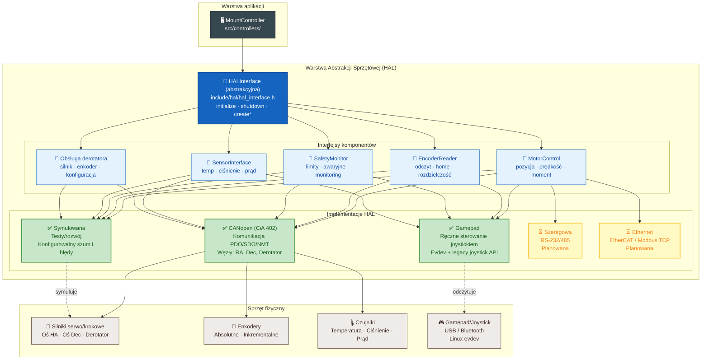
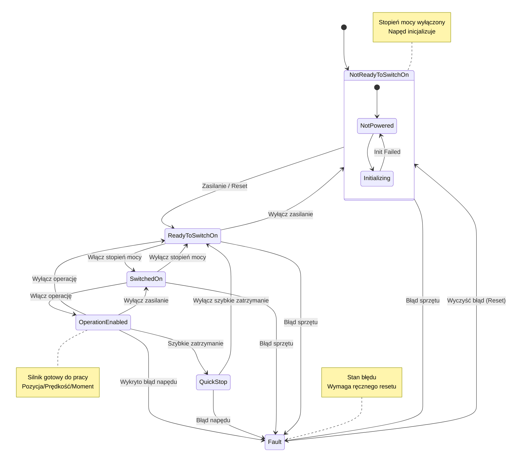

# Dokumentacja Warstwy HAL

## Przegląd

Warstwa abstrakcji sprzętowej (HAL - Hardware Abstraction Layer) zapewnia ujednolicony interfejs do sterowania różnymi konfiguracjami sprzętowymi montażu teleskopu. Abstrahuje szczegóły specyficzne dla sprzętu, umożliwiając kontrolerowi montażu współpracę z różnymi typami silników, systemami enkoderów i protokołami komunikacyjnymi poprzez wspólne API.

### Architektura



### Kluczowe Komponenty

| Komponent | Interfejs | Opis |
|-----------|-----------|------|
| `HALInterface` | Klasa abstrakcyjna | Główny interfejs HAL - punkt wejścia do sterowania sprzętem |
| `HALFactory` | Fabryka | Tworzy odpowiednią implementację HAL na podstawie konfiguracji |
| `MotorControl` | Klasa abstrakcyjna | Sterowanie silnikiem na oś (pozycja, prędkość, moment) |
| `EncoderReader` | Klasa abstrakcyjna | Odczyt enkodera i kalibracja |
| `SafetyMonitor` | Klasa abstrakcyjna | Monitorowanie limitów bezpieczeństwa i zatrzymanie awaryjne |
| `SensorInterface` | Klasa abstrakcyjna | Odczyt czujników (temperatura, ciśnienie, prąd, itd.) |
| `HALConfig` | Struktura konfiguracji | Kompletna konfiguracja sprzętowa |

### Obsługiwane Typy HAL

| Typ | Enum | Opis | Status |
|-----|------|------|--------|
| Symulowany | `HALType::SIMULATED` | Symulowany sprzęt do testów/rozwoju | ✅ Zaimplementowany |
| CANopen | `HALType::CANOPEN` | Napędy CANopen/CiA 402 | ✅ Zaimplementowany |
| Gamepad | `HALType::GAMEPAD` | Sterowanie ręczne przez gamepad/joystick | ✅ Zaimplementowany |
| Szeregowy | `HALType::SERIAL` | Komunikacja szeregowa RS-232/485 | ⏳ Planowany |
| Ethernet | `HALType::ETHERNET` | EtherCAT, Modbus TCP, Profinet | ⏳ Planowany |
| Niestandardowy | `HALType::CUSTOM` | Interfejs sprzętowy zdefiniowany przez użytkownika | 🔧 Rozszerzalny |

---

## HALInterface

Główna klasa abstrakcyjna (`include/hal/hal_interface.h`) definiuje kontrakt abstrakcji sprzętowej:

```cpp
class HALInterface {
public:
    // Zarządzanie cyklem życia
    virtual bool initialize(const HALConfig& config) = 0;
    virtual void shutdown() = 0;
    virtual bool isInitialized() const = 0;
    
    // Fabryki komponentów
    virtual std::unique_ptr<MotorControl> createMotorControl(int axis_id) = 0;
    virtual std::unique_ptr<EncoderReader> createEncoderReader(int axis_id) = 0;
    virtual std::unique_ptr<SafetyMonitor> createSafetyMonitor() = 0;
    virtual std::unique_ptr<SensorInterface> createSensorInterface() = 0;
    
    // Obsługa derotatora (pole obserwacyjne)
    virtual std::unique_ptr<MotorControl> createDerotatorMotor();
    virtual std::unique_ptr<EncoderReader> createDerotatorEncoder();
    virtual bool configureDerotator(const DerotatorConfig& config);
    
    // Informacje o platformie
    virtual std::string getPlatformName() const = 0;
    virtual std::string getHardwareVersion() const = 0;
    virtual std::vector<HALFeature> getSupportedFeatures() const = 0;
    virtual bool supportsFeature(HALFeature feature) const = 0;
    
    // Zarządzanie zasobami
    virtual bool start() = 0;
    virtual bool stop() = 0;
    virtual bool isRunning() const = 0;
    
    // Diagnostyka
    virtual std::string getStatus() const = 0;
    virtual std::string getErrorMessages() const = 0;
    virtual void clearErrors() = 0;
};
```

### Flagi HALFeature

| Flaga | Opis |
|-------|------|
| `CANOPEN_SUPPORT` | Obsługa napędów CANopen/CiA 402 |
| `SERIAL_SUPPORT` | Komunikacja przez port szeregowy |
| `ETHERNET_SUPPORT` | Ethernet (EtherCAT, Modbus TCP) |
| `PID_CONTROL` | Obsługa regulatora PID |
| `TRAJECTORY_CONTROL` | Generowanie/sterowanie trajektorią |
| `ENCODER_FEEDBACK` | Sprzężenie zwrotne z enkodera |
| `SAFETY_MONITORING` | Monitorowanie bezpieczeństwa |
| `SENSOR_MONITORING` | Monitorowanie czujników |
| `REAL_TIME_CONTROL` | Sterowanie w czasie rzeczywistym |
| `DEROTATOR_SUPPORT` | Obsługa derotatora pola |
| `MANUAL_CONTROL` | Sterowanie ręczne (gamepad/joystick) |

---

## Interfejs MotorControl

Klasa `MotorControl` (`include/hal/motor_control.h`) definiuje sterowanie silnikiem na oś:

### Typy Silników

```cpp
enum class MotorType {
    STEPPER,        // Silnik krokowy
    SERVO,          // Serwonapęd
    BRUSHED_DC,     // Silnik DC z komutatorem
    BRUSHLESS_DC,   // Silnik bezszczotkowy (BLDC)
    CANOPEN_SERVO,  // Serwonapęd CANopen (CiA 402)
    VIRTUAL         // Wirtualny (do testów)
};
```

### Tryby Sterowania

```cpp
enum class ControlMode {
    POSITION,       // Sterowanie pozycją
    VELOCITY,       // Sterowanie prędkością
    TORQUE,         // Sterowanie momentem
    TRAJECTORY,     // Sterowanie trajektorią
    OPEN_LOOP       // Sterowanie w otwartej pętli
};
```

### Kluczowe Metody

| Metoda | Opis |
|--------|------|
| `enable() / disable()` | Włącz/wyłącz napęd silnika |
| `setPosition(st, pr, przysp)` | Ustaw docelową pozycję z profilem ruchu |
| `setVelocity(°/s, przysp)` | Ustaw docelową prędkość |
| `setTorque(%)` | Ustaw moment (0-100%) |
| `stop() / emergencyStop()` | Normalne zatrzymanie / szybkie zatrzymanie |
| `getActualPosition()` | Aktualna pozycja w stopniach |
| `getActualVelocity()` | Aktualna prędkość w °/s |
| `getActualTorque()` | Aktualny moment |
| `targetReached()` | Sprawdź czy osiągnięto pozycję docelową |
| `getTemperature()` | Temperatura silnika |
| `getCurrent()` | Pobór prądu silnika |

### Callbacki

```cpp
using PositionCallback = std::function<void(double position, double velocity, double torque)>;
using ErrorCallback = std::function<void(const std::string& error, int error_code)>;
using StateChangeCallback = std::function<void(bool enabled, bool moving)>;
```

---

## Interfejs EncoderReader

Klasa `EncoderReader` (`include/hal/encoder_reader.h`) zapewnia odczyt enkodera i kalibrację:

### Typy Enkoderów

```cpp
enum class EncoderType {
    INCREMENTAL,    // Enkoder inkrementalny
    ABSOLUTE,       // Enkoder absolutny
    RESOLVER,       // Rezolver
    HALL_SENSOR,    // Czujniki Halla
    VIRTUAL         // Wirtualny (do testów)
};
```

### Interfejsy Enkoderów

```cpp
enum class EncoderInterface {
    QUADRATURE,     // Kwadraturowy (A, B, Z)
    SSI,            // Synchronous Serial Interface
    BISS,           // BiSS (dwukierunkowy szeregowy)
    ENDAT,          // EnDat 2.2
    CANOPEN,        // CANopen
    ANALOG          // Analogowy (0-10V, 4-20mA)
};
```

### Kluczowe Metody

| Metoda | Opis |
|--------|------|
| `initialize(config)` | Inicjalizuj enkoder z konfiguracją |
| `read()` | Odczytaj aktualną pozycję/prędkość enkodera |
| `calibrate(ref_pozycja)` | Kalibruj z pozycją referencyjną |
| `autoCalibrate()` | Automatyczna kalibracja |
| `saveCalibration() / loadCalibration()` | Trwałe przechowywanie kalibracji |
| `synchronize()` | Synchronizuj z pozycją silnika |

### Struktura EncoderReading

```cpp
struct EncoderReading {
    double position_deg;       // Pozycja w stopniach
    double velocity_deg_s;     // Prędkość w stopniach/s
    int32_t raw_counts;        // Surowa wartość licznika
    bool index_pulse;          // Impuls indeksu
    bool direction;            // Kierunek (true = przód)
    bool data_valid;           // Czy dane są poprawne
    uint32_t error_count;      // Licznik błędów
    std::chrono::steady_clock::time_point timestamp;
};
```

---

## Interfejs SafetyMonitor

Klasa `SafetyMonitor` (`include/hal/safety_monitor.h`) monitoruje limity bezpieczeństwa sprzętu:

### Stany Bezpieczeństwa

```cpp
enum class State {
    NORMAL,             // Wszystkie systemy normalne
    WARNING,            // Zbliżanie się do limitów
    LIMIT_EXCEEDED,     // Przekroczenie limitu
    EMERGENCY_STOP,     // Aktywne zatrzymanie awaryjne
    ERROR               // Stan błędu
};
```

### Monitorowane Parametry na Oś

| Parametr | Opis |
|----------|------|
| Pozycja | Limity min/max pozycji |
| Prędkość | Maksymalny limit prędkości |
| Przyspieszenie | Maksymalny limit przyspieszenia |
| Prąd | Maksymalny pobór prądu |
| Temperatura | Maksymalna temperatura |
| Napięcie | Zakres napięcia min/max |
| Komunikacja | Status komunikacji |

### Struktura SafetyStatus

```cpp
struct SafetyStatus {
    State overall_state;
    
    struct AxisStatus {
        bool limits_ok;            // Limity OK
        bool temperature_ok;       // Temperatura OK
        bool current_ok;           // Prąd OK
        bool voltage_ok;           // Napięcie OK
        bool communication_ok;     // Komunikacja OK
        std::string error_message; // Komunikat błędu
    };
    
    std::array<AxisStatus, 3> axes_status;  // Status dla 3 osi
    double system_temperature;               // Temperatura systemu
    double system_current;                   // Prąd systemu
    double system_voltage;                   // Napięcie systemu
    bool emergency_stop_active;              // Aktywne E-stop
};
```

---

## SensorInterface

Klasa `SensorInterface` (`include/hal/sensor_interface.h`) zapewnia odczyt czujników środowiskowych:

### Typy Czujników

```cpp
enum class SensorType {
    TEMPERATURE,    // Czujnik temperatury
    HUMIDITY,       // Czujnik wilgotności
    PRESSURE,       // Czujnik ciśnienia
    CURRENT,        // Czujnik prądu
    VOLTAGE,        // Czujnik napięcia
    VIBRATION,      // Czujnik wibracji
    PROXIMITY,      // Czujnik zbliżeniowy
    LIMIT_SWITCH,   // Łącznik krańcowy
    CUSTOM          // Czujnik niestandardowy
};
```

### Typy Interfejsów Czujników

```cpp
enum class SensorInterfaceType {
    ANALOG,         // Sygnał analogowy (0-10V, 4-20mA)
    DIGITAL,        // Sygnał cyfrowy (GPIO, TTL)
    I2C,            // Interfejs I2C
    SPI,            // Interfejs SPI
    CANOPEN,        // Interfejs CANopen
    MODBUS,         // Interfejs Modbus
    ETHERNET,       // Interfejs Ethernet
    SERIAL          // Interfejs szeregowy
};
```

---

## HALConfig

Struktura `HALConfig` (`include/hal/hal_config.h`) zapewnia kompletną konfigurację sprzętową z obsługą serializacji JSON:

### Struktura Konfiguracji

```cpp
struct HALConfig {
    HALType type{HALType::SIMULATED};   // Typ implementacji HAL
    std::string name{"Default_HAL"};    // Nazwa instancji
    
    // Konfiguracja CANopen
    struct {
        std::string library{"mock"};
        std::string interface_name{"can0"};
        uint32_t bitrate{125000};
        uint8_t node_id{1};
        bool use_sync{true};
        uint32_t sync_period_ms{100};
        uint32_t sdo_timeout_ms{1000};
        uint32_t pdo_update_rate{100}; // Hz
        
        // NMT (Network Management)
        struct {
            bool enable_nmt{true};
            uint32_t heartbeat_period_ms{100};
            uint32_t heartbeat_timeout_ms{500};
            uint32_t max_missed_heartbeats{3};
            bool enable_bootup_check{true};
            uint32_t bootup_timeout_ms{5000};
            bool enable_auto_recovery{true};
            uint32_t recovery_interval_s{5};
            bool enable_node_guarding{false};
            uint32_t node_guarding_period_ms{1000};
        } nmt;
    } canopen;
    
    // Konfiguracja portu szeregowego
    struct {
        std::string port{"/dev/ttyUSB0"};
        uint32_t baud_rate{115200};
        std::string protocol{"modbus"};
        uint8_t data_bits{8};
        uint8_t stop_bits{1};
        std::string parity{"none"};
        uint32_t timeout_ms{1000};
    } serial;
    
    // Konfiguracja Ethernet
    struct {
        std::string ip_address{"192.168.1.100"};
        uint16_t port{502};
        std::string protocol{"modbus_tcp"};
        uint32_t timeout_ms{1000};
        uint32_t retry_count{3};
    } ethernet;
    
    // Konfiguracja symulacji
    struct {
        bool enable_simulation{true};
        double simulation_update_rate{100.0};  // Hz
        double position_noise_stddev{0.001};   // stopnie
        double velocity_noise_stddev{0.0001};  // °/s
        bool simulate_errors{false};
        double error_probability{0.01};        // 1% szansy na błąd
    } simulated;

    // Konfiguracja gamepada
    struct {
        std::string device_path{""};              // Puste = auto-detekcja
        double deadzone{0.15};                    // Strefa martwa (0.0–1.0)
        double sensitivity{1.0};                  // Czułość (1.0 = liniowa)
        double max_velocity_deg_s{5.0};           // Maksymalna prędkość °/s
        bool invert_axis1{false};                 // Odwróć oś 1 (RA/HA)
        bool invert_axis2{false};                 // Odwróć oś 2 (Dec/Alt)
        double update_rate_hz{50.0};              // Częstotliwość odświeżania
        std::vector<double> speed_presets{0.5, 1.0, 2.0, 3.0, 5.0};  // Predefiniowane prędkości
        std::map<int, std::string> button_mapping; // Mapowanie przycisków physical→akcja
        std::map<int, std::string> axis_mapping;   // Mapowanie osi physical→funkcja
    } gamepad;
    
    DerotatorConfig derotator;           // Konfiguracja derotatora
    std::vector<AxisConfig> axes;        // Konfiguracje osi
    PIDParams pid_params;                // Parametry regulatora PID
    
    // Konfiguracja bezpieczeństwa
    struct {
        bool enable_limits{true};
        bool enable_emergency_stop{true};
        uint32_t emergency_stop_timeout_ms{100};
        bool enable_temperature_monitoring{true};
        bool enable_current_monitoring{true};
        bool enable_voltage_monitoring{true};
        double min_voltage{20.0};
        double max_voltage{30.0};
        uint32_t monitoring_rate{10}; // Hz
    } safety;
};
```

### Konfiguracja Osi

```cpp
struct AxisConfig {
    int id{0};
    std::string name{"Axis_0"};
    MotorConfig motor_config;        // Konfiguracja silnika
    EncoderConfig encoder_config;    // Konfiguracja enkodera
    
    // Limity bezpieczeństwa
    struct {
        double min_position{-270.0};   // stopnie
        double max_position{270.0};    // stopnie
        double max_velocity{5.0};      // °/s
        double max_acceleration{2.0};  // °/s²
        double max_current{10.0};      // A
        double max_temperature{80.0};  // °C
    } safety_limits;
};
```

### Parametry PID

```cpp
struct PIDParams {
    double kp{1.5};               // Wzmocnienie proporcjonalne
    double ki{0.2};               // Wzmocnienie całkujące
    double kd{0.05};              // Wzmocnienie różniczkujące
    double integral_limit{1000.0}; // Limit całki
    double output_limit{100.0};    // Limit wyjścia
    double anti_windup_gain{0.1};  // Wzmocnienie anti-windup
    bool enable_anti_windup{true}; // Włącz anti-windup
};
```

### Przykład Konfiguracji JSON

```json
{
  "type": "canopen",
  "name": "Mount_HAL",
  "canopen": {
    "library": "canopensocket",
    "interface_name": "can0",
    "bitrate": 125000,
    "node_id": 1,
    "use_sync": true,
    "sync_period_ms": 100,
    "sdo_timeout_ms": 1000,
    "pdo_update_rate": 100,
    "nmt": {
      "enable_nmt": true,
      "heartbeat_period_ms": 100,
      "heartbeat_timeout_ms": 500,
      "max_missed_heartbeats": 3
    }
  },
  "axes": [
    {
      "id": 0,
      "name": "RA_Axis",
      "motor_config": {
        "type": "CANOPEN_SERVO",
        "default_mode": "POSITION",
        "max_velocity": 5.0,
        "max_acceleration": 1.0,
        "encoder_counts_per_degree": 10000.0,
        "gear_ratio": 360.0
      },
      "encoder_config": {
        "type": "ABSOLUTE",
        "interface": "CANOPEN",
        "resolution": 16384,
        "counts_per_degree": 10000.0
      },
      "safety_limits": {
        "min_position": -270.0,
        "max_position": 270.0,
        "max_velocity": 5.0,
        "max_acceleration": 2.0
      }
    }
  ],
  "pid_params": {
    "kp": 1.5,
    "ki": 0.2,
    "kd": 0.05,
    "integral_limit": 1000.0,
    "output_limit": 100.0
  }
}
```

### Przykład Konfiguracji JSON Gamepada

```json
{
  "type": "gamepad",
  "name": "Gamepad_HAL",
  "gamepad": {
    "device_path": "",
    "deadzone": 0.15,
    "sensitivity": 1.0,
    "max_velocity_deg_s": 5.0,
    "invert_axis1": false,
    "invert_axis2": false,
    "update_rate_hz": 50.0,
    "speed_presets": [0.5, 1.0, 2.0, 3.0, 5.0],
    "button_mapping": {
      "0": "home",
      "1": "stop",
      "2": "park",
      "3": "emergency_stop",
      "4": "speed_down",
      "5": "speed_up",
      "6": "manual_toggle"
    },
    "axis_mapping": {
      "0": "lx",
      "1": "ly",
      "3": "rx",
      "4": "ry",
      "2": "trigger_l",
      "5": "trigger_r",
      "16": "pov_x",
      "17": "pov_y"
    }
  },
  "axes": [
    {
      "id": 0,
      "name": "RA_Axis",
      "motor_config": {
        "type": "VIRTUAL",
        "default_mode": "VELOCITY",
        "max_velocity": 5.0,
        "max_acceleration": 2.0
      },
      "encoder_config": {
        "type": "VIRTUAL",
        "counts_per_degree": 10000.0
      },
      "safety_limits": {
        "min_position": -270.0,
        "max_position": 270.0,
        "max_velocity": 5.0,
        "max_acceleration": 2.0
      }
    }
  ]
}
```

---

## HALFactory

Klasa `HALFactory` (`include/hal/hal_factory.h`) tworzy instancje HAL na podstawie konfiguracji:

```cpp
class HALFactory {
public:
    // Tworzenie HAL z konfiguracji
    static std::unique_ptr<HALInterface> create(const HALConfig& config);
    static std::unique_ptr<HALInterface> create(HALType type);
    static std::unique_ptr<HALInterface> create(const std::string& type_name);
    
    // Zapytanie o dostępne implementacje
    static std::vector<HALType> getAvailableTypes();
    static bool isTypeAvailable(HALType type);
    static HALType getDefaultType();
    
    // Zarządzanie konfiguracją
    static HALConfig getDefaultConfig(HALType type);
    static HALConfig loadConfigFromFile(const std::string& filename);
    static bool saveConfigToFile(const HALConfig& config, const std::string& filename);
};
```

---

## Implementacja CANopen HAL

Implementacja CANopen HAL (`src/hal/canopen_hal/`) zapewnia sterowanie napędami zgodne z CiA 402:

### Maszyna Stanów CiA 402



### Sekwencja Włączania Napędu (CiA 402)

Standardowe 4-etapowe przejście przez maszynę stanów napędu:

```cpp
// Krok 1: Switch on disabled → Ready to switch on
sendControlWord(0x0006);

// Krok 2: Ready to switch on → Switched on
sendControlWord(0x0007);

// Krok 3: Switched on → Operation enabled
sendControlWord(0x000F);

// Krok 4: Potwierdzenie włączenia
enabled_ = true;
```

### Regulator PID

Wbudowany regulator PID do zamkniętej pętli sterowania pozycją/prędkością, zaimplementowany w `CanOpenMotor`:

```cpp
class PIDController {
    PIDController(double kp = 1.5, double ki = 0.2, double kd = 0.05,
                  double integral_limit = 1000.0, double output_limit = 100.0);
    
    double calculate(double setpoint, double measured, double dt);
    void setParameters(double kp, double ki, double kd);
    std::tuple<double, double, double> getParameters() const;
    void reset();
};
```

Każdy `CanOpenMotor` posiada własną instancję `PIDController` i uruchamia dedykowany wątek `control_thread_` z częstotliwością 100 Hz do regulacji w zamkniętej pętli:

```cpp
void CanOpenMotor::controlLoop() {
    auto update_interval = std::chrono::milliseconds(10); // 100 Hz
    
    while (control_running_) {
        if (enabled_ && moving_) {
            double dt = calculateDt();
            double correction = pid_controller_.calculate(
                target_position_, actual_position_, dt);
            
            // Zastosowanie korekcji do napędu CANopen
            canopen_.setVelocityTarget(axis_id_, correction, 0.5);
            
            // Wywołanie callbacka pozycji
            if (position_callback_) {
                position_callback_(actual_position_, actual_velocity_, actual_torque_);
            }
        }
        std::this_thread::sleep_for(update_interval);
    }
}
```


### Komunikacja PDO

CANopen HAL używa obiektów danych procesowych (PDO) do komunikacji w czasie rzeczywistym:

- **TPDO1** (Transmit): Status Word (0x6041) + Actual Position (0x6064)
- **RPDO2** (Receive): Control Word (0x6040) + Target Position (0x607A)

### Klasy Implementacyjne

| Klasa | Opis |
|-------|------|
| `CanOpenHAL` | Główna implementacja HAL używająca CANopen |
| `CanOpenMotor` | Sterowanie silnikiem CiA 402 z control word/status word |
| `CanOpenEncoder` | Odczyt enkodera przez PDO/SDO |
| `CanOpenSafetyMonitor` | Monitorowanie bezpieczeństwa z NMT heartbeat |
| `CanOpenSensorInterface` | Odczyt czujników przez CANopen |
| `PIDController` | Zamknięta pętla regulatora PID |

### CANopen SDO - Odczyt Parametrów Silnika

| Obiekt | Opis | Rozmiar |
|--------|------|---------|
| 0x6040 | Control Word | 16-bit |
| 0x6041 | Status Word | 16-bit |
| 0x6060 | Modes of Operation | 8-bit |
| 0x6061 | Modes of Operation Display | 8-bit |
| 0x6064 | Position Actual Value | 32-bit |
| 0x606C | Velocity Actual Value | 32-bit |
| 0x6071 | Target Torque | 16-bit |
| 0x6077 | Torque Actual Value | 16-bit |
| 0x6078 | Current Actual Value | 16-bit |
| 0x607A | Target Position | 32-bit |
| 0x6081 | Profile Velocity | 32-bit |
| 0x6083 | Profile Acceleration | 32-bit |
| 0x6084 | Profile Deceleration | 32-bit |
| 0x2030 | Actual Temperature (producent) | 16-bit |
| 0x2031 | Actual Current (producent) | 16-bit |
| 0x2032 | Actual Voltage (producent) | 16-bit |

---

## Implementacja Gamepad HAL

Gamepad HAL (`src/hal/gamepad_hal/`) zapewnia ręczne sterowanie montażem przez fizyczny gamepad lub joystick podłączony przez USB lub Bluetooth. Tłumaczy wychylenia osi joysticka i naciśnięcia przycisków na komendy prędkości silnika dla osi montażu.

### Architektura

```
Gamepad (USB/Bluetooth)
    ↓
EvdevGamepadInput (wątek odpytywania w tle)
    ↓  applyButtonMapping() / applyAxisMapping() (z konfiguracji JSON)
GamepadState (7 osi, 7 przycisków semantycznych)
    ↓
GamepadHAL::updateLoop() (50 Hz)
    ↓
GamepadMotorControl (oś 0 = lewy drążek X, oś 1 = lewy drążek Y)
    ↓  prędkość → całkowanie pozycji
GamepadEncoderReader ← GamepadMotorControl (pozycja z całkowania)
```

### Backend Wejściowy — EvdevGamepadInput

Klasa `EvdevGamepadInput` obsługuje oba podsystemy wejściowe Linux:

| Backend | Ścieżka urządzenia | Opis |
|---------|-------------------|------|
| Legacy joystick API | `/dev/input/js0` … `js3` | Starsze urządzenia, prosty format zdarzeń |
| evdev API | `/dev/input/event*` | Nowoczesne urządzenia, zdarzenia ABS/EV_KEY |

Auto-detekcja skanuje `/dev/input/js0…js3`, a następnie `/dev/input/event*` z obsługą `EV_ABS`. Dedykowany wątek w tle odpytuje urządzenie i aktualizuje współdzielony stan gamepada.

### Mapowanie Przycisków

Fizyczne przyciski (indeksy 0–10 dla typowego kontrolera Xbox) są mapowane na semantyczne akcje sterowania montażem:

| Akcja | Efekt |
|-------|-------|
| `home` | Powrót montażu do pozycji domowej |
| `stop` | Zatrzymanie całego ruchu |
| `emergency_stop` | Natychmiastowe zatrzymanie awaryjne |
| `park` | Zaparkowanie montażu w bezpiecznej pozycji |
| `speed_up` | Przełączenie na wyższy preset prędkości |
| `speed_down` | Przełączenie na niższy preset prędkości |
| `manual_toggle` | Włączenie/wyłączenie trybu sterowania ręcznego |
| `none` | Brak akcji (nieprzypisany) |

### Mapowanie Osi

Fizyczne osie są mapowane na semantyczne osie sterowania:

| Oś | Źródło | Efekt |
|----|--------|-------|
| `lx`, `ly` | Lewy drążek | Prędkość osi 0 (RA/HA) i osi 1 (Dec/Alt) |
| `rx`, `ry` | Prawy drążek | (zarezerwowane do przyszłego użycia) |
| `trigger_l`, `trigger_r` | Spusty analogowe | Precyzyjne sterowanie prędkością |
| `pov_x`, `pov_y` | Pad kierunkowy | Delikatne korygowanie pozycji |

### GamepadMotorControl

Każda oś montażu otrzymuje instancję `GamepadMotorControl`, która wyprowadza komendę prędkości z odpowiedniej osi joysticka. Silnik całkuje pozycję wewnętrznie, dzięki czemu sprzężenie zwrotne enkodera działa naturalnie z resztą systemu.

Kluczowe zachowanie:
- Wychylenie lewego drążka X → prędkość osi RA/Azymut
- Wychylenie lewego drążka Y → prędkość osi Dec/Altitude
- Pełne wychylenie → aktualna wartość presetu prędkości (konfigurowalna: 0.5–5.0 °/s)
- Filtr strefy martwej (domyślnie 15%) zapobiega dryfowi gdy drążek jest wycentrowany
- Krzywa czułości (1.0 = liniowa) może kształtować odpowiedź

### Predefiniowane Prędkości

Aktualna prędkość może być zmieniana przez przyciski speed_up/speed_down:

```cpp
std::vector<double> speed_presets_deg_s{0.5, 1.0, 2.0, 3.0, 5.0};
```

### Klasy Implementacyjne

| Klasa | Opis |
|-------|------|
| `GamepadHAL` | Główna implementacja HAL dla sterowania gamepadem |
| `GamepadMotorControl` | Sterowanie silnikiem sterowane osiami joysticka |
| `GamepadEncoderReader` | Wirtualny enkoder zwracający całkowaną pozycję |
| `GamepadSafetyMonitor` | Minimalne monitorowanie bezpieczeństwa z kontrolą limitów |
| `GamepadSensorInterface` | Zwraca temperaturę otoczenia (brak rzeczywistych czujników) |
| `EvdevGamepadInput` | Backend API Linux evdev/joystick |

### Przykład Użycia

```cpp
#include "hal/hal_factory.h"
using namespace astro_mount::hal;

// Utwórz gamepad HAL
auto hal = HALFactory::create(HALType::GAMEPAD);

// Inicjalizuj z konfiguracją (pusta ścieżka = auto-detekcja)
HALConfig config = HALFactory::getDefaultConfig(HALType::GAMEPAD);
config.gamepad.deadzone = 0.15;
config.gamepad.sensitivity = 1.0;
hal->initialize(config);

// Utwórz sterowanie silnikami
auto ra_motor = hal->createMotorControl(0);   // Oś RA
auto dec_motor = hal->createMotorControl(1);  // Oś Dec

// Włącz silniki
ra_motor->enable();
dec_motor->enable();

// Uruchom HAL (rozpoczyna odpytywanie gamepada)
hal->start();

// Montaż jest teraz sterowany joystickiem gamepada.
// Predefiniowane prędkości można zmieniać przyciskami speed_up/speed_down.
```

### Konfigurowalne Mapowanie przez JSON

Mapowania przycisków i osi mogą być nadpisywane dla konkretnego urządzenia przez plik konfiguracyjny JSON bez potrzeby ponownej kompilacji. Tylko indeksy obecne w mapowaniu są nadpisywane; wszystkie pozostałe indeksy zachowują domyślne mapowanie.

Zobacz [Przykład Konfiguracji JSON Gamepada](#przykład-konfiguracji-json-gamepada) dla pełnej struktury konfiguracji.

---

## Implementacja Symulowanego HAL

Symulowany HAL (`src/hal/simulated_hal/`) zapewnia symulację sprzętu do testowania:

### Cechy

- Śledzenie pozycji z konfigurowalnym szumem
- Symulacja prędkości i przyspieszenia
- Symulacja temperatury na podstawie czasu pracy
- Symulacja poboru prądu na podstawie momentu
- Symulacja błędów (konfigurowalne prawdopodobieństwo)
- Ciągły wątek odczytu enkodera
- Realistyczne opóźnienia czasowe

### Przykład Użycia (Testy)

```cpp
#include "hal/hal_factory.h"
using namespace astro_mount::hal;

// Utwórz symulowany HAL
auto hal = HALFactory::create(HALType::SIMULATED);

// Inicjalizuj z domyślną konfiguracją
HALConfig config = HALFactory::getDefaultConfig(HALType::SIMULATED);
config.simulated.position_noise_stddev = 0.0005; // szum 0.0005°
hal->initialize(config);

// Utwórz sterowanie silnikiem dla osi 0 (RA)
auto motor = hal->createMotorControl(0);

// Włącz i przesuń do pozycji
motor->enable();
motor->setPosition(45.0, 2.0, 0.5); // 45°, 2 °/s, 0.5 °/s²

// Odczytaj enkoder
auto encoder = hal->createEncoderReader(0);
auto reading = encoder->read();
std::cout << "Pozycja: " << reading.position_deg << "°\n";

// Uruchom HAL
hal->start();

// Czyszczenie
hal->stop();
hal->shutdown();
```

---

## Obsługa Derotatora (Pola Obserwacyjnego)

Warstwa HAL zawiera obsługę derotatora pola:

```cpp
// Typ derotatora
enum class DerotatorType {
    CANOPEN = 0,
    STEPPER = 1,
    SERVO = 2,
    CUSTOM = 3
};

// Konfiguracja derotatora
struct DerotatorConfig {
    DerotatorType type{DerotatorType::STEPPER};
    bool enabled{false};
    double gear_ratio{180.0};
    double max_speed{5.0};           // °/s
    double max_acceleration{2.0};    // °/s²
    double backlash{0.0};            // stopnie
    bool absolute_encoder{false};
    double encoder_resolution{36000.0};
    double homing_offset{0.0};
    std::vector<double> calibration_table;
    std::string connection_string;
};
```

---

## Przykłady Użycia

### Podstawowa Konfiguracja CANopen

```cpp
#include "hal/hal_factory.h"
using namespace astro_mount::hal;

// Wczytaj konfigurację z pliku
HALConfig config = HALFactory::loadConfigFromFile("config/hal_config.json");

// Utwórz instancję HAL
auto hal = HALFactory::create(config);

// Inicjalizuj sprzęt
if (hal->initialize(config)) {
    // Utwórz sterowanie dla osi RA i Dec
    auto ra_motor = hal->createMotorControl(0);   // RA = oś 0
    auto dec_motor = hal->createMotorControl(1);  // Dec = oś 1
    auto safety = hal->createSafetyMonitor();
    
    // Rozpocznij działanie
    hal->start();
    
    // Włącz silniki i przesuń do pozycji
    ra_motor->enable();
    dec_motor->enable();
    ra_motor->setPosition(180.0, 3.0, 1.0);
    dec_motor->setPosition(45.0, 2.0, 0.5);
    
    // Monitoruj status
    std::cout << "Status: " << hal->getStatus() << std::endl;
    auto safety_status = safety->getStatus();
    std::cout << "Bezpieczeństwo: " << safety_status.getStateString() << std::endl;
}
```

### Wykrywanie Funkcji

```cpp
auto hal = HALFactory::create(HALType::CANOPEN);
auto features = hal->getSupportedFeatures();

if (hal->supportsFeature(HALFeature::PID_CONTROL)) {
    std::cout << "Dostępne sterowanie PID" << std::endl;
}
if (hal->supportsFeature(HALFeature::ENCODER_FEEDBACK)) {
    std::cout << "Dostępne sprzężenie zwrotne enkodera" << std::endl;
}
if (hal->supportsFeature(HALFeature::DEROTATOR_SUPPORT)) {
    auto derotator = hal->createDerotatorMotor();
}
```

### Użycie z Konfiguracją JSON

```cpp
#include "hal/hal_factory.h"
#include <fstream>

// Wczytaj konfigurację z pliku JSON
auto config = HALFactory::loadConfigFromFile("mount_config.json");

// Lub utwórz programowo
HALConfig config;
config.type = HALType::CANOPEN;
config.canopen.interface_name = "can0";
config.canopen.bitrate = 250000;
config.canopen.node_id = 1;

// Dodaj osie
HALConfig::AxisConfig ra_axis;
ra_axis.id = 0;
ra_axis.name = "RA_Axis";
ra_axis.motor_config.type = MotorType::CANOPEN_SERVO;
ra_axis.motor_config.max_velocity = 5.0;
config.axes.push_back(ra_axis);

HALConfig::AxisConfig dec_axis;
dec_axis.id = 1;
dec_axis.name = "Dec_Axis";
config.axes.push_back(dec_axis);

// Utwórz HAL
auto hal = HALFactory::create(config);
hal->initialize(config);
hal->start();
```

---

## Rozszerzanie HAL

Aby dodać nową implementację sprzętową:

1. Utwórz nowy katalog `src/hal/moja_hal/`
2. Zaimplementuj wszystkie metody interfejsu `HALInterface`
3. Zarejestruj implementację w `HALFactory`
4. Dodaj obsługę konfiguracji w `HALConfig`
5. Dodaj flagę funkcji do wyliczenia `HALFeature`

### Szablon Nowej Implementacji

```cpp
// src/hal/my_hal/my_hal.h
#pragma once
#include "hal/hal_interface.h"
#include "hal/hal_config.h"

namespace astro_mount {
namespace hal {

class MyCustomHAL : public HALInterface {
public:
    MyCustomHAL() = default;
    ~MyCustomHAL() override;
    
    bool initialize(const HALConfig& config) override;
    void shutdown() override;
    bool isInitialized() const override;
    
    std::unique_ptr<MotorControl> createMotorControl(int axis_id) override;
    std::unique_ptr<EncoderReader> createEncoderReader(int axis_id) override;
    std::unique_ptr<SafetyMonitor> createSafetyMonitor() override;
    std::unique_ptr<SensorInterface> createSensorInterface() override;
    
    std::string getPlatformName() const override;
    std::string getHardwareVersion() const override;
    std::vector<HALFeature> getSupportedFeatures() const override;
    bool supportsFeature(HALFeature feature) const override;
    
    bool start() override;
    bool stop() override;
    bool isRunning() const override;
    
    std::string getStatus() const override;
    std::string getErrorMessages() const override;
    void clearErrors() override;
};

} // namespace hal
} // namespace astro_mount
```

Następnie zarejestruj w `HALFactory`:

```cpp
// w src/hal/hal_factory.cpp
#include "my_hal/my_hal.h"

// Dodaj do metody create():
case HALType::CUSTOM:
    return std::make_unique<MyCustomHAL>();
```

---

## Diagram Architektury

```mermaid
flowchart TB
    classDef controller fill:#37474f,stroke:#263238,stroke-width:3px,color:#ffffff
    classDef canopen fill:#e8f5e9,stroke:#2e7d32,stroke-width:2px,color:#1b5e20
    classDef sim fill:#fff3e0,stroke:#e65100,stroke-width:2px,color:#bf360c
    classDef gamepad fill:#e1bee7,stroke:#6a1b9a,stroke-width:2px,color:#4a148c
    classDef ser fill:#fce4ec,stroke:#c62828,stroke-width:2px,color:#b71c1c

    MC["🎛️ Kontroler Montażu"]:::controller
    
    subgraph CAN["🟢 CANopen (CiA 402) — Produkcja ✅"]
        direction TB
        M1["⚙️ Silnik CiA 402"]:::canopen
        E1["📏 Enkoder przez PDO"]:::canopen
        SM1["🛡️ Safety Monitor"]:::canopen
        SR1["🌡️ Sensor Reader"]:::canopen
    end
    
    subgraph SIM["🟠 Symulowany — Testy ✅"]
        direction TB
        M2["SimulatedMotor<br/>+ model szumu"]:::sim
        E2["SimulatedEncoder<br/>+ model dryfu"]:::sim
        SM2["(niezaimplementowany)"]:::sim
    end

    subgraph GAM["🟣 Gamepad — Sterowanie Ręczne ✅"]
        direction TB
        M3["GamepadMotorControl<br/>joystick → prędkość"]:::gamepad
        E3["GamepadEncoderReader<br/>całkowana pozycja"]:::gamepad
        SM3["GamepadSafetyMonitor<br/>kontrola limitów"]:::gamepad
    end
    
    subgraph SER["🔴 Szeregowy/Ethernet — Planowane ⏳"]
        direction TB
        M4["SerialMotor<br/>(przyszłość)"]:::ser
        E4["SerialEncoder<br/>(przyszłość)"]:::ser
        SM4["(przyszłość)"]:::ser
    end
    
    MC --> CAN
    MC --> SIM
    MC --> GAM
    MC --> SER
```



---

## Struktura Plików

```
include/hal/
├── hal_interface.h      # Klasa abstrakcyjna HALInterface
├── hal_config.h         # Struktura HALConfig (serializacja JSON)
├── hal_factory.h        # Klasa HALFactory
├── motor_control.h      # Interfejs MotorControl
├── encoder_reader.h     # Interfejs EncoderReader
├── safety_monitor.h     # Interfejs SafetyMonitor
├── sensor_interface.h   # Interfejs SensorInterface
├── gamepad_input.h      # Interfejs abstrakcyjny GamepadInput
└── canopen_hal/
    └── canopen_hal.h    # Nagłówek CanOpenHAL

src/hal/
├── hal_factory.cpp      # Implementacja fabryki
├── canopen_hal/
│   ├── canopen_hal.h    # CanOpenHAL (PID, CiA 402, PDO)
│   └── canopen_hal.cpp  # Implementacja (1845 linii)
├── simulated_hal/
│   ├── simulated_hal.h  # SimulatedHAL do testów
│   └── simulated_hal.cpp # Implementacja (652 linie)
├── gamepad_hal/
│   ├── gamepad_hal.h    # Nagłówek GamepadHAL
│   ├── gamepad_hal.cpp  # Implementacja GamepadHAL
│   ├── gamepad_input_evdev.h  # Nagłówek EvdevGamepadInput
│   └── gamepad_input_evdev.cpp # Implementacja EvdevGamepadInput
└── serial_hal/          # (jeszcze niezaimplementowane)
```

---

## Odnośniki

- [README (PL)](README.md)
- [README (EN)](../en/README.md)
- [API Documentation](api.md)
- [Controller Threads](watki_kontrolera.md)
- [Installation Guide](installation.md)

---

*Ostatnia aktualizacja: 17 maja 2026*
