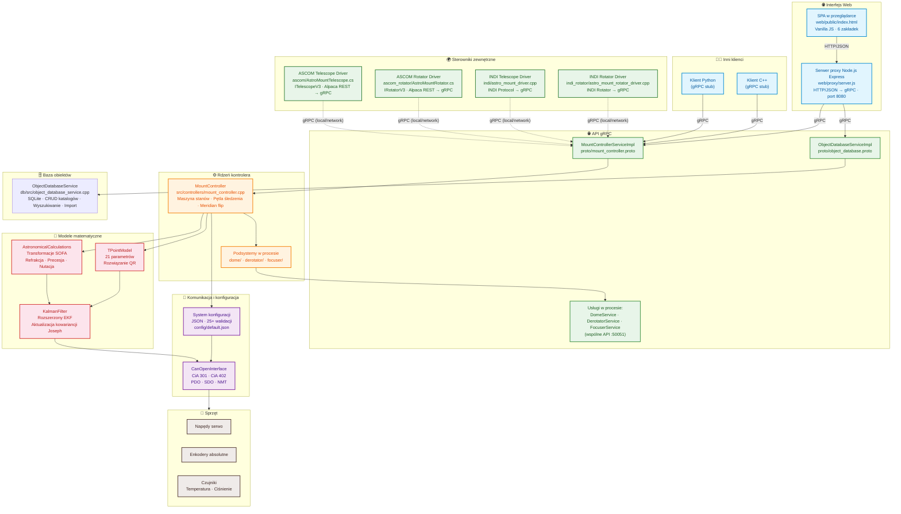
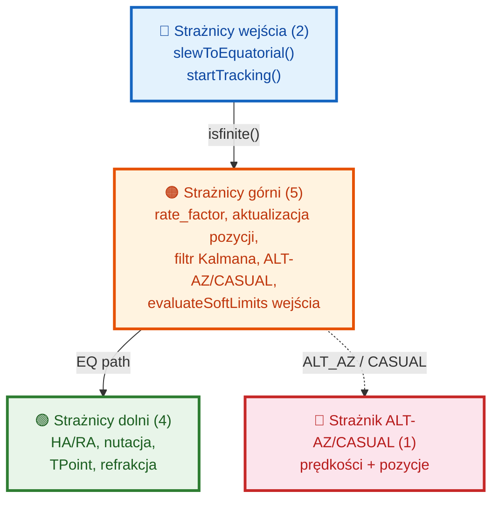

# Astronomical Mount Controller - Dokumentacja

## Spis treści

1. [Wprowadzenie](#wprowadzenie)
2. [Architektura systemu](#architektura-systemu)
3. [Modele matematyczne](#modele-matematyczne)
4. [API gRPC](#api-grpc)
5. [Konfiguracja](#konfiguracja)
6. [Konfiguracja serwisów zewnętrznych](konfiguracja_serwisow_zewnetrznych.md)
7. [Interfejs Web (Serwer Proxy)](#6-web-proxy-httpjson--grpc)
8. [Interfejs Web (SPA w przeglądarce)](#7-web-interface-browser-spa)
9. [Baza obiektów astronomicznych](#8-object-database-service)
10. [System konfiguracji](#9-configuration-system)
11. [Przykłady użycia](#przykłady-użycia)
12. [Instalacja i budowanie](#instalacja-i-budowanie)
13. [Testowanie](#testowanie)
14. [Parametry fizyczne osi](#parametry-fizyczne-osi)
15. [Sterowniki ASCOM i INDI](#ascom-i-indi-drivers)
16. [Interfejs Web](#interfejs-web)
17. [Instrukcja obsługi sekwencjonera](instrukcja_sekwencjonera.md)

## Wprowadzenie

Astronomical Mount Controller to zaawansowany system sterowania montażem astronomicznym, zapewniający precyzyjne śledzenie obiektów niebieskich z dokładnością sub-arcsecond. System integruje:

- Obliczenia astronomiczne z korekcją refrakcji atmosferycznej
- Model TPOINT do korekcji błędów geometrycznych montażu
- Rozszerzony filtr Kalmana do ciągłej kalibracji
- Interfejs CANopen do sterowania napędami serwo
- API gRPC do zdalnego sterowania

### Kluczowe cechy

- **Dokładność**: Sub-arcsecond tracking accuracy
- **Kalibracja**: Automatyczna kalibracja TPOINT
- **Integracja**: Pełna integracja z systemami autoguiding
- **Rozszerzalność**: Modularna architektura
- **API**: Kompletne gRPC API

## Architektura systemu

### Diagram architektury


```mermaid
flowchart TB
    %% Style
    classDef client fill:#e1f5fe,stroke:#0288d1,stroke-width:2px,color:#01579b
    classDef api fill:#e8f5e9,stroke:#388e3c,stroke-width:2px,color:#1b5e20
    classDef core fill:#fff3e0,stroke:#f57c00,stroke-width:2px,color:#e65100
    classDef model fill:#fce4ec,stroke:#d32f2f,stroke-width:2px,color:#b71c1c
    classDef comm fill:#f3e5f5,stroke:#7b1fa2,stroke-width:2px,color:#4a148c
    classDef hw fill:#efebe9,stroke:#4e342e,stroke-width:2px,color:#3e2723
    classDef cfg fill:#e0f7fa,stroke:#00838f,stroke-width:2px,color:#004d40
    classDef driver fill:#e8f5e9,stroke:#2e7d32,stroke-width:2px,color:#1b5e20
    classDef driver fill:#e8f5e9,stroke:#2e7d32,stroke-width:2px,color:#1b5e20

    subgraph WEBUI["🌐 Interfejs Web"]
        SPA["SPA w przeglądarce<br/>web/public/index.html<br/>Vanilla JS · 6 zakładek"]
        PROXY["Serwer proxy Node.js Express<br/>web/proxy/server.js<br/>HTTP/JSON → gRPC · port 8080"]
    end

    subgraph CLIENTS["🧑‍💻 Inni klienci"]
        PY["Klient Python<br/>(gRPC stub)"]
        CPP["Klient C++<br/>(gRPC stub)"]
    end

    subgraph API["🌐 API gRPC"]
        GRPC["MountControllerServiceImpl<br/>proto/mount_controller.proto"]
        DB_GRPC["ObjectDatabaseServiceImpl<br/>proto/object_database.proto"]
        INPROC["Usługi w procesie:<br/>DomeService · DerotatorService · FocuserService<br/>(wspólne API :50051)"]
    end

    subgraph CORE["⚙️ Rdzeń kontrolera"]
        MC["MountController<br/>src/controllers/mount_controller.cpp<br/>Maszyna stanów · Pętla śledzenia · Meridian flip"]
        INPROCSVC["Podsystemy w procesie<br/>dome/ · derotator/ · focuser/"]
    end

    subgraph MODELS["🧮 Modele matematyczne"]
        ASTRO["AstronomicalCalculations<br/>Transformacje SOFA<br/>Refrakcja · Precesja · Nutacja"]
        TPOINT["TPointModel<br/>21 parametrów<br/>Rozwiązanie QR"]
        KF["KalmanFilter<br/>Rozszerzony EKF<br/>Aktualizacja kowariancji Joseph"]
    end

    subgraph COMM["📡 Komunikacja i konfiguracja"]
        CAN["CanOpenInterface<br/>CiA 301 · CiA 402<br/>PDO · SDO · NMT"]
        CONFIG["System konfiguracji<br/>JSON · 25+ walidacji<br/>config/default.json"]
    end

    subgraph DB_SVC["🗄️ Baza obiektów"]
        DB_SERVICE["ObjectDatabaseService<br/>db/src/object_database_service.cpp<br/>SQLite · CRUD katalogów · Wyszukiwanie · Import"]
    end

    subgraph EXTERNAL["🌍 Sterowniki zewnętrzne"]
        ASCOM_TEL["ASCOM Telescope Driver<br/>ascom/AstroMountTelescope.cs<br/>ITelescopeV3 · Alpaca REST → gRPC"]:::driver
        ASCOM_ROT["ASCOM Rotator Driver<br/>ascom_rotator/AstroMountRotator.cs<br/>IRotatorV3 · Alpaca REST → gRPC"]:::driver
        INDI_TEL["INDI Telescope Driver<br/>indi/astro_mount_driver.cpp<br/>INDI Protocol → gRPC"]:::driver
        INDI_ROT["INDI Rotator Driver<br/>indi_rotator/astro_mount_rotator_driver.cpp<br/>INDI Rotator → gRPC"]:::driver
    end

    subgraph HW["🔧 Sprzęt"]
        HW1["Napędy serwo"]
        HW2["Enkodery absolutne"]
        HW3["Czujniki<br/>Temperatura · Ciśnienie"]
    end

    SPA -->|"HTTP/JSON"| PROXY
    PROXY -->|"gRPC"| GRPC
    PROXY -->|"gRPC"| DB_GRPC
    PY -->|gRPC| GRPC
    CPP -->|gRPC| GRPC
    GRPC --> MC
    DB_GRPC --> DB_SERVICE
    MC --> ASTRO
    MC --> TPOINT
    MC --> CONFIG
    MC --> INPROCSVC
    INPROCSVC --> INPROC
    ASTRO --> KF
    TPOINT --> KF
    KF --> CAN
    CONFIG --> CAN
    CAN --> HW

    ASCOM_TEL -.->|"gRPC (local/network)"| GRPC
    ASCOM_ROT -.->|"gRPC (local/network)"| GRPC
    INDI_TEL -.->|"gRPC (local/network)"| GRPC
    INDI_ROT -.->|"gRPC (local/network)"| GRPC

    class SPA,PROXY client
    class PY,CPP client
    class GRPC,DB_GRPC,INPROC api
    class MC,INPROCSVC core
    class ASTRO,TPOINT,KF model
    class CAN,CONFIG comm
    class HW1,HW2,HW3 hw
```

### Komponenty systemu

#### 1. **MountController** ([`src/controllers/mount_controller.cpp`](src/controllers/mount_controller.cpp))
Główny komponent integrujący wszystkie moduły:
- Sterowanie śledzeniem i szybkim przesuwaniem (maszyna stanów z 9 stanami)
- Zarządzanie stanem montażu, meridian flip, soft limity w 3 strefach
- Integracja z enkoderami i guiderem, aplikacja PEC
- Kalibracja bootstrap (wstępne wyrównanie) + kalibracja TPOINT (precyzyjny model wskazań)
- Śledzenie efemeryd (obiekty ruchome: satelity, komety, asteroidy)
- 11 guardów propagacji NaN/Inf w pętli śledzenia

#### 2. **AstronomicalCalculations** ([`src/core/astronomical_calculations.cpp`](src/core/astronomical_calculations.cpp))
Obliczenia astronomiczne oparte na bibliotece SOFA:
- Transformacje układów współrzędnych (równikowe ↔ horyzontalne, kąt godzinny)
- Korekcja refrakcji atmosferycznej
- Precesja, nutacja, aberracja, czas świetlny, ugięcie grawitacyjne
- Czas gwiazdowy, efemerydy, ruch własny

#### 3. **TPointModel** ([`src/models/tpoint_model.cpp`](src/models/tpoint_model.cpp))
Pełny model TPOINT do korekcji błędów geometrycznych:
- 21 parametrów TPOINT (IA, IE, NPAE, AN, AW, itp.)
- Dopasowanie metodą najmniejszych kwadratów z dekompozycją QR
- Korekcja refrakcji atmosferycznej
- Obsługa ruchu własnego gwiazd

#### 4. **KalmanFilter** ([`src/models/kalman_filter.cpp`](src/models/kalman_filter.cpp))
Rozszerzony filtr Kalmana do ciągłej kalibracji:
- Estymacja orientacji montażu (kwaternion)
- Aktualizacja parametrów TPOINT
- Kompensacja dryfu termicznego
- Fuzja danych z enkoderów i pomiarów optycznych (aktualizacja kowariancji w formie Joseph)

#### 5. **EphemerisTracker** ([`src/models/ephemeris_tracker.cpp`](src/models/ephemeris_tracker.cpp))
Śledzi obiekty ruchome (komety, asteroidy, satelity):
- Interpolacja efemeryd (liniowa/kwadratowa/sześcienna)
- Predykcja poza zakres efemeryd, korekcja rotacji Ziemi

#### 6. **PECModel** ([`src/models/pec_model.cpp`](src/models/pec_model.cpp))
Korekcja błędu okresowego:
- Ekstrakcja harmonicznych przez FFT (domyślnie 8 harmonicznych)
- Zsynchronizowana fazowo korekcja podczas śledzenia

#### 7. **Warstwa abstrakcji sprzętu** ([`src/hal/`](src/hal/))
Oddziela logikę biznesową od sprzętu przez [`HALInterface`](include/hal/hal_interface.h) i [`hal_factory`](include/hal/hal_factory.h):
- **CANopen** (CiA 301/402) · **MF7025v2** (własny protokół CAN) · **Szeregowe** (Modbus RTU)
- **Ethernet** (Modbus TCP) · **Gamepad** (evdev) · **Symulowane**
- HAL-e urządzeń: kopuła, derotator (TMC5160), kamera (ZWO), focuser (ZWO/MoonLite/Pegasus), zasilanie (I²C), ST4

#### 8. **Usługi podsystemów** (konfigurowalne, domyślnie wyłączone)
Kopuła, derotator i focuser są **hostowane w procesie** wewnątrz `astro_mount_controller` (bez osobnego procesu); pogoda, zasilanie i sekwencer pozostają niezależnymi procesami gRPC linkowanymi z `astro_mount_core`:
- **Kopuła** ([`dome/`](dome/)) :50051 (wspólny) — żaluzje, obrót, auto-sync z montażem (w procesie)
- **Derotator** ([`derotator/`](derotator/)) :50051 (wspólny) — derotacja pola (w procesie)
- **Focuser** ([`focuser/`](focuser/)) :50051 (wspólny) — sterowanie focuserem, autofokus (w procesie)
- **Pogoda** ([`weather/`](weather/)) :50055 — monitorowanie, alerty, auto-park (samodzielna)
- **Zasilanie** ([`power/`](power/)) :50056 — monitorowanie baterii, przełączanie wyjść (samodzielna)
- **Sekwencer** ([`sequencer/`](sequencer/)) :50057 — plany obserwacji (samodzielna)

#### 9. **Web Proxy (HTTP/JSON → gRPC)** ([`web/proxy/`](web/proxy/))
Serwer proxy Node.js Express łączący przeglądarkę z backendami gRPC:
- REST API HTTP/JSON do montażu, osi, kalibracji, śledzenia, konfiguracji, HAL, stanu, bazy danych, zdrowia, logów
- Trasy rozszerzone (konfigurowalne): PEC, power, guider, derotator, sequencer, camera, focuser, dome, weather, pulley
- Serwowanie plików statycznych dla SPA, obsługa CORS, SSL/TLS, konfigurowalne adresy gRPC

#### 10. **Web Interface (SPA w przeglądarce)** ([`web/public/`](web/public/))
Aplikacja jednostronicowa (vanilla JS) z zakładkami:
- **Status** — stan montażu w czasie rzeczywistym, pozycja, środowisko, śledzony obiekt
- **Sterowanie** — slew do współrzędnych, panel osi (tryb prędkości/krokowy), zapis/odczyt stanu
- **Ustawienia** — grupy konfiguracyjne z przywracaniem domyślnych, eksport/import, konfiguracja adresów
- **Kalibracja** — Bootstrap (wstępne wyrównanie) + TPOINT (precyzyjny model wskazań)
- **Baza danych** — CRUD obiektów, wyszukiwanie/filtrowanie, ulubione, import katalogów (presety/plik/URL)
- **Śledzenie** — śledzenie efemeryd obiektów ruchomych
- Zakładki rozszerzone (gdy usługi włączone): kopuła, derotator, pogoda, zasilanie, sekwencer, focuser, kamera, PEC, guider, pulley

#### 11. **GUI Qt** ([`gui/`](gui/)) — ⚠️ **NIEDOSTĘPNE (2026-08-11)**
Natywna aplikacja desktopowa Qt (`astro_mount_gui`) używająca gRPC:
- Panele: montaż, status, kreator kalibracji, sekwencer, kopuła, focuser, kamera, pogoda, derotator, PEC, zasilanie, powiadomienia, ustawienia
- Widżety: mapa nieba, wykres gwiazd, wykres ostrości, wykres pogody

> ⚠️ **Uwaga:** źródła GUI Qt zostały **usunięte z repozytorium** — katalog `gui/` zawiera tylko artefakty build. Dokumentacja tej sekcji jest historyczna. Zalecane jest korzystanie z interfejsu **Web SPA** ([`web/public/`](web/public/)), który zapewnia równoważne sterowanie montażem z przeglądarki.

#### 12. **Object Database Service** ([`db/`](db/))
Katalog obiektów astronomicznych oparty na SQLite:
- Pełny CRUD z paginacją i wyszukiwaniem
- Obsługa wielu katalogów (Messier, NGC, IC, Caldwell, HYG, SAO)
- Ulubione obiekty, kategorie, import/eksport
- API gRPC na porcie 50052

#### 13. **System konfiguracji** ([`src/config/configuration.cpp`](src/config/configuration.cpp))
System zarządzania konfiguracją:
- Ładowanie/zapisywanie konfiguracji JSON z ponad 25 walidacjami
- Monitor konfiguracji do przeładowania na gorąco
- Sekcja integracji usług zewnętrznych (`external_services`)

#### 14. **Silnik powiadomień** ([`src/notifications/`](src/notifications/))
Scentralizowane dostarczanie zdarzeń/alertów:
- Kanały: Email (SMTP/TLS), Webhook, MQTT, Log
- Kategorie zdarzeń: montaż, pogoda, sekwencer, zasilanie, sesja, system, guider, focuser, kamera, kopuła

#### 15. **Sterowniki ASCOM** (C#)
- **Teleskop** ([`ascom/AstroMountTelescope.cs`](ascom/AstroMountTelescope.cs)) — `ITelescopeV3`: SlewToCoordinates, PulseGuide, MoveAxis, Park/Unpark, status TPOINT, zapytania środowiskowe, cache stanu 2 s
- **Rotator** ([`ascom_rotator/AstroMountRotator.cs`](ascom_rotator/AstroMountRotator.cs)) — `IRotatorV3`: MoveAbsolute, Move(rate), Halt, Home

#### 16. **Sterowniki INDI** (C++)
- **Teleskop** ([`indi/astro_mount_driver.cpp`](indi/astro_mount_driver.cpp)) — `INDI::Telescope` dla Ekos/KStars: MoveNS/MoveWE, `TPOINT_STATUS`, `EnvironmentNP`, park/sync/abort
- **Rotator** ([`indi_rotator/astro_mount_rotator_driver.cpp`](indi_rotator/astro_mount_rotator_driver.cpp)) — `INDI::Rotator`: MoveRotator, HomeRotator, AbortRotator

## Modele matematyczne

### Model TPOINT

Model TPOINT opisuje błędy geometryczne montażu za pomocą 21 parametrów:

#### Podstawowe parametry (9):
1. **IA** - Index error in RA (arcsec)
2. **IE** - Index error in Dec (arcsec)
3. **NPAE** - Non-perpendicularity of axes (arcsec)
4. **AN** - Azimuth of polar axis (arcsec)
5. **AW** - Altitude of polar axis (arcsec)
6. **CA** - Collimation error in RA (arcsec)
7. **CD** - Collimation error in Dec (arcsec)
8. **TF** - Tube flexure in RA (arcsec/deg)
9. **TD** - Tube flexure in Dec (arcsec/deg)

#### Zaawansowane parametry (12):
10. **PE** - Periodic error amplitude (arcsec)
11. **PP** - Periodic error phase (deg)
12. **DF** - Dec flexure (arcsec/deg)
13. **DA** - Dec axis error (arcsec)
14. **DE** - Dec encoder error (arcsec)
15. **RA** - RA axis error (arcsec)
16. **RE** - RA encoder error (arcsec)
17. **TA** - Tube alignment error (arcsec)
18. **TE** - Tube encoder error (arcsec)
19. **FA** - Fork alignment error (arcsec)
20. **FE** - Fork encoder error (arcsec)
21. **GA** - Guider alignment error (arcsec)

#### Równania korekcji:

```
Δα = IA + CA·cos(h) + AN·sin(h)·tan(δ) + AW·cos(h)·tan(δ) + ...
Δδ = IE + CD + AN·cos(h) - AW·sin(h) + ...
```

gdzie:
- `h` - kąt godzinny
- `δ` - deklinacja

### Rozszerzony filtr Kalmana

Stan systemu opisany jest wektorem:

```
x = [q0, q1, q2, q3, θ₁, ..., θ₂₁, ω_ra, ω_dec, T, P, H]ᵀ
```

gdzie:
- `q₀...q₃` - kwaternion orientacji
- `θ₁...θ₂₁` - parametry TPOINT
- `ω_ra, ω_dec` - prędkości kątowe osi
- `T, P, H` - parametry środowiskowe (temperatura, ciśnienie, wilgotność)

#### Równania stanu:

```
xₖ₊₁ = f(xₖ) + wₖ
zₖ = h(xₖ) + vₖ
```

gdzie:
- `f()` - funkcja przejścia stanu
- `h()` - funkcja pomiaru
- `wₖ` - szum procesu
- `vₖ` - szum pomiaru

### Obliczenia astronomiczne

#### Transformacja współrzędnych:

```
[α, δ] → [A, h] → [X, Y, Z] → [α', δ']
```

gdzie:
- `α, δ` - rektascensja i deklinacja (J2000)
- `A, h` - azymut i wysokość
- `X, Y, Z` - współrzędne kartezjańskie
- `α', δ'` - współrzędne po korekcjach

#### Refrakcja atmosferyczna:

```
R = A·tan(z) + B·tan³(z) + C·tan⁵(z)
```

gdzie:
- `z` - odległość zenitalna
- `A, B, C` - współczynniki zależne od T, P, H

## API gRPC

### Definicja usługi (proto/mount_controller.proto)

```protobuf
service MountControllerService {
    // === Basic mount control ===
    rpc SlewToCoordinates(Coordinates) returns (google.protobuf.Empty);
    rpc SlewToHorizontal(HorizontalCoordinates) returns (google.protobuf.Empty);
    rpc TrackObject(Coordinates) returns (google.protobuf.Empty);
    rpc Stop(google.protobuf.Empty) returns (google.protobuf.Empty);
    rpc Park(google.protobuf.Empty) returns (google.protobuf.Empty);
    rpc Unpark(google.protobuf.Empty) returns (google.protobuf.Empty);
    rpc ClearErrors(google.protobuf.Empty) returns (google.protobuf.Empty);
    
    // === State management ===
    rpc GetState(google.protobuf.Empty) returns (ControllerState);
    rpc SaveState(StateSaveRequest) returns (StateSaveResponse);
    rpc LoadState(StateLoadRequest) returns (google.protobuf.Empty);
    rpc WatchState(WatchStateRequest) returns (stream ControllerState);
    
    // === Measurement and calibration ===
    rpc AddMeasurement(Measurement) returns (google.protobuf.Empty);
    rpc GetTPointParameters(google.protobuf.Empty) returns (TPointParameters);
    rpc RunTPointCalibration(google.protobuf.Empty) returns (google.protobuf.Empty);
    rpc ClearTPointMeasurements(google.protobuf.Empty) returns (google.protobuf.Empty);
    rpc GetRotationMatrix(google.protobuf.Empty) returns (RotationMatrix);
    
    // === Bootstrap calibration ===
    rpc AddBootstrapMeasurement(BootstrapMeasurement) returns (google.protobuf.Empty);
    rpc RunBootstrapCalibration(google.protobuf.Empty) returns (BootstrapCalibrationResult);
    rpc GetBootstrapStatus(google.protobuf.Empty) returns (BootstrapStatus);
    rpc ClearBootstrapMeasurements(google.protobuf.Empty) returns (google.protobuf.Empty);
    
    // === Pole position determination ===
    rpc DeterminePolePosition(PoleDeterminationRequest) returns (PolePosition);
    
    // === Encoder control ===
    rpc EnableEncoders(EncoderConfig) returns (google.protobuf.Empty);
    rpc DisableEncoders(google.protobuf.Empty) returns (google.protobuf.Empty);
    
    // === Guider control ===
    rpc ConnectGuider(GuiderConfig) returns (google.protobuf.Empty);
    rpc DisconnectGuider(google.protobuf.Empty) returns (google.protobuf.Empty);
    rpc SendGuiderCorrection(GuiderCorrection) returns (google.protobuf.Empty);
    
    // === Configuration ===
    rpc GetConfiguration(google.protobuf.Empty) returns (Configuration);
    rpc UpdateConfiguration(Configuration) returns (google.protobuf.Empty);
    
    // === Trajectory generation and execution ===
    rpc GenerateTrajectory(TrajectoryParams) returns (Trajectory);
    rpc ExecuteTrajectory(Trajectory) returns (google.protobuf.Empty);
    rpc StopTrajectory(google.protobuf.Empty) returns (google.protobuf.Empty);
    
    // === Ephemeris tracking ===
    rpc UploadEphemeris(EphemerisData) returns (google.protobuf.Empty);
    rpc StartEphemerisTracking(StartEphemerisTrackingRequest) returns (EphemerisTrackStatus);
    rpc StartEphemerisTrackingWithData(EphemerisData) returns (EphemerisTrackStatus);
    rpc GetEphemerisTrackStatus(google.protobuf.Empty) returns (EphemerisTrackStatus);
    rpc StopEphemerisTracking(StopEphemerisTrackingRequest) returns (google.protobuf.Empty);
    rpc GetEphemerisMetrics(google.protobuf.Empty) returns (EphemerisMetrics);
    rpc ClearEphemerisCache(google.protobuf.Empty) returns (google.protobuf.Empty);
    
    // === Health check ===
    rpc CheckHealth(HealthCheckRequest) returns (HealthCheckResponse);
    
    // === Low-level axis control ===
    rpc ControlAxis(AxisControlRequest) returns (google.protobuf.Empty);
    rpc StopAxis(AxisStopRequest) returns (google.protobuf.Empty);
    rpc EmergencyStop(EmergencyStopRequest) returns (google.protobuf.Empty);
    rpc GetAxisStatus(GetAxisStatusRequest) returns (AxisStatus);
    
    // === HAL Configuration ===
    rpc GetHALConfig(HALConfigRequest) returns (HALConfig);
    rpc SetHALConfig(HALConfigRequest) returns (google.protobuf.Empty);
    rpc GetHALStatus(HALConfigRequest) returns (HALStatus);
    rpc ReinitializeHAL(HALReinitRequest) returns (google.protobuf.Empty);
}
```

### Struktury danych

#### Coordinates
```protobuf
message Coordinates {
    double ra = 1;           // Right ascension in hours (J2000)
    double dec = 2;          // Declination in degrees (J2000)
    double pm_ra = 3;        // Proper motion in RA (mas/yr)
    double pm_dec = 4;       // Proper motion in Dec (mas/yr)
    double parallax = 5;     // Parallax in mas
    // ... 30 pól z pełnymi parametrami astrometrycznymi
}
```

#### Configuration
```protobuf
message Configuration {
    // Location
    double latitude = 1;
    double longitude = 2;
    double altitude = 3;
    
    // Mount parameters
    double mount_height = 4;
    double park_position_axis1 = 21;
    double park_position_axis2 = 22;
    double max_slew_rate = 23;
    double max_tracking_rate = 24;
    double slew_acceleration = 25;
    double tracking_acceleration = 26;
    
    // Axis physical parameters
    AxisPhysicalParameters ha_axis_params = 27;
    AxisPhysicalParameters dec_axis_params = 28;
    
    // Additional mount parameters
    bool enable_refraction_correction = 36;
    MountType mount_type = 37;
    double position_tolerance = 38;
    double rate_tolerance = 39;
    
    // Meridian flip settings
    bool meridian_flip_enabled = 40;
    double meridian_flip_delay_minutes = 41;
    double meridian_flip_hysteresis_degrees = 42;
    
    // Soft limits
    bool soft_limits_enabled = 43;
    double soft_limit_axis1_min = 44;
    double soft_limit_axis1_max = 45;
    double soft_limit_axis2_min = 46;
    double soft_limit_axis2_max = 47;
    double soft_limit_warning_degrees = 48;
    double soft_limit_deceleration_degrees = 49;
    double soft_limit_tracking_rate_factor = 50;
    
    // ... 50 pól konfiguracyjnych
}
```

#### AxisPhysicalParameters
```protobuf
message AxisPhysicalParameters {
    // Motor parameters
    double motor_steps_per_rev = 1;      // Steps per revolution
    double motor_microstepping = 2;      // Microstepping factor
    double motor_step_angle = 3;         // Step angle [arcseconds]
    
    // Encoder parameters
    double encoder_resolution = 4;       // Encoder resolution [counts/rev]
    double encoder_counts_per_arcsec = 5; // Counts per arcsecond
    double encoder_quantization_error = 6; // Quantization error [arcseconds]
    
    // Gear parameters
    double gear_ratio = 7;               // Total gear ratio
    double worm_ratio = 8;               // Worm gear ratio
    int32 worm_teeth = 9;                // Number of worm teeth
    int32 worm_wheel_teeth = 10;         // Number of worm wheel teeth
    
    // Cyclic errors
    double cyclic_error_amplitude = 11;  // Amplitude [arcseconds]
    double cyclic_error_period = 12;     // Period [degrees]
    repeated double cyclic_harmonics = 13; // Harmonic coefficients
    
    // Backlash parameters
    double backlash = 14;                // Backlash [arcseconds]
    double backlash_temp_coeff = 15;     // Temperature coefficient
    
    // Stiffness and compliance
    double axis_stiffness = 16;          // Axis stiffness [arcseconds/Nm]
    double torsional_compliance = 17;    // Torsional compliance [rad/Nm]
    
    // Temperature coefficients
    double expansion_coeff = 18;         // Thermal expansion coefficient [1/°C]
    double temp_gear_error_coeff = 19;   // Gear error temperature coefficient
    
    // Calibration data
    repeated double calibration_table = 20; // Calibration table
    double calibration_temp = 21;        // Temperature during calibration
}
```

### Przykłady użycia API

#### Python
```python
import grpc
from proto import mount_controller_pb2
from proto import mount_controller_pb2_grpc

# Połączenie z serwerem
channel = grpc.insecure_channel('localhost:50051')
stub = mount_controller_pb2_grpc.MountControllerServiceStub(channel)

# Slew to coordinates
coords = mount_controller_pb2.Coordinates(
    ra=10.5,    # 10h 30m
    dec=45.25   # 45° 15'
)
stub.SlewToCoordinates(coords)

# Get configuration
config = stub.GetConfiguration(empty_pb2.Empty())
print(f"Latitude: {config.latitude}")
print(f"HA axis motor steps: {config.ha_axis_params.motor_steps_per_rev}")
```

#### C++
```cpp
#include "proto/mount_controller.grpc.pb.h"

auto channel = grpc::CreateChannel("localhost:50051", 
                                   grpc::InsecureChannelCredentials());
auto stub = MountControllerService::NewStub(channel);

// Track object
proto::Coordinates coords;
coords.set_ra(12.0);
coords.set_dec(30.0);

grpc::ClientContext context;
google::protobuf::Empty response;
stub->TrackObject(&context, coords, &response);
```

## Konfiguracja

### Plik konfiguracyjny (config/default.json)

```json
{
  "logging": {
    "level": "INFO",
    "directory": "/var/log/astro-mount",
    "rotation_days": 7
  },
  "network": {
    "grpc_address": "0.0.0.0",
    "grpc_port": 50051
  },
  "mount": {
    "type": "equatorial",
    "latitude": 52.2297,
    "longitude": 21.0122,
    "altitude": 100.0,
    "axis1_gear_ratio": 360.0,
    "axis2_gear_ratio": 360.0,
    "max_slew_rate": 5.0,
    "max_tracking_rate": 0.004178,
    "axis_physical_parameters": {
      "ha_axis": {
        "motor_steps_per_rev": 200.0,
        "motor_microstepping": 64.0,
        "motor_step_angle": 101.25,
        "encoder_resolution": 16384.0,
        "encoder_counts_per_arcsec": 0.0126,
        "encoder_quantization_error": 39.6,
        "gear_ratio": 360.0,
        "worm_ratio": 180.0,
        "worm_teeth": 1,
        "worm_wheel_teeth": 180,
        "cyclic_error_amplitude": 15.2,
        "cyclic_error_period": 360.0,
        "cyclic_harmonics": [10.5, 0.0, 3.2, 1.5708, 1.1, 3.1416, 0.5, 4.7124],
        "backlash": 8.5,
        "backlash_temp_coeff": 0.02,
        "axis_stiffness": 0.5,
        "torsional_compliance": 1e-6,
        "expansion_coeff": 11.0e-6,
        "temp_gear_error_coeff": 0.05,
        "calibration_temp": 20.0
      },
      "dec_axis": {
        "motor_steps_per_rev": 200.0,
        "motor_microstepping": 64.0,
        "motor_step_angle": 101.25,
        "encoder_resolution": 16384.0,
        "encoder_counts_per_arcsec": 0.0126,
        "encoder_quantization_error": 39.6,
        "gear_ratio": 360.0,
        "worm_ratio": 180.0,
        "worm_teeth": 1,
        "worm_wheel_teeth": 180,
        "cyclic_error_amplitude": 12.8,
        "cyclic_error_period": 360.0,
        "cyclic_harmonics": [8.2, 0.0, 2.5, 1.5708, 0.8, 3.1416, 0.3, 4.7124],
        "backlash": 6.3,
        "backlash_temp_coeff": 0.015,
        "axis_stiffness": 0.6,
        "torsional_compliance": 1.2e-6,
        "expansion_coeff": 11.0e-6,
        "temp_gear_error_coeff": 0.04,
        "calibration_temp": 20.0
      }
    }
  },
  "telescope": {
    "focal_length": 1000.0,
    "aperture": 200.0,
    "pixel_size": 3.8,
    "camera_model": "ASI1600"
  },
  "guider": {
    "enabled": false,
    "connection_string": "",
    "max_correction": 10.0,
    "aggression": 0.5,
    "exposure_time_ms": 2000,
    "binning": 2
  },
  "kalman": {
    "process_noise": 0.01,
    "measurement_noise": 1.0,
    "adaptive_r": false,
    "innovation_threshold": 3.0,
    "max_iterations": 100
  },
  "tpoint": {
    "enabled_terms": 65535,
    "max_residual": 30.0,
    "min_measurements": 10
  },
  "servo_init": {
    "comment": "Sekwencja SDO do inicjalizacji serwonapędów",
    "enabled": true,
    "sequence": [
      {
        "axis": 0,
        "data_size": 2,
        "description": "Oś HA: licznik elektronicznego przełożenia",
        "index": "0x2201",
        "subindex": 0,
        "value": 51200
      }
    ]
  },
  "hal": {
    "type": "simulated",
    "name": "Default_HAL",
    "simulated": {
      "enable_simulation": true,
      "simulation_update_rate": 100.0,
      "position_noise_stddev": 0.001,
      "velocity_noise_stddev": 0.0001
    }
  }
}
```

Konfiguracja jest walidowana przy starcie przez 25+ kontroli numerycznych w [`configuration.cpp:60`](src/config/configuration.cpp:60). Wszystkie wartości mają domyślne odpowiedniki C++ w [`initializeDefaults()`](src/config/configuration.cpp:853).

## Przykłady użycia

### Podstawowe sterowanie montażem

1. **Inicjalizacja**: Konfiguracja lokalizacji, parametrów montażu i parametrów fizycznych osi
2. **Slewing**: Przejście do konkretnych współrzędnych równikowych z płynnymi profilami przyspieszenia
3. **Śledzenie**: Podążanie za obiektami niebieskimi z dokładnością sub-arcsecond
4. **Kalibracja**: Wykonanie kalibracji TPOINT przy użyciu gwiazd referencyjnych
5. **Guiding**: Integracja z systemami autoguiding do długich ekspozycji

### Zaawansowane funkcje

1. **Śledzenie efemeryd**: Śledzenie obiektów Układu Słonecznego przy użyciu efemeryd JPL
2. **Niestandardowe trajektorie**: Generowanie i wykonywanie złożonych trajektorii ruchu
3. **Obsługa wielu klientów**: Umożliwienie wielu aplikacjom jednoczesnego sterowania montażem
4. **Monitorowanie w czasie rzeczywistym**: Monitorowanie wydajności śledzenia, warunków środowiskowych i stanu systemu

## Instalacja i budowanie

### Wymagania systemowe
- **Systemy operacyjne**: Linux (Ubuntu 20.04+, Debian 11+, RHEL 8+, OpenSUSE Leap 15.4+, OpenSUSE Tumbleweed, Raspberry Pi OS)
- **Architektury procesorów**: x86_64 lub ARM64, 2+ rdzenie (Raspberry Pi 3/4/5 wspierane)
- **Pamięć**: 4 GB RAM minimum, 8 GB zalecane (1 GB minimum dla Raspberry Pi 3)
- **Interfejs CAN**: Adapter CAN bus (np. PCAN-USB, SocketCAN, MCP2515 SPI CAN)
- **Dysk**: 2 GB miejsca minimum, 10 GB zalecane
- **Sieć**: Ethernet lub WiFi do zdalnego sterowania (gRPC API)

**Uwaga dla ARM/Raspberry Pi**: Zobacz szczegółowy przewodnik instalacji Raspberry Pi w [dokumentacji instalacji](installation.md#building-for-arm-devices-raspberry-pi).

### Budowanie ze źródeł

```bash
# Sklonuj repozytorium
git clone https://github.com/your-org/astro-mount-controller.git
cd astro-mount-controller

# Zainstaluj zależności
sudo apt update
sudo apt install -y build-essential cmake git pkg-config libssl-dev \
    libboost-all-dev libeigen3-dev libnlohmann-json3-dev libgrpc++-dev \
    libprotobuf-dev protobuf-compiler protobuf-compiler-grpc libcanopen-dev \
    libsofa-dev libgtest-dev can-utils linux-can socketcan

# Buduj
mkdir build && cd build
cmake .. -DCMAKE_BUILD_TYPE=Release
make -j$(nproc)

# Instaluj
sudo make install
```

### Uruchamianie jako usługa systemowa

```bash
# Skopiuj plik usługi systemd
sudo cp scripts/astro-mount-controller.service /etc/systemd/system/

# Włącz i uruchom usługę
sudo systemctl daemon-reload
sudo systemctl enable astro-mount-controller
sudo systemctl start astro-mount-controller

# Sprawdź status
sudo systemctl status astro-mount-controller
```

## Testowanie

### Testy jednostkowe
```bash
# Uruchom testy jednostkowe
./build/tests/test_astronomical_calculations
./build/tests/test_tpoint_model
./build/tests/test_configuration
./build/tests/test_subarcsecond_accuracy
./build/tests/test_mount_controller       # 121+ testów: maszyna stanów, śledzenie, NaN guards
```

### Ochrona przed NaN/Inf
Pętla śledzenia ma **11 strażników NaN/Inf** zorganizowanych w warstwową obronę:


```mermaid
flowchart TB
    classDef input fill:#e3f2fd,stroke:#1565c0,stroke-width:3px,color:#0d47a1
    classDef up fill:#fff3e0,stroke:#e65100,stroke-width:3px,color:#bf360c
    classDef down fill:#e8f5e9,stroke:#2e7d32,stroke-width:3px,color:#1b5e20
    classDef altaz fill:#fce4ec,stroke:#c62828,stroke-width:3px,color:#b71c1c

    I["🔵 Strażnicy wejścia (2)<br/>slewToEquatorial()<br/>startTracking()"]:::input
    U["🟠 Strażnicy górni (5)<br/>rate_factor, aktualizacja pozycji,<br/>filtr Kalmana, ALT-AZ/CASUAL,<br/>evaluateSoftLimits wejścia"]:::up
    D["🟢 Strażnicy dolni (4)<br/>HA/RA, nutacja,<br/>TPoint, refrakcja"]:::down
    A["🔴 Strażnik ALT-AZ/CASUAL (1)<br/>prędkości + pozycje"]:::altaz
    
    I -->|"isfinite()"| U
    U -->|"EQ path"| D
    U -.->|"ALT_AZ / CASUAL"| A
```

- **Strażnicy wejścia** (2): [`slewToEquatorial()`](src/controllers/mount_controller.cpp:403), [`startTracking()`](src/controllers/mount_controller.cpp:1011)
- **Strażnicy górni** (5): rate_factor z soft limits, aktualizacja pozycji po rate×dt, wyjście filtru Kalmana, prędkości+pozycje ALT-AZ/CASUAL, wejścia evaluateSoftLimits
- **Strażnicy dolni** (4): normalizacja HA/RA, nutacja, TPoint, korekcje refrakcji (ścieżka EQUATORIAL/CASUAL)

Wszyscy strażnicy przechodzą do stanu `ERROR` z opisowym komunikatem; odzyskiwanie przez [`clearErrors()`](src/controllers/mount_controller.cpp:2052). Testy:
- [`AltAzNanGuard`](tests/test_mount_controller.cpp:327) — śledzenie w zenicie z cos(alt) → 0 (osobliwość prędkości altitude)
- [`EquatorialNanGuard`](tests/test_mount_controller.cpp:351) — wstrzyknięcie NaN przez guider, weryfikacja ERROR + clearErrors recovery

### Testy integracyjne
```bash
# Uruchom kontroler
./build/src/astro-mount-controller config/default.json

# Test komunikacji gRPC
grpc_cli call localhost:50051 GetState ""

# Test klienta Python
python examples/python/example_usage.py
```

### Testy wydajnościowe
- **Dokładność śledzenia**: < 0.5 sekundy kątowej RMS
- **Czas odpowiedzi**: < 10 ms dla wywołań API
- **Częstotliwość aktualizacji**: 100 Hz aktualizacji pozycji
- **Opóźnienie CAN bus**: < 1 ms

## Parametry fizyczne osi

### Znaczenie parametrów fizycznych
Dokładność sterownika montażu astronomicznego w dużym stopniu zależy od precyzyjnej znajomości parametrów fizycznych osi. Parametry te obejmują:

1. **Charakterystyka silnika**: Liczba kroków na obrót, mikrokrokowanie, kąt kroku
2. **Specyfikacja enkodera**: Rozdzielczość, błąd kwantyzacji, liczba zliczeń na sekundę kątową
3. **Właściwości przekładni**: Przełożenia, specyfikacja przekładni ślimakowej
4. **Niedoskonałości mechaniczne**: Błędy cykliczne, backlash, sztywność osi
5. **Charakterystyka termiczna**: Współczynniki rozszerzalności, zależności temperaturowe

### Procedura kalibracji
1. **Wprowadzenie początkowych parametrów**: Wprowadź specyfikacje producenta
2. **Pomiary mechaniczne**: Zmierz rzeczywisty backlash, błędy cykliczne
3. **Kalibracja termiczna**: Scharakteryzuj zależności temperaturowe
4. **Ciągłe ulepszanie**: Użyj filtru Kalmana do udoskonalania parametrów podczas pracy

### Wpływ na wydajność
- Prawidłowe parametryzowanie zmniejsza błędy wskazywania nawet o 90%
- Dokładna kompensacja termiczna utrzymuje dokładność sub-arcsecond w różnych zakresach temperatur
- Szczegółowe modelowanie mechaniczne umożliwia predykcyjną korekcję błędów
- Regularne aktualizacje parametrów dostosowują się do zużycia mechanicznego i zmian środowiskowych

---

## Sterowniki ASCOM i INDI

Poniższa tabela podsumowuje cztery sterowniki zewnętrzne:

| Sterownik | Język | Protokół zewnętrzny | Interfejs | Kluczowy plik |
|-----------|-------|---------------------|-----------|---------------|
| ASCOM Telescope | C# | Alpaca REST (HTTP/JSON) | `ITelescopeV3` | [`ascom/AstroMountTelescope.cs`](ascom/AstroMountTelescope.cs) |
| INDI Telescope | C++ | INDI Protocol (XML/TCP) | `INDI::Telescope` | [`indi/astro_mount_driver.cpp`](indi/astro_mount_driver.cpp) |

Wszystkie sterowniki używają warstwy klienta gRPC do komunikacji z `MountControllerService`:
- **C#**: [`ascom/GrpcClient.cs`](ascom/GrpcClient.cs) (378 linii)
- **C++**: [`indi/MountGrpcClient.h`](indi/MountGrpcClient.h) (221 linii)

## Interfejs Web

Patrz sekcje [**6. Web Proxy**](#6-web-proxy-httpjson--grpc) i [**7. Web Interface**](#7-web-interface-browser-spa) powyżej. Pełna dokumentacja Web UI znajduje się w [`web/README.md`](../web/README.md).

### Szybki start

```bash
cd web/proxy
cp .env.example .env        # Edytuj gRPC/DB host/port jeśli potrzebne
npm install
npm start                   # Uruchamia na http://localhost:8080
```

## Nowe pliki konfiguracyjne

Projekt zawiera gotowe pliki konfiguracyjne dla wspieranych typów HAL:

| Plik | Typ HAL | Użycie |
|------|---------|--------|
| [`config/canopen.json`](../config/canopen.json) | CANopen/CiA 402 | `./astro_mount_control config/canopen.json` |
| [`config/mf7025v2.json`](../config/mf7025v2.json) | LingKong MF7025v2 BLDC | `./astro_mount_control config/mf7025v2.json` |
| [`config/default.json`](../config/default.json) | Domyślna (MF7025v2) | `./astro_mount_control` |
| [`config/test_no_hardware.json`](../config/test_no_hardware.json) | Testowa (bez sprzętu) | `./astro_mount_control config/test_no_hardware.json` |

## Raport weryfikacji

Pełny raport stabilności i poprawności numerycznej: [`VERIFICATION_REPORT.md`](../VERIFICATION_REPORT.md)

*Ostatnia aktualizacja: 19 lipca 2026*

*Szczegółowe informacje o poszczególnych komponentach znajdują się w dedykowanych plikach dokumentacji.*