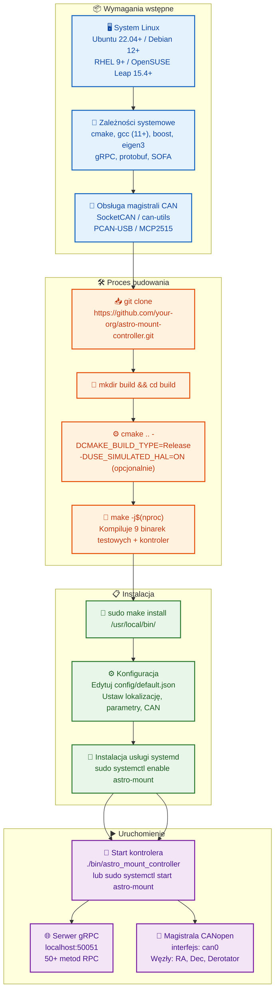

# Instalacja i konfiguracja

## Przepływ budowania i wdrażania



## Wymagania systemowe

### Minimalne wymagania

- **System operacyjny**: Linux (Ubuntu 20.04+, Debian 11+, RHEL 8+)
- **Procesor**: x86_64 lub ARM64, 2+ rdzeni
- **Pamięć RAM**: 4 GB
- **Przestrzeń dyskowa**: 2 GB
- **CAN interface**: CAN bus adapter (np. PCAN-USB, SocketCAN)

### Zalecane wymagania

- **Procesor**: 4+ rdzeni, 2.5+ GHz
- **Pamięć RAM**: 8 GB
- **Przestrzeń dyskowa**: 10 GB (dla logów i danych kalibracyjnych)
- **CAN interface**: Izolowany adapter CAN z wysoką przepustowością

## Instalacja zależności

### Ubuntu/Debian

```bash
# Aktualizacja systemu
sudo apt update
sudo apt upgrade -y

# Zależności systemowe
sudo apt install -y \
    build-essential \
    cmake \
    git \
    pkg-config \
    libssl-dev \
    libboost-all-dev \
    libeigen3-dev \
    libnlohmann-json3-dev \
    libgrpc++-dev \
    libprotobuf-dev \
    protobuf-compiler \
    protobuf-compiler-grpc \
    libcanopen-dev \
    libsofa-dev \
    libgtest-dev

# CAN tools
sudo apt install -y \
    can-utils \
    linux-can \
    socketcan
```

### RHEL/CentOS

```bash
# EPEL repository
sudo yum install -y epel-release

# Zależności systemowe
sudo yum install -y \
    gcc-c++ \
    cmake \
    git \
    pkgconfig \
    openssl-devel \
    boost-devel \
    eigen3-devel \
    json-devel \
    grpc-devel \
    protobuf-devel \
    protobuf-compiler \
    sofa-devel \
    gtest-devel

# CAN tools
sudo yum install -y \
    can-utils \
    kernel-modules-extra
```

## Budowanie z kodu źródłowego

### Pobranie kodu

```bash
git clone https://github.com/your-org/astro-mount-controller.git
cd astro-mount-controller
```

### Konfiguracja CMake

```bash
# Utworzenie katalogu build
mkdir -p build
cd build

# Konfiguracja z domyślnymi opcjami
cmake .. -DCMAKE_BUILD_TYPE=Release

# Lub z dodatkowymi opcjami
cmake .. \
    -DCMAKE_BUILD_TYPE=Release \
    -DBUILD_TESTS=ON \
    -DBUILD_EXAMPLES=ON \
    -DUSE_SYSTEM_CANOPEN=ON \
    -DUSE_SYSTEM_SOFA=ON
```

### Kompilacja

```bash
# Kompilacja wszystkich komponentów
make -j$(nproc)

# Lub tylko głównego programu
make astro-mount-controller

# Kompilacja testów
make tests

# Kompilacja przykładów
make examples
```

### Instalacja systemowa

```bash
# Instalacja do /usr/local
sudo make install

# Lub do katalogu użytkownika
make install DESTDIR=$HOME/astro-mount
```

## Budowanie zewnętrznych bibliotek z kodu źródłowego

Gdy pakiety systemowe są niedostępne (np. starsze openSUSE, minimalne dystrybucje lub środowiska izolowane), wszystkie zależności zewnętrzne można zbudować z kodu źródłowego.

> **Wskazówka**: Po zbudowaniu każdej biblioteki ustaw `CMAKE_PREFIX_PATH`, aby CMake projektu mógł je znaleźć (patrz §7 poniżej).

---

### 1. gRPC + Protobuf (Warstwa komunikacyjna)

gRPC i protobuf to najbardziej złożone zależności. Należy je zbudować jako pierwsze.

```bash
# ── Instalacja narzędzi systemowych (openSUSE) ──
sudo zypper install -y gcc-c++ gcc make cmake git pkg-config \
    libopenssl-devel zlib-devel libcurl-devel

# ── Instalacja narzędzi systemowych (Ubuntu/Debian) ──
# sudo apt install -y build-essential cmake git pkg-config libssl-dev zlib1g-dev

# ── Budowanie protobuf (wymagane przez gRPC) ──
git clone --recurse-submodules -b v21.12 https://github.com/protocolbuffers/protobuf.git
cd protobuf
mkdir -p build && cd build
cmake .. \
    -DCMAKE_BUILD_TYPE=Release \
    -DCMAKE_INSTALL_PREFIX=/usr/local \
    -Dprotobuf_BUILD_TESTS=OFF \
    -Dprotobuf_BUILD_SHARED_LIBS=ON \
    -Dprotobuf_MSVC_STATIC_RUNTIME=OFF
make -j$(nproc)
sudo make install
sudo ldconfig
cd ../..

# ── Budowanie gRPC ──
git clone --recurse-submodules -b v1.59.0 https://github.com/grpc/grpc.git
cd grpc
mkdir -p cmake/build && cd cmake/build
cmake ../.. \
    -DCMAKE_BUILD_TYPE=Release \
    -DCMAKE_INSTALL_PREFIX=/usr/local \
    -DgRPC_INSTALL=ON \
    -DgRPC_BUILD_TESTS=OFF \
    -DgRPC_BUILD_CSHARP_EXT=OFF \
    -DgRPC_BUILD_GRPC_PYTHON_EXT=OFF \
    -DgRPC_USE_PROTO_LIBRARY=ON \
    -DgRPC_PROTOBUF_PROVIDER=package \
    -DgRPC_SSL_PROVIDER=package \
    -DgRPC_ZLIB_PROVIDER=package \
    -DgRPC_CARES_PROVIDER=package \
    -DgRPC_ABSL_PROVIDER=package \
    -DgRPC_RE2_PROVIDER=package
make -j$(nproc)
sudo make install
sudo ldconfig
cd ../../..
```

**Uwaga dla openSUSE**: Jeśli `absl` lub `re2` nie są dostępne jako pakiety, użyj `module` provider:
```bash
cmake ../.. \
    -DCMAKE_BUILD_TYPE=Release \
    -DCMAKE_INSTALL_PREFIX=/usr/local \
    -DgRPC_INSTALL=ON \
    -DgRPC_BUILD_TESTS=OFF \
    -DgRPC_ABSL_PROVIDER=module \
    -DgRPC_RE2_PROVIDER=module \
    -DgRPC_SSL_PROVIDER=package \
    -DgRPC_ZLIB_PROVIDER=package \
    -DgRPC_CARES_PROVIDER=module \
    -DgRPC_PROTOBUF_PROVIDER=package
```

**Oczekiwany rezultat** (po `sudo ldconfig`):
```bash
ldconfig -p | grep grpc
# libgrpc++.so.1.59 (libc6)  =>  /usr/local/lib/libgrpc++.so.1.59
# libgrpc.so.35.0.0 (libc6)  =>  /usr/local/lib/libgrpc.so.35.0.0
ldconfig -p | grep protobuf
# libprotobuf.so.3.21.12 (libc6)  =>  /usr/local/lib/libprotobuf.so.3.21.12
```

---

### 2. nlohmann/json (Biblioteka JSON — tylko nagłówki)

Biblioteka nagłówkowa — nie wymaga kompilacji, wystarczy skopiować pliki:

```bash
# Opcja A — przez menedżer pakietów (openSUSE)
sudo zypper install -y nlohmann-json-devel

# Opcja B — przez menedżer pakietów (Ubuntu/Debian)
# sudo apt install -y libnlohmann-json3-dev

# Opcja C — ręczna instalacja (dowolna dystrybucja)
git clone -b v3.11.3 https://github.com/nlohmann/json.git
cd json
mkdir -p build && cd build
cmake .. -DCMAKE_INSTALL_PREFIX=/usr/local -DJSON_BuildTests=OFF
sudo make install
cd ../..
```

**Weryfikacja**:
```bash
ls /usr/local/include/nlohmann/json.hpp
```

---

### 3. Eigen3 (Algebra liniowa — tylko nagłówki)

```bash
# Opcja A — menedżer pakietów (openSUSE)
sudo zypper install -y eigen3-devel

# Opcja B — menedżer pakietów (Ubuntu/Debian)
# sudo apt install -y libeigen3-dev

# Opcja C — ręczna instalacja
git clone -b 3.4.0 https://gitlab.com/libeigen/eigen.git
cd eigen
mkdir -p build && cd build
cmake .. -DCMAKE_INSTALL_PREFIX=/usr/local
sudo make install
cd ../..
```

---

### 4. spdlog + fmt (System logowania)

```bash
# ── Budowanie fmt (wymagane przez spdlog) ──
git clone -b 10.2.1 https://github.com/fmtlib/fmt.git
cd fmt
mkdir -p build && cd build
cmake .. \
    -DCMAKE_BUILD_TYPE=Release \
    -DCMAKE_INSTALL_PREFIX=/usr/local \
    -DFMT_TEST=OFF \
    -DFMT_DOC=OFF
make -j$(nproc)
sudo make install
cd ../..

# ── Budowanie spdlog ──
git clone -b v1.13.0 https://github.com/gabime/spdlog.git
cd spdlog
mkdir -p build && cd build
cmake .. \
    -DCMAKE_BUILD_TYPE=Release \
    -DCMAKE_INSTALL_PREFIX=/usr/local \
    -DSPDLOG_BUILD_TESTS=OFF \
    -DSPDLOG_BUILD_EXAMPLE=OFF \
    -DSPDLOG_FMT_EXTERNAL=ON
make -j$(nproc)
sudo make install
cd ../..
```

**Uwaga dla openSUSE**: Jeśli `fmt` jest dostępny w repozytorium, zainstaluj go najpierw i pomiń budowanie fmt:
```bash
sudo zypper install -y fmt-devel
```

---

### 5. Google Test (Framework testowy)

```bash
# Opcja A — menedżer pakietów (openSUSE)
sudo zypper install -y gtest-devel

# Opcja B — menedżer pakietów (Ubuntu/Debian)
# sudo apt install -y libgtest-dev

# Opcja C — budowanie z źródła
git clone -b v1.14.0 https://github.com/google/googletest.git
cd googletest
mkdir -p build && cd build
cmake .. \
    -DCMAKE_BUILD_TYPE=Release \
    -DCMAKE_INSTALL_PREFIX=/usr/local \
    -DBUILD_GMOCK=ON \
    -DBUILD_GTEST=ON \
    -DINSTALL_GTEST=ON
make -j$(nproc)
sudo make install
cd ../..
```

---

### 6. SQLite3 (Baza obiektów astronomicznych)

```bash
# Opcja A — menedżer pakietów (openSUSE)
sudo zypper install -y sqlite3-devel

# Opcja B — menedżer pakietów (Ubuntu/Debian)
# sudo apt install -y libsqlite3-dev

# Opcja C — budowanie z źródła
wget https://www.sqlite.org/2024/sqlite-autoconf-3450200.tar.gz
tar xzf sqlite-autoconf-3450200.tar.gz
cd sqlite-autoconf-3450200
./configure --prefix=/usr/local
make -j$(nproc)
sudo make install
cd ..
```

---

### 7. Konfiguracja CMake do znajdowania własnoręcznie zbudowanych bibliotek

Po zbudowaniu biblioteki z kodu źródłowego (domyślnie instalowane do `/usr/local`), ustaw `CMAKE_PREFIX_PATH`, aby `find_package()` projektu mógł je zlokalizować:

```bash
# ── Pojedyncza ścieżka (wszystkie biblioteki w /usr/local) ──
cmake .. \
    -DCMAKE_BUILD_TYPE=Release \
    -DCMAKE_PREFIX_PATH="/usr/local"

# ── Wiele ścieżek (różne katalogi instalacyjne) ──
cmake .. \
    -DCMAKE_BUILD_TYPE=Release \
    -DCMAKE_PREFIX_PATH="/opt/grpc;/opt/protobuf;/usr/local"

# ── Wskazanie ścieżek per-biblioteka (alternatywa) ──
cmake .. \
    -DCMAKE_BUILD_TYPE=Release \
    -DgRPC_DIR="/opt/grpc/lib/cmake/grpc" \
    -Dnlohmann_json_DIR="/usr/local/lib/cmake/nlohmann_json" \
    -DEigen3_DIR="/opt/eigen/share/eigen3/cmake" \
    -Dspdlog_DIR="/usr/local/lib/cmake/spdlog" \
    -Dfmt_DIR="/usr/local/lib/cmake/fmt"
```

**Weryfikacja**, że CMake znajduje właściwe biblioteki:
```bash
cmake .. -DCMAKE_PREFIX_PATH="/usr/local" 2>&1 | grep -E "(Found|Found package)"
# Przykładowy wynik:
# -- Found gRPC: /usr/local/lib/cmake/grpc (found version "1.59.0")
# -- Found Protobuf: /usr/local/lib/cmake/protobuf (found version "3.21.12")
# -- Found Eigen3: /usr/local/share/eigen3/cmake (found version "3.4.0")
```

**Zmienna środowiskowa** (trwała dla kolejnych buildów):
```bash
export CMAKE_PREFIX_PATH="/usr/local;/opt/libs"
echo 'export CMAKE_PREFIX_PATH="/usr/local;/opt/libs"' >> ~/.bashrc
```

---

### 8. Kompletny skrypt budowania dla środowisk offline/izolowanych

Dla w pełni offline'owego systemu lub air-gapped, użyj tego skryptu do zbudowania wszystkich zależności z źródła:

```bash
#!/bin/bash
# build_external_deps.sh — Buduje wszystkie zewnętrzne biblioteki z źródła
set -euo pipefail

PREFIX="${1:-/usr/local}"
JOBS=$(nproc)

echo "=== Budowanie zależności zewnętrznych dla AstroMountController ==="
echo "Prefiks instalacji: ${PREFIX}"
echo "Liczba wątków:      ${JOBS}"

# ── 1. Protobuf ──
git clone --recurse-submodules -b v21.12 https://github.com/protocolbuffers/protobuf.git /tmp/protobuf
cd /tmp/protobuf && mkdir -p build && cd build
cmake .. -DCMAKE_BUILD_TYPE=Release -DCMAKE_INSTALL_PREFIX=${PREFIX} \
    -Dprotobuf_BUILD_TESTS=OFF -Dprotobuf_BUILD_SHARED_LIBS=ON
make -j${JOBS} && sudo make install && sudo ldconfig

# ── 2. gRPC ──
git clone --recurse-submodules -b v1.59.0 https://github.com/grpc/grpc.git /tmp/grpc
cd /tmp/grpc && mkdir -p cmake/build && cd cmake/build
cmake ../.. -DCMAKE_BUILD_TYPE=Release -DCMAKE_INSTALL_PREFIX=${PREFIX} \
    -DgRPC_INSTALL=ON -DgRPC_BUILD_TESTS=OFF -DgRPC_ABSL_PROVIDER=module \
    -DgRPC_RE2_PROVIDER=module -DgRPC_CARES_PROVIDER=module \
    -DgRPC_SSL_PROVIDER=package -DgRPC_ZLIB_PROVIDER=package \
    -DgRPC_PROTOBUF_PROVIDER=package
make -j${JOBS} && sudo make install && sudo ldconfig

# ── 3. nlohmann/json ──
git clone -b v3.11.3 https://github.com/nlohmann/json.git /tmp/json
cd /tmp/json && mkdir -p build && cd build
cmake .. -DCMAKE_INSTALL_PREFIX=${PREFIX} -DJSON_BuildTests=OFF
sudo make install

# ── 4. Eigen3 ──
git clone -b 3.4.0 https://gitlab.com/libeigen/eigen.git /tmp/eigen
cd /tmp/eigen && mkdir -p build && cd build
cmake .. -DCMAKE_INSTALL_PREFIX=${PREFIX}
sudo make install

# ── 5. fmt ──
git clone -b 10.2.1 https://github.com/fmtlib/fmt.git /tmp/fmt
cd /tmp/fmt && mkdir -p build && cd build
cmake .. -DCMAKE_BUILD_TYPE=Release -DCMAKE_INSTALL_PREFIX=${PREFIX} \
    -DFMT_TEST=OFF -DFMT_DOC=OFF
make -j${JOBS} && sudo make install

# ── 6. spdlog ──
git clone -b v1.13.0 https://github.com/gabime/spdlog.git /tmp/spdlog
cd /tmp/spdlog && mkdir -p build && cd build
cmake .. -DCMAKE_BUILD_TYPE=Release -DCMAKE_INSTALL_PREFIX=${PREFIX} \
    -DSPDLOG_BUILD_TESTS=OFF -DSPDLOG_BUILD_EXAMPLE=OFF -DSPDLOG_FMT_EXTERNAL=ON
make -j${JOBS} && sudo make install

# ── 7. Google Test ──
git clone -b v1.14.0 https://github.com/google/googletest.git /tmp/googletest
cd /tmp/googletest && mkdir -p build && cd build
cmake .. -DCMAKE_BUILD_TYPE=Release -DCMAKE_INSTALL_PREFIX=${PREFIX} \
    -DBUILD_GMOCK=ON -DBUILD_GTEST=ON -DINSTALL_GTEST=ON
make -j${JOBS} && sudo make install

# ── Czyszczenie ──
rm -rf /tmp/protobuf /tmp/grpc /tmp/json /tmp/eigen /tmp/fmt /tmp/spdlog /tmp/googletest

echo "=== Wszystkie zależności zbudowane i zainstalowane do ${PREFIX} ==="
echo "Teraz skonfiguruj projekt za pomocą:"
echo "  cmake .. -DCMAKE_PREFIX_PATH=${PREFIX}"
```

Zapisz jako [`scripts/build_external_deps.sh`](../../scripts/build_external_deps.sh) i uruchom:
```bash
chmod +x scripts/build_external_deps.sh
sudo ./scripts/build_external_deps.sh /usr/local
```

---

### 9. openSUSE — szybki przegląd (pakiet vs źródło)

| Zależność | Pakiet openSUSE (`zypper install`) | Buduj z źródła |
|-----------|--------------------------------------|----------------|
| protobuf | `protobuf-devel protobuf-compiler` | §1 powyżej |
| gRPC | `grpc-devel grpc-cli` | §1 powyżej |
| nlohmann/json | `nlohmann-json-devel` | §2 (tylko nagłówki) |
| Eigen3 | `eigen3-devel` | §3 (tylko nagłówki) |
| fmt | `fmt-devel` | §4 |
| spdlog | `spdlog-devel` | §4 |
| GTest | `gtest-devel` | §5 |
| SQLite3 | `sqlite3-devel` | §6 |
| OpenSSL | `libopenssl-devel` | system |
| Boost (opc.) | `boost-devel` | system |
| cmake | `cmake` | system |
| pkg-config | `pkg-config` | system |

```bash
# Instalacja wszystkich dostępnych pakietów openSUSE
sudo zypper install -y \
    gcc-c++ gcc make cmake git pkg-config \
    libopenssl-devel zlib-devel libcurl-devel \
    protobuf-devel protobuf-compiler \
    grpc-devel grpc-cli \
    nlohmann-json-devel \
    eigen3-devel \
    fmt-devel \
    spdlog-devel \
    gtest-devel \
    sqlite3-devel
```

Następnie zbuduj tylko brakujące (np. tylko gRPC, jeśli `grpc-devel` jest niedostępne dla Twojej wersji openSUSE).

## Konfiguracja systemu

### Plik konfiguracyjny

Główny plik konfiguracyjny znajduje się w `config/default.json`. Można go skopiować i zmodyfikować:

```bash
# Kopiowanie domyślnej konfiguracji
cp config/default.json config/my-config.json

# Edycja konfiguracji
nano config/my-config.json
```

### Przykładowa konfiguracja

```json
{
  "logging": {
    "level": "INFO",
    "directory": "/var/log/astro-mount",
    "rotation_days": 7,
    "max_file_size_mb": 100,
    "console_output": true
  },
  "network": {
    "grpc_address": "0.0.0.0",
    "grpc_port": 50051,
    "max_connections": 10,
    "enable_ssl": false,
    "ssl_cert_path": "",
    "ssl_key_path": ""
  },
  "canopen": {
    "interface": "can0",
    "node_id": 1,
    "baud_rate": 1000000,
    "enable_sync": true,
    "sync_interval_ms": 100
  },
  "mount": {
  "type": "equatorial",
  "latitude": 52.0,
  "longitude": 21.0,
  "altitude": 100.0,
  "mount_height": 1.5,
  "max_slew_rate": 5.0,
  "max_tracking_rate": 0.004178,
  "slew_acceleration": 1.0,
  "tracking_acceleration": 0.001,
  "park_position_axis1": 0.0,
  "park_position_axis2": 0.0,
  "meridian_flip_enabled": true,
  "meridian_flip_delay_minutes": 5.0,
  "soft_limits_enabled": true,
  "soft_limit_axis1_min": -5.0,
  "soft_limit_axis1_max": 365.0,
  "soft_limit_axis2_min": -5.0,
  "soft_limit_axis2_max": 185.0,
  "soft_limit_warning_degrees": 5.0,
  "soft_limit_deceleration_degrees": 2.0,
  "soft_limit_tracking_rate_factor": 0.5,
  "enable_refraction_correction": true,
  "axis_physical_parameters": {
    "ha_axis": {
      "motor_steps_per_rev": 200.0,
      "motor_microstepping": 64.0,
      "motor_step_angle": 101.25,
      "encoder_resolution": 16384.0,
      "encoder_counts_per_arcsec": 0.0126,
      "encoder_quantization_error": 39.6,
      "gear_ratio": 360.0,
      "worm_ratio": 180.0,
      "worm_teeth": 1,
      "worm_wheel_teeth": 180,
      "cyclic_error_amplitude": 15.2,
      "cyclic_error_period": 360.0,
      "cyclic_harmonics": [10.5, 0.0, 3.2, 1.5708, 1.1, 3.1416, 0.5, 4.7124],
      "backlash": 8.5,
      "backlash_temp_coeff": 0.02,
      "axis_stiffness": 0.5,
      "torsional_compliance": 1e-6,
      "expansion_coeff": 11.0e-6,
      "temp_gear_error_coeff": 0.05,
      "calibration_temp": 20.0
    },
    "dec_axis": {
      "motor_steps_per_rev": 200.0,
      "motor_microstepping": 64.0,
      "motor_step_angle": 101.25,
      "encoder_resolution": 16384.0,
      "encoder_counts_per_arcsec": 0.0126,
      "encoder_quantization_error": 39.6,
      "gear_ratio": 360.0,
      "worm_ratio": 180.0,
      "worm_teeth": 1,
      "worm_wheel_teeth": 180,
      "cyclic_error_amplitude": 12.8,
      "cyclic_error_period": 360.0,
      "cyclic_harmonics": [8.2, 0.0, 2.5, 1.5708, 0.8, 3.1416, 0.3, 4.7124],
      "backlash": 6.3,
      "backlash_temp_coeff": 0.015,
      "axis_stiffness": 0.6,
      "torsional_compliance": 1.2e-6,
      "expansion_coeff": 11.0e-6,
      "temp_gear_error_coeff": 0.04,
      "calibration_temp": 20.0
    }
  }
},
"telescope": {
  "focal_length": 2000.0,
  "aperture": 200.0,
  "tube_length": 1800.0,
  "camera_model": "ASI1600",
  "pixel_size": 3.8,
  "sensor_width": 4656,
  "sensor_height": 3520
},
"guider": {
  "enabled": false,
  "connection_string": "tcp://localhost:7624",
  "max_correction": 10.0,
  "aggression": 0.5,
  "exposure_time_ms": 2000,
  "binning": 2
},
"kalman": {
  "process_noise": 0.01,
  "measurement_noise": 1.0,
  "adaptive_q": true,
  "adaptive_r": false,
  "innovation_threshold": 3.0,
  "max_iterations": 10
},
"tpoint": {
  "enabled_terms": 65535,
  "min_measurements": 10,
  "max_residual": 30.0,
  "auto_calibrate": true
},
"derotator": {
  "type": "none",
  "gear_ratio": 1.0,
  "max_speed": 10.0,
  "acceleration": 1.0,
  "home_position": 0.0,
  "invert_direction": false,
  "calibration_table": [],
  "canopen_node_id": 3
},
"field_rotation": {
  "enabled": false,
  "compensation_mode": "full",
  "max_rate": 5.0,
  "update_interval_ms": 50,
  "feedforward_enabled": true,
  "pid_p": 1.0,
  "pid_i": 0.1,
  "pid_d": 0.05
},
"hal": {
  "type": "canopen",
  "can_interface": "can0",
  "can_node_id": 1,
  "can_baud_rate": 1000000,
  "can_sync_interval_ms": 100,
  "pdo_update_rate_ms": 100,
  "enable_watchdog": true,
  "watchdog_timeout_ms": 1000,
  "simulated_hal_update_rate_ms": 50,
  "simulated_motor_noise_std": 0.001
}
}
```

## Konfiguracja CAN bus

### Włączenie interfejsu CAN

```bash
# Ładowanie modułu CAN
sudo modprobe can
sudo modprobe can_raw
sudo modprobe can_dev

# Konfiguracja interfejsu CAN (przykład dla can0)
sudo ip link set can0 type can bitrate 1000000
sudo ip link set up can0

# Sprawdzenie statusu
ip -details link show can0
```

### Automatyczne uruchamianie CAN

Dodaj do `/etc/network/interfaces`:

```
auto can0
iface can0 inet manual
    pre-up /sbin/ip link set $IFACE type can bitrate 1000000
    up /sbin/ip link set $IFACE up
    down /sbin/ip link set $IFACE down
```

## Uruchamianie systemu

### Tryb ręczny

```bash
# Uruchomienie z domyślną konfiguracją
./build/src/astro-mount-controller

# Uruchomienie z własną konfiguracją
./build/src/astro-mount-controller config/my-config.json

# Uruchomienie w tle
nohup ./build/src/astro-mount-controller > mount.log 2>&1 &
```

### Jako usługa systemd

Skopiuj plik service:

```bash
sudo cp scripts/astro-mount-controller.service /etc/systemd/system/
```

Edytuj plik service:

```ini
[Unit]
Description=Astronomical Mount Controller
After=network.target canbus.target
Requires=canbus.target

[Service]
Type=simple
User=astro
Group=astro
WorkingDirectory=/opt/astro-mount
ExecStart=/usr/local/bin/astro-mount-controller /etc/astro-mount/config.json
Restart=always
RestartSec=10
StandardOutput=journal
StandardError=journal

[Install]
WantedBy=multi-user.target
```

Włącz i uruchom usługę:

```bash
# Przeładowanie systemd
sudo systemctl daemon-reload

# Włączenie usługi
sudo systemctl enable astro-mount-controller

# Uruchomienie usługi
sudo systemctl start astro-mount-controller

# Sprawdzenie statusu
sudo systemctl status astro-mount-controller

# Podgląd logów
sudo journalctl -u astro-mount-controller -f
```

## Konfiguracja klienta

### Python

```bash
# Instalacja zależności Python
pip install grpcio grpcio-tools protobuf

# Generowanie stubów Python
python -m grpc_tools.protoc \
    -Iproto \
    --python_out=python_client \
    --grpc_python_out=python_client \
    proto/mount_controller.proto
```

### C++

```bash
# Generowanie stubów C++
protoc -I proto \
    --cpp_out=build/generated \
    --grpc_out=build/generated \
    --plugin=protoc-gen-grpc=`which grpc_cpp_plugin` \
    proto/mount_controller.proto
```

## Cele budowania

Projekt produkuje następujące pliki wykonywalne:

| Cel | Opis | Ścieżka binarna |
|-----|------|-----------------|
| `astro_mount_controller` | Główny kontroler montażu z serwerem gRPC | `build/bin/astro_mount_controller` |
| `astro_object_database_server` | Serwer bazy danych obiektów astronomicznych (SQLite + gRPC) | `build/bin/astro_object_database_server` |
| `test_astronomical_calculations` | Testy jednostkowe obliczeń astronomicznych | `build/bin/test_astronomical_calculations` |
| `test_tpoint_model` | Testy jednostkowe modelu TPOINT | `build/bin/test_tpoint_model` |

## Serwer bazy danych obiektów astronomicznych

Serwer bazy danych przechowuje i zarządza danymi obiektów astronomicznych w SQLite z interfejsem gRPC na porcie **50052**.

```bash
# Budowanie
cd build
cmake .. -DCMAKE_BUILD_TYPE=Release
make astro_object_database_server -j$(nproc)

# Uruchomienie z domyślną bazą (./astronomy_objects.db)
./bin/astro_object_database_server

# Niestandardowa ścieżka bazy danych
./bin/astro_object_database_server /ścieżka/do/moja_baza.db
```

## Testowanie instalacji

### Test podstawowy

```bash
# Uruchomienie testów jednostkowych
./build/bin/test_astronomical_calculations
./build/bin/test_tpoint_model

# Test wydajności
./build/bin/test_subarcsecond_accuracy
```

### Test komunikacji

```bash
# Sprawdzenie czy gRPC server działa
grpc_cli call localhost:50051 GetState ""

# Test CAN bus
candump can0
cansend can0 123#1122334455667788
```

### Przykłady użycia

```bash
# Uruchomienie przykładu C++
./build/examples/cpp/example_usage

# Uruchomienie przykładu Python
python examples/python/example_usage.py
```


## Rozwiązywanie problemów

### Typowe problemy

#### CAN bus nie działa
```bash
# Sprawdzenie modułów
lsmod | grep can

# Sprawdzenie interfejsu
ip link show can0

# Test komunikacji
candump can0
```

#### gRPC nie działa
```bash
# Sprawdzenie portu
netstat -tlnp | grep 50051

# Test połączenia
telnet localhost 50051
```

#### Brak uprawnień
```bash
# Dodanie użytkownika do grupy can
sudo usermod -a -G can $USER

# Zmiana uprawnień do urządzenia CAN
sudo chmod 666 /dev/can0
```

### Logi systemowe

```bash
# Podgląd logów aplikacji
tail -f /var/log/astro-mount/astro-mount.log

# Logi systemd
sudo journalctl -u astro-mount-controller -n 100

# Logi kernela (CAN)
dmesg | grep can
```

## Aktualizacja

### Aktualizacja z kodu źródłowego

```bash
# Pobranie najnowszego kodu
git pull origin main

# Ponowna kompilacja
cd build
cmake ..
make -j$(nproc)
sudo make install

# Restart usługi
sudo systemctl restart astro-mount-controller
```

### Aktualizacja konfiguracji

```bash
# Backup starej konfiguracji
cp /etc/astro-mount/config.json /etc/astro-mount/config.json.backup

# Aktualizacja konfiguracji
# (ręczna edycja lub użycie narzędzia migracji)
```

## Bezpieczeństwo

### Konfiguracja SSL/TLS

```json
{
  "network": {
    "enable_ssl": true,
    "ssl_cert_path": "/etc/ssl/certs/astro-mount.crt",
    "ssl_key_path": "/etc/ssl/private/astro-mount.key"
  }
}
```

Generowanie certyfikatów:

```bash
# Generowanie klucza prywatnego
openssl genrsa -out astro-mount.key 2048

# Generowanie CSR
openssl req -new -key astro-mount.key -out astro-mount.csr

# Generowanie certyfikatu (self-signed)
openssl x509 -req -days 365 -in astro-mount.csr -signkey astro-mount.key -out astro-mount.crt

# Kopiowanie certyfikatów
sudo cp astro-mount.crt /etc/ssl/certs/
sudo cp astro-mount.key /etc/ssl/private/
sudo chmod 600 /etc/ssl/private/astro-mount.key
```

### Firewall

```bash
# Otwarcie portu gRPC
sudo ufw allow 50051/tcp

# Otwarcie portu CAN (jeśli używany przez sieć)
sudo ufw allow can
```

## Wydajność

### Optymalizacja systemu

```bash
# Ustawienie priorytetu CPU
sudo nice -n -10 ./astro-mount-controller

# Ustawienie priorytetu I/O
sudo ionice -c 1 -n 0 ./astro-mount-controller

# Konfiguracja jądra dla CAN
echo 1000000 > /sys/class/net/can0/can_bittiming/bitrate
echo 1 > /sys/class/net/can0/can_bittiming/sample_point
```

### Monitorowanie

```bash
# Monitorowanie CPU i pamięci
top -p $(pgrep astro-mount)

# Monitorowanie sieci
iftop -i can0

# Monitorowanie CAN
candump -l can0