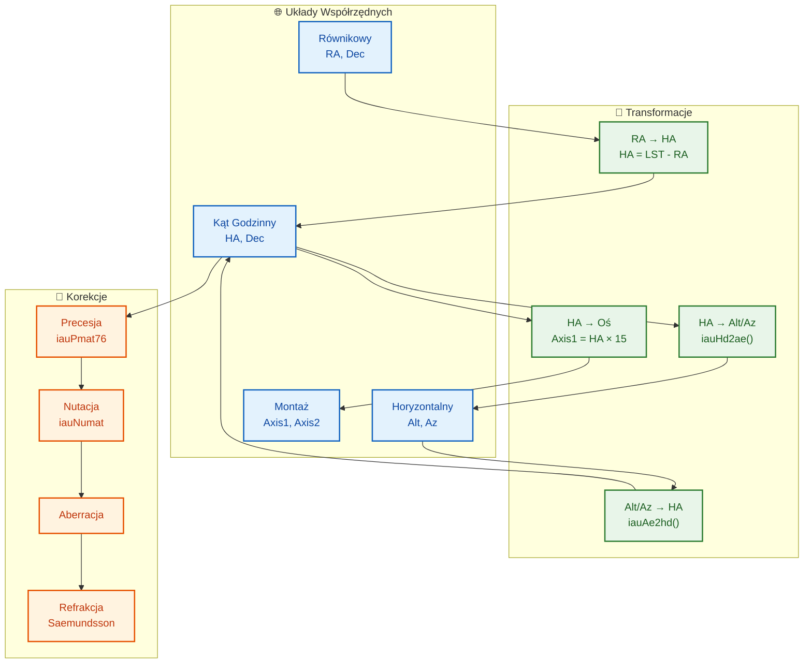

# Model Matematyczny Kontrolera Montażu Astronomicznego

## Przegląd Systemu



> **Odniesienia do kodu źródłowego**: Wszystkie modele matematyczne są zaimplementowane w [`src/controllers/mount_controller.cpp`](../src/controllers/mount_controller.cpp) (5195 linii) oraz [`include/controllers/mount_controller.h`](../include/controllers/mount_controller.h). Struktury konfiguracyjne są zdefiniowane w [`include/config/configuration.h`](../include/config/configuration.h) i walidowane w [`src/config/configuration.cpp`](../src/config/configuration.cpp). Funkcje biblioteki SOFA (precesja, nutacja, transformacje współrzędnych) są używane z katalogu [`sofa/`](../sofa/).

## 1. Układy Współrzędnych i Transformacje

### 1.1 Ramki Odniesienia

Kontroler montażu operuje w czterech głównych układach współrzędnych:

| System | Opis | Jednostki |
|--------|------|-----------|
| **Równikowy (RA, Dec)** | Współrzędne niebieskie, epoka J2000.0 | RA: godziny [0, 24), Dec: stopnie [-90, +90] |
| **Kąt Godzinny (HA, Dec)** | Współrzędne równikowe zorientowane na montaż | HA: godziny [-12, +12), Dec: stopnie [-90, +90] |
| **Horyzontalny (Alt, Az)** | Współrzędne lokalne obserwatora | Alt: stopnie [-90, +90], Az: stopnie [0, 360) |
| **Montaż (Axis1, Axis2)** | Współrzędne silnika/enkodera | stopnie |

### 1.2 Podstawowe Transformacje

#### Równikowy na Kąt Godzinny

```
HA = LST - RA
```

gdzie LST (Localny Czas Gwiazdowy) wynosi:

```
LST = GMST + długość_geograficzna/15°   (w godzinach)
```

a GMST jest obliczane przy użyciu biblioteki SOFA:

```
GMST = iauGst94(JD, 0.0) × 180/π / 15    [godziny]
```

#### Kąt Godzinny na Horyzontalny

Przy użyciu funkcji biblioteki SOFA `iauHd2ae`:

```
az, alt = iauHd2ae(ha, dec, φ)

gdzie:
  ha  = kąt godzinny w radianach
  dec = deklinacja w radianach
  φ   = szerokość geograficzna obserwatora w radianach

  az  = azymut w radianach (mierzony na wschód od północy)
  alt = altitude w radianach
```

#### Horyzontalny na Równikowy

Przy użyciu funkcji biblioteki SOFA `iauAe2hd`:

```
ha, dec = iauAe2hd(az, alt, φ)
ra = LST - ha
```

### 1.3 Model Rotacji Montażu

Dla **montażu równikowego**, zależność między współrzędnymi niebieskimi a osiami montażu:

```
Axis1 = HA × 15  (konwersja godzin na stopnie)
Axis2 = Dec
```

Dla **montażu alt-azymutalnego**:

```
Axis1 = Az
Axis2 = Alt
```

Dla **montażu CASUAL** (przypadkowo zorientowanego, `MountType::CASUAL`):

Montaż CASUAL ma dwie prostopadłe osie, ale ich orientacja względem lokalnego horyzontu jest dowolna i opisana przez kwaternion jednostkowy `Q = [qx, qy, qz, qw]`. Kwaternion ten reprezentuje rotację z lokalnego układu horyzontalnego (ENU: East, North, Up) do układu montażu (axis1, axis2).

**Transformacja niebo → montaż** dla CASUAL:

```
1. RA/Dec → Alt/Az przez istniejącą equatorialToHorizontal()
2. Alt/Az → wektor w układzie horyzontalnym (ENU)
3. Zastosuj Q⁻¹ (odwrotność kwaternionu) → wektor w układzie montażu
4. Wyciągnij kąty (axis1, axis2) z wektora w układzie montażu
```

**Transformacja montaż → niebo** dla CASUAL:

```
1. (axis1, axis2) → wektor w układzie montażu
2. Zastosuj Q → wektor w układzie horyzontalnym (Alt/Az)
3. Alt/Az → RA/Dec przez istniejącą horizontalToEquatorial()
```

Dla kwaternionu jednostkowego `Q = [0, 0, 0, 1]`, CASUAL zachowuje się identycznie jak ALT_AZ.

> **Implementacja**: Funkcje transformacji dla CASUAL są w [`src/core/astronomical_calculations.cpp`](../src/core/astronomical_calculations.cpp): [`equatorialToMountOrientation()`](../src/core/astronomical_calculations.cpp:434) i [`mountOrientationToEquatorial()`](../src/core/astronomical_calculations.cpp:469). [`MountOrientation`](../include/controllers/mount_controller.h:50) jest zdefiniowana w [`include/controllers/mount_controller.h`](../include/controllers/mount_controller.h).

## 2. Precesja i Nutacja

### 2.1 Precesja

Precesja jest stosowana przy użyciu Modelu Precesji IAU 1976 (`iauPmat76`). Transformacja z epoki `t₁` do epoki `t₂`:

```
P(t₁→t₂) = R_J2000→t₂ × R_J2000→t₁ᵀ

[rₜ₂] = P(t₁→t₂) · [rₜ₁]
```

gdzie `r` to wektor pozycji we współrzędnych kartezjańskich wyprowadzonych ze współrzędnych sferycznych (RA, Dec).

### 2.2 Nutacja

Nutacja jest stosowana przy użyciu Modelu Nutacji IAU 1980 (`iauNut80`, `iauObl80`, `iauNumat`):

```
N = iauNumat(ε₀, Δψ, Δε)

[r_apparent] = N · [r_mean]
```

gdzie:
- `ε₀` = średnia nachylenie ekliptyki
- `Δψ` = nutacja w długości
- `Δε` = nutacja w nachyleniu

### 2.3 Obliczanie Pozycji Aparentnej

Pełna korekcja pozycji aparentnej łączy wiele efektów:

```
r_apparent = N · A · P · r_catalog

gdzie:
  P = macierz precesji
  A = macierz aberracji rocznej
  N = macierz nutacji
```

Korekcja aberracji rocznej stosuje uproszczony model:

```
Δα = -v/c · cos(δ) · sin(α)
Δδ = -v/c · cos(α)

gdzie v/c ≈ 10⁻⁴ (prędkość orbitalna Ziemi / prędkość światła)
```

## 3. Model TPOINT do Korekcji Błędów Montażu

> **Implementacja**: [`src/controllers/mount_controller.cpp`](../src/controllers/mount_controller.cpp) linie 2182–2541 — [`addTPointMeasurement()`](../src/controllers/mount_controller.cpp:2182), [`runTPointCalibration()`](../src/controllers/mount_controller.cpp:2261), [`getTPointParameters()`](../src/controllers/mount_controller.cpp:2543). Konfiguracja TPOINT jest zdefiniowana w [`include/config/configuration.h`](../include/config/configuration.h:166) sekcja `TPointConfig`.

### 3.1 Przegląd

Model TPOINT implementuje kompleksową korekcję geometryczną dla montażu astronomicznego. Modeluje montaż jako system fizyczny z mierzalnymi członami błędu, z których każdy odpowiada konkretnemu mechanicznemu niewspółosiowości lub ugięciu.

### 3.2 Definicje Członów Błędu

Każdy człon błędu jest zdefiniowany przez swoją kolumnę macierzy projektowej (pochodną cząstkową względem parametru):

| Człon | Symbol | Wzór | Opis |
|------|--------|------|------|
| Błąd indeksu (HA) | IA | `1` | Stałe przesunięcie w RA |
| Błąd kolimacji | CA | `cos(HA)` | Nieprawidłowe ustawienie osi optycznej |
| Nieprostopadłość osi | NP | RA: `sin(HA)·tan(Dec)` | Nieprostopadłe osie montażu |
| | | Dec: `cos(HA)` | |
| Błąd wysokości bieguna | PA | RA: `-cos(HA)` | Nieprawidłowe ustawienie bieguna w wysokości |
| | | Dec: `1` | |
| Błąd azymutu bieguna | PAz | RA: `sin(HA)` | Nieprawidłowe ustawienie bieguna w azymucie |
| | | Dec: `sin(HA)·tan(Dec)` | |
| Ugięcie tuby (HA) | TF_h | `sin(HA)` | Ugięcie grawitacyjne w RA |
| Ugięcie tuby (Dec) | TF_d | `sin(Dec)` | Ugięcie grawitacyjne w Dec |
| Rotacja tuby | TR | RA: `cos(Dec)` | Rotacja pola z ugięcia tuby |
| | | Dec: `-sin(Dec)·sin(HA)` | |
| Błąd robaka | WE | `sin(2·HA)` | Okresowy błąd przekładni robaczej |
| | | Harmonics: `sin(n·HA)`, `cos(n·HA)` dla n=2..6 | |
| Błąd enkodera (HA) | EE_h | `HA` + harmoniczne | Liniowe i okresowe błędy enkodera |
| Błąd enkodera (Dec) | EE_d | `Dec` + harmoniczne | Liniowe i okresowe błędy enkodera |

### 3.3 Pełne Równania Modelu

Kompletny model TPOINT dla korekcji RA (w sekundach łuku):

```
ΔRA = IA
    + CA · cos(HA)
    + NP · sin(HA) · tan(Dec)
    - PA · cos(HA) + PAz · sin(HA)
    + TF_h · sin(HA)
    + TR · cos(Dec)
    + WE · sin(2·HA) + Σᵢ₌₁⁵ Aᵢ · sin((i+1)·HA + φᵢ)
    + EE_h · HA + Σⱼ₌₁⁴ Bⱼ · sin((j+1)·HA + ψⱼ)
    + ΔRA_physical
```

Kompletny model TPOINT dla korekcji Dec (w sekundach łuku):

```
ΔDec = PA
     + NP · cos(HA)
     + PAz · sin(HA) · tan(Dec)
     + TF_d · sin(Dec)
     - TR · sin(Dec) · sin(HA)
     + EE_d · Dec + Σⱼ₌₁⁴ Cⱼ · sin((j+1)·Dec + χⱼ)
     + A·tan(z) + B·tan³(z) + C·tan⁵(z)
     + ΔDec_physical
```

gdzie `z = 90° - Dec` to odległość zenitalna.

### 3.4 Fizyczne Korekcje Osi

Każda oś zawiera dodatkowe korekcje fizyczne:

```
ΔRA_physical = Δ_cyclic + Δ_worm + Δ_encoder_quant + Δ_backlash + Δ_stiffness + Δ_thermal + Δ_calibration
```

- **Cykliczne błędy przekładni**: `Σᵢ Aᵢ · sin(i·θ + φᵢ)` gdzie θ to kąt obrotu osi
- **Błędy przekładni robaczej**: `A_worm · sin(2π · θ/360 · r_worm)` gdzie r_worm to przełożenie robaka
- **Kwantyzacja enkodera**: `±½ · Q` gdzie Q to krok kwantyzacji w sekundach łuku
- **Backlash**: `B + (T - T_cal) · B_temp` przy zmianie kierunku
- **Sztywność**: `τ · k_axis` gdzie τ to moment obciążenia a k_axis to współczynnik sztywności
- **Rozszerzalność cieplna**: `α · (T - T_cal) · θ`
- **Tablica kalibracyjna**: interpolowana z tabeli pozycja → błąd

### 3.5 Dopasowanie Parametrów TPOINT

Model jest dopasowywany przy użyciu ważonej liniowej metody najmniejszych kwadratów na residuach:

```
r = A · p - b
```

gdzie:
- `r` = wektor residuów (sekundy łuku)
- `A` = macierz projektowa (pochodne cząstkowe modelu)
- `p` = wektor parametrów
- `b` = wektor pomiarowy (obserwowane - oczekiwane, w sekundach łuku)

Równania dla RA i Dec są rozwiązywane oddzielnie:

```
A_RA · p_RA = b_RA
A_Dec · p_Dec = b_Dec
```

Rozwiązanie wykorzystuje dekompozycję QR przez `Eigen::ColPivHouseholderQR` do rozwiązania równań normalnych:

```
(AᵀA) · p = Aᵀb
p = QR.solve(Aᵀb)
```

### 3.6 Zastosowanie Korekcji

Korekcje są odejmowane od obserwowanych współrzędnych w celu uzyskania skorygowanych współrzędnych:

```
RA_corrected = RA_observed - ΔRA / (15 × 3600)    [godziny]
Dec_corrected = Dec_observed - ΔDec / 3600         [stopnie]
```

### 3.7 Predykcja Pozycji Montażu (Newton-Raphson)

Aby znaleźć wymaganą pozycję montażu (HA, Dec) dla danych docelowych współrzędnych niebieskich (RA, Dec), odwrotny model TPOINT jest rozwiązywany iteracyjnie:

```
f(HA, Dec) = applyCorrections(RA, Dec, HA, Dec) - (RA_target, Dec_target) = 0
```

Przy użyciu metody Newtona-Raphsona z analitycznym jakobianem:

```
J = [∂f_RA/∂HA  ∂f_RA/∂Dec]
    [∂f_Dec/∂HA ∂f_Dec/∂Dec]

Δx = -J⁻¹ · f
```

Pochodne cząstkowe są obliczane przez różnice centralne z `ε = 10⁻⁶`.

## 4. Refrakcja Atmosferyczna

### 4.1 Wzór Saemundssona

Do szybkich obliczeń:

```
R = 1.02° / tan(alt + 10.3°/(alt + 5.11°))
    × P/1010 × 283.15/T
```

gdzie:
- `alt` = pozorna wysokość w stopniach
- `P` = ciśnienie atmosferyczne w mbar
- `T` = temperatura w Kelvinach

### 4.2 Pełny Model Saastamoinen

Dla wyższej precyzji, pełny model Saastamoinen jest zaimplementowany w ramach TPOINT:

```
R(z) = A · tan(z) + B · tan³(z) + C · tan⁵(z)

gdzie z = 90° - Dec (odległość zenitalna)
      A, B, C = dopasowane współczynniki refrakcji
```

## 5. Estymacja Stanu z Rozszerzonym Filtrem Kalmana

> **Implementacja**: [`src/controllers/mount_controller.cpp`](../src/controllers/mount_controller.cpp) linie 38–134 — wewnętrzna struktura `PositionKalmanFilter`. Kluczowe metody: `init()` (linia 53), `predict()` (linia 84), `update()` (linia 103). Aktualizacja kowariancji w formie Joseph'a w linii 120. Adaptacyjna estymacja szumu w liniach 364–371.

### 5.1 Wektor Stanu

Wektor stanu filtru Kalmana ma wymiar `N = 7 + N_tpoint`:

```
x = [q₀, q₁, q₂, q₃, ω_HA, ω_Dec, T, p_₁, p_₂, ..., p_N]ᵀ
```

gdzie:
- `q₀, q₁, q₂, q₃` = kwaternion orientacji (4 parametry)
- `ω_HA, ω_Dec` = prędkości kątowe montażu (2 parametry)
- `T` = temperatura otoczenia (1 parametr)
- `p_i` = parametry modelu TPOINT

### 5.2 Model Procesu

Przejście stanu wykorzystuje model stałej prędkości dla orientacji i prędkości:

```
F = [I₄  Δt·I₂  0 ]
    [0   I₂     0 ]
    [0   0   I_(1+N_tpoint)]
```

Kowariancja szumu procesu `Q` jest konfigurowana z różnymi poziomami szumu dla orientacji, parametrów TPOINT, prędkości i parametrów środowiskowych.

### 5.3 Aktualizacja Pomiarowa

Wzmocnienie Kalmana jest obliczane jako:

```
K = P · Hᵀ · (H · P · Hᵀ + R)⁻¹
```

Aktualizacja stanu (forma Joseph'a dla stabilności numerycznej):

```
x_new = x + K · (z - H · x)
P_new = (I - K·H) · P · (I - K·H)ᵀ + K · R · Kᵀ
```

### 5.4 Adaptacyjna Estymacja Szumu

Filttr adaptuje swoje parametry szumu online używając statystyk innowacji:

```
R_estimated = (Σ εᵢεᵢᵀ)/N - H·P·Hᵀ
Q_adapt = (1-α)·Q + α·(K · R_estimated · Kᵀ)
```

gdzie `εᵢ = zᵢ - H·xᵢ` to sekwencja innowacji.

### 5.5 Punkty Sigma UKF

Implementacja może generować punkty sigma Niescentowanego Filtru Kalmana (UKF) dla nieliniowych transformacji:

```
x⁽⁰⁾ = x̄
x⁽ⁱ⁾ = x̄ + √(n+λ) · L_ᵢ   dla i = 1, ..., n
x⁽ⁿ⁺ⁱ⁾ = x̄ - √(n+λ) · L_ᵢ   dla i = 1, ..., n

gdzie:
  λ = α²(n + κ) - n
  L = Cholesky(P)  (dolna trójkątna)
  α = 10⁻³, β = 2, κ = 0 (standardowe parametry UKF)
```

## 6. Interpolacja Efemeryd dla Obiektów Ruchomych

> **Implementacja**: [`src/controllers/mount_controller.cpp`](../src/controllers/mount_controller.cpp) linie 3134–3258 — [`uploadEphemeris()`](../src/controllers/mount_controller.cpp:3134), [`startEphemerisTracking()`](../src/controllers/mount_controller.cpp:3168), [`getEphemerisTrackStatus()`](../src/controllers/mount_controller.cpp:3223). Struktury danych efemeryd są zdefiniowane w [`proto/mount_controller.proto`](../proto/mount_controller.proto:676) wiadomości `EphemerisData`, `EphemerisPoint`, `EphemerisTrackStatus`.

### 6.1 Metody Interpolacji

Interpolator efemeryd wspiera trzy rzędy interpolacji przy użyciu wielomianów Lagrange'a:

**Liniowa** (rząd 1):
```
f(t) = f₀ · (t₁ - t)/(t₁ - t₀) + f₁ · (t - t₀)/(t₁ - t₀)
```

**Kwadratowa** (rząd 2):
```
f(t) = f₀ · L₀(t) + f₁ · L₁(t) + f₂ · L₂(t)

L₀(t) = (t - t₁)(t - t₂) / ((t₀ - t₁)(t₀ - t₂))
L₁(t) = (t - t₀)(t - t₂) / ((t₁ - t₀)(t₁ - t₂))
L₂(t) = (t - t₀)(t - t₁) / ((t₂ - t₀)(t₂ - t₁))
```

**Sześcienna** (rząd 3, domyślna):
```
f(t) = Σᵢ₌₀³ fᵢ · Lᵢ(t)

Lᵢ(t) = Πⱼ₌₀,ⱼ≠ᵢ³ (t - tⱼ) / (tᵢ - tⱼ)
```

### 6.2 Ekstrapolacja Poza Zakres Efemeryd

Dla czasów poza zakresem efemeryd, liniowa ekstrapolacja przy użyciu ostatniego znanego wektora stanu:

```
r(t) = r_N + ṙ_N · (t - t_N) / 3600   [RA w godzinach, Dec w stopniach]
ṙ(t) = ṙ_N                            [założenie stałej prędkości]
```

### 6.3 Korekcja Rotacji Ziemi

Dla pozycji aparentnych, rotacja Ziemi jest stosowana:

```
RA_apparent = RA_ephemeris - ω_⊕ · (t - t_epoch)

gdzie ω_⊕ = 15.041 sekund łuku/sekundę = 0.004178 godzin/sekundę
```

### 6.4 Pełny Łańcuch Korekcji

Przy obliczaniu pozycji aparentnych do śledzenia, korekcje są stosowane w kolejności:

1. Interpolacja bazowej pozycji z danych efemeryd
2. Zastosowanie korekcji ruchu własnego (jeśli dotyczy)
3. Zastosowanie precesji (z epoki efemeryd do bieżącej daty)
4. Zastosowanie nutacji
5. Zastosowanie korekcji rotacji Ziemi (ruch dobowy)
6. Zastosowanie refrakcji atmosferycznej
7. Zastosowanie korekcji montażu TPOINT (jeśli model jest dostępny)

## 7. Sterowanie Śledzeniem

> **Implementacja**: [`src/controllers/mount_controller.cpp`](../src/controllers/mount_controller.cpp) linie 856–1707 — [`startTracking()`](../src/controllers/mount_controller.cpp:856) implementuje pełną pętlę śledzenia z zabezpieczeniami przed propagacją NaN/Inf w liniach 3–5 (górny strumień) i 6–9 (dolny strumień). [`TrackingMode`](../include/controllers/mount_controller.h) wspiera tryby SIDEREAL, SOLAR, LUNAR i CUSTOM. Integracja korekcji guidera w linii 2710.

### 7.1 Prędkości Śledzenia

| Tryb | Prędkość RA (deg/s) | Opis |
|------|---------------------|------|
| Gwiazdowy | 0.004178 | 15.041 arcsec/s |
| Słoneczny | 0.004167 | 15.000 arcsec/s |
| Księżycowy | 0.004079 | 14.685 arcsec/s |
| Niestandardowy | konfigurowalny | Prędkość zdefiniowana przez użytkownika |

### 7.2 Integracja Korekcji Guidera

Korekcje guidera są stosowane w sekundach łuku z clampowaniem i agresją:

```
ΔRA_rate = clamp(correction_RA × aggression, -max_correction, +max_correction)
ΔDec_rate = clamp(correction_Dec × aggression, -max_correction, +max_correction)

rate_RA += ΔRA_rate / 3600 / 15   [konwersja arcsec na deg/s]
rate_Dec += ΔDec_rate / 3600      [konwersja arcsec na deg/s]
```

### 7.3 Rotacja Pola dla Montażu Alt-Az i CASUAL

Dla montażów alt-azymutalnych i CASUAL, rotacja pola jest obliczana jako:

```
Φ˙ = -ω_⊕ · cos(φ) / sin(alt)

gdzie:
  Φ˙ = prędkość rotacji pola (rad/s)
  ω_⊕ = prędkość rotacji Ziemi = 7.2921150 × 10⁻⁵ rad/s
  φ = szerokość geograficzna obserwatora
  alt = wysokość teleskopu
```

Dla montażów CASUAL, wysokość (alt) używana w powyższym wzorze to oś alt-podobna w układzie montażu (axis1), która jest rzutem rzeczywistej wysokości poprzez kwaternion orientacji.

Całkowita rotacja pola jest całkowana w czasie:

```
Φ(t) = ∫ Φ˙(τ) dτ
```

Dla montażów równikowych, rotacja pola wynosi zero (z wyjątkiem efektów atmosferycznych).

### 7.4 Śledzenie dla Montażu CASUAL

Dla montażu CASUAL, prędkości śledzenia są obliczane dynamicznie w pętli śledzenia:

```
1. Oblicz prędkości śledzenia w rzeczywistym układzie horyzontalnym (Alt/Az)
   - Prędkość Alt:  d(alt)/dt = ω_⊕ · cos(φ) · cos(az)
   - Prędkość Az:   d(az)/dt  = -ω_⊕ · (cos(φ) · sin(az) · sin(alt) + sin(φ) · cos(alt)) / cos(alt)
2. Transformuj wektor prędkości przez kwaternion orientacji Q⁻¹ do układu montażu
3. Uzyskaj prędkości (axis1_rate, axis2_rate) w układzie montażu
```

Dla kwaternionu jednostkowego, prędkości śledzenia CASUAL są identyczne jak dla ALT_AZ.

## 8. Kalibracja Bootstrap

> **Implementacja**: [`src/controllers/mount_controller.cpp`](../src/controllers/mount_controller.cpp) linie 2045–2146 — [`addBootstrapMeasurement()`](../src/controllers/mount_controller.cpp:2045), [`runBootstrapCalibration()`](../src/controllers/mount_controller.cpp:2069), [`clearBootstrapMeasurements()`](../src/controllers/mount_controller.cpp:2139). Wiadomości Bootstrap zdefiniowane w [`proto/mount_controller.proto`](../proto/mount_controller.proto:765) — `BootstrapMeasurement`, `BootstrapCalibrationResult`, `BootstrapStatus`.

### 8.1 Algorytm Wstępnego Wyrównania

Kalibracja bootstrap wykorzystuje prosty model liniowy do określenia początkowych korekcji pointingowych:

```
ΔRA = mean(expected_RA - observed_RA) across all measurements
ΔDec = mean(expected_Dec - observed_Dec) across all measurements
```

Przesunięcia RA są normalizowane do zakresu [-12, +12] godzin przed uśrednieniem.

Korekcja jest stosowana do bieżącej pozycji montażu:

```
Axis1_target += ΔRA × 15°  (konwersja godzin na stopnie)
Axis2_target += ΔDec
```

### 8.2 Kalibracja Bootstrap dla CASUAL

Dla montażu CASUAL, kalibracja bootstrap estymuje kwaternion orientacji montażu z co najmniej 3 pomiarów. Dla każdego pomiaru (obserwowane RA/Dec, oczekiwane RA/Dec):

```
1. Dla każdego pomiaru:
   a. Oblicz wektor kierunku w układzie horyzontalnym z (obserwowane RA, Dec)
   b. Oblicz wektor kierunku w układzie horyzontalnym z (oczekiwane RA, Dec)
   c. Różnica między tymi wektorami daje kierunek błędu w układzie horyzontalnym
2. Dopasuj kwaternion Q, który minimalizuje błędy pointingowe dla wszystkich pomiarów
3. Zastosuj metodę najmniejszych kwadratów z ortogonalną regresją Prokrustesa
```

Wynikiem jest estymowany kwaternion orientacji `Q`, który jest ustawiany jako `mount_orientation` w konfiguracji montażu.

### 8.3 Metryki Jakości

```
RMS_RA = sqrt(mean((ΔRA_i - ΔRA)²))
RMS_Dec = sqrt(mean((ΔDec_i - ΔDec)²))
```

## 9. Stabilność Numeryczna

> **Implementacja**: Zabezpieczenia przed propagacją NaN/Inf są osadzone w całej pętli śledzenia w [`src/controllers/mount_controller.cpp`](../src/controllers/mount_controller.cpp) — strażnicy górnego strumienia w liniach 3–5 (obliczanie prędkości, aktualizacja pozycji, wyjście Kalmana), strażnicy dolnego strumienia w liniach 6–9 (normalizacja HA/RA, nutacja, TPOINT, refrakcja). Aktualizacja kowariancji w formie Joseph'a w linii 120 zapewnia dodatnią półokreśloność. [`evaluateSoftLimits()`](../src/controllers/mount_controller.cpp:4563) implementuje 3-strefowy system bezpieczeństwa (ostrzeżenie → hamowanie → twarde zatrzymanie).

### 9.1 Obsługa Osobliwości

| Osobliwość | Lokalizacja | Mitigacja |
|------------|-------------|-----------|
| tan(Dec) w pobliżu biegunów | |Dec| > 85° | Rozwinięcie Taylora: `tan(90°-ε) ≈ 1/ε - ε/3` |
| cos(Dec) ≈ 0 na biegunach | Dec = ±90° | Clamp do ε = 10⁻⁶ |
| sin(alt) ≈ 0 na horyzoncie | alt = 0° | Clamp do min 1° dla rotacji pola |
| tan(z) w pobliżu horyzontu | z → 90° | Rozwinięcie wielomianowe dla tan |

### 9.2 Kondycjonowanie Kowariancji

- **Forma Joseph'a** dla aktualizacji kowariancji: `P = (I-KH)P(I-KH)ᵀ + KRKᵀ` zapewnia dodatnią półokreśloność
- Dla źle uwarunkowanych macierzy, używana jest dekompozycja QR zamiast bezpośredniej inwersji
- Kowariancja jest ograniczona od dołu przez `1.0` i od góry przez `1000.0`

### 9.3 Zawijanie Współrzędnych

```
Normalizacja RA: while RA < 0: RA += 24; while RA >= 24: RA -= 24
Normalizacja HA: while HA < -12: HA += 24; while HA >= 12: HA -= 24
Clamp Dec: if Dec < -90: Dec = -90; if Dec > 90: Dec = 90
Normalizacja Az: while Az < 0: Az += 360; while Az >= 360: Az -= 360
```

## 10. Budżet Błędów i Oczekiwana Dokładność

| Źródło Błędu | Typowa Wielkość (arcsec) | Mitigacja |
|-------------|--------------------------|-----------|
| Nieprawidłowe ustawienie bieguna | 30–300 | Wyrównanie dryftowe + człon PA TPOINT |
| Nieprostopadłość osi | 10–60 | Człon NP TPOINT |
| Ugięcie tuby | 5–30 | Człony ugięcia TPOINT |
| Błąd przekładni robaczej | 1–20 | Model korekcji harmonicznej |
| Kwantyzacja enkodera | 0.1–5 | Enkodery wysokiej rozdzielczości + kalibracja |
| Refrakcja atmosferyczna | 0–60 przy 45° alt | Model Saastamoinen |
| Widzenie atmosferyczne | 0.5–5 (zależne od lokalizacji) | Korekcja guiderem |
| Rozszerzalność cieplna | 0.1–2/°C | Kompensacja temperaturowa |
| Backlash | 1–30 | Kompensacja przy zmianie kierunku |

Docelowa dokładność śledzenia po pełnej kalibracji: **< 1 sekunda łuku RMS**
