# Diagramy Przepływu Danych Systemu

Ten dokument opisuje przepływ danych między wszystkimi głównymi komponentami Astronomicznego Kontrolera Montażu przy użyciu diagramów Mermaid.js.

## 1. Architektura Systemu Wysokiego Poziomu

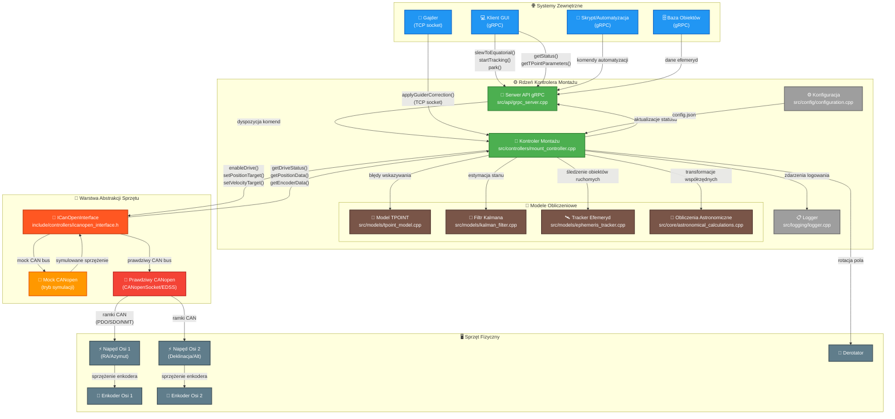

## 2. Przepływ Sterowania w Pętli Nawigacji

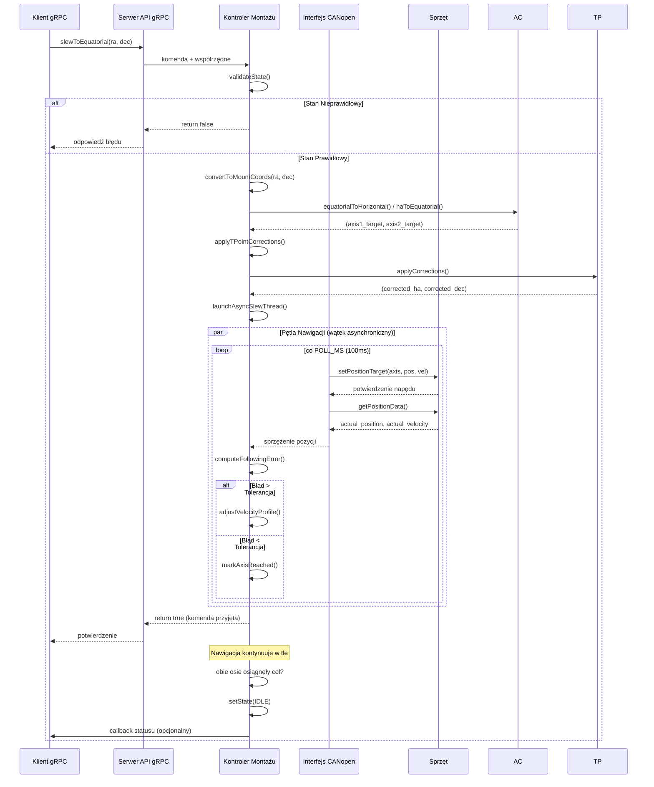

## 3. Pętla Śledzenia (Tracking)

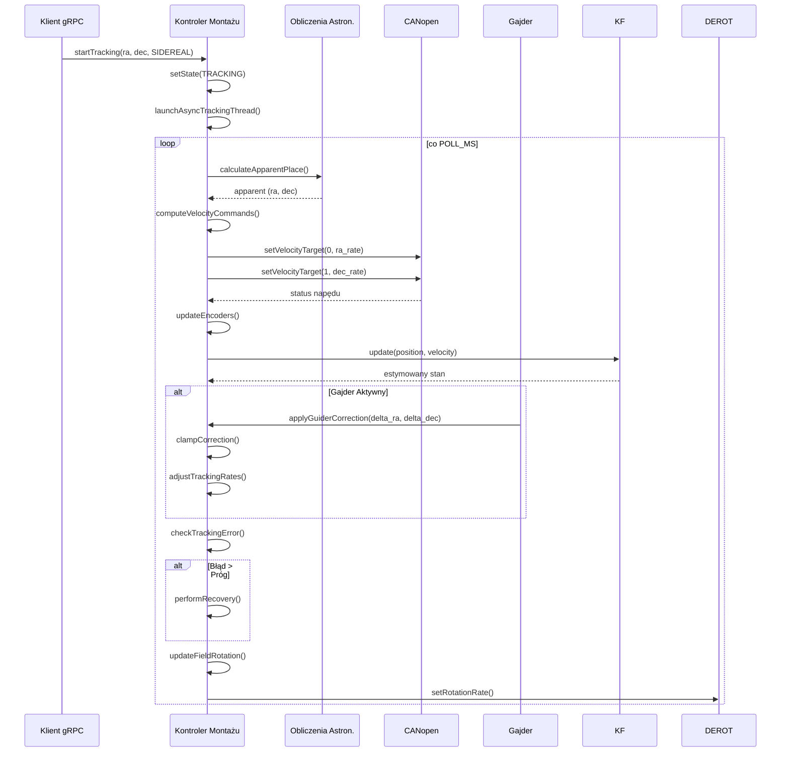

## 4. Przepływ Komunikacji CANopen

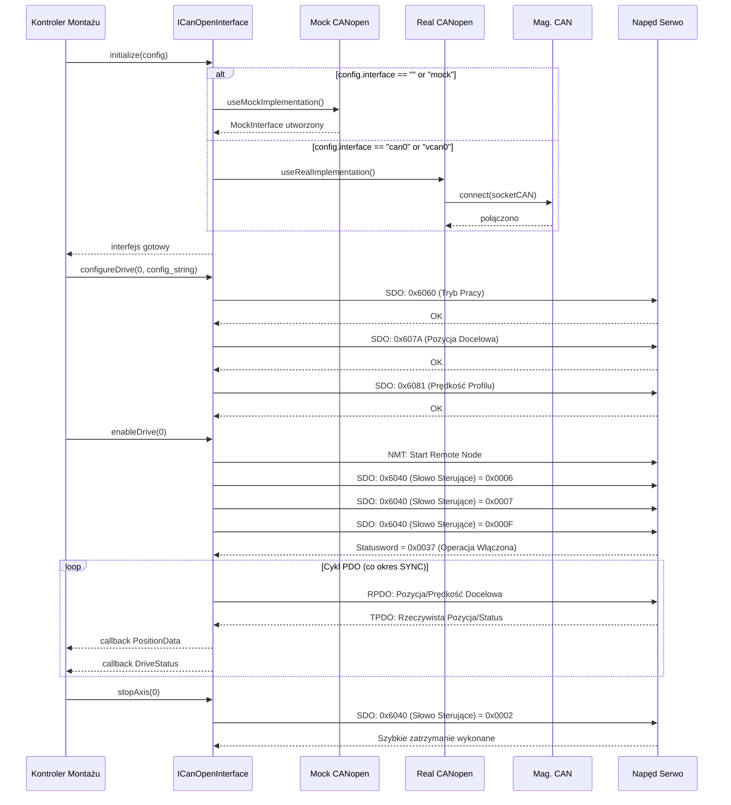

## 5. Przepływ Śledzenia Efemeryd

```mermaid
sequenceDiagram
    participant Client as Klient gRPC
    participle ODB as Baza Obiektów
    participant API as Serwer API gRPC
    participant MC as Kontroler Montażu  
    participle EPM as EphemerisModel
    participant EPT as EphemerisTracker
    participle EPI as EphemerisInterpolator
    
    Client->>ODB: queryEphemeris(object_id, time_range)
    ODB-->>Client: EphemerisData (punkty[])
    
    Client->>API: uploadEphemeris(data)
    API->>MC: uploadEphemeris(object_id, points)
    
    MC->>EPM: EphemerisModel(data, config)
    EPM->>EPI: EphemerisInterpolator(points, order)
    EPI-->>EPM: interpolator gotowy
    EPM-->>MC: model gotowy
    
    MC->>EPT: EphemerisTracker(model, lat, lon, alt)
    EPT-->>MC: tracker utworzony
    
    Client->>API: startEphemerisTracking(object_id, time)
    API->>MC: startEphemerisTracking()
    
    MC->>EPT: startTracking(start_time, config)
    
    loop Pętla Śledzenia (10 Hz)
        EPT->>EPM: getApparentPosition(time)
        EPM->>EPI: getPositionAtTime(time)
        
        alt czas w zakresie efemeryd
            EPI-->>EPM: (ra, dec, ra_rate, dec_rate)
            EPM->>EPM: applyEarthRotation()
            EPM->>EPM: applyAtmosphericRefraction()
            EPM->>EPM: applyTPointCorrections()
            EPM-->>EPT: apparent_position
        else czas poza zakresem + ekstrapolacja
            EPI->>EPI: predictPosition(time, max_extrap)
            EPI-->>EPM: predicted_position
            EPM-->>EPT: przewidziane + korekcje
        end
        
        EPT->>MC: updateTargetPosition(ra, dec, rates)
        MC->>CAN: setVelocityTarget(axes, rates)
    end
    
    Client->>API: stopEphemerisTracking(tracker_id)
    API->>MC: stopEphemerisTracking()
    MC->>EPT: stopTracking()
    EPT-->>MC: śledzenie zatrzymane, statystyki
    MC-->>API: sukces
    API-->>Client: potwierdzenie
```

## 6. Przepływ Korekcji Gajdera

```mermaid
flowchart LR
    subgraph External
        G[Oprogramowanie Gajdera<br/>PHD2 / Ekos / ASCOM]
    end
    
    subgraph MountController
        direction TB
        GC[Połączenie Gajdera<br/>TCP socket]
        GR[Regulator Gajdera]
        TR[Pętla Śledzenia<br/>Kalkulator prędkości]
        CL[Ogranicznik + Agresywność]
        MC[Główny Kontroler]
    end
    
    subgraph HAL
        CAN2[Interfejs CANopen]
    end
    
    subgraph Hardware
        D1[Napęd Osi 1]
        D2[Napęd Osi 2]
    end
    
    G -->|"połączenie TCP<br/>socket://ip:port"| GC
    GC -->|"korekcja<br/>(ra_arcsec, dec_arcsec)"| GR
    
    GR -->|"surowa korekcja"| CL
    CL -->|"ogranicz do ±max_correction<br/>zastosuj współczynnik agresji"| TR
    
    MC -->|"prędkość gwiazdowa/słoneczna/księżycowa"| TR
    TR -->|"prędkość końcowa = bazowa + Δ"| MC
    
    MC -->|"setVelocityTarget(axis, rate)"| CAN2
    CAN2 -->|"tryb prędkości"| D1
    CAN2 -->|"tryb prędkości"| D2
    
    D1 -->|"rzeczywista pozycja"| CAN2
    D2 -->|"rzeczywista pozycja"| CAN2
    CAN2 -->|"getPositionData()"| MC
    MC -->|"aktualizacja statusu<br/>(guider_active, tracking_error)"| GC
    
    style G fill:#FF9800,color:#fff
    style GC fill:#4CAF50,color:#fff
    style GR fill:#4CAF50,color:#fff
    style CL fill:#FF5722,color:#fff
    style TR fill:#4CAF50,color:#fff
    style MC fill:#4CAF50,color:#fff
    style CAN2 fill:#FF5722,color:#fff
    style D1 fill:#607D8B,color:#fff
    style D2 fill:#607D8B,color:#fff
```

## 7. Przepływ Kalibracji TPOINT

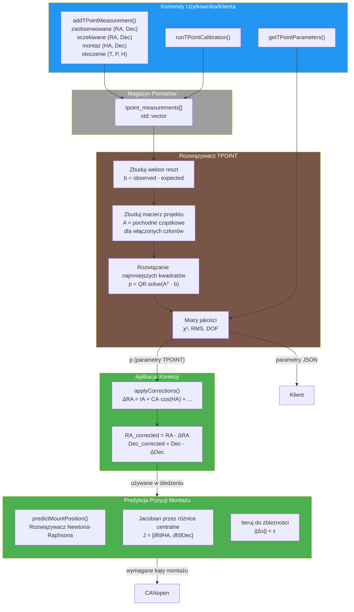

## 8. Przepływ Ładowania Konfiguracji

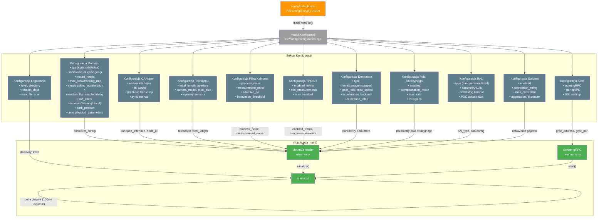

## 9. Maszyna Stanów Parkowania/Odparkowania

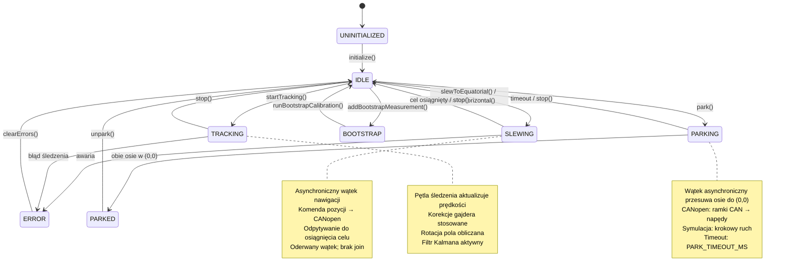

## 10. Przepływ Bazy Obiektów Astronomicznych

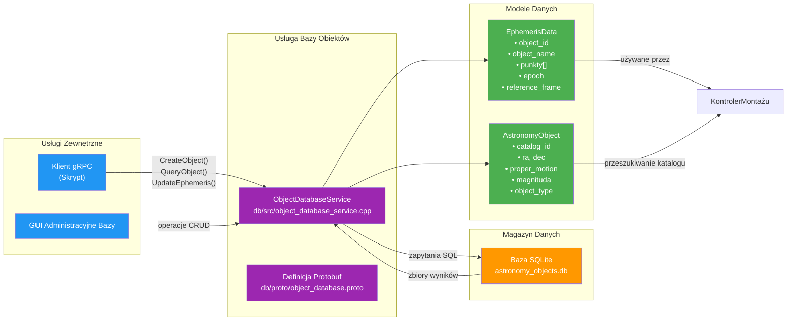

## 11. Architektura Testów Mock

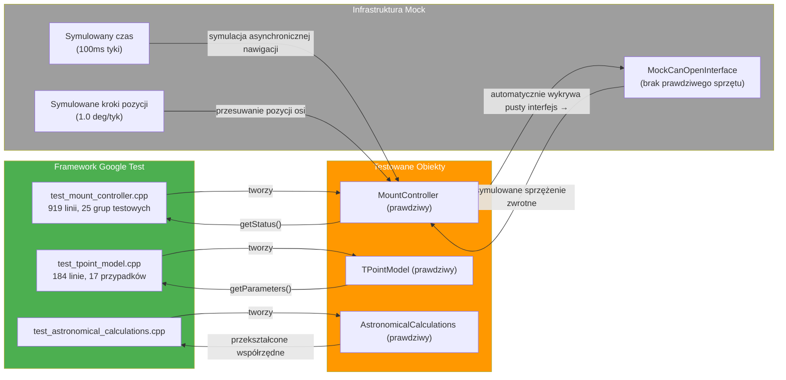

## Legenda

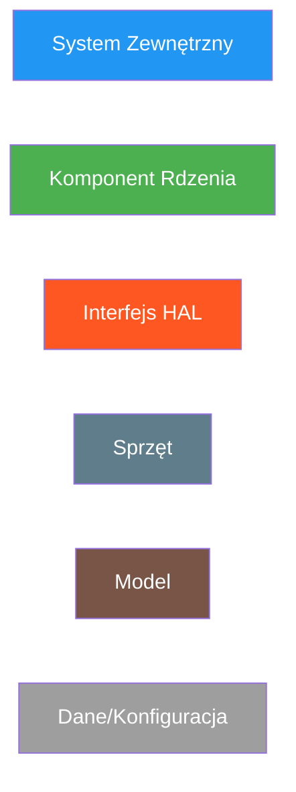

## 12. Przepływ danych derotatora

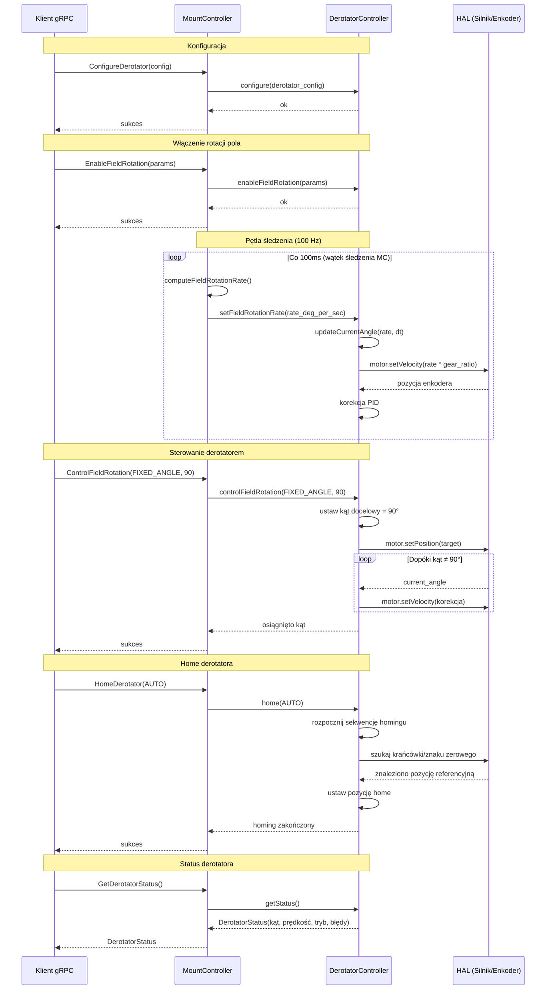

## 13. Przepływ danych sterownika ASCOM

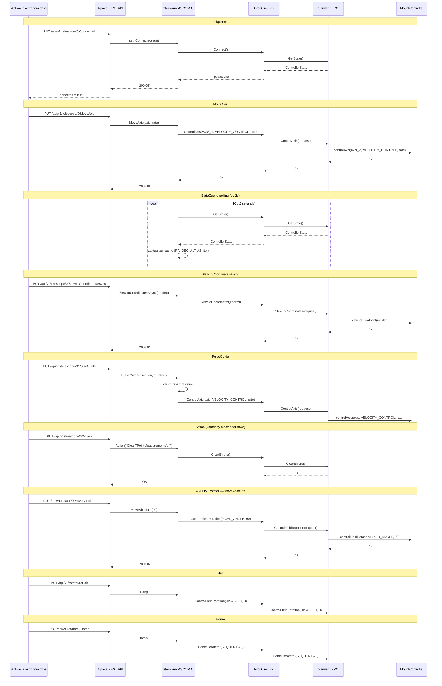

## 14. Przepływ danych sterownika INDI

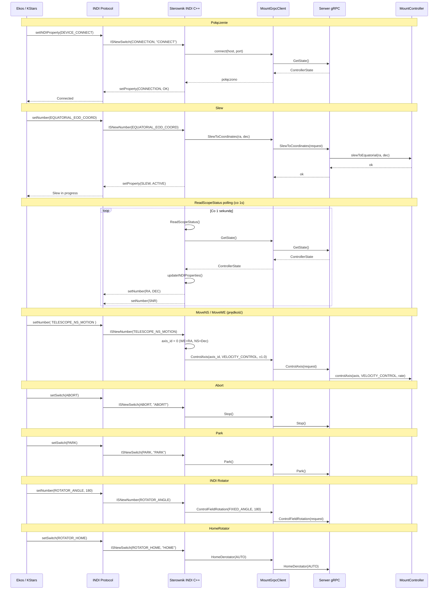
