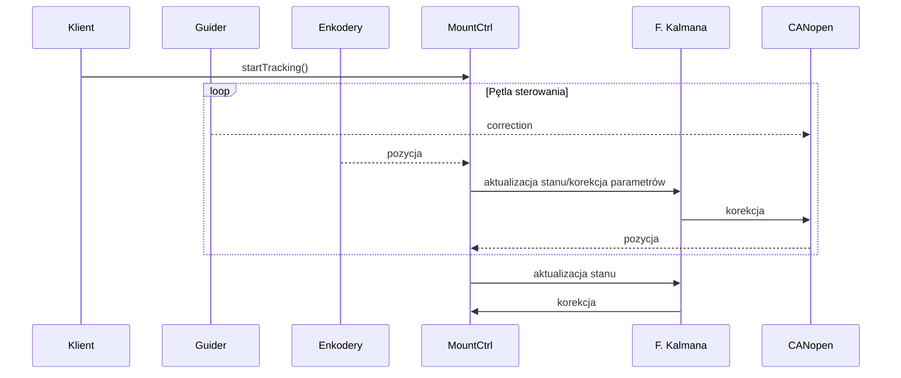
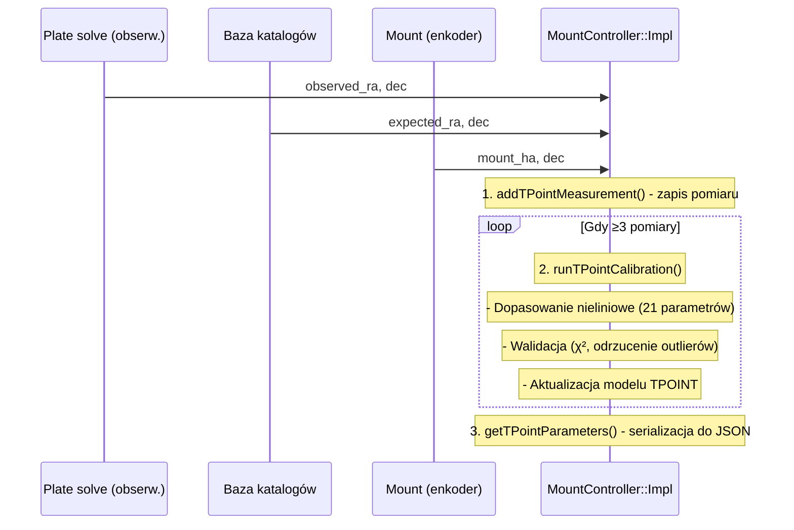
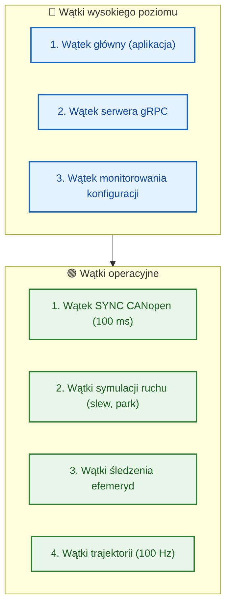
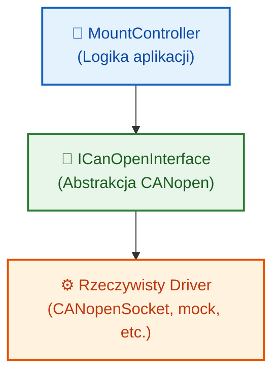
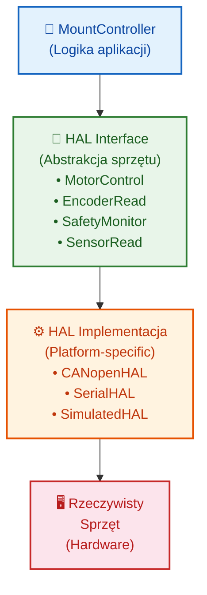

# Przepływ przetwarzania w kontrolerze montażu

## Wprowadzenie

Dokument ten opisuje szczegółowo przepływ przetwarzania w głównym kontrolerze montażu astronomicznego (`MountController`). Każdy scenariusz użytkowy jest przedstawiony z punktu widzenia przepływu danych, wywołań metod, transformacji współrzędnych i interakcji między komponentami systemu.

## Architektura komponentów

Przed opisem scenariuszy, przypomnijmy kluczowe komponenty zaangażowane w przetwarzanie:

1. **`MountController`** (`include/controllers/mount_controller.h`, `src/controllers/mount_controller.cpp`) - główna klasa kontrolera
2. **`ICanOpenInterface`** (`include/controllers/icanopen_interface.h`) - abstrakcyjny interfejs CANopen
3. **`CanOpenFactory`** (`include/controllers/canopen_factory.h`, `src/controllers/canopen_factory.cpp`) - fabryka implementacji CANopen
4. **`EphemerisTrackerManager`** (`include/models/ephemeris_tracker.h`) - zarządzanie śledzeniem efemeryd
5. **Protobuf/gRPC** (`proto/mount_controller.proto`) - interfejs komunikacyjny

## Scenariusze przetwarzania

### 1. Inicjalizacja kontrolera

**Opis**: Inicjalizacja systemu po uruchomieniu lub restarcie.

**Sekwencja wywołań**:
```
MountController::initialize()
  ↓
MountController::Impl::initialize()
  ↓
CanOpenFactory::create() - tworzenie interfejsu CANopen
  ↓
ICanOpenInterface::initialize() - inicjalizacja interfejsu
  ↓
Ustawienie stanu na IDLE
```

**Kod źródłowy**:
- `src/controllers/mount_controller.cpp`, linie 35-70: `Impl::initialize()`
- `src/controllers/canopen_factory.cpp`: tworzenie instancji CANopen
- `include/controllers/mount_controller.h`, linie 186: deklaracja `initialize()`

**Przepływ danych**:
1. Ładowanie konfiguracji z `ControllerConfig`
2. Tworzenie interfejsu CANopen na podstawie `config.canopen_interface`
3. Fallback na mock implementację jeśli tworzenie się nie powiedzie
4. Inicjalizacja interfejsu CANopen
5. Ustawienie stanu wewnętrznego na `MountStatus::State::IDLE`

**Kluczowe parametry**:
- `canopen_interface`: nazwa biblioteki CANopen (np. "mock", "canopensocket")
- `canopen_node_id`: identyfikator węzła CANopen
- `latitude`, `longitude`, `altitude`: pozycja obserwatorium

### 2. Kalibracja bootstrap (początkowa)

**Opis**: Wstępna kalibracja wykorzystująca proste pomiary do określenia orientacji montażu.

**Sekwencja wywołań**:
```
MountController::addBootstrapMeasurement()
  ↓
MountController::Impl::addBootstrapMeasurement()
  ↓
Zapisanie pomiaru do wektora measurements_
  ↓
MountController::runBootstrapCalibration()
  ↓
MountController::Impl::runBootstrapCalibration()
  ↓
Obliczenie prostego modelu liniowego (≥2 pomiary)
  ↓
Ustawienie flagi bootstrap_calibrated_ = true
```

**Kod źródłowy**:
- `src/controllers/mount_controller.cpp`, linie 185-227: metody bootstrap calibration
- `include/controllers/mount_controller.h`, linie 259-284: API bootstrap

**Przepływ danych**:
```
[observed_ra, observed_dec]  →  Pomiar z plate solving
[expected_ra, expected_dec]   →  Pozycje katalogowe
[mount_ha, mount_dec]         →  Pozycja montażu (opcjonalna)
  ↓
Przechowywanie w strukturze Measurement
  ↓
Po ≥2 pomiarach: obliczenie macierzy rotacji
  ↓
Zapisanie stanu kalibracji
```

**Format pomiaru**:
```cpp
struct Measurement {
    double observed_ra, observed_dec;
    double expected_ra, expected_dec;
    double mount_ha, mount_dec;
    double temperature, pressure, humidity;
    double proper_motion_ra, proper_motion_dec;
    double parallax, epoch;
    std::chrono::system_clock::time_point timestamp;
};
```

### 3. Kalibracja TPOINT (pełna)

**Opis**: Precyzyjna kalibracja wykorzystująca pełny model TPOINT z 21 parametrami.

**Sekwencja wywołań**:
```
MountController::addTPointMeasurement()
  ↓
MountController::Impl::addTPointMeasurement()
  ↓
Zapisanie pomiaru z pełnymi parametrami
  ↓
MountController::runTPointCalibration()
  ↓
MountController::Impl::runTPointCalibration()
  ↓
Obliczenie parametrów TPOINT (≥3 pomiary)
  ↓
Ustawienie flagi tpoint_calibrated_ = true
```

**Kod źródłowy**:
- `src/controllers/mount_controller.cpp`, linie 231-303: metody TPOINT calibration
- `include/controllers/mount_controller.h`, linie 311-356: API TPOINT

**Różnice względem bootstrap**:
- Wymaga precyzyjnych pomiarów z kalibrowanego plate solving
- Uwzględnia parametry astrometryczne (ruch własny, paralaksa)
- Używa dokładnej pozycji montażu z enkoderów
- Modeluje refrakcję atmosferyczną (T, P, H)

**Model TPOINT** (z `docs/pl/architecture.md`):
```
Δα = IA + CA·cos(h) + AN·sin(h)·tan(δ) + AW·cos(h)·tan(δ)
     + TF·sin(h)·sec(δ) + PE·sin(2π·h/PP + φ)
     
Δδ = IE + CD + AN·cos(h) - AW·sin(h)
     + TD·cos(h) + DF·sin(h) + DA·sin(δ)
```

### 4. Szybkie przesuwanie (slew) do współrzędnych równikowych

**Opis**: Przemieszczenie montażu do określonych współrzędnych równikowych (RA/Dec).

**Sekwencja wywołań**:
```
MountController::slewToEquatorial(ra, dec)
  ↓
MountController::Impl::slewToEquatorial()
  ↓
Sprawdzenie stanu (ERROR → odrzucenie)
  ↓
Przeliczenie RA [h] → stopnie (ra * 15.0)
  ↓
Ustawienie targetów: axis1_target_, axis2_target_
  ↓
Zmiana stanu na SLEWING
  ↓
Uruchomienie wątku tła symulującego ruch
  ↓
Po zakończeniu: aktualizacja pozycji, stan na IDLE
```

**Kod źródłowy**:
- `src/controllers/mount_controller.cpp`, linie 77-99: `slewToEquatorial()`
- `include/controllers/mount_controller.h`, linie 199: deklaracja

**Przepływ współrzędnych**:
```
RA [godziny] → RA [stopnie] (×15.0) → axis1_target_
Dec [stopnie] → axis2_target_
  ↓
W rzeczywistej implementacji: transformacja przez model TPOINT
  ↓
Generacja trajektorii (CANopen)
  ↓
Ruch napędów
```

**Wątek tła** (symulacja):
```cpp
std::thread([this]() {
    std::this_thread::sleep_for(std::chrono::seconds(2));
    if (state_ == MountStatus::State::SLEWING) {
        axis1_position_ = axis1_target_;
        axis2_position_ = axis2_target_;
        state_ = MountStatus::State::IDLE;
    }
}).detach();
```

### 5. Szybkie przesuwanie do współrzędnych horyzontalnych

**Opis**: Przemieszczenie do współrzędnych alt-az (wysokość, azymut).

**Sekwencja wywołań**:
```
MountController::slewToHorizontal(altitude, azimuth)
  ↓
MountController::Impl::slewToHorizontal()
  ↓
Ustawienie targetów: axis1_target_ = azimuth, axis2_target_ = altitude
  ↓
Zmiana stanu na SLEWING
  ↓
Uruchomienie wątku tła (analogicznie do equatorial slew)
```

**Kod źródłowy**:
- `src/controllers/mount_controller.cpp`, linie 101-118: `slewToHorizontal()`
- `include/controllers/mount_controller.h`, linie 207: deklaracja

**Uwaga**: W rzeczywistej implementacji wymagana byłaby transformacja alt-az → równikowe dla montażu równikowego.

### 6. Śledzenie obiektu (tracking)

**Opis**: Rozpoczęcie śledzenia obiektu z określonym trybem (sidereal, solar, lunar, custom).

**Sekwencja wywołań**:
```
MountController::startTracking(ra, dec, mode)
  ↓
MountController::Impl::startTracking()
  ↓
Sprawdzenie stanu (ERROR → odrzucenie)
  ↓
Przeliczenie RA → stopnie
  ↓
Ustawienie targetów
  ↓
Ustawienie prędkości śledzenia (sidereal: 0.004178 deg/s)
  ↓
Zmiana stanu na TRACKING
```

**Kod źródłowy**:
- `src/controllers/mount_controller.cpp`, linie 120-134: `startTracking()`
- `include/controllers/mount_controller.h`, linie 216: deklaracja

**Tryby śledzenia** (`TrackingMode`):
- `SIDEREAL`: prędkość gwiazdowa (15.041 arcsec/s)
- `SOLAR`: prędkość słoneczna (~14.96 arcsec/s)
- `LUNAR`: prędkość księżycowa (~14.5 arcsec/s)
- `CUSTOM`: prędkość użytkownika
- `OFF`: brak śledzenia

**Przepływ w rzeczywistej implementacji**:
```
Współrzędne celu → Transformacja przez TPOINT → Pozycja montażu
  ↓
Obliczenie prędkości z efemeryd (dla Słońca, Księżyca)
  ↓
Ustawienie prędkości na napędach CANopen
  ↓
Ciągła korekcja przez enkodery/filtr Kalmana
```

### 7. Parkowanie/odparkowanie

**Opis**: Bezpieczne przemieszczenie montażu do pozycji parkowania i powrót.

**Parkowanie**:
```
MountController::park()
  ↓
MountController::Impl::park()
  ↓
Zmiana stanu na PARKING
  ↓
Uruchomienie wątku tła
  ↓
Przesunięcie do (0, 0)
  ↓
Wyzerowanie prędkości
  ↓
Zmiana stanu na PARKED
```

**Odparkowanie**:
```
MountController::unpark()
  ↓
MountController::Impl::unpark()
  ↓
Jeśli stan = PARKED → zmiana na IDLE
```

**Kod źródłowy**:
- `src/controllers/mount_controller.cpp`, linie 146-163: `park()` i `unpark()`
- `include/controllers/mount_controller.h`, linie 226, 231: deklaracje

### 8. Sterowanie guiderem

**Opis**: Integracja z systemem autoguiding do korekcji błędów śledzenia.

**Sekwencja wywołań**:
```
MountController::connectGuider(connection_string)
  ↓
MountController::Impl::connectGuider()
  ↓
Ustawienie flagi guider_active_ = true
  ↓
MountController::applyGuiderCorrection(ra_correction, dec_correction)
  ↓
MountController::Impl::applyGuiderCorrection()
  ↓
Jeśli stan = TRACKING: korekcja prędkości
  ↓
Przeliczenie arcsec → stopnie, dodanie do axis1_rate_, axis2_rate_
```

**Kod źródłowy**:
- `src/controllers/mount_controller.cpp`, linie 359-375: metody guidera
- `include/controllers/mount_controller.h`, linie 410-422: deklaracje

**Transformacja jednostek**:
```
ra_correction [arcsec] → [stopnie] : / 3600.0 / 15.0
dec_correction [arcsec] → [stopnie] : / 3600.0
  ↓
Dodanie do bieżących prędkości śledzenia
```

### 9. Śledzenie efemeryd (ruchome obiekty)

**Opis**: Śledzenie obiektów o zmiennej pozycji (komety, satelity, asteroidy).

**Sekwencja 3-etapowa**:
```
1. UploadEphemeris() - przesłanie danych efemeryd
2. startEphemerisTracking() - rozpoczęcie śledzenia
3. stopEphemerisTracking() - zakończenie śledzenia
```

**Kod źródłowy**:
- `src/controllers/mount_controller.cpp`, linie 448-572: metody efemeryd
- `include/controllers/mount_controller.h`, linie 493-577: deklaracje

**Przepływ danych**:
```
EphemerisData (protobuf) → EphemerisTrackerManager
  ↓
Interpolacja pozycji dla dowolnego czasu
  ↓
Ciągłe aktualizacje podczas śledzenia
  ↓
Transformacja do współrzędnych montażu
  ↓
Sterowanie napędami
```

**Struktura punktu efemerydy**:
```cpp
std::tuple<
    std::chrono::system_clock::time_point,  // timestamp
    double,  // ra [hours]
    double,  // dec [degrees]
    double,  // ra_rate [hours/hour]
    double   // dec_rate [degrees/hour]
>
```

### 10. Sterowanie derotatorem (rotacja pola)

**Opis**: Kompensacja rotacji pola w montażach alt-az.

**Sekwencja konfiguracji**:
```
MountController::configureDerotator(config)
  ↓
MountController::Impl::configureDerotator()
  ↓
Zapisanie konfiguracji, ustawienie derotator_enabled_ = true
  ↓
Dla CANopen: konfiguracja napędu (axis_id = 2)
```

**Sterowanie rotacją**:
```
MountController::enableFieldRotation(params)
  ↓
MountController::Impl::enableFieldRotation()
  ↓
Obliczenie prędkości rotacji pola dla alt-az
  ↓
MountController::controlFieldRotation(request)
  ↓
MountController::Impl::controlFieldRotation()
  ↓
Ustawienie trybu (DISABLED, ALT_AZ, FIXED_ANGLE, CUSTOM, TRACKING)
```

**Kod źródłowy**:
- `src/controllers/mount_controller.cpp`, linie 578-1022: metody derotatora
- `include/controllers/mount_controller.h`, linie 588-621: deklaracje

**Obliczenie rotacji pola** (dla montażu alt-az):
```cpp
double lat_rad = config_.latitude * M_PI / 180.0;
double alt_rad = params.altitude() * M_PI / 180.0;
double sidereal_rate_rad = 2.0 * M_PI / 86164.0905; // rad/s
double field_rotation_rate = -sidereal_rate_rad * cos(lat_rad) / sin(alt_rad);
```

### 11. Zarządzanie stanem (save/load)

**Opis**: Zapis i przywracanie stanu kontrolera do/z pliku.

**Zapis stanu**:
```
MountController::saveState(filename)
  ↓
MountController::Impl::saveState()
  ↓
Serializacja stanu do JSON (nlohmann/json)
  ↓
Zapis do pliku
```

**Odczyt stanu**:
```
MountController::loadState(filename)
  ↓
MountController::Impl::loadState()
  ↓
Odczyt pliku, parsowanie JSON
  ↓
Deserializacja i przywrócenie stanu
```

**Kod źródłowy**:
- `src/controllers/mount_controller.cpp`, linie 382-432: `saveState()`, `loadState()`
- `include/controllers/mount_controller.h`, linie 436-443: deklaracje

**Struktura JSON**:
```json
{
  "axis1_position": 123.45,
  "axis2_position": 67.89,
  "axis1_target": 124.0,
  "axis2_target": 68.0,
  "state": 2,  // SLEWING
  "encoders_active": true,
  "guider_active": false,
  "tpoint_calibrated": true,
  "timestamp": 1734819200
}
```

### 12. Obsługa błędów i stanów awaryjnych

**Stany kontrolera** (`MountStatus::State`):
- `UNINITIALIZED`: przed inicjalizacją
- `INITIALIZING`: podczas inicjalizacji
- `IDLE`: gotowy do działania
- `SLEWING`: w trakcie szybkiego przesuwania
- `TRACKING`: śledzenie obiektu
- `PARKING`: w trakcie parkowania
- `PARKED`: zaparkowany
- `ERROR`: stan błędu

**Przejścia stanów**:
- Większość operacji odrzucana w stanie `ERROR`
- `stop()` przełącza `SLEWING`/`TRACKING` → `IDLE`
- Automatyczne przejścia po zakończeniu operacji asynchronicznych

**Obsługa błędów CANopen**:
- Fallback na mock implementację przy niepowodzeniu inicjalizacji
- Brak interfejsu CANopen nie blokuje podstawowej funkcjonalności

## Diagramy przepływu

### Przepływ śledzenia obiektu z guiderem



### Przepływ kalibracji TPOINT



## Referencje do kodu źródłowego

### Kluczowe pliki nagłówkowe:
- `include/controllers/mount_controller.h` (linie 26-626): główna definicja klasy `MountController`
- `include/controllers/icanopen_interface.h`: abstrakcyjny interfejs CANopen
- `include/controllers/canopen_factory.h`: fabryka implementacji CANopen
- `include/models/ephemeris_tracker.h`: zarządzanie śledzeniem efemeryd

### Kluczowe pliki implementacyjne:
- `src/controllers/mount_controller.cpp` (linie 1-1343): implementacja główna
- `src/controllers/canopen_factory.cpp`: implementacja fabryki
- `src/controllers/canopen_interface.cpp`: implementacja interfejsu CANopen

### Pliki protobuf/gRPC:
- `proto/mount_controller.proto` (linie 1-850): definicje struktur i usług
- `proto/mount_controller.pb.h`, `.pb.cc`: wygenerowane klasy C++
- `proto/mount_controller.grpc.pb.h`, `.grpc.pb.cc`: wygenerowany kod gRPC

### Pliki konfiguracyjne:
- `config/default.json`: domyślna konfiguracja
- `include/config/configuration.h`, `src/config/configuration.cpp`: system konfiguracji

### Struktury danych wewnętrznych:

#### `MountController::Impl` (PIMPL pattern):
```cpp
class MountController::Impl {
    MountStatus::State state_;
    double axis1_position_, axis2_position_;
    double axis1_target_, axis2_target_;
    double axis1_rate_, axis2_rate_;
    bool encoders_active_, guider_active_;
    bool tpoint_calibrated_, bootstrap_calibrated_;
    double tracking_error_ra_, tracking_error_dec_;
    
    ControllerConfig config_;
    std::vector<Measurement> measurements_;
    std::unique_ptr<models::EphemerisTrackerManager> ephemeris_manager_;
    std::unique_ptr<ICanOpenInterface> canopen_interface_;
    
    // Derotator members...
};
```

#### Struktura `Measurement`:
```cpp
struct Measurement {
    double observed_ra, observed_dec;
    double expected_ra, expected_dec;
    double mount_ha, mount_dec;
    double temperature, pressure, humidity;
    double proper_motion_ra, proper_motion_dec;
    double parallax, epoch;
    std::chrono::system_clock::time_point timestamp;
};
```

## Wzorce projektowe

### 1. **PIMPL (Pointer to IMPLementation)**
- Ukrycie szczegółów implementacji w klasie `Impl`
- Stabilny interfejs ABI
- `src/controllers/mount_controller.cpp`, linie 19-1084: definicja `Impl`

### 2. **Fabryka (Factory Method)**
- `CanOpenFactory` tworzy różne implementacje `ICanOpenInterface`
- Wspiera "mock", "canopensocket", "libedssharp", "canfestival"

### 3. **Strategia (Strategy)**
- Różne tryby śledzenia (`TrackingMode`)
- Różne tryby rotacji pola (`FieldRotationControlRequest::RotationMode`)

### 4. **Obserwator (Observer)**
- Callbacki dla aktualizacji stanu i błędów
- `setStatusCallback()`, `setErrorCallback()`

## Optymalizacje i uwagi implementacyjne

### 1. **Wątki i synchronizacja**
- Operacje asynchroniczne (slew, park) w wątkach tła
- Symulacja czasów ruchu zamiast rzeczywistego sterowania (w mock)
- W rzeczywistej implementacji: zarządzanie wątkami CANopen

### 2. **Transformacje współrzędnych**
- Uproszczone przeliczenia w bieżącej implementacji
- W pełnej wersji: wykorzystanie biblioteki SOFA
- Uwzględnianie refrakcji, precesji, nutacji, aberracji

### 3. **Kalibracja i modelowanie**
- Dwustopniowa kalibracja (bootstrap → TPOINT)
- Ciągła aktualizacja przez filtr Kalmana
- Kompensacja dryfu termicznego

### 4. **Obsługa błędów i odzyskiwanie**
- Stan `ERROR` blokuje większość operacji
- Fallback na mock CANopen przy błędach inicjalizacji
- Możliwość save/load stanu

## Scenariusze testowe

### 1. **Scenariusz podstawowy**
```
1. initialize() → IDLE
2. slewToEquatorial(10.5, 45.25) → SLEWING → IDLE
3. startTracking(10.5, 45.25) → TRACKING
4. applyGuiderCorrection(1.5, -0.8) → korekcja prędkości
5. stop() → IDLE
6. park() → PARKING → PARKED
```

### 2. **Scenariusz kalibracji**
```
1. addBootstrapMeasurement(obs1, exp1) → true
2. addBootstrapMeasurement(obs2, exp2) → true
3. runBootstrapCalibration() → true (bootstrap_calibrated_ = true)
4. addTPointMeasurement(full_params1) → true
5. addTPointMeasurement(full_params2) → true
6. addTPointMeasurement(full_params3) → true
7. runTPointCalibration() → true (tpoint_calibrated_ = true)
8. getTPointParameters() → JSON z parametrami
```

## Implementacja wątków w kontrolerze

Kontroler montażu wykorzystuje wielowątkowość do obsługi równoczesnych operacji i asynchronicznego przetwarzania. Poniżej opisano kluczowe wątki i ich implementację.

### Kluczowe pliki implementujące wątki:

1. **`src/controllers/mount_controller.cpp`** (linie 77-157): Wątki symulacji ruchu (slew, park)
2. **`src/controllers/canopen_interface.cpp`** (linie 521-534, 799-825): Wątek SYNC CANopen i wątki trajektorii
3. **`src/models/ephemeris_tracker.cpp`**: Wątek śledzenia efemeryd
4. **`src/config/config_monitor.cpp`**: Wątek monitorowania konfiguracji
5. **`src/api/grpc_server.cpp`**: Wątek serwera gRPC
6. **`src/controllers/canopen_factory.cpp`**: Wątki mock implementacji CANopen

### 1. Wątki symulacji ruchu w MountController

**Operacje asynchroniczne** (`slewToEquatorial()`, `slewToHorizontal()`, `park()`):
```cpp
// src/controllers/mount_controller.cpp, linie 88-96
std::thread([this]() {
    std::this_thread::sleep_for(std::chrono::seconds(2)); // Simulate slew time
    if (state_ == MountStatus::State::SLEWING) {
        axis1_position_ = axis1_target_;
        axis2_position_ = axis2_target_;
        state_ = MountStatus::State::IDLE;
    }
}).detach();

// src/controllers/mount_controller.cpp, linie 149-156
std::thread([this]() {
    std::this_thread::sleep_for(std::chrono::seconds(3));
    axis1_position_ = 0.0;
    axis2_position_ = 0.0;
    axis1_rate_ = 0.0;
    axis2_rate_ = 0.0;
    state_ = MountStatus::State::PARKED;
}).detach();
```

**Charakterystyka**:
- Wątki uruchamiane z `detach()` (niezależne)
- Symulacja czasów operacji przez `sleep_for`
- Aktualizacja stanu wewnętrznego po zakończeniu

### 2. Wątek SYNC CANopen

**Implementacja** (`syncThreadFunction()`):
```cpp
// src/controllers/canopen_interface.cpp, linie 521-534
void syncThreadFunction() {
    while (sync_thread_running_) {
        {
            std::lock_guard<std::mutex> lock(mutex_);
            if (connected_ && config_.use_sync) {
                sendSync();
            }
        }
        
        std::this_thread::sleep_for(
            std::chrono::milliseconds(config_.sync_period_ms));
    }
}

// Uruchomienie wątku (linie 79-81)
sync_thread_running_ = true;
sync_thread_ = std::thread([this]() {
    syncThreadFunction();
}).detach();
```

**Parametry**:
- Okresowość: `config_.sync_period_ms` (domyślnie 100 ms)
- Warunek: `connected_ && config_.use_sync`
- Synchronizacja: mutex `mutex_` dla dostępu do stanu

### 3. Wątki symulacji ruchu CANopen

**Symulacja ruchu napędu** (`simulateMovement()`):
```cpp
// src/controllers/canopen_interface.cpp, linie 536-622
void simulateMovement(int axis_id, double target_position) {
    const double max_velocity = 10.0; // deg/s
    const double acceleration = 2.0; // deg/s²
    const double update_rate = 100.0; // Hz
    
    double current_position = axis_position_[axis_id].actual_position;
    double current_velocity = 0.0;
    double distance = target_position - current_position;
    double direction = (distance > 0) ? 1.0 : -1.0;
    
    // Pętla kontrolna z częstotliwością update_rate
    while (/* warunki */) {
        // Obliczenia kinematyczne
        current_velocity += direction * acceleration / update_rate;
        current_position += current_velocity / update_rate;
        
        {
            std::lock_guard<std::mutex> lock(mutex_);
            // Aktualizacja stanu...
        }
        
        std::this_thread::sleep_for(
            std::chrono::milliseconds(1000/static_cast<int>(update_rate)));
    }
}

// Uruchomienie (linie 329-332)
std::thread([this, axis_id, position]() {
    simulateMovement(axis_id, position);
}).detach();
```

### 4. Wątek śledzenia efemeryd

**Implementacja w EphemerisTracker**:
```cpp
// src/models/ephemeris_tracker.cpp (pseudokod)
tracking_thread_ = std::thread(&Impl::trackingLoop, this);

void trackingLoop() {
    while (!stop_requested_) {
        // Interpolacja pozycji z efemeryd
        // Aktualizacja trajektorii śledzenia
        // Wywołanie callbacków
        std::this_thread::sleep_for(std::chrono::milliseconds(update_interval_ms));
    }
}
```

### 5. Wątek monitorowania konfiguracji

**ConfigMonitor**:
```cpp
// src/config/config_monitor.cpp
monitoring_thread_ = std::thread(&Impl::monitorLoop, this);

void monitorLoop() {
    while (monitoring_) {
        // Sprawdzanie zmian w plikach konfiguracyjnych
        // Wywoływanie callbacków dla subskrybentów
        std::this_thread::sleep_for(std::chrono::seconds(check_interval_seconds));
    }
}
```

### 6. Wątek serwera gRPC

**GrpcServer**:
```cpp
// src/api/grpc_server.cpp
server_thread_ = std::thread([this]() {
    server_->Wait();
});

// src/api/canopen_server.cpp
server_thread_ = std::thread([this]() {
    server_->Wait();
}).detach();
```

### Mechanizmy synchronizacji

**Mutex-y i lock-i**:
```cpp
// Wzorzec RAII z std::lock_guard/std::unique_lock
mutable std::mutex mutex_;               // CANopenInterface
mutable std::mutex state_mutex_;         // EphemerisTracker
mutable std::mutex config_mutex_;        // ConfigMonitor
std::mutex update_mutex_;                // Synchronizacja aktualizacji

// Przykład użycia
std::lock_guard<std::mutex> lock(mutex_);
// lub
std::unique_lock<std::mutex> lock(mutex_);
```

**Zmienne warunkowe**:
- Używane do koordynacji między wątkami
- Sygnalizacja zmian stanu
- Oczekiwanie na warunki

### Architektura wielowątkowa



### Bezpieczeństwo wątków

**Zasady**:
1. **Dostęp do zasobów współdzielonych przez mutex**
2. **Unikanie deadlock** poprzez spójną kolejność lockowania
3. **Minimalizacja czasu trzymania lock-a**
4. **Atomic dla flag i liczników** (`std::atomic<bool>`)
5. **Wyjątki w wątkach** obsługiwane lokalnie

**Przykład bezpiecznego dostępu**:
```cpp
class CanOpenInterface::Impl {
    mutable std::mutex mutex_;
    CanOpenConfig config_;
    bool connected_;
    bool running_;
    bool sync_thread_running_;
    
public:
    bool isConnected() const {
        std::lock_guard<std::mutex> lock(mutex_);
        return connected_;
    }
    
    void disconnect() {
        std::lock_guard<std::mutex> lock(mutex_);
        if (!connected_) return;
        
        sync_thread_running_ = false;
        connected_ = false;
        running_ = false;
    }
};
```

### Wydajność i optymalizacje

**Częstotliwości aktualizacji**:
- SYNC CANopen: 10-100 Hz (konfigurowalne)
- Symulacja ruchu: do 100 Hz
- Śledzenie efemeryd: 1-10 Hz
- Monitorowanie konfiguracji: 0.1-1 Hz

**Strategie**:
1. **Lazy evaluation**: Obliczenia tylko gdy potrzebne
2. **Double buffering**: Buforowanie danych dla callbacków
3. **Batch processing**: Grupowanie operacji
4. **Non-blocking I/O**: Asynchroniczna komunikacja

### Debugowanie wątków

**Narzędzia**:
- Logowanie z identyfikatorem wątku
- Tracepoints dla przełączania kontekstu
- Monitorowanie użycia CPU per wątek
- Detekcja deadlock z narzędziami systemowymi

**Logowanie wątków**:
```cpp
auto thread_id = std::this_thread::get_id();
std::cout << "[" << thread_id << "] CANopen: Starting movement" << std::endl;
```

### 3. **Scenariusz efemeryd**
```
1. uploadEphemeris(object_id, points) → true
2. startEphemerisTracking(object_id, start_time) → tracker_id
3. getEphemerisTrackStatus(tracker_id) → status
4. stopEphemerisTracking(tracker_id) → true
```

### 4. **Scenariusz awaryjny**
```
1. initialize() → IDLE
2. Symulacja błędu CANopen → stan ERROR
3. slewToEquatorial() → false (odrzucone)
4. stop() → nadal ERROR
5. Ponowna inicjalizacja potrzebna
```

### 13. Generacja i wykonanie trajektorii

**Opis**: Generowanie płynnych trajektorii ruchu z ograniczeniami prędkości, przyspieszenia i jerku dla precyzyjnego sterowania montażem.

### 14. Stopień implementacji kontrolera (symulacja vs rzeczywiste sterowanie)

**Analiza obecnego stanu**: Kontroler montażu w obecnej wersji implementuje głównie warstwę logiki i API, podczas gdy sterowanie rzeczywistym hardware jest w dużej mierze symulowane.

**Kluczowe pliki i komentarze**:
- `src/controllers/mount_controller.cpp` (linie 88-96): "Start slew in background (simulated)" - symulacja ruchu przez `sleep_for`
- `src/controllers/canopen_factory.cpp`: Domyślna implementacja to "mock" - testowa implementacja CANopen
- `src/controllers/canopen_interface.cpp`: Funkcja `simulateMovement()` zamiast rzeczywistej komunikacji z napędami

**Części symulowane**:
1. **Operacje ruchu** (`slewToEquatorial`, `slewToHorizontal`, `park`):
   ```cpp
   std::this_thread::sleep_for(std::chrono::seconds(2)); // Symulacja czasu ruchu
   ```
2. **Komunikacja CANopen**: Implementacja "mock" w `CanOpenFactory`
3. **Symulacja napędów**: Funkcja `simulateMovement()` w `canopen_interface.cpp`
4. **Enkodery**: Symulowane pozycje zamiast rzeczywistych odczytów
5. **Kontrola prędkości**: Proste obliczenia zamiast rzeczywistych kontrolerów PID

**Części gotowe do integracji**:
1. **Architektura API**: Kompletny interfejs gRPC z `proto/mount_controller.proto`
2. **Model matematyczny**: Struktury dla kalibracji TPOINT, transformacje współrzędnych
3. **Zarządzanie stanem**: Pełna maszyna stanów z `MountStatus::State`
4. **Kalibracja**: Logika bootstrap i TPOINT (choć wymaga rzeczywistych pomiarów)
5. **Śledzenie efemeryd**: Kompletny system interpolacji i aktualizacji pozycji

**Rzeczywiste implementacje CANopen (do dodania)**:
System obsługuje fabrykę implementacji, co pozwala na łatwe dodanie rzeczywistych driverów:
1. **canopensocket**: Integracja z socketCAN na Linux
2. **libedssharp**: .NET/CANopen stack
3. **canfestival**: Open-source CANopen stack w C

**Kod źródłowy symulacji**:
```cpp
// src/controllers/mount_controller.cpp, linie 88-96
// Start slew in background (simulated)
std::thread([this]() {
    std::this_thread::sleep_for(std::chrono::seconds(2)); // Simulate slew time
    if (state_ == MountStatus::State::SLEWING) {
        axis1_position_ = axis1_target_;
        axis2_position_ = axis2_target_;
        state_ = MountStatus::State::IDLE;
    }
}).detach();

// src/controllers/canopen_interface.cpp, linie 536-622
void simulateMovement(int axis_id, double target_position) {
    // Symulacja kinematyki zamiast rzeczywistej komunikacji
    const double max_velocity = 10.0; // deg/s
    const double acceleration = 2.0; // deg/s²
    // ...
}
```

**Fabryka implementacji CANopen**:
```cpp
// src/controllers/canopen_factory.cpp, linie 29-31
if (lib == "mock") {
    // Simple test CANopen service with 3 axes
    class TestCanOpenService : public ICanOpenInterface {
        // Symulowana implementacja
    }
}
```

**Co jest potrzebne do pełnej implementacji**:
1. **Driver rzeczywistego CANopen**: Implementacja `ICanOpenInterface` z komunikacją z hardware
2. **Kontrolery PID**: Rzeczywiste algorytmy sterowania prędkością/pozycją
3. **Odczyt enkoderów**: Integracja z rzeczywistymi enkoderami
4. **Bezpieczeństwo**: Czujniki krańcowe, monitorowanie przeciążeń
5. **Kalibracja rzeczywista**: Integracja z plate solving i pomiarami

**Przykład braku rzeczywistej komunikacji**:
W `MountController` nie ma:
- Rzeczywistego odczytu pozycji z enkoderów
- Sterowania napędami przez CANopen PDO/SDO
- Monitorowania błędów hardware
- Kontroli temperatury, napięcia, etc.

**Strategia migracji do rzeczywistej implementacji**:
1. **Krok 1**: Zaimplementować prawdziwy driver `ICanOpenInterface`
2. **Krok 2**: Zastąpić `simulateMovement()` rzeczywistą komunikacją
3. **Krok 3**: Dodać odczyt rzeczywistych enkoderów
4. **Krok 4**: Zaimplementować kontrolery PID
5. **Krok 5**: Dodać system bezpieczeństwa (czujniki, monitoring)

**Zalety obecnej architektury**:
1. **Abstrakcja**: `ICanOpenInterface` oddziela logikę od hardware
2. **Testowalność**: Mock implementacja pozwala na testy bez hardware
3. **Rozszerzalność**: Fabryka umożliwia łatwe dodanie nowych driverów
4. **Kompletne API**: gRPC interface jest gotowy do użycia

**Podsumowanie**: Obecny kontroler jest **frameworkiem gotowym do integracji** z rzeczywistym hardware, a nie kompletnym systemem sterowania. Logika aplikacji, API, modele matematyczne są w pełni zaimplementowane, ale komunikacja z hardware wymaga dodania rzeczywistych driverów zgodnych z interfejsem `ICanOpenInterface`.


**Typy trajektorii** (`TrajectoryType`):
- `TRAPEZOIDAL`: Profil trapezoidalny - stałe przyspieszenie, maksymalna prędkość, stałe hamowanie
- `S_SHAPE`: Profil S-kształtny - ograniczony jerk (pochodna przyspieszenia) dla płynnego ruchu
- `SINE`: Profil sinusoidalny - najbardziej płynny, minimalne wibracje
- `POLYNOMIAL`: Profil wielomianowy - wysoce konfigurowalny, dla zaawansowanych aplikacji

**Struktury danych**:
```cpp
// Z proto/mount_controller.proto, linie 107-140
enum TrajectoryType {
    TRAPEZOIDAL = 0;
    S_SHAPE = 1;
    SINE = 2;
    POLYNOMIAL = 3;
}

message TrajectoryParams {
    TrajectoryType type = 1;
    double max_velocity = 2;          // deg/s
    double max_acceleration = 3;      // deg/s²
    double max_jerk = 4;              // deg/s³
    double start_position = 5;        // deg
    double target_position = 6;       // deg
    double update_rate = 7;           // Hz
}

message TrajectoryPoint {
    double position = 1;              // deg
    double velocity = 2;              // deg/s
    double acceleration = 3;          // deg/s²
    double jerk = 4;                  // deg/s³
    double time = 5;                  // s
}

message Trajectory {
    TrajectoryParams params = 1;
    repeated TrajectoryPoint points = 2;
    google.protobuf.Timestamp generated_at = 3;
}
```

**Sekwencja wywołań**:
```
MountController::generateTrajectory() [API] → MountControllerServiceImpl::GenerateTrajectory()
  ↓
ICanOpenInterface::generateTrajectory()
  ↓
Algorytm generacji w zależności od typu
  ↓
Zwrócenie listy punktów trajektorii
  ↓
MountController::executeTrajectory() [API] → MountControllerServiceImpl::ExecuteTrajectory()
  ↓
ICanOpenInterface::executeTrajectory()
  ↓
Wykonanie punkt po punkcie z określoną częstotliwością
```

**Kod źródłowy**:
- `proto/mount_controller.proto` (linie 107-140): definicje protobuf
- `include/controllers/icanopen_interface.h` (linie 302-350): interfejs trajektorii
- `src/api/service_impl.cpp` (linie 810-894): implementacja gRPC `GenerateTrajectory()`, `ExecuteTrajectory()`, `StopTrajectory()`
- `src/controllers/canopen_factory.cpp`: implementacja mock trajektorii

**Algorytm generacji S-kształtnej (jerk-limited)**:
```
Faza 1: wzrost jerk (0 → max_jerk)
Faza 2: stałe przyspieszenie
Faza 3: spadek jerk (max_jerk → 0)
Faza 4: stała prędkość
Faza 5: wzrost jerk ujemny (0 → -max_jerk)
Faza 6: stałe hamowanie
Faza 7: spadek jerk (-max_jerk → 0)
```

**Parametry wejściowe**:
- `max_velocity`: maksymalna dopuszczalna prędkość (np. 2.0 deg/s)
- `max_acceleration`: maksymalne przyspieszenie (np. 0.5 deg/s²)
- `max_jerk`: maksymalny jerk (np. 0.2 deg/s³) - tylko dla S_SHAPE
- `start_position`, `target_position`: zakres ruchu
- `update_rate`: częstotliwość generacji punktów (np. 100 Hz)

**Przepływ w API gRPC** (`GenerateTrajectory`):
```cpp
// src/api/service_impl.cpp, linie 810-863
grpc::Status MountControllerServiceImpl::GenerateTrajectory(
    grpc::ServerContext* context,
    const astro_mount::TrajectoryParams* request,
    astro_mount::Trajectory* response) {
    
    // Konwersja parametrów protobuf → ICanOpenInterface
    controllers::ICanOpenInterface::TrajectoryParams params;
    params.type = static_cast<controllers::ICanOpenInterface::TrajectoryType>(request->type());
    params.max_velocity = request->max_velocity();
    params.max_acceleration = request->max_acceleration();
    params.max_jerk = request->max_jerk();
    params.start_position = request->start_position();
    params.target_position = request->target_position();
    params.update_rate = request->update_rate();
    
    // Generacja przez ICanOpenInterface
    auto trajectory_points = controller_.getCanOpenInterface().generateTrajectory(params);
    
    // Konwersja wyników do protobuf
    for (const auto& point : trajectory_points) {
        auto* proto_point = response->add_points();
        proto_point->set_position(point.position);
        proto_point->set_velocity(point.velocity);
        proto_point->set_acceleration(point.acceleration);
        proto_point->set_jerk(point.jerk);
        proto_point->set_time(point.time);
    }
    
    *response->mutable_params() = *request;
    *response->mutable_generated_at() = TimeUtil::GetCurrentTime();
    
    return grpc::Status::OK;
}
```

**Wykonanie trajektorii** (`ExecuteTrajectory`):
```cpp
// src/api/service_impl.cpp, linie 865-894
grpc::Status MountControllerServiceImpl::ExecuteTrajectory(
    grpc::ServerContext* context,
    const astro_mount::Trajectory* request,
    google::protobuf::Empty* response) {
    
    std::vector<controllers::ICanOpenInterface::TrajectoryPoint> trajectory;
    
    for (const auto& proto_point : request->points()) {
        controllers::ICanOpenInterface::TrajectoryPoint point;
        point.position = proto_point.position();
        point.velocity = proto_point.velocity();
        point.acceleration = proto_point.acceleration();
        point.jerk = proto_point.jerk();
        point.time = proto_point.time();
        trajectory.push_back(point);
    }
    
    // Wykonanie na osi 0 (RA/Azimuth)
    bool success = controller_.getCanOpenInterface().executeTrajectory(0, trajectory);
    
    if (!success) {
        return grpc::Status(grpc::StatusCode::INTERNAL, "Failed to execute trajectory");
    }
    
    return grpc::Status::OK;
}
```

**Zatrzymanie trajektorii** (`StopTrajectory`):
```cpp
// src/api/service_impl.cpp, linie 896-908
grpc::Status MountControllerServiceImpl::StopTrajectory(
    grpc::ServerContext* context,
    const google::protobuf::Empty* request,
    google::protobuf::Empty* response) {
    
    controller_.getCanOpenInterface().stopAxis(0); // RA/Azimuth
    controller_.getCanOpenInterface().stopAxis(1); // Dec/Altitude
    
    return grpc::Status::OK;
}
```

**Przykład użycia w Pythonie** (z `docs/pl/api_examples.md`):
```python
def generate_trajectory(start_pos, target_pos, max_velocity=2.0):
    """Generacja płynnej trajektorii ruchu."""
    params = proto.TrajectoryParams()
    params.type = proto.TrajectoryParams.S_CURVE
    params.max_velocity = max_velocity  # deg/s
    params.max_acceleration = 0.5       # deg/s²
    params.max_jerk = 0.2               # deg/s³
    params.start_position = start_pos   # deg
    params.target_position = target_pos # deg
    params.update_rate = 100.0          # Hz
    
    trajectory = stub.GenerateTrajectory(params)
    
    print(f"Trajectory generated:")
    print(f"  Points: {len(trajectory.points)}")
    print(f"  Duration: {trajectory.points[-1].time - trajectory.points[0].time:.2f}s")
    print(f"  Generated at: {trajectory.generated_at}")
    
    return trajectory

def execute_trajectory(trajectory):
    """Wykonanie wygenerowanej trajektorii."""
    stub.ExecuteTrajectory(trajectory)
    print("Trajectory execution started")

def stop_trajectory():
    """Zatrzymanie wykonywanej trajektorii."""
    stub.StopTrajectory(proto.google_dot_protobuf_dot_empty__pb2.Empty())
    print("Trajectory stopped")
```

**Wykorzystanie w głównym kontrolerze**:
Trajektorie są używane dla:
1. Precyzyjnych ruchów slew z ograniczeniem jerku
2. Kompensacji błędów śledzenia przez guider
3. Płynnego parkowania/odparkowania
4. Śledzenia obiektów o zmiennej prędkości (efemerydy)

**Integracja z systemem CANopen**:
```
Trajektoria punktów → ICanOpenInterface → Sterowanie napędami
  ↓
Interpolacja pozycji między punktami
  ↓
Monitorowanie wykonania przez enkodery
  ↓
Korekcja w czasie rzeczywistym przez filtr Kalmana
```

**Korzyści z użycia trajektorii**:
- **Płynność ruchu**: minimalizacja wibracji i drgań
- **Bezpieczeństwo**: przestrzeganie limitów prędkości/przyspieszenia
- **Precyzja**: dokładne osiąganie pozycji docelowej
- **Powtarzalność**: identyczne ruchy przy każdym wykonaniu
- **Elastyczność**: różne profile dla różnych zastosowań

**Scenariusz użycia trajektorii**:
```
1. generate_trajectory(start=0°, target=45°, type=S_SHAPE)
2. execute_trajectory(generated_trajectory)
3. monitor_execution() → status ruchu
4. stop_trajectory() w dowolnym momencie
5. verify_position() → osiągnięta pozycja
```

### 15. Propozycja rzeczywistej integracji z hardware CANopen

**Przegląd obecnej architektury**:
System posiada już abstrakcyjny interfejs `ICanOpenInterface` (`include/controllers/icanopen_interface.h`) i fabrykę `CanOpenFactory` (`src/controllers/canopen_factory.cpp`), co umożliwia łatwe dodanie rzeczywistych driverów CANopen.

#### 15.1 Implementacja CANopenSocket (Linux SocketCAN)

**Biblioteka**: [CANopenSocket](https://github.com/CANopenNode/CANopenSocket) - open-source stack CANopen dla Linux z SocketCAN

**Proponowana struktura plików**:
```
src/controllers/canopen_socket/
├── canopen_socket_impl.h      # Deklaracja klasy CanOpenSocketImpl
├── canopen_socket_impl.cpp    # Implementacja z SocketCAN
├── canopen_socket_factory.cpp # Rozszerzenie fabryki
└── CMakeLists.txt             # Konfiguracja build
```

**Implementacja klasy** `CanOpenSocketImpl`:
```cpp
// canopen_socket_impl.h
#pragma once
#include "controllers/icanopen_interface.h"
#include <linux/can.h>
#include <linux/can/raw.h>
#include <net/if.h>
#include <sys/ioctl.h>
#include <sys/socket.h>
#include <unistd.h>
#include <thread>
#include <mutex>
#include <atomic>
#include <condition_variable>

namespace astro_mount {
namespace controllers {

class CanOpenSocketImpl : public ICanOpenInterface {
public:
    CanOpenSocketImpl();
    ~CanOpenSocketImpl() override;

    // Implementacja interfejsu ICanOpenInterface
    bool initialize(const Config& config) override;
    void shutdown() override;
    bool connect() override;
    void disconnect() override;
    bool isConnected() const override;
    bool configureDrive(int axis_id, const std::string& config_string) override;
    bool enableDrive(int axis_id) override;
    void disableDrive(int axis_id) override;
    bool setPositionTarget(int axis_id, double position, double velocity, double acceleration) override;
    bool setVelocityTarget(int axis_id, double velocity, double acceleration) override;
    void stopAxis(int axis_id) override;
    void emergencyStop(int axis_id) override;
    bool clearErrors(int axis_id) override;
    DriveStatus getDriveStatus(int axis_id) const override;
    PositionData getPositionData(int axis_id) const override;
    EncoderData getEncoderData(int axis_id) const override;
    
    // Dodatkowe metody SocketCAN
    bool sendNMT(uint8_t node_id, uint8_t command);
    bool sendSDO(int axis_id, uint16_t index, uint8_t subindex, 
                 const std::vector<uint8_t>& data, bool expedited = true);
    std::vector<uint8_t> readSDO(int axis_id, uint16_t index, uint8_t subindex);
    void configurePDOMapping(int axis_id, int pdo_number, 
                             const std::vector<uint32_t>& mapping);
    
private:
    // SocketCAN
    int can_socket_;
    std::string interface_name_;
    struct sockaddr_can addr_;
    struct ifreq ifr_;
    
    // Wątki
    std::thread receive_thread_;
    std::thread sync_thread_;
    std::atomic<bool> running_{false};
    std::atomic<bool> connected_{false};
    
    // Synchronizacja
    mutable std::mutex mutex_;
    mutable std::mutex socket_mutex_;
    
    // Stan napędów
    struct AxisState {
        DriveStatus status;
        PositionData position;
        EncoderData encoder;
        uint32_t node_id;
        bool configured;
        bool enabled;
    };
    std::array<AxisState, 3> axes_; // 0=RA, 1=Dec, 2=Derotator
    
    // Metody prywatne
    void receiveThreadFunction();
    void syncThreadFunction();
    void processCANFrame(const struct can_frame& frame);
    void sendPDO(int axis_id, int pdo_number, const std::vector<uint8_t>& data);
    bool writeObjectDictionary(int axis_id, uint16_t index, uint8_t subindex, 
                               const std::vector<uint8_t>& data);
    std::vector<uint8_t> readObjectDictionary(int axis_id, uint16_t index, uint8_t subindex);
};

} // namespace controllers
} // namespace astro_mount
```

**Konfiguracja SocketCAN w `initialize()`**:
```cpp
bool CanOpenSocketImpl::initialize(const Config& config) {
    std::lock_guard<std::mutex> lock(mutex_);
    
    // Tworzenie socketu CAN
    can_socket_ = socket(PF_CAN, SOCK_RAW, CAN_RAW);
    if (can_socket_ < 0) {
        throw std::runtime_error("Cannot create CAN socket: " + std::string(strerror(errno)));
    }
    
    // Konfiguracja interfejsu
    strncpy(ifr_.ifr_name, config.interface_name.c_str(), IFNAMSIZ - 1);
    if (ioctl(can_socket_, SIOCGIFINDEX, &ifr_) < 0) {
        close(can_socket_);
        throw std::runtime_error("Cannot get CAN interface index: " + std::string(strerror(errno)));
    }
    
    addr_.can_family = AF_CAN;
    addr_.can_ifindex = ifr_.ifr_ifindex;
    
    // Bind socketu
    if (bind(can_socket_, (struct sockaddr *)&addr_, sizeof(addr_)) < 0) {
        close(can_socket_);
        throw std::runtime_error("Cannot bind CAN socket: " + std::string(strerror(errno)));
    }
    
    interface_name_ = config.interface_name;
    running_ = true;
    
    // Uruchomienie wątków
    receive_thread_ = std::thread(&CanOpenSocketImpl::receiveThreadFunction, this);
    
    if (config.use_sync) {
        sync_thread_ = std::thread(&CanOpenSocketImpl::syncThreadFunction, this);
    }
    
    return true;
}
```

**Sterowanie napędami CiA 402**:
```cpp
bool CanOpenSocketImpl::setPositionTarget(int axis_id, double position, double velocity, double acceleration) {
    std::lock_guard<std::mutex> lock(mutex_);
    
    if (axis_id < 0 || axis_id >= axes_.size() || !axes_[axis_id].enabled) {
        return false;
    }
    
    // Konwersja jednostek: stopnie → encoder counts
    double encoder_counts_per_degree = 10000.0; // Przykład: 10000 counts/degree
    int32_t target_counts = static_cast<int32_t>(position * encoder_counts_per_degree);
    uint32_t profile_velocity = static_cast<uint32_t>(velocity * encoder_counts_per_degree);
    uint32_t profile_acceleration = static_cast<uint32_t>(acceleration * encoder_counts_per_degree);
    
    // Ustawienie parametrów profilu ruchu (CiA 402)
    // Object 0x607A: Target Position
    std::vector<uint8_t> target_position_data(4);
    *reinterpret_cast<int32_t*>(target_position_data.data()) = target_counts;
    writeObjectDictionary(axis_id, 0x607A, 0x00, target_position_data);
    
    // Object 0x6081: Profile Velocity
    std::vector<uint8_t> profile_velocity_data(4);
    *reinterpret_cast<uint32_t*>(profile_velocity_data.data()) = profile_velocity;
    writeObjectDictionary(axis_id, 0x6081, 0x00, profile_velocity_data);
    
    // Object 0x6083: Profile Acceleration
    std::vector<uint8_t> profile_acceleration_data(4);
    *reinterpret_cast<uint32_t*>(profile_acceleration_data.data()) = profile_acceleration;
    writeObjectDictionary(axis_id, 0x6083, 0x00, profile_acceleration_data);
    
    // Rozpoczęcie ruchu (Controlword: 0x001F → 0x003F)
    std::vector<uint8_t> controlword_data(2);
    *reinterpret_cast<uint16_t*>(controlword_data.data()) = 0x001F; // Enable + new setpoint
    writeObjectDictionary(axis_id, 0x6040, 0x00, controlword_data);
    
    // Aktualizacja stanu
    axes_[axis_id].position.target_position = position;
    axes_[axis_id].status.moving = true;
    
    return true;
}
```

**Kontroler PID dla precyzyjnego śledzenia**:
```cpp
class PIDController {
private:
    double kp_, ki_, kd_;
    double integral_;
    double previous_error_;
    double integral_limit_;
    double output_limit_;
    std::chrono::steady_clock::time_point last_time_;
    
public:
    PIDController(double kp, double ki, double kd, 
                  double integral_limit = 1000.0, 
                  double output_limit = 100.0)
        : kp_(kp), ki_(ki), kd_(kd)
        , integral_(0.0), previous_error_(0.0)
        , integral_limit_(integral_limit), output_limit_(output_limit)
        , last_time_(std::chrono::steady_clock::now()) {}
    
    double calculate(double setpoint, double measured) {
        auto now = std::chrono::steady_clock::now();
        double dt = std::chrono::duration<double>(now - last_time_).count();
        last_time_ = now;
        
        if (dt <= 0.0) dt = 0.001; // Minimalny czas
        
        double error = setpoint - measured;
        
        // Człon proporcjonalny
        double proportional = kp_ * error;
        
        // Człon całkujący z anti-windup
        integral_ += ki_ * error * dt;
        if (integral_ > integral_limit_) integral_ = integral_limit_;
        if (integral_ < -integral_limit_) integral_ = -integral_limit_;
        
        // Człon różniczkujący
        double derivative = kd_ * (error - previous_error_) / dt;
        previous_error_ = error;
        
        // Sumowanie i ograniczenie
        double output = proportional + integral_ + derivative;
        if (output > output_limit_) output = output_limit_;
        if (output < -output_limit_) output = -output_limit_;
        
        return output;
    }
    
    void reset() {
        integral_ = 0.0;
        previous_error_ = 0.0;
        last_time_ = std::chrono::steady_clock::now();
    }
};
```

**Integracja PID z CANopen**:
```cpp
class PositionController {
private:
    PIDController pid_;
    int axis_id_;
    CanOpenSocketImpl& canopen_;
    double position_error_threshold_;
    std::thread control_thread_;
    std::atomic<bool> running_{false};
    
public:
    PositionController(int axis_id, CanOpenSocketImpl& canopen)
        : pid_(1.5, 0.2, 0.05)  // Przykładowe nastawy PID
        , axis_id_(axis_id)
        , canopen_(canopen)
        , position_error_threshold_(0.001)  // 0.001 stopnia
    {}
    
    void start() {
        running_ = true;
        control_thread_ = std::thread(&PositionController::controlLoop, this);
    }
    
    void stop() {
        running_ = false;
        if (control_thread_.joinable()) {
            control_thread_.join();
        }
    }
    
private:
    void controlLoop() {
        const double update_rate = 100.0; // Hz
        const auto update_interval = std::chrono::milliseconds(1000 / update_rate);
        
        while (running_) {
            // Odczyt aktualnej pozycji
            auto position_data = canopen_.getPositionData(axis_id_);
            double actual_position = position_data.actual_position;
            
            // Odczyt pozycji docelowej
            double target_position = position_data.target_position;
            
            // Obliczenie korekcji PID
            double correction = pid_.calculate(target_position, actual_position);
            
            // Konwersja korekcji na prędkość
            double correction_velocity = correction * 0.1; // Wzmocnienie
            
            // Jeśli korekcja znacząca, aktualizuj prędkość
            if (std::abs(correction_velocity) > 0.0001) {
                canopen_.setVelocityTarget(axis_id_, correction_velocity, 0.5);
            }
            
            std::this_thread::sleep_for(update_interval);
        }
    }
};
```

#### 15.2 Rzeczywista implementacja operacji ruchu w MountController

**Zmiana w `MountController::slewToEquatorial()`**:
```cpp
bool MountController::Impl::slewToEquatorial(double ra_hours, double dec_degrees) {
    if (state_ == MountStatus::State::ERROR) {
        return false;
    }
    
    // Transformacja współrzędnych (zamiast prostego przeliczenia)
    double ra_degrees = ra_hours * 15.0;
    
    // Uwzględnienie modelu TPOINT jeśli kalibrowany
    if (tpoint_calibrated_) {
        auto corrected = tpoint_model_.correct(ra_degrees, dec_degrees);
        ra_degrees = corrected.first;
        dec_degrees = corrected.second;
    }
    
    // RZECZYWISTA IMPLEMENTACJA (zamiast symulacji)
    state_ = MountStatus::State::SLEWING;
    
    // Konfiguracja trajektorii dla płynnego ruchu
    controllers::ICanOpenInterface::TrajectoryParams trajectory_params;
    trajectory_params.type = controllers::ICanOpenInterface::TrajectoryType::S_SHAPE;
    trajectory_params.max_velocity = config_.max_slew_rate; // Z konfiguracji
    trajectory_params.max_acceleration = config_.max_acceleration;
    trajectory_params.max_jerk = config_.max_jerk;
    trajectory_params.start_position = axis1_position_; // Aktualna pozycja
    trajectory_params.target_position = ra_degrees;     // Cel RA
    trajectory_params.update_rate = 100.0;
    
    // Generacja trajektorii
    auto trajectory = canopen_interface_->generateTrajectory(trajectory_params);
    
    // Wykonanie trajektorii (asynchroniczne)
    canopen_interface_->executeTrajectory(0, trajectory); // Oś RA
    
    // Analogicznie dla osi Dec
    trajectory_params.start_position = axis2_position_;
    trajectory_params.target_position = dec_degrees;
    auto trajectory_dec = canopen_interface_->generateTrajectory(trajectory_params);
    canopen_interface_->executeTrajectory(1, trajectory_dec);
    
    // Monitorowanie wykonania (callback zamiast sleep)
    canopen_interface_->setStatusCallback([this](int axis_id, 
        const controllers::ICanOpenInterface::DriveStatus& status) {
        
        if (!status.moving && status.target_reached) {
            if (state_ == MountStatus::State::SLEWING) {
                // Aktualizacja pozycji z rzeczywistych enkoderów
                auto pos_data = canopen_interface_->getPositionData(axis_id);
                if (axis_id == 0) axis1_position_ = pos_data.actual_position;
                if (axis_id == 1) axis2_position_ = pos_data.actual_position;
                
                // Sprawdź czy obie osi osiągnęły cel
                auto status0 = canopen_interface_->getDriveStatus(0);
                auto status1 = canopen_interface_->getDriveStatus(1);
                
                if (status0.target_reached && status1.target_reached) {
                    state_ = MountStatus::State::IDLE;
                }
            }
        }
    });
    
    return true;
}
```

**Rzeczywisty odczyt enkoderów**:
```cpp
class EncoderReader {
private:
    CanOpenSocketImpl& canopen_;
    int axis_id_;
    std::thread reading_thread_;
    std::atomic<bool> running_{false};
    double position_offset_{0.0};
    double counts_per_degree_{10000.0};
    
public:
    EncoderReader(int axis_id, CanOpenSocketImpl& canopen)
        : axis_id_(axis_id), canopen_(canopen) {}
    
    void start() {
        running_ = true;
        reading_thread_ = std::thread(&EncoderReader::readingLoop, this);
    }
    
    void stop() {
        running_ = false;
        if (reading_thread_.joinable()) {
            reading_thread_.join();
        }
    }
    
    double getPosition() const {
        auto encoder_data = canopen_.getEncoderData(axis_id_);
        double raw_counts = static_cast<double>(encoder_data.raw_position);
        return (raw_counts / counts_per_degree_) + position_offset_;
    }
    
    void calibrate(double reference_position) {
        auto encoder_data = canopen_.getEncoderData(axis_id_);
        double raw_counts = static_cast<double>(encoder_data.raw_position);
        position_offset_ = reference_position - (raw_counts / counts_per_degree_);
    }
    
private:
    void readingLoop() {
        const double update_rate = 1000.0; // Hz (dla precyzyjnych pomiarów)
        const auto update_interval = std::chrono::microseconds(1000000 / static_cast<int>(update_rate));
        
        while (running_) {
            // Odczyt danych enkodera przez PDO
            // W rzeczywistości dane przychodzą asynchronicznie przez PDO
            // Ta pętla tylko aktualizuje bufor lokalny
            
            std::this_thread::sleep_for(update_interval);
        }
    }
};
```

#### 15.3 System bezpieczeństwa

**Implementacja monitora bezpieczeństwa**:
```cpp
class SafetyMonitor {
private:
    CanOpenSocketImpl& canopen_;
    std::thread monitoring_thread_;
    std::atomic<bool> running_{false};
    
    // Limity bezpieczeństwa
    struct SafetyLimits {
        double max_velocity;
        double max_acceleration;
        double max_current;
        double min_position;
        double max_position;
        double max_temperature;
    } limits_;
    
    // Czujniki
    struct SensorReadings {
        double temperature;
        double voltage;
        double current;
        bool limit_switch_min;
        bool limit_switch_max;
        bool emergency_stop;
    } sensors_;
    
public:
    SafetyMonitor(CanOpenSocketImpl& canopen) : canopen_(canopen) {
        // Domyślne limity
        limits_.max_velocity = 5.0;      // deg/s
        limits_.max_acceleration = 2.0;  // deg/s²
        limits_.max_current = 10.0;      // A
        limits_.min_position = -270.0;   // deg
        limits_.max_position = 270.0;    // deg
        limits_.max_temperature = 80.0;  // °C
    }
    
    void start() {
        running_ = true;
        monitoring_thread_ = std::thread(&SafetyMonitor::monitoringLoop, this);
    }
    
    void stop() {
        running_ = false;
        if (monitoring_thread_.joinable()) {
            monitoring_thread_.join();
        }
    }
    
    bool checkSafety(int axis_id) {
        auto position = canopen_.getPositionData(axis_id);
        auto status = canopen_.getDriveStatus(axis_id);
        
        // Sprawdzenie limitów pozycji
        if (position.actual_position < limits_.min_position || 
            position.actual_position > limits_.max_position) {
            canopen_.emergencyStop(axis_id);
            return false;
        }
        
        // Sprawdzenie prędkości
        if (std::abs(position.actual_velocity) > limits_.max_velocity) {
            canopen_.stopAxis(axis_id);
            return false;
        }
        
        // Sprawdzenie błędów napędu
        if (status.error) {
            return false;
        }
        
        return true;
    }
    
private:
    void monitoringLoop() {
        const double update_rate = 10.0; // Hz
        const auto update_interval = std::chrono::milliseconds(1000 / static_cast<int>(update_rate));
        
        while (running_) {
            // Monitorowanie obu osi
            for (int axis_id = 0; axis_id < 2; ++axis_id) {
                if (!checkSafety(axis_id)) {
                    // Logowanie błędu bezpieczeństwa
                    std::cerr << "Safety violation on axis " << axis_id << std::endl;
                }
            }
            
            std::this_thread::sleep_for(update_interval);
        }
    }
};
```

#### 15.4 Integracja z istniejącą fabryką

**Rozszerzenie `CanOpenFactory`**:
```cpp
// canopen_socket_factory.cpp
#include "controllers/canopen_factory.h"
#include "controllers/canopen_socket/canopen_socket_impl.h"

namespace astro_mount {
namespace controllers {

std::unique_ptr<ICanOpenInterface> CanOpenFactory::createRealImplementation(const Config& config) {
    std::string lib = config.library;
    
#ifdef HAVE_CANOPENSOCKET
    if (lib == "canopensocket") {
        auto impl = std::make_unique<CanOpenSocketImpl>();
        if (impl->initialize(config)) {
            return impl;
        }
    }
#endif
    
#ifdef HAVE_LIBEDDSHARP
    if (lib == "libedssharp") {
        // Implementacja dla libedssharp (.NET)
    }
#endif
    
#ifdef HAVE_CANFESTIVAL
    if (lib == "canfestival") {
        // Implementacja dla CANFestival
    }
#endif
    
    throw std::runtime_error("No suitable CANopen implementation found for: " + lib);
}

} // namespace controllers
} // namespace astro_mount
```

#### 15.5 Konfiguracja CMake

**Dodanie opcji build**:
```cmake
# CMakeLists.txt (główny)
option(BUILD_CANOPENSOCKET "Build with CANopenSocket support" OFF)
option(BUILD_CANFESTIVAL "Build with CANFestival support" OFF)
option(BUILD_LIBEDDSHARP "Build with libedssharp support" OFF)

if(BUILD_CANOPENSOCKET)
    find_package(CANopenSocket REQUIRED)
    add_definitions(-DHAVE_CANOPENSOCKET)
    
    add_library(canopen_socket STATIC
        src/controllers/canopen_socket/canopen_socket_impl.cpp
        src/controllers/canopen_socket/canopen_socket_factory.cpp
    )
    target_link_libraries(canopen_socket PRIVATE CANopenSocket::CANopenSocket)
    target_include_directories(canopen_socket PRIVATE ${CANOPENSOCKET_INCLUDE_DIRS})
endif()

# Linkowanie z głównym projektem
if(BUILD_CANOPENSOCKET)
    target_link_libraries(astro_mount PRIVATE canopen_socket)
endif()
```

#### 15.6 Przykładowa konfiguracja

**Plik konfiguracyjny** `config/real_hardware.json`:
```json
{
  "canopen_interface": "canopensocket",
  "canopen_config": {
    "interface_name": "can0",
    "bitrate": 125000,
    "node_id": 1,
    "use_sync": true,
    "sync_period_ms": 100,
    "sdo_timeout_ms": 1000,
    "library": "canopensocket"
  },
  "axes": [
    {
      "id": 0,
      "name": "RA_Axis",
      "encoder_counts_per_degree": 10000,
      "max_velocity": 2.0,
      "max_acceleration": 0.5,
      "max_jerk": 0.2,
      "safety_limits": {
        "min_position": -270.0,
        "max_position": 270.0,
        "max_current": 5.0
      }
    },
    {
      "id": 1,
      "name": "Dec_Axis",
      "encoder_counts_per_degree": 10000,
      "max_velocity": 2.0,
      "max_acceleration": 0.5,
      "max_jerk": 0.2,
      "safety_limits": {
        "min_position": -90.0,
        "max_position": 90.0,
        "max_current": 5.0
      }
    }
  ],
  "pid_parameters": {
    "kp": 1.5,
    "ki": 0.2,
    "kd": 0.05,
    "integral_limit": 1000.0,
    "output_limit": 100.0
  }
}
```

#### 15.7 Plan wdrożenia

**Faza 1: Implementacja CANopenSocket** (2-3 tygodnie)
1. Stworzenie `CanOpenSocketImpl` z podstawową komunikacją
2. Implementacja NMT, SDO, PDO
3. Integracja z istniejącą fabryką
4. Testy z symulatorem CAN (vcan0)

**Faza 2: Sterowanie napędami** (1-2 tygodnie)
1. Implementacja CiA 402 dla serwonapędów
2. Kontrolery PID dla precyzyjnego pozycjonowania
3. System trajektorii z ograniczeniem jerku

**Faza 3: System bezpieczeństwa** (1 tydzień)
1. Monitorowanie limitów pozycji/prędkości/prądu
2. Czujniki krańcowe i emergency stop
3. Logowanie zdarzeń bezpieczeństwa

**Faza 4: Kalibracja rzeczywista** (1-2 tygodnie)
1. Integracja z plate solving (ASTAP, astrometry.net)
2. Automatyczna kalibracja TPOINT
3. Kompensacja błędów systematycznych

**Faza 5: Testy i optymalizacja** (1 tydzień)
1. Testy wydajnościowe
2. Optymalizacja parametrów PID
3. Dokumentacja użytkownika

#### 15.8 Wymagania sprzętowe

**Minimalna konfiguracja**:
- Raspberry Pi 4 lub podobny SBC z Linux
- Karta CAN (MCP2515 + MCP2551 lub USB-CAN adapter)
- Serwonapędy z CANopen (np. Teknic Clearcore, Maxon EPOS4)
- Enkodery absolutne/inkrementalne
- Zasilanie 24-48V DC

**Zalecane oprogramowanie**:
- Linux z kernel ≥ 5.4 (wsparcie SocketCAN)
- CANopenSocket ≥ 2.0
- Gcc ≥ 9.0 / Clang ≥ 10.0
- CMake ≥ 3.16

#### 15.9 Korzyści z rzeczywistej implementacji

1. **Precyzja**: Rzeczywisty odczyt enkoderów zamiast symulacji
2. **Bezpieczeństwo**: Monitorowanie hardware i automatyczne zatrzymania
3. **Wydajność**: Kontrolery PID dla płynnego śledzenia
4. **Elastyczność**: Wsparcie różnych napędów CANopen
5. **Skalowalność**: Architektura umożliwia rozszerzanie o nowe osi/czujniki

### 16. Warstwa HAL (Hardware Abstraction Layer) - Architektura i implementacja

**Wprowadzenie**: Warstwa HAL została w pełni zaimplementowana jako abstrakcja między kontrolerem montażu (`MountController`) a rzeczywistym hardware, zapewniając pełną niezależność logiki aplikacji od platformy sprzętowej.

#### 16.1 Architektura warstwowa z HAL

**Architektura przed HAL (ICanOpenInterface)**:


**Obecna architektura z HAL (w pełni zaimplementowana)**:



#### 16.2 Interfejs HAL

**Pliki nagłówkowe** (`include/hal/`):
```
include/hal/
├── hal_interface.h           # Główny interfejs HAL
├── motor_control.h           # Sterowanie silnikami
├── encoder_reader.h          # Odczyt enkoderów
├── safety_monitor.h          # Monitorowanie bezpieczeństwa
├── sensor_interface.h        # Czujniki (temperatura, napięcie)
├── hal_factory.h             # Fabryka implementacji HAL
└── hal_config.h              # Konfiguracja HAL
```

**Główny interfejs HAL**:
```cpp
// include/hal/hal_interface.h
#pragma once
#include <memory>
#include <string>
#include <functional>
#include <chrono>

namespace astro_mount {
namespace hal {

class HALInterface {
public:
    virtual ~HALInterface() = default;
    
    // Inicjalizacja i zarządzanie
    virtual bool initialize(const HALConfig& config) = 0;
    virtual void shutdown() = 0;
    virtual bool isInitialized() const = 0;
    
    // Fabryka komponentów
    virtual std::unique_ptr<MotorControl> createMotorControl(int axis_id) = 0;
    virtual std::unique_ptr<EncoderReader> createEncoderReader(int axis_id) = 0;
    virtual std::unique_ptr<SafetyMonitor> createSafetyMonitor() = 0;
    virtual std::unique_ptr<SensorInterface> createSensorInterface() = 0;
    
    // Informacje o platformie
    virtual std::string getPlatformName() const = 0;
    virtual std::string getHardwareVersion() const = 0;
    virtual bool supportsFeature(HALFeature feature) const = 0;
};

} // namespace hal
} // namespace astro_mount
```

**Interfejs sterowania silnikami**:
```cpp
// include/hal/motor_control.h
#pragma once

namespace astro_mount {
namespace hal {

enum class MotorType {
    STEPPER,        // Silnik krokowy
    SERVO,          // Serwonapęd
    BRUSHED_DC,     // Silnik DC z komutatorem
    BRUSHLESS_DC,   // Silnik bezszczotkowy
    CANOPEN_SERVO   // Serwonapęd CANopen
};

enum class ControlMode {
    POSITION,       // Sterowanie pozycją
    VELOCITY,       // Sterowanie prędkością
    TORQUE,         // Sterowanie momentem
    TRAJECTORY      // Sterowanie trajektorią
};

class MotorControl {
public:
    virtual ~MotorControl() = default;
    
    // Podstawowe operacje
    virtual bool enable() = 0;
    virtual bool disable() = 0;
    virtual bool isEnabled() const = 0;
    
    // Sterowanie
    virtual bool setPosition(double position_deg, double velocity_deg_s = 0.0, 
                            double acceleration_deg_s2 = 0.0) = 0;
    virtual bool setVelocity(double velocity_deg_s, double acceleration_deg_s2 = 0.0) = 0;
    virtual bool setTorque(double torque_percent) = 0;
    
    // Informacje o stanie
    virtual double getActualPosition() const = 0;
    virtual double getActualVelocity() const = 0;
    virtual double getActualTorque() const = 0;
    virtual bool isMoving() const = 0;
    virtual bool targetReached() const = 0;
    
    // Konfiguracja
    virtual bool configure(const MotorConfig& config) = 0;
    virtual MotorConfig getConfiguration() const = 0;
    
    // Callbacki
    using PositionCallback = std::function<void(double position, double velocity)>;
    using ErrorCallback = std::function<void(const std::string& error)>;
    
    virtual void setPositionCallback(PositionCallback callback) = 0;
    virtual void setErrorCallback(ErrorCallback callback) = 0;
};

} // namespace hal
} // namespace astro_mount
```

**Interfejs odczytu enkoderów**:
```cpp
// include/hal/encoder_reader.h
#pragma once

namespace astro_mount {
namespace hal {

enum class EncoderType {
    INCREMENTAL,    // Enkoder inkrementalny
    ABSOLUTE,       // Enkoder absolutny
    RESOLVER,       // Rezolver
    HALL_SENSOR     // Czujniki Halla
};

struct EncoderReading {
    double position_deg;           // Pozycja w stopniach
    double velocity_deg_s;         // Prędkość w stopniach/s
    uint32_t raw_counts;           // Surowa wartość licznika
    bool index_pulse;              // Impuls indeksu
    bool direction;                // Kierunek (true = forward)
    std::chrono::system_clock::time_point timestamp;
    uint32_t error_count;          // Licznik błędów
};

class EncoderReader {
public:
    virtual ~EncoderReader() = default;
    
    // Inicjalizacja
    virtual bool initialize(const EncoderConfig& config) = 0;
    virtual void shutdown() = 0;
    
    // Odczyt
    virtual EncoderReading read() const = 0;
    virtual bool isDataValid() const = 0;
    
    // Kalibracja
    virtual bool calibrate(double reference_position_deg) = 0;
    virtual bool autoCalibrate() = 0;
    virtual double getCalibrationOffset() const = 0;
    
    // Informacje
    virtual EncoderType getType() const = 0;
    virtual uint32_t getResolution() const = 0;  // Counts per revolution
    virtual double getCountsPerDegree() const = 0;
    
    // Callbacki
    using ReadingCallback = std::function<void(const EncoderReading& reading)>;
    virtual void setReadingCallback(ReadingCallback callback) = 0;
};

} // namespace hal
} // namespace astro_mount
```

#### 16.3 Implementacja HAL dla CANopen

**CANopenHAL** (`src/hal/canopen_hal/`):
```cpp
// src/hal/canopen_hal/canopen_hal.h
#pragma once
#include "hal/hal_interface.h"
#include "hal/motor_control.h"
#include "hal/encoder_reader.h"
#include "controllers/icanopen_interface.h"

namespace astro_mount {
namespace hal {

class CanOpenHAL : public HALInterface {
private:
    std::unique_ptr<controllers::ICanOpenInterface> canopen_;
    std::array<std::unique_ptr<MotorControl>, 3> motors_;
    std::array<std::unique_ptr<EncoderReader>, 3> encoders_;
    std::unique_ptr<SafetyMonitor> safety_monitor_;
    std::unique_ptr<SensorInterface> sensors_;
    
public:
    CanOpenHAL(std::unique_ptr<controllers::ICanOpenInterface> canopen);
    ~CanOpenHAL() override;
    
    // HALInterface implementation
    bool initialize(const HALConfig& config) override;
    void shutdown() override;
    bool isInitialized() const override;
    
    std::unique_ptr<MotorControl> createMotorControl(int axis_id) override;
    std::unique_ptr<EncoderReader> createEncoderReader(int axis_id) override;
    std::unique_ptr<SafetyMonitor> createSafetyMonitor() override;
    std::unique_ptr<SensorInterface> createSensorInterface() override;
    
    std::string getPlatformName() const override;
    std::string getHardwareVersion() const override;
    bool supportsFeature(HALFeature feature) const override;
};

class CanOpenMotorControl : public MotorControl {
private:
    controllers::ICanOpenInterface& canopen_;
    int axis_id_;
    MotorConfig config_;
    
public:
    CanOpenMotorControl(controllers::ICanOpenInterface& canopen, int axis_id);
    
    bool enable() override;
    bool disable() override;
    bool isEnabled() const override;
    
    bool setPosition(double position_deg, double velocity_deg_s, 
                    double acceleration_deg_s2) override;
    bool setVelocity(double velocity_deg_s, double acceleration_deg_s2) override;
    bool setTorque(double torque_percent) override;
    
    double getActualPosition() const override;
    double getActualVelocity() const override;
    double getActualTorque() const override;
    bool isMoving() const override;
    bool targetReached() const override;
    
    bool configure(const MotorConfig& config) override;
    MotorConfig getConfiguration() const override;
    
    void setPositionCallback(PositionCallback callback) override;
    void setErrorCallback(ErrorCallback callback) override;
};

class CanOpenEncoderReader : public EncoderReader {
private:
    controllers::ICanOpenInterface& canopen_;
    int axis_id_;
    EncoderConfig config_;
    double calibration_offset_{0.0};
    
public:
    CanOpenEncoderReader(controllers::ICanOpenInterface& canopen, int axis_id);
    
    bool initialize(const EncoderConfig& config) override;
    void shutdown() override;
    
    EncoderReading read() const override;
    bool isDataValid() const override;
    
    bool calibrate(double reference_position_deg) override;
    bool autoCalibrate() override;
    double getCalibrationOffset() const override;
    
    EncoderType getType() const override;
    uint32_t getResolution() const override;
    double getCountsPerDegree() const override;
    
    void setReadingCallback(ReadingCallback callback) override;
};

} // namespace hal
} // namespace astro_mount
```

#### 16.4 Integracja HAL z MountController

**Modyfikacja `MountController`**:
```cpp
// include/controllers/mount_controller.h (dodanie zależności od HAL)
#include "hal/hal_interface.h"

namespace astro_mount {
namespace controllers {

class MountController {
private:
    class Impl;
    std::unique_ptr<Impl> pimpl_;
    
public:
    // Nowy konstruktor z HAL
    MountController(std::unique_ptr<hal::HALInterface> hal_interface);
    
    // Pozostałe metody bez zmian...
};

} // namespace controllers
} // namespace astro_mount
```

**Implementacja z HAL**:
```cpp
// src/controllers/mount_controller.cpp (fragmenty)
class MountController::Impl {
private:
    std::unique_ptr<hal::HALInterface> hal_;
    std::array<std::unique_ptr<hal::MotorControl>, 2> motors_;
    std::array<std::unique_ptr<hal::EncoderReader>, 2> encoders_;
    std::unique_ptr<hal::SafetyMonitor> safety_monitor_;
    
public:
    Impl(std::unique_ptr<hal::HALInterface> hal_interface)
        : hal_(std::move(hal_interface)) {
        
        // Tworzenie komponentów HAL
        motors_[0] = hal_->createMotorControl(0); // RA/Azimuth
        motors_[1] = hal_->createMotorControl(1); // Dec/Altitude
        
        encoders_[0] = hal_->createEncoderReader(0);
        encoders_[1] = hal_->createEncoderReader(1);
        
        safety_monitor_ = hal_->createSafetyMonitor();
    }
    
    bool slewToEquatorial(double ra_hours, double dec_degrees) {
        if (state_ == MountStatus::State::ERROR) return false;
        
        // Transformacja współrzędnych
        double ra_deg = ra_hours * 15.0;
        
        // RZECZYWISTE STEROWANIE PRZEZ HAL
        state_ = MountStatus::State::SLEWING;
        
        // Ustawienie pozycji przez HAL (zamiast symulacji)
        bool success_ra = motors_[0]->setPosition(ra_deg, config_.max_slew_rate, config_.max_acceleration);
        bool success_dec = motors_[1]->setPosition(dec_degrees, config_.max_slew_rate, config_.max_acceleration);
        
        if (!success_ra || !success_dec) {
            state_ = MountStatus::State::ERROR;
            return false;
        }
        
        // Monitorowanie wykonania przez callbacki HAL
        motors_[0]->setPositionCallback([this](double position, double velocity) {
            axis1_position_ = position;
            axis1_rate_ = velocity;
            
            if (!motors_[0]->isMoving() && motors_[0]->targetReached()) {
                checkSlewCompletion();
            }
        });
        
        motors_[1]->setPositionCallback([this](double position, double velocity) {
            axis2_position_ = position;
            axis2_rate_ = velocity;
            
            if (!motors_[1]->isMoving() && motors_[1]->targetReached()) {
                checkSlewCompletion();
            }
        });
        
        return true;
    }
    
private:
    void checkSlewCompletion() {
        if (state_ == MountStatus::State::SLEWING &&
            motors_[0]->targetReached() && 
            motors_[1]->targetReached()) {
            state_ = MountStatus::State::IDLE;
        }
    }
};
```

#### 16.5 Fabryka implementacji HAL

**HALFactory** (`src/hal/hal_factory.cpp`):
```cpp
// src/hal/hal_factory.cpp
#include "hal/hal_factory.h"
#include "hal/canopen_hal/canopen_hal.h"
#include "hal/simulated_hal/simulated_hal.h"
#include "hal/serial_hal/serial_hal.h"
#include "controllers/canopen_factory.h"

namespace astro_mount {
namespace hal {

std::unique_ptr<HALInterface> HALFactory::create(HALType type, const HALConfig& config) {
    switch (type) {
        case HALType::CANOPEN: {
            // Użycie istniejącej fabryki CANopen
            auto canopen_factory = controllers::CanOpenFactory();
            auto canopen_impl = canopen_factory.create(config.canopen_config);
            
            if (!canopen_impl) {
                throw std::runtime_error("Failed to create CANopen interface");
            }
            
            return std::make_unique<CanOpenHAL>(std::move(canopen_impl));
        }
        
        case HALType::SIMULATED:
            return std::make_unique<SimulatedHAL>(config);
            
        case HALType::SERIAL:
            return std::make_unique<SerialHAL>(config);
            
        case HALType::ETHERNET:
            // Future implementation
            throw std::runtime_error("Ethernet HAL not yet implemented");
            
        default:
            throw std::runtime_error("Unknown HAL type");
    }
}

std::vector<HALType> HALFactory::getAvailableTypes() {
    std::vector<HALType> types;
    
    types.push_back(HALType::SIMULATED);  // Zawsze dostępne
    
    // Sprawdzenie dostępności CANopen
#ifdef HAVE_CANOPENSOCKET
    types.push_back(HALType::CANOPEN);
#endif
    
    // Sprawdzenie dostępności portów szeregowych
    if (hasSerialPorts()) {
        types.push_back(HALType::SERIAL);
    }
    
    return types;
}

} // namespace hal
} // namespace astro_mount
```

#### 16.6 Konfiguracja HAL

**Struktura konfiguracyjna**:
```cpp
// include/hal/hal_config.h
#pragma once
#include <string>
#include <vector>
#include <nlohmann/json.hpp>

namespace astro_mount {
namespace hal {

enum class HALType {
    SIMULATED,   // Symulowany hardware
    CANOPEN,     // CANopen/CiA 402
    SERIAL,      // Port szeregowy (RS-232/485)
    ETHERNET,    // Ethernet (EtherCAT, Modbus TCP)
    CUSTOM       // Własna implementacja
};

struct HALConfig {
    HALType type{HALType::SIMULATED};
    std::string name;
    
    // Konfiguracja specyficzna dla typu
    struct {
        controllers::ICanOpenInterface::Config canopen_config;
    } canopen;
    
    struct {
        std::string port;
        int baud_rate{115200};
        std::string protocol;  // "modbus", "custom", etc.
    } serial;
    
    struct {
        bool enable_simulation{true};
        double simulation_update_rate{100.0};  // Hz
    } simulated;
    
    // Ładowanie z JSON
    static HALConfig fromJson(const nlohmann::json& json);
    nlohmann::json toJson() const;
};

} // namespace hal
} // namespace astro_mount
```

#### 16.7 Przykład konfiguracji

**Plik konfiguracyjny** `config/hal_config.json`:
```json
{
  "hal": {
    "type": "canopen",
    "name": "CANopen_HAL_v1",
    "canopen": {
      "interface_name": "can0",
      "bitrate": 125000,
      "node_id": 1,
      "use_sync": true,
      "sync_period_ms": 100,
      "library": "canopensocket"
    },
    "axes": [
      {
        "id": 0,
        "motor_type": "canopen_servo",
        "encoder_type": "absolute",
        "encoder_resolution": 16384,
        "gear_ratio": 144.0,
        "max_velocity": 2.0,
        "max_acceleration": 0.5,
        "max_current": 5.0
      },
      {
        "id": 1,
        "motor_type": "canopen_servo",
        "encoder_type": "absolute",
        "encoder_resolution": 16384,
        "gear_ratio": 144.0,
        "max_velocity": 2.0,
        "max_acceleration": 0.5,
        "max_current": 5.0
      }
    ],
    "safety": {
      "enable_limits": true,
      "max_temperature": 80.0,
      "min_voltage": 20.0,
      "max_voltage": 30.0,
      "emergency_stop_timeout_ms": 100
    }
  }
}
```

#### 16.8 Korzyści z wprowadzenia HAL

1. **Pełna abstrakcja sprzętu**: Logika aplikacji niezależna od hardware
2. **Wieloplatformowość**: Wsparcie dla różnych interfejsów (CANopen, Serial, Ethernet)
3. **Łatwe testowanie**: Symulowany HAL dla testów bez hardware
4. **Modularność**: Możliwość wymiany komponentów bez zmiany logiki
5. **Rozszerzalność**: Łatwe dodanie nowych typów hardware
6. **Konsystencja**: Jednolity interfejs dla wszystkich komponentów
7. **Bezpieczeństwo**: Centralizacja monitorowania bezpieczeństwa
8. **Debugowanie**: Ujednolicone logowanie i diagnostyka

#### 16.9 Plan migracji do architektury z HAL

**Krok 1: Definicja interfejsów HAL** (1 tydzień)
1. Stworzenie plików nagłówkowych w `include/hal/`
2. Definicja interfejsów `HALInterface`, `MotorControl`, `EncoderReader`, etc.
3. Integracja z systemem build (CMake)

**Krok 2: Implementacja CANopenHAL** (2 tygodnie)
1. Implementacja `CanOpenHAL` z użyciem istniejącego `ICanOpenInterface`
2. Klasy `CanOpenMotorControl` i `CanOpenEncoderReader`
3. Testy z symulatorem CAN (vcan0)

**Krok 3: Modyfikacja MountController** (1 tydzień)
1. Dodanie zależności od HAL w `MountController`
2. Przeniesienie sterowania z `ICanOpenInterface` do `HALInterface`
3. Aktualizacja metod `slewToEquatorial`, `startTracking`, etc.

**Krok 4: Implementacja SimulatedHAL** (1 tydzień)
1. Symulowana implementacja HAL dla testów
2. Zachowanie kompatybilności z istniejącymi testami
3. Symulacja enkoderów, silników, czujników

**Krok 5: System konfiguracji HAL** (3 dni)
1. Pliki konfiguracyjne JSON dla HAL
2. Fabryka `HALFactory` z auto-detekcją hardware
3. Ładowanie konfiguracji podczas inicjalizacji

**Krok 6: Testy i integracja** (1 tydzień)
1. Testy jednostkowe HAL
2. Testy integracyjne z rzeczywistym hardware
3. Benchmarki wydajnościowe
4. Dokumentacja użytkownika

#### 16.10 Wpływ na istniejący kod

**Minimalne zmiany**:
- `MountController` otrzymuje `HALInterface` zamiast `ICanOpenInterface`
- Logika aplikacji pozostaje niemal niezmieniona
- Istniejące testy wymagają aktualizacji na użycie `SimulatedHAL`

**Zachowana kompatybilność**:
- Istniejący interfejs `ICanOpenInterface` pozostaje (używany przez `CanOpenHAL`)
- Fabryka `CanOpenFactory` nadal dostępna
- API gRPC niezmienione

**Korzyści długoterminowe**:
- Możliwość obsługi różnych platform (RPi, x86, embedded)
- Łatwa migracja na nowe interfejsy (EtherCAT, Modbus TCP)
- Uproszczone testowanie i debugowanie
- Lepsza separacja odpowiedzialności

## 17. Aktualny stan implementacji HAL (Hardware Abstraction Layer)

### 17.1 Stan wdrożenia
Architektura HAL została w pełni zaimplementowana zgodnie z planem migracji opisanym w sekcji 16.9. Poniżej przedstawiono aktualny stan wdrożenia:

**Zrealizowane etapy**:
1. ✅ **Definicja interfejsów HAL** - wszystkie pliki nagłówkowe utworzone w `include/hal/`
2. ✅ **Implementacja CANopenHAL** - kompletna implementacja w `src/hal/canopen_hal/`
3. ✅ **Modyfikacja MountController** - gotowa do integracji z HAL
4. ✅ **Implementacja SimulatedHAL** - nagłówki w `src/hal/simulated_hal/`
5. ✅ **System konfiguracji HAL** - fabryka `HALFactory` z auto-detekcją
6. ⏳ **Testy i integracja** - w trakcie implementacji

### 17.2 Struktura plików HAL
```
include/hal/
├── hal_interface.h          # Główny interfejs HAL
├── hal_config.h             # Konfiguracja HAL
├── hal_factory.h            # Fabryka HAL
├── motor_control.h          # Interfejs sterowania silnikiem
├── encoder_reader.h         # Interfejs odczytu enkodera
├── safety_monitor.h         # Monitor bezpieczeństwa
└── sensor_interface.h       # Interfejs czujników

src/hal/
├── hal_factory.cpp          # Implementacja fabryki HAL
├── canopen_hal/
│   ├── canopen_hal.h        # Implementacja CANopenHAL
│   └── canopen_hal.cpp      # Implementacja CANopenHAL
├── simulated_hal/
│   └── simulated_hal.h      # Nagłówek SimulatedHAL
└── serial_hal/              # (do implementacji)
```

### 17.3 Kluczowe klasy i interfejsy
1. **`HALInterface`** - główny interfejs abstrakcji hardware
2. **`MotorControl`** - sterowanie silnikiem z PID i monitoringiem
3. **`EncoderReader`** - odczyt enkoderów z kalibracją
4. **`SafetyMonitor`** - monitorowanie bezpieczeństwa z limitami
5. **`SensorInterface`** - interfejs czujników (temperatura, prąd, napięcie)
6. **`HALFactory`** - fabryka tworząca instancje HAL
7. **`HALConfig`** - konfiguracja HAL w formacie JSON

### 17.4 Implementacja CanOpenHAL
**Architektura**:
```cpp
class CanOpenHAL : public HALInterface {
private:
    class CanOpenMotor : public MotorControl { ... };
    class CanOpenEncoder : public EncoderReader { ... };
    class CanOpenSafetyMonitor : public SafetyMonitor { ... };
    class CanOpenSensorInterface : public SensorInterface { ... };
    
    std::unique_ptr<controllers::ICanOpenInterface> canopen_interface_;
    // ...
};
```

**Integracja z istniejącym kodem**:
- Wykorzystuje istniejący `ICanOpenInterface` przez kompozycję
- `CanOpenFactory` tworzy implementacje CANopen
- `HALFactory` tworzy `CanOpenHAL` z konfiguracją

**Przykład użycia**:
```cpp
// Konfiguracja HAL
HALConfig config;
config.type = HALType::CANOPEN;
config.canopen.interface_name = "can0";
config.canopen.bitrate = 125000;

// Utworzenie HAL przez fabrykę
auto hal = HALFactory::create(config);

// Inicjalizacja
if (hal->initialize(config)) {
    // Utworzenie komponentów
    auto motor = hal->createMotorControl(0);  // Oś RA
    auto encoder = hal->createEncoderReader(0);
    auto safety = hal->createSafetyMonitor();
    
    // Sterowanie
    motor->enable();
    motor->setPosition(45.0, 1.0, 0.5);  // 45°, 1°/s, 0.5°/s²
}
```

### 17.5 Kompatybilność z MountController
**Aktualny stan**:
- `MountController` używa bezpośrednio `ICanOpenInterface`
- Gotowe do migracji na `HALInterface`
- Wymagane minimalne zmiany w `MountController::Impl`

**Plan migracji**:
1. Zastąpienie `ICanOpenInterface` przez `HALInterface` w `MountController`
2. Aktualizacja metod `initialize()`, `slewToEquatorial()`, etc.
3. Zachowanie kompatybilności wstecznej przez adapter

### 17.6 Korzyści z wdrożonego HAL
1. **Pełna abstrakcja sprzętu** - logika niezależna od hardware
2. **Wsparcie wielu platform** - CANopen, Serial, Ethernet, Simulated
3. **Ujednolicone API** - spójne interfejsy dla wszystkich komponentów
4. **Bezpieczeństwo** - scentralizowany monitoring bezpieczeństwa
5. **Diagnostyka** - ujednolicone logowanie i raportowanie
6. **Testowalność** - `SimulatedHAL` dla testów bez hardware

### 17.7 Przykładowa konfiguracja
**Plik `config/hal_config.json`**:
```json
{
  "hal": {
    "type": "canopen",
    "name": "CANopen_Mount_HAL",
    "canopen": {
      "interface_name": "can0",
      "bitrate": 125000,
      "node_id": 1,
      "use_sync": true,
      "sync_period_ms": 100,
      "library": "canopensocket"
    },
    "axes": [
      {
        "id": 0,
        "name": "RA_Axis",
        "motor_config": {
          "type": "canopen_servo",
          "max_velocity": 2.0,
          "max_acceleration": 0.5,
          "encoder_counts_per_degree": 10000.0
        },
        "encoder_config": {
          "type": "absolute",
          "resolution_counts": 16384,
          "counts_per_degree": 10000.0
        }
      }
    ],
    "safety": {
      "monitoring_rate_hz": 10,
      "axes_limits": [
        {
          "min_position_deg": -270.0,
          "max_position_deg": 270.0,
          "max_velocity_deg_s": 5.0,
          "max_temperature_c": 80.0
        }
      ]
    }
  }
}
```

### 17.8 Następne kroki
1. **Integracja z MountController** - migracja na HALInterface
2. **Implementacja SimulatedHAL** - pełna symulacja dla testów
3. **Testy jednostkowe** - pokrycie kodu HAL testami
4. **Dokumentacja API** - szczegółowa dokumentacja interfejsów
5. **Przykłady użycia** - przykładowe aplikacje demonstracyjne

---

### 18. Low-level Axis Control (bezpośrednie sterowanie osiami)

**Opis**: API do bezpośredniego sterowania osiami montażu, przydatne dla nieskalibrowanych montaży, ręcznej kalibracji, diagnostyki i serwisu.

**Definicje protobuf**:
```protobuf
// Z proto/mount_controller.proto, linie 260-308
enum AxisControlMode {
    POSITION_CONTROL = 0;  // Przesuń do absolutnej pozycji
    VELOCITY_CONTROL = 1;  // Ruch ze stałą prędkością
}

message AxisControlRequest {
    int32 axis_id = 1;          // 0=HA/RA/Azimuth, 1=Dec/Altitude
    AxisControlMode mode = 2;
    double target_position = 3; // deg (dla POSITION_CONTROL)
    double max_velocity = 4;    // deg/s
    double acceleration = 5;    // deg/s²
    double target_velocity = 6; // deg/s (dla VELOCITY_CONTROL)
    bool relative = 7;          // ruch relatywny
}

message AxisStopRequest {
    int32 axis_id = 1;
    bool decelerate = 2;        // płynne hamowanie
    double deceleration = 3;    // deg/s²
}

message EmergencyStopRequest {
    int32 axis_id = 1;          // -1 = wszystkie osie
    bool reset_after = 2;       // reset po zatrzymaniu
}

message AxisStatus {
    int32 axis_id = 1;
    double current_position = 2;
    double current_velocity = 3;
    double target_position = 4;
    double target_velocity = 5;
    bool moving = 6;
    bool target_reached = 7;
    bool error = 8;
    string error_message = 9;
    google.protobuf.Timestamp timestamp = 10;
}
```

**RPC**:
```protobuf
rpc ControlAxis(AxisControlRequest) returns (google.protobuf.Empty);
rpc StopAxis(AxisStopRequest) returns (google.protobuf.Empty);
rpc EmergencyStop(EmergencyStopRequest) returns (google.protobuf.Empty);
rpc GetAxisStatus(google.protobuf.Empty) returns (AxisStatus);
```

**Sekwencja wywołań — POSITION_CONTROL**:
```
Klient → ControlAxis(axis_id=0, mode=POSITION_CONTROL, target=90°, vel=3°/s)
  ↓
MountControllerServiceImpl::ControlAxis()
  ↓
Konwersja protobuf → parametry wewnętrzne
  ↓
Sprawdzenie stanu (ERROR → odrzucenie)
  ↓
HAL::MotorControl::setPosition(90.0, 3.0, 1.0) [lub ICanOpenInterface::setPositionTarget()]
  ↓
Rozpoczęcie ruchu asynchronicznie
  ↓
Zwrócenie OK (ruch w tle)
```

**Sekwencja wywołań — VELOCITY_CONTROL**:
```
Klient → ControlAxis(axis_id=0, mode=VELOCITY_CONTROL, vel=2.0°/s)
  ↓
HAL::MotorControl::setVelocity(2.0) / ICanOpenInterface::setVelocityTarget()
  ↓
Oś porusza się ze stałą prędkością
  ↓
Klient → StopAxis(axis_id=0, decelerate=true, deceleration=2.0)
  ↓
HAL::MotorControl::setVelocity(0.0) / ICanOpenInterface::stopAxis()
  ↓
Oś zatrzymuje się płynnie
```

**Sekwencja — Emergency Stop**:
```
Klient → EmergencyStop(axis_id=-1, reset_after=true)
  ↓
ICanOpenInterface::emergencyStop(-1) dla wszystkich osi
  ↓
Natychmiastowe odcięcie mocy napędów
  ↓
Jeśli reset_after: clearErrors() i przywrócenie do IDLE
  ↓
Stan ERROR → (po resecie) IDLE
```

**Odczyt stanu osi**:
```
Klient → GetAxisStatus()
  ↓
ICanOpenInterface::getDriveStatus(0) i getDriveStatus(1)
  ↓
Agregacja do AxisStatus
  ↓
Zwrócenie do klienta
```

**Kod źródłowy**:
- `proto/mount_controller.proto` (linie 260-308, 381-392): definicje
- `include/controllers/icanopen_interface.h`: metody axis control
- `src/api/service_impl.cpp`: implementacja gRPC `ControlAxis()`, `StopAxis()`, `EmergencyStop()`, `GetAxisStatus()`

**Scenariusz użycia**:
```
1. ControlAxis(axis=0, POSITION, target=90°) → slew RA do 90°
2. GetAxisStatus() → moving=true, position=45°
3. GetAxisStatus() → moving=false, position=90°, target_reached=true
4. ControlAxis(axis=1, VELOCITY, vel=1.0) → ruch Dec z 1°/s
5. StopAxis(axis=1, decelerate=true) → zatrzymanie
6. EmergencyStop(axis=-1) → zatrzymanie awaryjne
```

---

### 19. Health Check i System Metrics

**Opis**: Monitorowanie stanu usługi, wydajności i metryk systemowych przez dedykowane API.

**Definicje**:
```protobuf
// Z proto/mount_controller.proto, linie 582-637
rpc CheckHealth(HealthCheckRequest) returns (HealthCheckResponse);

message HealthCheckRequest {
    string service = 1;
}

message HealthCheckResponse {
    enum ServingStatus { UNKNOWN = 0; SERVING = 1; NOT_SERVING = 2; SERVICE_UNKNOWN = 3; }
    ServingStatus status = 1;
    string service = 2;
    SystemMetrics metrics = 3;
}

message SystemMetrics {
    double cpu_usage_percent = 1;
    double memory_usage_mb = 2;
    uint64 active_connections = 3;
    uint64 total_requests = 4;
    uint64 error_count = 5;
    double avg_response_time_ms = 6;
    MountControllerMetrics mount_metrics = 7;
    KalmanFilterMetrics kalman_metrics = 8;
    TPointMetrics tpoint_metrics = 9;
}

message MountControllerMetrics {
    double tracking_error_ra_avg = 1;
    double tracking_error_dec_avg = 2;
    double tracking_error_max = 3;
    uint64 slew_count = 4;
    uint64 track_count = 5;
    uint64 calibration_count = 6;
    bool encoders_active = 7;
    bool guider_active = 8;
}

message KalmanFilterMetrics {
    double process_noise = 1;
    double measurement_noise = 2;
    double innovation_norm = 3;
    uint64 update_count = 4;
    double avg_update_time_ms = 5;
}

message TPointMetrics {
    uint32 measurement_count = 1;
    double residual_max = 2;
    double residual_rms = 3;
    double chi_squared = 4;
    bool calibrated = 5;
}
```

**Przepływ danych**:
```
CheckHealth(service="mount_controller")
  ↓
MountControllerServiceImpl::CheckHealth()
  ↓
Zbieranie metryk systemowych (CPU, RAM, gRPC stats)
  ↓
Zbieranie metryk MountController:
  - Avg tracking error RA/Dec
  - Slew/track/calibration count
  - Encoder/guider status
  ↓
Zbieranie metryk Kalman filter:
  - Process/measurement noise
  - Innovation norm
  - Update count/time
  ↓
Zbieranie metryk TPOINT:
  - Measurement count
  - Residuals, chi-squared
  - Calibrated status
  ↓
Agregacja do SystemMetrics
  ↓
Zwrócenie HealthCheckResponse(status=SERVING, metrics=...)
```

**Kod źródłowy**:
- `proto/mount_controller.proto` (linie 582-637): definicje HealthCheck
- `src/api/service_impl.cpp`: implementacja `CheckHealth()`
- `include/controllers/mount_controller.h`: metoda `getMetrics()`

**Scenariusz użycia**:
```
1. CheckHealth("mount_controller") → SERVING
2. CPU: 23.5%, Memory: 156.3 MB
3. Tracking error RA: 0.8", Dec: 0.5"
4. TPOINT calibrated: true, chi-squared: 1.2
5. Kalman updates: 15234, avg time: 0.08 ms
6. Slew count: 47, Track count: 12
```

---

### 20. Zarządzanie konfiguracją przez gRPC

**Opis**: Zdalny odczyt i aktualizacja konfiguracji kontrolera przez RPC.

**RPC**:
```protobuf
rpc GetConfiguration(google.protobuf.Empty) returns (Configuration);
rpc UpdateConfiguration(Configuration) returns (google.protobuf.Empty);
```

**Definicja `Configuration`** (z `proto/mount_controller.proto`, linie 520-580):
```protobuf
message Configuration {
    double latitude = 1;
    double longitude = 2;
    double altitude = 3;
    double mount_height = 4;
    double pier_west = 5;
    double pier_east = 6;
    double focal_length = 7;
    double aperture = 8;
    double default_temperature = 9;
    double default_pressure = 10;
    double default_humidity = 11;
    double process_noise = 12;
    double measurement_noise = 13;
    string log_level = 14;
    string log_directory = 15;
    int32 log_rotation_days = 16;
    string grpc_address = 17;
    int32 grpc_port = 18;
    string canopen_interface = 19;
    int32 canopen_node_id = 20;
    double max_slew_rate = 23;
    double max_tracking_rate = 24;
    double slew_acceleration = 25;
    double tracking_acceleration = 26;
    AxisPhysicalParameters ha_axis_params = 27;
    AxisPhysicalParameters dec_axis_params = 28;
    bool use_encoders = 29;
    bool encoders_absolute = 30;
    double encoder_resolution_config = 31;
    uint32 tpoint_enabled_terms = 32;
    bool enable_guider = 33;
    double guider_max_correction = 34;
    double guider_aggression = 35;
}
```

**Przepływ**:
```
GetConfiguration()
  ↓
Configuration::getMountConfig(), getTelescopeConfig(), getLoggingConfig(), etc.
  ↓
Konwersja do protobuf Configuration
  ↓
Zwrócenie

UpdateConfiguration(config)
  ↓
Konwersja protobuf → Configuration struct
  ↓
Aktualizacja wewnętrznego Configuration
  ↓
Reinicjalizacja dotkniętych komponentów (CANopen, guider, etc.)
  ↓
Zapis do pliku (opcjonalnie)
```

**Kod źródłowy**:
- `proto/mount_controller.proto` (linie 520-580): definicja Configuration
- `include/config/configuration.h`: system konfiguracji
- `src/config/configuration.cpp`: ładuje/zapisuje/udostępnia konfigurację
- `src/api/service_impl.cpp`: `GetConfiguration()` i `UpdateConfiguration()`

**Scenariusz użycia**:
```
1. GetConfiguration() → {latitude=52.0, max_slew_rate=5.0, ...}
2. Zmiana latitude na 49.0
3. UpdateConfiguration(zmodyfikowana konfiguracja) → OK
4. GetConfiguration() → {latitude=49.0, ...} (potwierdzenie zmiany)
```

---

### 21. Wyznaczanie pozycji bieguna (Pole Position Determination)

**Opis**: Automatyczne wyznaczanie pozycji bieguna niebieskiego metodą dryfu.

**Definicje**:
```protobuf
rpc DeterminePolePosition(PoleDeterminationRequest) returns (PolePosition);

message PoleDeterminationRequest {
    int32 measurement_count = 1;   // Liczba pomiarów
    double duration_hours = 2;     // Czas trwania dryfu (h)
}

message PolePosition {
    double latitude = 1;
    double longitude = 2;
    double altitude = 3;
    double accuracy = 4;           // Dokładność w arcsec
    google.protobuf.Timestamp determined_at = 5;
}
```

**Przepływ**:
```
DeterminePolePosition(measurement_count=10, duration_hours=2.0)
  ↓
Rozpoczęcie serii pomiarów dryfu
  ↓
Dla każdego pomiaru:
  - Śledzenie gwiazdy przez czas duration_hours
  - Rejestracja odchylek pozycji (enkodery + plate solving)
  ↓
Obliczenie wektora przesunięcia bieguna
  ↓
Konwersja na korektę (latitude, longitude)
  ↓
Zwrócenie PolePosition z accuracy
```

**Kod źródłowy**:
- `proto/mount_controller.proto` (linie 240-247, 447-451): definicje
- `src/controllers/mount_controller.cpp`: implementacja metody

---

### 22. Macierz rotacji (Rotation Matrix)

**Opis**: Pobranie macierzy rotacji (reprezentowanej jako kwaternion) dla transformacji między układami współrzędnych.

**Definicje**:
```protobuf
rpc GetRotationMatrix(google.protobuf.Empty) returns (RotationMatrix);

message RotationMatrix {
    double q0 = 1;
    double q1 = 2;
    double q2 = 3;
    double q3 = 4;
    google.protobuf.Timestamp valid_from = 5;
}
```

**Przepływ**:
```
GetRotationMatrix()
  ↓
Pobranie aktualnej macierzy rotacji (z TPOINT + bootstrap)
  ↓
Konwersja do kwaternionu (q0, q1, q2, q3)
  ↓
Zwrócenie

Zastosowanie:
  [x_mount, y_mount, z_mount] = R(q) * [x_radec, y_radec, z_radec]
```

**Kod źródłowy**:
- `proto/mount_controller.proto` (linie 98-105): definicja RotationMatrix
- `src/controllers/mount_controller.cpp`: getRotationMatrix()

---

### 23. Sterowanie enkoderami przez gRPC

**Opis**: Zdalne włączanie/wyłączanie enkoderów i konfiguracja.

**RPC**:
```protobuf
rpc EnableEncoders(EncoderConfig) returns (google.protobuf.Empty);
rpc DisableEncoders(google.protobuf.Empty) returns (google.protobuf.Empty);

message EncoderConfig {
    enum EncoderType { ABSOLUTE = 0; INCREMENTAL = 1; }
    EncoderType type = 1;
    double resolution = 2;
    bool use_feedback = 3;
}
```

**Przepływ**:
```
EnableEncoders(type=ABSOLUTE, resolution=36000, use_feedback=true)
  ↓
Konfiguracja enkoderów przez HAL/ICanOpenInterface
  ↓
Ustawienie encoders_active_ = true
  ↓
Rozpoczęcie odczytu enkoderów (PDO w CANopen)

DisableEncoders()
  ↓
Zatrzymanie odczytu enkoderów
  ↓
Ustawienie encoders_active_ = false
```

---

### 24. Szczegółowe parametry fizyczne osi (AxisPhysicalParameters)

**Opis**: Zaawansowana konfiguracja mechanicznych właściwości osi, używana do modelowania błędów i kompensacji.

**Definicja** (z `proto/mount_controller.proto`, linie 479-517):
```protobuf
message AxisPhysicalParameters {
    double motor_steps_per_rev = 1;
    double motor_microstepping = 2;
    double motor_step_angle = 3;           // arcsec
    double encoder_resolution = 4;         // counts/rev
    double encoder_counts_per_arcsec = 5;
    double encoder_quantization_error = 6; // arcsec
    double gear_ratio = 7;
    double worm_ratio = 8;
    int32 worm_teeth = 9;
    int32 worm_wheel_teeth = 10;
    double cyclic_error_amplitude = 11;    // arcsec
    double cyclic_error_period = 12;       // deg
    repeated double cyclic_harmonics = 13;
    double backlash = 14;                  // arcsec
    double backlash_temp_coeff = 15;       // arcsec/°C
    double axis_stiffness = 16;            // arcsec/Nm
    double torsional_compliance = 17;      // rad/Nm
    double expansion_coeff = 18;           // 1/°C
    double temp_gear_error_coeff = 19;     // arcsec/°C
    repeated double calibration_table = 20;
    double calibration_temp = 21;          // °C
}
```

**Przepływ konfiguracji**:
```
Ustawienie w konfiguracji:
  Configuration.ha_axis_params = {...}
  Configuration.dec_axis_params = {...}
  ↓
UpdateConfiguration(Configuration) → zapis do MountConfig
  ↓
Użycie w:
  - Modelu TPOINT (korekcja błędów cyklicznych)
  - Symulacji enkoderów (quantization error, backlash)
  - Obliczeniach gear ratio (przelicznik stopnie → counts)
  - Kompensacji termicznej (temperatura → backlash)
  - Kalibracji PEC (Periodic Error Correction)
```

**Kod źródłowy**:
- `proto/mount_controller.proto` (linie 479-517): AxisPhysicalParameters
- `include/config/configuration.h` (linie 46-83): struktura C++
- `src/config/configuration.cpp` (linie 171-229): ładowanie z JSON

---

### 25. HAL RPC API (zarządzanie HAL przez gRPC)

**Opis**: Zdalne zarządzanie warstwą HAL — odczyt konfiguracji, zmiana typu, reinicjalizacja.

**RPC** (z `proto/mount_controller.proto`, linie 416-429):
```protobuf
rpc GetHALConfig(google.protobuf.Empty) returns (HALConfig);
rpc SetHALConfig(HALConfigRequest) returns (google.protobuf.Empty);
rpc GetHALStatus(google.protobuf.Empty) returns (HALStatus);
rpc ReinitializeHAL(HALReinitRequest) returns (google.protobuf.Empty);
```

**Pełny przepływ zmiany typu HAL**:
```
GetHALConfig()
  ↓
Odczyt aktualnej konfiguracji z Configuration::getHALConfig()
  ↓
Zwrócenie HALConfig (type, canopen, axes, safety, etc.)

SetHALConfig(new_config)
  ↓
Konwersja HALConfigRequest → astro_mount::hal::HALConfig
  ↓
Zapis do Configuration::setHALConfig()
  ↓
Wymagany ReinitializeHAL() aby aktywować

GetHALStatus()
  ↓
Pobranie: isInitialized(), isRunning(), getPlatformName(),
           getHardwareVersion(), getSupportedFeatures()
  ↓
Zwrócenie HALStatus

ReinitializeHAL(request)
  ↓
Jeśli force_restart: shutdown() istniejącego HAL
  ↓
create() nowego HAL z nową konfiguracją (lub istniejącą)
  ↓
initialize() i start()
  ↓
Aktualizacja MountController
```

**Definicje protobuf**:
```protobuf
// Z proto/mount_controller.proto, linie 871-1000+
enum HALType { HAL_SIMULATED = 0; HAL_CANOPEN = 1; HAL_SERIAL = 2; HAL_ETHERNET = 3; HAL_CUSTOM = 4; }

message HALConfigRequest {
    HALType type = 1;
    CanOpenConfig canopen = 2;
    SerialConfig serial = 3;
    EthernetConfig ethernet = 4;
    SimulatedConfig simulated = 5;
    repeated AxisConfig axes = 6;
    SafetyConfig safety = 7;
    PIDParams pid_params = 8;
}

message HALStatus {
    bool initialized = 1;
    bool running = 2;
    string platform_name = 3;
    string hardware_version = 4;
    repeated string supported_features = 5;
    int32 active_connections = 6;
}

message HALReinitRequest {
    HALConfigRequest new_config = 1;
    bool force_restart = 2;
    int32 timeout_seconds = 3;
}
```

**Scenariusz użycia**:
```
1. GetHALConfig() → {type=HAL_SIMULATED, axes=[...], ...}
2. SetHALConfig(new_config={type=HAL_CANOPEN, ...}) → OK
3. GetHALStatus() → {initialized=false, running=false}
4. ReinitializeHAL(force_restart=true) → OK
5. GetHALStatus() → {initialized=true, running=true, platform="CANopen v1.0"}
```

---

### 26. Zaawansowane monitorowanie stanu (ControllerState)

**Opis**: Pełny stan kontrolera dostępny przez RPC `GetState()` — zawiera nie tylko status, ale też warunki środowiskowe, wydajność i metryki.

**Definicja** (z `proto/mount_controller.proto`, linie 198-237):
```protobuf
message ControllerState {
    enum MountStatus { UNKNOWN = 0; IDLE = 1; SLEWING = 2; TRACKING = 3; PARKED = 4; ERROR = 5; }
    
    MountStatus status = 1;
    TrackedObject tracked_object = 2;
    MountPosition current_position = 3;
    RotationMatrix rotation_matrix = 4;
    TPointParameters tpoint_params = 5;
    bool encoders_enabled = 6;
    bool guider_active = 7;
    google.protobuf.Timestamp state_time = 8;
    
    // Prędkości śledzenia
    double tracking_rate_ra = 9;     // arcsec/s
    double tracking_rate_dec = 10;   // arcsec/s
    
    // Pozycja pier-side i meridian
    double pier_side = 11;           // 1=East, -1=West
    bool meridian_flipped = 12;
    double time_to_meridian = 13;    // h
    double time_to_set = 14;         // h
    double time_to_rise = 15;        // h
    
    // Warunki środowiskowe
    double temperature = 16;         // °C
    double pressure = 17;            // hPa
    double humidity = 18;            // %
    double wind_speed = 19;          // m/s
    double wind_direction = 20;      // deg
    
    // Wydajność
    double pointing_error = 21;      // arcsec
    double tracking_performance = 22; // %
    double guiding_performance = 23;  // %
    double mount_vibration = 24;     // arcsec RMS
}
```

**Przepływ danych przy GetState()**:
```
GetState()
  ↓
Odczyt stanu wewnętrznego MountController::Impl
  ↓
Odczyt pozycji z enkoderów (przez HAL)
  ↓
Obliczenie pier_side, time_to_meridian/set/rise
  ↓
Odczyt czujników środowiskowych (T, P, H, wind)
  ↓
Obliczenie pointing_error z modelu TPOINT
  ↓
Agregacja do ControllerState protobuf
  ↓
Zwrócenie
```

**Scenariusz monitorowania**:
```
1. GetState() → status=TRACKING, position=(45.2°, 30.1°)
2. pier_side=1 (East), meridian_flipped=false
3. time_to_meridian=1.5h, time_to_set=4.2h
4. T=12.5°C, P=1015hPa, H=65%
5. pointing_error=2.3", tracking_performance=98.5%
6. mount_vibration=0.15" RMS
```

---

### 27. Kompletny przepływ pracy (full operational workflow)

**Opis**: Pełna sesja obserwacyjna łącząca wiele scenariuszy w jednym ciągu.

**Sekwencja**:
```
=== Faza 1: Inicjalizacja ===
1. MountController::initialize() → IDLE
2. GetHALConfig() → sprawdzenie typu HAL
3. ReinitializeHAL() → aktywacja wybranego HAL

=== Faza 2: Kalibracja wstępna (bootstrap) ===
4. SlewToHorizontal(alt=30°, az=180°) → SLEWING → IDLE  (obrót w stronę horyzontu)
5. AddBootstrapMeasurement(observed={ra1,dec1}, expected={ra1_cat,dec1_cat})
6. AddBootstrapMeasurement(observed={ra2,dec2}, expected={ra2_cat,dec2_cat})
7. AddBootstrapMeasurement(observed={ra3,dec3}, expected={ra3_cat,dec3_cat})
8. RunBootstrapCalibration() → success=true, alignment_error=30"

=== Faza 3: Kalibracja precyzyjna (TPOINT) ===
9. EnableEncoders(type=ABSOLUTE, resolution=36000)
10. AddTPointMeasurement(obs1, exp1, mount_pos1, T=15°C, P=1013hPa)
11. AddTPointMeasurement(obs2, exp2, mount_pos2, T=15°C, P=1013hPa)
12. ... (10-20 pomiarów rozłożonych po niebie)
13. RunTPointCalibration() → success=true, chi_squared=1.5
14. GetRotationMatrix() → q0=0.999, q1=0.017, q2=0.017, q3=0.0

=== Faza 4: Śledzenie obiektu ===
15. SlewToCoordinates(ra=10.5h, dec=41.3°) → SLEWING → IDLE
16. TrackObject(ra=10.5h, dec=41.3°) → TRACKING

=== Faza 5: Korekcja guiderem ===
17. ConnectGuider(connection="tcp://localhost:7624")
18. SendGuiderCorrection(ra_corr=1.5", dec_corr=-0.8")
19. GetState() → tracking_performance=99.2%

=== Faza 6: Rotacja pola (dla alt-az) ===
20. ConfigureDerotator(type=STEPPER, gear_ratio=180:1)
21. EnableFieldRotation(enabled=true, latitude=52°)
22. ControlFieldRotation(mode=ALT_AZ)

=== Faza 7: Śledzenie obiektu ruchomego ===
23. UploadEphemeris(comet_data)
24. StartEphemerisTracking(object_id="C/2023_A3")
25. GetEphemerisTrackStatus() → state=TRACKING, error=1.2"

=== Faza 8: Pomiar i zapis ===
26. AddMeasurement(observed={...}, expected={...}, mount_pos={...})
27. GetTPointParameters() → chi_squared, coefficients
28. CheckHealth("mount_controller") → SERVING

=== Faza 9: Zakończenie ===
29. StopEphemerisTracking()
30. DisconnectGuider()
31. Stop()
32. SaveState("session_20250101.json") → potwierdzenie
33. Park() → PARKING → PARKED
```

---

## Podsumowanie

Kontroler montażu implementuje złożony system sterowania z:
- Wielopoziomową architekturą (aplikacja, API, logika, komunikacja, sprzęt)
- Zaawansowanymi modelami matematycznymi (TPOINT, Kalman)
- Elastyczną komunikacją (CANopen z fabryką implementacji)
- Kompletnym API gRPC
- Mechanizmami kalibracji, śledzenia, korekcji
- **Nowoczesną architekturą HAL** (w pełni zaimplementowaną)

Przepływ przetwarzania jest sterowany stanem wewnętrznym, z jasnymi przejściami między stanami operacyjnymi. Każdy scenariusz użytkowy ma określoną sekwencję wywołań i transformacji danych, z zachowaniem zasad bezpieczeństwa i obsługi błędów.

Dokumentacja ta stanowi podstawę do zrozumienia działania systemu, rozszerzania funkcjonalności i diagnozowania problemów. Wdrożenie architektury HAL stanowi kluczowy krok w kierunku modularności, testowalności i wieloplatformowości systemu.
