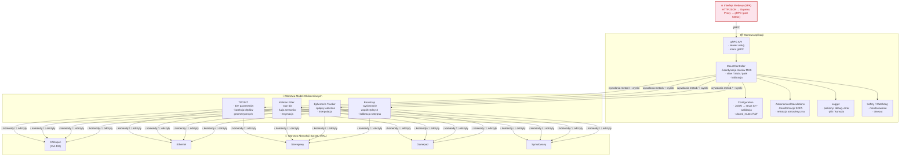
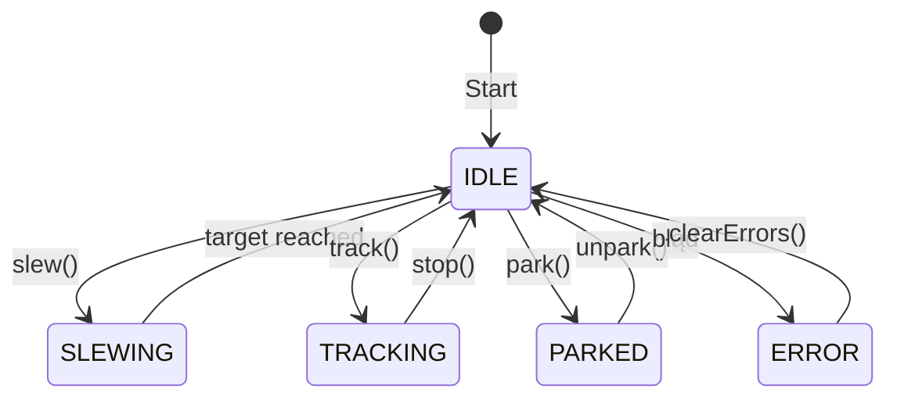
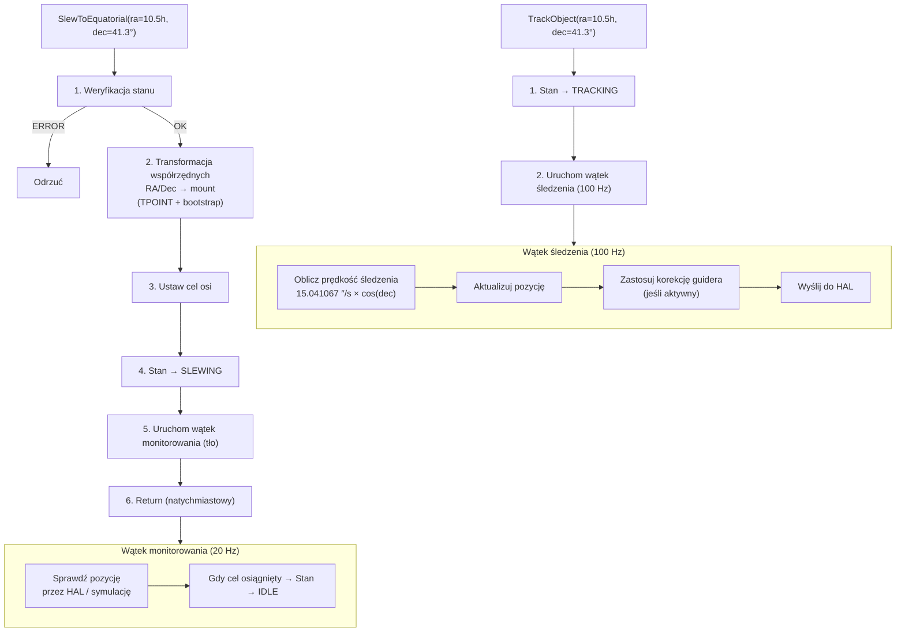
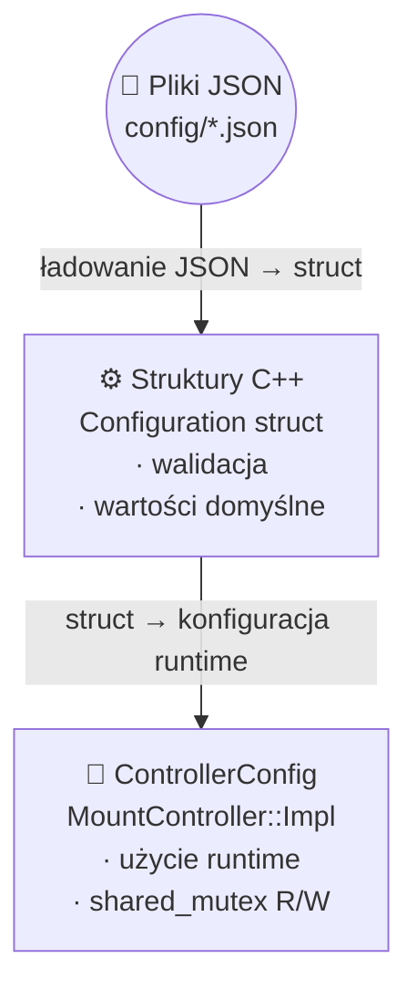

# Przewodnik dla dewelopera

## Spis treści
1. [Przegląd projektu](#1-przegląd-projektu)
2. [Konfiguracja środowiska deweloperskiego](#2-konfiguracja-środowiska-deweloperskiego)
3. [Przegląd kodu źródłowego](#3-przegląd-kodu-źródłowego)
4. [Architektura](#4-architektura)
5. [System konfiguracji](#5-system-konfiguracji)
6. [System budowania](#6-system-budowania)
7. [Testowanie](#7-testowanie)
8. [Standardy kodowania](#8-standardy-kodowania)
9. [Przepływ pracy przy zgłaszaniu zmian](#9-przepływ-pracy-przy-zgłaszaniu-zmian)
10. [Najczęstsze zadania](#10-najczęstsze-zadania)
11. [Rozwiązywanie problemów](#11-rozwiązywanie-problemów)
12. [Internacjonalizacja (i18n)](#12-internacjonalizacja-i18n)
13. [Indeks plików](#13-indeks-plików)

---

## 1. Przegląd projektu

[`astro-mount-controller`](../../) to program sterujący montażem astronomicznym napisanym w **C++17**. Zapewnia kompleksowe sterowanie montażami teleskopów, w tym:

- **Sterowanie osią**: Przesuwanie (slew), śledzenie (tracking), parkowanie
- **Modelowanie korekcyjne**: Kalibracja TPOINT i bootstrap w celu osiągnięcia dokładności wskazywania poniżej 1 sekundy kątowej
- **Efemerydy**: Śledzenie obiektów ruchomych (asteroidy, komety, satelity) poprzez interpolację danych efemerydalnych
- **Korekcja guiderem**: Wsparcie dla korekcji w czasie rzeczywistym z autoguiderów (PHD2)
- **Filtracja Kalmana**: Fuzja czujników i estymacja stanu dla płynnego śledzenia
- **API gRPC**: W pełni funkcjonalne API dla klientów zdalnych
- **Warstwa HAL**: Warstwa abstrakcji sprzętowej wspierająca wiele backendów (CANopen, symulowany, szeregowy)
- **Biblioteka SOFA**: Astronomiczne transformacje współrzędnych (IAU SOFA)

### Kluczowe metryki

| Metryka | Wartość |
|---------|---------|
| Linie kodu (C++) | ~20 000+ |
| Linie kodu (C#) | ~1 300+ |
| Pliki binarne testów | 17 |
| gRPC RPC | 50+ |
| Sprawdzenia walidacji konfiguracji | 25+ |
| Punkty ochrony NaN/Inf | 11 |
| Obsługiwane typy sprzętu | 2 (CANopen, Symulowany) + 3 planowane |
| Obsługiwane protokoły sterowników | 2 (ASCOM, INDI) |
| Czas budowania | ~3-4 minuty (Release, 4 rdzenie) |
| Definicje protobuf | ~1115 linii |
| Modele obliczeniowe | TPOINT (40+ parametrów), Kalman (6D), Efemerydy |
| Standard C++ | C++17 |

---

## 2. Konfiguracja środowiska deweloperskiego

### Minimalne wymagania

- **System operacyjny**: Ubuntu 22.04+ / Debian 12+ (zalecany), inne dystrybucje Linux, WSL2
- **Kompilator**: GCC 11+ lub Clang 14+
- **CMake**: 3.20+
- **gRPC**: 1.50+ (z włączonym protobuf)
- **Git**: Do kontroli wersji

### Instalacja zależności

```bash
# Podstawowe narzędzia deweloperskie
sudo apt update
sudo apt install build-essential cmake git

# gRPC i Protobuf
sudo apt install libgrpc-dev libgrpc++-dev protobuf-compiler-grpc \
                 libprotobuf-dev libprotoc-dev

# Biblioteki pomocnicze
sudo apt install nlohmann-json3-dev libeigen3-dev

# Zainstaluj dodatkowe narzędzia CAN (opcjonalnie, do testów sprzętowych)
sudo apt install can-utils
```

### Klonowanie i budowanie

```bash
# Sklonuj repozytorium
git clone https://github.com/twoja-organizacja/astro-mount-controller.git
cd astro-mount-controller

# Skonfiguruj build debug z testami
cmake -B build -DCMAKE_BUILD_TYPE=Debug -DBUILD_TESTING=ON

# Zbuduj projekt
cmake --build build -j$(nproc)

# Uruchom wszystkie testy
cd build && ctest --output-on-failure
```

### Zalecane narzędzia

- **Visual Studio Code** — z zalecaną konfiguracją
- **CLion** — IDE specyficzne dla CMake
- **Valgrind** — do wykrywania wycieków pamięci
- **Helgrind/DRD** — do wykrywania data races
- **GDB** — debugger

### Konfiguracja VS Code

W katalogu projektu znajduje się konfiguracja VS (`.vscode/`), która zapewnia:

```json
{
    "C_Cpp.default.configurationProvider": "ms-vscode.cmake-tools",
    "cmake.configureSettings": {
        "BUILD_TESTING": "ON",
        "CMAKE_BUILD_TYPE": "Debug"
    },
    "editor.formatOnSave": true,
    "files.associations": {
        "*.proto": "proto3"
    },
    "editor.rulers": [100]
}
```

**Zalecane rozszerzenia VS Code:**

| Rozszerzenie | ID | Cel |
|-------------|-----|------|
| C/C++ | ms-vscode.cpptools | IntelliSense, debugowanie |
| CMake Tools | ms-vscode.cmake-tools | Integracja CMake |
| protobuf | zxh404.vscode-proto3 | Podświetlanie składni Proto |
| clangd | llvm-vs-code.clangd | Linting (opcjonalnie) |
| Test Explorer | hbenl.vscode-test-explorer | Uruchamianie testów |

---

## 3. Przegląd kodu źródłowego

### Struktura katalogów

```
astro-mount-controller/
├── config/                 # Pliki konfiguracyjne JSON
├── docs/                   # Dokumentacja
│   ├── en/                 #   Dokumentacja w języku angielskim
│   └── pl/                 #   Dokumentacja w języku polskim
├── include/                # Pliki nagłówkowe
│   ├── config/             #   System konfiguracji
│   ├── controllers/        #   Sterowniki (MountController, DerotatorController)
│   ├── core/               #   Obliczenia astronomiczne
│   ├── hal/                #   Interfejsy warstwy abstrakcji sprzętowej
│   └── models/             #   Modele (TPOINT, Kalman, Efemerydy)
├── proto/                  # Definicje protobuf
├── scripts/                # Skrypty pomocnicze
├── sofa/                   # Źródła biblioteki SOFA (IAU)
├── src/                    # Pliki źródłowe
│   ├── api/                #   Serwer gRPC i implementacja usług
│   ├── config/             #   Ładowanie konfiguracji
│   ├── controllers/        #   Implementacja sterowników
│   ├── core/               #   Obliczenia astronomiczne
│   ├── hal/                #   Implementacje HAL
│   │   ├── canopen_hal/    #     Implementacja CANopen
│   │   ├── ethernet_hal/   #     Implementacja Ethernet
│   │   ├── gamepad_hal/    #     Implementacja gamepada
│   │   ├── serial_hal/     #     Implementacja szeregowa
│   │   └── simulated_hal/  #     Implementacja symulowana
│   ├── logging/            #   System logowania
│   └── models/             #   Implementacje modeli
├── ascom/                  # Sterownik teleskopu ASCOM (C#)
├── ascom_rotator/          # Sterownik rotatora ASCOM (C#)
├── indi/                   # Sterownik teleskopu INDI (C++)
├── indi_rotator/           # Sterownik rotatora INDI (C++)
├── tests/                  # Testy jednostkowe (17 binarek)
├── web/                    # Interfejs WWW (serwer proxy Express + SPA)
└── CMakeLists.txt          # Główny plik CMake
```

### Kluczowe pliki do zapoznania

| Plik | Linie | Opis |
|------|-------|------|
| [`include/controllers/mount_controller.h`](../../include/controllers/mount_controller.h) | 930 | Główna klasa kontrolera (interfejs publiczny) |
| [`src/controllers/mount_controller.cpp`](../../src/controllers/mount_controller.cpp) | 5547 | Logika kontrolera (najważniejszy plik) |
| [`include/controllers/derotator_controller.h`](../../include/controllers/derotator_controller.h) | 224 | Interfejs DerotatorController (HomingMethod, RotationMode) |
| [`src/controllers/derotator_controller.cpp`](../../src/controllers/derotator_controller.cpp) | 858 | Samodzielny kontroler derotatora (homing, rotacja pola) |
| [`include/controllers/icanopen_interface.h`](../../include/controllers/icanopen_interface.h) | ~150 | Interfejs komunikacji CANopen |
| [`include/config/configuration.h`](../../include/config/configuration.h) | 428 | Struktury konfiguracyjne |
| [`include/models/tpoint_model.h`](../../include/models/tpoint_model.h) | ~100 | Model korekcji TPOINT |
| [`include/models/kalman_filter.h`](../../include/models/kalman_filter.h) | ~80 | Filtr Kalmana |
| [`include/models/ephemeris_tracker.h`](../../include/models/ephemeris_tracker.h) | ~120 | Śledzenie efemeryd |
| [`proto/mount_controller.proto`](../../proto/mount_controller.proto) | 1115 | Definicja API gRPC |
| [`include/hal/hal_interface.h`](../../include/hal/hal_interface.h) | ~60 | Główny interfejs HAL |
| [`src/main.cpp`](../../src/main.cpp) | 304 | Punkt wejścia aplikacji |
| [`ascom/AstroMountTelescope.cs`](../../ascom/AstroMountTelescope.cs) | 892 | Sterownik teleskopu ASCOM (ITelescopeV3) |
| [`ascom/GrpcClient.cs`](../../ascom/GrpcClient.cs) | 378 | Klient gRPC dla ASCOM (C#) |
| [`ascom_rotator/AstroMountRotator.cs`](../../ascom_rotator/AstroMountRotator.cs) | — | Sterownik rotatora ASCOM (IRotatorV3) |
| [`indi/astro_mount_driver.cpp`](../../indi/astro_mount_driver.cpp) | 715 | Sterownik teleskopu INDI (C++) |
| [`indi/astro_mount_rotator_driver.cpp`](../../indi_rotator/astro_mount_rotator_driver.cpp) | — | Sterownik rotatora INDI (C++) |

---

## 4. Architektura

### Architektura trójwarstwowa

System jest zorganizowany w trzech głównych warstwach:



### Odpowiedzialności komponentów

| Komponent | Odpowiedzialność |
|-----------|-----------------|
| `MountController` | Koordynacja wysokiego poziomu: stany, transformacje, kalibracja |
| `DerotatorController` | Samodzielne sterowanie derotatorem — homing, rotacja pola, własny wątek |
| `TPointModel` | Modelowanie błędów geometrycznych i korekcja (do 40+ parametrów) |
| `KalmanFilter` | Estymacja stanu, redukcja szumów, fuzja czujników |
| `EphemerisTracker` | Interpolacja efemeryd i śledzenie obiektów ruchomych |
| `ICanOpenInterface` | Abstrakcja komunikacji z napędami CANopen (CiA 402) |
| `HALInterface` | Abstrakcja sprzętu niskiego poziomu (silniki, enkodery, bezpieczeństwo) |
| `Configuration` | Ładowanie, walidacja i udostępnianie konfiguracji |
| `AstronomicalCalculations` | Transformacje współrzędnych przez SOFA |
| `AstroMountTelescope` (C#) | Sterownik ASCOM ITelescopeV3 — proxy gRPC |
| `AstroMountRotator` (C#) | Sterownik ASCOM IRotatorV3 — proxy gRPC |
| `AstroMountIndiDriver` (C++) | Sterownik INDI Telescope — backend gRPC |
| `AstroMountRotatorIndi` (C++) | Sterownik INDI Rotator — backend gRPC |

### Maszyna stanów



### Kluczowy przepływ danych (Slew → Track)



---

## 5. System konfiguracji

### Konfiguracja trójwarstwowa



### Dodawanie nowego parametru konfiguracji

```cpp
// 1. Dodaj do MountConfig w include/config/configuration.h
struct MountConfig {
    // ... istniejące pola ...
    double new_parameter{default_value};  // Twój nowy parametr
};

// 2. Dodaj ładowanie JSON w src/config/configuration.cpp
void from_json(const nlohmann::json& j, MountConfig& c) {
    // ... istniejący kod ...
    j.at("mount").value("new_parameter", c.new_parameter, 42.0);
}

// 3. Użyj w MountController::Impl
void someMethod() {
    std::shared_lock lock(config_mutex_);
    double val = config_.new_parameter;
    // ...
}
```

### Przykład walidacji

```cpp
// W src/config/configuration.cpp
bool validateMountConfig(const MountConfig& config) {
    if (config.latitude < -90.0 || config.latitude > 90.0) {
        logger_->error("Latitude out of range: {}", config.latitude);
        return false;
    }
    if (config.max_slew_rate <= 0.0 || config.max_slew_rate > 10.0) {
        logger_->error("Invalid max slew rate: {}", config.max_slew_rate);
        return false;
    }
    // ... więcej walidacji ...
    return true;
}
```

---

## 6. System budowania

### Cele budowania

#### Główna aplikacja

| Cel CMake | Opis |
|-----------|------|
| `astro_mount_controller` | Główny plik wykonywalny |
| `astro_object_database_server` | Serwer bazy danych astronomicznych |

#### Sterowniki INDI

| Cel CMake | Opis |
|-----------|------|
| `astro_mount_driver` | Sterownik teleskopu INDI |
| `astro_mount_rotator_driver` | Sterownik rotatora INDI |

#### Sterowniki ASCOM (C#)

| Cel | Opis |
|-----|------|
| `ascom/AstroMountTelescope.cs` | Sterownik ASCOM ITelescopeV3 (buduj przez `dotnet build ascom/`) |
| `ascom_rotator/AstroMountRotator.cs` | Sterownik ASCOM IRotatorV3 (buduj przez `dotnet build ascom_rotator/`) |

#### Pliki binarne testów

| Cel CMake | Opis |
|-----------|------|
| `test_mount_controller` | Testy kontrolera (25 grup) |
| `test_tpoint_model` | Testy modelu TPOINT (17 przypadków) |
| `test_configuration` | Testy walidacji konfiguracji |
| `test_kalman_filter` | Testy filtru Kalmana |
| `test_ephemeris_tracker` | Testy śledzenia efemeryd |
| `test_hal_integration` | Testy integracyjne HAL |
| `test_grpc_integration` | Testy serwera gRPC |
| `test_subarcsecond_accuracy` | Testy dokładności poniżej sekundy kątowej |
| `test_astronomical_calculations` | Testy obliczeń astronomicznych |
| `test_canopen_factory` | Testy fabryki CANopen |
| `test_canopen_hal` | Testy komunikacji CANopen |
| `test_config_monitor` | Testy monitorowania konfiguracji |
| `test_ethernet_hal` | Testy Ethernet HAL |
| `test_gamepad_hal` | Testy Gamepad HAL |
| `test_logger` | Testy loggera |
| `test_serial_hal` | Testy Serial HAL |
| `test_canopen_wrapper` | Testy wrappera CANopen |
| `grpc_generate` | Generowanie kodu gRPC/protobuf |

### Typowe komendy

```bash
# Pełny build debug z testami
cmake -B build -DCMAKE_BUILD_TYPE=Debug -DBUILD_TESTING=ON
cmake --build build -j$(nproc)

# Zbuduj i uruchom konkretny test
cmake --build build --target test_mount_controller -j$(nproc)
./build/tests/test_mount_controller

# Build release do testów wydajnościowych
cmake -B build_release -DCMAKE_BUILD_TYPE=Release
cmake --build build_release -j$(nproc)
```

### Struktura CMakeLists.txt

Główny [`CMakeLists.txt`](../../CMakeLists.txt) definiuje:
1. Wymagany standard C++ (C++17)
2. Znajdowanie pakietów (gRPC, Protobuf, nlohmann-json, Eigen3)
3. Generator kodu protobuf
4. Cele bibliotek dla komponentów
5. Główny cel wykonywalny
6. Cele testowe (jeśli BUILD_TESTING=ON)

---

## 7. Testowanie

### Architektura testów

- **Framework**: Google Test (gtest)
- **Katalog**: [`tests/`](../../tests/)
- **Pokrycie**: Testy jednostkowe dla każdego głównego komponentu

```cpp
// Przykład testu (tests/test_mount_controller.cpp)
TEST(MountControllerTest, SlewToEquatorial) {
    auto controller = createTestController();
    
    bool result = controller->SlewToEquatorial(10.5, 41.3);
    EXPECT_TRUE(result);
    
    auto state = controller->GetState();
    EXPECT_EQ(state.status(), MountStatus::SLEWING);
    
    // Symuluj zakończenie ruchu
    simulateSlewCompletion(controller);
    
    state = controller->GetState();
    EXPECT_EQ(state.status(), MountStatus::IDLE);
}
```

### Uruchamianie testów

```bash
# Uruchom wszystkie testy
cd build && ctest --output-on-failure

# Uruchom z verbose output
cd build && ctest -V

# Uruchom konkretny test
cd build && ./tests/test_mount_controller
```

### Kategorie testów

| Kategoria | Pliki | Cel |
|-----------|-------|------|
| Jednostkowe | `test_*.cpp` | Izolowane testy komponentów |
| Integracyjne | `test_hal_integration.cpp` | Współdziałanie komponentów |
| gRPC | `test_grpc_integration.cpp` | Testy API |
| Dokładność | `test_subarcsecond_accuracy.cpp` | Weryfikacja precyzji |

### Pisanie testów

```cpp
// 1. Użyj TEST() dla prostych przypadków
TEST(ConfigurationTest, LoadValidConfig) {
    Configuration config;
    EXPECT_TRUE(config.loadFromFile("config/test_config.json"));
    EXPECT_DOUBLE_EQ(config.getMountConfig().latitude, 52.0);
}

// 2. Użyj TEST_F() dla stanu współdzielonego
class MountControllerTest : public ::testing::Test {
protected:
    void SetUp() override {
        controller_ = createTestController();
    }
    std::unique_ptr<MountController> controller_;
};

TEST_F(MountControllerTest, StateTransitions) {
    EXPECT_EQ(controller_->GetState().status(), MountStatus::IDLE);
    controller_->SlewToEquatorial(10.5, 41.3);
    EXPECT_EQ(controller_->GetState().status(), MountStatus::SLEWING);
}
```

---

## 8. Standardy kodowania

### Styl C++

- **Standard**: C++17
- **Nazewnictwo**: `camelCase` dla metod, `snake_case` dla zmiennych, `PascalCase` dla klas
- **Nagłówki**: `#pragma once` zamiast include guards
- **Stałe**: `constexpr` tam, gdzie to możliwe
- **Interfejsy**: Klasy wirtualne z `= default` destruktorem
- **Wskaźniki**: `std::unique_ptr` jako domyślny, `std::shared_ptr` dla własności współdzielonej

### Organizacja plików

```cpp
// Przykład: include/controllers/mount_controller.h
#pragma once

#include <memory>
#include <string>

namespace astro_mount {
namespace controllers {

class MountController {
public:
    MountController();
    ~MountController();
    
    // Metody publiczne (API)
    bool initialize(const std::string& config_path);
    bool slewToEquatorial(double ra_hours, double dec_degrees);
    // ...
    
private:
    class Impl;                          // PIMPL
    std::unique_ptr<Impl> pimpl_;        // Wskaźnik do implementacji
};

} // namespace controllers
} // namespace astro_mount
```

### Obsługa błędów

- Użyj wartości zwracanych `bool` dla operacji, które mogą się nie powieść
- Rzucaj wyjątki tylko dla błędów krytycznych (konstruktory, inicjalizacja)
- Loguj błędy przez centralny `Logger`
- Użyj `std::optional` dla wartości, które mogą nie istnieć

### Wzorzec guardów NaN/Inf

```cpp
// Wzorzec do ochrony przed NaN/Inf w obliczeniach
double safeDivide(double numerator, double denominator) {
    if (std::abs(denominator) < 1e-15) {
        logger_->warn("Division by near-zero in safeDivide: {}", denominator);
        return 0.0;
    }
    double result = numerator / denominator;
    if (!std::isfinite(result)) {
        logger_->error("Non-finite result in safeDivide: {} / {}", numerator, denominator);
        return 0.0;
    }
    return result;
}

// Użycie w obliczeniach
double rate = safeDivide(tracking_error, cos(dec_radians));
```

### Bezpieczeństwo wątkowe

- Użyj `std::mutex` + `std::lock_guard` dla krótkich sekcji krytycznych
- Użyj `std::shared_mutex` dla częstych odczytów / rzadkich zapisów
- Użyj `std::atomic` dla prostych flag
- NIGDY nie trzymaj muteksu podczas wywoływania callbacków

---

## 9. Przepływ pracy przy zgłaszaniu zmian

### Krok 1: Zrozum kod

1. Przeczytaj odpowiednie pliki dokumentacji w [`docs/`](../../docs/)
2. Przejrzyj pliki nagłówkowe w [`include/`](../../include/)
3. Zapoznaj się z implementacją w [`src/`](../../src/)
4. Przejrzyj istniejące testy w [`tests/`](../../tests/)

### Krok 2: Sklonuj i zbuduj

```bash
# Fork i clone
git clone https://github.com/twoja-organizacja/astro-mount-controller.git
cd astro-mount-controller

# Build
cmake -B build -DBUILD_TESTING=ON
cmake --build build -j$(nproc)

# Zweryfikuj, że testy przechodzą
cd build && ctest --output-on-failure
```

### Krok 3: Wprowadź zmiany

1. Utwórz gałąź funkcji: `git checkout -b feature/twoja-funkcja`
2. Wprowadź zmiany, przestrzegając standardów kodowania
3. Dodaj/aktualizuj testy
4. Uruchom testy lokalnie
5. Zaktualizuj dokumentację

### Krok 4: Commit i PR

```bash
# Commit z opisowym komunikatem
git add .
git commit -m "feat: dodaj wsparcie dla nowego typu montażu

- Zaimplementowano obsługę montażu alt-azymutalnego
- Dodano transformacje współrzędnych dla alt-az
- Zaktualizowano dokumentację API
- Dodano testy dla nowego typu montażu

Closes #123"
```

```bash
# Push i utwórz PR
git push origin feature/twoja-funkcja
```

### Konwencja komunikatów commit

```
<type>: <krótki opis>

<szczegółowy opis (opcjonalnie)>

<referencje do issue (opcjonalnie)>
```

Typy: `feat`, `fix`, `docs`, `test`, `refactor`, `perf`, `chore`

---

## 10. Najczęstsze zadania

### Dodawanie nowego RPC gRPC

1. **Dodaj definicję protobuf** w [`proto/mount_controller.proto`](../../proto/mount_controller.proto):
   ```protobuf
   rpc MyNewRPC(MyRequest) returns (MyResponse);
   message MyRequest { string param = 1; }
   message MyResponse { bool success = 1; }
   ```
2. **Zgeneruj kod**: `cmake --build build`
3. **Zaimplementuj RPC** w [`src/api/service_impl.cpp`](../../src/api/service_impl.cpp):
   ```cpp
   grpc::Status MountControllerServiceImpl::MyNewRPC(
       grpc::ServerContext* context,
       const MyRequest* request,
       MyResponse* response) {
       // logika
       return grpc::Status::OK;
   }
   ```
4. **Dodaj test** w [`tests/test_grpc_integration.cpp`](../../tests/test_grpc_integration.cpp)

### Dodawanie nowej implementacji HAL

1. **Utwórz nowy katalog**: `src/hal/new_hal/`
2. **Zaimplementuj interfejsy**: `HALInterface`, `MotorControl`, `EncoderReader`
3. **Dodaj do fabryki HAL**: [`src/hal/hal_factory.cpp`](../../src/hal/hal_factory.cpp)
4. **Dodaj testy**: np. `tests/test_new_hal.cpp`

### Modyfikacja konfiguracji

1. **Dodaj pole** do struktury w [`include/config/configuration.h`](../../include/config/configuration.h)
2. **Dodaj ładowanie JSON** w [`src/config/configuration.cpp`](../../src/config/configuration.cpp)
3. **Dodaj walidację** w funkcji walidującej
4. **Użyj** w `MountController::Impl` z ochroną `shared_mutex`

### Dodawanie guardów NaN/Inf

Podczas dodawania nowych obliczeń matematycznych:

```cpp
double calculateSomething(double input) {
    // Guard na wejściu
    if (!std::isfinite(input)) {
        logger_->error("Invalid input in calculateSomething: {}", input);
        return 0.0;
    }
    
    double result = /* ... obliczenia ... */;
    
    // Guard na wyjściu
    if (!std::isfinite(result)) {
        logger_->error("Non-finite result in calculateSomething");
        return 0.0;
    }
    
    return result;
}
```

---

## 11. Rozwiązywanie problemów

### Problemy z budowaniem

| Problem | Rozwiązanie |
|---------|-------------|
| Brak gRPC/protobuf | `sudo apt install libgrpc-dev libprotobuf-dev protobuf-compiler-grpc` |
| Błąd: `nlohmann/json.hpp` not found | `sudo apt install nlohmann-json3-dev` |
| Błąd linkowania z SOFA | Sprawdź, czy katalog `sofa/` zawiera wszystkie pliki `.c` |
| Błąd: `Eigen3 not found` | `sudo apt install libeigen3-dev` |

### Problemy runtime

| Problem | Diagnoza | Rozwiązanie |
|---------|----------|-------------|
| Kontroler nie startuje | Sprawdź logi: `./build/astro_mount_controller --log-level debug` | Popraw konfigurację |
| Błąd kalibracji TPOINT | Sprawdź liczbę pomiarów | Minimum N pomiarów dla N parametrów |
| Śledzenie nie działa | Sprawdź, czy kontroler jest w stanie TRACKING | Wywołaj `TrackObject()` po `SlewToEquatorial()` |
| gRPC connection refused | Sprawdź, czy serwer jest uruchomiony | `grpcurl -plaintext localhost:50051 list` |

### Logowanie

```cpp
// Poziomy logowania: trace, debug, info, warn, error

Logger::getInstance().info("MountController initialized");
Logger::getInstance().debug("Position: RA={}, Dec={}", ra, dec);
Logger::getInstance().error("Calibration failed: {}", error_message);
```

```bash
# Uruchom z verbose logging
./build/astro_mount_controller --log-level debug

# Zobacz logi
tail -f /var/log/astro_mount_controller.log
```

---

## 12. Internacjonalizacja (i18n)

### Przegląd

Interfejs webowy obsługuje wiele języków poprzez lekki system i18n zaimplementowany w [`web/public/js/i18n.js`](../../web/public/js/i18n.js). Obecnie obsługiwane języki:

| Kod | Język | Status |
|-----|-------|--------|
| `en` | Angielski (English) | ✅ Kompletny |
| `pl` | Polski | ✅ Kompletny |

System używa **atrybutów danych** na elementach DOM (`data-i18n`, `data-i18n-title`, `data-i18n-placeholder`, `data-i18n-aria`) oraz **funkcji `t(klucz)`** dla dynamicznego tekstu w JavaScript. Preferencja językowa jest przechowywana w `localStorage` pod kluczem `ui-lang`.

### Architektura

```
i18n.js
├── dict.en  → Słownik angielski (200+ kluczy)
├── dict.pl  → Słownik polski (200+ kluczy)
├── init()           → Wczytuje zapisany język, auto-detekcja języka przeglądarki, nakłada tłumaczenia
├── t(klucz, param)  → Pobiera tłumaczenie po kluczu, z opcjonalnym podstawieniem {param}
├── setLang(język)   → Przełącza na 'en' lub 'pl', zapisuje, ponownie nakłada tłumaczenia
├── toggleLang()     → Przełącza między 'en' ↔ 'pl'
└── applyTranslations() → Skanuje DOM w poszukiwaniu atrybutów data-i18n i aktualizuje tekst
```

### Jak przetłumaczyć nowy element HTML

1. Dodaj atrybut `data-i18n` do elementu z unikalnym kluczem:

```html
<!-- Przed -->
<span class="tab-label">Status</span>

<!-- Po -->
<span class="tab-label" data-i18n="tab.status">Status</span>
```

2. Dodaj klucz do obu słowników w [`i18n.js`](../../web/public/js/i18n.js):

```javascript
// dict.en
'tab.status': 'Status',

// dict.pl
'tab.status': 'Status',
```

Oryginalna zawartość tekstowa służy jako fallback dla angielskiego — jest zastępowana w czasie działania przez `applyTranslations()`.

### Obsługiwane atrybuty danych

| Atrybut | Przeznaczenie | Przykład |
|---------|--------------|----------|
| `data-i18n` | Zastępuje `textContent` | `<span data-i18n="tab.control">Sterowanie</span>` |
| `data-i18n-title` | Zastępuje atrybut `title` | `<button data-i18n-title="db.slew_title">...</button>` |
| `data-i18n-placeholder` | Zastępuje atrybut `placeholder` | `<input data-i18n-placeholder="db.search_placeholder">` |
| `data-i18n-aria` | Zastępuje atrybut `aria-label` | `<button data-i18n-aria="fullscreen.enter">...</button>` |

### Używanie `t()` w JavaScript

Dla dynamicznie generowanego tekstu (komunikaty toast, aktualizacje statusu itp.) użyj funkcji `I18n.t()`:

```javascript
// Proste tłumaczenie
App.showToast(I18n.t('cal.run_bootstrap'));

// Z podstawieniem parametrów
const text = I18n.t('db.page_of', { page: 3, total: 10 });
// → "Strona 3 z 10" (pl) lub "Page 3 of 10" (en)
```

### Dodawanie nowego języka

Wykonaj poniższe kroki aby dodać trzeci język (np. niemiecki, francuski, hiszpański):

#### Krok 1: Dodaj kod języka

W [`i18n.js`](../../web/public/js/i18n.js) dodaj nowy kod do tablicy `SUPPORTED` (linia ~16):

```javascript
const SUPPORTED = ['en', 'pl', 'de'];  // Dodano 'de'
```

#### Krok 2: Utwórz słownik tłumaczeń

Dodaj nowy blok `dict.XX` w obiekcie `dict`:

```javascript
const dict = {
  en: { /* ... istniejący ... */ },
  pl: { /* ... istniejący ... */ },
  de: {
    // Skopiuj wszystkie klucze z dict.en i przetłumacz wartości
    'app.title': 'Mount Control',  // Zachowaj lub przetłumacz
    'tab.status': 'Status',
    'tab.control': 'Steuerung',
    'tab.settings': 'Einstellungen',
    // ... przetłumacz wszystkie 200+ kluczy ...
    'lang.switch_to': 'EN',        // Co pokazywać gdy niemiecki jest aktywny
    'lang.title': 'Auf Englisch umschalten',
  }
};
```

> **Wskazówka:** Zacznij od skopiowania całego bloku `dict.en`, a następnie przetłumacz każdą wartość. Klucze muszą być dokładnie takie same — system używa angielskiego fallbacku dla brakujących kluczy.

#### Krok 3: Zaktualizuj logikę przełącznika języka

Jeśli dodajesz więcej niż 2 języki, zastąp `toggleLang()` mechanizmem cyklicznym lub listą rozwijaną. Dla 2 języków obecny przełącznik jest wystarczający.

#### Krok 4: Testuj

- Wyczyść `localStorage` (lub ustaw `ui-lang` na nowy kod)
- Odśwież stronę — interfejs powinien wyrenderować się w nowym języku
- Kliknij przełącznik języka aby sprawdzić czy zmiana działa
- Sprawdź nieprzetłumaczone ciągi (będą pokazywać angielski fallback)

### Konwencja nazewnictwa kluczy tłumaczeń

Klucze używają hierarchicznego wzorca z kropkami:

| Prefiks | Zakres |
|---------|--------|
| `tab.*` | Etykiety nawigacji zakładek |
| `card.*` | Tytuły kart |
| `btn.*` | Etykiety przycisków |
| `slew.*` | Formularz sterowania slewingiem |
| `axis.*` | Panel sterowania osiami |
| `cal.*` | Panel kalibracji (bootstrap + TPOINT) |
| `db.*` | Panel bazy danych |
| `tests.*` | Panel Testy/Debug |
| `settings.*` | Panel ustawień |
| `logs.*` | Panel logowania |
| `status.*` | Teksty zastępcze panelu statusu |
| `lang.*` | Sam przełącznik języka |
| `fullscreen.*` | Przełącznik pełnego ekranu |
| `theme.*` | Przełącznik motywu |
| `conn.*` | Wskaźniki połączenia |

### Zachowanie w czasie działania

- Przy pierwszym załadowaniu `I18n.init()` sprawdza `localStorage.ui-lang` → jeśli brak, używa `navigator.language` przeglądarki → domyślnie `'en'`
- `applyTranslations()` skanuje cały DOM w poszukiwaniu elementów `[data-i18n]` i zastępuje ich `textContent`
- `setLang()` zapisuje wybór i natychmiast ponownie nakłada wszystkie tłumaczenia
- Elementy dodane dynamicznie po `init()` muszą być ponownie przetłumaczone przez wywołanie `I18n.applyTranslations()` (lub przez użycie `I18n.t()` bezpośrednio podczas ich tworzenia)

---

## 13. Indeks plików

### Kluczowe pliki nagłówkowe

| Plik | Opis |
|------|------|
| [`include/controllers/mount_controller.h`](../../include/controllers/mount_controller.h) | Główna klasa kontrolera, `ControllerConfig`, `MountStatus` |
| [`include/controllers/derotator_controller.h`](../../include/controllers/derotator_controller.h) | `DerotatorController`, `HomingMethod`, `RotationMode`, `DerotatorStatus` |
| [`include/controllers/icanopen_interface.h`](../../include/controllers/icanopen_interface.h) | Interfejs CANopen |
| [`include/config/configuration.h`](../../include/config/configuration.h) | Wszystkie struktury konfiguracji: `MountConfig`, `GuiderConfig`, `KalmanConfig`, `TPointConfig`, `DerotatorConfig`, `FieldRotationParams` |
| [`include/core/astronomical_calculations.h`](../../include/core/astronomical_calculations.h) | Obliczenia astronomiczne |
| [`include/models/tpoint_model.h`](../../include/models/tpoint_model.h) | Model TPOINT |
| [`include/models/kalman_filter.h`](../../include/models/kalman_filter.h) | Filtr Kalmana |
| [`include/models/ephemeris_tracker.h`](../../include/models/ephemeris_tracker.h) | Śledzenie efemeryd |
| [`include/hal/hal_interface.h`](../../include/hal/hal_interface.h) | Główny interfejs HAL |
| [`include/hal/motor_control.h`](../../include/hal/motor_control.h) | Interfejs sterowania silnikiem |
| [`include/hal/encoder_reader.h`](../../include/hal/encoder_reader.h) | Interfejs odczytu enkodera |
| [`include/hal/safety_monitor.h`](../../include/hal/safety_monitor.h) | Monitor bezpieczeństwa |
| [`include/hal/sensor_interface.h`](../../include/hal/sensor_interface.h) | Interfejs czujników |
| [`include/hal/hal_factory.h`](../../include/hal/hal_factory.h) | Fabryka HAL |
| [`include/hal/hal_config.h`](../../include/hal/hal_config.h) | Konfiguracja HAL |
| [`indi/MountGrpcClient.h`](../../indi/MountGrpcClient.h) | Klient gRPC C++ dla sterowników INDI |

### Kluczowe pliki źródłowe

| Plik | Linie | Opis |
|------|-------|------|
| [`src/main.cpp`](../../src/main.cpp) | 304 | Punkt wejścia, konfiguracja, główna pętla |
| [`src/controllers/mount_controller.cpp`](../../src/controllers/mount_controller.cpp) | 5547 | Logika kontrolera (maszyna stanów, tracking, meridian flip, miękkie limity) |
| [`src/controllers/derotator_controller.cpp`](../../src/controllers/derotator_controller.cpp) | 858 | Samodzielny kontroler derotatora |
| [`src/controllers/canopen_interface.cpp`](../../src/controllers/canopen_interface.cpp) | ~800 | Komunikacja CANopen |
| [`src/controllers/canopen_factory.cpp`](../../src/controllers/canopen_factory.cpp) | ~100 | Fabryka CANopen |
| [`src/config/configuration.cpp`](../../src/config/configuration.cpp) | 1185 | Ładowanie konfiguracji, walidacja, wartości domyślne |
| [`src/core/astronomical_calculations.cpp`](../../src/core/astronomical_calculations.cpp) | ~500 | Obliczenia astronomiczne |
| [`src/models/tpoint_model.cpp`](../../src/models/tpoint_model.cpp) | ~400 | Implementacja TPOINT |
| [`src/models/kalman_filter.cpp`](../../src/models/kalman_filter.cpp) | ~300 | Implementacja filtru Kalmana |
| [`src/models/ephemeris_tracker.cpp`](../../src/models/ephemeris_tracker.cpp) | ~400 | Implementacja śledzenia efemeryd |
| [`src/api/service_impl.cpp`](../../src/api/service_impl.cpp) | ~800 | Implementacja usług gRPC |
| [`src/api/grpc_server.cpp`](../../src/api/grpc_server.cpp) | ~100 | Serwer gRPC |
| [`src/hal/hal_factory.cpp`](../../src/hal/hal_factory.cpp) | ~100 | Fabryka HAL |
| [`src/hal/canopen_hal/canopen_hal.cpp`](../../src/hal/canopen_hal/canopen_hal.cpp) | 1845 | Implementacja CANopenHAL (CiA 402, PDO, PID) |
| [`src/hal/simulated_hal/simulated_hal.cpp`](../../src/hal/simulated_hal/simulated_hal.cpp) | ~400 | Implementacja SimulatedHAL |
| [`ascom/AstroMountTelescope.cs`](../../ascom/AstroMountTelescope.cs) | 892 | Sterownik ASCOM ITelescopeV3 |
| [`ascom/GrpcClient.cs`](../../ascom/GrpcClient.cs) | 378 | Klient gRPC C# |
| [`indi/astro_mount_driver.cpp`](../../indi/astro_mount_driver.cpp) | 715 | Sterownik INDI Telescope (C++) |

### Kluczowe komunikaty protobuf

| Komunikat | Linia w proto | Opis |
|-----------|---------------|------|
| `Coordinates` | 9 | Współrzędne astronomiczne z ruchem własnym, paralaksą, ID katalogów |
| `MountPosition` | 88 | Pozycja montażu (RA/Dec, Alt/Az) |
| `RotationMatrix` | 98 | Macierz rotacji (kwaternion) |
| `TrajectoryParams` | 116 | Parametry generowania trajektorii |
| `TPointParameters` | 107 | Parametry modelu TPOINT |
| `MountStatus` | 122 | Stan montażu (SLEWING, TRACKING, etc.) |
| `TrackedObject` | 141 | Śledzony obiekt |
| `ControllerState` | 198 | Pełny stan kontrolera |
| `PolePosition` | 240 | Pozycja bieguna |
| `AxisControlRequest` | 268 | Żądanie sterowania osią |
| `AxisStatus` | 289 | Status osi |
| `EphemerisData` | 309 | Dane efemeryd |
| `Measurement` | 340 | Pomiar kalibracyjny |
| `GuiderConfig` | 370 | Konfiguracja guidera |
| `HALConfigRequest` | 416 | Żądanie konfiguracji HAL |
| `PoleDeterminationRequest` | 447 | Żądanie wyznaczenia bieguna |
| `AxisPhysicalParameters` | 479 | Parametry fizyczne osi |
| `Configuration` | 520 | Pełna konfiguracja systemu (49 pól) |
| `HealthCheckRequest` | 580 | Żądanie health check |
| `SystemMetrics` | 600 | Metryki systemowe |
| `EphemerisData` | 689 | Dane efemeryd dla obiektów ruchomych |
| `FieldRotationControlRequest` | 787 | Sterowanie trybem rotacji pola i parametrami |
| `DerotatorHomingRequest` | 810 | Wybór metody homingu derotatora |
| `DerotatorConfig` | 825 | Konfiguracja sprzętowa derotatora |
| `HALConfig` | 1063 | Pełna konfiguracja HAL |
