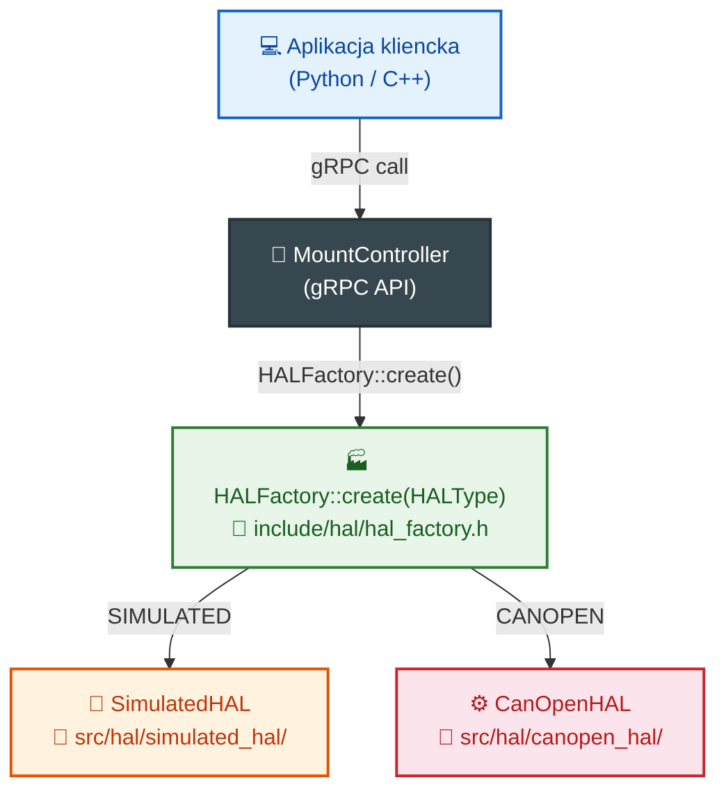

# Testowanie i uruchamianie kontrolera montażu

> Dokument opisuje sposoby testowania i uruchamiania kontrolera montażu zarówno w środowisku w pełni symulowanym, jak i z rzeczywistymi urządzeniami CANopen.

---

## Spis treści

1. [Wprowadzenie](#1-wprowadzenie)
2. [Tryby uruchomienia](#2-tryby-uruchomienia)
3. [Budowanie projektu](#3-budowanie-projektu)
4. [Uruchomienie z symulacją (brak sprzętu)](#4-uruchomienie-z-symulacją-brak-sprzętu)
5. [Uruchomienie z rzeczywistym CANopen](#5-uruchomienie-z-rzeczywistym-canopen)
6. [Konfiguracja dla poszczególnych trybów](#6-konfiguracja-dla-poszczególnych-trybów)
7. [Testy jednostkowe i integracyjne](#7-testy-jednostkowe-i-integracyjne)
8. [Testy akceptacyjne z symulacją](#8-testy-akceptacyjne-z-symulacją)
9. [Testy z rzeczywistym sprzętem](#9-testy-z-rzeczywistym-sprzętem)
10. [Weryfikacja poprawności działania](#10-weryfikacja-poprawności-działania)
11. [Najczęstsze problemy i rozwiązania](#11-najczęstsze-problemy-i-rozwiązania)

---

## 1. Wprowadzenie

Kontroler montażu [`MountController`](../../src/controllers/mount_controller.cpp:1) może pracować w dwóch głównych trybach w zależności od dostępności sprzętu:

| Tryb | Opis | Wymagany sprzęt |
|------|------|-----------------|
| **Symulowany (SIMULATED)** | W pełni emulowane sterowanie — silniki, enkodery, czujniki | ❌ Żaden |
| **Rzeczywisty (CANopen)** | Sterowanie prawdziwymi napędami przez magistralę CAN | ✅ Karta CAN + napędy |

Oba tryby korzystają z tej samej warstwy HAL ([`HALInterface`](../../include/hal/hal_interface.h:1)), co oznacza, że aplikacja kliencka nie wymaga zmian — wystarczy podmiana konfiguracji.

---

## 2. Tryby uruchomienia

### 2.1 Architektura wyboru HAL



### 2.2 Sposoby przełączania trybów

1. **Przez plik konfiguracyjny** ([`default.json`](../../config/default.json:169)):
   ```json
   "hal": {
       "interface_type": "SIMULATED",   // lub "CANopen"
       ...
   }
   ```

2. **Programowo przez gRPC** ([`SetHALConfig`](../../include/api/mount_controller.grpc.pb.h:1)):
   ```python
   stub.SetHALConfig(HALConfigRequest(interface_type="SIMULATED"))
   ```

3. **Przez zmienną środowiskową**:
   ```bash
   HAL_TYPE=SIMULATED ./astro-mount-controller config.json
   ```

---

## 3. Budowanie projektu

### 3.1 Wymagania wstępne

| Zależność | Minimalna wersja | Uwagi |
|-----------|------------------|-------|
| CMake | 3.15 | — |
| Kompilator C++ | C++17 | GCC 9+, Clang 10+, MSVC 2019+ |
| gRPC | 1.60+ | Z protobuf |
| SOFA | — | Dołączony w [`ext_libs/`](../../ext_libs/) |
| SQLite3 | — | Dla bazy obiektów |
| OpenSSL | — | Dla TLS (opcjonalnie) |
| **SocketCAN (tylko CANopen)** | — | linux-can, linuksowy stos CAN |

### 3.2 Budowanie krok po kroku

```bash
# 1. Klonowanie repozytorium
git clone https://github.com/twoja-nazwa/astro-mount-controller.git
cd astro-mount-controller

# 2. Utworzenie katalogu build
mkdir -p build && cd build

# 3. Konfiguracja CMake
cmake .. -DCMAKE_BUILD_TYPE=Release

# 4. Kompilacja
make -j$(nproc)

# 5. (Opcjonalnie) Instalacja systemowa
sudo make install
```

### 3.3 Opcje CMake

| Opcja | Domyślnie | Opis |
|-------|-----------|------|
| `-DBUILD_TESTS=ON` | ON | Buduje testy |
| `-DBUILD_EXAMPLES=ON` | ON | Buduje przykłady |
| `-DENABLE_CANOPEN=ON` | ON | Włącza wsparcie CANopen |
| `-DENABLE_SSL=OFF` | OFF | Włącza TLS dla gRPC |
| `-DCMAKE_BUILD_TYPE=Debug` | Release | Debug = dodatkowe asercje i logowanie |

### 3.4 Budowanie z profilem Debug (zalecany na początek)

```bash
mkdir -p build_debug && cd build_debug
cmake .. -DCMAKE_BUILD_TYPE=Debug
make -j$(nproc)
```

Tryb Debug włącza:
- Szczegółowe logowanie (`LOG_DEBUG`)
- Asercje NaN/Inf w pętlach krytycznych
- Dodatkowe walidacje stanów wewnętrznych
- Mierzenie czasu wykonywania operacji

---

## 4. Uruchomienie z symulacją (brak sprzętu)

Tryb symulowany pozwala w pełni przetestować działanie kontrolera bez żadnego sprzętu. Jest idealny do:
- Zapoznania się z API
- Testowania integracji z systemem wyższego poziomu (np. N.I.N.A., Ekos, ASCOM)
- Rozwoju i debugowania aplikacji klienckich
- Weryfikacji scenariuszy awaryjnych

### 4.1 Konfiguracja dla trybu symulowanego

Utwórz plik [`config_simulated.json`](../../config/default.json):

```json
{
  "logging": {
    "level": "DEBUG",
    "console_output": true
  },
  "network": {
    "grpc_address": "0.0.0.0",
    "grpc_port": 50051
  },
  "mount": {
    "type": "equatorial",
    "latitude": 52.0,
    "longitude": 21.0,
    "altitude": 100.0,
    "max_slew_rate": 5.0,
    "max_tracking_rate": 0.004178,
    "slew_acceleration": 1.0,
    "tracking_acceleration": 0.001,
    "position_tolerance": 0.1,
    "use_encoders": true,
    "encoders_absolute": true,
    "encoder_resolution": 36000,
    "meridian_flip_enabled": true,
    "meridian_flip_delay_minutes": 5.0,
    "soft_limits_enabled": true
  },
  "hal": {
    "interface_type": "SIMULATED",
    "simulated": {
      "position_noise_stddev": 0.0005,
      "velocity_noise_stddev": 0.0001,
      "temperature_simulation": true,
      "current_simulation": true,
      "error_probability": 0.001,
      "simulation_speed": 1.0
    }
  }
}
```

### 4.2 Uruchomienie serwera

```bash
# Z plikiem konfiguracyjnym
./build/bin/astro-mount-controller ./config_simulated.json

# Lub bez pliku (użyje domyślnych parametrów z symulacją)
./build/bin/astro-mount-controller
```

Oczekiwany wynik:
```
[INFO] Astronomical Mount Controller v1.0.0
[INFO] HAL: SIMULATED initialized
[INFO] gRPC server listening on 0.0.0.0:50051
[INFO] Mount state: UNINITIALIZED → READY
```

### 4.3 Szybki test z Python

```python
import grpc
import mount_controller_pb2 as pb
import mount_controller_pb2_grpc as rpc

# Połączenie
channel = grpc.insecure_channel('localhost:50051')
stub = rpc.MountControllerStub(channel)

# 1. Sprawdzenie stanu
state = stub.GetState(pb.google_dot_protobuf_dot_empty__pb2.Empty())
print(f"Stan: {state.state}, błąd: {state.pointing_error:.2f}\"")

# 2. Przesunięcie do Wegi
stub.SlewToCoordinates(pb.CoordinatesRequest(
    ra_hours=18.615, dec_degrees=38.78, target_name="Vega"
))

# 3. Monitorowanie
import time
for _ in range(5):
    state = stub.GetState(pb.google_dot_protobuf_dot_empty__pb2.Empty())
    print(f"Slewing... pozycja: RA={state.current_ra:.4f}h, Dec={state.current_dec:.2f}°")
    time.sleep(1)

# 4. Śledzenie
stub.TrackObject(pb.TrackRequest(
    ra_hours=18.615, dec_degrees=38.78, target_name="Vega"
))
print("Śledzenie aktywne")
```

### 4.4 Parametry symulacji — co można konfigurować

| Parametr | Domyślnie | Zakres | Opis |
|----------|-----------|--------|------|
| `position_noise_stddev` | 0.0005° | 0 – 0.1° | Szum pozycji enkodera (0 = idealny) |
| `velocity_noise_stddev` | 0.0001 °/s | 0 – 0.01 °/s | Szum prędkości |
| `temperature_simulation` | true | — | Symulacja temperatury silnika |
| `current_simulation` | true | — | Symulacja poboru prądu |
| `error_probability` | 0.001 | 0 – 1.0 | Prawdopodobieństwo losowego błędu |
| `simulation_speed` | 1.0 | 0.1 – 100× | Mnożnik prędkości symulacji |

**Wskazówka**: Ustaw `error_probability=0.05`, aby przetestować zachowanie kontrolera przy błędach komunikacji.

---

## 5. Uruchomienie z rzeczywistym CANopen

### 5.1 Wymagania sprzętowe

| Element | Przykład | Uwagi |
|---------|----------|-------|
| Karta CAN | PCIeCAN, USBtin, Waveshare USB-CAN, Kvaser | Zgodna z SocketCAN |
| Napęd osi RA | Servo/stepper z CiA 402 | Np. Leadshine, AMC, Copley |
| Napęd osi Dec | Servo/stepper z CiA 402 | Np. Leadshine, AMC, Copley |
| Derotator (opc.) | Silnik z enkoderem absolutnym | — |
| Zasilanie 24-48V DC | — | W zależności od napędów |

### 5.2 Konfiguracja SocketCAN (Linux)

```bash
# 1. Załadowanie modułów jądra
sudo modprobe can
sudo modprobe can_raw
sudo modprobe can_dev

# 2. Dla interfejsu USB-CAN (np. Waveshare, PCAN-USB)
sudo modprobe gs_usb    # Generic CAN USB driver

# 3. Konfiguracja interfejsu CAN
sudo ip link set can0 type can bitrate 1000000
sudo ip link set can0 up

# 4. Weryfikacja
ip -details link show can0
# Oczekiwany wynik: CAN <...> state UP

# 5. Test komunikacji (nasłuch)
candump can0
```

### 5.3 Konfiguracja kontrolera dla CANopen

Utwórz plik [`config_canopen.json`](../../config/default.json):

```json
{
  "logging": {
    "level": "DEBUG",
    "console_output": true,
    "directory": "/var/log/astro-mount"
  },
  "network": {
    "grpc_address": "0.0.0.0",
    "grpc_port": 50051
  },
  "mount": {
    "type": "equatorial",
    "latitude": 52.0,
    "longitude": 21.0,
    "altitude": 100.0,
    "max_slew_rate": 3.0,
    "max_tracking_rate": 0.004178,
    "slew_acceleration": 0.5,
    "tracking_acceleration": 0.0005,
    "position_tolerance": 0.5,
    "use_encoders": true,
    "encoders_absolute": true,
    "encoder_resolution": 16384,
    "meridian_flip_enabled": true,
    "meridian_flip_delay_minutes": 5.0,
    "soft_limits_enabled": true,
    "soft_limit_axis1_min": -270.0,
    "soft_limit_axis1_max": 270.0,
    "soft_limit_axis2_min": -5.0,
    "soft_limit_axis2_max": 185.0,
    "axis_physical_parameters": {
      "ha_axis": {
        "motor_steps_per_rev": 200,
        "motor_microstepping": 64,
        "gear_ratio": 360.0,
        "worm_ratio": 180.0,
        "encoder_resolution": 16384,
        "backlash": 8.5
      },
      "dec_axis": {
        "motor_steps_per_rev": 200,
        "motor_microstepping": 64,
        "gear_ratio": 360.0,
        "worm_ratio": 180.0,
        "encoder_resolution": 16384,
        "backlash": 6.3
      }
    }
  },
  "hal": {
    "interface_type": "CANopen",
    "can_interface": "can0",
    "can_node_id": 1,
    "can_baud_rate": 1000000,
    "heartbeat_interval_ms": 1000,
    "pdo_mapping_mode": "default"
  }
}
```

### 5.4 Uruchomienie z CANopen

```bash
# 1. Sprawdzenie magistrali CAN
candump can0 &

# 2. Uruchomienie kontrolera
sudo ./build/bin/astro-mount-controller ./config_canopen.json

# 3. Oczekiwany przebieg inicjalizacji:
# [INFO] Astronomical Mount Controller v1.0.0
# [INFO] CAN interface can0: 1 Mbit/s, state UP
# [DEBUG] Sending NMT Start to node 1
# [DEBUG] CiA 402: NotReadyToSwitchOn → ReadyToSwitchOn
# [DEBUG] CiA 402: ReadyToSwitchOn → SwitchedOn
# [DEBUG] CiA 402: SwitchedOn → OperationEnabled
# [INFO] HAL: CANopen initialized
# [INFO] gRPC server listening on 0.0.0.0:50051
# [INFO] Mount state: UNINITIALIZED → READY
```

### 5.5 Weryfikacja komunikacji CANopen

```bash
# Monitorowanie PDO (Process Data Objects)
candump can0,0x180~0x1FF,0x200~0x27F,0x580~0x5FF

# Wysłanie NMT Start (przykład ręczny)
cansend can0 000#01      # NMT Start all nodes

# Odczyt SDO (np. status word napędu 1)
cansend can0 601#40 41 60 00 00 00 00 00

# Monitorowanie heartbeat
candump can0,0x700~0x7FF
```

---

## 6. Konfiguracja dla poszczególnych trybów

### 6.1 Porównanie kluczowych różnic w konfiguracji

| Parametr | Symulowany | CANopen | Uwagi |
|----------|-----------|---------|-------|
| `hal.interface_type` | `"SIMULATED"` | `"CANopen"` | Przełącznik trybu |
| `hal.can_interface` | — | `"can0"` | Nazwa interfejsu CAN |
| `hal.can_baud_rate` | — | 1000000 | 125k, 250k, 500k, 1M |
| `mount.max_slew_rate` | 5.0 °/s | 3.0 °/s | Niższe dla rzeczywistego sprzętu |
| `mount.slew_acceleration` | 1.0 °/s² | 0.5 °/s² | Niższe dla bezpieczeństwa sprzętu |
| `mount.position_tolerance` | 0.1° | 0.5° | Większa tolerancja dla realnego sprzętu |
| `simulated.position_noise_stddev` | 0.0005° | — | Tylko w trybie symulowanym |

### 6.2 Parametry bezpieczeństwa — na co zwrócić uwagę

```json
{
  "mount": {
    "soft_limits_enabled": true,
    "soft_limit_axis1_min": -270.0,
    "soft_limit_axis1_max": 270.0,
    "soft_limit_axis2_min": -5.0,
    "soft_limit_axis2_max": 185.0,
    "soft_limit_warning_degrees": 10.0,
    "soft_limit_deceleration_degrees": 5.0,
    "meridian_flip_enabled": true,
    "meridian_flip_delay_minutes": 5.0,
    "meridian_flip_hysteresis_degrees": 0.5
  }
}
```

**⚠️ Krytyczne dla rzeczywistego sprzętu:**
- `soft_limits_enabled` — ZAWSZE włączone przy rzeczywistym sprzęcie
- `soft_limit_axis2_min` — Dla montażu niemieckiego: min -5° (zapobiega kolizji z podporą)
- `max_slew_rate` — Zacznij od 1.0 °/s, zwiększaj stopniowo
- `meridian_flip_enabled` — Wyłącz przy pierwszym uruchomieniu, aby uniknąć nieoczekiwanych flipów

### 6.3 Parametry fizyczne osi — kalibracja

Parametry w [`axis_physical_parameters`](../../config/default.json:66) muszą być dostosowane do konkretnego montażu:

```json
"ha_axis": {
  "motor_steps_per_rev": 200,        // Kroki silnika na obrót (zależy od silnika)
  "motor_microstepping": 64,          // Mikrokrokowanie sterownika
  "gear_ratio": 360.0,                // Przełożenie całkowite (360:1 typowe)
  "worm_ratio": 180.0,                // Przełożenie ślimaka
  "encoder_resolution": 16384,        // Rozdzielczość enkodera (CPR)
  "backlash": 8.5,                    // Luz w łukosekundach (zmierzony)
  "backlash_temp_coeff": 0.02,        // Współczynnik temperaturowy luzu
  "cyclic_error_amplitude": 15.2,     // Amplituda błędu cyklicznego (")        
  "cyclic_error_period": 360.0,       // Okres błędu cyklicznego (° osi wyjścia)
  "calibration_table": []             // Tablica kalibracyjna (wypełniana po kalibracji)
}
```

**Jak wyznaczyć `gear_ratio`:**
```
gear_ratio = (kroki_silnika × mikrokrokowanie) / (360° × rozdzielczość_enkodera)
```

**Jak zmierzyć `backlash`:**
```python
# Przez gRPC API
import grpc
stub = ...  # utwórz klienta

# Przesuń w jedną stronę, zapisz pozycję
# Przesuń w drugą, zmierz różnicę
# Powtórz dla obu osi
```

---

## 7. Testy jednostkowe i integracyjne

### 7.1 Uruchomienie wszystkich testów

```bash
cd build
cmake .. -DBUILD_TESTS=ON
make -j$(nproc)
ctest --output-on-failure -V
```

### 7.2 Opis poszczególnych testów

| Test | Plik | Co weryfikuje | Czas |
|------|------|---------------|------|
| `MountControllerTest` | [`test_mount_controller.cpp`](../../tests/test_mount_controller.cpp) | Główne API: slew, track, park, kalibracja bootstrap/TPOINT, meridian flip, soft limits, obsługa błędów | ~18s |
| `HALIntegrationTest` | [`test_hal_integration.cpp`](../../tests/test_hal_integration.cpp) | Integracja z symulowanym HAL: inicjalizacja, ruch, enkodery, safety monitor | ~3.4s |
| `GrpcIntegrationTest` | [`test_grpc_integration.cpp`](../../tests/test_grpc_integration.cpp) | gRPC API: wysyłanie komend, odbieranie statusu, kalibracja, HAL RPC | ~5.7s |
| `KalmanFilterTest` | [`test_kalman_filter.cpp`](../../tests/test_kalman_filter.cpp) | Filtr Kalmana: predykcja, aktualizacja, adaptacyjny szum, UKF sigma points | ~0.03s |
| `TPOINTModelTest` | [`test_tpoint_model.cpp`](../../tests/test_tpoint_model.cpp) | Model TPOINT: 21 parametrów, fitting, IH/ID/CH/... terminy | ~0.01s |
| `EphemerisTrackerTest` | [`test_ephemeris_tracker.cpp`](../../tests/test_ephemeris_tracker.cpp) | Śledzenie efemeryd: interpolacja, ekstrapolacja, aktualizacja | ~2.4s |
| `AstronomicalCalculationsTest` | [`test_astronomical_calculations.cpp`](../../tests/test_astronomical_calculations.cpp) | Obliczenia astronomiczne: precesja, nutacja, refrakcja, pole rotation | ~0.01s |
| `ConfigurationTest` | [`test_configuration.cpp`](../../tests/test_configuration.cpp) | System konfiguracji: walidacja, merge, ładowanie/zapisywanie | ~0.01s |
| `SubArcsecondAccuracyTest` | [`test_subarcsecond_accuracy.cpp`](../../tests/test_subarcsecond_accuracy.cpp) | Dokładność sub-łukosekundowa: długie śledzenie, błędy systematyczne | ~0.02s |

### 7.3 Uruchomienie pojedynczego testu

```bash
# Pojedynczy test z verbose output
./build/bin/test_mount_controller --gtest_print_time=1

# Konkretny przypadek testowy
./build/bin/test_mount_controller \
    --gtest_filter="MountControllerTest.SlewToCoordinates_ReachesTarget"

# Z dodatkowym logowaniem
./build/bin/test_mount_controller --gtest_print_time=1 --log_level=DEBUG
```

### 7.4 Uruchomienie testów z symulacją błędów

```bash
# Ustawienie zmiennych środowiskowych dla testów z błędami
export TEST_ERROR_PROBABILITY=0.05
export TEST_NOISE_STDDEV=0.001
./build/bin/test_mount_controller

# Test z szybką symulacją (przyspieszenie 10×)
export SIMULATION_SPEED=10.0
./build/bin/test_hal_integration
```

---

## 8. Testy akceptacyjne z symulacją

Poniższe scenariusze należy wykonać w trybie symulowanym przed przejściem na rzeczywisty sprzęt.

### 8.1 Scenariusz podstawowy — ruch i śledzenie

```python
def test_basic_slew_and_track():
    """Test podstawowego ruchu i śledzenia."""
    # 1. Inicjalizacja
    state = stub.GetState(empty)
    assert state.state == "READY"
    
    # 2. Slew do Wegi
    stub.SlewToCoordinates(ra=18.615, dec=38.78)
    time.sleep(5)
    state = stub.GetState(empty)
    assert state.state == "TRACKING"
    assert state.pointing_error < 1.0  # < 1 łukosekunda
    
    # 3. Zmiana celu — slew do Capelli
    stub.SlewToCoordinates(ra=5.25, dec=46.0)
    time.sleep(5)
    state = stub.GetState(empty)
    assert abs(state.current_ra - 5.25) < 0.1
```

**Kryteria akceptacji:**
- ✅ Kontroler przechodzi ze stanu `READY` → `SLEWING` → `TRACKING`
- ✅ Błąd wskazywania po slewu < 1.0"
- ✅ Płynne przejście między celami

### 8.2 Scenariusz kalibracji bootstrap

```python
def test_bootstrap_calibration():
    """Test kalibracji bootstrap z 3 gwiazdami."""
    # 1. Dodanie pomiarów
    for ra, dec, name in [(2.32, 89.26, "Polaris"),
                           (6.75, 45.0, "Capella"),
                           (10.68, 12.5, "Regulus")]:
        success = stub.AddBootstrapMeasurement(
            observed_ra=ra + random_noise(),
            observed_dec=dec + random_noise(),
            expected_ra=ra, expected_dec=dec
        )
        assert success
    
    # 2. Uruchomienie kalibracji
    success = stub.RunBootstrapCalibration(empty)
    assert success
    
    # 3. Weryfikacja
    status = stub.GetBootstrapStatus(empty)
    assert status.calibrated
    assert status.rms_error_arcsec < 60.0
```

**Kryteria akceptacji:**
- ✅ Kalibracja kończy się sukcesem (≥2 pomiary)
- ✅ RMS < 60" po kalibracji
- ✅ Flaga `calibrated = true`

### 8.3 Scenariusz awaryjny — utrata komunikacji

```python
def test_communication_loss():
    """Test zachowania przy utracie komunikacji z HAL."""
    # Symulacja utraty komunikacji (w symulatorze)
    stub.SimulateFault(HALFaultRequest(fault_type="COMM_LOSS"))
    
    time.sleep(2)
    state = stub.GetState(empty)
    
    # Kontroler powinien przejść w stan awaryjny
    assert state.state in ["ERROR", "FAULT"]
    
    # Próba odzyskania
    stub.ClearErrors(empty)
    state = stub.GetState(empty)
    assert state.state == "READY"
```

**Kryteria akceptacji:**
- ✅ Kontroler wykrywa utratę komunikacji
- ✅ Przechodzi w stan `ERROR`/`FAULT`
- ✅ Możliwość odzyskania przez `ClearErrors`

### 8.4 Scenariusz meridian flip

```python
def test_meridian_flip():
    """Test automatycznego meridian flip."""
    # Ustaw montaż blisko południka
    stub.SlewToCoordinates(ra=local_sidereal_time() - 0.1, dec=45.0)
    
    time.sleep(30)  # Poczekaj na flip
    state = stub.GetState(empty)
    
    assert state.pier_side_changed
    assert state.pointing_error < 30.0  # Dopuszczalny błąd po flipie
```

**Kryteria akceptacji:**
- ✅ Automatyczny flip po przekroczeniu południka
- ✅ Zmiana strony podpory (`pier_side`)
- ✅ Błąd wskazywania po flipie < 30"

### 8.5 Scenariusz soft limits

```python
def test_soft_limits():
    """Test系统 ograniczeń miękkich."""
    # Próba slewu poza dozwolony zakres
    stub.SlewToCoordinates(ra=10.0, dec=200.0)  # Dec > 185°
    
    time.sleep(2)
    state = stub.GetState(empty)
    
    # Kontroler nie powinien opuścić strefy bezpiecznej
    assert state.current_dec < 185.0
    assert state.state != "SLEWING"  # Powinien zatrzymać lub ostrzec
```

**Kryteria akceptacji:**
- ✅ Kontroler nie pozwala na ruch poza soft limits
- ✅ Odpowiednie ostrzeżenie w logach

---

## 9. Testy z rzeczywistym sprzętem

### 9.1 Przygotowanie przed pierwszym uruchomieniem

```bash
# 1. Sprawdzenie napięcia zasilania napędów
echo "Sprawdź multimetrem: 24-48V DC na szynie zasilającej"

# 2. Test magistrali CAN
sudo apt install can-utils
candump can0 &
cansend can0 123#DEADBEEF  # Wysłanie testowej ramki
# Sprawdź, czy ramka pojawia się na candump

# 3. Skanowanie węzłów CANopen
# Użyj skanera CANopen (np. from LinuxCNC):
canopencomm 1 scan
# Oczekiwany: znalezione węzły 1 (RA) i 2 (Dec)

# 4. Test napędów bez kontrolera
# Dla każdego napędu osobno wyślij NMT Start
cansend can0 000#01  # NMT Start wszystkie węzły

# Sprawdź status napędu (SDO Read statusword)
cansend can0 601#40 41 60 00 00 00 00 00
# Odpowiedź: 581#... (16-bit statusword CiA 402)
```

### 9.2 Testy bezpieczeństwa przed pełnym uruchomieniem

| Test | Opis | Kryterium |
|------|------|-----------|
| **Emergency stop** | Wyłącz zasilanie napędów — kontroler powinien przejść w FAULT | ✅ Stan `FAULT` w < 1s |
| **Soft limits** | Ręczne pchnięcie osi poza limit — kontroler powinien zatrzymać | ✅ Komunikat `SOFT_LIMIT` |
| **Heartbeat loss** | Odłącz kabel CAN od napędu — kontroler powinien wykryć brak heartbeat | ✅ Stan `ERROR` w < heartbeat_timeout |
| **Overcurrent** | Zablokuj oś mechanicznie podczas slewu — napęd powinien zgłosić błąd | ✅ Stan `FAULT` napędu |

### 9.3 Sekwencja pierwszego uruchomienia

```bash
# Krok 1: Uruchom z minimalną konfiguracją (powolne ruchy)
# Plik: config_first_run.json
#   max_slew_rate: 0.5
#   slew_acceleration: 0.1
#   meridian_flip_enabled: false
#   soft_limits_enabled: true

sudo ./build/bin/astro-mount-controller ./config_first_run.json

# Krok 2: W osobnym terminalu wykonaj slew testowy
python3 << 'EOF'
import grpc, time
channel = grpc.insecure_channel('localhost:50051')
stub = rpc.MountControllerStub(channel)

# Powolny slew o 10°
stub.SlewToCoordinates(ra=10.0, dec=45.0)
time.sleep(10)
state = stub.GetState(empty)
print(f"Pozycja: RA={state.current_ra:.4f}, Dec={state.current_dec:.4f}")
print(f"Błąd wskazywania: {state.pointing_error:.2f}\"")
EOF

# Krok 3: Jeśli OK, zwiększ prędkość
#   max_slew_rate: 2.0
#   slew_acceleration: 0.3

# Krok 4: Włącz meridian flip
#   meridian_flip_enabled: true
#   meridian_flip_delay_minutes: 10.0  # Dłuższe opóźnienie na początek
```

### 9.4 Testy dokładności na rzeczywistym sprzęcie

```python
def test_pointing_accuracy():
    """Test dokładności wskazywania z rzeczywistym montażem."""
    
    # 1. Wykonaj slew do znanej gwiazdy
    stub.SlewToCoordinates(ra=18.615, dec=38.78)  # Vega
    time.sleep(5)
    
    # 2. Zrób zdjęcie i wykonaj plate solving
    # (poza zakresem kontrolera — zewnętrzne oprogramowanie)
    solved_ra, solved_dec = plate_solve_image()
    
    # 3. Porównaj
    state = stub.GetState(empty)
    error_ra = (solved_ra - state.current_ra) * 3600 * 15  # łukosekundy
    error_dec = (solved_dec - state.current_dec) * 3600
    
    print(f"Błąd RA: {error_ra:.2f}\", Dec: {error_dec:.2f}\"")
    assert abs(error_ra) < 30.0 and abs(error_dec) < 30.0
```

---

## 10. Weryfikacja poprawności działania

### 10.1 Lista kontrolna po uruchomieniu

| # | Sprawdzenie | Tryb symulowany | Tryb CANopen |
|---|-------------|:----------------:|:------------:|
| 1 | Serwer gRPC odpowiada na `GetState` | ✅ | ✅ |
| 2 | Stan początkowy = `READY` lub `UNINITIALIZED` → `READY` | ✅ | ✅ |
| 3 | HAL zgłasza poprawny typ (`SIMULATED`/`CANopen`) | ✅ | ✅ |
| 4 | Slew do współrzędnych kończy się w `TRACKING` | ✅ | ✅ |
| 5 | Błąd wskazywania < 1" (symulowany) / < 30" (rzeczywisty) | ✅ | ✅ |
| 6 | `GetBootstrapStatus()` zwraca `calibrated = true` po kalibracji | ✅ | ✅ |
| 7 | `DeterminePolePosition()` zwraca skończone wartości | ✅ | ✅ |
| 8 | Soft limits zatrzymują ruch przed granicą | ✅ | ✅ |
| 9 | Meridian flip wykonuje się automatycznie | ✅ | ✅ |
| 10 | `Park()`/`Unpark()` działają poprawnie | ✅ | ✅ |
| 11 | `CheckHealth()` zwraca `healthy = true` | ✅ | ✅ |
| 12 | Po `ClearErrors()` kontroler wraca do `READY` | ✅ | ✅ |

### 10.2 Weryfikacja logów

```bash
# Symulowany — oczekiwane logi
grep -E "(HAL.*initialized|gRPC.*listening|Mount state)" /var/log/astro-mount/controller.log

# CANopen — dodatkowe logi
grep -E "(CiA 402|NMT|SDO|PDO|CAN.*error)" /var/log/astro-mount/controller.log
```

### 10.3 Weryfikacja przez gRPC introspection

```bash
# Użycie grpcurl (narzędzie zewnętrzne)
grpcurl -plaintext localhost:50051 list
# Oczekiwane: mount_controller.MountController

# Pobranie pełnego statusu
grpcurl -plaintext localhost:50051 mount_controller.MountController/GetState
```

### 10.4 Weryfikacja bezpieczeństwa (tryb CANopen)

```bash
# Monitorowanie timeout heartbeat
candump can0,0x700~0x7FF | grep --line-buffered "70[1-9]"

# Monitorowanie Emergency Object (EMCY)
candump can0,0x080~0x08F

# Sprawdzenie czy kontroler reaguje na błędy
# Symulacja błędu napędu (np. odłącz enkoder)
# Oczekiwane w logach: [ERROR] CiA 402: Fault detected on node X
```

---

## 11. Najczęstsze problemy i rozwiązania

### 11.1 Problemy z buildem

| Problem | Przyczyna | Rozwiązanie |
|---------|-----------|-------------|
| `CMake Error: gRPC not found` | Brak gRPC w systemie | `sudo apt install libgrpc-dev protobuf-compiler` |
| `fatal error: sofa.h: No such file or directory` | Brak biblioteki SOFA | `git submodule update --init ext_libs/sofa` |
| `undefined reference to grpc::...` | Niezgodność wersji gRPC | Sprawdź `pkg-config --modversion grpc` ≥ 1.60 |
| `Could not find CAN device` | Brak modułu jądra CAN | `sudo modprobe can && sudo modprobe can_raw` |

### 11.2 Problemy z symulacją

| Problem | Przyczyna | Rozwiązanie |
|---------|-----------|-------------|
| `HAL: SIMULATED failed to initialize` | Błędna konfiguracja | Sprawdź `hal.interface_type = "SIMULATED"` |
| `GetState() zwraca UNINITIALIZED` | Nie wywołano initialize | Sprawdź logi — może brak pliku konfiguracyjnego |
| `Slew nie osiąga celu` | Za duży szum symulacji | Zmniejsz `position_noise_stddev` lub zwiększ `position_tolerance` |
| `Tracking error narasta` | Za małe przyspieszenie | Zwiększ `tracking_acceleration` |

### 11.3 Problemy z CANopen

| Problem | Przyczyna | Rozwiązanie |
|---------|-----------|-------------|
| `CAN interface can0 not found` | Nie skonfigurowano SocketCAN | `sudo ip link set can0 type can bitrate 1000000 && sudo ip link set can0 up` |
| `NMT Start failed` | Zły node_id lub prędkość | Sprawdź `hal.can_node_id` i `hal.can_baud_rate` |
| `CiA 402: timeout waiting for status` | Napęd nie odpowiada | Sprawdź zasilanie i połączenie CAN |
| `SDO read error` | Błędny indeks obiektu | Sprawdź dokumentację napędu (indeks 0x6041 = statusword) |
| `Heartbeat consumer timeout` | Brak heartbeat z napędu | Sprawdź konfigurację heartbeat napędu (0x1016, 0x1017) |
| `Emergency Object received` | Błąd napędu | Odczytać kod błędu z EMCY (candump can0,0x080~0x08F) |
| `Permission denied: can0` | Brak uprawnień | `sudo adduser $USER dialout` lub uruchom jako root |

### 11.4 Problemy z konfiguracją

| Problem | Przyczyna | Rozwiązanie |
|---------|-----------|-------------|
| `Invalid JSON in config file` | Błąd składni JSON | `python3 -m json.tool config.json` — sprawdza poprawność |
| `Mount position out of range` | Błędne soft limits | Dostosuj `soft_limit_axis*_min/max` do zakresu montażu |
| `TPOINT calibration failed` | Za mało pomiarów | Minimum 10 pomiarów dla podstawowego modelu |
| `Encoder not responding` | Zły typ enkodera | Sprawdź `encoders_absolute` i `encoder_resolution` |

### 11.5 Diagnostyka krok po kroku

```bash
# Krok 1: Sprawdź, czy port gRPC nasłuchuje
ss -tlnp | grep 50051

# Krok 2: Sprawdź logi w czasie rzeczywistym
tail -f /var/log/astro-mount/controller.log | grep --line-buffered -E "(ERROR|WARN|FATAL)"

# Krok 3: Test połączenia gRPC (Python)
python3 -c "
import grpc
channel = grpc.insecure_channel('localhost:50051')
try:
    grpc.channel_ready_future(channel).result(timeout=5)
    print('gRPC connection OK')
except:
    print('gRPC connection FAILED')
"

# Krok 4: Dump pełnego statusu
python3 << 'EOF'
import grpc, json
channel = grpc.insecure_channel('localhost:50051')
stub = rpc.MountControllerStub(channel)
state = stub.GetState(empty)
print(json.dumps({
    'state': state.state,
    'ra': state.current_ra,
    'dec': state.current_dec,
    'error': state.pointing_error,
    'tracking': state.tracking,
    'pier': state.pier_side
}, indent=2))
EOF
```

---

## 12. Konfiguracja kontrolera na openSUSE

Ta sekcja zawiera instrukcje specyficzne dla openSUSE dotyczące konfiguracji kontrolera po instalacji. Kroki są testowane na openSUSE Leap 15.4+ i Tumbleweed.

### 12.1 Szybka instalacja (wszystkie zależności)

Jeśli budujesz z kodu źródłowego, najpierw zainstaluj dostępne pakiety, a następnie zbuduj tylko brakujące:

```bash
# ── Krok 1: Instalacja wszystkich dostępnych pakietów ──
sudo zypper install -y \
    gcc-c++ gcc make cmake git pkg-config \
    libopenssl-devel zlib-devel libcurl-devel \
    protobuf-devel protobuf-compiler \
    grpc-devel grpc-cli \
    nlohmann-json-devel \
    eigen3-devel \
    fmt-devel \
    spdlog-devel \
    gtest-devel \
    sqlite3-devel \
    can-utils

# ── Krok 2: Budowanie projektu ──
mkdir -p build && cd build
cmake .. -DCMAKE_BUILD_TYPE=Release -DCMAKE_PREFIX_PATH=/usr/local
make -j$(nproc)
sudo make install
```

Jeśli `grpc-devel` lub `protobuf-devel` są niedostępne dla Twojej wersji openSUSE, zbuduj je z źródła za pomocą [`scripts/build_external_deps.sh`](../../scripts/build_external_deps.sh):
```bash
sudo ./scripts/build_external_deps.sh /usr/local
```

### 12.2 Trwała konfiguracja magistrali CAN

openSUSE domyślnie używa **wicked** (nie netplan ani NetworkManager). Skonfiguruj CAN do automatycznego uruchamiania przy starcie systemu:

#### Opcja A: wicked (domyślna dla openSUSE)

```bash
# ── Utwórz skrypt konfiguracyjny CAN ──
sudo tee /etc/wicked/scripts/can-setup.sh << 'EOF'
#!/bin/bash
# Konfiguracja magistrali CAN dla astro-mount-controller
# Wywoływany przez wicked podczas ifup
if [ "$INTERFACE" = "can0" ]; then
    ip link set can0 type can bitrate 1000000
    ip link set can0 up
fi
EOF
sudo chmod +x /etc/wicked/scripts/can-setup.sh

# ── Utwórz konfigurację wicked dla can0 ──
sudo tee /etc/sysconfig/network/ifcfg-can0 << 'EOF'
STARTMODE='auto'
BOOTPROTO='static'
USERCONTROL='no'
EOF

# ── Ładowanie modułów CAN przy starcie ──
sudo tee /etc/modules-load.d/can.conf << 'EOF'
can
can_raw
can_dev
gs_usb
EOF

# ── Włączenie i restart wicked ──
sudo systemctl enable wicked
sudo systemctl restart wicked
```

#### Opcja B: systemd-networkd (alternatywna)

```bash
# ── Wyłącz wicked, włącz systemd-networkd ──
sudo systemctl disable wicked
sudo systemctl enable systemd-networkd

# ── Utwórz konfigurację CAN netdev ──
sudo tee /etc/systemd/network/10-can0.netdev << 'EOF'
[NetDev]
Name=can0
Kind=can

[CAN]
BitRate=1M
EOF

# ── Utwórz konfigurację CAN network ──
sudo tee /etc/systemd/network/10-can0.network << 'EOF'
[Match]
Name=can0

[CAN]
BitRate=1000000
EOF

# ── Restart network ──
sudo systemctl restart systemd-networkd
```

#### Opcja C: rccan (skrypt startowy CAN)

```bash
# ── Utwórz skrypt init.d dla CAN ──
sudo tee /etc/init.d/canbus << 'EOF'
#!/bin/sh
# rccan — uruchamianie magistrali CAN
. /etc/rc.status
case "$1" in
    start)
        echo -n "Uruchamianie CAN bus... "
        modprobe can
        modprobe can_raw
        modprobe can_dev
        modprobe gs_usb
        ip link set can0 type can bitrate 1000000
        ip link set can0 up
        rc_status -v
        ;;
    stop)
        echo -n "Zatrzymywanie CAN bus... "
        ip link set can0 down
        rc_status -v
        ;;
    restart)
        $0 stop
        $0 start
        ;;
    status)
        ip -details link show can0
        ;;
esac
EOF
sudo chmod +x /etc/init.d/canbus
sudo insserv canbus
```

**Weryfikacja CAN**:
```bash
# Po resecie lub ręcznym starcie
ip -details link show can0
# Oczekiwany wynik: can0: <NO-CARRIER,BROADCAST,UP> ... state UP
candump can0 &
cansend can0 000#00000000  # Ramka testowa
```

### 12.3 Systemd service dla openSUSE

Usługa systemd z ścieżkami i środowiskiem specyficznymi dla openSUSE:

```bash
# ── Utwórz plik serwisu ──
sudo tee /etc/systemd/system/astro-mount-controller.service << 'EOF'
[Unit]
Description=Astronomiczny Kontroler Montażu
Documentation=https://github.com/your-org/astro-mount-controller
After=network.target sound.target
Wants=network.target
Before=display-manager.service

[Service]
Type=simple
User=astro
Group=astro
WorkingDirectory=/opt/astro-mount
ExecStart=/usr/local/bin/astro-mount-controller /etc/astro-mount/config.json
ExecReload=/bin/kill -HUP $MAINPID
Restart=always
RestartSec=10
TimeoutStopSec=30
LimitNOFILE=65536
LimitRTPRIO=10
LimitRTTIME=infinity
TasksMax=infinity

# Środowisko
Environment="LD_LIBRARY_PATH=/usr/local/lib:/opt/grpc/lib"
Environment="HAL_TYPE=CANopen"
Environment="TZ=UTC"

# Bezpieczeństwo (zgodne z AppArmor)
ProtectSystem=full
ProtectHome=true
NoNewPrivileges=true
PrivateTmp=true

# Logowanie
StandardOutput=journal
StandardError=journal

[Install]
WantedBy=multi-user.target
EOF

# ── Utwórz katalogi ──
sudo mkdir -p /opt/astro-mount /etc/astro-mount /var/log/astro-mount

# ── Kopiuj domyślną konfigurację ──
sudo cp config/default.json /etc/astro-mount/config.json

# ── Utwórz użytkownika astro ──
sudo groupadd -f astro
sudo useradd -r -g astro -s /bin/false -d /opt/astro-mount astro 2>/dev/null || true

# ── Ustaw uprawnienia ──
sudo chown -R astro:astro /opt/astro-mount /var/log/astro-mount
sudo chmod 750 /opt/astro-mount /var/log/astro-mount

# ── Włącz i uruchom ──
sudo systemctl daemon-reload
sudo systemctl enable astro-mount-controller
sudo systemctl start astro-mount-controller

# ── Sprawdź status ──
sudo systemctl status astro-mount-controller
```

### 12.4 Profil AppArmor

openSUSE domyślnie używa AppArmor (nie SELinux). Utwórz profil do ograniczenia kontrolera:

```bash
# ── Utwórz profil AppArmor ──
sudo tee /etc/apparmor.d/usr.local.bin.astro-mount-controller << 'EOF'
#include <tunables/global>

/usr/local/bin/astro-mount-controller {
    #include <abstractions/base>
    #include <abstractions/openssl>
    #include <abstractions/nameservice>

    # Dostęp do sieci (serwer gRPC)
    network inet tcp,
    network inet6 tcp,

    # Dostęp do magistrali CAN (SocketCAN)
    network can raw,

    # Pliki konfiguracyjne
    /etc/astro-mount/** r,
    /opt/astro-mount/** rw,

    # Pliki logów
    /var/log/astro-mount/** rw,

    # Biblioteki współdzielone
    /usr/local/lib/*.so* mr,
    /usr/local/lib/grpc/** mr,

    # Plik PID
    /run/astro-mount-controller.pid rw,

    # Uprawnienia (capabilities)
    capability net_raw,
    capability sys_nice,
    capability sys_resource,
}
EOF

# ── Przeładuj AppArmor ──
sudo systemctl reload apparmor
sudo aa-enforce /usr/local/bin/astro-mount-controller

# ── Sprawdź, czy profil jest załadowany ──
sudo aa-status | grep astro-mount
# Oczekiwany wynik: /usr/local/bin/astro-mount-controller (enforce)
```

**Uwaga**: Jeśli kontroler crashuje po włączeniu AppArmor, sprawdź `/var/log/audit/audit.log` i dostosuj profil:
```bash
sudo journalctl -u apparmor | grep DENIED
# Następnie przełącz tymczasowo w tryb complain:
sudo aa-complain /usr/local/bin/astro-mount-controller
```

### 12.5 Konfiguracja firewalla (firewalld)

openSUSE domyślnie używa firewalld. Skonfiguruj go dla dostępu do gRPC:

```bash
# ── Otwórz port gRPC ──
sudo firewall-cmd --zone=public --add-port=50051/tcp --permanent
sudo firewall-cmd --reload

# ── Weryfikacja ──
sudo firewall-cmd --list-ports
# Oczekiwany wynik: 50051/tcp

# ── (Opcjonalnie) Ograniczenie do konkretnej podsieci ──
sudo firewall-cmd --zone=public --remove-port=50051/tcp --permanent
sudo firewall-cmd --zone=public --add-rich-rule='rule family="ipv4" source address="192.168.1.0/24" port protocol="tcp" port="50051" accept' --permanent
sudo firewall-cmd --reload
```

### 12.6 Log rotation (logrotate w openSUSE)

```bash
# ── Utwórz konfigurację logrotate ──
sudo tee /etc/logrotate.d/astro-mount-controller << 'EOF'
/var/log/astro-mount/*.log {
    daily
    rotate 14
    compress
    delaycompress
    missingok
    notifempty
    maxsize 100M
    postrotate
        systemctl kill -s HUP astro-mount-controller 2>/dev/null || true
    endscript
}
EOF

# ── Test logrotate ──
sudo logrotate -d /etc/logrotate.d/astro-mount-controller
```

### 12.7 Dostrajanie wydajności dla openSUSE

```bash
# ── CPU governor (tryb wydajności) ──
sudo zypper install -y cpupower
sudo cpupower frequency-set -g performance

# ── Utrwalenie CPU governor po resecie ──
sudo tee /etc/tmpfiles.d/cpupower.conf << 'EOF'
# Ustawienie CPU governor na performance przy starcie
w /sys/devices/system/cpu/cpu*/cpufreq/scaling_governor - - - - performance
EOF

# ── Parametry jądra dla astronomii czasu rzeczywistego ──
sudo tee /etc/sysctl.d/90-astro-mount.conf << 'EOF'
# ── Sieć: duże bufory SocketCAN ──
net.core.rmem_max = 134217728
net.core.wmem_max = 134217728
net.core.rmem_default = 1048576
net.core.wmem_default = 1048576

# ── Sieć: małe opóźnienie CAN ──
net.core.busy_poll = 50
net.core.busy_read = 50

# ── Szeregowanie: priorytet dla wątków kontrolera ──
kernel.sched_rt_runtime_us = 950000
kernel.sched_rr_timeslice_ms = 10

# ── Pamięć: ograniczenie swapowania ──
vm.swappiness = 10
vm.vfs_cache_pressure = 50

# ── Audit: redukcja narzutu (opcjonalnie) ──
kernel.auditd = 0
EOF
sudo sysctl --system

# ── Powiązanie IRQ dla interfejsu CAN ──
# Znajdź IRQ CAN:
IRQ=$(grep can0 /proc/interrupts | awk '{print $1}' | tr -d :)
if [ -n "$IRQ" ]; then
    # Przypisz IRQ CAN do rdzenia CPU 2
    echo 4 | sudo tee /proc/irq/$IRQ/smp_affinity
    echo "Przypięto IRQ CAN $IRQ do CPU 2"
fi

# ── Priorytet czasu rzeczywistego ──
sudo tee /etc/security/limits.d/90-astro-mount.conf << 'EOF'
@astro   hard   rtprio   10
@astro   soft   rtprio   10
@astro   hard   memlock  unlimited
@astro   soft   memlock  unlimited
EOF
```

### 12.8 Rozwiązywanie problemów na openSUSE

| Problem | Przyczyna | Rozwiązanie |
|---------|-----------|-------------|
| `can0: -22` lub `can0: Invalid argument` | Błąd ustawienia bitrate | Sprawdź, czy adapter obsługuje 1M: `sudo ip link set can0 type can bitrate 500000` |
| `wicked: can0 not found` | Moduły CAN nie załadowane | `sudo modprobe can && sudo modprobe can_raw && sudo modprobe gs_usb` |
| `firewalld: not running` | firewalld wyłączony | `sudo systemctl enable --now firewalld` lub użyj `iptables` |
| `gRPC: failed to connect` | Firewall blokuje port 50051 | Sprawdź `sudo firewall-cmd --list-ports` oraz `ss -tlnp \| grep 50051` |
| `Permission denied for /dev/can*` | Brak reguły udev | Zastosuj regułę i przeładuj: `sudo udevadm control --reload-rules && sudo udevadm trigger` |
| `grpc::CreateChannel: env var not set` | Brak LD_LIBRARY_PATH | Dodaj do serwisu: `Environment="LD_LIBRARY_PATH=/usr/local/lib"` |
| `YaST2 modules not loading` | Moduły zainstalowane ale niedostępne | `sudo zypper install -y kernel-default-devel` i restart |
| `systemd-networkd: can0 not found` | Uruchomiony wicked | `sudo systemctl disable wicked && sudo systemctl enable --now systemd-networkd` |
| Wysokie użycie CPU w stanie bezczynności | Brak optymalizacji jądra | Zainstaluj `kernel-default` zamiast `kernel-azure`/`kernel-vanilla` |

---

## Załącznik A: Szybki start — minimalne scenariusze testowe

### A.1 Skrypt weryfikacyjny dla trybu symulowanego

```python
#!/usr/bin/env python3
"""Quick verification script for simulated mode."""
import grpc, time, sys

def verify_simulated():
    channel = grpc.insecure_channel('localhost:50051')
    stub = rpc.MountControllerStub(channel)
    empty = proto.google_dot_protobuf_dot_empty__pb2.Empty()
    
    print("1. GetState...")
    state = stub.GetState(empty)
    print(f"   State: {state.state}")
    assert state.state in ["READY", "UNINITIALIZED"]
    
    print("2. SlewToCoordinates...")
    stub.SlewToCoordinates(ra=18.615, dec=38.78)
    time.sleep(3)
    state = stub.GetState(empty)
    print(f"   State: {state.state}, error: {state.pointing_error:.2f}\"")
    
    print("3. TrackObject...")
    stub.TrackObject(ra=18.615, dec=38.78, target_name="Vega")
    time.sleep(2)
    state = stub.GetState(empty)
    print(f"   Tracking: {state.tracking}, error: {state.pointing_error:.2f}\"")
    assert state.tracking
    
    print("4. CheckHealth...")
    health = stub.CheckHealth(empty)
    print(f"   Healthy: {health.healthy}")
    
    print("\n✅ All basic checks passed!")
    return True

if __name__ == "__main__":
    verify_simulated()
```

### A.2 Skrypt weryfikacyjny dla trybu CANopen

```python
#!/usr/bin/env python3
"""Quick verification script for CANopen mode."""
import grpc, time

def verify_canopen():
    channel = grpc.insecure_channel('localhost:50051')
    stub = rpc.MountControllerStub(channel)
    empty = proto.google_dot_protobuf_dot_empty__pb2.Empty()
    
    print("1. Check HAL status...")
    hal_status = stub.GetHALStatus(empty)
    print(f"   HAL type: {hal_status.interface_type}")
    print(f"   CAN interface: {hal_status.can_interface}")
    print(f"   Connected: {hal_status.connected}")
    assert hal_status.interface_type == "CANopen"
    assert hal_status.connected
    
    print("2. GetState...")
    state = stub.GetState(empty)
    print(f"   State: {state.state}")
    
    print("3. Slow slew (0.5 °/s)...")
    stub.SlewToCoordinates(ra=10.0, dec=45.0)
    time.sleep(5)
    state = stub.GetState(empty)
    print(f"   Position: RA={state.current_ra:.4f}h, Dec={state.current_dec:.2f}°")
    print(f"   Error: {state.pointing_error:.2f}\"")
    
    print("4. Check for errors...")
    hal_status = stub.GetHALStatus(empty)
    print(f"   Errors: {hal_status.error_count}")
    assert hal_status.error_count == 0
    
    print("5. Verify CAN traffic...")
    print("   Check candump for PDO traffic: Sending position commands")
    
    print("\n✅ All CANopen checks passed!")

if __name__ == "__main__":
    verify_canopen()
```

---

## Załącznik B: Odnośniki do kodów źródłowych

| Komponent | Plik | Opis |
|-----------|------|------|
| Kontroler montażu | [`src/controllers/mount_controller.cpp`](../../src/controllers/mount_controller.cpp) | Główna logika sterowania |
| Interfejs HAL | [`include/hal/hal_interface.h`](../../include/hal/hal_interface.h) | Definicja interfejsu HAL |
| Fabryka HAL | [`src/hal/hal_factory.cpp`](../../src/hal/hal_factory.cpp) | Tworzenie implementacji HAL |
| Symulowany HAL | [`src/hal/simulated_hal/`](../../src/hal/simulated_hal/) | Implementacja symulowana |
| CANopen HAL | [`src/hal/canopen_hal/`](../../src/hal/canopen_hal/) | Implementacja CANopen |
| Testy | [`tests/`](../../tests/) | 9 plików testowych |
| Konfiguracja | [`config/default.json`](../../config/default.json) | Domyślna konfiguracja |
| Service systemd | [`scripts/astro-mount-controller.service`](../../scripts/astro-mount-controller.service) | Systemd unit |

---

*Ostatnia aktualizacja: 2026-05-17*
