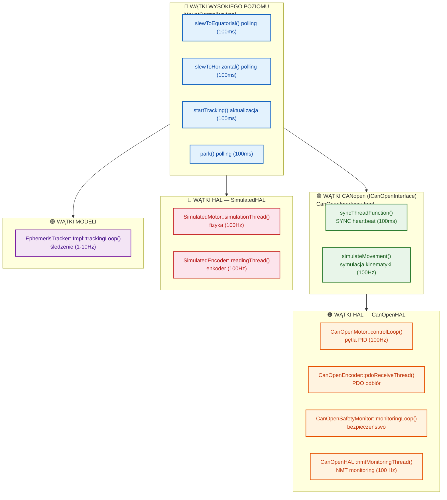

# Wątki w kontrolerze montażu — szczegółowa dokumentacja

## Spis treści

1. [Wprowadzenie](#1-wprowadzenie)
2. [Architektura wielowątkowa — przegląd](#2-architektura-wielowątkowa--przegląd)
3. [Wątki MountController](#3-wątki-mountcontroller)
4. [Operacje blokujące w MountController (derotator, kalibracja)](#4-operacje-blokujące-w-mountcontroller-derotator-kalibracja)
5. [Wątki CanOpenInterface (ICanOpenInterface)](#5-wątki-canopeninterface)
6. [Wątki HAL — CanOpenHAL](#6-wątki-hal--canopenhal)
7. [Wątki HAL — SimulatedHAL](#7-wątki-hal--simulatedhal)
8. [Wątki EphemerisTracker](#8-wątki-ephemeristracker)
9. [Wątki EphemerisTrackerManager](#9-wątki-ephemeristrackermanager)
10. [Wątki Mock/Test (CanOpenFactory)](#10-wątki-mocktest)
11. [Diagram przepływu wątków](#11-diagram-przepływu-wątków)
12. [Synchronizacja i współdzielone zasoby](#12-synchronizacja)
13. [Typowe problemy i debugowanie](#13-typoweproblemy)

---

## 1. Wprowadzenie

System kontrolera montażu wykorzystuje wiele wątków do obsługi równoczesnych operacji: sterowania napędami, odczytu enkoderów, monitorowania bezpieczeństwa, śledzenia efemeryd i symulacji ruchu. Każdy wątek ma określoną częstotliwość działania i odpowiedzialność.

Dokument opisuje wszystkie wątki w systemie, ich cykle życia, mechanizmy synchronizacji oraz przepływy danych między nimi.

---

## 2. Architektura wielowątkowa — przegląd



---

## 3. Wątki MountController

### 3.1 `slewToEquatorial()` — pętla monitorowania ruchu

**Plik**: `src/controllers/mount_controller.cpp`
**Zakres**: linie 336–611

Metoda `slewToEquatorial()` wykonuje **slew do współrzędnych równikowych (RA/Dec)**. Dzieli się na dwie fazy:

1. **Faza inicjacji** (wątek wywołujący): walidacja, przeliczenie współrzędnych, uruchomienie napędów
2. **Faza monitorowania** (wątek roboczy `work_thread_`): cykliczne sprawdzanie, czy cel został osiągnięty

**Ważne zmiany względem poprzedniej implementacji**:
- Zamiast `detach()` używane jest `joinWorkThreadLocked()` z `thread_mutex_` — poprzedni wątek jest łączony przed utworzeniem nowego
- Głównym kanałem sterowania jest **HAL** (`MotorControl`, `SafetyMonitor`, `EncoderReader`)
- CANopen i symulacja są wyłącznie ścieżkami awaryjnymi (fallback)
- Dodano korekcję **TPOINT** pozycji montażu przed slewingiem
- Dodano sprawdzanie **soft limits** przed rozpoczęciem i w trakcie slewu

---

#### Faza 1: Inicjacja (wątek główny, linie 342–445)

```cpp
// Sekwencja w głównym wątku (pod thread_mutex_):
{
    std::lock_guard<std::mutex> tlock(*thread_mutex_);
    
    // 1. Join poprzedniego work_thread_ (jeśli istnieje)
    joinWorkThreadLocked();
    
    // 2. Walidacja stanu i przeliczenie współrzędnych
    {
        std::lock_guard<std::mutex> lock(*state_mutex_);
        if (state_ == UNINITIALIZED || state_ == ERROR) return false;
        if (state_ == SLEWING || state_ == TRACKING) return false;
        
        // 3. Obliczenie Hour Angle i korekcja TPOINT
        double ha_hours = lst - ra;
        if (tpoint_calibrated_) {
            auto [mount_ha, mount_dec] = tpoint_model_->predictMountPosition(ra, dec);
            axis1_target_ = mount_ha * 15.0;  // godziny → stopnie
            axis2_target_ = mount_dec;
        } else {
            axis1_target_ = ha_hours * 15.0;
            axis2_target_ = dec;
        }
        
        // 4. Sprawdzenie soft limits przed ruchem
        if (config_.soft_limits_enabled) {
            if (axis1_target_ < soft_limit_axis1_min || ...) {
                return false;  // odrzuć slew
            }
        }
        
        state_ = SLEWING;
    }
    notifyStatusChanged();  // IDLE → SLEWING
    
    // 5. Uruchomienie napędów (priorytet: HAL → CANopen → brak)
    if (hal_axis1_motor_ && hal_axis2_motor_) {
        // HAL path
        hal_axis1_motor_->setPosition(axis1_target_, SLEW_VELOCITY, SLEW_ACCELERATION);
        hal_axis2_motor_->setPosition(axis2_target_, SLEW_VELOCITY, SLEW_ACCELERATION);
    } else if (canopen_interface_) {
        // CANopen fallback
        canopen_interface_->setPositionTarget(0, axis1_target_, ...);
        canopen_interface_->setPositionTarget(1, axis2_target_, ...);
    }
    
    // 6. Uruchomienie wątku monitorującego (przechowywany w work_thread_)
    work_thread_ = std::thread([this]() { /* faza monitorowania */ });
}
```

---

#### Faza 2: Monitorowanie (wątek roboczy, linie 448–607)

```cpp
// Wątek roboczy (przechowywany w work_thread_, NIE detach)
const int POLL_MS = 100;
const double POSITION_TOLERANCE_DEG = config_.position_tolerance;
const int SIM_TIMEOUT_MS = 60000;
int sim_elapsed_ms = 0;

while (true) {
    // 1. Sprawdzenie anulowania
    {
        std::lock_guard<std::mutex> lock(*state_mutex_);
        if (state_ != SLEWING) break;
    }
    
    bool reached = true;
    
    // 2. HAL path (priorytet) — MotorControl::targetReached()
    if (hal_axis1_motor_ && hal_axis2_motor_) {
        reached = hal_axis1_motor_->targetReached() && hal_axis2_motor_->targetReached();
    }
    // 3. CANopen fallback — getDriveStatus()
    else if (canopen_interface_) {
        auto status0 = canopen_interface_->getDriveStatus(0);
        auto status1 = canopen_interface_->getDriveStatus(1);
        if (!status0.target_reached) reached = false;
        if (!status1.target_reached) reached = false;
    }
    // 4. Symulacja (fallback) — inkrementalna zmiana pozycji
    else {
        sim_elapsed_ms += POLL_MS;
        // Sprawdzenie soft limits
        double rate_factor = evaluateSoftLimits(axis1_position_, axis2_position_);
        // Sprawdzenie HAL SafetyMonitor
        if (hal_safety_monitor_) {
            auto safety_status = hal_safety_monitor_->getStatus();
            if (safety_status.overall_state == EMERGENCY_STOP || ...) {
                state_ = ERROR; break;
            }
            hal_safety_monitor_->checkLimits(0);
            hal_safety_monitor_->checkLimits(1);
        }
        // Inkrementalny krok w stronę targetu
        axis1_position_ += std::copysign(min(step, |d1|), d1);
        axis2_position_ += std::copysign(min(step, |d2|), d2);
    }
    
    // 5. Osiągnięcie celu — odczyt pozycji z enkoderów
    if (reached) {
        std::lock_guard<std::mutex> lock(*state_mutex_);
        if (state_ == SLEWING) {
            // Priorytet: HAL EncoderReader → CANopen getPositionData
            if (hal_axis1_encoder_ && hal_axis2_encoder_) {
                auto enc1 = hal_axis1_encoder_->read();
                auto enc2 = hal_axis2_encoder_->read();
                if (enc1.data_valid && enc2.data_valid) {
                    axis1_position_ = enc1.position_deg;
                    axis2_position_ = enc2.position_deg;
                }
            } else if (canopen_interface_) {
                auto pos0 = canopen_interface_->getPositionData(0);
                axis1_position_ = pos0.actual_position;
            }
            axis1_rate_ = 0.0;
            axis2_rate_ = 0.0;
            state_ = IDLE;
        }
        break;
    }
    
    std::this_thread::sleep_for(std::chrono::milliseconds(POLL_MS));
}

// 6. Powiadomienia po zakończeniu pętli
if (exit_state == ERROR) {
    notifyError(exit_error);
    notifyStatusChanged();
} else if (exit_state == IDLE) {
    notifyStatusChanged();
}
```

| Właściwość | Wartość |
|-----------|---------|
| **Typ** | `std::thread` przechowywany w `work_thread_` (join przez `joinWorkThreadLocked()`) |
| **Czas życia** | Od rozpoczęcia slewu do osiągnięcia celu, anulowania, timeoutu lub błędu |
| **Synchronizacja** | `thread_mutex_` (tworzenie/join wątku) + `state_mutex_` (stan, pozycje) |
| **Częstotliwość pollingu** | 100 ms (10 Hz) |
| **HAL (priorytet)** | `MotorControl::setPosition()` → `MotorControl::targetReached()` → `EncoderReader::read()` |
| **CANopen (fallback 1)** | `setPositionTarget()` → `getDriveStatus()` → `getPositionData()` |
| **Symulacja (fallback 2)** | Inkrementalna zmiana pozycji z timeoutem 60s |
| **HAL SafetyMonitor** | `getStatus()` + `checkLimits()` sprawdzane w symulacji |
| **TPOINT** | Opcjonalna korekcja `predictMountPosition()` przed slewingiem |
| **Soft limits** | Sprawdzane przed slewingiem i w trakcie symulacji |

**Przepływ**:
1. Wątek główny blokuje `thread_mutex_`, łączy poprzedni `work_thread_` przez `joinWorkThreadLocked()`
2. Wątek główny blokuje `state_mutex_`, oblicza HA z korekcją TPOINT, sprawdza soft limits, ustawia `state_ = SLEWING`
3. Wątek główny uruchamia napędy przez HAL (`MotorControl::setPosition()`) lub CANopen
4. Wątek główny tworzy `work_thread_` (`std::thread`) i zwalnia `thread_mutex_`
5. Wątek roboczy w pętli co 100ms:
   - Sprawdza `state_` pod `state_mutex_` (czy nie anulowano przez `stop()`)
   - **HAL**: pyta `MotorControl::targetReached()` — jeśli obie osie OK, cel osiągnięty
   - **CANopen**: pyta `getDriveStatus()` obu osi
   - **Symulacja**: sprawdza soft limits (`evaluateSoftLimits()`), HAL SafetyMonitor, inkrementuje pozycje
   - Po osiągnięciu celu: odczytuje rzeczywiste pozycje z HAL `EncoderReader::read()` lub CANopen `getPositionData()`
6. Po wyjściu z pętli: wywołuje `notifyStatusChanged()` / `notifyError()`
7. `stop()` zmienia `state_` na `IDLE`, co powoduje wyjście z pętli; następnie `join()` na `work_thread_`

---

### 3.2 `slewToHorizontal()` — analogicznie do równikowego

Identyczna struktura jak `slewToEquatorial()` (linie ~174-252) — różni się tylko tym, że targety to azymut/wysokość zamiast RA/Dec.

---

### 3.3 `park()` — pętla parkowania

**Plik**: `src/controllers/mount_controller.cpp`

**Główny wątek** (linie ~343-358):
```cpp
std::lock_guard<std::mutex> lock(*state_mutex_);
if (state_ == MountStatus::State::PARKED) return;
state_ = MountStatus::State::PARKING;
if (canopen_interface_) canopen_interface_->stopAxis(0...1);
axis1_target_ = 0.0;
axis2_target_ = 0.0;
tracking_active_ = false;
```

**Detached thread** (linie ~361-419):
```cpp
std::thread([this]() {
    const double PARK_VELOCITY = 2.0;
    const int POLL_MS = 100;
    const double POSITION_TOLERANCE_DEG = 0.5;
    
    if (canopen_interface_) {
        canopen_interface_->setPositionTarget(0, 0.0, PARK_VELOCITY, ...);
        canopen_interface_->setPositionTarget(1, 0.0, PARK_VELOCITY, ...);
    }
    
    while (true) {
        {
            std::lock_guard<std::mutex> lock(*state_mutex_);
            if (state_ != MountStatus::State::PARKING) break; // anulowanie
        }
        
        bool reached = true;
        if (canopen_interface_) {
            // poll CANopen status
        } else {
            std::lock_guard<std::mutex> lock(*state_mutex_);
            // symulacja: przesuwaj do (0,0) z krokiem 2.0°
        }
        
        if (reached) {
            std::lock_guard<std::mutex> lock(*state_mutex_);
            axis1_position_ = 0.0;
            axis2_position_ = 0.0;
            axis1_rate_ = 0.0;
            axis2_rate_ = 0.0;
            state_ = MountStatus::State::PARKED;
            break;
        }
        
        std::this_thread::sleep_for(std::chrono::milliseconds(POLL_MS));
    }
}).detach();
```

| Właściwość | Wartość |
|-----------|---------|
| **Step symulacji** | 2.0°/krok (szybszy niż slew = 1.0°/krok) |
| **Tolerancja** | 0.5° |
| **CANopen** | `setPositionTarget(0, 0.0, 2.0, 1.0)` |

---

### 3.4 `startTracking()` — wątek śledzenia

**Plik**: `src/controllers/mount_controller.cpp`, linie ~255-332

**Kod**:
```cpp
std::thread([this, axis1_tracking_rate, axis2_tracking_rate]() {
    while (tracking_active_) {
        std::this_thread::sleep_for(std::chrono::milliseconds(100));
        
        std::lock_guard<std::mutex> lock(*state_mutex_);
        
        if (!tracking_active_ || state_ != MountStatus::State::TRACKING) break;
        
        // Update positions based on tracking rate
        double dt = 0.1;
        axis1_position_ += axis1_rate_ * dt;
        axis2_position_ += axis2_rate_ * dt;
        
        // Update CANopen velocity targets
        if (canopen_interface_ && state_ == MountStatus::State::TRACKING) {
            canopen_interface_->setVelocityTarget(0, axis1_rate_, config_.tracking_acceleration);
            canopen_interface_->setVelocityTarget(1, axis2_rate_, config_.tracking_acceleration);
        }
    }
}).detach();
```

| Właściwość | Wartość |
|-----------|---------|
| **Typ** | `std::thread` z `detach()` |
| **Czas życia** | Od `startTracking()` do `stop()` |
| **Częstotliwość** | 100 ms (10 Hz) |
| **Synchronizacja** | `std::lock_guard<std::mutex> lock(*state_mutex_)` |
| **Flaga stop** | `tracking_active_` + `state_` |

**Uwaga**: W przeciwieństwie do starego kodu — `startTracking()` **TWORZY** wątek, który cyklicznie aktualizuje pozycję i utrzymuje prędkość śledzenia przez CANopen.

---

### 3.5 `stop()` — zatrzymanie ruchu (synchroniczne)

**Kod**:
```cpp
void stop() {
    std::lock_guard<std::mutex> lock(*state_mutex_);
    axis1_rate_ = 0.0;
    axis2_rate_ = 0.0;
    tracking_active_ = false;
    
    if (canopen_interface_) {
        canopen_interface_->stopAxis(0);
        canopen_interface_->stopAxis(1);
    }
    
    if (state_ == SLEWING || state_ == TRACKING) {
        state_ = MountStatus::State::IDLE;
    }
}
```

`stop()` synchronizuje się przez `state_mutex_` i czyści stany. Detached wątki w następnej iteracji pollingu zobaczą `state_ != SLEWING/PARKING/TRACKING` i same zakończą pętlę.

---

## 4. Operacje blokujące w MountController (derotator, kalibracja)

W przeciwieństwie do wątków slewu/park/track (które są uruchamiane w `detach()` i
działają niezależnie), operacje związane z derotatorem i kalibracją są wykonywane
**synchronicznie i blokująco** na wątku wywołującym. Nie tworzą własnych wątków,
ale zawierają pętle `sleep()` i pollingu CANopen, które mogą blokować wątek
przez dłuższy czas (setki ms do kilku sekund).

### 4.1 `homeDerotator()` — homing z blokującym pollingiem CANopen

**Plik**: `src/controllers/mount_controller.cpp`

```cpp
bool homeDerotator(const ::astro_mount::DerotatorHomingRequest& request) {
    if (!derotator_enabled_) return false;
    
    derotator_moving_ = true;
    derotator_target_angle_ = request.offset();
    
    if (canopen_interface_) {
        const int DEROTATOR_AXIS_ID = 2;
        const double HOME_VELOCITY = 3.0;  // deg/s
        const double HOME_ACCELERATION = 5.0;
        
        canopen_interface_->enableDrive(DEROTATOR_AXIS_ID);
        canopen_interface_->setPositionTarget(DEROTATOR_AXIS_ID, request.offset(),
                                              HOME_VELOCITY, HOME_ACCELERATION);
        
        // BLOKUJĄCA pętla pollingu (w wątku wywołującego)
        const int POLL_MS = 50;
        const double TOLERANCE = 0.1;
        int timeout_ms = 10000;
        int elapsed_ms = 0;
        
        while (elapsed_ms < timeout_ms) {
            auto status = canopen_interface_->getDriveStatus(DEROTATOR_AXIS_ID);
            auto pos = canopen_interface_->getPositionData(DEROTATOR_AXIS_ID);
            
            if (status.target_reached &&
                std::abs(pos.actual_position - request.offset()) < TOLERANCE) {
                derotator_current_angle_ = pos.actual_position;
                break;
            }
            std::this_thread::sleep_for(std::chrono::milliseconds(POLL_MS));
            elapsed_ms += POLL_MS;
        }
    } else {
        // Symulacja: sleep 2s
        std::this_thread::sleep_for(std::chrono::seconds(2));
        derotator_current_angle_ = request.offset();
    }
    
    derotator_moving_ = false;
    derotator_homed_ = true;
    
    // Opcjonalnie: uruchom kalibrację po homingu (również blokująca)
    if (request.calibrate_after()) {
        runDerotatorCalibration();
    }
    return true;
}
```

| Właściwość | Wartość |
|-----------|---------|
| **Typ** | Synchroniczna, blokująca (brak detached thread) |
| **Czas blokowania** | Do 10s (timeout) + opcjonalnie kalibracja |
| **Częstotliwość pollingu** | 50 ms (20 Hz) |
| **CANopen** | Wymaga `enableDrive()` + `setPositionTarget()` na osi derotatora (axis_id=2) |
| **Symulacja** | `sleep(2s)` + natychmiastowe ustawienie pozycji |
| **Efekt uboczny** | Blokuje wątek wywołującego (np. API gRPC) na czas trwania |

### 4.2 `runDerotatorCalibration()` / `runCANopenDerotatorCalibration()` — kalibracja derotatora

```cpp
bool runCANopenDerotatorCalibration() {
    const int DEROTATOR_AXIS_ID = 2;
    
    // Krok 1: Pomiar backlashu (blokujący, ~1s)
    double backlash_measured = measureBacklash(DEROTATOR_AXIS_ID);
    derotator_config_.set_backlash(backlash_measured);
    
    // Krok 2: Kalibracja enkodera absolutnego (blokująca, 4 punkty × ~300ms)
    if (derotator_config_.absolute_encoder()) {
        calibrateAbsoluteEncoder(DEROTATOR_AXIS_ID);
    }
    
    // Krok 3: Tabela kalibracyjna (blokująca, 8 punktów × ~300ms)
    std::vector<double> calibration_table;
    generateCalibrationTable(DEROTATOR_AXIS_ID, calibration_table);
    // ... zapisz do configu
    
    return true;
}
```

| Krok | Metoda | Czas | Opis |
|------|--------|------|------|
| 1 | `measureBacklash()` | ~1s (2 × 500ms sleep) | Ruch +10°, powrót, pomiar różnicy |
| 2 | `calibrateAbsoluteEncoder()` | ~1.2s (4 × 300ms) | Sprawdzenie enkodera w 4 punktach (0°, 90°, 180°, 270°) |
| 3 | `generateCalibrationTable()` | ~2.4s (8 × 300ms) | Tablica błędów w 8 punktach (co 45°, 0-315°) |
| **Razem** | | **~4.6s** | Wszystkie kroki blokują wątek wywołującego |

### 4.3 `measureBacklash()` — pomiar luzu

```cpp
double measureBacklash(int axis_id) {
    // 1. Odczyt pozycji startowej
    auto current_pos = canopen_interface_->getPositionData(axis_id);
    double start_pos = current_pos.actual_position;
    
    // 2. Ruch w kierunku dodatnim (+10°)
    canopen_interface_->setPositionTarget(axis_id, start_pos + 10.0, 5.0, 10.0);
    std::this_thread::sleep_for(std::chrono::milliseconds(500));  // blokujące
    
    // 3. Ruch powrotny do start_pos
    canopen_interface_->setPositionTarget(axis_id, start_pos, 5.0, 10.0);
    std::this_thread::sleep_for(std::chrono::milliseconds(500));  // blokujące
    
    // 4. Obliczenie backlashu = |rzeczywista_pozycja_końcowa - start_pos|
    return backlash;
}
```

| Właściwość | Wartość |
|-----------|---------|
| **Typ** | Blokująca pętla z `sleep()` |
| **Czas** | ~1s (minimum, zależy od czasu ruchu CANopen) |
| **CANopen** | `getPositionData()` + `setPositionTarget()` |
| **Synchronizacja** | Brak mutexu (wykonywana w kontekście wywołującego) |

### 4.4 `calibrateAbsoluteEncoder()` — kalibracja enkodera absolutnego

```cpp
bool calibrateAbsoluteEncoder(int axis_id) {
    const int CALIBRATION_POINTS = 4;
    const double CALIBRATION_ANGLES[] = {0.0, 90.0, 180.0, 270.0};
    const double TOLERANCE = 0.1;
    
    for (int i = 0; i < CALIBRATION_POINTS; i++) {
        double target_angle = CALIBRATION_ANGLES[i];
        canopen_interface_->setPositionTarget(axis_id, target_angle, 5.0, 10.0);
        std::this_thread::sleep_for(std::chrono::milliseconds(300));  // blokujące
        
        // Weryfikacja: porównaj odczyt enkodera z pozycją napędu
        auto encoder_data = canopen_interface_->getEncoderData(axis_id);
        auto position_data = canopen_interface_->getPositionData(axis_id);
        double error = std::abs(encoder_angle - drive_angle);
        if (error > TOLERANCE) {
            MOUNT_LOG_WARN("Encoder-drive mismatch at {:.1f}°", target_angle);
        }
    }
    return true;
}
```

### 4.5 `generateCalibrationTable()` — generowanie tablicy kalibracyjnej

```cpp
bool generateCalibrationTable(int axis_id, std::vector<double>& table) {
    const int TABLE_POINTS = 8;  // 0°, 45°, 90°, ..., 315°
    table.clear();
    
    // Powrót do home (0°)
    canopen_interface_->setPositionTarget(axis_id, 0.0, 5.0, 10.0);
    std::this_thread::sleep_for(std::chrono::milliseconds(300));
    
    for (int i = 0; i < TABLE_POINTS; i++) {
        double target_angle = i * 45.0;
        canopen_interface_->setPositionTarget(axis_id, target_angle, 5.0, 10.0);
        std::this_thread::sleep_for(std::chrono::milliseconds(300));  // blokujące
        
        // Odczyt rzeczywistej pozycji i obliczenie błędu
        auto position_data = canopen_interface_->getPositionData(axis_id);
        double error = position_data.actual_position - target_angle;
        table.push_back(target_angle);
        table.push_back(error);
    }
    return true;
}
```

---

## 5. Wątki CanOpenInterface

**Plik**: `src/controllers/canopen_interface.cpp`, linie 522-534

```cpp
void syncThreadFunction() {
    while (sync_thread_running_) {
        {
            std::lock_guard<std::mutex> lock(mutex_);
            if (connected_ && config_.use_sync) {
                sendSync();  // Wysyła SYNC do wszystkich węzłów CANopen
            }
        }
        std::this_thread::sleep_for(
            std::chrono::milliseconds(config_.sync_period_ms));
    }
}
```

| Właściwość | Wartość |
|-----------|---------|
| **Typ** | `std::thread` przechowywany jako `sync_thread_` |
| **Czas życia** | Od `initialize()` do `shutdown()`/`disconnect()` |
| **Częstotliwość** | `config_.sync_period_ms` (domyślnie 100 ms → 10 Hz) |
| **Synchronizacja** | `std::lock_guard<std::mutex> lock(mutex_)` |
| **Flaga stop** | `sync_thread_running_` (ustawiana w `disconnect()`) |

**Zachowanie**:
1. W pętli sprawdza `connected_` i `config_.use_sync`
2. Wysyła SYNC przez `sendSync()` (w rzeczywistej implementacji przez SDO)
3. Usypia na `sync_period_ms` milisekund
4. Kończy gdy `sync_thread_running_ = false` (w `disconnect()`)

**Uruchomienie**: `sync_thread_ = std::thread([this]() { syncThreadFunction(); }).detach();`  
(Linia ~81 — ale tu jest `detach()`, choć zmienna `sync_thread_` jest przechowywana — niespójność)

---

### 4.2 `simulateMovement()` — symulacja kinematyki

**Plik**: `src/controllers/canopen_interface.cpp`, linie 536-658

```cpp
void simulateMovement(int axis_id, double target_position) {
    const double max_velocity = 10.0; // deg/s
    const double acceleration = 2.0;  // deg/s²
    const double update_rate = 100.0; // Hz
    
    double current_position = axis_position_[axis_id].actual_position;
    double current_velocity = 0.0;
    double distance = target_position - current_position;
    double direction = (distance > 0) ? 1.0 : -1.0;
    
    // Faza 1: Przyspieszanie
    while (std::abs(current_velocity) < max_velocity && 
           std::abs(target_position - current_position) > 0.1) {
        current_velocity += direction * acceleration / update_rate;
        current_position += current_velocity / update_rate;
        // ... aktualizacja + callbacki
        std::this_thread::sleep_for(std::chrono::milliseconds(1000/static_cast<int>(update_rate)));
    }
    
    // Faza 2: Stała prędkość
    while (/* warunek dla hamowania */) {
        current_position += current_velocity / update_rate;
        // ... aktualizacja + callbacki
        std::this_thread::sleep_for(std::chrono::milliseconds(10));
    }
    
    // Faza 3: Hamowanie
    while (std::abs(target_position - current_position) > 0.01) {
        // ... zmniejszanie prędkości
        std::this_thread::sleep_for(std::chrono::milliseconds(10));
    }
    
    // Finał: ustawienie dokładnej pozycji
    axis_position_[axis_id].actual_position = target_position;
    axis_status_[axis_id].moving = false;
    axis_status_[axis_id].target_reached = true;
}
```

| Właściwość | Wartość |
|-----------|---------|
| **Typ** | Funkcja wywoływana w osobnym wątku (uruchamiana w `setPositionTarget()`) |
| **Czas życia** | Od rozpoczęcia ruchu do osiągnięcia celu (zmienny) |
| **Częstotliwość pętli** | 100 Hz (10 ms interwał) |
| **Synchronizacja** | `std::lock_guard<std::mutex> lock(mutex_)` w każdej fazie |
| **Callbacki** | `position_callback_`, `encoder_callback_`, `status_callback_` (w finale) |

**Fazy ruchu** (trapezoidalny profil prędkości):
1. **Przyspieszanie**: `velocity += accel / rate` aż do `max_velocity`
2. **Stała prędkość**: aż do punktu rozpoczęcia hamowania
3. **Hamowanie**: `velocity -= accel / rate` aż do zatrzymania
4. **Finał**: ustawienie dokładnej pozycji celu

**Uruchomienie**: w `setPositionTarget()` przez `std::thread([this, axis_id, position]() { simulateMovement(axis_id, position); }).detach();`

---

## 5. Wątki HAL — CanOpenHAL

### 5.1 `CanOpenMotor::controlLoop()` — pętla PID

**Plik**: `src/hal/canopen_hal/canopen_hal.cpp`, linie 375-407

```cpp
void CanOpenMotor::controlLoop() {
    auto last_update = std::chrono::steady_clock::now();
    
    while (control_running_) {
        auto now = std::chrono::steady_clock::now();
        auto dt = std::chrono::duration<double>(now - last_update).count();
        last_update = now;
        
        if (enabled_ && moving_) {
            double new_position = getActualPosition();
            double new_velocity = getActualVelocity();
            
            actual_position_ = new_position;
            actual_velocity_ = new_velocity;
            
            if (position_callback_) {
                position_callback_(axis_id_, new_position, new_velocity);
            }
            
            if (targetReached()) {
                moving_ = false;
                if (state_change_callback_) {
                    state_change_callback_(axis_id_, MotorState::IDLE);
                }
            }
        }
        
        std::this_thread::sleep_for(std::chrono::milliseconds(10)); // ~100 Hz
    }
}
```

| Właściwość | Wartość |
|-----------|---------|
| **Typ** | `std::thread` zapisany w `control_thread_` |
| **Czas życia** | Od utworzenia `CanOpenMotor` do zniszczenia (`control_running_ = false`) |
| **Częstotliwość** | ~100 Hz (10 ms sleep) |
| **Synchronizacja** | Używa atomików `actual_position_`, `actual_velocity_`, `enabled_`, `moving_` |
| **Callbacki** | `position_callback_`, `state_change_callback_` |

**Inicjalizacja** (konstruktor, linie 77-80):
```cpp
control_running_ = true;
control_thread_ = std::thread(&CanOpenMotor::controlLoop, this);
```

**Zatrzymanie** (destruktor, linie 82-87):
```cpp
control_running_ = false;
if (control_thread_.joinable()) {
    control_thread_.join();
}
```

---

### 5.2 `CanOpenEncoder::pdoReceiveThread()` — rzeczywisty odbiór PDO

**Plik**: `src/hal/canopen_hal/canopen_hal.cpp`

```cpp
void CanOpenEncoder::pdoReceiveThread() {
    // Oblicz interwał odświeżania na podstawie konfiguracji
    auto update_interval = std::chrono::milliseconds(
        1000 / static_cast<int>(config_.update_rate_hz));
    
    // W przypadku braku konfiguracji lub zbyt szybkiego odświeżania – domyślny interwał 10ms
    if (update_interval.count() < 1) {
        update_interval = std::chrono::milliseconds(10);
    }
    
    while (pdo_running_) {
        try {
            // Krok 1: Odczytaj dane enkodera przez CANopen (poprzez getEncoderData)
            auto encoder_data = canopen_.getEncoderData(axis_id_);
            
            // Krok 2: Przelicz na EncoderReading z cache przez mutex
            {
                std::lock_guard<std::mutex> lock(mutex_);
                
                // Zapisz w cache najnowszy odczyt PDO
                latest_reading_.raw_counts = encoder_data.raw_position;
                latest_reading_.position_deg = config_.countsToDegrees(encoder_data.raw_position) + calibration_offset_.load();
                latest_reading_.velocity_deg_s = config_.velocityCountsToDegrees(encoder_data.raw_velocity);
                latest_reading_.index_pulse = encoder_data.index_pulse;
                latest_reading_.direction = encoder_data.direction;
                latest_reading_.error_count = encoder_data.error_count;
                latest_reading_.data_valid = true;
                latest_reading_.timestamp = std::chrono::steady_clock::now();
                last_pdo_time_ = std::chrono::steady_clock::now();
                
                total_readings_++;
                
                // Callback dla zewnętrznych subskrybentów
                if (reading_callback_) {
                    reading_callback_(latest_reading_);
                }
            }
            
        } catch (const std::exception& e) {
            std::lock_guard<std::mutex> lock(mutex_);
            error_count_++;
            latest_reading_.data_valid = false;
            
            if (error_callback_) {
                error_callback_(std::string("PDO receive error: ") + e.what(), error_count_.load());
            }
        }
        
        // Krok 3: Uśpij na określony interwał PDO
        std::this_thread::sleep_for(update_interval);
    }
}
```

| Właściwość | Wartość |
|-----------|---------|
| **Typ** | `std::thread` zapisany w `pdo_thread_` |
| **Czas życia** | Od `initialize()` do `shutdown()` (gdy `config.interface == CANOPEN`) |
| **Częstotliwość** | `config_.update_rate_hz` (domyślnie 100 Hz → 10 ms), **konfigurowalna** przez `EncoderConfig::update_rate_hz` |
| **Synchronizacja** | `std::lock_guard<std::mutex> lock(mutex_)` dla `latest_reading_`, `error_count_` i callbacków |
| **Callbacki** | `reading_callback_` — po każdym udanym odczycie; `error_callback_` — przy błędzie odczytu |
| **Cache** | ✅ `latest_reading_` — `read()` zwraca cache zamiast blokującego SDO |

**Uruchomienie** (`initialize()`):
```cpp
if (config.interface == EncoderInterface::CANOPEN) {
    pdo_running_ = true;
    pdo_thread_ = std::thread(&CanOpenEncoder::pdoReceiveThread, this);
    // Rejestracja callbacka dla bezpośredniej aktualizacji cache z CANopenInterface
    canopen_.setEncoderCallback([this](int axis_id, const auto& data) {
        if (axis_id == axis_id_) {
            std::lock_guard<std::mutex> lock(mutex_);
            latest_reading_.raw_counts = data.raw_position;
            latest_reading_.position_deg = config_.countsToDegrees(data.raw_position) + ...;
            latest_reading_.data_valid = true;
            latest_reading_.timestamp = std::chrono::steady_clock::now();
        }
    });
}
```

**Zatrzymanie** (`shutdown()` / destruktor):
```cpp
pdo_running_ = false;
if (pdo_thread_.joinable()) {
    pdo_thread_.join();
}
```

**Odczyt (`read()`)**:
- Gdy PDO thread aktywny → zwraca `latest_reading_` z cache bezzwłocznie (non-blocking)
- Gdy PDO thread nieaktywny → fallback do synchronicznego `getEncoderData()` (SDO)

---

### 5.3 `CanOpenSafetyMonitor::monitoringLoop()` — monitoring bezpieczeństwa

**Plik**: `src/hal/canopen_hal/canopen_hal.cpp`, linie 789-807

```cpp
void CanOpenSafetyMonitor::monitoringLoop() {
    auto last_check = std::chrono::steady_clock::now();
    
    while (monitoring_running_) {
        auto now = std::chrono::steady_clock::now();
        auto elapsed = std::chrono::duration<double>(now - last_check).count();
        
        if (elapsed >= 1.0 / config_.monitoring_rate_hz) {
            for (int i = 0; i < 3; ++i) {
                checkLimits(i);
            }
            last_check = now;
        }
        
        std::this_thread::sleep_for(std::chrono::milliseconds(10));
    }
}
```

| Właściwość | Wartość |
|-----------|---------|
| **Typ** | `std::thread` zapisany w `monitoring_thread_` |
| **Czas życia** | Od `initialize()` do `shutdown()` |
| **Częstotliwość pętli** | ~100 Hz (10 ms sleep) |
| **Częstotliwość checków** | `config_.monitoring_rate_hz` (np. 10 Hz) |
| **Synchronizacja** | Brak mutexów (używa `canopen_.getDriveStatus()` z wewnętrznym mutexem) |

**Sprawdzane limity** w `checkLimits()` (linie 700-751):
- Pozycja: `min_position_deg` / `max_position_deg`
- Prędkość: `max_velocity_deg_s`
- Temperatura: `max_temperature_c`
- Prąd: `max_current_a`

**Callbacki**:
- `limit_callback_(axis_id, type, value)` — gdy limit przekroczony
- `error_callback_(axis_id, message)` — gdy błąd komunikacji

---

### 5.4 `CanOpenHAL::nmtMonitoringThread()` — NMT monitoring (CiA 301)

**Plik**: `src/hal/canopen_hal/canopen_hal.cpp`

Kompletny NMT monitor zgodny z CiA 301 (DS-301) — zarządzanie siecią CANopen z 6 fazami i konfiguracją przez `HALConfig::canopen::nmt`.

```cpp
void CanOpenHAL::nmtMonitoringThread() {
    // Faza 0: Odczyt konfiguracji NMT
    const auto& nmt_cfg = config_.canopen.nmt;
    if (!nmt_cfg.enable_nmt) {
        while (nmt_running_) {
            std::this_thread::sleep_for(std::chrono::milliseconds(100));
        }
        return;
    }
    
    // Stany NMT slave (CiA 301 Table 49)
    enum class NMTState : uint8_t {
        INITIALISING = 0x00, PRE_OPERATIONAL = 0x7F,
        OPERATIONAL = 0x05, STOPPED = 0x04, UNKNOWN = 0xFF
    };
    
    const int NUM_NODES = 3; // RA, Dec, Derotator
    std::array<NodeState, NUM_NODES> nodes; // state + heartbeat + bootup info
    
    uint64_t nmt_cycle = 0;
    static constexpr int NMT_CYCLE_MS = 10; // 100 Hz
    
    while (nmt_running_) {
        nmt_cycle++;
        auto now = std::chrono::steady_clock::now();
        
        for (int i = 0; i < NUM_NODES; ++i) {
            uint8_t node_id = i + 1;
            auto& node = nodes[i];
            
            // Faza 1: Bootup – oczekiwanie na komunikat bootup od węzła
            if (node.state == NMTState::UNKNOWN || node.state == NMTState::INITIALISING) {
                if (enable_bootup) {
                    auto status = canopen_interface_->getDriveStatus(i);
                    if (status.operational || status.enabled) {
                        node.bootup_received = true;
                        node.state = NMTState::PRE_OPERATIONAL;
                        sendNMT(node_id, NMT_CMD_ENTER_PRE_OPERATIONAL);
                        std::this_thread::sleep_for(std::chrono::milliseconds(5));
                        sendNMT(node_id, NMT_CMD_START_REMOTE_NODE);
                    }
                    // timeout bootup → sendNMT(node_id, NMT_CMD_RESET_NODE)
                }
            }
            
            // Faza 2: Heartbeat / Node Guarding
            if (!enable_node_guarding) {
                // Heartbeat: cykliczny getDriveStatus() co heartbeat_period_ms
                if (/* hb_elapsed >= heartbeat_period */) {
                    auto status = canopen_interface_->getDriveStatus(i);
                    if (status.error) { node.missed_heartbeats++; }
                    else { node.missed_heartbeats = 0; }
                }
            } else {
                // Node Guarding: RTR request co node_guarding_period_ms
            }
            
            // Faza 3: Utrata komunikacji
            if (node.missed_heartbeats >= MAX_MISSED_HB) {
                sendNMT(node_id, NMT_CMD_ENTER_PRE_OPERATIONAL);
                node.state = NMTState::PRE_OPERATIONAL;
            }
            if (node.missed_heartbeats >= MAX_MISSED_HB * 3) {
                sendNMT(node_id, NMT_CMD_RESET_NODE);
                node.state = NMTState::INITIALISING;
            }
            
            // Faza 4: Auto-recovery z anti-flapping
            if (enable_auto_recovery && node.state == NMTState::PRE_OPERATIONAL
                && node.missed_heartbeats == 0) {
                sendNMT(node_id, NMT_CMD_ENTER_PRE_OPERATIONAL);
                std::this_thread::sleep_for(std::chrono::milliseconds(5));
                sendNMT(node_id, NMT_CMD_START_REMOTE_NODE);
                node.state = NMTState::OPERATIONAL;
            }
            
            // Faza 5: Inicjalny Pre-Operational → Operational
            if (node.state == NMTState::PRE_OPERATIONAL && nmt_cycle < 50) {
                sendNMT(node_id, NMT_CMD_START_REMOTE_NODE);
                node.state = NMTState::OPERATIONAL;
            }
        }
        
        // Faza 6: Raportowanie stanu sieci NMT co 1s (nmt_cycle % 100 == 0)
        
        std::this_thread::sleep_for(std::chrono::milliseconds(NMT_CYCLE_MS)); // 100 Hz
    }
    
    // Shutdown: wszystkie węzły → Pre-Operational
    for (int i = 0; i < NUM_NODES; ++i) {
        sendNMT(i + 1, NMT_CMD_ENTER_PRE_OPERATIONAL);
    }
}
```

| Właściwość | Wartość |
|-----------|---------|
| **Typ** | `std::thread` zapisany w `nmt_thread_` |
| **Czas życia** | Od `initialize()` do `shutdown()` |
| **Częstotliwość pętli** | 100 Hz (10 ms) — wzrost z 10 Hz |
| **Synchronizacja** | Brak własnego mutexa (używa `canopen_interface_->getDriveStatus()`) |
| **Konfiguracja** | 10 parametrów w `HALConfig::canopen::nmt` (z `hal_config.h`) |

**Fazy NMT monitoringu**:

| Faza | Opis | Warunek przejścia |
|------|------|-------------------|
| **0: Konfiguracja** | Jeśli `enable_nmt=false` → idle loop (sleep 100ms) | `enable_nmt` |
| **1: Bootup** | `getDriveStatus()` — gdy węzeł odpowie → bootup_received=true, stan=PRE_OP. Timeout → NMT Reset | `bootup_received` |
| **2: Heartbeat** | `getDriveStatus()` cyklicznie, `missed_heartbeats++` przy błędzie/wyjątku | `hb_elapsed >= period` |
| **3: Utrata** | `missed >= max` → PRE_OP. `missed >= max*3` → NMT Reset | `missed_heartbeats` |
| **4: Recovery** | Komunikacja wróciła → EnterPreOp + StartNode. Anti-flapping `recovery_interval_s` | komunikacja OK + odstęp |
| **5: Start** | Pierwsze 50 cykli → Start Remote Node | `nmt_cycle < 50` |
| **6: Raport** | Co 100 cykli (1s) logowanie stanu węzłów | `nmt_cycle % 100 == 0` |

**Parametry konfiguracyjne** (`HALConfig::canopen::nmt`):

| Pole | Domyślnie | Opis |
|------|-----------|------|
| `enable_nmt` | `true` | Włączenie/wyłączenie NMT monitoringu |
| `heartbeat_period_ms` | `100` | Okres oczekiwania na heartbeat (ms) |
| `heartbeat_timeout_ms` | `500` | Czas do uznania heartbeat za stracony (ms) |
| `max_missed_heartbeats` | `3` | Próg pominiętych heartbeatów przed akcją |
| `enable_bootup_check` | `true` | Czy czekać na bootup przed Pre-Operational |
| `bootup_timeout_ms` | `5000` | Maks. czas oczekiwania na bootup (ms) |
| `enable_auto_recovery` | `true` | Automatyczne przywracanie do Operational |
| `recovery_interval_s` | `5` | Min. odstęp między recovery (anti-flapping, s) |
| `enable_node_guarding` | `false` | Użyj Node Guarding zamiast Heartbeat |
| `node_guarding_period_ms` | `1000` | Okres Node Guarding RTR (ms) |

**Uruchomienie** i **zatrzymanie** — bez zmian względem poprzedniej implementacji.

**Uwaga**: `sendNMT()` jest w pełni zaimplementowane — [ICanOpenInterface](include/controllers/icanopen_interface.h:279) deklaruje `virtual bool sendNMT(uint8_t, uint8_t) = 0`, a [CanOpenInterface](include/controllers/canopen_interface.h:265) dostarcza implementację. Wątki NMT wysyłają rzeczywiste NMT komunikaty (EnterPreOp, StartRemoteNode, ResetNode) przez tę metodę.

---

## 6. Wątki HAL — SimulatedHAL

### 6.1 `SimulatedMotor::simulationThread()` — symulacja fizyki

**Plik**: `src/hal/simulated_hal/simulated_hal.cpp`, linie 247-287

```cpp
void SimulatedMotor::simulationThread() {
    const double update_rate = 100.0; // Hz
    const auto update_interval = std::chrono::milliseconds(1000 / static_cast<int>(update_rate));
    
    while (running_) {
        {
            std::lock_guard<std::mutex> lock(mutex_);
            
            if (enabled_ && moving_) {
                double dt = 1.0 / update_rate;
                actual_position_ += actual_velocity_ * dt;
                
                // Tryb pozycyjny: zbliżanie do targetu
                if (std::abs(actual_velocity_) < 0.0001) {
                    if (std::abs(target_position_ - actual_position_) < 0.001) {
                        moving_ = false;
                        actual_velocity_ = 0.0;
                        if (state_change_callback_) {
                            state_change_callback_("position_reached");
                        }
                    } else {
                        // Prosty regulator proporcjonalny
                        double error = target_position_ - actual_position_;
                        double max_velocity = config_.max_velocity;
                        double velocity = std::clamp(error * 0.1, -max_velocity, max_velocity);
                        actual_velocity_ = velocity;
                    }
                }
                
                if (position_callback_) {
                    position_callback_(actual_position_, actual_velocity_);
                }
            }
        }
        
        std::this_thread::sleep_for(update_interval);
    }
}
```

| Właściwość | Wartość |
|-----------|---------|
| **Typ** | `std::thread` zapisany w `simulation_thread_` |
| **Czas życia** | Od konstrukcji `SimulatedMotor` do zniszczenia |
| **Częstotliwość** | 100 Hz (10 ms) |
| **Synchronizacja** | `std::lock_guard<std::mutex> lock(mutex_)` |
| **Callbacki** | `position_callback_`, `state_change_callback_` |

**Model symulacji**:
1. W trybie pozycyjnym (`setPosition()`): prosty regulator P (`error * 0.1`) zbliża pozycję do targetu
2. W trybie prędkości (`setVelocity()`): `actual_velocity_` ustawiona na zadaną wartość, pozycja zmienia się liniowo
3. Po osiągnięciu targetu (`|error| < 0.001°`) → `moving_ = false`
4. Pozycja odczytywana z dodaniem szumu: `actual_position_ + position_noise_(rng_)`

---

### 6.2 `SimulatedEncoder::readingThread()` — symulacja enkodera

**Plik**: `src/hal/simulated_hal/simulated_hal.cpp`, linie 416-441

```cpp
void SimulatedEncoder::readingThread() {
    const double update_rate = config_.update_rate_hz;
    const auto update_interval = std::chrono::milliseconds(1000 / static_cast<int>(update_rate));
    
    while (reading_running_) {
        {
            std::lock_guard<std::mutex> lock(mutex_);
            
            actual_position_ += 0.01 / update_rate; // 0.01 deg/s dryf
            // Symulowany dryf: pozycja stale rośnie o 0.01°/s
            
            if (reading_callback_) {
                EncoderReading reading;
                reading.position_deg = actual_position_ + position_noise_(rng_);
                reading.velocity_deg_s = 0.01;
                reading.raw_counts = static_cast<uint32_t>(reading.position_deg * config_.counts_per_degree);
                reading.timestamp = std::chrono::system_clock::now();
                reading_callback_(reading);
            }
        }
        
        std::this_thread::sleep_for(update_interval);
    }
}
```

| Właściwość | Wartość |
|-----------|---------|
| **Typ** | `std::thread` zapisany w `reading_thread_` |
| **Czas życia** | Od `initialize()` do `shutdown()` |
| **Częstotliwość** | `config_.update_rate_hz` (domyślnie 100 Hz) |
| **Synchronizacja** | `std::lock_guard<std::mutex> lock(mutex_)` |
| **Callbacki** | `reading_callback_` |

**Model symulacji**:
1. Symuluje dryf enkodera: pozycja rośnie o 0.01°/s
2. Dodaje szum: `position_noise_(rng_)` z rozkładu normalnego (0, 0.0001° stddev)
3. Oblicza surową wartość licznika: `position * counts_per_degree`

---

## 7. Wątki EphemerisTracker

### 7.1 `Impl::trackingLoop()` — pętla śledzenia efemeryd

**Plik**: `src/models/ephemeris_tracker.cpp`, linie 944-966

```cpp
void trackingLoop() {
    API_LOG_DEBUG("EphemerisTracker: Tracking thread started");
    
    while (!stop_requested_) {
        try {
            updateTracking();
            
            auto sleep_time = milliseconds(
                static_cast<int>(1000.0 / config_.update_rate_hz));
            std::this_thread::sleep_for(sleep_time);
            
        } catch (const std::exception& e) {
            API_LOG_ERROR("EphemerisTracker: Error in tracking loop: {}", e.what());
            handleTrackingError(e.what());
            std::this_thread::sleep_for(seconds(1)); // Dłuższy sen przy błędzie
        }
    }
    
    API_LOG_DEBUG("EphemerisTracker: Tracking thread stopped");
}
```

| Właściwość | Wartość |
|-----------|---------|
| **Typ** | `std::thread` zapisany w `tracking_thread_` |
| **Czas życia** | Od `startTracking()` do `stopTracking()` |
| **Częstotliwość** | `config_.update_rate_hz` (domyślnie 1-10 Hz) |
| **Synchronizacja** | `std::unique_lock<std::mutex> lock(state_mutex_)` w `updateTracking()` |
| **Callbacki** | `notifyCallbacks()` wewnątrz `updateTracking()` |

### 7.2 `updateTracking()` — aktualizacja pozycji śledzenia

**Plik**: `src/models/ephemeris_tracker.cpp`, linie 968-1015

```cpp
void updateTracking() {
    std::unique_lock<std::mutex> lock(state_mutex_);
    
    if (!tracking_active_ || stop_requested_) return;
    
    auto now = system_clock::now();
    
    // Sprawdzenie końca śledzenia
    if (now > tracking_end_time_) {
        API_LOG_INFO("EphemerisTracker: Tracking ended for object '{}'", ...);
        stop_requested_ = true;
        return;
    }
    
    try {
        // Obliczenie nowej pozycji z efemeryd
        auto [ra, dec, ra_rate, dec_rate] = 
            model_->getApparentPosition(now, observer_latitude_,
                                       observer_longitude_, observer_altitude_);
        
        current_target_ = std::make_tuple(ra, dec, ra_rate, dec_rate);
        
        // Symulacja błędu pozycji (w rzeczywistości z enkoderów)
        double simulated_error = (rand() % 100) / 10.0; // 0-10 arcsec
        current_position_error_arcsec_ = simulated_error;
        
        updateStatistics(simulated_error, 0.0);
        
    } catch (const std::exception& e) {
        last_error_message_ = e.what();
        stats_.errors++;
        
        // Automatyczna próba odzyskiwania po 3 błędach
        if (stats_.errors > 3 && stats_.recovery_attempts < config_.max_recovery_attempts) {
            lock.unlock();
            performRecovery();
        }
    }
}
```

**Przepływ**: 1 na `config_.update_rate_hz` (np. co 100ms dla 10Hz):
1. Sprawdza czy nie minął czas końca śledzenia
2. Pobiera interpolowaną pozycję z modelu efemeryd (z uwzględnieniem rotacji Ziemi, refrakcji, TPOINT)
3. Zapamiętuje target
4. Symuluje błąd śledzenia (w rzeczywistości z enkoderów/kamery)
5. Aktualizuje statystyki (średni błąd, max error, predykcje)
6. W razie błędu: loguje, inkrementuje licznik, po 3 błędach próbuje recovery

---

## 8. Wątki EphemerisTrackerManager

**Plik**: `src/models/ephemeris_tracker.cpp`, linie 1166-1376

`EphemerisTrackerManager` **nie tworzy własnych wątków**. Zarządza kolekcją `EphemerisTracker`-ów, które tworzą własne wątki śledzenia. Manager używa mutexów do synchronizacji dostępu do map `active_trackers_` i `ephemeris_models_`:

- `std::mutex mutex_` — ochrona map trackerów i modeli
- `std::mutex stats_mutex_` — ochrona statystyk globalnych

---

## 9. Wątki Mock/Test

**Plik**: `src/controllers/canopen_factory.cpp`, klasy wewnątrz `CanOpenFactory::create()`

### 9.1 `TestCanOpenService` (mock)

Klasa `TestCanOpenService` (linie 31-265) **nie tworzy żadnych wątków**. Wszystkie operacje są synchroniczne:
- `setPositionTarget()` — natychmiast ustawia pozycję (`axis_position_[axis_id] = position`)
- `simulateMovement()` nie istnieje w mocku
- Brak callbacków, brak wątków SYNC

### 9.2 `CanOpenInterfaceAdapter` (adapter dla rzeczywistego CANopen)

Klasa `CanOpenInterfaceAdapter` (linie 272-541) deleguje wszystkie operacje do `CanOpenInterface`, który tworzy własne wątki (SYNC thread, simulation thread). Adapter sam nie tworzy wątków.

---

## 10. Diagram przepływu wątków

### 10.1 Inicjalizacja systemu — sekwencja uruchamiania wątków

```
MountController::initialize()
  │
  ├── CanOpenFactory::create()
  │     └── new CanOpenInterfaceAdapter / TestCanOpenService
  │
  ├── ICanOpenInterface::initialize()
  │     └── CanOpenInterface::Impl::initialize()
  │           ├── sync_thread_running_ = true
  │           └── sync_thread_ = std::thread(&Impl::syncThreadFunction, this)
  │                 └── co config_.sync_period_ms (domyślnie 100ms):
  │                       [lock] → sendSync() → sleep(100ms)
  │
  ├── HALFactory::create(type=HALType::CANOPEN, config)
  │     └── new CanOpenHAL(canopen_interface)
  │           └── CanOpenHAL::initialize(config)
  │                 ├── canopen_interface_->initialize()
  │                 ├── nmt_running_ = true
  │                 └── nmt_thread_ = std::thread(&CanOpenHAL::nmtMonitoringThread, this)
  │                       └── NMT monitoring (100 Hz): bootup→heartbeat→recovery
  │
  ├── CanOpenHAL::createMotorControl(0)  // RA axis
  │     └── new CanOpenMotor(0, canopen)
  │           ├── control_running_ = true
  │           └── control_thread_ = std::thread(&CanOpenMotor::controlLoop, this)
  │                 └── co 10ms: read position → callback → sleep(10ms)
  │
  ├── CanOpenHAL::createMotorControl(1)  // Dec axis
  │     └── new CanOpenMotor(1, canopen)
  │           └── control_thread_ = std::thread(...)
  │
  ├── CanOpenHAL::createEncoderReader(0)  // RA encoder
  │     └── new CanOpenEncoder(0, canopen)
  │           ├── initialize(config)
  │           └── jeśli interface == CANOPEN:
  │                 ├── pdo_running_ = true
  │                 └── pdo_thread_ = std::thread(&CanOpenEncoder::pdoReceiveThread, this)
  │                       └── co update_interval: getEncoderData() → cache → sleep(config.update_rate_hz)
  │
  ├── CanOpenHAL::createEncoderReader(1)  // Dec encoder
  │     └── ... analogicznie
  │
  ├── CanOpenHAL::createSafetyMonitor()
  │     └── new CanOpenSafetyMonitor(canopen)
  │           ├── initialize(config)
  │           ├── monitoring_running_ = true
  │           └── monitoring_thread_ = std::thread(&CanOpenSafetyMonitor::monitoringLoop, this)
  │                 └── co 10ms: checkLimits(0..2) → sleep(10ms)
  │
  └── state_ = IDLE
```

### 10.2 Wykonanie ruchu — interakcja wątków

```
MountController::slewToEquatorial(ra, dec)
  │
  ├── [wątek główny] lock(thread_mutex_)
  │     ├── joinWorkThreadLocked() ← czeka na poprzedni wątek
  │     ├── lock(state_mutex_)
  │     │     ├── sprawdza state_ (UNINITIALIZED/ERROR → return false)
  │     │     ├── oblicza HA = LST - RA, normalize [-12, +12]h
  │     │     ├── jeśli TPOINT calibrated: predictMountPosition(ra, dec)
  │     │     ├── sprawdza soft limits (axis1/2 min/max)
  │     │     ├── state_ = SLEWING, slew_count_++
  │     │     └── unlock(state_mutex_)
  │     ├── notifyStatusChanged() ← IDLE → SLEWING
  │     │
  │     ├── [HAL path - priorytet]
  │     │     hal_axis1_motor_->setPosition(target1, velocity, accel)
  │     │     hal_axis2_motor_->setPosition(target2, velocity, accel)
  │     │
  │     ├── [CANopen path - fallback]
  │     │     canopen_interface_->setPositionTarget(0, target1, ...)
  │     │     canopen_interface_->setPositionTarget(1, target2, ...)
  │     │
  │     └── work_thread_ = std::thread([this]() { ... })
  │           └── [wątek roboczy ~10 Hz] co 100ms:
  │                 ├── lock(state_mutex_) → check state_ != SLEWING? break
  │                 │
  │                 ├── [HAL] hal_axis1_motor_->targetReached() && ...
  │                 ├── [CANopen] getDriveStatus(0...1).target_reached
  │                 ├── [symulacja] evaluateSoftLimits(), SafetyMonitor, step += 1.0°
  │                 │
  │                 ├── jeśli reached:
  │                 │     ├── lock(state_mutex_)
  │                 │     ├── [HAL] enc1 = hal_axis1_encoder_->read()
  │                 │     ├── [CANopen] getPositionData(0...1)
  │                 │     ├── axis1_rate_ = 0, axis2_rate_ = 0
  │                 │     ├── state_ = IDLE
  │                 │     └── unlock(state_mutex_)
  │                 │         notifyStatusChanged()
  │                 └── sleep(100ms)
  │
  └── unlock(thread_mutex_) ← wątek główny kontynuuje, work_thread_ żyje

  ─── symultanicznie ──► (jeśli użyto CANopen HAL)

  ┌─ CanOpenMotor::controlLoop (100Hz) ────────────────────────┐
  │  co 10ms: read position → PID → setpoint → sleep(10ms)     │
  └─────────────────────────────────────────────────────────────┘

  ┌─ CanOpenSafetyMonitor::monitoringLoop (~100Hz) ────────────┐
  │  co 10ms: checkLimits(0..2) → sleep(10ms)                  │
  └─────────────────────────────────────────────────────────────┘

  ┌─ CanOpenEncoder::pdoReceiveThread (100-1000Hz) ────────────┐
  │  co update_interval: getEncoderData() → cache               │
  └─────────────────────────────────────────────────────────────┘

  ┌─ CanOpenHAL::nmtMonitoringThread (10Hz) ───────────────────┐
  │  co 100ms: heartbeat → recovery if NMT state != OPERATIONAL │
  └─────────────────────────────────────────────────────────────┘
```

### 10.3 Śledzenie efemeryd — interakcja wątków

```
MountController::startEphemerisTracking(object_id, ...)
  │
  ├── EphemerisTrackerManager::startTracking()
  │     ├── [wątek główny] tworzy EphemerisTracker
  │     └── tracker->startTracking(start_time, config)
  │           ├── [wątek główny] oblicza pozycję startową
  │           ├── tracking_active_ = true
  │           └── tracking_thread_ = std::thread(&Impl::trackingLoop)
  │                 │
  │                 └── [wątek śledzenia ~1-10Hz]
  │                       co update_rate:
  │                       ├── lock(state_mutex_)
  │                       ├── sprawdza czas (koniec śledzenia?)
  │                       ├── model_->getApparentPosition(now, ...)
  │                       │     ├── interpolacja Lagrange'a (1-3 rzędu)
  │                       │     ├── korekcja rotacji Ziemi
  │                       │     ├── korekcja atmosferyczna
  │                       │     └── korekcja TPOINT (jeśli skonfigurowana)
  │                       ├── updateStatistics()
  │                       └── unlock(state_mutex_)
  │                             sleep(1000/update_rate ms)
  │
  └── MountController::stopEphemerisTracking(tracker_id)
        └── tracker->stopTracking()
              ├── stop_requested_ = true
              └── tracking_thread_.join()
```

---

## 11. Synchronizacja i współdzielone zasoby

### 11.1 Macierz synchronizacji

| Zasób | Wątki | Mutex | Typ |
|-------|-------|-------|-----|
| `MountController::Impl::state_` | Main, slew/park/tracking work threads | ✅ `state_mutex_` | `MountStatus::State` |
| `MountController::Impl::axis1_position_` | Main, slew/park/tracking work threads | ✅ `state_mutex_` | `double` |
| `MountController::Impl::axis2_position_` | Main, slew/park/tracking work threads | ✅ `state_mutex_` | `double` |
| `MountController::Impl::axis1_rate_` | Main, tracking work thread | ✅ `state_mutex_` | `double` |
| `MountController::Impl::axis2_rate_` | Main, tracking work thread | ✅ `state_mutex_` | `double` |
| `MountController::Impl::encoders_active_` | Main | ✅ `state_mutex_` | `bool` |
| `MountController::Impl::guider_active_` | Main | ✅ `state_mutex_` | `bool` |
| `CanOpenInterface::connected_` | Main, SYNC thread | ✅ `mutex_` | `bool` |
| `CanOpenInterface::config_.use_sync` | Main, SYNC thread | ✅ `mutex_` | `bool` |
| `CanOpenInterface::axis_position_[]` | Main, simulation thread | ✅ `mutex_` | `PositionData[]` |
| `CanOpenInterface::axis_status_[]` | Main, simulation thread | ✅ `mutex_` | `DriveStatus[]` |
| `CanOpenMotor::enabled_` | Main, control loop | ✅ `std::atomic<bool>` | `bool` |
| `CanOpenMotor::moving_` | Main, control loop | ✅ `std::atomic<bool>` | `bool` |
| `SimulatedMotor::actual_position_` | Main, simulation thread | ✅ `mutex_` | `double` |
| `SimulatedEncoder::actual_position_` | Main, reading thread | ✅ `mutex_` | `double` |
| `EphemerisTracker::current_target_` | Main, tracking thread | ✅ `state_mutex_` | `tuple` |
| `EphemerisTracker::tracking_active_` | Main, tracking thread | ✅ `state_mutex_` + `atomic` | `bool` |
| `EphemerisTracker::callbacks_` | Main, tracking thread | ✅ `callback_mutex_` | `vector` |

### 11.2 Wzorce synchronizacji

**RAII z `std::lock_guard`** (MountController, CanOpenInterface, SimulatedHAL):
```cpp
{
    std::lock_guard<std::mutex> lock(mutex_);
    // dostęp do zasobu współdzielonego
} // automatyczne unlock
```

**RAII z `std::unique_lock`** (EphemerisTracker):
```cpp
std::unique_lock<std::mutex> lock(state_mutex_);
// dostęp do stanu
lock.unlock(); // ręczne zwolnienie przed recovery
performRecovery();
```

**`std::atomic` dla flag** (wszystkie komponenty):
```cpp
std::atomic<bool> running_{false};
std::atomic<bool> stop_requested_{false};
// ...
while (!stop_requested_) { ... }
```

### 11.3 Potencjalne problemy

| Problem | Lokalizacja | Opis |
|---------|-------------|------|
| ~~**Zagubione detach wątki**~~ | ~~`mount_controller.cpp`~~ | ~~(Naprawione) Wątki są teraz przechowywane w `work_thread_` i łączone przez `joinWorkThreadLocked()` — brak wycieku wątków.~~ |
| ~~**NMT bez sendNMT()**~~ | ~~`canopen_hal.cpp` (nmtMonitoringThread)~~ | ~~(Naprawione) `sendNMT()` jest zaimplementowane w `ICanOpenInterface` i `CanOpenInterface`. Wątki NMT wysyłają rzeczywiste komunikaty NMT (EnterPreOp, StartRemoteNode, ResetNode) przez tę metodę.~~ |
| **Niespójność w CanOpenInterface** | `canopen_interface.cpp` ~81 | `sync_thread_ = std::thread(...).detach()` — `sync_thread_` przechowywany ale wątek detached, nie można go joinować |
| **`controlLoop()` bez mutexa** | `canopen_hal.cpp:375` | Używa atomików, ale `position_callback_` i `state_change_callback_` nie są atomiczne — potencjalny data race na callbackach |

---

## 12. Typowe problemy i debugowanie

### 12.1 Jak sprawdzić jakie wątki są aktywne

```bash
# W systemie Linux:
ps -eLf | grep astro_mount  # lista wątków procesu
top -H -p $(pgrep astro_mount)  # widok wątków w top
```

### 12.2 Logowanie z identyfikatorem wątku

```cpp
auto thread_id = std::this_thread::get_id();
std::cout << "[" << thread_id << "] CANopen: Starting movement" << std::endl;
```

### 12.3 Wykrywanie deadlocków

```bash
# GDB attach do procesu
gdb -p $(pgrep astro_mount)
# W GDB:
thread apply all bt  # backtrace wszystkich wątków
info threads         # lista wątków
```

### 12.4 Valgrind / Helgrind do wykrywania data races

```bash
valgrind --tool=helgrind ./build/bin/astro_mount 2> helgrind_report.txt
```

### 12.5 Podsumowanie — liczba wątków

| Komponent | Wątki | Zawsze aktywne? | Uwagi |
|-----------|-------|----------------|-------|
| MountController | 0-4 (detached) | ❌ Tylko podczas slew/park/track | Jednorazowe, kończą się same |
| CanOpenInterface | 1 (SYNC) | ✅ Po inicjalizacji | Aż do shutdown |
| CanOpenMotor (×3) | 3 (controlLoop) | ✅ Po utworzeniu | Jeden na oś |
| CanOpenEncoder (×3) | 0-3 (PDO) | ⚠️ Zależnie od konfiguracji | Tylko dla CANOPEN interface |
| CanOpenSafetyMonitor | 1 | ✅ Po inicjalizacji | |
| CanOpenHAL | 1 (NMT) | ✅ Po inicjalizacji | |
| SimulatedMotor (×3) | 3 (simulation) | ✅ Po utworzeniu | |
| SimulatedEncoder (×3) | 3 (reading) | ✅ Po inicjalizacji | |
| EphemerisTracker | 1-* | ⚠️ Tylko podczas śledzenia | Jeden wątek na tracker |

**Maksymalnie aktywnych wątków (CanOpenHAL)**: ~12  
- 1 SYNC + 3 controlLoop + 3 PDO + 1 monitoring + 1 NMT + 0-4 slew/park/track + 0-* ephemeris

**Maksymalnie aktywnych wątków (SimulatedHAL)**: ~10  
- 3 simulation + 3 reading + 0-4 slew/park/track detached + 0-* ephemeris

---

## Dodatek A: Szybki przegląd wątków

| # | Wątek | Plik | Częstotliwość | Mutex | Zarządzanie |
|---|-------|------|--------------|-------|-------------|
| 1 | `slewToEquatorial` monitoring | `mount_controller.cpp:448` | 10 Hz | ✅ `state_mutex_` + `thread_mutex_` | `work_thread_` (join przez `joinWorkThreadLocked()`) |
| 2 | `slewToHorizontal` monitoring | `mount_controller.cpp` | 10 Hz | ✅ `state_mutex_` + `thread_mutex_` | `work_thread_` (jw.) |
| 3 | `park` monitoring | `mount_controller.cpp` | 10 Hz | ✅ `state_mutex_` + `thread_mutex_` | `work_thread_` (jw.) |
| 4 | `startTracking` update | `mount_controller.cpp` | 10 Hz | ✅ `state_mutex_` + `thread_mutex_` | `work_thread_` (jw.) |
| 5 | `CanOpenInterface SYNC` | `canopen_interface.cpp:522` | 10 Hz | ✅ `mutex_` | przechowywany `thread` |
| 6 | `simulateMovement` | `canopen_interface.cpp:536` | 100 Hz | ✅ `mutex_` | `detach()` |
| 7 | `CanOpenMotor controlLoop` | `canopen_hal.cpp` | 100 Hz | ⚠️ atomic | `join()` |
| 8 | `CanOpenEncoder PDO` | `canopen_hal.cpp` | 1000 Hz | ❌ | `join()` |
| 9 | `CanOpenSafetyMonitor` | `canopen_hal.cpp` | 100 Hz | ❌ | `join()` |
| 10 | `CanOpenHAL NMT` | `canopen_hal.cpp` | 10 Hz | ❌ | `join()` |
| 11 | `SimulatedMotor sim` | `simulated_hal.cpp` | 100 Hz | ✅ `mutex_` | `join()` |
| 12 | `SimulatedEncoder read` | `simulated_hal.cpp` | 100 Hz | ✅ `mutex_` | `join()` |
| 13 | `EphemerisTracker` | `ephemeris_tracker.cpp:944` | 1-10 Hz | ✅ `state_mutex_` | `join()` |
